Acompanhando e Recuperando Informações de Processos
===================================================

Histórico do Processo
+++++++++++++++++++++

O Histórico apresenta a Lista de Andamentos do processo contendo as informações a respeito do andamento sobre: Data e Hora; Unidade e Usuário responsável; e Descrição. 

É possível consultar o Histórico do processo, por meio da opção “ |lupa| **Consultar Andamento**”; e acrescentar uma informação ao “**Histórico**”, por meio da funcionalidade “**Atualizar Andamento**”.

Consultando Andamento do Processo
---------------------------------

Na tela do processo, o usuário poderá acessar o “**Histórico Resumido**” do processo clicando na opção “ |lupa| **Consultar Andamento**”, que fica logo abaixo da Árvore do Processo.

.. figure:: _static/images/11-ARIP-tela_consulta_andamento.gif

Ainda na tela “**Histórico do Processo**”, o usuário poderá:

* visualizar o histórico completo do processo, por meio de clique no filtro “**Ver histórico completo**”;
* visualizar o histórico com todos os andamentos que envolvem o processo, por meio de clique no filtro “**Ver histórico total**”;
* por meio do botão “**Atualizar Andamentos**” será possível incluir um andamento manualmente no processo.

.. admonition:: Nota

   Ao lado do nome Lista de Andamentos há informação do número de registros contidos na Lista pesquisada. Portanto, no Histórico Resumido, essa informação refere-se à quantidade de registros exibidos na Lista Resumida e, no Histórico Completo, a informação refere-se à quantidade total de registros no processo.

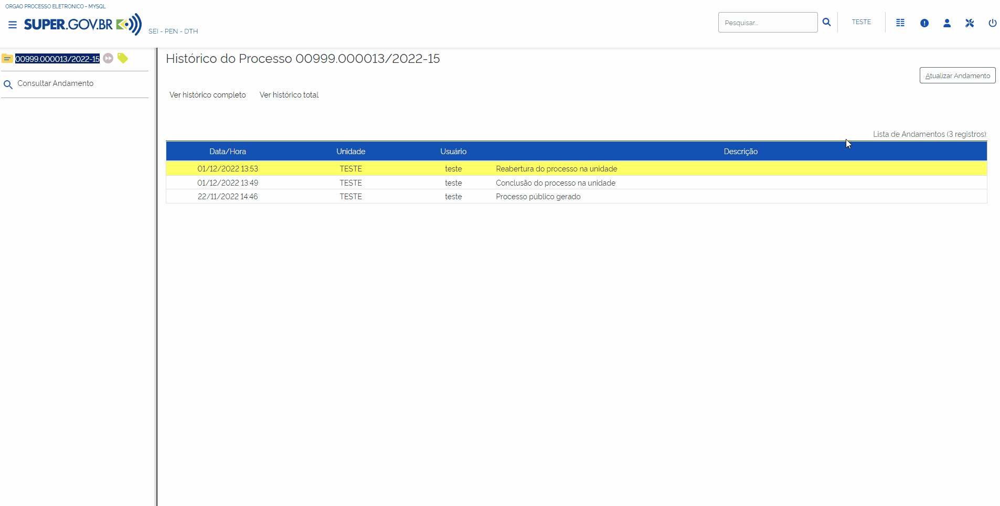

Atualizando Andamento do Processo
---------------------------------

O recurso Atualizar Andamento permite acrescentar informações ao Histórico do processo.

É possível utilizar esse recurso por meio de uma das opções abaixo:

* Na tela do processo, clique em seu número e, depois, no ícone “**Atualizar Andamento**” |atualizar_andamento|, disponível na Barra de Ícones. 

.. figure:: _static/images/11-ARIP-tela_processo_atualizar_andamento.gif

* Na tela do processo, selecione a opção “ |lupa| **Consultar Andamento**”, que fica logo abaixo da Árvore do Processo. Em seguida no botão “**Atualizar Andamento**”, existente na tela Histórico do Processo.

.. figure:: _static/images/11-ARIP-tela_processo_consultar_andamento.gif

* Na tela “**Controle de Processos**”, marque a caixa de seleção ao lado do número do processo e clique no ícone “**Atualizar Andamento**” |atualizar_andamento|.

.. figure:: _static/images/11-ARIP-tela_controle_consultar_andamento.gif

Ao utilizar uma das opções acima, o sistema abrirá a tela “**Atualizar Andamento**”. Nela, as informações que serão acrescentadas ao Histórico do processo deverão ser digitadas no campo “**Descrição**”, que é de livre preenchimento. Após o preenchimento, clicar em “**Salvar**”.

.. figure:: _static/images/11-ARIP-tela_processo_atualizar_andamento_formulario.gif

.. admonition:: Notas

   1. A atualização manual no Histórico do processo é indicada para registros meramente descritivos ou explicativos. Informações essenciais à instrução processual deverão ser inseridas como um novo documento.

   2. O registro inserido no Histórico do processo aparecerá na Lista de Andamentos e não poderá ser editado nem excluído. Em caso de erro, o usuário poderá inserir outro registro retificando a informação.

Acompanhamento Especial
+++++++++++++++++++++++

O recurso Acompanhamento Especial permite o acompanhamento do trâmite e das atualizações posteriores de:

- processos públicos; 
- processos restritos: que já tramitaram pela unidade; e 
- processos sigilosos: somente por usuários que possuem credencial de acesso ao processo.

A inclusão de um processo em acompanhamento especial poderá ser feita por meio da “**tela de Controle de Processos**” ou por meio da “tela do processo".

* Inclusão por meio da Tela de Controle de Processos:

O usuário deverá selecionar um processo e clicar no ícone “**Acompanhamento Especial**” |acompanhamento_especial|.

.. |acompanhamento_especial| image:: _static/images/11-ARIP-icone_acompanhamento_especial.png
   :align: middle
   :width: 30

.. figure:: _static/images/11-ARIP-tela_controle_acompanhamento_especial.gif

.. admonition:: Nota

   É possível colocar mais de um processo em acompanhamento especial. Para isso, o usuário deverá selecionar todos os processos que deseja colocar em acompanhamento especial e clicar em “**Acompanhamento Especial**” |acompanhamento_especial|.

.. |acompanhamento_especial| image:: _static/images/11-ARIP-icone_acompanhamento_especial.png
   :align: middle
   :width: 25

A tela “**Novo Acompanhamento Especial**” será aberta. Nela, o usuário terá três possibilidades:
 
**1. incluir o processo em acompanhamento especial sem associação a Grupo**: nesse caso, o usuário deverá clicar no botão “**Salvar**”.

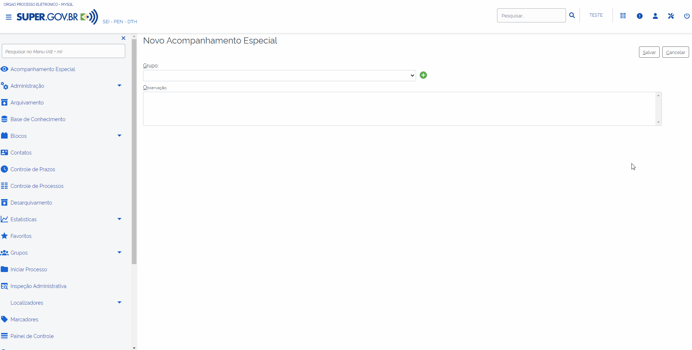

**2. incluir o processo em acompanhamento especial associado a Grupo existente**: nesse caso, o usuário deverá selecionar o grupo no campo “**Grupo**” e clicar em “**Salvar**”.

.. figure:: _static/images/11-ARIP-tela_acompanhamento_especial_grupo.gif

**3. criar um Grupo e associar a um acompanhamento especial**: nesse caso, o usuário deverá clicar no ícone “**Novo Grupo de Acompanhamento**” |mais|, cadastrar o novo Grupo e, em seguida, clicar em “**Salvar**”.

.. |mais| image:: _static/images/2-OBCP_Atribuir_icone_Exibir_todos_os_tipos.png
   :align: middle
   :width: 25

.. figure:: _static/images/11-ARIP-tela_acompanhamento_especial_novo_grupo.gif

.. figure:: _static/images/11-ARIP-tela_acompanhamento_especial_grupo_criado.gif

.. admonition:: Nota

   O campo “Observação” poderá ser preenchido em ambas as hipóteses. Nele o usuário poderá incluir informações que definam o motivo ou que diferenciem o acompanhamento especial.

* **Inclusão por meio da Tela de Processos**:

O usuário deverá acessar o processo desejado e clicar no ícone “**Acompanhamento Especial**” |acompanhamento_especial|.

.. |acompanhamento_especial| image:: _static/images/11-ARIP-icone_acompanhamento_especial.png
   :align: middle
   :width: 25

.. figure:: _static/images/11-ARIP-tela_processo_acompanhamento_especial.gif

O usuário será direcionado para a tela “**Novo acompanhamento Especial**”. Nela, o usuário terá três possibilidades:

1. **incluir o processo em acompanhamento especial sem associação a Grupo**;
2. **incluir o processo em acompanhamento especial associado a Grupo existente**;
3. **criar um Grupo e associar a um acompanhamento especial**.

A forma de operação de cada umas destas possibilidades está descrita na seção anterior.

Após o cadastro do Acompanhamento Especial no Processo (clique no botão Salvar), o usuário será direcionado para a tela “**Acompanhamentos Especiais do Processo**”, que concentra todos os acompanhamentos especiais atribuídos ao processo. Nela o usuário poderá:

* **adicionar outro Acompanhamento Especial ao processo**: para isso, clicar no botão “**Adicionar**”;
* **excluir o Acompanhamento existente**: para isso, clicar no botão “**Excluir Acompanhamento**” |excluir| do respectivo acompanhamento, ou selecionar o acompanhamento desejado e clicar no botão “**Excluir**”; ou
* editar o Acompanhamento: para isso, clicar no botão “**Alterar Acompanhamento**” |editar| do respectivo acompanhamento.

.. |excluir| image:: _static/images/3-OBCP_icone_exclusao.png
   :align: middle
   :width: 30

.. |editar| image:: _static/images/3-OBCP_icone_edicao.png
   :align: middle
   :width: 30

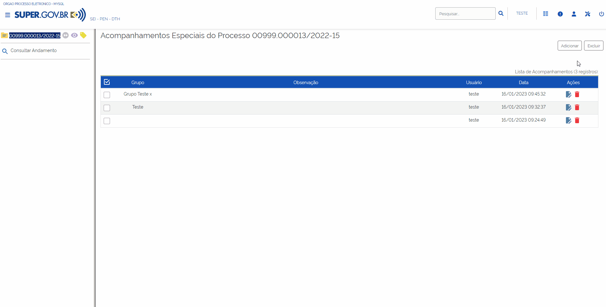

Os processos incluídos em Acompanhamento Especial receberão o ícone  , à direita de seu número. Ao posicionar o cursor sobre esse ícone, o usuário conseguirá visualizar quantos Acompanhamentos Especiais há no processo. Para visualizar os Acompanhamentos Especiais do processo, basta clicar sobre esse ícone.

.. figure:: _static/images/11-ARIP-tela_acompanhamento_especial_sinalizadores.gif

.. admonition:: Notas

   1. Além da opção apresentada, será possível criar um Grupo de Acompanhamento por meio do menu “**Acompanhamento Especial**”, disponível no menu principal. Na tela Acompanhamento Especial, clicar em “**Listar Grupos**” e, em seguida, “**Novo**”.

   2. Os processos incluídos em Blocos Internos poderão ser incluídos também em Acompanhamento Especial, por meio do botão “**Incluir em Acompanhamento Especial**”. Maiores informações poderão ser consultas na seção “**Bloco Interno**”.

Visualizando processos incluídos em Acompanhamento Especial
-----------------------------------------------------------

Para visualizar a relação de processos incluídos em “**Acompanhamento Especial**” pela sua unidade, o usuário deverá acessar o menu “**Acompanhamento Especial**” existente no **Menu Principal**.

.. figure:: _static/images/11-ARIP-menu_principal_acompanhamento_especial.gif

Na tela seguinte, todos os processos incluídos em “Acompanhamento Especial” serão exibidos.

Nesta tela será possível:

1. Filtrar a visão da tela pelo grupo desejado: para tanto, basta indicar no campo “**Grupo**”, o grupo desejado.
2. Visualizar o contador com quantidade de acompanhamentos para os parâmetros definidos na pesquisa.
3. Pesquisar: para tanto, indicar o termo no campo “**Palavras-chave para pesquisa**” e clicar no botão “**Pesquisar**”. A pesquisa tem como base os termos existentes no campo “Observações” do acompanhamento.
4. Listar Grupos: permite que o usuário visualize todos os Grupos de Acompanhamento existentes na unidade. Além disso, possibilita a criação de novos Grupos, por meio do botão “**Novo**”.
5. Alterar Grupo: permite a alteração do Grupo de Acompanhamento em lote. Para isso, basta selecionar os processos cujo Grupo de Acompanhamento Especial será alterado e clicar no botão “**Alterar Grupo**”.
6. Coluna Ações: encontram-se os ícones “**Alterar Acompanhamento**” |editar| e “**Excluir Acompanhamento**” |excluir|, correspondentes a cada processo.
7. Excluir: permite a exclusão do Grupo de Acompanhamento em lote. Para isso, basta selecionar os processos cujo Grupo de Acompanhamento Especial será excluído e clicar no botão “**Excluir**”.
8. Imprimir: permite a impressão da lista de acompanhamento selecionados.
9. Visualização dos sinalizadores dos processos e acesso a suas informações.
10. Possibilidade de acesso aos processos com acompanhamentos especiais.  

.. |excluir| image:: _static/images/3-OBCP_icone_exclusao.png
   :align: middle
   :width: 30

.. |editar| image:: _static/images/3-OBCP_icone_edicao.png
   :align: middle
   :width: 30

.. figure:: _static/images/11-ARIP-menu_principal_acompanhamento_especial_opcoes.png

.. figure:: _static/images/11-ARIP-menu_principal_acompanhamento_especial_opcoes.gif

Pesquisa
+++++++++

Em linhas gerais, o recurso permite a realização de Pesquisa: rápida, estruturada ou restrita ao processo.

Para apresentar o resultado, a Pesquisa busca as informações existentes:

* nos dados cadastrais de processos e documentos.
* no conteúdo de documentos criados por meio do Editor de Textos do sistema.
* nos documentos externos digitalizados com uso de Reconhecimento Ótico de Caracteres (OCR).
* nos documentos externos em formato texto.

Pesquisa Rápida
---------------

A Pesquisa Rápida é indicada para informações simples e certas, como protocolos, números de processos e palavras.

Para realizar uma **Pesquisa Rápida**, o usuário deverá inserir a informação a ser procurada no campo “**Pesquisar...**”, localizado na Barra de Ferramentas, e, em seguida, clicar em “**Enter**” do teclado ou no ícone “**Pesquisa Rápida**” |lupa|.

.. figure:: _static/images/11-ARIP-tela_controle_pesquisa.gif

Pesquisa Estruturada
--------------------

Para realizar uma pesquisa mais estruturada, o usuário deverá acessar a opção “**Pesquisa**”, existente no Menu Principal.

.. figure:: _static/images/11-ARIP-menu_principal_pesquisa.gif

A tela “**Pesquisa**” possui vários campos que, se preenchidos adequadamente, facilitam a localização de processo e documentos. Os campos disponíveis fornecem informações à Pesquisa que permitem a otimização das buscas realizadas.

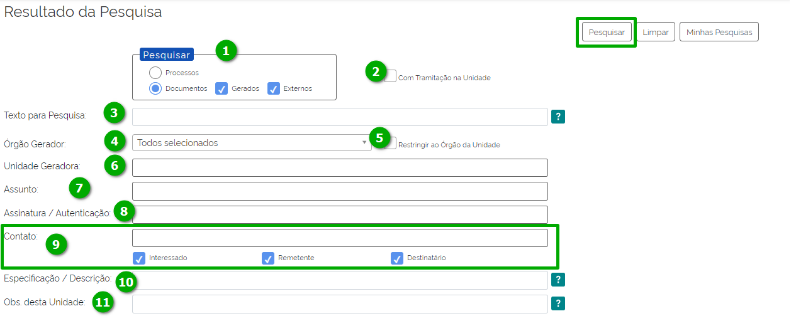

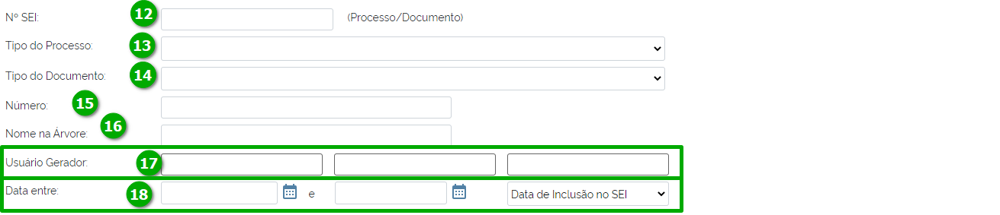

1. **Seção Pesquisar**: será possível indicar se a pesquisa será com base em processos ou documentos.

* Sendo processos, será possível considerar documentos na pesquisa;
* Sendo documento, será possível indicar se são documentos gerados, externos, nenhum destes ou ambos.

2. **Com Tramitação na Unidade**: flag que indicará se a pesquisa deverá considerar documentos ou processos com tramitação na unidade do usuário que está acessando o sistema.

3. **Texto para pesquisa**: campo de livre preenchimento para inclusão de palavras ou termos para pesquisa.

4. **Órgão Gerador**: permite a seleção do órgão gerador do processo ou documento objeto da pesquisa. Podem ser selecionados um ou mais órgãos neste campo.

5. **Restringir ao Órgão da Unidade**: esta flag possibilita que a pesquisa seja restrita ao órgão da unidade ao qual o usuário que está acessando o sistema está vinculado.

6. **Unidade Geradora**: permite a indicação da unidade geradora do processo ou documento objeto da pesquisa. Podem ser selecionados uma ou mais unidades neste campo.

7. **Assunto**: permite o usuário selecionar um ou mais assuntos envolvidos no processo ou documento objeto da pesquisa.

8. **Assinatura / Autenticação**: permite que o usuário indiquei um ou mais usuários que tenham assinado ou certificado documentos no SUPER.GOV.BR.

9. **Contato**: permite que sejam pesquisados processos ou documentos que tenham as pessoas física e jurídicas indicadas neste campo. O conteúdo deste campo é restrito aos contatos previamente cadastrados no SUPER.GOV.BR.
Será possível filtrar ainda mais esta pesquisa com a marcação das flags: Interessado, Remetente e Destinatário.

10. **Especificação / Descrição**: permite filtrar a pesquisa por termos relativos a especificação / descrição.

11. **Obs. desta Unidade**: permite filtrar a pesquisa por termos relativos a observações da unidade do usuário que está acessando o sistema.

12. **Nº SEI**: utilizado para pesquisa do processo ou documento pelo número SUPER.GOV.BR.

13. **Tipo do Processo**: campo para seleção dos tipos de processo que deseja incluir na pesquisa.

14. **Tipo do Documento**: campo para seleção dos tipos de documento que deseja incluir na pesquisa.

15. **Número**: campo utilizado para pesquisas pelo NUP.

16. **Nome na Árvore**: campo utilizado para pesquisas pelo nome na árvore.

17. **Usuário Gerador**: permite que sejam pesquisados os documentos gerados pelos usuários indicados neste campo. Há a possibilidade de inclusão de até três usuários neste filtro de pesquisa.

18. **Data entre**: permite que o usuário filtre um período de pesquisa, que deverá ter um início e fim. Quando utilizado este filtro, o usuário deverá indicar se o intervalo é relacionado à data de inclusão no SUPER.GOV.BR ou pela data do Processo / Documento.

Após a seleção dos parâmetros de pesquisa desejados, o usuário deverá clicar no botão “**Pesquisar**”

Ao apresentar o resultado da Pesquisa, o sistema poderá:

* abrir automaticamente o processo ou documento pesquisado (caso seja um único resultado); ou 
* apresentar uma lista de processos e documentos, na tela Resultado da Pesquisa (se houver mais de um resultado).

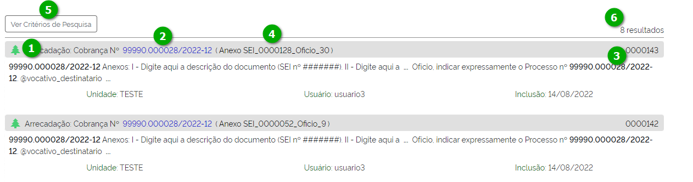

O resultado da pesquisa apresentará algumas possibilidades em tela, quais sejam:

1. Clicar sobre o ícone  : será aberta a tela do processo, com o documento localizado selecionado.
2. Clicar sobre o número do processo: será aberta a tela do processo, com o documento localizado selecionado.
3. Clicar sobre o número do documento: será aberto o documento localizado.
4. Clicar sobre o nome do documento: será aberto o documento localizado.
5. Botão “**Ver Critérios do Filtro**”: retorna a tela aos critérios adotados na pesquisa.
6. Totalizador do resultado da pesquisa: possibilita que o usuário saiba a totalidade de registros para a pesquisa e quantos estão disponíveis em tela.

Ainda na tela “**Resultado da Pesquisa**”, existem outras opções disponíveis relacionadas a uma pesquisa.

.. figure:: _static/images/11-ARIP-Pesquisa_estruturada_botoes.png

* **Botão Limpar**: apagará os dados informados nos campos de filtro utilizados para a última pesquisa. 
* **Botão Salvar Pesquisa**: opção permite que o usuário salve os critérios aplicados para a pesquisa. Após clicar no botão Salva Pesquisa, o usuário deverá indicar o nome da pesquisa a ser armazenada e clicar em “Salvar”.

.. figure:: _static/images/11-ARIP-Pesquisa_estruturada_salvar_pesquisa.gif

.. figure:: _static/images/11-ARIP-Pesquisa_estruturada_salvar_pesquisa.png

* **Botão Minhas Pesquisas**: opção para seleção dos critérios de pesquisas salvos que deseja aplicar. Nela também é possível editar uma pesquisa salva, por meio do botão “**Alterar Pesquisa**” |editar|, ou excluir uma pesquisa salva, por meio do botão “**Excluir Pesquisa**” |excluir|.

.. |excluir| image:: _static/images/3-OBCP_icone_exclusao.png
   :align: middle
   :width: 25

.. |editar| image:: _static/images/3-OBCP_icone_edicao.png
   :align: middle
   :width: 25

.. figure:: _static/images/11-ARIP-Pesquisa_estruturada_salvar_pesquisa_acoes.gif

.. admonition:: Notas

   1. Os campos “**Texto para Pesquisa**”; “**Especificação / Descrição**” e “**Obs. desta Unidade**” podem ser pesquisados por:

   * Palavras, Siglas, Expressões ou Números. Para pesquisa de expressões, os caracteres deverão estar entre aspas. Ex.: “Imposto de Renda”. 
   * Registros que contenham parte de uma palavra ou número. Para estes casos, deverá ser utilizado o caractere Asterisco “*” para complementação do termo. Ex.: Embarg*. Esta pesquisa retornará os processos ou documentos que tenham o termo embargo e suas variações.
   * Mais de uma palavra ou expressão. Para tanto, o usuário deverá utilizar o conector (E) entre as palavras/ termos. Ex.: móvel e licitação.
   * Pesquisa por registros que contenham pelo menos uma das palavras ou expressões. Neste caso, o usuário irá utilizar o conector (OU) na pesquisa.
   * Recupera registros que contenham a primeira, mas não a segunda palavra ou expressão, isto é, exclui os registros que contenham a palavra ou expressão seguinte ao conector (NÃO).

   2. Em caso de dúvidas, o usuário poderá clicar no ícone de “**Ajuda para Pesquisa**” |duvida| , disponível ao lado do campo.
   3. Processos e documentos sigilosos não são recuperados pela Pesquisa.
   4. Processos e documentos restritos, nas unidades em que o processo não tenha tramitado, são recuperados somente pela **Pesquisa Rápida**. Entretanto, essas unidades conseguirão apenas visualizar a Árvore do Processo e utilizar a funcionalidade Consultar Andamento. Elas não terão acesso ao conteúdo dos documentos.

.. |duvida| image:: _static/images/11-ARIP-icone_duvida.png
   :align: middle
   :width: 25

Pesquisa no Processo
--------------------

A Pesquisa restrita ao processo é muito útil em processos com grande quantidade de documentos. Para realizá-la, o usuário deverá acessar o processo e clicar no ícone “**Pesquisar no Processo**” |pesquisa_pasta| .

.. figure:: _static/images/11-ARIP-tela_processo_pesquisa_pasta.gif

Na tela “**Pesquisar no Processo**”, digitar, no campo apropriado, a informação a ser pesquisada.

.. figure:: _static/images/11-ARIP-Pesquisa_processo_botao_pesquisar.gif

.. admonition:: Nota

   A pesquisa poderá ser realizada por palavras, siglas, expressões ou número. O campo permite também o uso de conectores, como visto no tópico anterior.

Ao apresentar o resultado da Pesquisa, o sistema poderá:

* abrir automaticamente o documento que atende ao critério de pesquisa; ou 
* apresentar uma lista com todos os resultados que atendam aos critérios da pesquisa. Nesse caso, o usuário terá três possibilidades:

  1. clicar sobre o número do processo: será aberta nova janela do processo, com o documento em que a informação foi localizada selecionado.

  2. clicar sobre o número do documento: será aberto o documento em que a informação foi localizada.

  3. clicar sobre o nome do documento: será aberto o documento em que a informação foi localizada.

.. figure:: _static/images/11-ARIP-Pesquisa_pasta_resultado.png

.. admonition:: Notas

   1. A indexação de termos pelo sistema pode levar alguns minutos. Portanto, se determinada informação for inserida e imediatamente pesquisada, a busca não retornará resultados.

   2. Informações inseridas em documentos não assinados serão localizadas somente no âmbito da unidade que os produziu.

Estatística
+++++++++++

Recurso que permite a visualização das Estatísticas da Unidade e do Desempenho de Processos. Possibilita também a localização de processos e documentos que tramitaram na unidade.

Estatísticas da Unidade
-----------------------

O usuário deverá acessar o menu “**Estatísticas**”, opção “**Unidade**”, existente no menu principal. 

.. figure:: _static/images/11-ARIP-estatistica_unidade_menu_principal.gif

Na tela “**Estatísticas da Unidade**”, informe o período desejado para o resultado das Estatísticas e, em seguida, clique no botão Pesquisar. Os campos referentes ao período podem ser preenchidos por meio de digitação da data ou por meio da seleção de uma data nos calendários que serão disponibilizados quando o usuário clicar nos ícones “Selecionar Data Inicial” e “**Selecionar Data Final**”.

.. figure:: _static/images/11-ARIP-estatistica_unidade_calendario.gif

Após clicar em “**Pesquisar**”, a tela “**Estatísticas da Unidade**” apresentará tabelas e gráficos com as seguintes informações estatísticas:

* Processos gerados no período.
* Processos com tramitação no período.
* Processos com andamento fechado na unidade ao final do período.
* Processos com andamento aberto na unidade ao final do período.
* Tempos médios de tramitação no período.
* Documentos gerados no período.
* Documentos externos no período.

Tais informações são apresentadas em tabelas e gráficos, por tipo de processo e tipo de documento.

.. figure:: _static/images/11-ARIP-estatistica_unidade_resultado.png

.. figure:: _static/images/11-ARIP-estatistica_unidade_resultado.gif

A identificação da categoria das informações relacionadas a tabela e gráfico estão disponíveis em seus cabeçalhos (1).

Para localizar um processo ou um documento, clique nos números referentes à quantidade de cada um dos tipos de processo ou de documento (2), exibidos nas tabelas ou nas colunas dos gráficos (3) de determinada informação estatística. Assim, será aberta a janela correspondente ao tipo selecionado em cada tabela ou gráfico.

.. figure:: _static/images/11-ARIP-estatistica_unidade_lista_processos.gif

Ao passar o cursor do mouse em cima das colunas gráficas, será apresentada o rótulo de dados, com a informação relacionada ao processo ou documento e a sua quantidade.

.. figure:: _static/images/11-ARIP-estatistica_unidade_informacao_grafico.gif

.. admonition:: Notas

   1. As minutas de documentos também serão contabilizadas como documentos gerados no período.

   2. O usuário pode, se desejar, ocultar a exibição dos gráficos correspondentes às tabelas. Para isso, basta clicar no botão “**Ocultar Gráfico**” correspondente a cada tabela. Para visualizá-los novamente, clique no botão “**Ver Gráfico**”.

Estatísticas de Desempenho de Processos
---------------------------------------

O usuário deverá acessar o menu “**Estatísticas**”, opção “**Desempenho de Processos**”, existente no menu principal.

.. figure:: _static/images/11-ARIP-estatistica_desempenho_processo.gif

Na tela “**Estatísticas de Desempenho de Processos**”, o usuário poderá: 

* selecionar o “**Órgão**”; 
* preencher o campo Tipo de Processo ou selecione o(s) tipo(s) de processo, por meio do ícone “**Selecionar Tipo de Processo**” |lupa|;
* preencher o campo “**Período**” ou selecione uma data, por meio dos ícones “**Selecionar Data Inicial**” |calendario| e “**Selecionar Data Final**” |calendario|; 
* marcar a opção “**Considerar apenas processos concluídos**”; e
* clicar em “**Pesquisar**”.

.. |calendario| image:: _static/images/11-ARIP-icone_calendario.png
   :align: middle
   :width: 30

.. figure:: _static/images/11-ARIP-estatistica_desempenho_campos.png

 

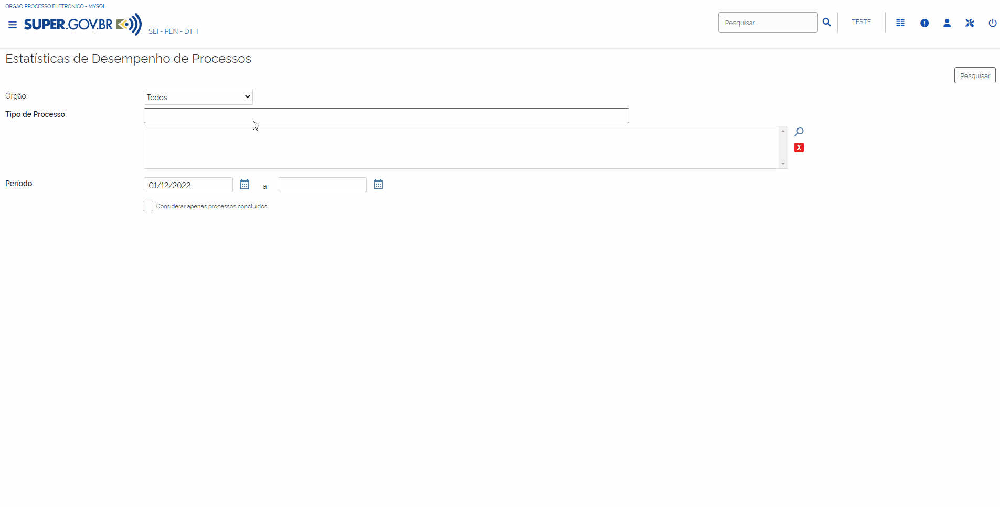

Será exibida uma tabela com a Lista de desempenho de processos no período. Nela, há as seguintes informações: **Tipo do processo, Quantidade de processos por tipo e Tempo Médio de trâmite dos tipos de processo no Órgão**. Além da tabela, será exibido o gráfico correspondente a ela.

Para acessar informações detalhadas de determinado Tipo de processo, clique na “Quantidade” (1) ou no “Tempo Médio” (2) correspondente ao tipo na tabela ou na coluna do gráfico correspondente (3).

.. figure:: _static/images/11-ARIP-estatistica_desempenho_campos_identificacao.png

Será exibida a janela “**Desempenho por Processo**” referente ao Tipo de processo selecionado. Nessa janela, constam as seguintes informações por processo:

* Quantidade de registros disponíveis em tela;
* número do Processo;
* data e hora da Abertura;
* data e hora da Conclusão;
* Tempo de trâmite no Órgão, se for o caso; e
* link “**Detalhar por Unidade**”.

.. figure:: _static/images/11-ARIP-estatistica_desempenho_listagem_processo.png

Ao clicar no link “**Detalhar por Unidade**”, será aberta a tela Desempenho por Unidade. Nela, será exibida a Lista de Registros de Detalhamento do tipo de processo selecionado, com as seguintes informações: **Órgão, Unidade, Quantidade de processos e Tempo Médio na Unidade**.

.. figure:: _static/images/11-ARIP-estatistica_desempenho_resultado.gif

Caso o usuário deseje acessar os processos específicos de uma unidade, deverá clicar no número correspondente na coluna Quantidade ou na coluna Tempo Médio na Unidade. Assim, será aberta a tela Desempenho dos Processos na Unidade. Nela, será possível acessar cada processo, clicando em seu número.

Para retornar às telas anteriores, clique no botão Fechar em cada uma das telas.

Ponto de controle
+++++++++++++++++

Recurso que permite atribuir fases ou categorias para acompanhamento de processos.

Para atribuir um ponto de controle a um processo, o usuário deverá acessar o processo e clicar no ícone “Gerenciar Ponto de Controle” |ponto_de_controle| (1); ou selecionar um processo na tela de Controle de Processo e clicar no ícone “Gerenciar Ponto de Controle” |ponto_de_controle| (2).

.. figure:: _static/images/11-ARIP-tela_processo_ponto_controle.png

.. figure:: _static/images/11-ARIP-tela_controle_ponto_controle.png

.. admonition:: Nota

   Será possível atribuir um ponto de controle a vários processos (atribuição em lote), selecionando todos os processos desejados, na tela de “**Controle de Processos**”, e clicando no ícone "**Gerenciar Ponto de Controle**” |ponto_de_controle|.

Na tela seguinte, selecionar a fase/controle adequado, no campo “**Ponto de Controle**”, e, em seguida, clicar em “**Salvar**”.

Após esta ação, um ícone “**Ponto de Controle**” |ponto_de_controle| ficará posicionado ao lado do número do processo. Ao passar o cursor sobre este ícone, será possível ver a fase/categoria em que o processo se encontra.

.. figure:: _static/images/11-ARIP-tela_processo_ponto_controle_sinalizador_info.gif

Ao clicar sobre esse ícone, será aberta a tela “**Gerenciar Ponto de Controle**”. Nela, é possível visualizar o Histórico de Pontos de Controle e alterá-los, se necessário.

.. figure:: _static/images/11-ARIP-tela_ponto_controle_formulario.gif

.. admonition:: Nota

   Os Pontos de Controle disponíveis para seleção dos usuários devem ser definidos previamente pela Unidade e cadastrados pelo administrador do sistema no SUPER.GOV.BR.

Consultando Processos com Ponto de Controle
-------------------------------------------

Para consultar os processos com **Ponto de Controle**, o usuário deverá clicar no menu “**Pontos de Controle**”, existente no menu principal.

.. figure:: _static/images/11-ARIP-ponto_controle_menu_principal.gif

Na tela “**Pontos de Controle**”, é possível recuperar informações em forma de tabela ou gráficos. Para isso, basta selecionar o “**Tipo do Processo**” e/ou o “Ponto de Controle” desejado, por meio das respectivas caixas de seleção, e clicar no botão “**Pesquisar Processos**” ou “**Gerar Gráficos**”. Caso, o usuário deseje ver também os pontos de controle que foram desativados, basta selecionar a flag “**Incluir desativados**”.

.. figure:: _static/images/11-ARIP-tela_ponto_controle_campos.png

* **Pesquisar Processos**: ao clicar nesse botão, será apresentada uma tabela contendo os processos incluídos em “**Pontos de Controle**”, de acordo com o filtro escolhido para pesquisa. Para acessar um processo, clicar sobre seu número. Para alterar ou excluir o “**Ponto de Controle**”, utilize o ícone “**Gerenciar Ponto de Controle**” |ponto_de_controle|  correspondente a cada processo, na coluna Ações.

.. figure:: _static/images/11-ARIP-tela_ponto_controle_processo.gif

* **Gerar Gráficos**: ao clicar nesse botão, serão apresentados gráficos conforme os parâmetros informados no filtro para pesquisa.

.. figure:: _static/images/11-ARIP-ponto_controle_graficos.gif

O primeiro gráfico (Geral) abrange todos os processos inseridos em Pontos de Controle, de acordo com o filtro efetuado para a geração do gráfico. Ao posicionar o cursor sobre as colunas do gráfico, é possível identificar a quantidade de processos em cada Ponto de Controle (fase/categoria).

Os demais gráficos representam cada Ponto de Controle (fase/categoria) separadamente e, ao posicionar o cursor sobre suas colunas, é possível identificar a quantidade de processos por tipo de processo.

Em cada gráfico, para acessar os processos correspondentes a determinada coluna, clique sobre ela. Assim, será aberta a janela Controle da Unidade. Nela, serão exibidos todos os processos, de acordo com a coluna selecionada. Para acessar um processo, clique sobre seu número.

.. figure:: _static/images/11-ARIP-ponto_controle_selecao_processos.gif

.. admonition:: Nota

   Caso o “**Ponto de Controle**” não seja removido do processo, antes de sua conclusão ou antes de seu envio a outra unidade, ele continuará figurando na tabela e nos gráficos dos Pontos de Controle.

Alterando ou Retirando um Ponto de Controle do Processo
-------------------------------------------------------

Para alterar ou retirar um ponto de controle, o usuário deverá acessar o processo (1) ou marque a caixa de seleção do(s) processo(s) na tela “**Controle de Processos**” (2) e clicar no ícone “**Gerenciar Ponto de Controle**” |ponto_de_controle| .

.. figure:: _static/images/11-ARIP-gerenciar_ponto_controle_tela_processo.png

.. figure:: _static/images/11-ARIP-gerenciar_ponto_controle_tela_controle.png

Na tela “**Gerenciar Ponto de Controle**”, no campo “**Ponto de Controle**”, selecionar outro Ponto de Controle para alterar a fase ou selecionar a primeira opção da lista (em branco) para retirar o Ponto de Controle. Em seguida, clicar em “**Salvar**”.

.. figure:: _static/images/11-ARIP-tela_ponto_controle_alteracao.gif

Para retirar o ponto de controle, o usuário deverá selecionar a opção vazio (1ª opção) do campo “**Ponto de Controle**”.

.. admonition:: Notas

   1. Todas as fases do Ponto de Controle incluídas no processo ficam registradas no “**Histórico de Pontos de Controle**”.

   |historico_controle|

   2. Ao ser removido o ponto de controle do processo, o ícone “**Ponto de Controle**” não aparecerá mais ao lado do número processo, nem na tela do processo e nem na tela “**Controle de Processos**”. Para ser visualizado o “**Histórico de Pontos de Controle**”, será necessário acessar o processo e clicar no ícone “**Gerenciar Ponto de Controle**” |ponto_de_controle| ou marcar a caixa de seleção do processo, na tela “**Controle de Processos**”, e clicar no mesmo ícone existente na Barra de Ícones. 

.. |historico_controle| image:: _static/images/11-ARIP-ponto_controle_historico.png
   :align: middle
   :width: 1000

Painel de Controle
++++++++++++++++++

Funcionalidade que possibilita ao usuário ter uma visão resumida e personalizada dos processos da unidade.
Para acessar, o usuário deverá clicar na opção “**Painel de Controle**”, disponível no Menu Principal.

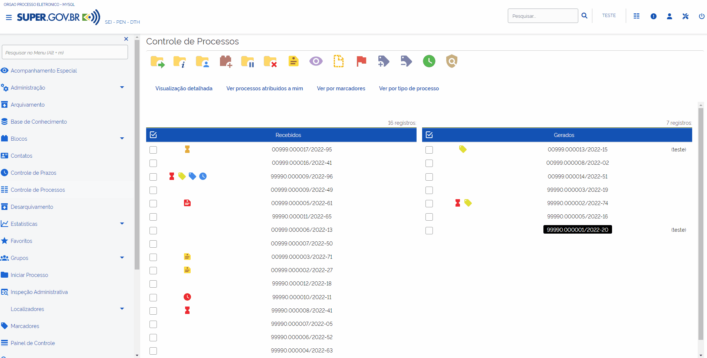

Estrutura do Painel de Controle
-------------------------------

Na tela Painel de Controle, conforme a configuração, poderão ser encontradas as seguintes informações sobre os processos da unidade:

* Processos abertos
* Controle de prazos
* Retornos Programados
* Blocos de Assinatura abertos
* Grupos de blocos de assinatura abertos
* Processos abertos por tipo
* Marcadores em processos
* Atribuições de processos
* Acompanhamentos Especiais em processos

.. figure:: _static/images/11-ARIP-Painel_controle_tela1.png

.. figure:: _static/images/11-ARIP-Painel_controle_tela2.png

.. figure:: _static/images/11-ARIP-Painel_controle_tela3.png

Processos abertos
~~~~~~~~~~~~~~~~~~~~~~~~

Exibe a informação do Total de processos abertos na unidade. Mostra ainda o número de processos abertos Recebidos, Gerados, Sem Acompanhamento e Não Visualizados. 

.. admonition:: Nota

   Na coluna com o ícone |alerta|, há o número de processos abertos em que um documento foi incluído ou assinado.

Para acessar os processos, o usuário poderá clicar no número referente à informação desejada.

.. figure:: _static/images/11-ARIP-painel_conrtole_processos.gif

Será aberta a Lista dos Processos de acordo com a opção escolhida. Para acessar um processo da Lista, clicar sobre seu número.

.. figure:: _static/images/11-ARIP-Painel_controle_tela_controle_processos.png

Essa tela permite ao usuário a realização de algumas ações, por meio da seleção de um ou mais processos e clique nos ícones presentes na tela. Além disso, será possível ter diferentes formas de visualização dos processos tramitando na unidade, por meio da utilização dos filtros existentes em tela. 

.. figure:: _static/images/11-ARIP-Painel_controle_tela_controle_processos_opcoes.png

Ao clicar no filtro “**Configurar nível de detalhe**”, será possível definir os dados referentes ao processo para exibição na Lista de Processos.

.. figure:: _static/images/11-ARIP-Painel_controle_tela_controle_processos_filtros.gif

Cada item selecionado na janela “**Configurar Nível de Detalhe**” corresponderá a uma coluna nas Listas de Processos, que serão apresentadas de acordo com a opção selecionada no Painel de Controle.

.. figure:: _static/images/11-ARIP-Painel_controle_tela_controle_nivel_detalhe.png

Controles de Prazos
~~~~~~~~~~~~~~~~~~~~~~~~~~~~

Apresenta o número de processos da unidade com Controle de Prazo por tipo: **Em andamento, Atrasados e Concluídos**.

.. admonition:: Nota
 
   Na coluna com o ícone |alerta|, há informação do número de processos com Controle de Prazos em que um documento foi incluído ou assinado.

Diferentemente do Retorno Programado, o Controle de Prazo é inserido nos processos pela própria unidade. Para visualizar os processos com Controles de Prazos, o usuário deverá clicar sobre o número referente à informação desejada.

.. figure:: _static/images/11-ARIP-painel_controle_controle_prazos.png

Após o clique, a tela “Controle de Processos” será aberta com a exibição da Lista de Processos por Controle de Prazo.

.. figure:: _static/images/11-ARIP-painel_controle_sinalizadores.png

Na Lista de Processos por Controles de Prazo Em andamento, poderá ser encontrada a informação de quantos dias faltam para o vencimento do prazo. Essa informação será exibida na coluna Controle de Prazo, bem como ao posicionar o cursor sobre o ícone “Controle de Prazo”. Na Lista de Processos por Controles de Prazo Atrasados, poderá ser visualizada a informação de há quantos dias o prazo já está vencido.

.. admonition:: Notas

  1. No caso de prazos concluídos, a informação de conclusão somente será exibida ao posicionar o mouse sobre o ícone “Controle de Prazo”.

  2. O ícone de “Controle de Prazos” aparecerá na cor laranja, vermelha ou azul, a depender da situação do Prazo, conforme descrito abaixo:

  |controle_prazo_laranja| (laranja) Controle de Prazo Em andamento: indica que o processo possui prazo a vencer.

  |controle_prazo_vermelho|  (vermelho) Controle de Prazo Atrasado: indica que o processo possui prazo vencido.

  |controle_prazo_azul| (azul) Controle de Prazo Concluído: indica que o processo possui prazo concluído.

Retornos Programados
~~~~~~~~~~~~~~~~~~~~~~~~~~~~

Permite visualizar os processos enviados a outras unidades com definição de retorno até determinada data (Aguardando retorno de outras unidades); e indica os processos recebidos na unidade que necessitam ser devolvidos, até determinada data (Processos para devolver), à unidade que os enviou.

Os processos com Retorno Programado são exibidos, no Painel de Controle, por 
tipo:

* **Aguardando retorno de outras unidades**

|retorno_programado_laranja| **Em andamento**: o prazo de retorno por outra unidade ainda não venceu.

|retorno_programado_vermelho| **Atrasado**: o prazo de retorno por outra unidade está vencido.
 
|retorno_programado_azul| **Retornado**: o processo já foi devolvido por outra unidade.

.. |retorno_programado_vermelho| image:: _static/images/11-ARIP-icone_ampulheta_vermelho.png
   :align: middle
   :width: 20

* **Processos para devolver**

|processo_para_devolver_laranja| **Em andamento**: o prazo para devolução à outra unidade ainda não venceu.

|processo_para_devolver_vermelho| **Atrasado**: o prazo para devolução à outra unidade está vencido.

|processo_para_devolver_azul| **Devolvido**: o processo já foi devolvido à outra unidade.

.. |processo_para_devolver_vermelho| image:: _static/images/11-ARIP-icone_processo_devolver_vermelho.png
   :align: middle
   :width: 25

.. |processo_para_devolver_azul| image:: _static/images/11-ARIP-icone_processo_devolver_azul.png
   :align: middle
   :width: 25

.. admonition:: Nota

   Na coluna com o ícone |alerta|, há informação do número de processos com Retorno Programado em que um documento foi incluído ou assinado.

Para visualizar os processos com “**Retornos Programados**”, clicar em cima dos números, nas colunas referentes à informação desejada.

.. figure:: _static/images/11-ARIP-painel_controle_visualizar_retornos_programados.png

Na tela “**Controle de Processos**”, será exibida a Lista de Processos por Retorno Programado.

.. figure:: _static/images/11-ARIP-painel_controle_retorno_tela_controle.gif

Blocos de Assinatura abertos
~~~~~~~~~~~~~~~~~~~~~~~~~~~~~~~~~~~~

Possibilita a visualização do número de Blocos de Assinatura abertos por Situação: **Recebidos** (blocos recebidos de outras unidades), **Gerados** (blocos gerados na unidade), **Disponibilizados** (blocos disponibilizados para outras unidades), Retornados (blocos devolvidos por outras unidades).

Em cada uma das Situações, haverá informações sobre o total de Blocos; o total de Documentos contidos em Blocos de Assinatura; e o total de documentos sem assinatura contidos em Blocos.

Para acessar os Blocos de Assinatura ou Documentos contidos nos Blocos, clicar sobre o número existente na coluna que corresponda à informação desejada.

.. figure:: _static/images/11-ARIP-painel_controle_blocos.png

* Ao clicar em um número da coluna “Blocos”, será aberta a tela Blocos de Assinatura. Nela, serão exibidos os Blocos de acordo com a Situação escolhida (Recebido, Gerado, Disponibilizado ou Retornado).

.. figure:: _static/images/11-ARIP-painel_controle_gerenciar_blocos_assinatura.gif

* Ao clicar em um número na coluna “**Documentos**”, serão apresentados todos os documentos contidos em Blocos de Assinatura (com e sem assinatura), conforme a Situação escolhida (Recebido, Gerado, Disponibilizado ou Retornado).

.. figure:: _static/images/11-ARIP-painel_controle_gerenciar_blocos_documentos.gif

* Ao clicar em um número da coluna “**Sem Assinatura**”, visualizará somente os documentos contidos em Blocos que ainda não foram assinados, conforme a Situação escolhida (Recebido, Gerado, Disponibilizado ou Retornado).

.. figure:: _static/images/11-ARIP-painel_controle_gerenciar_blocos_sem_assinatura.gif

Grupo de Blocos de Assinaturas Abertos
~~~~~~~~~~~~~~~~~~~~~~~~~~~~~~~~~~~~~~~

Apresenta, por Grupos de Blocos de Assinatura: 

* o total de blocos de assinatura abertos na unidade; 
* o total de documentos contidos nesses Blocos; e 
* o total de documentos sem assinatura contidos nos Blocos.

.. admonition:: Nota

A categoria “**Sem grupo definido**” concentrará todos os blocos que não foram associados a nenhum Grupo de Bloco de Assinatura.

Para acessar os Blocos de Assinatura ou documentos contidos nos Blocos, clicar sobre o número na coluna correspondente à informação desejada.

.. figure:: _static/images/11-ARIP-painel_controle_acessar_blocos.png

Ao clicar em um número na coluna “**Blocos**”, será aberta a tela “**Blocos de Assinatura**”. Nela, serão exibidos os Blocos de acordo com o Grupo de Blocos de Assinatura selecionado.

.. figure:: _static/images/11-ARIP-painel_controle_gerenciar_blocos_assinatura.gif

Ao clicar em um número na coluna “**Documentos**”, serão apresentados todos os documentos contidos em Blocos de Assinatura (com e sem assinatura), conforme a Situação escolhida (Recebido, Gerado, Disponibilizado ou Retornado).

.. figure:: _static/images/11-ARIP-painel_controle_gerenciar_blocos_documentos.gif

O usuário terá também a opção de clicar em um número na coluna “**Sem Assinatura**”, para visualizar somente os documentos contidos em Blocos que ainda não foram assinados referentes ao Grupo de Blocos de Assinaturas selecionado.

Processos Abertos por Tipo
~~~~~~~~~~~~~~~~~~~~~~~~~~~~~~~~~~

Apresenta o total de Processos da unidade por “**Tipo**”.

.. admonition:: Nota
 
   Na coluna com o ícone |alerta|, há informação do número de processos em que um documento foi incluído ou assinado.

Para visualizar a lista de processos, clicar em cima dos números referentes a cada Tipo, na coluna correspondente à informação desejada.

.. figure:: _static/images/11-ARIP-painel_controle_processos_abertos.png

Após o clique, será aberta a tela de “Controle de Processos” com a lista de processos do referido “**Tipo**”.

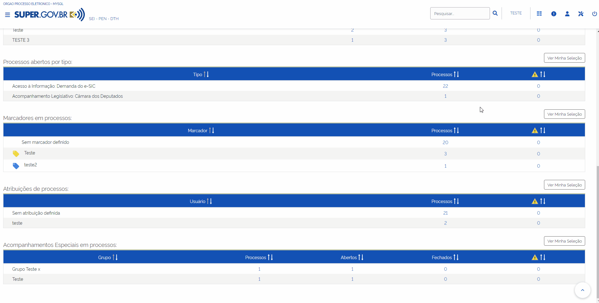

Marcadores em Processos
~~~~~~~~~~~~~~~~~~~~~~~~~~~~~~

Apresenta o número de Processos por “**Marcador**” e o número de processos sem marcador definido. 

.. admonition:: Nota
 
   Na coluna com o ícone |alerta|, há informação do número de processos em que um documento foi incluído ou assinado.

Para visualizar os processos referentes a determinado “**Marcador**” ou sem marcador definido, clicar sobre o número na coluna correspondente à informação desejada.

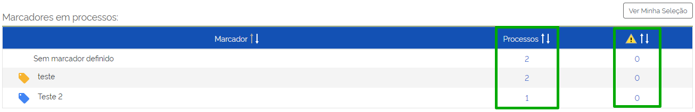

Após o clique, será aberta a tela de “**Controle de Processos**” com a lista de processos do referido “**Marcador**”.

.. figure:: _static/images/11-ARIP-painel_controle_marcador_controle_processo.gif

.. admonition:: Nota

   Caso a coluna “**Marcadores**” não esteja disponível em tela, o usuário poderá configurar a visão por meio do link “**Configurar nível de detalhe**”.

Atribuição de Processos
~~~~~~~~~~~~~~~~~~~~~~~~

Apresenta o número de processos **Atribuídos** a um usuário e de processos sem atribuição definida. 

.. admonition:: Nota

   Na coluna com o ícone |alerta| , há o número de processos atribuídos a um usuário ou sem atribuição definida em que um documento foi incluído ou assinado.

Para visualizar os processos atribuídos a um usuário, clicar sobre o número correspondente à informação desejada, na respectiva coluna.

.. figure:: _static/images/11-ARIP-painel_controle_atribuicao.png

Após o clique, será aberta a tela de “**Controle de Processos**” com a lista de processos atribuídas ao usuário selecionado.

.. figure:: _static/images/11-ARIP-painel_controle_atribuicao_controle_processo.gif

Acompanhamentos Especiais em Processo
~~~~~~~~~~~~~~~~~~~~~~~~~~~~~~~~~~~~~~

Apresenta em tela informações, separadas por Grupos, sobre os processos que foram incluídos em “**Acompanhamento Especial**”, a saber: 

* número total de Processos;
* número de processos Abertos;
* número de processos Fechados;
* número de processos em que um documento foi incluído ou assinado por Grupo de Acompanhamento Especial. Disponível na coluna com o ícone |alerta|.

.. admonition:: Nota

   Os processos incluídos em “**Acompanhamento Especial**”, sem a associação a grupo ficará disponível na categoria “**Sem grupo definido**”.

Para visualizar os processos referentes a determinado Grupo de “**Acompanhamento Especial**” ou **Sem grupo definido**, clicar em cima do número correspondente à informação desejada, na respectiva coluna.

.. figure:: _static/images/11-ARIP-painel_controle_acompanhamento_especial.gif

Configurar Painel de Controle
-----------------------------

O usuário poderá definir as configurações do “**Painel de Controle**” da unidade. Para isso, basta clicar no botão Configurar, disponível na tela “**Painel de Controle**”.

.. figure:: _static/images/11-ARIP-painel_controle_botao_configurar.png

A tela “**Configurar Painel de Controle**” será aberta. Nela, o usuário poderá selecionar as opções que deseja que fiquem visíveis no “**Painel de Controle**” da unidade.

.. figure:: _static/images/11-ARIP-painel_controle_configurar_opcoes1.png
.. figure:: _static/images/11-ARIP-painel_controle_configurar_opcoes2.png

Além disso, será possível utilizar o botão “**Configura Minha Seleção**” para personalizar os resultados do “**Painel de Controle**” sempre que utilizado o botão “**Ver Minha Seleção**”, existente na tela “**Painel de Controle**”.

Exemplo:

.. figure:: _static/images/11-ARIP-painel_controle_configurar_ex1.png

.. figure:: _static/images/11-ARIP-painel_controle_configurar_ex2.png

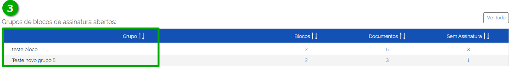

Caso o usuário deseje voltar a visão completa deste item no “**Painel de Controle**”, clicar no botão “**Ver Tudo**”.

.. figure:: _static/images/11-ARIP-painel_controle_configurar_ver_tudo.gif

.. admonition:: Nota

   O recurso de Configurar **Minha Seleção** poderá ser utilizado em: Grupos de Blocos de assinatura abertos, Processos abertos por tipo, Marcadores em processos, Atribuições de processos e Grupos de Acompanhamentos Especiais em processos.

Utilizando o Painel de Controle como Página Inicial
~~~~~~~~~~~~~~~~~~~~~~~~~~~~~~~~~~~~~~~~~~~~~~~~~~~~

Ainda na tela “**Configurar Painel de Controle**” será possível configurar o Painel de Controle para que ele seja a página inicial do usuário que está acessando o sistema, ou seja, ativando esta configuração, o usuário, ao acessar o sistema, será direcionado para a tela “**Painel de Controle**” ao invés da tela “**Controle de Processos**”.

Para configurar esta nova forma de visão, o usuário deverá selecionar a opção “**Utilizar como página inicial**”, existente na tela “**Configurar Painel de Controle**”. Em seguida, clicar no botão “**Salvar**”.

.. figure:: _static/images/11-ARIP-painel_controle_configurar_utilizar_pag_inic.png

Realizada a configuração, após um novo login no sistema, a tela inicial passará a ser a do “**Painel de Controle**”, em substituição à tela “**Controle de Processos**”.

Para retornar à configuração anterior, basta desmarcar a opção “**Utilizar como página inicial**”, existente na tela “**Configurar Painel de Controle**”, e clicar no botão “**Salvar**”.

.. admonition:: Nota

   O Painel de Controle, além de permitir a visualização dos processos de forma resumida e organizada, também é uma funcionalidade que auxilia na recuperação de processos.

Base de Conhecimento
++++++++++++++++++++

Recurso que permite descrever as etapas de um processo visando ao compartilhamento do conhecimento institucional. Por meio da Base de Conhecimento, o usuário terá acesso a um repositório de informações que o auxiliará no desenvolvimento de suas atividades. 

A Base de Conhecimento é associada a tipos de processo.

Para criar uma Base de Conhecimento, o usuário deverá selecionar a opção “Base de Conhecimento” existente no Menu Principal.

.. figure:: _static/images/11-ARIP-base_conhecimento_menu_principal.gif

Na tela “**Base de Conhecimento**”, clicar no botão “**Nova**”.

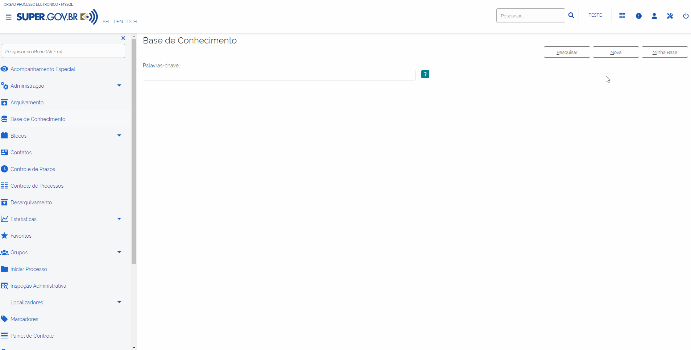

Na tela seguinte, preencher o campo Descrição, selecionar os Tipos de Processo Associados, escolher um arquivo em formato PDF, conforme o caso, e clicar em “**Salvar**”.

.. figure:: _static/images/11-ARIP-base_conhecimento_formulario.gif

Ao clicar em Salvar, uma nova janela será aberta. Nela, o usuário deverá inserir as informações necessárias ao desenvolvimento das atividades, podendo utilizar os recursos disponíveis como: referências a documentos, leis, decretos, portarias e links da intranet ou internet. Após o preenchimento, clicar em “**Salvar**”.

.. figure:: _static/images/11-ARIP-base_conhecimento_documento.png

Na tela “**Base de Conhecimento**”, o usuário poderá, dependendo da situação em que a Base se encontra, realizar as seguintes ações:

* Visualizar Conteúdo do Procedimento |visualizar_conteudo| 
* Alterar Conteúdo do Procedimento  |alterar_conteudo|
* Alterar Cadastro do Procedimento |editar|
* Liberar Versão |liberar_versao|
* Excluir Procedimento |excluir|
* Consultar Cadastro do Procedimento |consultar_cadastro| 
* Visualizar as Versões do Procedimento |visualizar_versoes|
* Adicionar uma Nova Versão do Procedimento |mais| 
* Cancelar Liberação de Versão |cancelar_liberacao|

.. |consultar_cadastro| image:: _static/images/11-ARIP-icone_consultar_cadastro.png
   :align: middle
   :width: 25

.. |alterar_conteudo| image:: _static/images/11-ARIP-icone_alterar_conteudo.png
   :align: middle
   :width: 20

.. |visualizar_conteudo| image:: _static/images/11-ARIP-icone_visualizar_conteudo.png
   :align: middle
   :width: 25

.. |excluir| image:: _static/images/3-OBCP_icone_exclusao.png
   :align: middle
   :width: 25

.. |editar| image:: _static/images/3-OBCP_icone_edicao.png
   :align: middle
   :width: 25

.. |mais| image:: _static/images/2-OBCP_Atribuir_icone_Exibir_todos_os_tipos.png
   :align: middle
   :width: 25

.. figure:: _static/images/11-ARIP-base_conhecimento_opcoes.png

.. admonition:: Notas

   1. Para liberar a versão do procedimento, clique no ícone “**Liberar Versão**”  |liberar_versao|.

   2. Para alterar o cadastro ou o conteúdo de um procedimento, após a liberação da versão, clique no ícone “**Nova Versão do Procedimento**” |mais| , que aparecerá na coluna Ações. Assim, será possível a criação de uma nova versão do procedimento.

.. |mais| image:: _static/images/2-OBCP_Atribuir_icone_Exibir_todos_os_tipos.png
   :align: middle
   :width: 25

Consultando a Base de Conhecimento
----------------------------------

Na tela “**Base de Conhecimento**”, preencher o campo “**Palavras-chave**" e clicar em “**Pesquisar**”.

.. figure:: _static/images/11-ARIP-base_conhecimento_pesquisar.gif

.. admonition:: Notas

   1. Para a pesquisa, podem ser utilizados os critérios indicados abaixo:

   * Palavras, Siglas, Expressões ou Números. Para pesquisa de expressões, os caracteres deverão estar entre aspas. Ex.: “Imposto de Renda”. 
   * Registros que contenham parte de uma palavra ou número. Para estes casos, deverá ser utilizado o caractere Asterisco “*” para complementação do termo. Ex.: Embarg*. Esta pesquisa retornará os processos ou documentos que tenham o termo embargo e suas variações.
   * Mais de uma palavra ou expressão. Para tanto, o usuário deverá utilizar o conector (E) entre as palavras/ termos. Ex.: móvel e licitação.
   * Pesquisa por registros que contenham pelo menos uma das palavras ou expressões. Neste caso, o usuário irá utilizar o conector (OU) na pesquisa.
   * Recupera registros que contenham a primeira, mas não a segunda palavra ou expressão, isto é, exclui os registros que contenham a palavra ou expressão seguinte ao conector (NÃO).

   2. Em caso de dúvidas, o usuário poderá clicar no ícone de “Ajuda para Pesquisa” |duvida|, disponível ao lado do campo.

.. |duvida| image:: _static/images/11-ARIP-icone_duvida.png
   :align: middle
   :width: 25

Para acessar o conteúdo, clique sobre o procedimento recuperado.

.. figure:: _static/images/11-ARIP-base_conhecimento_recuperado.gif

Além da pesquisa do conteúdo do procedimento, a unidade criadora do procedimento conseguirá acessar e editar sua “Base de Conhecimento”, por meio do botão “**Minha Base**”. Ao clicar nesse botão, será exibida a Lista de Procedimentos da unidade.

.. figure:: _static/images/11-ARIP-base_conhecimento_minha_base.png

.. figure:: _static/images/11-ARIP-base_conhecimento_minha_base_opcoes.png

.. admonition:: Nota

   O usuário também poderá consultar a “**Base de Conhecimento**” vinculada a um processo clicando no ícone “**Visualizar Bases de Conhecimento Associadas**” |visualizar_versoes|  ao lado de seu número. Para visualizar o conteúdo do procedimento, na tela “**Base de Conhecimento Associadas**”, clique no ícone “**Visualizar Conteúdo do Procedimento**” |visualizar_conteudo| , na coluna Ações.

.. |visualizar_conteudo| image:: _static/images/11-ARIP-icone_visualizar_conteudo.png
   :align: middle
   :width: 20