Blocos
======

Bloco de Assinatura
+++++++++++++++++++

O Bloco de Assinatura é um recurso utilizado para a visualização e para a assinatura de minutas de documentos por usuários de unidades diferentes da unidade elaboradora do documento. Também poderá ser utilizado com a finalidade de agrupar documentos produzidos na própria unidade, para assinatura em lote.

Por meio desse recurso, é possível:

* Disponibilizar vários documentos de um processo ou de vários processos de uma unidade para outra unidade. 
* Visualizar e editar as minutas de documentos produzidas por usuários de outras unidades. 
* Visualizar os outros documentos do processo que não foram incluídos no Bloco. 
* Assinar documentos individualmente ou simultaneamente.

Para utilizar a funcionalidade bloco de assinaturas, acesse o processo, clique no documento que será disponibilizado para assinatura e clique no ícone “**Incluir em Bloco de Assinatura**” |incluir_blocos_assinatura|.

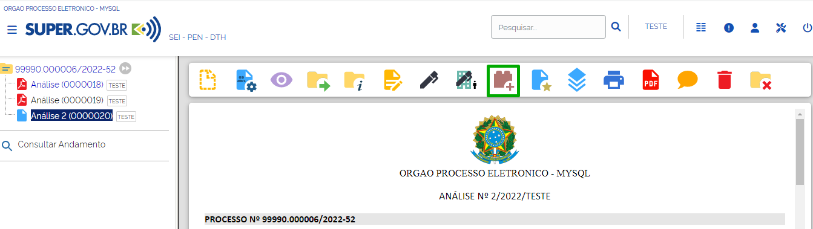

O usuário será direcionado para a tela “Incluir em Bloco de Assinatura”. Nessa tela, poderão ser realizadas as seguintes ações:

**A.** **Criar um Bloco de Assinatura** 

Essa opção será viabilizada pelo botão “**Novo Bloco**”. Após a criação de um novo bloco, o usuário poderá incluir documentos a esse bloco (opção “**Incluir**”) ou incluir documentos e, simultaneamente, disponibilizar a outra unidade (opção “**Incluir e Disponibilizar**”).

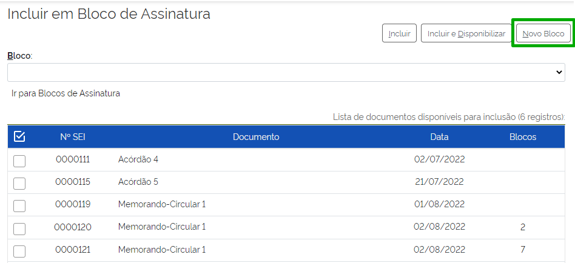

Preencha os campos exibidos em tela, e descritos abaixo:

* **Descrição**: para inserir a descrição do bloco;
* **Grupo**: para selecionar um Grupo de Bloco de Assinatura, caso exista;
* **Unidades para disponibilização**: para selecionar as Unidades para disponibilização.

Clique em “**Salvar**”.

.. figure:: _static/images/9-B-tela_incluir_em_blocos_assinatura_formulario.png

Após a criação do bloco, o sistema retornará à tela “**Incluir em Bloco de Assinatura**”, com o novo bloco selecionado no campo “**Bloco**”. Nessa tela, o usuário deverá indicar quais documentos deseja inserir no bloco, se deseja apenas incluir os documentos do processo no bloco criado ou se deseja incluir e disponibilizar, simultaneamente, o bloco. Estas ações estão melhor detalhadas abaixo.

**B.** **Incluir o documento em um Bloco de Assinatura já existente**: 

O documento será inserido no Bloco, mas ele não será disponibilizado no mesmo momento, sendo necessária sua disponibilização posteriormente. Essa opção é útil, principalmente, quando o usuário for incluir documentos de diferentes processos em um mesmo bloco. Dessa forma, será possível incluir os diversos documentos utilizando o botão Incluir e, no momento da inclusão do último documento, poderá ser utilizada a opção **Incluir e Disponibilizar**.

.. admonition:: Nota

   Caso a opção Incluir e Disponibilizar não seja utilizada no momento da inclusão do último documento no Bloco, será necessário Disponibilizar o Bloco para outra(s) unidade(s) por meio do menu Bloco de Assinatura.

Para incluir o documento em um Bloco de Assinatura já existente, o usuário deverá selecionar os documentos que deseja incluir no bloco, selecionar o bloco no campo “**Bloco**” e clicar no botão “**Incluir**”.

.. figure:: _static/images/9-B-tela_incluir_em_blocos_assinatura_incluir.png

Após esta ação, os documentos selecionados aparecerão já inseridos no Bloco escolhido.

.. figure:: _static/images/9-B-tela_incluir_em_blocos_assinatura_indicacao_blocos.png

Para disponibilizar o bloco para as unidades, o usuário poderá: 

* Ao incluir o último documento no bloco, clicar no botão “**Incluir e Disponibilizar**”, seguindo as orientações descritas no item “**Incluir o documento em um Bloco já existente e, ao mesmo tempo, disponibilizá-lo para outra unidade**”; ou

* Após a inclusão do último documento no bloco, clicar no link “**Ir para Blocos de Assinatura**”, conforme descrito abaixo.

.. figure:: _static/images/9-B-tela_incluir_em_blocos_assinatura_ir_para_blocos.png

Na tela “**Blocos de Assinatura**” será possível verificar que o Bloco no qual os documentos foram inseridos encontra-se no estado “**Gerado**”, ou seja, ele foi criado, mas ainda não foi disponibilizado para outra unidade.

.. figure:: _static/images/9-B-tela_bloco_assinatura_estado.png

.. admonition:: Nota

   Enquanto o documento estiver no estado “**Gerado**”, as seguintes opções estarão disponíveis na coluna ações:

   * Assinar Documentos |assinatura_preta|
   * Atribuir Bloco a um usuário |atribuir|
   * Visualizar os documentos/processos do Bloco |visualizar_documentos| 
   * Disponibilizar o Bloco para outra unidade |disponibilizar_bloco|
   * Alterar o Bloco |editar| 
   * Concluir o Bloco  |concluir_bloco|
   * Excluir o Bloco |excluir|

.. |disponibilizar_bloco| image:: _static/images/9-B-icone_disponibilizar_bloco.png
   :align: middle
   :width: 25

.. |editar| image:: _static/images/3-OBCP_icone_edicao.png
   :align: middle
   :width: 25

.. |excluir| image:: _static/images/3-OBCP_icone_exclusao.png
   :align: middle
   :width: 25

Para que seja possível a visualização, a edição e a assinatura dos documentos contidos no Bloco por usuário de outra unidade, será necessário clicar no ícone “**Disponibilizar Bloco**” |disponibilizar_bloco|, exibido na coluna Ações.

.. |disponibilizar_bloco| image:: _static/images/9-B-icone_disponibilizar_bloco.png
   :align: middle
   :width: 25

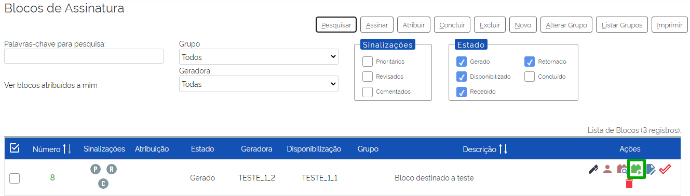

O Bloco disponibilizado aparecerá na cor amarela e seu estado passará a “**Disponibilizado**”. Haverá também uma modificação nos ícones disponíveis na coluna Ações, pois só aparecerão os ícones de ações possíveis no estado em que o Bloco se encontra. A saber:

* Atribuir Bloco a um usuário  |atribuir|
* Visualizar os documentos/processos do Bloco |visualizar_documentos| 
* Cancelar disponibilização do Bloco |cancelar_disponibilizacao_bloco|

.. figure:: _static/images/9-B-tela_bloco_estado_dispobilizado.png

.. admonition:: Notas

   1. A unidade que disponibilizou o Bloco de Assinatura para outra unidade poderá cancelar essa disponibilização a qualquer momento. Para isso, basta clicar no ícone “**Cancelar Disponibilização**” |cancelar_disponibilizacao_bloco| correspondente ao Bloco desejado, disponível na coluna Ações.

   2. Quando o Bloco de Assinatura for utilizado com a finalidade de agrupar vários documentos, para assinatura em lote, na própria unidade, o campo Unidades para Disponibilização da tela Novo Bloco de Assinatura ou Alterar Bloco de Assinatura deverá ser deixado em branco, já que o Bloco não será disponibilizado para nenhuma unidade.

**C. Incluir o documento em um Bloco já existente e, ao mesmo tempo, disponibilizá-lo para outra unidade:**

Essa opção é viabilizadal pelo botão “**Incluir e Disponibilizar**”. Isso é muito útil quando o usuário está incluindo apenas um documento ou quando está incluindo mais de um documento do mesmo processo.

Para que o usuário inclua um ou mais documentos em um bloco e já os deixe disponíveis para a unidade, deverá selecionar os documentos e o bloco, e clicar no botão “**Incluir e Disponibilizar**”.

.. figure:: _static/images/9-B-tela_incluir_e_disponibilizar.png

Ao realizar esta ação, a tela “**Incluir em Bloco de Assinatura**” apresentará o documento já incluído no Bloco. Para verificar se a disponibilização à unidade ocorreu com sucesso, o usuário pode clicar no link “**Ir para Blocos de Assinatura**”.

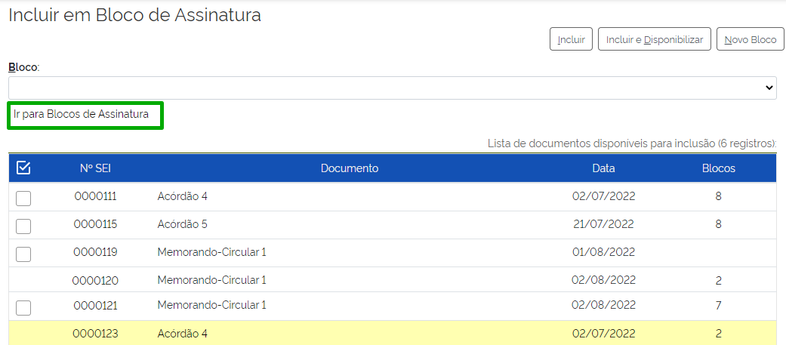

O Bloco em que o documento foi incluído e disponibilizado aparece destacado em vermelho, com a classificação do Estado “**Disponibilizado**”.

.. figure:: _static/images/9-B-tela_tela_bloco_estado_disponibilizado.png

Identificando Blocos de Assinatura Recebidos, Assinando Documentos e Retornando-os
----------------------------------------------------------------------------------

Para visualizar os blocos recebidos, acesse o Menu Principal, opção “**Blocos**”, e clique em “**Assinatura**”.

.. figure:: _static/images/9-B-bloco_assinatura_menu_principal.png

Será aberta a tela “**Blocos de Assinatura**”. Nessa tela, os Blocos recebidos de outras unidades são identificados pelo estado “**Recebido**”. É possível visualizar a unidade geradora do Bloco, bem como a(s) unidade(s) para a(s) qual(is) ele foi disponibilizado.

.. figure:: _static/images/9-B-tela_bloco_assinatura_informacoes.png

Para visualizar o(s) documento(s)/processo(s) recebido(s) para assinatura, o clique no botão “**Processos/Documentos do Bloco**” |visualizar_documentos| correspondente ao Bloco, que se encontra na coluna **Ações**; ou clique sobre o número do Bloco, na coluna **Número**.

.. figure:: _static/images/9-B-tela_bloco_assinatura_numero_pesquisa_documento.png

O usuário será redirecionado para a tela “**Documentos do Bloco de Assinatura**”. Por meio dos ícones disponíveis na coluna “**Ações**”, o usuário poderá assinar o documento, sem visualizá-lo, ao selecionar o ícone “**Assinar Documento**” |assinatura_preta| ; ou inserir anotações, por meio do ícone “**Anotações**” |anotacoes|. 

É possível visualizar o documento antes da assinatura, para tanto, clique em seu número, na coluna “**Documento**”. Caso deseje ver todo o processo antes da assinatura do documento, clique em seu número, na coluna “**Processo**”.

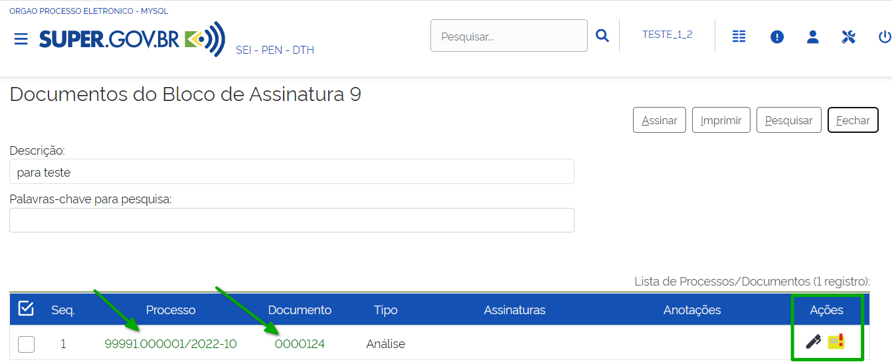

* Ao clicar no processo, o usuário será direcionado para a tela do processo e poderá editar o documento, clicando no ícone “**Editar Conteúdo**” |editar_documento|, caso o documento ainda não tenha nenhuma assinatura.

* A clicar no Documento, serão disponibilizadas as seguintes opções:

  * **Visualizar Árvore do Processo** |arvore| : possibilita acessar a árvore do processo;

  * **Assinar Documento** |assinatura_preta| : possibilita assinar cada documento do processo;

  * **Próximo Documento/Documento Anterior** |mover_documentos| : permite navegar entre os documentos do bloco;

  * **Selecionar para assinatura**: permite selecionar os documentos que deseja assinar. A assinatura dos documentos selecionados ocorrerá na tela “**Documentos do Bloco de Assinatura**”.

.. |mover_documentos| image:: _static/images/9-B-icone_mover.png
   :align: middle
   :width: 35

.. figure:: _static/images/9-B-tela_bloco_edicao_documento_opcoes.png

.. admonition:: Nota

   Toda ação de assinatura de um documento via SUPER.GOV.BR necessita que o usuário indique o seu Cargo/Função e informe a sua senha para efetivação da assinatura. Além da possibilidade de assinatura com Certificado Digital.

.. figure:: _static/images/9-B-tela_bloco_assinatura_ass_documentos.png

Após a assinatura, o nome e cargos dos assinantes do documento ficam registrados na coluna Assinaturas.

.. figure:: _static/images/9-B-tela_bloco_assinatura_identificacao_assinantes.png

Finalizadas as tratativas relativas às assinaturas, para retornar à tela “**Bloco de Assinaturas**”, clique no botão “**Fechar**”.

Na tela “**Bloco de Assinaturas**”, dentre outras possibilidades, o usuário poderá devolver o bloco à unidade remetente, por meio do ícone “**Devolver Bloco**” |devolver_bloco| , que se encontra na coluna **Ações**; ou selecionando o bloco e clicando no botão Devolver, que se encontra na parte superior da tela.

.. figure:: _static/images/9-B-tela_bloco_assinatura_devolver_bloco.png

Após a confirmação da devolução, o bloco não ficará mais disponível na lista de Blocos de Assinatura da Unidade.

A unidade de origem do bloco irá identificar o seu retorno por meio do símbolo |alerta| , exibido ao lado do número do processo, na tela de **Controle de Processo**, que indica que há um novo documento assinado no processo.

.. figure:: _static/images/9-B-tela_controle_processos_retorno_bloco.png

Reutilizando Blocos de Assinatura
---------------------------------

Os Blocos de Assinatura criados e retornados ou aqueles que tiveram sua disponibilização cancelada poderão ser reutilizados. Para isso, é interessante que o usuário retire do Bloco que será reutilizado os documentos nele incluídos. Assim, evita-se que os novos documentos incluídos no Bloco sejam confundidos com os documentos que já estavam nele anteriormente. 

O usuário poderá também, caso não queira reutilizar imediatamente o Bloco criado, concluí-lo e reabri-lo posteriormente, quando desejar utilizá-lo.

Para concluir um Bloco, acesse a Tela “**Blocos de Assinatura**”, por meio do menu “**Blocos**” > “**Assinatura**”, disponível no Menu Principal, e clique no ícone “**Concluir Bloco**” |concluir_bloco| , na coluna Ações, ou selecione o Bloco e clique no botão “**Concluir**”, na parte superior da tela “**Blocos de Assinatura**”. 

.. figure:: _static/images/9-B-tela_bloco_assinatura_opcao_concluir.png

O bloco concluído não ficará mais disponível na lista existente na tela “**Blocos de Assinatura**”. 

Para visualizar e reabrir um Bloco que foi concluído, o usuário deverá marcar a opção “**Concluído**” na caixa Estado, que fica na parte superior da tela “**Blocos de Assinatura**”.

.. figure:: _static/images/9-B-tela_bloco_assinatura_pesquisar_concuidos.png

.. admonition:: Nota

   Na caixa Estado, haverá opção de escolha, por estado, dos Blocos que o usuário deseja visualizar na tela Blocos de Assinatura.

Tendo acesso aos blocos concluídos, o usuário poderá reabri-los para serem reutilizados. Para isso, basta clicar no ícone “**Reabrir Bloco**” |reabrir_bloco| , que se encontra na coluna Ações.

.. |reabrir_bloco| image:: _static/images/9-B-icone_reabrir_bloco.png
   :align: middle
   :width: 25

.. figure:: _static/images/9-B-tela_bloco_assinatura_reabrir_bloco.png

Inserindo Sinalizações no Bloco de Assinatura
---------------------------------------------

O usuário poderá inserir **Sinalizações** nos Blocos de Assinatura. Basta clicar nos respectivos ícones na coluna Sinalizações: 

* Prioritário |prioridade_cinza|  
* Revisado |revisado_cinza| 
* Comentado |comentado_cinza| 

**A. Prioritário**: Ao clicar no ícone “**Prioritário**” |prioridade_cinza|, o ícone passará para a cor vermelha |prioridade_vermelho|, indicando a prioridade do Bloco. Ao posicionar o cursor sobre o ícone, será possível visualizar o usuário que inseriu a sinalização no Bloco, bem como a data e a hora em que isso ocorreu.

.. figure:: _static/images/9-B-tela_prioridade.png

**B. Revisado**: Ao clicar no ícone “**Revisado**” |revisado_cinza|, sua cor será alterada para azul |revisado_azul|, indicando que o bloco foi revisado. Ao posicionar o cursor sobre o ícone, serão informados o dia e a hora em que os documentos do Bloco foram revisados, bem como o usuário que fez a revisão.

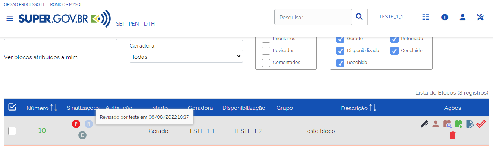

**C. Comentado**: Ao clicar no ícone “**Comentado**”, será aberta a janela para inclusão do comentário. Nela, o usuário deverá inserir o comentário no campo “**Descrição**” e clicar no botão “**Salvar**”. 

.. figure:: _static/images/9-B-tela_comentar_bloco.png

Ao término desta ação, o ícone **Comentário** passará a cor laranja |comentario_laranja|. Ao posicionar o cursor sobre o ícone, será possível visualizar o comentário efetuado no bloco, bem como o usuário que o incluiu e a data e hora da inclusão.

.. figure:: _static/images/9-B-tela_comentario.png

Ainda na tela de Blocos de Assinatura, é possível organizar a visualização dos Blocos por tipo de sinalização. Para utilizar essa opção, selecione na caixa “**Sinalizações**” um ou mais tipos de sinalizadores que deseja ver em tela.  Assim, quando é marcada a opção Prioritários, por exemplo, todos os Blocos com essa Sinalização serão visualizados na tela.

.. figure:: _static/images/9-B-tela_bloco_assinatura_sinalizacoes.png

.. admonition:: Nota

   As Sinalizações poderão ser utilizadas também nos Blocos de Reunião e nos Blocos Internos.

Atribuindo o Bloco de Assinatura a um Usuário
---------------------------------------------

Para atribuir um bloco, na tela de “**Blocos de Assinatura**”, clique no ícone “**Atribuir Bloco**” |atribuir|, que se encontra na coluna “**Ações**”; ou selecione o Bloco e clique no botão “**Atribuir**”, que se encontra na parte superior da tela “**Blocos de Assinatura**”.

.. figure:: _static/images/9-B-tela_bloco_assinatura_atribuir.png

Na tela “**Atribuir Bloco**”, selecione um usuário para atribuição do Bloco, no campo “**Atribuir para**” e, em seguida, clique no botão “**Salvar**”.

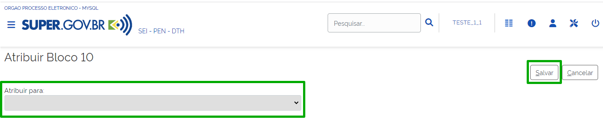

A identificação do nome do usuário ao qual o bloco foi atribuído ficará registrada na coluna “**Atribuição**” do bloco.

.. figure:: _static/images/9-B-tela_bloco_assinatura_atribuir_sinalizacao.png

.. admonition:: Notas

   1. Por meio do link “**Ver blocos atribuídos a mim**”, o usuário que está acessando o sistema poderá visualizar na tela Blocos de Assinatura apenas os Blocos que lhe foram atribuídos.

   2. Seguindo as mesmas orientações para “**Atribuir Bloco**” a um usuário, será possível alterar a atribuição do Bloco para outro usuário ou retirar a atribuição. Para o Bloco ficar sem nenhuma atribuição, basta deixar o campo “**Atribuir para**” em branco e clicar no botão **Salvar**.

   3. Assim como as Sinalizações, o recurso “**Atribuir Bloco**” também estará disponível nos **Blocos de Reunião** e nos **Blocos Internos**.

Criação e Utilização de Grupo para Bloco de Assinatura
------------------------------------------------------

Para criar um Grupo de Blocos de Assinatura, acesse a tela “**Blocos de Assinatura**” (conforme indicado nos itens anteriores) e clique no botão “**Listar Grupos**”.

.. figure:: _static/images/9-B-tela_bloco_assinatura_listar_grupos.png

A tela seguinte trará a lista de Grupos de Blocos existentes na Unidade. Nela é possível:

* **Criar um novo Grupo** : para criar um novo grupo, o usuário deve clicar no botão “**Novo**” e preencher o campo “**Nome**” com o nome do novo grupo.
* **Alterar Grupo de Bloco** |editar| : permite alteração no nome do Grupo.
* **Desativar Grupo de Bloco** |desativar_grupo_bloco| : permite a desativação do Grupo e, assim, nenhum Bloco poderá ser inserido nele, até ser ativado novamente.
* **Reativar Grupo de Bloco** |Reativar_grupo_bloco| : permite a reativação do Grupo que foi desativado para que possa ser utilizado novamente.
* **Excluir Grupo de Bloco** |excluir|: exclui definitivamente o Grupo de Bloco. Para isso, não poderá haver nenhum Bloco inserido no Grupo.
Também será possível excluir múltiplos grupos. Para isso, basta selecionar os grupos e clicar no botão “**Excluir**”.

.. |excluir| image:: _static/images/3-OBCP_icone_exclusao.png
   :align: middle
   :width: 25

.. |editar| image:: _static/images/3-OBCP_icone_edicao.png
   :align: middle
   :width: 20

.. |Reativar_grupo_bloco| image:: _static/images/9-B-icone_reativar_grupo_bloco.png
   :align: middle
   :width: 25

.. figure:: _static/images/9-B-tela_grupos_blocos_acoes.png

.. admonition:: Nota

   Novos grupos são sinalizados em amarelo e grupos desativados são sinalizados em vermelho.

Para retornar à tela **Blocos de Assinatura**, clique no botão “**Fechar**”.

Ainda na tela “Bloco de Assinatura” há outra forma de criar um novo grupo. Para tanto, selecione o bloco ou blocos que deseja e clique em “**Alterar Grupo**”.

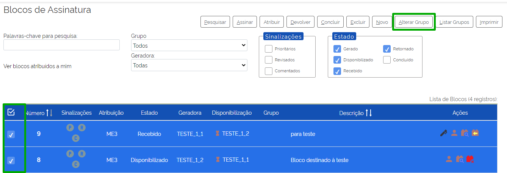

Na tela “**Grupo de Blocos**", além de criar um novo grupo, será possível incluir ou alterar o grupo dos blocos selecionados. Para criar um novo grupo, o usuário deverá clicar no ícone “**Novo Grupo de Bloco**” |mais|.

.. |mais| image:: _static/images/2-OBCP_Atribuir_icone_Exibir_todos_os_tipos.png
   :align: middle
   :width: 25

Preencher o campo “**Nome**” com o nome do Grupo e clicar em “**Salvar**”.

.. figure:: _static/images/9-B-tela_bloco_assinatura_novo_grupo_formulario.png

O novo grupo criado será preenchido automaticamente no campo “**Grupo**” da tela “**Alterar Grupo de Blocos**”. Confirme a escolha do grupo clicando em “**Salvar**”.

.. figure:: _static/images/9-B-tela_bloco_novo_grupo_formulario_preenchido.png

Após a inclusão do grupo no bloco ou blocos, o usuário será direcionado à tela “**Blocos de Assinatura**”, que estará com o filtro “**Grupo**” selecionado com o grupo salvo na tela “**Alterar Grupo de Blocos**”. Além disso, o grupo salvo será indicado na coluna “**Grupo**” do bloco ou blocos.

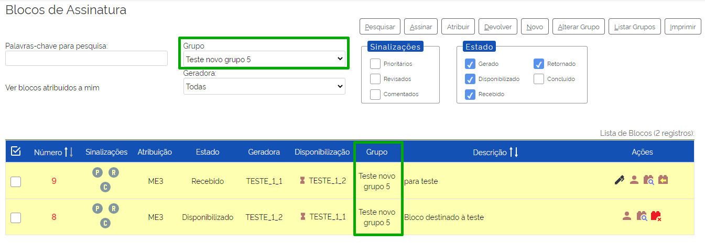

Para visualizar todos os blocos, selecione a opção **todos** do filtro “**Grupo**”.

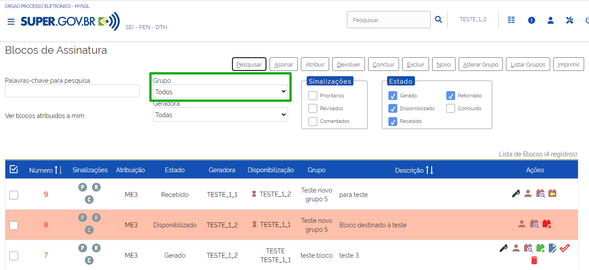

.. admonition:: Notas

   1. Além das opções demonstradas acima, também será possível associar um grupo a um bloco, quando da criação de um bloco e na inclusão de documentos em um grupo existente. 

   2. Os Grupos criados poderão ser utilizados para inclusão de qualquer tipo de Bloco. Por exemplo: um Grupo pode ter sido criado ao se utilizar um Bloco de Assinatura e, posteriormente, um Bloco Interno poderá ser incluído neste Grupo.

Conhecendo a Tela Blocos de Assinatura
--------------------------------------

Para acessar a tela “**Blocos de Assinatura**”, no Menu Principal, selecione a opção “**Blocos**” e clique em “**Assinatura**”.

.. figure:: _static/images/9-B-tela_menu_principal_blocos_assinatuta.png

Nessa tela, encontram-se disponíveis botões que permitem a realização de ações relacionadas aos blocos de assinatura, bem como, filtros e informações que auxiliam na visualização de controle de blocos de assinatura.

.. figure:: _static/images/9-B-tela_bloco_assinatura_itens_disponiveis.png

* **Filtros**:  limitam a visualização dos resultados relacionados à tela “**Blocos de Assinatura**”, conforme os critérios definidos pelo usuário. Esta tela apresenta os seguintes filtros:

.. figure:: _static/images/9-B-tela_bloco_assinatura_filtros.png

    * **Palavras-chave para pesquisa**: permite a visualização do conteúdo conforme o termo indicado neste campo. Após a inclusão do termo, o usuário deverá clicar em “Pesquisar” ou clicar no botão “Enter” do teclado. O termo escolhido será pesquisado no conteúdo do campo "Descrição" dos blocos.
    * **Ver blocos atribuídos a mim**: ao selecionar esse link, o sistema retorna apenas os blocos atribuídos ao usuário que está acessando o sistema.
    * **Grupo**: permite a visualização dos blocos que participem do grupo selecionado. Só será possível selecionar um grupo por vez.
    * **Geradora**: permite a visualização dos blocos gerados pela unidade selecionada. Só será possível selecionar um grupo por vez.
    * **Sinalizações**: permite que o usuário visualize somente os blocos que contenham as sinalizações selecionadas. Podendo ser: Prioritárias, Revisadas e Comentadas.É possível selecionar mais de uma sinalização para a execução do filtro.
    * **Estado**: permite que o usuário visualize somente os blocos classificados nos Estados selecionados. Podendo ser: Gerado, Disponibilizado, Recebido, Retornado e Concluído.

É possível selecionar mais de um estado para a execução do filtro.

.. admonition:: Nota

   É possível que o usuário utilize combinações de filtros para ajudar na visualização e controle dos blocos de assinatura em que a sua unidade está envolvida.

* **Botões da tela**: possibilitam a execução de ações e operações relacionadas aos Blocos de Assinatura. 

   * **Pesquisar**: executa a pesquisa dos blocos conforme o termo informado no campo “**Palavras-chave para pesquisa**”.
   * **Assinar**: permite que sejam assinados os documentos dos blocos selecionados. 
   * **Atribuir**: permite que os blocos selecionados sejam atribuídos a um usuário.
   * **Devolver**: permite a devolução dos blocos selecionados à unidade de origem.
   * **Concluir**: conclui os blocos de assinatura selecionados.
   * **Excluir**: permite a exclusão dos blocos de assinatura selecionados. Somente blocos não assinados poderão ser excluídos.
   * **Novo**: permite ao usuário criar um bloco de assinaturas.
   * **Alterar Grupo**: permite ao usuário criar ou alterar um grupo.
   * **Listar Grupos**: lista os grupos existentes na Unidade. Nesta opção é possível criar, editar ou excluir grupos.
   * **Imprimir**: permite que o usuário imprima a listagem com os blocos selecionados.

.. figure:: _static/images/9-B-tela_bloco_assinatura_botoes.png

* **Colunas/campos da Grid Bloco de Assinaturas**: concentra as informações relacionadas com os blocos de assinatura da Unidade. 

  * **Caixa de Seleção**: permite que o usuário selecione o bloco para realização das operações disponíveis em tela. É possível selecionar todos os blocos clicando em |selecao_master|.
  * **Número**: demonstra o número identificador do bloco de assinatura.
  * **Sinalizações**: permite que os usuários registrem e visualizem se o bloco é prioritário, se foi revisado e se foi comentado.
  * **Atribuição**: apresenta o usuário ao qual o bloco foi atribuído.  
  * **Estado**: demonstra o estado/situação em que o bloco se encontra. Podendo ser: Gerado, Disponibilizado, Recebido, Retornado e Concluído.
  * **Geradora**: demonstra qual é a Unidade geradora do bloco de assinaturas.
  * **Disponibilização**: demonstra a Unidade para a qual o bloco de assinatura foi disponibilizado. O ícone |ampulheta_marrom| indica que o bloco aguarda a devolução. 
  * **Grupo**: demonstra o grupo ao qual o bloco de assinaturas está vinculado.
  * **Descrição**: apresenta a descrição do bloco de assinaturas.
  * **Ações**: concentrar ações/operações disponíveis para o tratamento dos blocos de assinatura. Conforme o “Estado” do bloco de assinatura, as ações a seguir poderão ser utilizadas:  
    
    * Assinar Documentos |assinatura_preta|
    * Atribuir Bloco a um usuário |atribuir|
    * Visualizar os documentos/processos do Bloco |visualizar_documentos|
    * Disponibilizar o Bloco para outra unidade |disponibilizar_bloco|
    * Devolver Bloco |devolver_bloco|
    * Alterar o Bloco  |editar|
    * Concluir o Bloco |concluir_bloco|
    * Excluir o Bloco  |excluir|
    * Cancelar disponibilização do Bloco |cancelar_disponibilizacao_bloco|

.. figure:: _static/images/9-B-tela_bloco_assinatura_campos_disponiveis.png

.. |selecao_master| image:: _static/images/9-B-icone_selecao_master.png
   :align: middle
   :width: 25

.. |disponibilizar_bloco| image:: _static/images/9-B-icone_disponibilizar_bloco.png
   :align: middle
   :width: 30

.. |editar| image:: _static/images/3-OBCP_icone_edicao.png
   :align: middle
   :width: 30

.. |excluir| image:: _static/images/3-OBCP_icone_exclusao.png
   :align: middle
   :width: 25

Bloco de reunião
++++++++++++++++

Recurso destinado à disponibilização de processos para conhecimento. Por meio dessa funcionalidade, o usuário de unidade diferente daquela que produziu os documentos consegue visualizar as minutas que compõem o processo disponibilizado.

Para criar um bloco de reunião, selecione um ou mais processos na tela de “**Controle de Processos**” e clique no ícone “**Incluir em Bloco**”  |incluir_bloco| (1); ou acesse o processo e clique no ícone “**Incluir em bloco**” |incluir_bloco|, disponível na barra de ícones (2). 

.. figure:: _static/images/9-B-bloco_reuniao_tela_controle.png

.. figure:: _static/images/9-B-bloco_reuniao_tela_processo.png

A tela “Selecionar Bloco” será aberta, nela, o usuário poderá:

* Criar um bloco de reunião, clicando no botão “**Novo Bloco de Reunião**”

.. figure:: _static/images/9-B-bloco_reuniao_tela_novo_bloco.png

Na tela “**Novo Bloco de Reunião**”, inserir a Descrição do bloco; escolher um Grupo para inclusão do Bloco, caso deseje; e indicar a(s) unidade(s) para disponibilização, em seguida, basta clicar em Salvar

.. figure:: _static/images/9-B-bloco_reuniao_tela_processo.png

O usuário será direcionado novamente para a tela Selecionar Bloco. O Bloco criado já estará selecionado e aparecerá na cor amarela. Os passos para seleção do bloco estão descritos abaixo, no subitem “**Selecionar um Bloco existente**”.

* **Selecionar um Bloco existente**

Para incluir o(s) processo(s) no Bloco, clique no ícone “**Escolher este Bloco**” |escolher_bloco| correspondente ao Bloco desejado, na coluna Ações; ou verifique se a caixa de seleção do Bloco está marcada e, em seguida, clique no botão OK.

.. |escolher_bloco| image:: _static/images/9-B-icone_escolher_bloco.png
   :align: middle
   :width: 30

.. figure:: _static/images/9-B-tela_selecionar_bloco.png

O processo será automaticamente incluído no Bloco e o usuário será direcionado para a tela Processos do Bloco de Reunião.

.. figure:: _static/images/9-B-tela_selecionar_bloco_opcoes.png

Nessa tela, é possível:

* acessar o processo: clicando em seu número; 
* incluir anotações: por meio do ícone “**Anotações**” |anotacoes| ; 
* e retirar o processo do Bloco, por meio do ícone “**Retirar Processo/Documento do Bloco**” |excluir|, ou selecionando o processo e clicando no botão “Retirar do Bloco”. 

.. |excluir| image:: _static/images/3-OBCP_icone_exclusao.png
   :align: middle
   :width: 25

Para sair da tela Processos do Bloco de Reunião, clique no botão Fechar.

.. admonition:: Nota

   Para que outra unidade tenha acesso ao processo incluído em um “Bloco de Reunião”, será necessária a disponibilização do Bloco pela unidade que fez a inclusão.

Disponibilizando o Bloco de Reunião
-----------------------------------

Para disponibilizar o Bloco de Reunião, acesse a opção “**Blocos**”, existente no menu principal, e clique em “**Reunião**”.

.. figure:: _static/images/9-B-tela_blocos_reuniao_tela_controle.png

Na tela Blocos de Reunião serão listados todos os Blocos de Reunião que se encontram na Unidade. Para disponibilizar o Bloco de Reunião para outra unidade, clique no ícone “**Disponibilizar Bloco**” |disponibilizar_bloco|, disponível na coluna Ações.

.. |disponibilizar_bloco| image:: _static/images/9-B-icone_disponibilizar_bloco.png
   :align: middle
   :width: 25

.. figure:: _static/images/9-B-bloco_reuniao_disponibilizar.png

Após essa ação, o Estado do Bloco será alterado para “**Disponibilizado**”. Os ícones disponíveis na coluna “**Ações**” serão alterados tendo em vista a mudança de estado do bloco.

.. figure:: _static/images/9-B-bloco_reuniao_tela_estado_acoes.png

.. admonition:: Nota

   As opções existentes na coluna “Ações” irão variar conforme o Estado do bloco. A saber:

   * **Atribuir Bloco** |atribuir|  : permite a atribuição do Bloco a um usuário da unidade.
   * **Processos/Documentos do Bloco** |visualizar_documentos| : possibilita a visualização dos processos incluídos no Bloco.
   * **Disponibilizar Bloco** |disponibilizar_bloco|  : possibilita a disponibilização do Bloco para outra unidade.
   * **Cancelar Disponibilização** |cancelar_disponibilizacao_bloco|: possibilita o cancelamento da disponibilização do Bloco a outra unidade.
   * **Devolver Bloco** |devolver_bloco|  : permite a devolução do Bloco pela unidade que o recebeu.
   * **Alterar Bloco** |editar|: possibilita a alteração da descrição do Bloco, do Grupo e da unidade para disponibilização.
   * **Concluir Bloco** |concluir_bloco|  : permite a conclusão do Bloco que já cumpriu seu propósito.
   * **Reabrir Bloco** |reabrir_bloco|  : permite a reabertura do Bloco que havia sido concluído, para ser utilizado novamente.
   * **Excluir Bloco** |excluir|  : permite a exclusão do Bloco que não possui processos.

.. |disponibilizar_bloco| image:: _static/images/9-B-icone_disponibilizar_bloco.png
   :align: middle
   :width: 25

.. |editar| image:: _static/images/3-OBCP_icone_edicao.png
   :align: middle
   :width: 20

.. |excluir| image:: _static/images/3-OBCP_icone_exclusao.png
   :align: middle
   :width: 25

.. |reabrir_bloco| image:: _static/images/9-B-icone_reabrir_bloco.png
   :align: middle
   :width: 25

Identificando um Bloco de Reunião Disponibilizado, Visualizando a Minuta de Documento e Devolvendo-a
-----------------------------------------------------------------------------------------------------

A identificação de um “**Bloco de Reunião**” disponibilizado por outra unidade poderá ser feito pela opção “**Reunião**” existente no menu “**Blocos**”, no Menu Principal.

.. figure:: _static/images/9-B-bloco_reuniao_menu_principal.png

Será aberta a tela “**Blocos de Reunião**”. Nela, aparecerão todos os Blocos existentes na unidade (gerados, disponibilizados, recebidos, retornados e concluídos, dependendo da seleção feita pela unidade para visualização dos Blocos na tela).

Para visualizar o(s) processo(s) incluídos em um Bloco, clique sobre o número identificador do Bloco ou sobre o ícone “**Processos/Documentos do Bloco**” |visualizar_documentos|, disponível na coluna Ações.

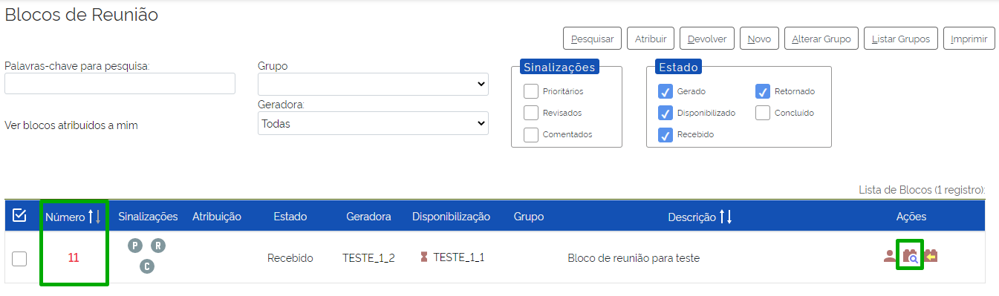

Para acessar o processo desejado, clique sobre seu número.

.. figure:: _static/images/9-B-bloco_reuniao_acesso_processo.png

Será aberta a tela do processo para que o usuário visualize a minuta do documento feita pela outra unidade.

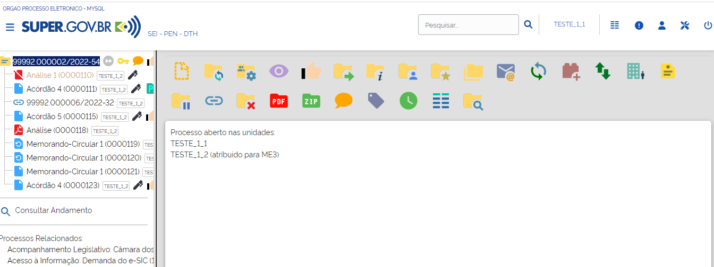

Após a visualização da minuta, o usuário, caso deseje, poderá retornar o “**Bloco**” à unidade de origem. Para isso, é necessário retornar à tela “**Blocos de Reunião**” (menu principal > Blocos > Reunião).

Na tela “**Blocos de Reunião**”, clique no ícone “**Devolver Bloco**” |devolver_bloco| correspondente ao Bloco, na coluna Ações; ou selecione o Bloco desejado e clique no botão Devolver.

.. figure:: _static/images/9-B-bloco_reuniao_devolver.png

Após a confirmação, o bloco ficará disponível para a Unidade que o disponibilizou, com o estado “**Retornado**”.

.. figure:: _static/images/9-B-bloco_reuniao_estado_retornar.png

.. admonition:: Notas

   1. O Bloco de Reunião possibilita a visualização de minutas de documentos por unidades que não as geraram, porém não será possível a edição nem a assinatura dessas minutas.

   2. O fato de um processo ser incluído em um Bloco de Reunião e ser disponibilizado para outra unidade não significa que o processo tramitará por aquela unidade. No entanto, a unidade conseguirá localizar o processo pela “**Pesquisa**”, mesmo se tratando de processo restrito. A visualização do conteúdo dos documentos ficará vinculada à disponibilização do Bloco.

Reutilizando Blocos de Reunião
------------------------------

Para reutilizar o bloco de reunião, retire os processos vinculados ao bloco. Para tanto, acesse a opção “**Reunião**” do menu “**Blocos**”, existente no menu principal, e clique no número do Bloco desejado.

.. figure:: _static/images/9-B-bloco_reuniao_identificador_bloco.png

Em seguida, selecione os processos que deseja excluir do Bloco e clique no botão “**Retirar do Bloco**”, ou clique no botão “**Retirar Processo/Documento do Bloco**” |excluir|   correspondente a cada processo, na coluna Ações.

.. |excluir| image:: _static/images/3-OBCP_icone_exclusao.png
   :align: middle
   :width: 20

.. figure:: _static/images/9-B-bloco_reuniao_retirar_bloco.png

Após a retirada dos processos do Bloco, clique no botão Fechar para retornar à tela Blocos de Reunião. Para que o bloco seja reutilizado, será necessário concluí-lo, por meio de clique no Botão “**Concluir**”, ou clique no ícone “**Concluir Bloco**” |concluir_bloco|, disponível na coluna Ações. 

.. figure:: _static/images/9-B-bloco_reuniao_concluir_bloco.png

Para visualizar e reabrir um bloco que foi concluído, marque a opção “**Concluído**” na caixa “**Estado**” que fica na parte superior da tela Blocos de Reunião.

.. figure:: _static/images/9-B-bloco_reuniao_filtro_conclusao.png

É possível reabrir o bloco para reutilizá-lo. Para isso, basta clicar no ícone “**Reabrir Bloco**” |reabrir_bloco|, que se encontra na coluna **Ações**.

.. |reabrir_bloco| image:: _static/images/9-B-icone_reabrir_bloco.png
   :align: middle
   :width: 25

.. admonition:: Notas

   1. Na tela Blocos de Reunião, além dos ícones disponíveis na coluna Ações, o usuário encontra vários botões, links, caixas de seleção, sinalizações que permitem a realização de várias ações nos Blocos. Mais informações sobre essas opções podem ser conhecidas na seção “**Blocos de Assinatura**” deste documento, no item “**Conhecendo a Tela Blocos de Assinatura**”.

   2. Na seção “**Blocos de Assinatura**”, o usuário encontrará também as seguintes informações comuns a todos os Blocos: “**Inserindo Sinalizações no Bloco de Assinatura**”; “**Atribuindo o Bloco de Assinatura a um Usuário**”; e “**Criação e Utilização de Grupo para Bloco de Assinatura**”.

Blocos Internos
+++++++++++++++

Recurso utilizado para organizar internamente grupos de processos que possuem alguma semelhança entre si. O Bloco Interno também permite o acompanhamento das atualizações posteriores dos processos públicos ou restritos que já tramitaram pela unidade.

Para criar um bloco interno, selecione um ou mais processos e clique no ícone Incluir em “**Bloco**” |incluir_blocos_assinatura|, disponível na tela de “**Controle de Processos**” (1); ou acesse o processo e cllique no mesmo ícone na Barra de Ícones do processo (2).

.. figure:: _static/images/9-B-bloco_interno_controle_processo.png

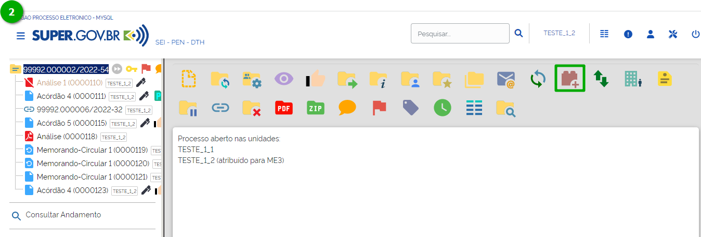

A tela “**Selecionar Bloco**” será aberta, nela, o usuário poderá:

* Criar um bloco interno, clicando no botão “**Novo Bloco Interno**”

.. figure:: _static/images/9-B-bloco_interno_novo_bloco.png

Na tela “**Novo Bloco Interno**”, insira a Descrição do bloco; e escolha um Grupo para inclusão do Bloco, caso deseje, em seguida, clique em Salvar.

.. figure:: _static/images/9-B-bloco_interno_novo_bloco_formulario.png

O usuário será direcionado novamente para a tela Selecionar Bloco. O Bloco criado já estará selecionado e aparecerá na cor amarela. Os passos para seleção do bloco estão descritos abaixo, no subitem “**Selecionar um Bloco existente**”.

* **Selecionar um Bloco existente**

Para incluir o(s) processo(s) no Bloco, clique no ícone “**Escolher este Bloco**” |escolher_bloco| correspondente ao Bloco desejado, na coluna Ações; ou verifique se a caixa de seleção do Bloco está marcada e, em seguida, clique no botão OK.

.. |escolher_bloco| image:: _static/images/9-B-icone_escolher_bloco.png
   :align: middle
   :width: 30

.. figure:: _static/images/9-B-bloco_interno_selecionar_bloco.png

O processo será automaticamente incluído no Bloco e o usuário será direcionado para a tela “Processos do Bloco Interno”.

Nessa tela, é possível:

* acessar o processo: clicando em seu número; 
* incluir anotações: por meio do ícone “**Anotações**” |anotacoes|; 
* e retirar o processo do Bloco, por meio do ícone “**Retirar Processo/Documento do Bloco**” |excluir|, ou selecionando o processo e clicando no botão “**Retirar do Bloco**”; e
* incluir o processo em Acompanhamento Especial, por meio do botão “**Incluir em Acompanhamento Especial**”.

.. |excluir| image:: _static/images/3-OBCP_icone_exclusao.png
   :align: middle
   :width: 25

Para sair da tela “Processos do Bloco Interno”, clique no botão “Fechar”.

.. figure:: _static/images/9-B-bloco_interno_opcoes.png

.. admonition:: Nota

   Ao escolher um Bloco já existente para inclusão de processo, certifique-se do Tipo de Bloco que deseja utilizar, pois a tela “**Selecionar Bloco**” exibirá tanto os Blocos Internos quanto os Blocos de Reunião criados na unidade.

Consultando os Blocos Internos
------------------------------

Para consultar os blocos internos da unidade, acesse a opção “**Internos**” do menu “**Blocos**”, existente no menu principal.

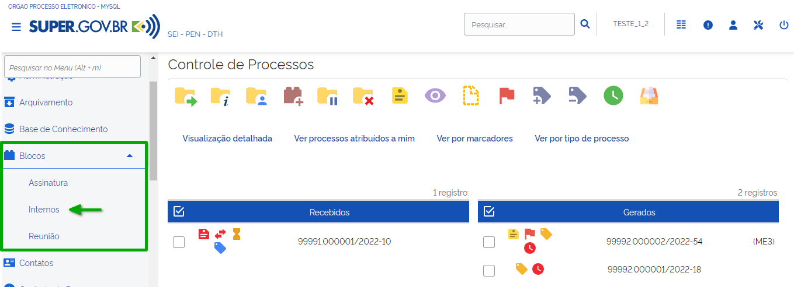

Será aberta a tela “**Blocos Internos**”. Nela, serão listados todos os Blocos Internos da unidade.

.. figure:: _static/images/9-B-bloco_interno_pesquisar.png

Nessa tela, as opções existentes na coluna “**Ações**” irão variar conforme o Estado do bloco. A saber:

* Atribuir Bloco |atribuir| : permite a atribuição do Bloco a um usuário da unidade.
* Processos/Documentos do Bloco |visualizar_documentos|: possibilita a visualização dos processos incluídos no Bloco.
* Alterar Bloco |editar| : possibilita a alteração da descrição do Bloco, do Grupo e da unidade para disponibilização.
* Concluir Bloco |concluir_bloco|: permite a conclusão do Bloco que já cumpriu seu propósito.
* Reabrir Bloco |reabrir_bloco| : permite a reabertura do Bloco que havia sido concluído, para ser utilizado novamente.
* Excluir Bloco |excluir|: permite a exclusão do Bloco que não possui processos.

.. |editar| image:: _static/images/3-OBCP_icone_edicao.png
   :align: middle
   :width: 30

.. |reabrir_bloco| image:: _static/images/9-B-icone_reabrir_bloco.png
   :align: middle
   :width: 30

.. |excluir| image:: _static/images/3-OBCP_icone_exclusao.png
   :align: middle
   :width: 25

.. admonition:: Notas

   1. Na tela “**Blocos Interno**”, além dos ícones disponíveis na coluna Ações, o usuário encontra vários botões, links, caixas de seleção, sinalizações que permitem a realização de várias ações nos Blocos. Mais informações sobre essas opções podem ser conhecidas na seção “Blocos de Assinatura” deste documento, no item “**Conhecendo a Tela Blocos de Assinatura**”.

   2. Na seção “**Blocos de Assinatura**”, o usuário encontrará também as seguintes informações comuns a todos os Blocos: “**Inserindo Sinalizações no Bloco de Assinatura**”; “**Atribuindo o Bloco de Assinatura a um Usuário**”; e “**Criação e Utilização de Grupo para Bloco de Assinatura**”.

Diferenças entre Bloco Interno e Acompanhamento Especial
---------------------------------------------------------

O Bloco Interno é principalmente uma ferramenta de organização dos processos na unidade, que facilita a localização desses processos, quando necessário. Já o Acompanhamento Especial é uma funcionalidade que permite o acompanhamento de processos que ainda terão algum trâmite ou que poderão impactar as decisões da unidade.

Portanto, o processo incluído em Bloco Interno poderá também ser incluído em 
Acompanhamento Especial.

No Acompanhamento Especial, os processos são exibidos em uma Lista, e há um filtro que possibilita a visualização apenas dos processos incluídos em determinado Grupo. Nos Blocos Internos, não há uma Lista única dos processos, já que eles ficam agrupados por Blocos.

Além disso, não há nenhum ícone (como acontece no Acompanhamento Especial) que identifica o processo incluído em um Bloco Interno. A informação de que o processo está incluído em um Bloco, com o respectivo número do Bloco, consta no Histórico do processo.

.. admonition:: Nota

   Para adicionar um processo em um Bloco Interno é necessário que ele esteja aberto na Unidade no momento da inclusão. Para adicionar um processo em Acompanhamento Especial não é necessário que o processo esteja aberto na Unidade.
