Solicitação de credenciais para uso do Módulo de Assinatura Eletrônica
======================================================================

Introdução
----------

A solicitação de credenciais é uma das etapas necessárias para utilização do Módulo de **Assinatura Eletrônica do SEI**. A solicitação é feita junto à Secretaria de Governo Digital do Ministério da Gestão e da Inovação em Serviços Públicos (SGD/MGI) por meio do `Serviço de Integração aos Produtos de Identidade Digital GOV.BR <https://www.gov.br/governodigital/pt-br/estrategias-e-governanca-digital/transformacao-digital/servico-de-integracao-aos-produtos-de-identidade-digital-gov.br>`_.

 **ATENÇÃO:**
 
 A integração com Assinatura Avançada do GOV.BR depende da integração do GOV.BR. Por isso, antes de continuar com a solicitação da credencial da assinatura, tenha a outra credencial. Para mais informações de como solicitar a credencial GOV.BR, `clique aqui <https://www.gov.br/governodigital/pt-br/identidade/identidade-digital-para-gestores-publicos>`_ .

Nesse tutorial, abordaremos os passos necessários para solicitar as credenciais para os ambientes de homologação e produção.

1ª ETAPA – Solicitação
----------------------

01. Acessar a página do `Serviço de Integração aos Produtos de Identidade Digital GOV.BR <https://www.gov.br/governodigital/pt-br/estrategias-e-governanca-digital/transformacao-digital/servico-de-integracao-aos-produtos-de-identidade-digital-gov.br>`_.

02. Clicar no botão “Iniciar”

Imagem 1 – página inicial:

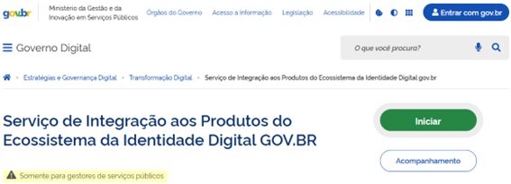

03. Fazer login com a conta GOV.BR do agente público (preferencialmente um servidor público efetivo ou comissionado)

Imagem 2 – tela de login:

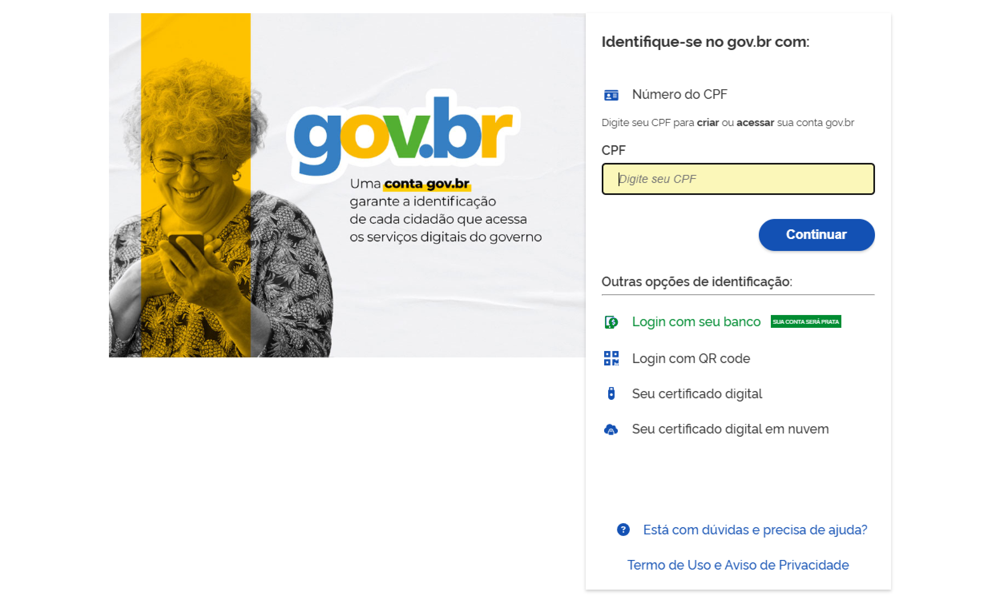
 
04. Preencher os dados do Órgão e do Requisitante:

Imagem 3 - dados órgão e requisitante:

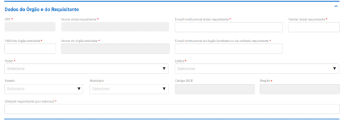

05. Preencher os dados do Responsável Negocial e do Responsável Técnico 
 
Imagem 4 – dados funcionais:

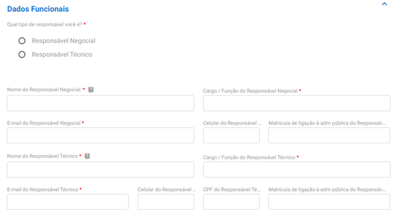
 
06. Preencher o Questionário abaixo

Imagem 5 – questionário:

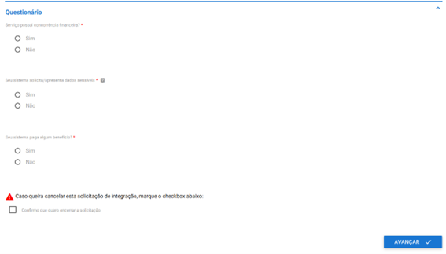
 

7. Clicar em “Avançar”

8. Preencher os campos sobre o Produto de Identidade Digital de Interesse

.. admonition:: ATENÇÃO!

  "A integração com Assianatura Avançada do GOV.BR depende da integração do GOV.BR. Por isso, antes de continuar com a solicitação da credencial da assinatura, tenha a outra credencial. Para mais informações de como solicitar a credencial GOV.BR, `clique aqui <https://www.gov.br/governodigital/pt-br/identidade/identidade-digital-para-gestores-publicos>`_ !"

Imagem 6 – produto assinatura:

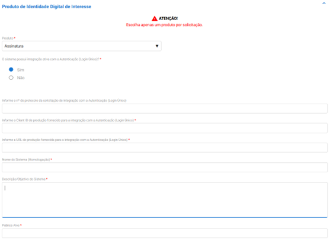
   

.. admonition:: Nome do Sistema (Homologação)

   "SEI Assinatura Eletrônica - <Adicionar o Nome do Órgão>"

.. admonition:: Descrição/Objetivo do Sistema

   "O Módulo de Assinatura Eletrônica permite a assinatura de documentos no SEI com emprego de assinatura avançada."

.. admonition:: Público Alvo
	
	“Usuários internos (servidores e demais agentes públicos) e usuários externos (cidadãos).”

09. Preencher os dados sobre o serviço a ser integrado e em seguida clicar em “ADICIONAR DADOS NA TABELA +”

Imagem 7 – instruções:

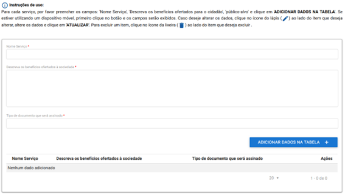
 
.. admonition:: Nome do Serviço

   "SEI Assinatura Avançada - <Adicionar o Nome do Órgão>"

.. admonition:: Descreva os benefícios ofertados à sociedade

   "Possibilitar a assinatura de documentos no SEI com emprego de assinatura avançada."

.. admonition:: Descreva os benefícios ofertados à sociedade

   "Documentos internos (produzidos dentro do SEI) e documentos externos."

10. Preencher os campos sobre volumetria, sazonalidade e anexar a chave pública PGP
   
 Imagem 8 – volumetria:

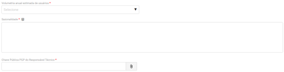

.. admonition:: ATENÇÃO! 

	"Orientações sobre como criar chaves PGP podem ser obtidas no Roteiro de Integração do Login Único"

11. Preencher a URL de retorno em homologação e em seguida clicar em “ADICIONAR DADOS NA TABELA +”

Imagem 9 – url retorno homolog:

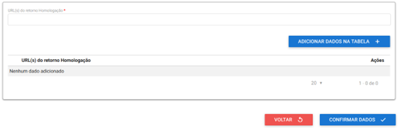

.. admonition:: URL(s) do retorno (Homologação)

   https://ENDEREÇO SEI/sei/controlador.php?acao=assin_elet_callback_govbr
   e
   https://ENDEREÇO SEI/sei/modulo/assinatura-eletronica/assin_elet_callback_govbr.php

12. Clicar em "CONFIRMAR DADOS"

13. Aceitar os termos e clicar em “Enviar solicitação”, aguardando o prazo de até 10 dias úteis para retorno deste primeiro formulário, onde o processo ficará com o status 3 “Análise/Aprovação”

Imagem 10 - termo de uso:

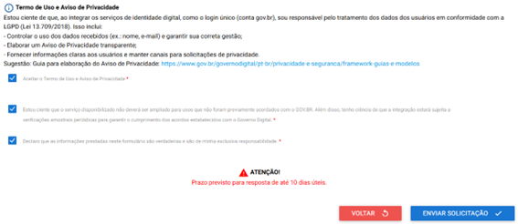

14. A solicitação ficará na fase 3 “Análise/Aprovação”. Aguardar o prazo de até 10 dias úteis para retorno deste primeiro formulário. 

Imagem 11 - fase 3:

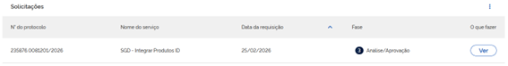

15. Acessar a página do Serviço de Integração aos Produtos de Identidade Digital GOV.BR e clicar em “Acompanhamento”. Fazer login com a mesma conta GOV.BR que iniciou a solicitação.

16. Se houver ocorrido a alteração da fase 3 “Análise/Aprovação” para outra fase, conforme imagem abaixo, clicar em “Ver” para dar andamento à solicitação. Caso a fase não tenha sido alterada, continuar verificando dentro do prazo de 10 dias úteis.

Imagem 12 - fase 4:

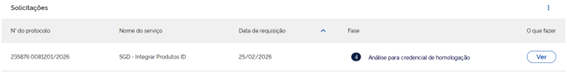

17. Localizar a sessão “Análise do Produto Homologação” e copiar as credenciais “client_id” e “secret”.

.. admonition:: ATENÇÃO! 

   "Orientações adicionais estão disponíveis no Manual de Instalação e Configuração do Módulo de Assinatura Eletrônica do SEI."

Imagem 13 - análise homolog:
 
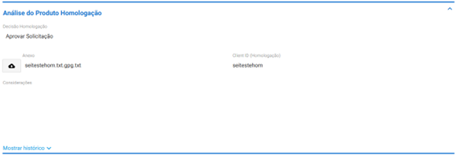

18. Localizar a sessão “Produto de Identidade Digital de Interesse” e informar o “Nome do Sistema (Produção)”

Imagem 14 – produto:

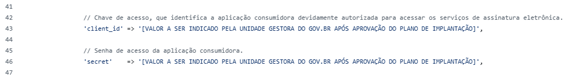

19. Informar a “URL Produção” e clicar em “ADICIONAR DADOS NA TABELA +”

Imagem 15 – url produção:

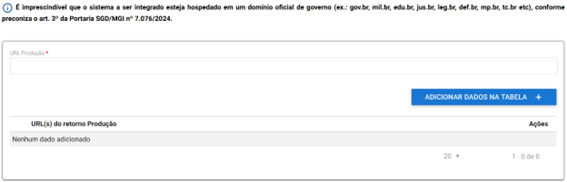

20. Anexar as evidências do funcionamento do módulo em ambiente de homologação 

Imagem 16 – evidências:

21. Registrar ciência nos termos, conforme abaixo

Imagem 17 – termo:

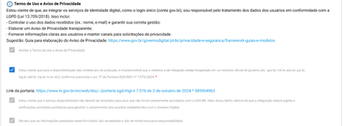

22. Localizar a sessão “Enviar dados/Dúvidas” e selecionar a opção “Enviar Dados de Produção” conforme exemplo

Imagem 18 – enviar dados:

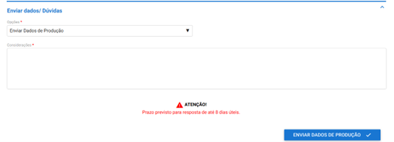

23.	Incluir as considerações que julgar pertinentes e clicar em “ENVIAR DADOS DE PRODUÇÃO”

24.	A solicitação ficará na fase 5 “Desenvolvimento”. Aguardar o prazo de até 8 dias úteis.

Imagem 19 – fase 5:

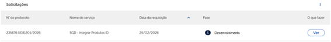

2ª ETAPA – Finalização
----------------------

25.	Acessar a página do `Serviço de Integração aos Produtos de Identidade Digital GOV.BR <https://www.gov.br/governodigital/pt-br/estrategias-e-governanca-digital/transformacao-digital/servico-de-integracao-aos-produtos-de-identidade-digital-gov.br>`_ e clicar em “Acompanhamento”. Fazer login com a mesma conta GOV.BR que iniciou a solicitação.

26.	Se houver ocorrido a alteração da fase 5 “Desenvolvimento” para a fase 6 “Análise para credencial de produção”, conforme imagem abaixo, clicar em “Ver” para dar andamento à solicitação. Caso a fase não tenha sido alterada, continuar verificando dentro do prazo de 8 dias úteis.

Imagem 20 – fase 6:

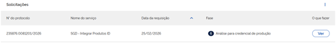

27.	Localizar a sessão “Análise do Produto Produção” e copiar os valores “client_id” e “secret”

.. admonition:: Atenção

   "Orientações adicionais estão disponíveis no `Manual de Instalação e Configuração <https://manuais.processoeletronico.gov.br/pt-br/homologacao/MODULOS-SEI/Modulo_resposta.html>`_do Módulo de Assinatura Eletrônica do SEI."

Imagem 21 – análise produção:

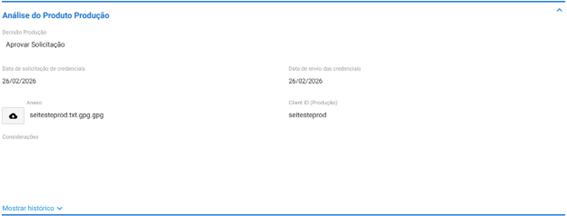

28.	Localizar a sessão “Disponibilização do serviço” e informar a “Data em que o serviço foi disponibilizado para a sociedade”.

Imagem 22 – disponibilização:

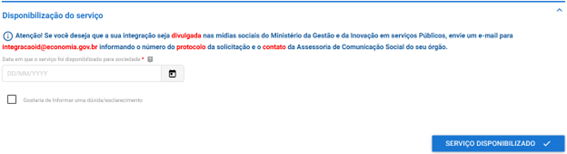

29.	Clicar em “SERVIÇO DISPONIBILIZADO” para finalizar.

Orientações gerais: 
-------------------

• Caso algum dado de produção informado esteja errado, o solicitante receberá um retorno nos e-mails cadastrados no formulário, para correção do problema;
• Caso o processo de solicitação de credenciais esteja parado por mais de 10 dias úteis na mesma etapa, favor enviar um e-mail para o endereço integracaoid@gestao.gov.br, informando o número da solicitação e explicando o ocorrido;
• Em caso de dúvidas técnicas sobre o preenchimento do formulário, favor enviar um e-mail para o endereço: integracao-acesso-govbr@economia.gov.br; 
