Módulo de Gestão Documental
===========================

O módulo de Gestão documental do SEI traz consigo uma série de funcionalidades que visam contribuir para a gestão arquivística dos processos possibilitando o arquivamento, o desarquivamento, o controle dos prazos de guarda, a avaliação e a eliminação.

Essa seção tem por objetivo demonstrar as funcionalidades que serão disponibilizadas pelo módulo de Gestão Documental e também as configurações necessárias para o seu correto funcionamento.

O módulo de Gestão Documental adiciona funcionalidades ao SEI, tais como:

|icone_arquivar_processo| **Arquivar Processo** – Possibilita o arquivamento de processos.

|icone_desarquivar_processo| **Desarquivar Processo** – Possibilita que um processo arquivado seja desarquivado e retorne para a tela de controle de processos.

|icone_menu_pendenciar_de_arquivamento| **Menu Pendências de Arquivamento** – Exibe todos os processos pendentes de arquivamento cuja unidade foi a última a concluir.

|icone_menu_arquivo_da_unidade| **Menu Arquivo da Unidade** – Concentra todos os processos arquivados pela unidade e que se encontram em fase de guarda corrente.

|icone_menu_gestao_documental| **Menu Gestão Documental** – Possibilita a avaliação dos processos, a geração de listagens, editais e termos de eliminação, bem como a efetivação da eliminação.

**Acervo Global** - Lista os processos sem andamentos abertos e cujas unidades por onde eles tramitaram encontram-se desativadas.

Neste manual serão detalhadas todas as parametrizações e funcionalidades do módulo.

Parametrizações
---------------

No Sistema de Permissões (SIP)
++++++++++++++++++++++++++++++

Concessão dos perfis
^^^^^^^^^^^^^^^^^^^^

O módulo de Gestão Documental inclui dois novos perfis no SEI: perfil GD Arquivamento, que permite realizar o arquivamento e o desarquivamento de processos, e o perfil GD Avaliação, que permite realizar as configurações da gestão documental, a avaliação e a eliminação de processos. 

.. admonition:: ATENÇÃO 

   A partir da versão 4.1, o SEI possui menus e recursos de gestão documental nativos. Para o correto funcionamento do módulo de Gestão documental, é necessário que os recursos sejam desativados no SIP, menu Recursos > Listar, conforme orientação abaixo:

**Recursos que devem ser desativados:**

.. list-table::
   :widths: 20
   :header-rows: 1

   - * Recurso:
   - * arquivamento_eliminacao_listar
   - * avaliacao_documental_pesquisar
   - * cpad_avaliacao_listar
   - * cpad_cadastrar
   - * cpad_listar
   - * cpad_reativar
   - * edital_eliminacao_listar

No Sistema Eletrônico de Informações (SEI)
++++++++++++++++++++++++++++++++++++++++++++++

Acervo Global
^^^^^^^^^^^^^^

Esta funcionalidade lista os processos sem andamentos abertos e cujas todas as unidades por onde eles tramitaram encontram-se desativadas.

Acesse o menu Administração > Gestão documental > Acervo Global

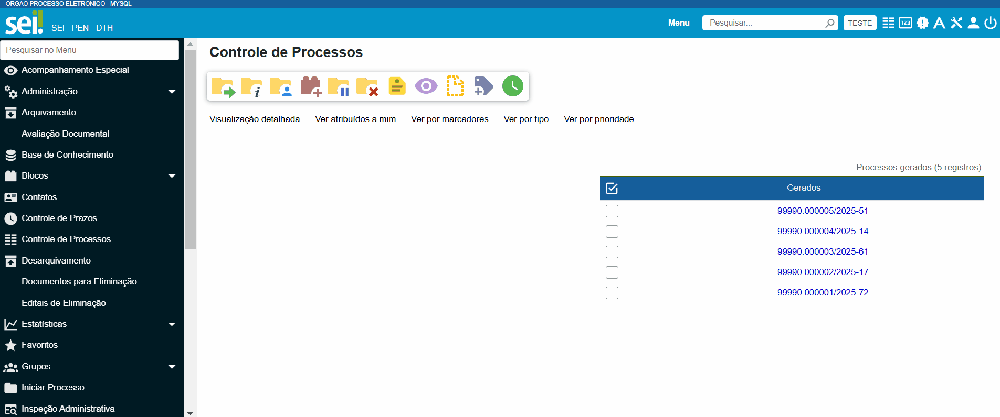

Configurações da Gestão Documental
^^^^^^^^^^^^^^^^^^^^^^^^^^^^^^^^^^

Por meio deste menu é possível configurar os tipos de processos e tipos de documentos que serão utilizados pelo Módulo. Além disso, é possível definir em dias a contagem do prazo do Edital de Ciência de Eliminação, a fim de que o módulo habilite a funcionalidade de eliminação dos processos ao final do prazo parametrizado.

.. admonition:: ATENÇÃO 

   Por padrão, o Módulo de Gestão Documental vem com o campo **“Contagem do Prazo do Edital de Ciência de Eliminação de Documentos”** pré-configurado em 30 (trinta) dias. É possível alterar esta configuração para até 45 dias, conforme prazo definido na Resolução nª 5 do CONARQ, de 30 de setembro de 1996.

Acesse o menu Administração > Gestão documental > Configurações 

.. figure:: _static/images/GIF_Configuracoes_GD.gif
 
Justificativas de Arquivamento e Desarquivamento
^^^^^^^^^^^^^^^^^^^^^^^^^^^^^^^^^^^^^^^^^^^^^^^^^

Neste menu é possível listar, incluir e excluir as justificativas a serem selecionadas quando da execução das atividades de arquivamento e desarquivamento de processos. 
 
O Módulo já conta com justificativas cadastradas previamente. Para incluir novas justificativas, acesse  o Menu Gestão documental > Justificativas de Arquivamento/Desarquivamento > Novo e realize o cadastro.

Unidades de Arquivamento
^^^^^^^^^^^^^^^^^^^^^^^^

Neste menu é possível listar, excluir e cadastrar as unidades que poderão realizar o arquivamento e desarquivamento de processos. Para cada unidade de arquivamento cadastrada é necessário indicar também a unidade que será responsável por realizar a avaliação dos processos quando do cumprimento do prazo de guarda corrente. 

Para cadastrar unidades de arquivamento, acesse  o Menu Gestão documental > Unidades de Arquivamento e realize o cadastro.

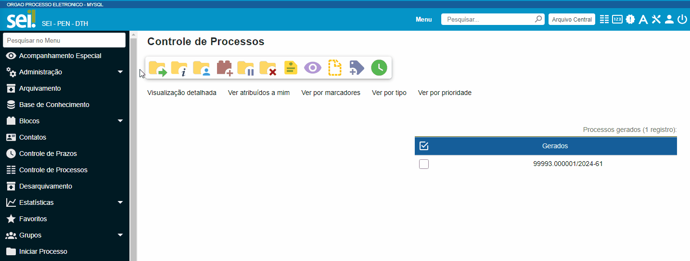

Uso do Sistema
--------------

O sistema foi desenvolvido cumprindo as normativas de gestão documental expedidas pelo Arquivo Nacional e pelo Conselho Nacional de Arquivos – Conarq. O fluxo é baseado na Teoria das Três Idades, e possui três macroprocessos: o arquivamento, a avaliação e a destinação, incluindo seus respectivos procedimentos e operações técnicas.

.. admonition:: ATENÇÃO 

   Na atual versão do Módulo as atividades referentes à destinação englobam apenas a eliminação. O recolhimento estará disponível na próxima versão do Módulo.

Menu Pendências de Arquivamento
++++++++++++++++++++++++++++++++

No menu pendências de arquivamento encontram-se todos os processos cuja unidade foi a última a concluir e se encontram pendentes de arquivamento.

Neste menu, são listados os processos disponíveis para arquivamento. Também é possível utilizar os filtros presentes na parte superior da tela para pesquisa, bem como realizar o arquivamento e a reabertura de cada processo individualmente ou em lote.

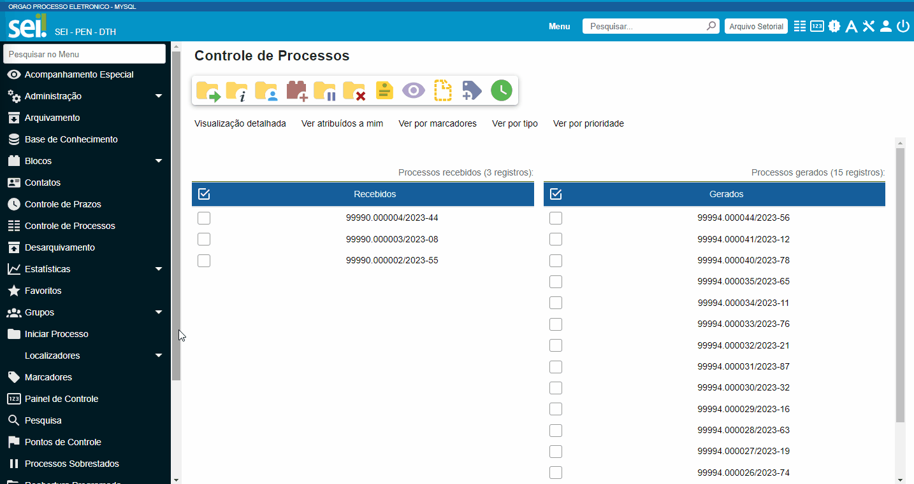

Arquivar Processo
+++++++++++++++++

A primeira etapa para o início da contagem dos prazos de guarda inicia-se no momento do arquivamento do processo, procedimento que finda a ação administrativa objeto do processo.

O arquivamento segue as orientações da `Portaria Interministerial MJ/MPOG nº 1677/2015 <https://www.gov.br/compras/pt-br/acesso-a-informacao/legislacao/portarias/portaria-interministerial-ndeg-1-677-de-07-de-outubro-de-2015>`_.

O botão “**Arquivar Processo**” será utilizado para indicar que o último ato processual foi realizado, ou seja, tal processo não terá mais movimentações e estará pronto para iniciar a contagem dos prazos de guarda.

O arquivamento pode ser realizado através da tela de Pendências de Arquivamento e da tela do processo. 

Para realizar o arquivamento, clique no ícone |icone_arquivar_processo|, escolha a justificativa e selecione ou altere o assunto. Em seguida, insira a senha e clique em “**assinar**”. O Termo de Arquivamento é gerado automaticamente e inserido no processo arquivado.

.. admonition:: ATENÇÃO

   Só é possível reabrir processos que estejam apenas concluídos. Processos arquivados precisam ser desarquivados para voltarem a tramitar.

Arquivando processo pelas Pendências de Arquivamento

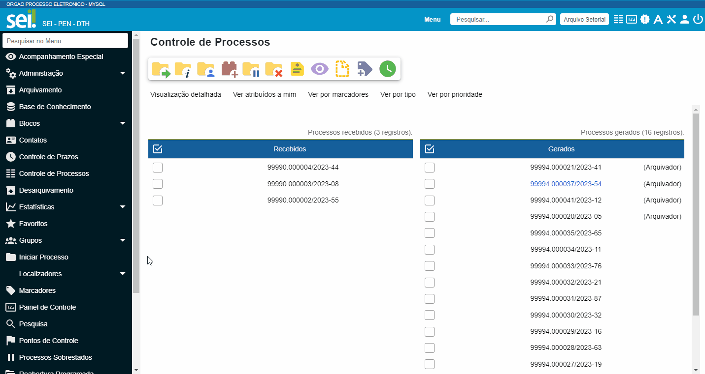

Arquivando processo por meio da Tela do Processo

O arquivamento impede que novos documentos ou andamentos sejam associados ao processo, sendo possível acessar apenas os seguintes ícones:

a.Iniciar Processo Relacionado;

b.Consultar Processo;

c.Acompanhamento Especial;

d.Adicionar aos Favoritos;

e.Anotações;

f.Gerar Arquivo PDF do Processo;

g.Gerar Arquivo ZIP do Processo;

h.Comentários;

i.Controle de Processos;

j.Pesquisar no Processo;

k.Consultar Histórico de Arquivamento do Processo;

l.Desarquivar Processo.

Arquivamento Legado
^^^^^^^^^^^^^^^^^^^

O Arquivamento Legado é uma funcionalidade que permite o arquivamento do processo com data retroativa. Porém, essa ação só é permitida em processos sem andamentos abertos e concluídos em data anterior a atual. Ao instalar o módulo, os processos concluídos e sem andamentos abertos irão aparecer nas Pendências de Arquivamento da última unidade que o concluiu.

.. admonition:: ATENÇÃO

   No arquivamento legado não é possível selecionar uma data de arquivamento anterior à data da última conclusão do processo.

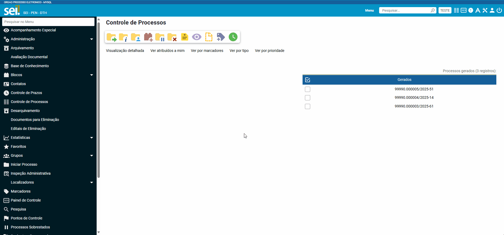

Arquivo da Unidade
+++++++++++++++++++

Após arquivado, o processo ficará disponível no menu “**Arquivo da Unidade**” até o cumprimento do tempo de guarda em fase corrente. 

Neste menu é possível pesquisar, imprimir e desarquivar processos.

 
Desarquivar Processo
++++++++++++++++++++++

O botão “**Desarquivar Processo**” permite executar o desarquivamento, fazendo com que retorne para a tela de controle de processos da unidade que o desarquivou.

Para realizar o desarquivamento, clique no ícone |icone_desarquivar_processo| e escolha a justificativa. Em seguida, insira a senha e clique em “**assinar**”. O Termo de Desarquivamento é gerado automaticamente e inserido no processo desarquivado.

O desarquivamento de um processo poderá ser realizado por meio da tela do processo ou pelo menu “**Arquivo da Unidade**”.

Desarquivando processo pela tela Arquivo da Unidade

Desarquivando processo por meio da Tela do Processo

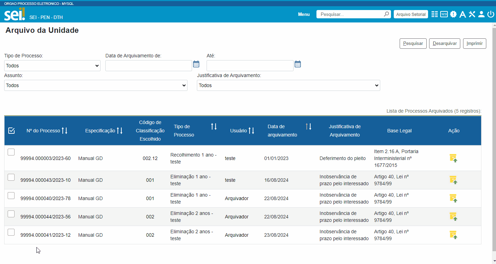

Menu Gestão Documental
+++++++++++++++++++++++

O menu Gestão documental poderá ser utilizado pelo usuário lotado na Unidade configurada como de Avaliação que possua o perfil GD Avaliação. Neste menu ficarão disponíveis as seguintes opções:

• Avaliação de Processos
• Listagens de Eliminação
• Listagens de Recolhimento
• Relatórios

Avaliação de Processos
^^^^^^^^^^^^^^^^^^^^^^^

Na funcionalidade Avaliação de Processos ficam concentrados todos os processos arquivados pelas respectivas unidades de arquivamento e que cumpriram o prazo de guarda corrente. Nesta tela o usuário poderá avaliar se as informações relativas ao processo estão adequadas, bem como alterar, se necessário, a classificação por assunto e enviar o processo para a etapa de preparação da listagem de eliminação ou para a etapa de preparação da listagem de recolhimento.

Nesta tela também é possível realizar pesquisas através dos filtros e imprimir a relação de processos.

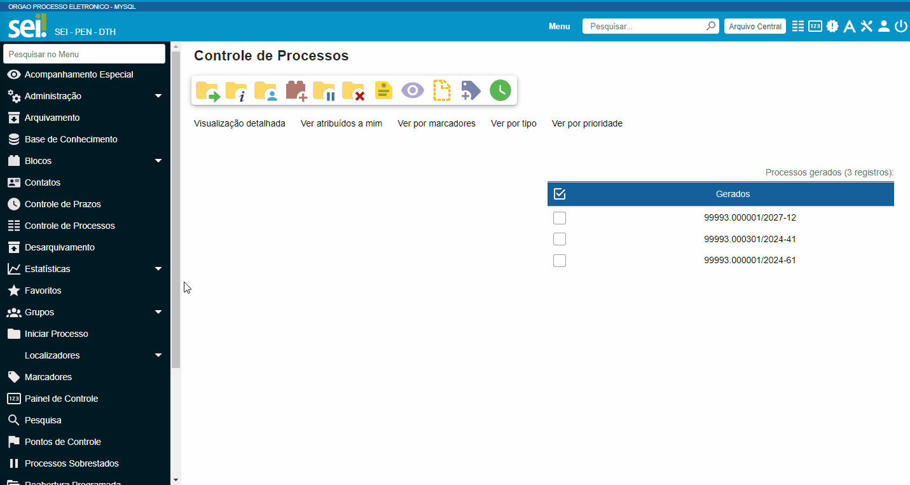

Preparação da Listagem de Eliminação
^^^^^^^^^^^^^^^^^^^^^^^^^^^^^^^^^^^^^

Para indicar que um único processo deve ser enviado para a tela “**Preparação da Listagem de Eliminação**”, o usuário deverá clicar no ícone “**Preparar Listagem de Eliminação**”, presente na coluna ”**ações do processo**”, este ícone só será habilitado após transcorrido o prazo corrente do processo. Após o clique no botão, o sistema apresentará uma mensagem de confirmação. Para concluir a ação, o usuário deverá clicar em “**Ok**”.

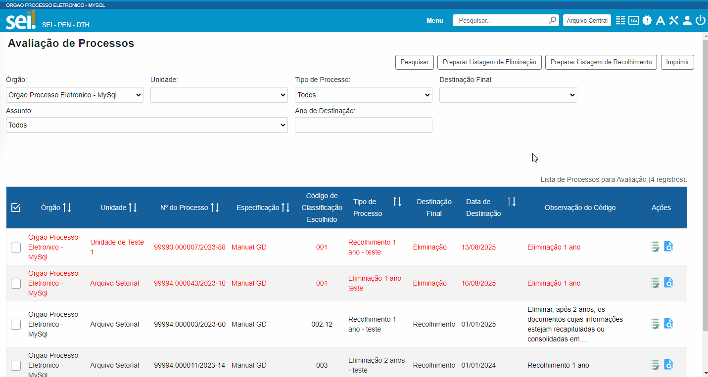

Para indicar que mais de um processo deve ser enviado para a tela “**Preparação da Listagem de Eliminação**", o usuário deverá selecionar todos os processos desejados via marcação de checkbox, e em seguida clicar no botão “**Preparar Listagem de Eliminação**” existente na parte superior direita da tela. Após o clique no botão, o sistema apresentará uma mensagem de confirmação. Para concluir a ação, o usuário deverá clicar em “**Ok**”.

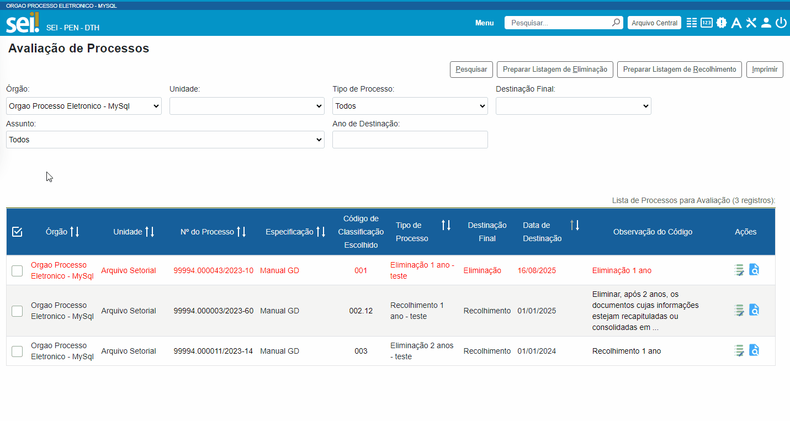

.. admonition:: ATENÇÃO

   Nesta tela, caso tenha sido selecionado algum processo cuja destinação final não seja eliminação, o módulo irá desconsiderar a seleção.

Os processos enviados para preparação da listagem de eliminação passarão a ser listados no menu “**Gestão Documental  > Listagens de Eliminação > Preparação da Listagem**”.

Preparação da Listagem
~~~~~~~~~~~~~~~~~~~~~~~

Para gerar uma listagem de eliminação, o usuário deverá selecionar os processos que deseja que componham a listagem e clicar em “**Gerar Listagem de Eliminação**”.

Ao gerar uma listagem, o sistema criará um novo processo contendo a listagem criada, que ficará disponível na tela de controle de processos, bem como no submenu “**Gestão das Listagens**”.

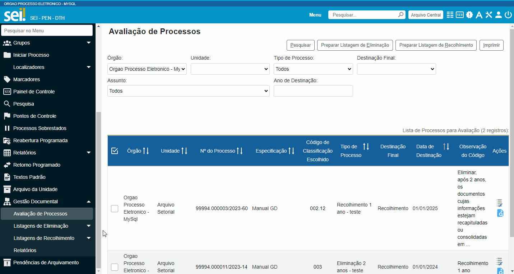

Adicionar observação e/ou justificativa.

Para registrar uma observação e/ou justificativa, o usuário deverá clicar no botão “Adicionar observação e/ou justificativa”, presente na grid do processo que deseja.
Preencher o campo com a informação desejada e clicar em Salvar.

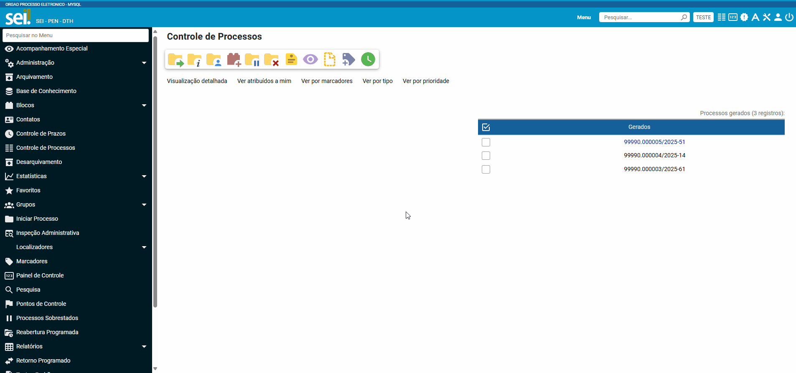

Após esta ação, a informação salva ficará disponível em tela no campo Observações e/ou Justificativas da Grid do processo.

Gestão das Listagens de Eliminação
~~~~~~~~~~~~~~~~~~~~~~~~~~~~~~~~~~~

A tela de Gestão das Listagens apresenta os processos de eliminação criados na fase de “**Preparação da Listagem**”. É possível visualizar a listagem de eliminação gerada clicando no número do processo.

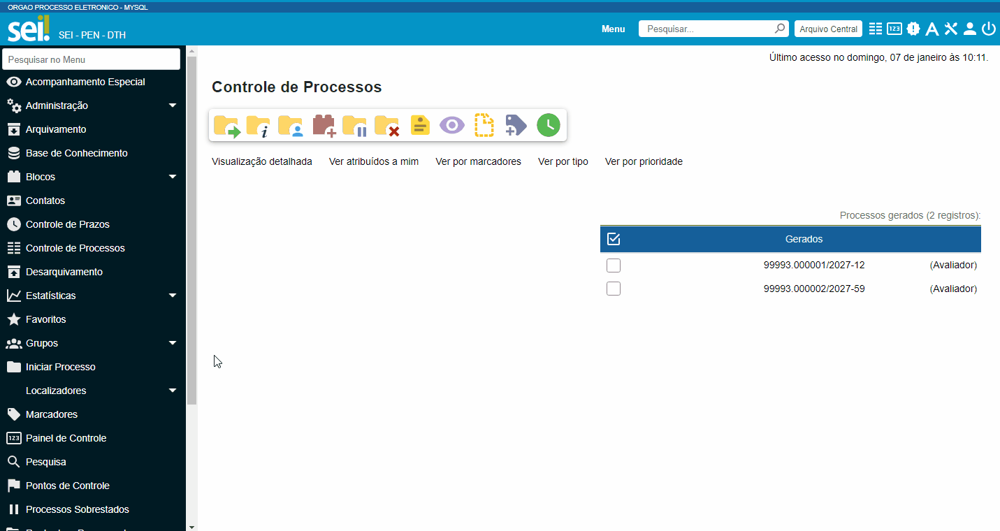

Nesta tela é possível realizar pesquisas através dos filtros e imprimir a relação de processos de eliminação. Através da coluna “**Ações**” também é possível visualizar a relação de processos incluídos na listagem, clicando no ícone |icone_listagem|, realizar anotações por meio do ícone |icone_anotacoes| e editar a listagem de eliminação através de clique no ícone |Icone_Editar_Listagem|.

Ao editar a listagem de eliminação, serão apresentados dois novos ícones. Para adicionar processos à listagem gerada, clique no ícone |Icone_Adicionar_Processos|. Serão apresentados os processos presentes na tela de preparação da listagem de eliminação. Selecione os processos que deseja incluir na listagem e em seguida clique em |Icone_Adicionar_Processos_Gestao_de_Listagem|.

Para excluir processos da listagem gerada, clique no ícone |Icone_Excluir_Processos|. Em seguida selecione os processos que deseja excluir e clique em |Icone_Excluir_Processos_Gestao_de_Listagem|.

Para concluir a edição da listagem, clique no ícone |Icone_Concluir_Edicao_da_Listagem|. Nesse momento será gerada uma nova listagem de eliminação no processo.

.. admonition:: ATENÇÃO

   É possível excluir as listagens de eliminação antigas clicando no ícone |Icone_Excluir|. Apenas a última listagem gerada no processo não pode ser excluída. Após a assinatura da Listagem de Eliminação será possível gerar o Edital de Ciência de Eliminação de Documentos.

Gerar Edital de Ciência de Eliminação
~~~~~~~~~~~~~~~~~~~~~~~~~~~~~~~~~~~~~~

Após a assinatura da listagem de eliminação, será habilitado o ícone |Icone_Gerar_Edital_de_Ciencia|, que permite a geração do Edital de Ciência de Eliminação de Documentos. 

Para gerá-lo, clique no ícone |Icone_Gerar_Edital_de_Ciencia|. O Edital será gerado no mesmo processo onde consta a Listagem de Eliminação de Documentos. Após a geração do Edital, ele deverá ser assinado pela autoridade competente.

Após sua edição e assinatura, o edital deverá ser publicado no Diário Oficial da União. Após a publicação, clique no ícone |Icone_Publicacao_DOU| e preencha os campos referentes ao veículo de publicação “DOU”. A partir da data informada o módulo irá contabilizar o prazo configurado no parâmetro “Contagem do Prazo do Edital de Ciência de Eliminação de Documentos” presente em Administração > Gestão Documental > Configurações. O prazo citado pode ser de 30 a 45 dias.

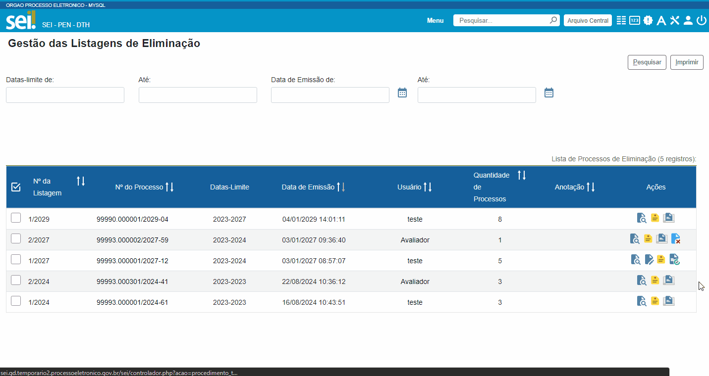

Executar Eliminação
~~~~~~~~~~~~~~~~~~~~

Finda a contagem do prazo definido no edital, o módulo habilitará o ícone que permite a execução do procedimento de eliminação. Para eliminar os processos clique no ícone |Icone_Executar_Eliminacao| e confirme a execução do procedimento clicando em OK.

Os processos que constam na Listagem de Eliminação serão eliminados e ficarão indisponíveis para consulta, sendo preservados apenas os metadados.

Feita a eliminação, o Termo de Eliminação de Documentos será gerado de forma automática no processo de eliminação. O termo deverá ser editado e assinado pela autoridade competente.

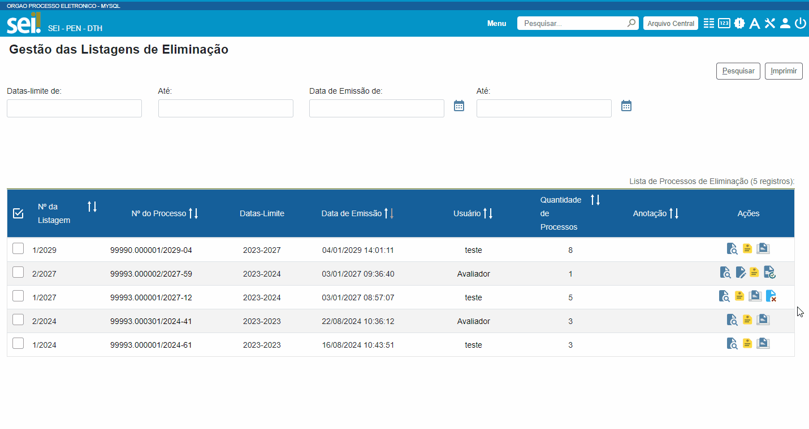

.. admonition:: ATENÇÃO

   Os modelos de documentos “Listagem de Eliminação de Documentos”, “Edital de Ciência de Eliminação de Documentos” e “Termo de Eliminação de Documentos” estão de acordo com a `Resolução CONARQ nº 40, de 09 de dezembro de 2014 <https://www.gov.br/conarq/pt-br/legislacao-arquivistica/resolucoes-do-conarq/resolucao-no-40-de-9-de-dezembro-de-2014-alterada>`_.

Relação de Documentos Externos
~~~~~~~~~~~~~~~~~~~~~~~~~~~~~~
 
O Módulo de Gestão Documental mostra a relação de documentos externos que foram eliminados no ícone |Icone_listagem_excluido|. Tanto os documentos digitalizados, e sua localização, quanto os nato-digitais. Seus metadados também ficam guardados no módulo.

Preparação da Listagem de Recolhimento
+++++++++++++++++++++++++++++++++++++++

Para indicar que um único processo deve ser enviado para a tela “**Preparação da Listagem de Recolhimento**”, o usuário deverá clicar no ícone “**Preparar Listagem de Recolhimento**”, presente na coluna ações do processo. Após o clique no botão, o sistema apresentará uma mensagem de confirmação. Para concluir a ação, o usuário deverá clicar em “**Ok**”.

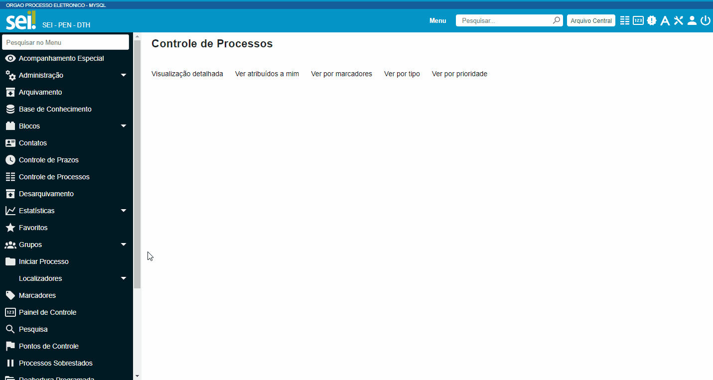

Para indicar que mais de um processo deve ser enviado para a tela “**Preparação da Listagem de Recolhimento**", o usuário deverá selecionar todos os processos desejados via marcação de checkbox, e em seguida clicar no botão “**Preparar Listagem de Recolhimento**” existente na parte superior direita da tela. Após o clique no botão, o sistema apresentará uma mensagem de confirmação. Para concluir a ação, o usuário deverá clicar em “**Ok**”.

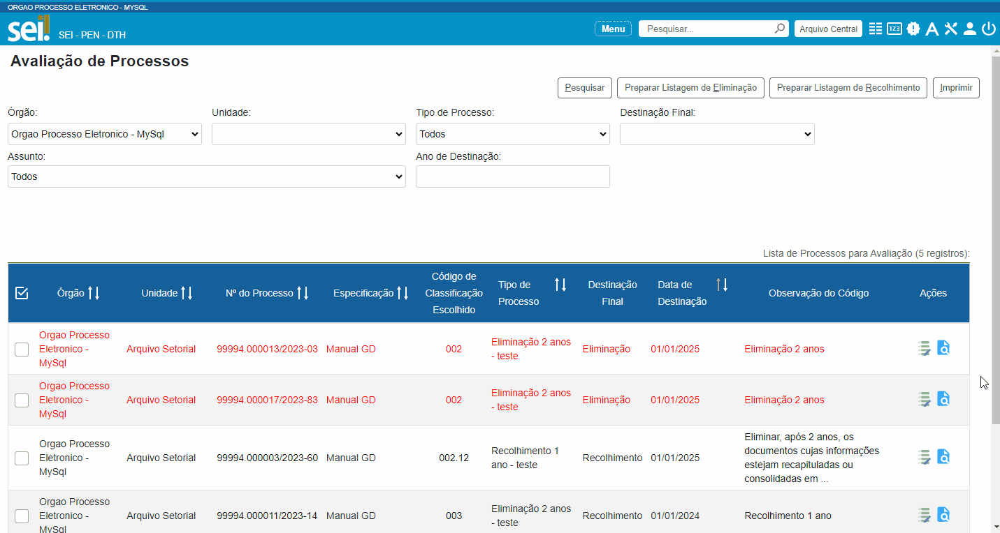

.. admonition:: ATENÇÃO

   Nesta tela, caso tenha sido selecionado algum processo cuja destinação final não seja recolhimento, o módulo irá desconsiderar a seleção.

Os processos enviados para Preparação da listagem de recolhimento irão permanecer nesta tela até que seja disponibilizada a próxima versão do Módulo de Gestão Documental.

Gestão das Listagens de Recolhimento
++++++++++++++++++++++++++++++++++++

Esta funcionalidade estará disponível a partir da próxima versão do módulo.

