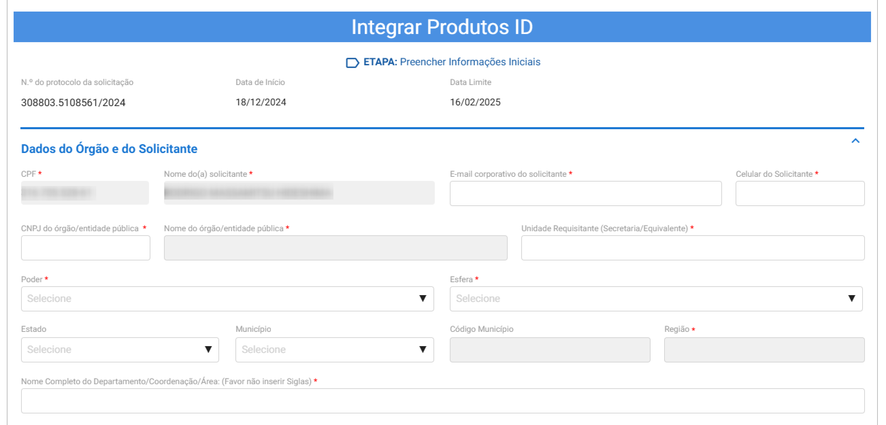
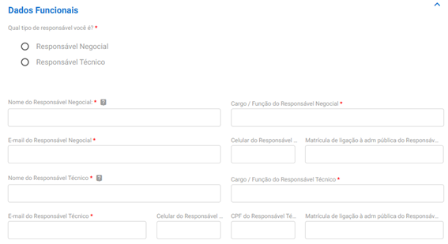
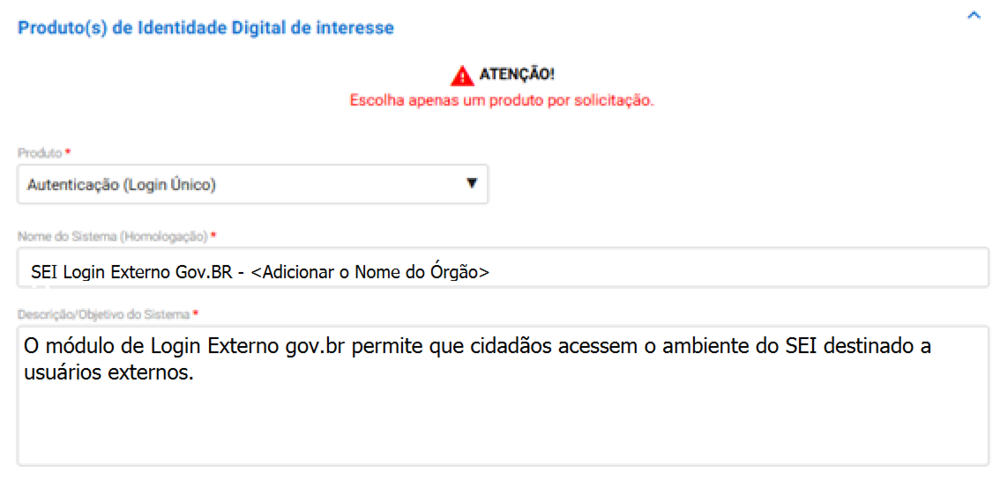
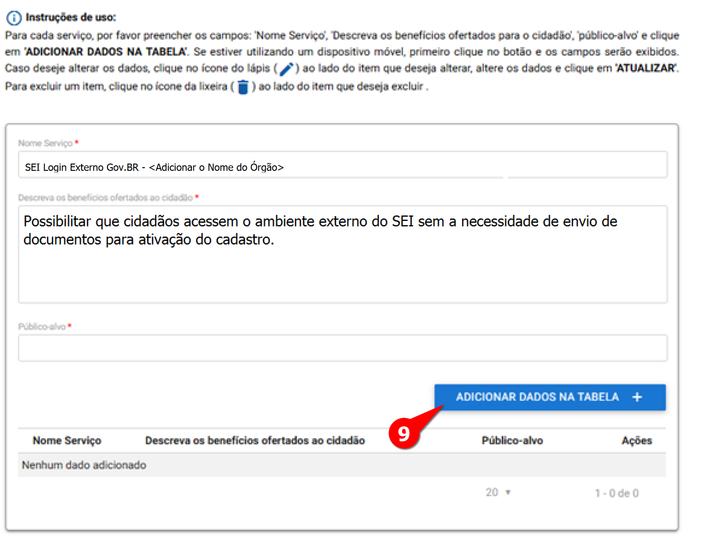
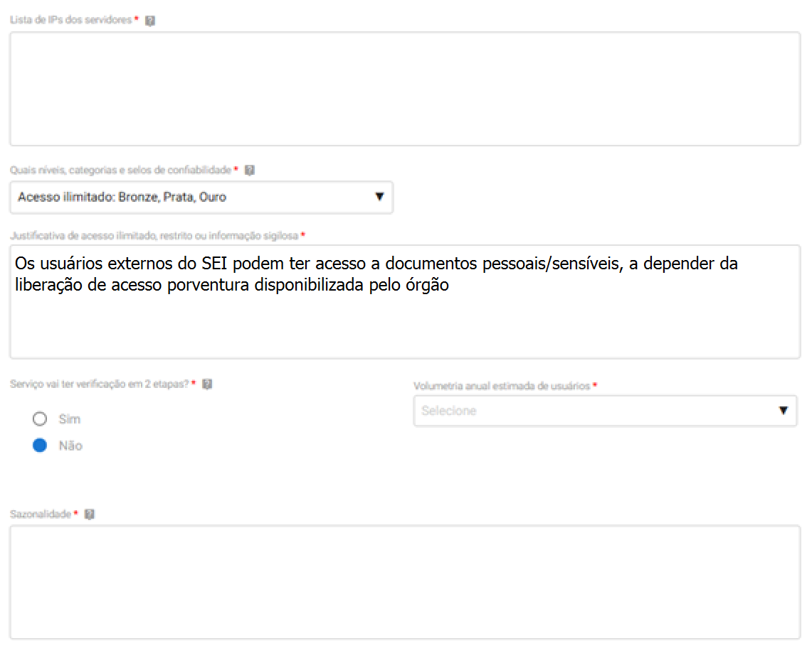
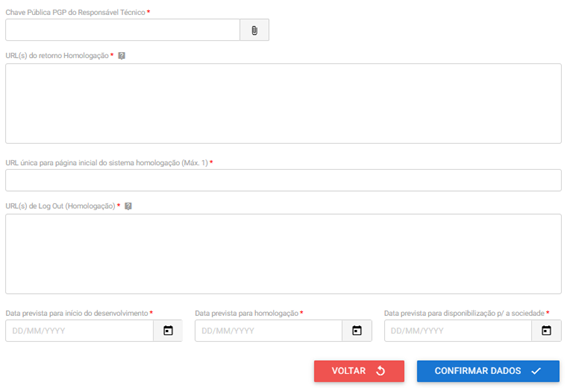
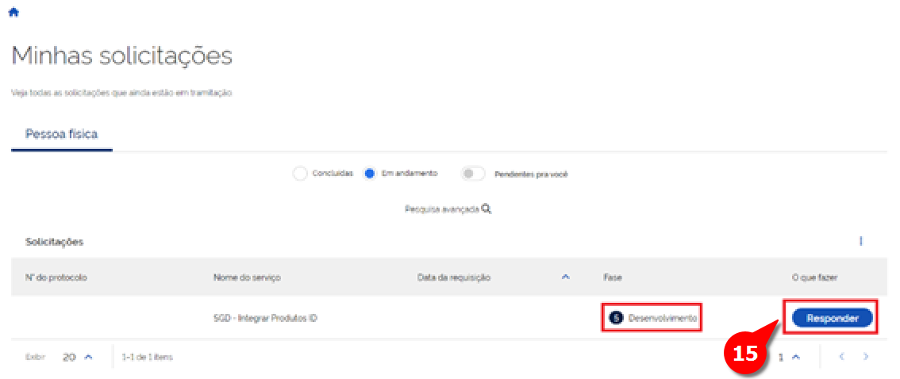
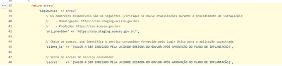
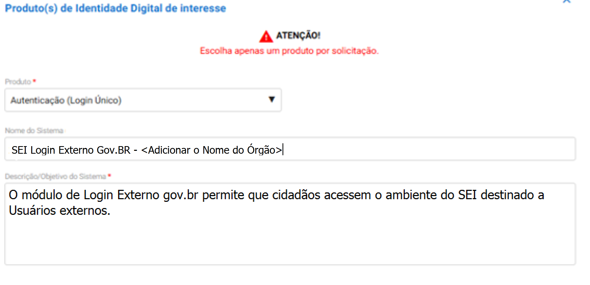
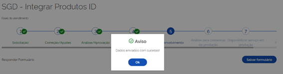

Solicitação de credenciais para uso dos módulos Login Externo GOV.BR
====================================================================

Introdução
----------

A solicitação de credenciais é uma das etapas necessárias para utilização dos módulos **Login Externo GOV.BR** e **Assinatura Avançada do SEI**. A solicitação é feita junto à Secretaria de Governo Digital do Ministério da Gestão e da Inovação em Serviços Públicos (SGD/MGI) por meio do `Serviço de Integração aos Produtos de Identidade Digital GOV.BR <https://www.gov.br/governodigital/pt-br/estrategias-e-governanca-digital/transformacao-digital/servico-de-integracao-aos-produtos-de-identidade-digital-gov.br>`_.

Neste tutorial, abordaremos os passos necessários para solicitar as credenciais para os ambientes de homologação e produção para o caso do Login Externo GOV.BR.

1ª ETAPA – Solicitação
----------------------

01. Acessar a página do `Serviço de Integração aos Produtos de Identidade Digital GOV.BR <https://www.gov.br/governodigital/pt-br/estrategias-e-governanca-digital/transformacao-digital/servico-de-integracao-aos-produtos-de-identidade-digital-gov.br>`_ .

02. Clicar no botão “Iniciar” 

.. figure:: _static/images/ModExt_01-Solicitacao_Iniciar.png
  
03. Fazer login com a conta GOV.BR do agente público (preferencialmente um servidor público efetivo ou comissionado)

.. figure:: _static/images/ModExt_01-Login_GOVBR.png
 
04. Preencher os dados do solicitante e do órgão/entidade

05. Preencher os dados do Responsável Negocial e do Responsável Técnico 
 

06. Preencher o Questionário, conforme abaixo
 
.. figure:: _static/images/ModExt_01-Solicitacao_Questionario.png

.. admonition:: Justifique o benefício

   "O uso do login gov.br dispensará a necessidade de envio de documentos comprobatórios para efetivação do cadastro de usuários externos do SEI."

07. Clicar em “Avançar”

08. Preencher os campos sobre o produto a ser integrado 

.. admonition:: Nome do Sistema (Homologação)

   "SEI Login Externo Gov.BR - <Adicionar o Nome do Órgão>"

.. admonition:: Descrição/Objetivo do Sistema

   "O módulo de Login Externo gov.br permite que cidadãos acessem o ambiente do SEI destinado a usuários externos."

09. Preencher os dados sobre o serviço a ser integrado e em seguida clique em “ADICIONAR DADOS NA TABELA +”
  

 
.. admonition:: Nome do Serviço

   "SEI Login Externo Gov.BR - <Adicionar o Nome do Órgão>

.. admonition:: Descreva os benefícios ofertados ao cidadão

   "Possibilitar que cidadãos acessem o ambiente externo do SEI sem a necessidade de envio de documentos para ativação do cadastro."

10. Preencher os campos abaixo conforme indicação:
 

.. admonition:: Atenção

   No campo “Lista de IPs dos servidores” digite o IP público da instalação do SEI. Em caso de dúvida, consulte a área de TI do seu órgão ou entidade."

.. admonition:: Quais níveis, categorias e selos de confiabilidade

   Para o módulo Login Externo gov.br selecionar:
   Acesso ilimitado: Bronze, Prata, Ouro

.. admonition:: Justificativa de acesso ilimitado, restrito ou informação sigilosa

   "Os usuários externos do SEI podem ter acesso a documentos pessoais/sensíveis, a depender da liberação de acesso porventura disponibilizada pelo órgão."

11. Preencher os campos abaixo conforme indicação:

 
.. admonition:: Atenção

   Orientações sobre como criar um par de chaves PGP podem ser obtidas no `Roteiro de Integração do Login Único <https://acesso.gov.br/roteiro-tecnico/chavepgp.html>`_.

.. admonition:: URL(s) do retorno (Homologação)

   Sugestão de texto para o módulo Login Externo gov.br:
   "http://ENDEREÇO SEI/sei/modulos/loginunico/controlador_loginunico.php"  ou
   "https://ENDEREÇO SEI/sei/modulos/loginunico/controlador_loginunico.php"

.. admonition:: URL única para página inicial do sistema (Homologação) (Máx. 1)
 
   http://ENDEREÇO SEI  ou
   https://ENDEREÇO SEI

.. admonition:: URL de Logout (Homologação)

   http://<ENDEREÇO SEI>/sei/modulos/loginunico/logout.php  ou
   https://<ENDEREÇO SEI>/sei/modulos/loginunico/logout.php

12. Clicar em "Confirmar dados".

13. Aceitar os termos e clicar em “Enviar solicitação”, aguardando o prazo de até 10 dias úteis para retorno deste primeiro formulário, onde o processo ficará com o status 3 “Análise/Aprovação”.
 
.. figure:: _static/images/ModExt_01-Solicitacao_CienciaTermos_EnvioSolicitacao.png

.. figure:: _static/images/ModExt_01-Solicitacao_Lista-Status.png

2ª ETAPA - Finalização
----------------------
 
14. Fazer login com a mesma conta GOV.BR que o processo foi iniciado e clicar em “Acompanhamento”.

15. Se houver ocorrido a alteração do status 3 “Análise/Aprovação” para outro, conforme imagem abaixo, clicar em “Responder” para dar andamento no processo. Caso o status não tenha sido alterado, favor aguardar e continuar verificando dentro dos próximos 10 dias úteis.
 

16. Localizar a sessão “Análise do Produto Homologação”

17. Em “Considerações”, copiar os valores “client_id” e “secret”.

.. figure:: _static/images/ModExt_02-Finalizacao_Analise_Prod_Homol-Consideracoes.png

18. Acessar o arquivo de configuração “ConfiguracaoModLoginUnico.php” e alterar o os campos "Client ID" e "Secret" com as informações obtidas no passo anterior, conforme linhas 45 e 48 da imagem abaixo. 

 
19. Salvar o arquivo e realizar testes de login.

Grave um vídeo do teste realizado no ambiente de homologação que demonstre a integração do SEI ao login GOV.BR seguindo as seguintes instruções:

A. No navegador, acessar a página de `acesso externo ao SEI <http://<ENDEREÇO SEI>/sei/controlador_externo.php?acao=usuario_externo_controle_acessos&id_orgao_acesso_externo=0>`_

B. Clicar no botão “Entrar com gov.br”

C. Fazer login utilizando a conta gov.br de qualquer usuário que tenha conta gov.br e acesso ao sistema

D. Fazer logout do sistema (sair da conta de usuário)

20. Voltar à página do formulário de `Serviço de Integração aos Produtos de Identidade Digital GOV.BR <https://www.gov.br/governodigital/pt-br/estrategias-e-governanca-digital/transformacao-digital/servico-de-integracao-aos-produtos-de-identidade-digital-gov.br>`_ e procurar pelos seguintes campos: 

 .. figure:: _static/images/ModExt_02-Finalizacao_Chaves_URLs.png

.. admonition:: URL(s) do retorno (Produção)

   https://ENDEREÇO SEI/sei/modulos/loginunico/controlador_loginunico.php

.. admonition:: URL única para página inicial do sistema (Produção)

   https://ENDEREÇO SEI

.. admonition:: URL(s) de Log Out (Produção)

   https://ENDEREÇO SEI/sei/modulos/loginunico/logout.php

.. admonition:: Atenção

   Caso necessário, altere as datas previstas para Início do desenvolvimento, Homologação e Disponibilização para a sociedade.

- Favor adicionar vídeo que demonstre a integração: Anexe o vídeo descrito no :ref:`passo 19 <19>`

- Caso necessário, altere as datas possíveis (Data prevista para início do desenvolvimento, Data prevista para homologação, Data prevista para disponibilização da sociedade);

- Favor adicionar vídeo que demonstre a integração: Anexe o vídeo descrito no passo anterior
        
21. Procurar a seção “Produto(s) de Identidade Digital de interesse” e digitar “SEI Login Externo Gov.BR - <Adicionar o Nome do Órgão>”SEI em “Nome do Sistema”, conforme imagem abaixo:

.. admonition:: Descrição/Objetivo do Sistema

   O módulo de Login Externo gov.br permite que cidadãos acessem o ambiente do SEI destinado a usuários externos.

22. Rolar até o fim do formulário e na seção “Enviar dados/Dúvidas” selecionar a opção “Enviar dados de produção”;

.. figure:: _static/images/ModExt_02-Finalizacao_EnviarDadosProd.png
 
23. Clicar no botão “Enviar dados de produção” 
 
.. figure:: _static/images/ModExt_01-Finalizacao_EnviarDadosProd_bot.png

 
24. Executar novamente os passos 14 a 17 Passos , para localizar o “client_id” e o “secret” de produção, e executar novamente o passo 18, mas desta vez incluindo no arquivo de configuração as credenciais de produção recebidas. Após salvar o arquivo a integração estará concluída.

Orientações gerais: 

• A opção de login com o gov.br funcionará paralelamente ao login com o cadastro de usuário externo nativo do SEI;
• Caso algum dado de produção informado esteja errado, o solicitante receberá um retorno nos e-mails cadastrados no formulário, para correção do problema;
• Caso o processo de solicitação de credenciais esteja parado por mais de 10 dias úteis na mesma etapa, favor enviar um e-mail para o endereço integracaoid@gestao.gov.br, informando o número da solicitação e explicando o ocorrido;
• Em caso de dúvidas técnicas sobre o preenchimento do formulário, favor enviar um e-mail para o endereço: integracao-acesso-govbr@gestao.gov.br; 
• Os procedimentos para solicitar o credenciamento de órgãos podem ser encontrados no endereço https://manual-roteiro-integracao-login-unico.servicos.gov.br/pt/stable/solicitarconfiguracao.html;
• Para mais informações, entre em contato pelo telefone 0800 978-9005 ou pela Central de Serviços do PEN, endereço https://portaldeservicos.gestao.gov.br.
