Manual de Utilização do Módulo de Assinatura Eletrônica
=======================================================

1. INTRODUÇÃO 
-------------

O Módulo de Assinatura Eletrônica possibilita que os usuários assinem documentos por meio de assinatura avançada (`FAQ 1.5 <https://wiki.processoeletronico.gov.br/pt-br/latest/MODULOS_SEI/SEI_Assina/Perguntas_Frequentes_FAQ/Conceito.html#o-que-e-assinatura-avancada>`__) e qualificada (`FAQ 1.6 <https://wiki.processoeletronico.gov.br/pt-br/latest/MODULOS_SEI/SEI_Assina/Perguntas_Frequentes_FAQ/Conceito.html#o-que-e-assinatura-qualificada>`__). O novo módulo unifica todos os meios de assinatura, elimina o antigo componente Java do SEI e cria padronização entre órgãos. Os modelos de certificado compatíveis com o módulo estão enumerados na `FAQ 3.1 <https://wiki.processoeletronico.gov.br/pt-br/homologacao/MODULOS_SEI/SEI_Assina/Perguntas_Frequentes_FAQ/Credenciais.html#quais-credenciais-sao-necessarias-para-utilizar-o-modulo>`__

2. ASSINATURA ELETRÔNICA EM ÚNICO DOCUMENTO
-------------------------------------------

Os novos tipos de assinaturas são acessados por meio da funcionalidade Assinar Documento. De acordo com o tipo do documento, a forma como a tela é exibida para o usuário muda.

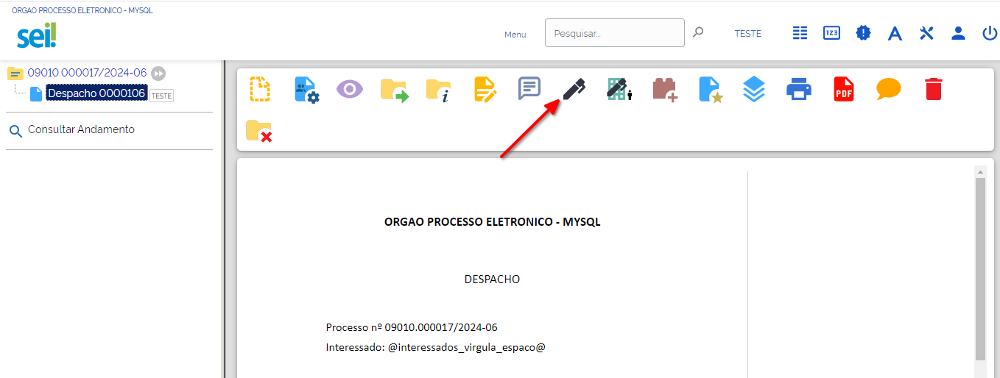

2.1 TIPOS DE DOCUMENTOS
^^^^^^^^^^^^^^^^^^^^^^^

**2.1.1 DOCUMENTOS INTERNOS**

Se for um documento interno, depois de clicar na funcionalidade “Assinar Documento”, é exibida a tela abaixo. 

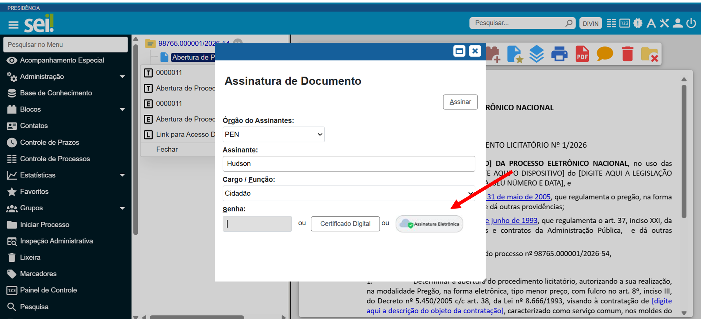

Após clicar em Assinatura Eletrônica, uma nova tela exibida comas seguintes informações para o usuário.

1. **Órgão Assinante:** selecionar o órgão do assinante;
2.	**Assinante:** Indicar o nome do assinante;
3.	**Cargo/função:** selecionar o cargo do assinante.

 **OBS1: Apenas os campos Órgão Assinante e Cargo/função estão habilitados para edição pelo usuário**.

Além das informações acima, também são exibidos os tipos de assinatura habilitados pelo Administrador do SEI no seu órgão. O usuário deve escolher um dos tipos para assinar o documento interno.

**2.1.1.1 Login e Senha**

Ao acessar o sistema utilizando Login e Senha, são exibidos os tipos de assinaturas habilitados pelo Administrador do Sistema.

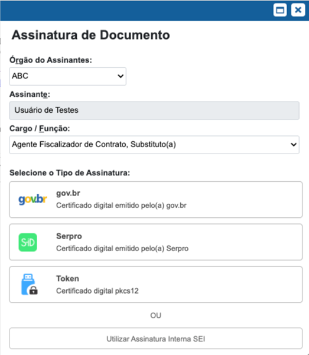

 **OBS1: Além das opções habilitadas, o usuário também consegue realizar a assinatura interna do SEI por meio da funcionalidade “Assinar Documento”. Como esse tipo de assinatura é nativa do sistema, caso tenha dúvidas de como realizar a assinatura simples, a orientação é realizar a leitura do** `Manual do SEI <https://manuais.processoeletronico.gov.br/pt-br/latest/SEI/Operacoes_basicas_com_documentos.html#assinar-documento-interno>`__ .

**2.1.1.2 Login gov.br**

Ao acessar o sistema utilizando gov.br, são exibidos os tipos de assinaturas habilitados pelo Administrador do Sistema, e a Assinatura Simples revalidada pelo gov.br. É importante destacar que essa última assinatura continua sendo do tipo simples, apesar da utilização gov.br.

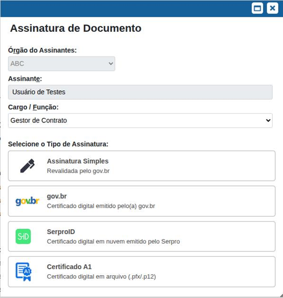

**2.1.2 DOCUMENTOS EXTERNOS**

Se for um documento externo (um pdf, por exemplo) é exibida a tela com os dados do assinante e tipos de certificados habilitados, depois de clicar no botão “Assinar Documento”. O usuário deve escolher um dos tipos para assinar o documento externo.

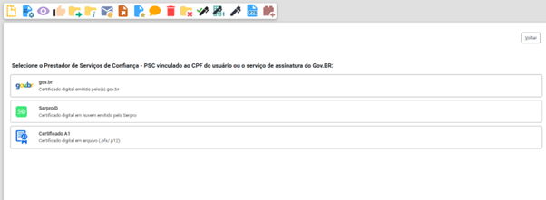

 **OBS: A partir da 1.4.0, essa funcionalidade está disponível para usuários externos.**

2.2 TIPOS DE ASSINATURAS
^^^^^^^^^^^^^^^^^^^^^^^^

**2.2.1 GOV.BR**

O módulo possibilita que o usuário realize a assinatura por meio do GOV.BR. Após a autenticação, o sistema encaminhará um SMS ou uma mensagem para o aplicativo gov.br (que deverá estar instalado no celular do usuário) com um código de autenticação.
Incluir o código de autorização encaminhado ao aplicativo gov.br no campo “Código” e clicar em “Autorizar”.

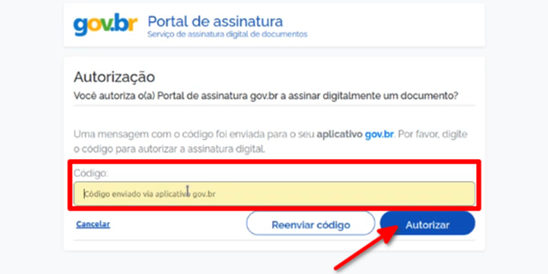

Após esta ação, o documento assinado via gov.br será atualização com a respectiva assinatura eletrônica.

 **OBS1: Na ** `FAQ 5.6 <https://wiki.processoeletronico.gov.br/pt-br/latest/MODULOS_SEI/SEI_Assina/Perguntas_Frequentes_FAQ/Assinar_e_Validar.html#qualquer-usuario-consegue-realizar-assinatura-por-meio-do-gov-br>`__  **é explicado quais usuários podem assinar utilizando o GOV.BR.**

 **OBS2: A assinatura gov.br é do tipo avançada.**

**2.2.2 SERPROID**

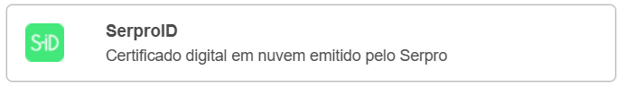

O módulo possibilita a assinatura utilizando o `certificado em nuvem emitido <https://wiki.processoeletronico.gov.br/pt-br/latest/MODULOS_SEI/SEI_Assina/Perguntas_Frequentes_FAQ/Conceito.html#o-que-e-icp-brasil>`__ pelo SERPRO. Para utilizar esse tipo de certificado, o usuário deve escolher a opção SERPROID, aparecerá um modal com o QRCode do SerproID, permitindo que, usando o app do Serpro, possa se fazer a leitura do respectivo código e fazer a validação da assinatura.

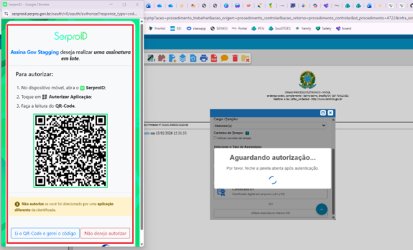

Abra o app mobile SerproID, escolha a opção "Autorizar Aplicação” e depois realize a leitura do QRCode exibido na tela do SEI.

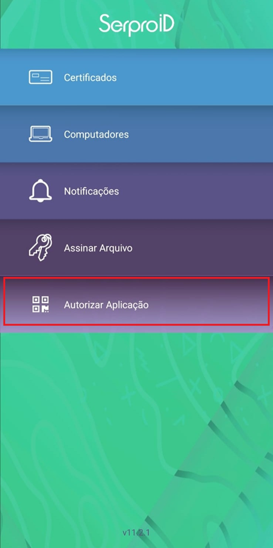

Em seguida, escolha o seu certificado em nuvem e utilize a sua biometria para concluir a assinatura do documento desejado.

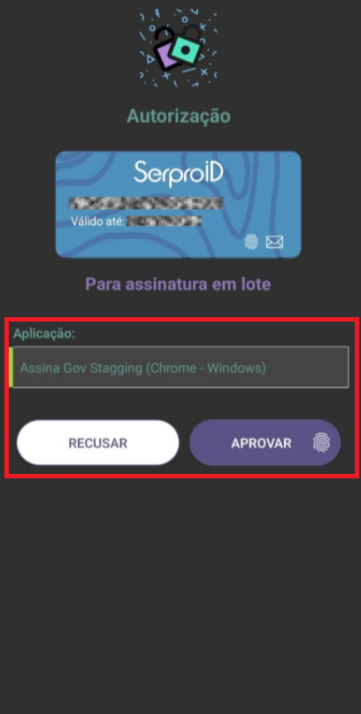

 **OBS1: O SERPROID possui a opção “Assinar Arquivo”, na qual o usuário pode realizar upload de um arquivo e realizar a assinatura no próprio aplicativo. Essa opção não é a correta para realizar a assinatura utilizando o Certificado A3 em nuvem no SEI.**

 **OBS2: O CPF vinculado ao Certificado A3 em nuvem deve ser o mesmo que está vinculado ao usuário autenticado no SEI. Caso seja diferente, o sistema informa que não é possível realizar a assinatura.**
 
 **OBS3: O Certificado A3 em nuvem é do tipo qualificada.**

**2.2.3 CERTIFICADO A1**

Ao optar por essa opção, o sistema abrirá uma pequena tela para que você localize o arquivo do certificado (que deve estar previamente guardado em uma pasta de seu computador). Após localizar o arquivo, deve-se digitar a senha especifica desse certificado e, em seguida, no botão “Assinar”. 

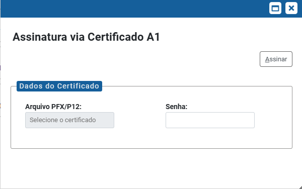
 
  **OBS1: A assinatura de Certificado A1 é do tipo qualificada.**

 
 
**2.2.4 CERTIFICADOS A3 EM NUVEM**

Além do SERPROID, a equipe responsável pode habilitar outros exemplos de Certificados A3 em nuvem. Na imagem, alguns exemplos de outros certificados A3 em nuvem aceitos pelo módulo.

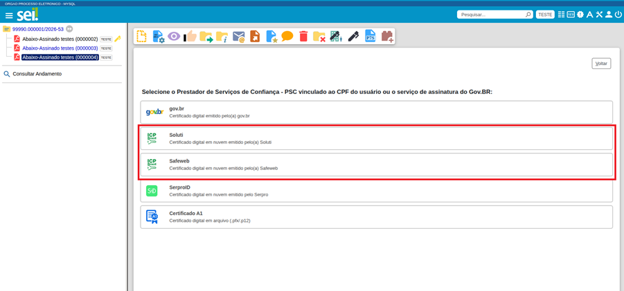

   **OBS1: Os ícones utilizados para os outros certificados A3 em nuvem é o mesmo (ICP Brasil).**

**2.2.5 ASSINATURA DIGITAL P7S**

Além de assinar diretamente no SEI, o usuário também consegue realizar upload do arquivo de `assinatura digital p7s <https://wiki.processoeletronico.gov.br/pt-br/latest/MODULOS_SEI/SEI_Assina/Perguntas_Frequentes_FAQ/Conceito.html#o-que-e-p7s>`__ para documentos externos. O arquivo é anexado por meio da funcionalidade “Anexar assinatura digital p7s”.

Ao clicar na funcionalidade, a tela abaixo é exibida.

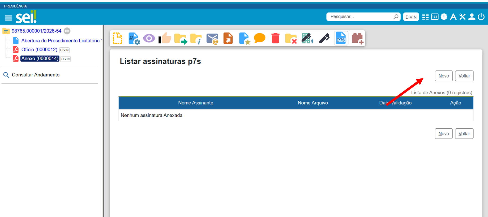

Após o carregamento da tela, o usuário é redirecionado para uma nova, onde ele poderá realizar o upload do arquivo p7s.

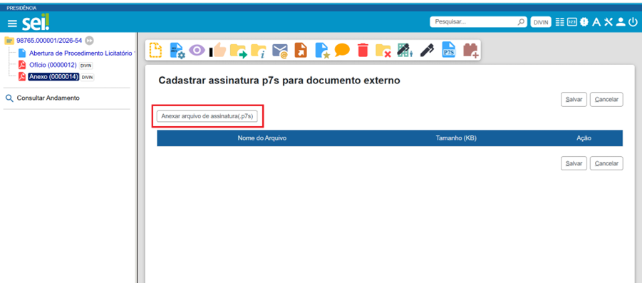

Após realizar o upload, a tela é atualizada com o arquivo p7s. O usuário deve clicar em salvar para concluir a operação.

  **OBS1: Essa funcionalidade está disponível a partir da versão 1.4.0 do módulo.** 

3.	ASSINATURA ELETRÔNICA DE VÁRIOS DOCUMENTOS
---------------------------------------------

O módulo possibilita que o usuário assine vários documentos internos, por meio do bloco de assinatura, com assinatura avançada ou qualificada. O processo é o mesmo utilizado para assinar com assinatura simples, que é a assinatura nativa do SEI. Mais informações a respeito do funcionamento de assinaturas em bloco estão no `Manual do SEI <https://manuais.processoeletronico.gov.br/pt-br/latest/SEI/Blocos.html#bloco-de-assinatura>`__ .

 **OBS1: A partir da versão 1.4.0 do módulo, além dos documentos internos, também é possível assinar documentos externos por meio de bloco de assinatura. Nesses casos, é necessário assinar os documentos do bloco um de cada vez, para posicionar o local da assinatura em cada item (O botão de assinar não está disponível fora do bloco de externo, apenas é possível assinar cada documento individualmente dentro do bloco).**
 
 **OBS2: A respeito das regras do bloco, orientamos a leitura da** `FAQ 5.4 <https://wiki.processoeletronico.gov.br/pt-br/latest/MODULOS_SEI/SEI_Assina/Perguntas_Frequentes_FAQ/Assinar_e_Validar.html#e-possivel-assinar-tantos-documentos-internos-quanto-externos-no-mesmo-bloco-de-assinatura>`__ .

4.	ASSINATURA COM CARIMBO DE TEMPO
----------------------------------

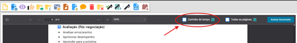

A inclusão de `Carimbo de tempo <https://wiki.processoeletronico.gov.br/pt-br/latest/MODULOS_SEI/SEI_Assina/Perguntas_Frequentes_FAQ/Carimbo_de_Tempo.html#carimbo-de-tempo>`__ na assinatura de um documento é habilitada apenas pelo administrador do SEI no seu órgão, que precisa alinhar com a área responsável a viabilidade de contratar o serviço de uma Autoridade de Carimbo de Tempo e após a aquisição configurar na funcionalidade a credencial.

Com a parametrização dos dados da carimbadora na funcionalidade, ao selecionar um documento para assinatura é exibido o checkbox “Carimbo de tempo” para todos os usuários tanto para documentos internos quanto externos.

 
 **OBS1: Essa funcionalidade está disponível a partir da versão 1.4.0 do módulo.**
 

5.	ASSINATURA EM TODAS AS PÁGINAS DO DOCUMENTO
----------------------------------------------

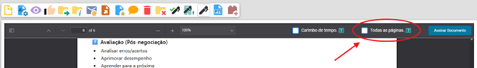

Ao marcar a opção “Todas as páginas", a assinatura será replicada em todas as páginas daquele documento que está sendo assinado, sempre no mesmo local escolhido.

 **OBS1: Essa funcionalidade é exclusiva para documentos externos.**

6.	VALIDAÇÃO DE ASSINATURA ELETRÔNICA
-------------------------------------

Além de possibilitar a realização da assinatura qualificada e avançada, o módulo também permite que o usuário valide as assinaturas realizadas nos documentos, sem que seja preciso sair do sistema e entrar no site do Validador ITI. No SEI são exibidas as mesmas informações apresentadas no site citado, anteriormente,

A validade é acessada por meio da funcionalidade “Visualizar Resultado Autenticidade”. Após clicar no ícone dessa funcionalidade, é apresentada a validade de todas as assinaturas realizadas no documento.

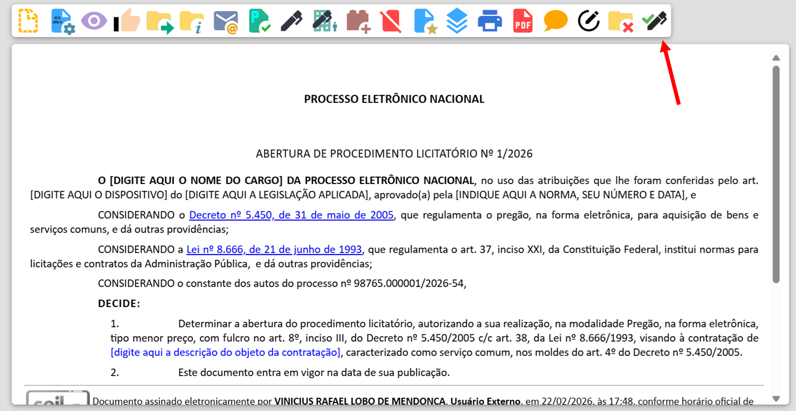

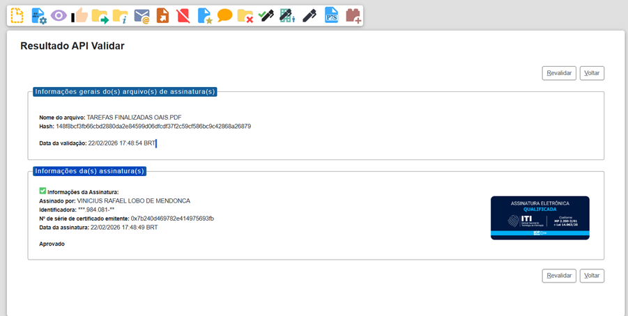

7.	ASSINATURA DE DOCUMENTOS POR USUÁRIOS EXTERNOS
-------------------------------------------------

O módulo também possibilita que o usuário externo assine documentos internos e externos com assinatura avançada e qualificada. O passo a passo para usuário realizar a assinatura é o mesmo que ele executa para assinar algum documento com assinatura simples. 

 **OBS1: Essa funcionalidade para documentos internos está disponível a partir da versão 1.3.0 do módulo;**

 **OBS2: Essa funcionalidade para documentos externos está disponível a partir da versão 1.4.0 do módulo;**

 **OBS3: A utilização de assinatura com carimbo de tempo pelo usuário externo é habilitada pelo Administrador do SEI, a partir da versão 1.4.0.**
