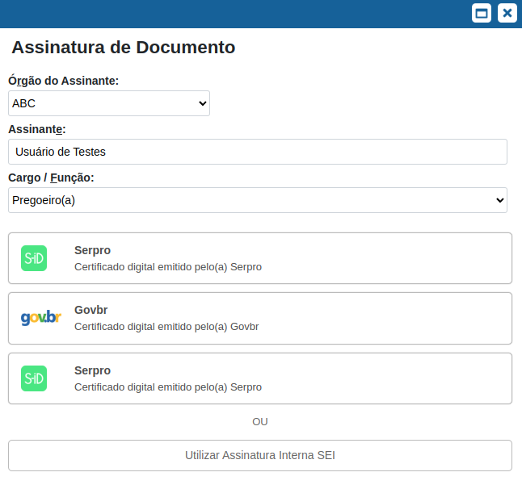
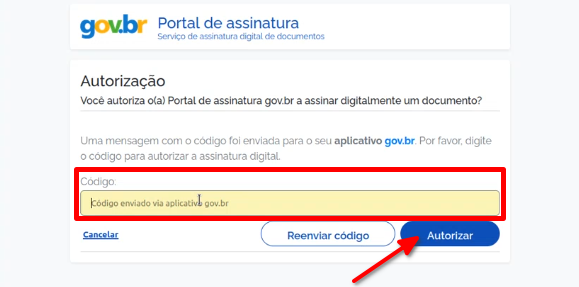
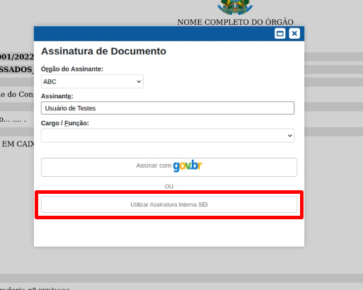

Módulo de Assinatura Avançada (Assinatura Eletrônica do gov.br)
================================================================

O módulo de **Assinatura Avançada** adiciona ao SEI a possibilidade de assinatura e autenticação de documentos utilizando a Assinatura Eletrônica do gov.br, ampliando a validade dos documentos neste sistema.

Manual de Utilização
--------------------

Esta seção tem por objetivo demonstrar as funcionalidades que serão disponibilizadas pelo módulo de Assinatura Avançada do SEI.

Requisitos para Utilização do Módulo
++++++++++++++++++++++++++++++++++++

* Módulo de Login Único instalado;
* Possuir um usuário interno SEI;
* Usuários com CPF cadastrado no menu de usuário SEI (Administração > Usuário > Contatos).
* Usuários com conta gov.br com selo de confiabilidade prata ou ouro.
* Aplicativo **gov.br** instalado no celular. ( `Link para download <https://acesso.gov.br/faq/_perguntasdafaq/oqueemeugovbrmobile.html>`_ )

Utilização do Módulo
++++++++++++++++++++

O módulo de **Assinatura Avançada** introduz a possibilidade de o usuário assinar documentos via **Assinatura Eletrônica do gov.br**, por meio das suas credenciais da Conta **gov.br**, ampliando a validade do documento assinado.

Para realizar a **Assinatura Eletrônica do gov.br**, o usuário deverá acessar o documento e clicar no botão “Assinar Documento”.

.. figure:: _static/images/assinatura_sei.png

Em seguida será aberta a janela **Assinatura de Documentos**. Nessa, o usuário poderá assinar via SEI, com o Certificado Digital ou com **Assinatura Eletrônica do gov.br**.

Para assinatura com **gov.br**, o usuário deverá clicar no botão **"Assinatura GovBr"**.

Preencher os campos indicados em tela e clicar em assinar com **gov.br**:

1) **Órgão Assinante:** selecionar o órgão do assinante;
2) **Assinante:** Indicar o nome do assinante;
3) **Cargo/função:** selecionar o cargo do assinante.

Ao clicar em assinar com **gov.br**, o sistema abrirá uma nova janela solicitando dados de autenticação da Conta gov.br. Após a autenticação, o sistema encaminhará uma mensagem para o **aplicativo gov.br** (que deverá estar instalado no celular do usuário) com um código de autenticação.

Incluir o código de autorização encaminhado ao **aplicativo gov.br** no campo **"Código"** e clicar em **"Autorizar"**.

Após esta ação, o documento assinado via **gov.br** será atualização com a respsctiva assinatura eletrônica.

.. admonition:: Nota

   Caso o usuário não deseje assinar com a Conta gov.br, selecionar a opção **"Utilizar Assinatura Interna SEI"**.

