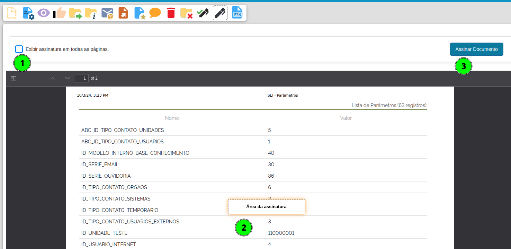
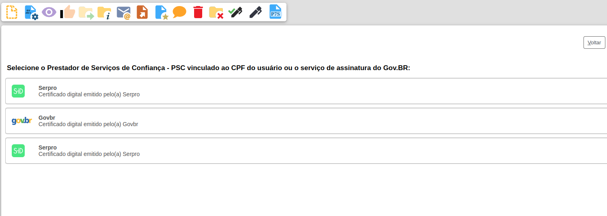
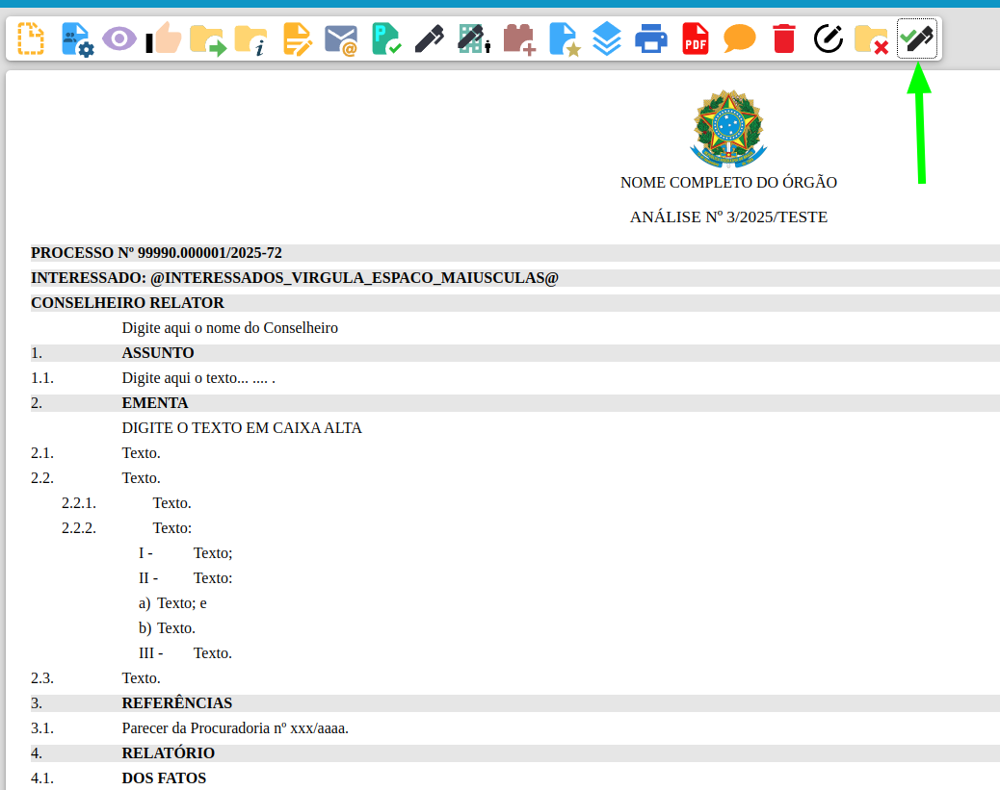
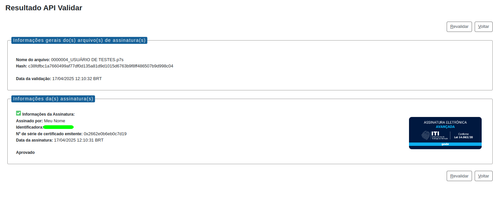

Módulo de Assinatura Eletrônica
===============================

O módulo de **Assinatura Eletrônica** adiciona ao SEI a possibilidade de assinatura e autenticação de documentos utilizando a Assinatura Eletrônica do gov.br e assinatura qualificada em nuvem,
ampliando a validade dos documentos neste sistema.

Manual de Utilização
--------------------

Esta seção tem por objetivo demonstrar as funcionalidades que serão disponibilizadas pelo módulo de Assinatura Avançada do SEI.

Requisitos para Utilização do Módulo
++++++++++++++++++++++++++++++++++++

* Possuir um usuário interno SEI;
* Usuários com CPF cadastrado no menu de usuário SEI (Administração > Usuário > Contatos).
* Usuários com conta gov.br com selo de confiabilidade prata ou ouro.

Assinatura de documento interno
+++++++++++++++++++++++++++++++

O módulo de **Assinatura Eletrônica** introduz a possibilidade de o usuário assinar documentos via **Assinatura Eletrônica do gov.br**, por meio das suas credenciais da Conta **gov.br**, ou **Assinatura Quailificada em nuvem** ampliando a validade do documento assinado.

Para realizar a **Assinatura Eletrônica do gov.br**, o usuário deverá acessar o documento e clicar no botão “Assinar Documento”.

.. figure:: _static/images/assinatura_sei.png

Em seguida será aberta a janela **Assinatura de Documentos**. Nessa, o usuário poderá assinar via SEI, com o Certificado Digital ou com **Assinatura avançada/qualificada**.

Para assinatura com o módulo, o usuário deverá clicar no botão **"Assinatura avançada/qualificada"**.

Preencher os campos indicados em tela e clicar no certificado desejado:

.. figure:: _static/images/botao_assinar_com_gov.br.png

.. admonition:: Importante

   A lista de certificados depende de como o órgão configurou o módulo e quais certificados o usuário possui.

1) **Órgão Assinante:** selecionar o órgão do assinante;
2) **Assinante:** Indicar o nome do assinante;
3) **Cargo/função:** selecionar o cargo do assinante.

Ao clicar em assinar com o certificado desejado, o sistema abrirá uma nova janela seguindo com o fluxo de cada certificado. 

No caso do **gov.br** após a autenticação, o sistema encaminhará um SMS ou uma mensagem para o **aplicativo gov.br** (que deverá estar instalado no celular do usuário) com um código de autenticação.

Incluir o código de autorização encaminhado ao **aplicativo gov.br** no campo **"Código"** e clicar em **"Autorizar"**.

.. figure:: _static/images/tela_de_inclusao_de_codigo_de_autorizacao.png

Após esta ação, o documento assinado via **gov.br** será atualização com a respectiva assinatura eletrônica.

.. admonition:: Nota

   Caso o usuário não deseje assinar com o módulo, deve-se selecionar a opção **"Utilizar Assinatura Interna SEI"**.

.. figure:: _static/images/tela_opcao_pela_assinatura_via_Sei.png

Assinatura de documento externo
+++++++++++++++++++++++++++++++

Para realizar a **Assinatura Eletrônica do gov.br**, o usuário deverá acessar o documento e clicar no botão “Assinar Documento com Tarja”.

.. figure:: _static/images/botao_assinar_com_tarja.png

.. admonition:: Atenção

   Somente documentos externos com formato PDF podem ser assinados.

Será aberto uma opção de escolher onde a tarja de assinatura deverá ficar 
no arquivo e se a tarja deverá ficar em todas as páginas.

1) **Exibir assinatura em todas as páginas:** selecionar para a tarja ser adicionada em todas as páginas;
2) **Área de assinatura:** Indicar onde a tarja de assinatura deve ficar no documento;
3) **Assinar documento:** ir para a tela seguinte para selecionar qual certificado a ser usado.

Após clicar em "Assinar documento", será exibido a lista de prestadores de serviço de confiança com a listagem dos certificados do usuário.

.. admonition:: Importante

   A lista de certificados depende de como o órgão configurou o módulo e quais certificados o usuário possui.

Validação de Assinatura Eletrônica
-----------------------------------

Após a assinatura eletrônica, será possível submeter o documento assinado ao serviço de validação de assinaturas eletrônicas do Governo Federal e verificar o status de assinatura eletrônica ICP-Brasil, GOV.BR ou provenientes de acordos internacionais de reconhecimento mútuo.

Acessar o documento assinado eletrônicamente e clicar no ícone "Visualizar Resultado Autenticidade"

Será consultado no ITI a validade da assinatura do documento e exibido a tela de validade:

Nessa tela é exibido um relatório de conformidade com os dados obtidos do ITI.

.. admonition:: Nota

   Caso deseje revalidar o documento deve-se clicar em **"Revalidar"**.

.. admonition:: Nota

   É importante ressaltar que nenhuma informação ou arquivo são armazenados nos ambientes operacionais do ITI. Os resultados da validação limitam-se exclusivamente a identificar o titular do certificado digital utilizado e confirmar se o documento assinado não sofreu nenhuma adulteração após a assinatura.

