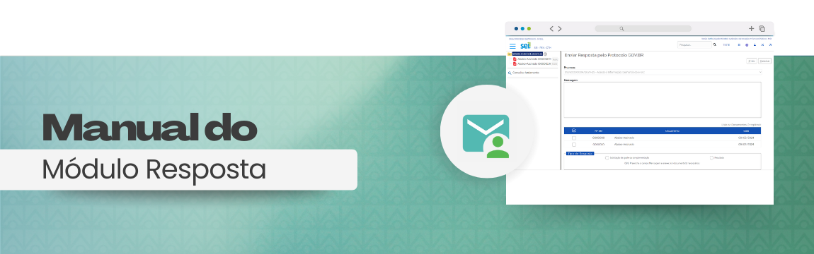
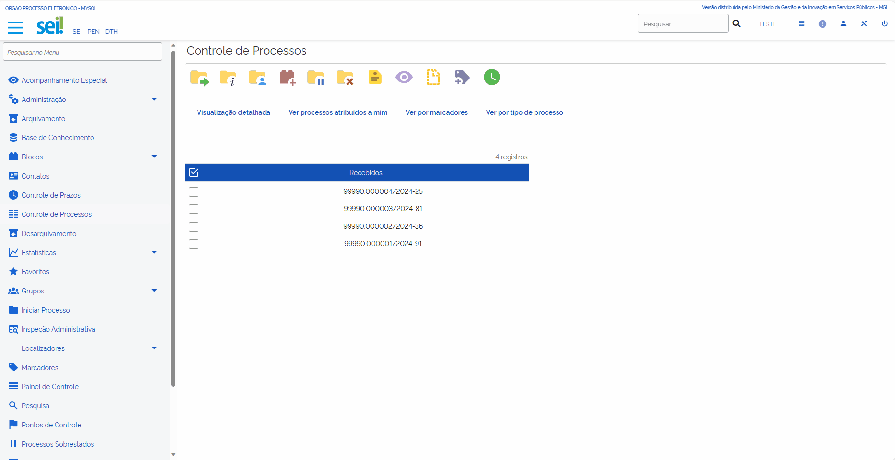
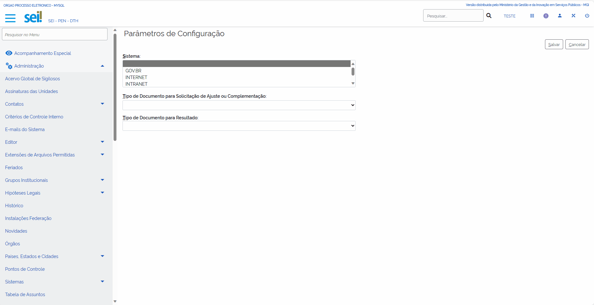
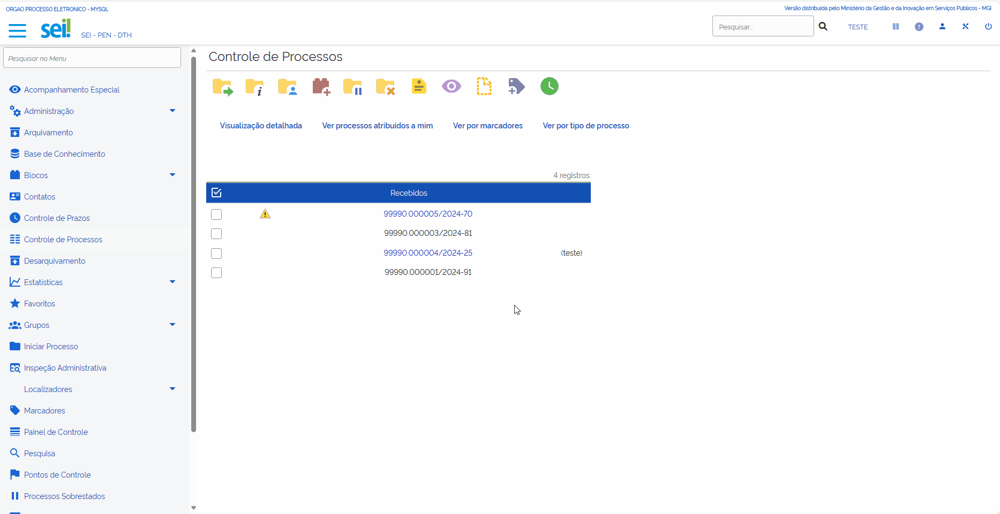

Módulo de Resposta
===================

O Módulo Resposta é responsável por integrar o Protocolo.Gov.Br e o SEI! de maneira a possibilitar respostas tempestivas aos questionamentos executado **diretamente** por usuário externo, a fim de formar novo processo ou compor processo já existente dos cidadões.

O Módulo funciona somente com a `integração Protocolo.Gov.Br <https://www.gov.br/gestao/pt-br/assuntos/processo-eletronico-nacional/conteudo/protocolo.GOV.BR>`_.

.. admonition:: Atenção

   **Solicitações com triagem:** Após a captura da solicitação no Protocolo GOV.BR, no momento de realizar a triagem deve ser escolhida a opção “Enviar para o SPE e aguardar análise” para que seja habilitado o Módulo de Resposta no processo SEI. 

   **Solicitações sem triagem:** No momento de configurar a solicitação no Protocolo GOV.BR, deve ser marcada a opção Sim no campo “Será permitido o uso do Módulo de Resposta do SEI?” para que seja habilitado o Módulo de Resposta no processo SEI. 

Configurações do Módulo de Resposta
+++++++++++++++++++++++++++++++++++

Com o Módulo de Resposta instalado no SEI, acesse o menu **Administração > Módulo de Resposta ao Protocolo GOV.BR** e clique em **Parâmetros de Configuração**. 

Sistema 
-------

Na tela que será apresentada selecione o **Sistema** utilizado na integração com o Protocolo GOV.BR. 

.. admonition:: Atenção

   O Módulo de Resposta só será habilitado nos processos SEI se a solicitação estiver aberta no Protocolo GOV.BR. 

Tipos de documentos 
--------------------

Após selecionar o Sistema, na etapa anterior, é necessário escolher os tipos de documentos que serão gerados no processo SEI quando do uso do Módulo de Resposta. 
 
**Tipo de Documento para Solicitação de Ajuste ou Complementação:** tipo de documento que será gerado no processo SEI quando no campo Tipo de Resposta for marcada a opção Solicitação de Ajuste ou Complementação. 

**Tipo de Documento para Resultado:** tipo de documento que será gerado no processo SEI quando, ao utilizar o Módulo de Resposta, no campo Tipo de Resposta for marcada a opção Resultado.  

.. admonition:: Atenção

   Os tipos de documentos que podem ser utilizados pelo Módulo de Resposta são apenas os Externos (sem modelo). 

Uso do Módulo de Resposta 
++++++++++++++++++++++++++

Solicitando um ajuste ou complementação 
----------------------------------------

1. Acesse o processo no SEI e clique no ícone do Módulo de Resposta Enviar Resposta |icone_resposta|.

2. No campo **Mensagem** informe, de maneira clara, qual é o ajuste ou complementação necessária na solicitação. 

3. Em seguida, no campo Tipo de Resposta selecione a opção Solicitação de Ajuste ou Complementação e clique em **Enviar**. 

.. admonition:: Atenção

   Será gerado um documento na árvore do processo SEI e o ícone do Módulo de Resposta será desabilitado. 

O solicitante será notificado por e-mail e deverá acessar a solicitação no portal gov.br a fim de realizar o ajuste ou complementação solicitada. 

Após a realização do ajuste ou complementação, o novo documento anexado pelo solicitante será incluído diretamente no processo SEI e o Módulo de Resposta será habilitado novamente. 

Enviando o resultado da solicitação 
-----------------------------------

1. Acesse o processo no SEI e clique no ícone do Módulo de Resposta Enviar Resposta |icone_resposta|.

2. No campo **Mensagem** insira uma mensagem referente ao resultado da solicitação.

3. Anexe o documento de resultado da solicitação (obrigatório).

4. Em seguida, no campo Tipo de Resposta selecione a opção Resultado e clique em **Enviar**. 

.. admonition:: Atenção

   Será gerado um documento na árvore do processo SEI e o ícone do Módulo de Resposta será desabilitado de forma definitiva, não sendo possível utilizar o módulo novamente. 

O solicitante será notificado por e-mail e deverá acessar a solicitação no portal gov.br a fim de obter o Resultado da solicitação. 

Ao acessar a solicitação no portal gov.br o solicitante deverá registrar a ciência, por meio da marcação da check-box **Ciência do Recebimento da Resposta**, e clicar em **Prosseguir**. Nesse momento, o Protocolo GOV.BR incluirá no processo SEI um documento chamado **Recibo de Ciência da Resposta**. 

Na tela seguinte, o solicitante deverá baixar o documento de Resultado e avaliar o serviço.