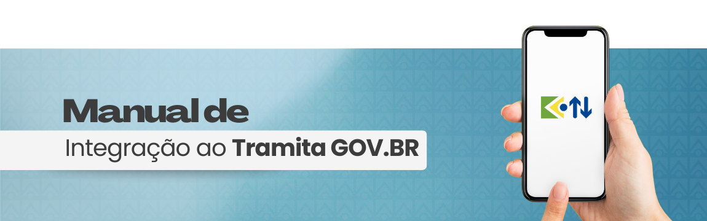

Manual de Integração ao Tramita.GOV.BR
=====================

Este manual foi elaborado pela equipe da Diretoria de Informações, Serviços e Sistemas (DTGES). 

O objetivo deste material é apresentar aos usuários a instalação e o Uso do Módulo de Integração do Tramita.gov.br.

Sumário
+++++++

.. toctree::

   :titlesonly:
   :maxdepth: 3
  
   INSTALL
   USAGE
  