MÓDULOS SUPER.GOV.BR 1.0 (Base SEI)
===================================

Módulo de Gestão Documental
++++++++++++++++++++++++++++

O módulo de Gestão documental do SUPER.GOV.BR traz consigo uma série de funcionalidades que visam contribuir para a gestão arquivística dos processos possibilitando o arquivamento, o desarquivamento, o controle dos prazos de guarda, a avaliação, a devolução para correção de metadados e a geração de listagens de eliminação e recolhimento.

Essa seção tem por objetivo demonstrar as funcionalidades que serão disponibilizadas pelo módulo de Gestão Documental e também as configurações necessárias para o seu correto funcionamento.

O módulo de Gestão Documental traz incrementos ao Sistema SUPER.GOV.BR que podem ser acessados via entidades:

* Botão Arquivar Processo – Possibilita o arquivamento de processos.
* Botão Desarquivar Processo – possibilita que um processo arquivado seja desarquivado e retorne para a tela de controle de processos.
* Menu Arquivo da Unidade – concentra todos os processos da unidade que foram arquivados e se encontram em fase corrente.
* Menu Pendências de Arquivamento – concentra todos os processos cuja unidade foi a última a concluir e ainda não os arquivou.
* Menu Gestão Documental – possibilita a avaliação dos processos, a devolução para correção e a geração de listagens de eliminação e de recolhimento, conforme a destinação final associada a cada processo.

Para facilitar a navegação nesse documento, abaixo fica disponível tabela contendo links para as entidades supramencionadas, bem como para suas funcionalidades.

* **[Arquivar Processo](#arquivar-processo)**
  * [Tela de Controle de processos](#tela-de-controle-de-processos)
  * [Tela de Visualização do Processo](#tela-de-visualização-do-processo)
  * [Preenchimento do Formulário de Arquivamento de Processo](#preenchimento-do-formulário-de-arquivamento-de-processo)
* **[Desarquivar Processo](#desarquivar-processo)**
  * [Desarquivar via Visão do Processo](#desarquivar-via-visão-do-processo)
  * [Desarquivar via Menu Arquivo da Unidade](#desarquivar-via-menu-arquivo-da-unidade)
  * [Preenchimento do Formulário de Desarquivamento de Processo](#preenchimento-do-formulário-de-desarquivamento-de-processo)
* **[Arquivo da Unidade](#menu-arquivo-da-unidade)**
  * [Pesquisar processos arquivados](#pesquisar-processos-arquivados)
  * [Imprimir uma relação de processos](#imprimir-relação-de-processos)
  * [Desarquivar um ou mais processos](#desarquivar-um-ou-mais-processos)
* **[Pendências de Arquivamento](#menu-pendências-de-arquivamento)**
  * [Pesquisar Processos Concluídos](#pesquisar-processos-concluídos)
  * [Reabrir um processo](#reabrir-processo)
  * [Arquivar um processo](#arquivar-processo)
* **[Gestão Documental](#gestão-documental)**
  * [Avaliação de Processos](#avaliação-de-processos)
    * [Pesquisar Processos para Avaliação](#pesquisar-processos-para-avaliação)
    * [Preparação da Listagem de Eliminação](#preparação-da-listagem-de-eliminação)
    * [Preparação da Listagem de Recolhimento](#preparação-da-listagem-de-recolhimento)
    * [Imprimir](#imprimir)
    * [Devolver para Correção](#devolver-para-correção)
  * [Listagem de Eliminação](#listagem-de-eliminação)
    * [Preparar Listagem de Eliminação](#preparar-listagem-de-eliminação)
      * [Pesquisar Processos para Eliminação](#pesquisar-processos-para-eliminação)
      * [Adicionar observação e/ou justificativa a um processo](#adicionar-observação-eou-justificativa)
      * [Excluir da preparação para Eliminação](#excluir-da-preparação-para-eliminação)
      * [Gerar Listagem de Eliminação](#gerar-listagem-de-eliminação)
      * [Imprimir](#imprimir-1)
    * [Gestão das Listagens de Eliminação](#gestão-das-listagens-de-eliminação)
      * [Visualizar Listagem de Eliminação](#visualizar-listagem-de-eliminação)
      * [Editar a Listagem de Eliminação](#editar-a-listagem-de-eliminação)
      * [Remover Processos da Listagem de Eliminação](#remover-processos-da-listagem-de-eliminação)
      * [Acessar o Processo](#acessar-o-processo)
      * [Pesquisar](#pesquisar)
      * [Imprimir](#imprimir-2)
   * [Listagem de Recolhimento](#listagem-de-recolhimento)
     * [Preparar Listagem de Recolhimento](#preparar-listagem-de-recolhimento)
       * [Pesquisar](#pesquisar-1)
       * [Adicionar observação e/ou justificativa a um processo](#adicionar-observação-eou-justificativa-1)
       * [Excluir da preparação para Recolhimento](#excluir-da-preparação-para-recolhimento)
       * [Gerar Listagem de Recolhimento](#gerar-listagem-de-recolhimento)
       * [Imprimir](#imprimir-3)
     * [Gestão das Listagens de Recolhimento](#gestão-das-listagens-de-recolhimento)
       * [Visualizar Listagem de Recolhimento](#visualizar-listagem-de-recolhimento)
       * [Editar Listagem de Recolhimento](#editar-listagem-de-recolhimento)
       * [Remover Processos da Listagem de Recolhimento](#remover-processos-da-listagem-de-recolhimento)
       * [Acessar o Processo](#acessar-o-processo-1)
       * [Pesquisar](#pesquisar-2)
       * [Imprimir](#imprimir-4)
   * [Relatórios](#relatórios)
     * [Pesquisar](#pesquisar-3)
     * [Imprimir](#imprimir-5)

Abaixo são detalhadas cada uma dessas funcionalidades.

Arquivar Processo
-----------------

O botão “**Arquivar Processo**” será utilizado para indicar que o último ato processual foi realizado, ou seja, tal processo não terá mais movimentações e estará pronto para iniciar a contagem dos prazos de guarda.

Após o clique nesse botão indicado, será necessário preencher o formulário de arquivamento, incluindo a justificativa de arquivamento e inserindo a senha para autenticação da ação.

O botão “**Arquivar Processo**” está disponível na tela de Controle de Processos e na tela de Visualização de Processos, como pode ser visto abaixo:

Tela de Controle de processos
~~~~~~~~~~~~~~~~~~~~~~~~~~~~~~
 
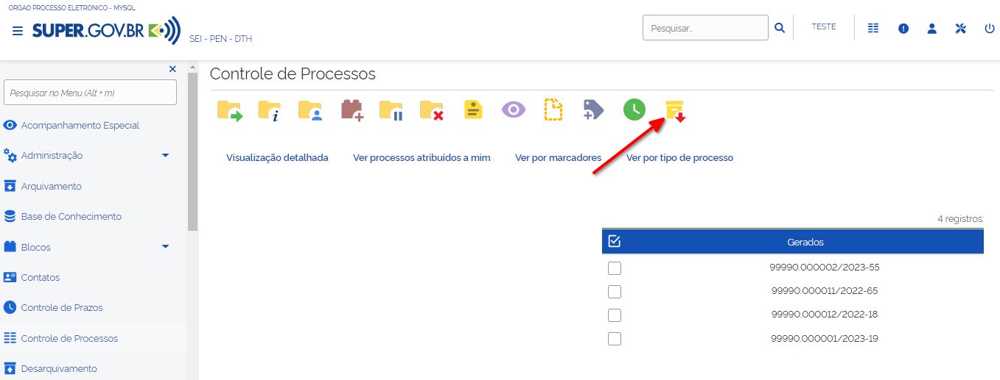

Para arquivamento de processos, o usuário deverá selecionar o processo, via marcação de checkbox, e clicar no botão “**Arquivar Processo**”.

.. admonition:: Nota

   Será possível a seleção de mais de um processo para a realização do procedimento de arquivamento, contudo, todos os processos deverão ter a mesma justificativa de arquivamento.

Tela de Visualização do Processo
~~~~~~~~~~~~~~~~~~~~~~~~~~~~~~~~

.. figure:: _static/images/conculsao_arquivament_tela_de_visualizacao_processos.png

Após todas as tratativas do processo, o usuário poderá direcioná-lo para arquivamento por meio de click no botão “**Arquivar Processo**”.

Preenchimento do Formulário de Arquivamento de Processo
~~~~~~~~~~~~~~~~~~~~~~~~~~~~~~~~~~~~~~~~~~~~~~~~~~~~~~~~

.. figure:: _static/images/conculsao_arquivament_fomulario_de_preenchimento.png

O formulário deverá ser preenchido conforme os campos indicados abaixo:

1. **Processo(s)**: campo preenchido automaticamente. Utilizado para indicar um ou mais processos que serão arquivados;
2. **Justificativa**: campo obrigatório. Utilizado para indicar a justificativa do arquivamento. Poderá ser selecionada apenas uma justificativa para arquivamento.
3. **Arquivamento Legado?**: Campo opcional. Funcionalidade utilizada para indicar uma data retroativa de arquivamento do processo. Tal funcionalidade pode ser utilizada para arquivamento de processos concluídos antes da implantação do módulo.

.. admonition:: Nota

  No arquivamento legado não é possível selecionar uma data de arquivamento anterior à data do último andamento do processo.

4. **Órgão do Assinante**: Campo obrigatório. Utilizado para indicação do órgão ao qual o usuário responsável pela ação está vinculado.
5. **Assinante**: Campo obrigatório. Utilizado para o registro do nome do usuário responsável pelo arquivamento.
6. **Cargo/Função**: Campo obrigatório. Utilizado para o registro do cargo/função do assinante.
7. **Senha**: Campo obrigatório. Utilizado para a inclusão da senha de autenticação da ação.

Ao clicar em Assinar, o processo receberá uma sinalização indicando que está Arquivado. Além disso, o sistema irá gerar automaticamente um documento de arquivamento assinado eletronicamente pelo responsável pela ação e o incorporará ao processo.

.. figure:: _static/images/conculsao_arquivamento_tela_apos_procedimento_arquivamento.png

A realização do arquivamento impede que novos documentos ou andamentos sejam associados ao processo, sendo possível apenas as seguintes ações:

- Iniciar Processo Relacionado
- Consultar Processo
- Acompanhamento Especial
- Adicionar aos Favoritos
- Anotações
- Gerar Arquivo PDF do Processo
- Gerar Arquivo ZIP do Processo
- Comentários
- Controle de Prazos
- Controle de Processos
- Pesquisar no Processo
- Consultar Histórico de Arquivamento do Processo
- Desarquivar Processo

Após o procedimento de arquivamento, o processo ficará disponível no menu “**Arquivo da Unidade**” até o cumprimento do prazo corrente. Depois passará a ser apresentado na tela de Avaliação de Processos da Unidade de Avaliação associada.

Desarquivar Processo
--------------------

O botão “Desarquivar Processo” será utilizado para o desarquivamento, retornando o processo para a tela de controle de processos.

Após o clique no botão indicado, será necessário preencher o formulário de desarquivamento do processo, incluindo a justificativa de desarquivamento e inserindo a senha para autenticação da ação.

Caso seja necessário, o desarquivamento de um processo poderá ser realizado por meio da tela de visualização do processo ou pelo menu “**Arquivo da Unidade**”.

Desarquivar via Visão do Processo
~~~~~~~~~~~~~~~~~~~~~~~~~~~~~~~~~~

.. figure:: _static/images/desarquivamento_visao_processo.png

Desarquivar via Menu Arquivo da Unidade
~~~~~~~~~~~~~~~~~~~~~~~~~~~~~~~~~~~~~~~~

.. figure:: _static/images/desarquivamento_visao_menu_arquivo_unidade_individual.png

Será possível a seleção de mais de um processo para desarquivamento, para tanto, o usuário deverá selecionar todos os processos desejados, via marcação de checkbox, e em seguida clicar no botão Desarquivar, existente na parte superior direita da tela. Poderá ser selecionada apenas uma justificativa para desarquivamento.

.. admonition:: Nota

   Para o desarquivamento em lote, todos os processos a serem desarquivados deverão ter a mesma justificativa de desarquivamento.

.. figure:: _static/images/desarquivamento_visao_menu_arquivo_unidade_lote.png

Preenchimento do Formulário de Desarquivamento de Processo
~~~~~~~~~~~~~~~~~~~~~~~~~~~~~~~~~~~~~~~~~~~~~~~~~~~~~~~~~~

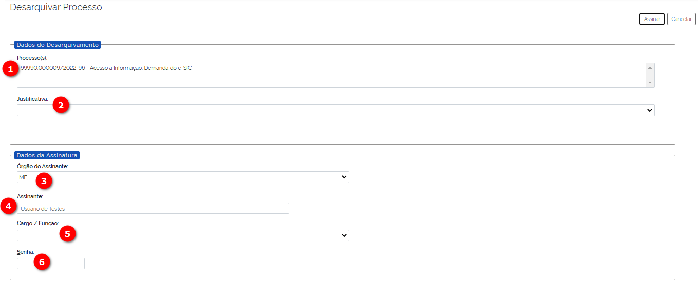

O formulário deverá ser preenchido conforme os campos indicados abaixo:

1) **Processo(s)**: campo preenchido automaticamente. Utilizado para indicar um ou mais processos que serão desarquivados.
2) **Justificativa**: campo obrigatório. Utilizado para indicar a justificativa do desarquivamento. Poderá ser selecionada apenas uma justificativa para desarquivamento.
3) **Órgão do Assinante**: Campo obrigatório. Utilizado para indicação do órgão ao qual o usuário responsável pela ação está vinculado.
4) **Assinante**: Campo obrigatório. Utilizado para o registro do nome do usuário responsável pelo desarquivamento.
5) **Cargo/Função**: Campo obrigatório. Utilizado para o registro do cargo/função do responsável pelo desarquivamento.
6) **Senha**: Campo obrigatório. Utilizado para a inclusão da senha de autenticação da ação.

Ao clicar em Assinar, o sistema irá gerar automaticamente um documento de desarquivamento assinado eletronicamente pelo responsável pela ação e o incorporará ao processo.

Menu Arquivo da Unidade
-----------------------

Tal menu concentra a lista de todos os processos que foram arquivados pela unidade e se encontram em fase corrente.

Pesquisar Processos Arquivados
~~~~~~~~~~~~~~~~~~~~~~~~~~~~~~

A pesquisa de processos poderá ser realizada por meio do preenchimento dos campos de filtragem disponíveis em tela e, em seguida, clique no botão "**Pesquisar**".

Imprimir Relação de Processos
~~~~~~~~~~~~~~~~~~~~~~~~~~~~~~

Será possível imprimir uma relação de processos conforme os filtros de pesquisa aplicados. 

Para realizar a Impressão (seja física ou em PDF), o usuário deverá selecionar os processos, via marcação de checkbox, e clicar em "**Imprimir**".
 
Desarquivar um ou mais processos
~~~~~~~~~~~~~~~~~~~~~~~~~~~~~~~~~~

Os passos para o desarquivamento de processos poderão ser acessados por meio da seção Desarquivar de Processo, existente nesse documento.

Menu Pendências de Arquivamento
--------------------------------

No menu pendências de arquivamento ficam concentrados todos os processos cuja unidade foi a última a concluir e ainda não os arquivou.

Pesquisar Processos Concluídos
~~~~~~~~~~~~~~~~~~~~~~~~~~~~~~

A pesquisa de processos poderá ser realizada por meio do preenchimento dos campos de filtragem disponíveis em tela e, em seguida, clique no botão "**Pesquisar**".

Reabrir Processo
~~~~~~~~~~~~~~~~

A reabertura consiste em retornar um processo ao status de aberto. Nesta visão, o usuário terá a possibilidade de reabrir um ou mais processos.

.. admonition:: Nota

   Só é possível reabrir processos que estejam apenas concluídos. Processos arquivados precisam ser desarquivados para voltarem a tramitar.

Para reabrir um único processo, o usuário deverá clicar no botão "**Reabrir Processo**", presente na grid do processo que deseja reabrir.

.. figure:: _static/images/pendencias_arquivamento_reabir_um_processo.png

Após o clique no botão, o sistema apresentará uma mensagem de confirmação da reabertura. Para concluir a ação, o usuário deverá clicar em “**Ok**”.
 
Para reabrir mais de um processo, o usuário deverá selecionar todos os processos desejados, via marcação de checkbox, e em seguida clicar no botão "**Reabrir**", existente na parte superior direita da tela.

.. figure:: _static/images/pendencias_arquivamento_reabir_varios_processos.png

Após o clique no botão, o sistema apresentará uma mensagem de confirmação da reabertura. Para concluir a ação, o usuário deverá clicar em “**Ok**”.

Arquivar Processo
~~~~~~~~~~~~~~~~~~

Nesta visão, o usuário terá a possibilidade de arquivar um ou mais processos.

Para arquivar um único processo, o usuário deverá clicar no botão "**Arquivar Processo**", presente na grid do processo que deseja arquivar.

.. figure:: _static/images/arquivo_unidade_arquivar_um_documento.png

Após o clique no botão, o sistema abrirá o formulário de arquivamento para preenchimento e autenticação. Os passos para o preenchimento deste formulário poderão ser acessados na seção [Preenchimento do Formulário de Desarquivamento de Processo](#preenchimento-do-formulário-de-desarquivamento-de-processo).

Para arquivar mais de um processo, o usuário deverá selecionar todos os processos desejados, via marcação de checkbox, e em seguida clicar no botão "**Arquivar**", existente na parte superior direita da tela.

.. admonition:: Nota

   Para o arquivamento em lote, todos os processos a serem arquivados deverão ter a mesma justificativa de arquivamento.

.. figure:: _static/images/arquivo_unidade_arquivar_lote_documento.png

Gestão Documental
-----------------

O menu Gestão documental poderá ser utilizado pelo usuário lotado na Unidade configurada como de Avaliação que possua o perfil equivalente.

Nesse menu ficarão disponíveis as seguintes opções:

* Avaliação de Processos
* Listagens de Eliminação
* Listagens de Recolhimento
* Relatórios
 
Avaliação de Processos
~~~~~~~~~~~~~~~~~~~~~~

Na opção Avaliação de Processos ficam concentrados todos os processos arquivados pelas respectivas unidades de arquivamento e que cumpriram o prazo de guarda corrente. Nesta visão, o usuário poderá avaliar se as informações relativas aos processos estão adequadas, poderá devolver para a unidade responsável pelo arquivamento realizar correções e poderá enviar para a etapa de preparação da listagem. 

Pesquisar Processos para Avaliação
^^^^^^^^^^^^^^^^^^^^^^^^^^^^^^^^^^

A pesquisa de processos poderá ser realizada por meio do preenchimento dos campos de filtragem disponíveis em tela e, em seguida, clique no botão "**Pesquisar**".
 
Preparação da Listagem de Eliminação
^^^^^^^^^^^^^^^^^^^^^^^^^^^^^^^^^^^^^^^^

Para indicar que um único processo deve ser enviado para preparação da listagem de eliminação, o usuário deverá clicar no botão "**Preparar Listagem de Eliminação**", presente na grid do processo.

.. figure:: _static/images/avaliacao_de_processos_enviar_destinacao_um_registro.png

Após o clique no botão, o sistema apresentará uma mensagem de confirmação. Para concluir a ação, o usuário deverá clicar em “**Ok**”.

Para indicar que mais de um processo deve ser enviado para preparação da listagem de eliminação, o usuário deverá selecionar todos os processos desejados, via marcação de checkbox, e em seguida clicar no botão “**Preparar Listagem de Eliminação**” existente na parte superior direita da tela.

.. admonition:: Nota
 
   Caso tenha sido selecionado algum processo cuja destinação final não seja Eliminação o módulo irá desconsiderá-lo.

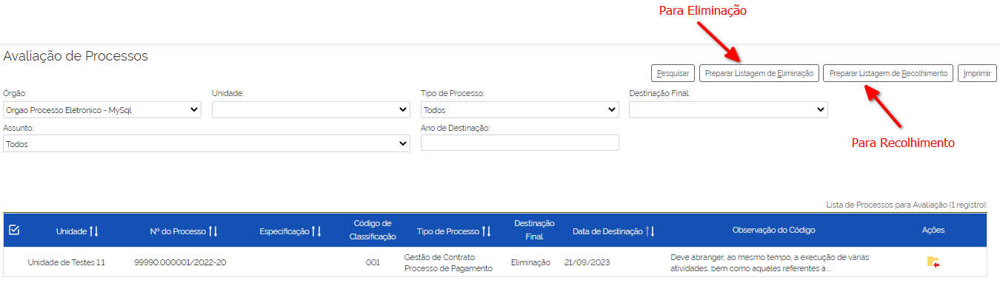

Após o clique no botão, o sistema apresentará uma mensagem de confirmação. Para concluir a ação, o usuário deverá clicar em “**Ok**”.

Os processos enviados para preparação da listagem de eliminação passarão a ser listados no menu “Gestão Documental > Listagens de Eliminação > Preparação da Listagem”.

Preparação da Listagem de Recolhimento
^^^^^^^^^^^^^^^^^^^^^^^^^^^^^^^^^^^^^^^^^^^^

Para indicar que um único processo deve ser enviado para preparação da listagem de recolhimento, o usuário deverá clicar no botão Preparar Listagem de Recolhimento, presente na grid do processo.

.. figure:: _static/images/avaliacao_de_processos_enviar_destinacao_um_registro.png

Após o clique no botão, o sistema apresentará uma mensagem de confirmação. Para concluir a ação, o usuário deverá clicar em “**Ok**”.

Para indicar que mais de um processo deve ser enviado para preparação da listagem de recolhimento, o usuário deverá selecionar todos os processos desejados, via marcação de checkbox, e em seguida clicar no botão “**Preparar Listagem de Recolhimento**” existente na parte superior direita da tela.

.. admonition:: Nota

   Caso tenha sido selecionado algum processo cuja destinação final não seja Recolhimento o módulo irá desconsiderá-lo.

Após o clique no botão, o sistema apresentará uma mensagem de confirmação. Para concluir a ação, o usuário deverá clicar em “**Ok**”.

Os processos enviados para preparação da listagem de recolhimento passarão a ser listados no menu “Gestão Documental > Listagens de Recolhimento > Preparação da Listagem”.

Imprimir
^^^^^^^^^

Nessa visão será possível imprimir uma relação de processos conforme os filtros de pesquisa aplicados. 

Para realizar a Impressão (seja física ou em PDF), o usuário deverá selecionar os processos, via marcação de checkbox, e clicar em "**Imprimir**".

Devolver para Correção
^^^^^^^^^^^^^^^^^^^^^^

Caso o usuário identifique que alguma informação necessita ser corrigida, deverá clicar no botão "**Devolver para Correção**", presente na grid do processo.

.. figure:: _static/images/avaliacao_de_processos_enviar_correcao_um_registro.png

Ao clicar nesse botão, será aberta uma janela para inserção da mensagem de devolução do processo. Após o término do texto, clicar em "**Devolver**".

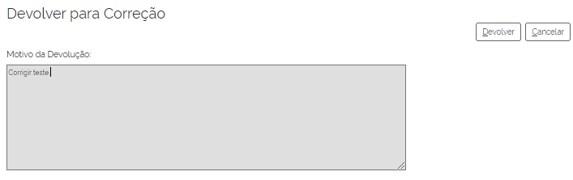
 
O processo devolvido para correção ficará disponível no Arquivo da Unidade que realizou o arquivamento. Tal processo terá a indicação de que foi devolvido para correção, acompanhado do motivo.

.. figure:: _static/images/Tela_arquivo_da_unidade_ícone_indicativo_de_correcao.png

.. figure:: _static/images/icone_motivo_correção_detalhado.png

Para realizar a correção o usuário deverá clicar no ícone "**Consultar/Alterar Processo**" (1), disponível na grid do processo. Após a correção, o usuário deverá clicar no ícone "**Concluir Edição**" (2), disponível na grid do processo.

.. figure:: _static/images/avaliacao_de_processos_icone_correcao.png

.. admonition:: Nota

   Ao confirmar a conclusão da Edição os prazos de guarda serão recalculados. Caso ainda esteja pendente o cumprimento de prazo corrente, o processo continuará no Arquivo da Unidade. Caso o processo já tenha cumprido o prazo de guarda corrente, será retornado para a tela de Avaliação de Processos da unidade responsável pela avaliação.

Listagem de Eliminação
~~~~~~~~~~~~~~~~~~~~~~

Nesta opção, o usuário irá criar as listagens de processos elegíveis para eliminação para posterior submissão à CPAD (Comissão Permanente de Avalição de Documentos)

.. admonition:: Nota
 
   A submissão à CPAD não é um procedimento controlado pelo Módulo.

Preparar Listagem de Eliminação
^^^^^^^^^^^^^^^^^^^^^^^^^^^^^^^

Pesquisar Processos para Eliminação
"""""""""""""""""""""""""""""""""""""""""""

A pesquisa poderá ser realizada por meio do preenchimento dos campos de filtragem disponíveis em tela e, em seguida, clique no botão "**Pesquisar**".

Gerar Listagem de Eliminação
"""""""""""""""""""""""""""""

Para gerar uma listagem de eliminação, o usuário deverá selecionar os processos que deseja que componham a listagem e clicar em "**Gerar Listagem de Eliminação**".

.. figure:: _static/images/listagem_eliminacao_gerar_listagem.png

Ao gerar uma listagem, o sistema criará um processo na tela de controle de processos para guardar a listagem criada, que ficará disponível na visão “**Gestão das Listagens**”, ligada à Listagens de Eliminação, existente no menu Gestão Documental.

Excluir da Preparação para Eliminação
""""""""""""""""""""""""""""""""""""""

Nessa visão, o usuário terá a possibilidade de excluir um ou mais processos da preparação da Listagem de Eliminação.

Para excluir um único processo, o usuário deverá clicar no botão Excluir, presente na grid do processo.

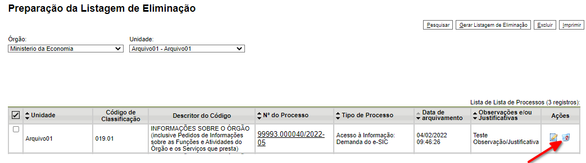

Para excluir mais de um processo, o usuário deverá selecionar todos os processos desejados, via marcação de checkbox, e em seguida clicar no botão "**Excluir**", existente na parte superior direita da tela.

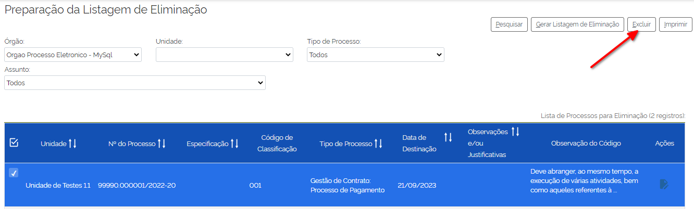

Após a confirmação da exclusão, os processos ficarão disponíveis na tela de Avaliação de Processos, do menu "**Gestão Documental**".

Imprimir
"""""""""

Nesta visão será possível imprimir uma relação de processos conforme os filtros de pesquisa aplicados. 

Para realizar a Impressão (seja física ou em PDF), o usuário deverá selecionar os processos, via marcação de checkbox, e clicar em "**Imprimir**".

Adicionar observação e/ou justificativa
""""""""""""""""""""""""""""""""""""""""""""""

Para registrar uma observação e/ou justificativa, o usuário deverá clicar no botão "**Adicionar observação e/ou justificativa**", presente na grid do processo que deseja.

.. figure:: _static/images/listagem_eliminacao_observacao_justificativa.png
 
Preencher o campo com a informação desejada e clicar em Salvar.

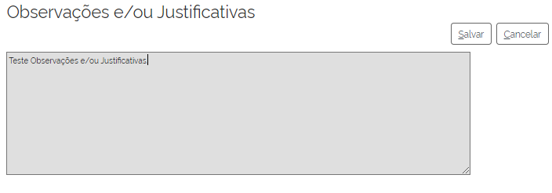
 
Após esta ação, a informação salva ficará disponível em tela no campo Observações e/ou Justificativas da Grid do processo.

Gestão das Listagens de Eliminação
^^^^^^^^^^^^^^^^^^^^^^^^^^^^^^^^^^^^

A visão de Gestão das Listagens concentra a relação dos processos de  eliminação, criados na fase “**Preparação de Listagem**”.

Pesquisar
""""""""""

A pesquisa de processos poderá ser realizada por meio do preenchimento dos campos de filtragem disponíveis em tela e, em seguida, clique no botão "**Pesquisar**".
 
Imprimir
""""""""

Nesta visão será possível imprimir uma relação de processos conforme os filtros de pesquisa aplicados. Para realizar a Impressão (seja física ou em PDF), o usuário deverá selecionar os processos, via marcação de checkbox, e clicar em "**Imprimir**".

Visualizar Listagem de Eliminação
"""""""""""""""""""""""""""""""""

Para visualizar a listagem de eliminação o usuário deverá clicar no botão "**Visualizar Listagem de Eliminação**" disponível na grid do processo que deseja.

.. admonition:: Nota

   O documento Listagem de Eliminação conforme modelo definido pelo Conarq é criado no processo de eliminação gerado na tela de controle de processos da unidade responsável pela Avaliação.

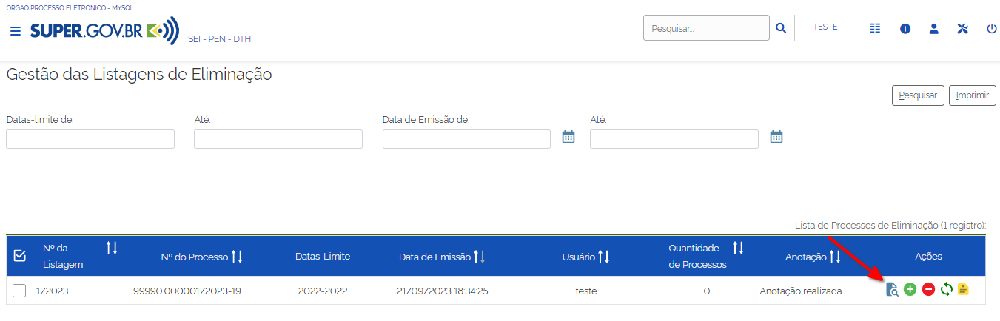

Ao acessar a listagem de eliminação, o usuário poderá imprimi-la, via clique no botão imprimir; poderá gerar um PDF, via clique no botão Gerar PDF; ou retornar à tela de gestão de listagens, via clique no botão "**Cancelar**".

.. figure:: _static/images/gestao_das_listagens_visualizao_listagem_opcoes.png

Editar a Listagem de Eliminação
"""""""""""""""""""""""""""""""

Conforme a necessidade e/ou deliberações internas, o usuário poderá editar a listagem de eliminação clicando no botão "**Editar Listagem de Eliminação**".

.. figure:: _static/images/gestao_das_listagens_editar_listagem.png

Ao realizar esta ação, o sistema irá apresentar na grid do processo botões para adicionar ou remover processos.

.. figure:: _static/images/gestao_das_listagens_editar_listagem_inclusao_exclusao.png

Adicionar Processos à Listagem de Eliminação
"""""""""""""""""""""""""""""""""""""""""""""

Ao clicar em adicionar, o sistema disponibiliza a lista de todos os processos presentes na tela de Preparação da Listagem de Eliminação. 

Para incluir um ou mais processos, o usuário deverá selecionar, via marcação de checkbox, os processos que deseja incluir na listagem e clicar no botão "**Adicionar na Listagem de Eliminação**"".

.. figure:: _static/images/gestao_das_listagens_editar_listagem_opcao_inclusao.png

Remover Processos da Listagem de Eliminação
"""""""""""""""""""""""""""""""""""""""""""

Ao clicar em remover, o sistema disponibiliza a lista de todos os processos presentes na listagem de eliminação.

Para excluir um ou mais processos, o usuário deverá selecionar, via marcação de checkbox, os processos que deseja excluir da listagem e clicar no botão "**Excluir da Listagem de Eliminação**".

.. figure:: _static/images/gestao_das_listagens_editar_listagem_opcao_exclusao.png

Após realizar as inclusões e/ou exclusões de processos na listagem desejada, o usuário deverá clicar no botão "**Concluir Edição da Listagem**" para atualizar a lista com as edições efetuadas. Nesse momento será criada uma nova Listagem de Eliminação no processo de eliminação gerado na tela de controle de processos da unidade de avaliação.

.. figure:: _static/images/gestao_das_listagens_editar_listagem_inclusao_exclusao_atualizar.png

Acessar o Processo
""""""""""""""""""

Para acessar o processo contendo a listagem de eliminação, o usuário deverá clicar sobre o número do processo em questão.

.. figure:: _static/images/gestao_das_listagens_acessar_listagem.png

Listagem de Recolhimento
~~~~~~~~~~~~~~~~~~~~~~~~

Nesta opção, o usuário irá criar as listagens de processos elegíveis para recolhimento.

Preparar Listagem de Recolhimento
^^^^^^^^^^^^^^^^^^^^^^^^^^^^^^^^^

Pesquisar
"""""""""

A pesquisa poderá ser realizada por meio do preenchimento dos campos de filtragem disponíveis em tela e, em seguida, clique no botão "**Pesquisar**".

Gerar Listagem de Recolhimento
""""""""""""""""""""""""""""""

Para gerar uma listagem de recolhimento, o usuário deverá selecionar os processos que deseja que componham a listagem e clicar em "**Gerar Listagem de Recolhimento**".

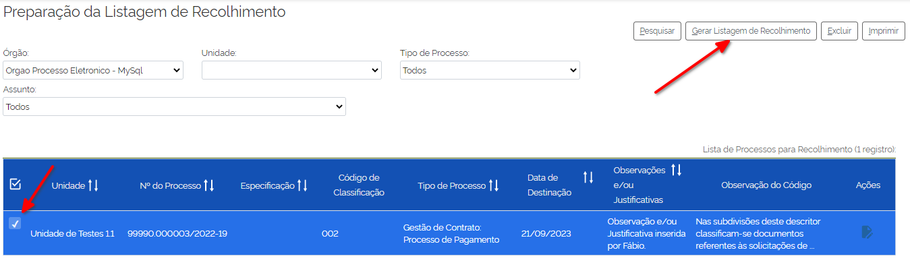

Ao gerar uma listagem, o sistema criará um número de processo para guardar a listagem criada, que ficará disponível na visão “**Gestão das Listagens**”, ligada à Listagens de Recolhimento, existente no menu Gestão Documental.

Excluir da Preparação para Recolhimento
"""""""""""""""""""""""""""""""""""""""

Nesta visão, o usuário terá a possibilidade de excluir um ou mais processos da preparação da Listagem de Recolhimento.

Para excluir um único processo, o usuário deverá clicar no botão Excluir da Preparação para Recolhimento, presente na grid do processo.

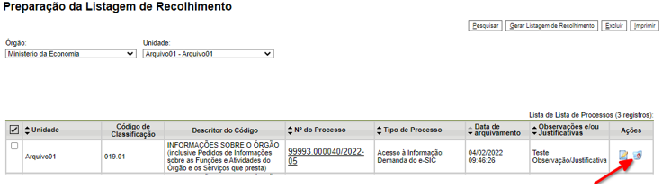
 
Para excluir mais de um processo, o usuário deverá selecionar todos os processos desejados, via marcação de checkbox, e em seguida clicar no botão "**Excluir**", existente na parte superior direita da tela.

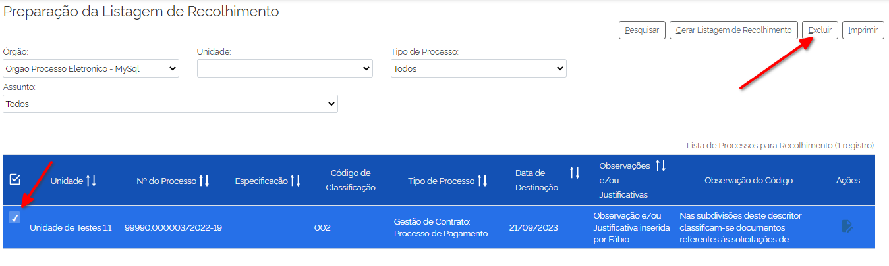

Após a confirmação da exclusão, os processos ficarão disponíveis na visão de Avaliação de Processos, do menu "**Gestão Documental**"

Imprimir
""""""""

Nesta visão será possível imprimir uma relação de processos conforme os filtros de pesquisa aplicados. 

Para realizar a Impressão (seja física ou em PDF), o usuário deverá selecionar os processos, via marcação de checkbox, e clicar em "**Imprimir**".

Adicionar observação e/ou justificativa
"""""""""""""""""""""""""""""""""""""""

Para registrar uma observação e/ou justificativa, o usuário deverá clicar no botão "**Adicionar observação e/ou justificativa**", presente na grid do processo que deseja.

.. figure:: _static/images/listagem_recolhimento_observacao_justificativa.png

Preencher o campo com a informação desejada e clicar em Salvar.

.. figure:: _static/images/listagem_recolhimento_inclusao_observacao_justificativa.png
 
Após esta ação, a informação salva ficará disponível em tela no campo Observações e/ou Justificativas da Grid do processo.

Gestão das Listagens de Recolhimento
^^^^^^^^^^^^^^^^^^^^^^^^^^^^^^^^^^^^

A visão de Gestão das Listagens concentra a relação dos processos de Recolhimento, criados na fase “Preparação de Listagem”.

Pesquisar
"""""""""

A pesquisa de processos poderá ser realizada por meio do preenchimento dos campos de filtragem disponíveis em tela e, em seguida, clique no botão "**Pesquisar**".

Imprimir
"""""""""

Nesta visão será possível imprimir uma relação de processos conforme os filtros de pesquisa aplicados. 

Para realizar a Impressão (seja física ou em PDF), o usuário deverá selecionar os processos, via marcação de checkbox, e clicar em "**Imprimir**".

Visualizar Listagem de Recolhimento
"""""""""""""""""""""""""""""""""""

Para visualizar a listagem de recolhimento o usuário deverá clicar no botão "**Visualizar Listagem**", disponível na grid do processo que deseja.

.. figure:: _static/images/recolhimento_gestao_das_listagens_visualizao_listagem.png
 
Ao acessar a listagem de recolhimento, o usuário poderá imprimi-la, via clique no botão imprimir; poderá gerar um PDF, via clique no botão Gerar PDF; ou retornar a tela de gestão de listagens, via clique no botão Cancelar.

.. figure:: _static/images/recolhimento_gestao_das_listagens_visualizacao_listagem_opcoes.png

Editar Listagem de Recolhimento
"""""""""""""""""""""""""""""""

Conforme a necessidade e/ou deliberações internas, o usuário poderá editar a listagem de recolhimento clicando no botão "**Editar Listagem de Recolhimento**".
 
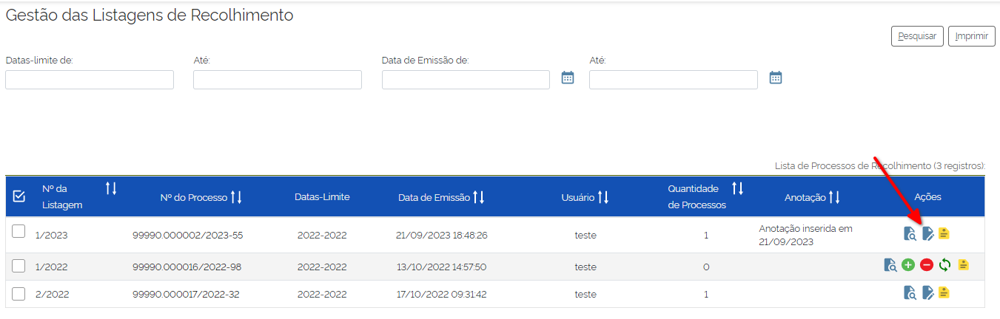

Ao realizar esta ação, o sistema irá deixar disponível na grid do processo um botão para adicionar processos e outro para remover processos.

.. figure:: _static/images/recolhimento_gestao_das_listagens_editar_listagem_inclusao_exclusao.png

Adicionar Processos à Listagem de Recolhimento
""""""""""""""""""""""""""""""""""""""""""""""

Ao clicar em adicionar, o sistema disponibiliza a lista de todos os processos presentes na tela de Preparação da Listagem de Recolhimento.

Para incluir um ou mais processos, o usuário deverá selecionar, via marcação de *checkbox*, os processos que deseja incluir na listagem e clicar no botão "**Adicionar na Listagem de Recolhimento**".

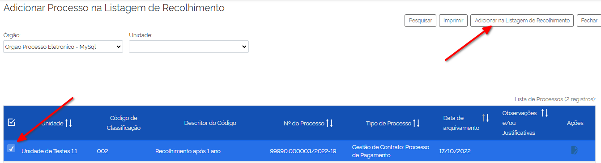
 
Remover Processos da Listagem de Recolhimento
"""""""""""""""""""""""""""""""""""""""""""""

Ao clicar em remover, o sistema disponibiliza a lista de todos os processos presentes na listagem de recolhimento.

Para excluir um ou mais processos, o usuário deverá selecionar, via marcação de *checkbox*, os processos que deseja excluir da listagem e clicar no botão "**Excluir da Listagem de Recolhimento**".
 
.. figure:: _static/images/recolhimento_gestao_das_listagens_editar_listagem_opcao_exclusao.png

Após realizar as inclusões e/ou exclusões de processos na listagem desejada, o usuário deverá clicar no botão Concluir Edição da Listagem para atualizar a lista com as edições efetuadas. Nesse momento será criada uma nova Listagem de Recolhimento no processo de recolhimento gerado na tela de controle de processos da unidade de avaliação.

.. figure:: _static/images/recolhimento_gestao_das_listagens_editar_listagem_inclusao_exclusao_atualizar.png

Acessar o Processo
""""""""""""""""""

Para acessar o processo contendo a listagem de recolhimento, o usuário deverá clicar sobre o número do processo em questão.

.. figure:: _static/images/recolhimento_gestao_das_listagens_acessar_listagem.png

Relatórios
~~~~~~~~~~

Nessa visão o usuário terá um panorama geral dos processos arquivados pelo Módulo.

Na parte inferior da tela existem contadores que auxiliam o usuário.

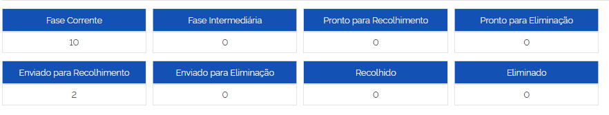

Pesquisar
^^^^^^^^^

A pesquisa de processos poderá ser realizada por meio do preenchimento dos campos de filtragem disponíveis em tela e, em seguida, clique no botão "**Pesquisar**".
 

Imprimir
^^^^^^^^

Nessa visão será possível imprimir uma relação de processos conforme os filtros de pesquisa aplicados.

Para realizar a Impressão (seja física ou em PDF), o usuário deverá selecionar os processos, via marcação de checkbox, e clicar em "**Imprimir**".

Módulo de Integração com Conta gov.br (Login Único)
+++++++++++++++++++++++++++++++++++++++++++++++++++

O módulo **Login Único** trará ao usuário externo a facilidade e segurança de acessar o SUPER via plataforma de autentição do Governo Federal, chamada no ambito desta documentação de **Conta gov.br**

Usuário externo é a pessoa física autorizada a acessar ou atuar em determinado(s) processo(s) no SUPER, independente de vinculação a determinada pessoa jurídica, para fins de peticionamento ou assinatura de documentos relativos a um Órgão da Administração.

A utilização deste módulo adicionará novas funcionalidades ao SUPER.GOV.BR 1.0, permitindo, entre outros:

 - Autenticar usuários externos utilizando a **Conta gov.br**
 - Assinar documentos utilizando a **Conta gov.br**
 
Para informações sobre como aderir à Conta Gov.Br, acesse: https://sso.acesso.gov.br/

Manual de Utilização
--------------------

Esta seção tem por objetivo demonstrar as funcionalidades que são disponibilizadas pelo módulo de integração e também as configurações que devem ser realizadas no próprio SUPER para o seu correto funcionamento.

A instalação do módulo de **Login Único** irá adicionar uma nova opção de autenticação para os usuários externos, permitindo que seja utilizada a conta única provida pelo **gov.br** para realização do acesso externo ao SUPER.

Para acesso ao ambiente externo do SUPER da entidade, o usuário deverá acessar a página de acesso externo específica de sua entidade e clicar no botão **[acessar com gov.br]**;

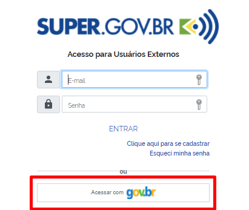

Será apresentada a tela de login da **Conta gov.br**. O usuário deverá colocar o seu CPF e clicar em continuar. Em seguida, inserir a senha e clicar em Entrar;

Primeiro Acesso ao SUPER via Conta gov.br
~~~~~~~~~~~~~~~~~~~~~~~~~~~~~~~~~~~~~~~~~~

Caso seja o primeiro acesso externo do usuário ao SUPER, esse será direcionado à tela de complementação de dados cadastrais. Os dados obtidos da Conta gov.br são automaticamente preenchidos e não podem ser modificadados, sendo necessário apenas a complementação de informações, como: endereço, telefones, RG.

Entre as informações cadastrais estão: Nome do Representante, CPF, RG, Telefones de Contato e Endereço.

.. figure:: _static/images/tela_cadastro_externo_super.png
    :alt: Cadastro de usuário externo

.. admonition:: Nota
 
   Também é solicitado uma senha secundária para que o usuário utilize caso ocorra alguma indisponibilidade do serviço de autenticação da **Conta gov.br**.

.. figure:: _static/images/tela_cadastro_externo_senha_alteranativa2.png
    :alt: Cadastro de senha alternativa

Após o preenchimento do formulário, o usuário deverá preencher o código indicado na imagem em tela e clicar em enviar. Em seguida a tela do SUPER acesso externo será aberta.

.. admonition:: Nota
 
    O acesso direto ao ambiente externo do SUPER somente será concedido caso o usuário possua uma **Conta gov.br** classificada como "Ouro" ou "Prata", o que garante um nível de confiabilidade e de autenticidade em níveis adequados, não necessitando validação manual da documentação para liberação de acesso. Entende-se que a confirmação das informações do usuário foram prestadas devidamente no momento em que o mesmo adiquiriu o respectivo selo de confiabilidade.

Para maiores informações sobre os níveis de confiabilidade da **Conta gov.br**, acesse `O que é Selo de Confiabilidade (Ouro e Prata)? Como posso obter esses selos? <https://www.gov.br/servidor/pt-br/acesso-a-informacao/faq/acesso-gov.br/5-o-que-e-selo-de-confiabilidade-ouro-e-prata-como-posso-obter-esses-selos>`_

Usuário com Cadastro Simples na Conta gov.br (Selo de Confiabilidade Bronze)
~~~~~~~~~~~~~~~~~~~~~~~~~~~~~~~~~~~~~~~~~~~~~~~~~~~~~~~~~~~~~~~~~~~~~~~~~~~~

Caso o usuário somente tenha realizado o auto-cadastro simplificado na Conta gov.br, ou seja, não tenha aumentado o nível de segurança (Ex: Certificado Digital, Justiça Eleitoral, SIGEPE), o SUPER irá seguir o fluxo padrão do sistema, que consiste no encaminhamento de mensagem com as instruções para a complementação das informações necessárias ao acesso externo do usuário.

Para conseguir as credenciais Outro ou Prata, acesse o seu cadastro na `Conta gov.br <https://sso.acesso.gov.br/>`_ siga as orientações presentes no link **[Segurança da Conta] > [Aumentar nível da conta]**.

.. figure:: _static/images/login_unico_mensagem_usuario_bronze.gif
    :alt: Mensagem usuário bronze

.. figure:: _static/images/mensagem_usuario_bronze.png
    :alt: Mensagem usuário bronze

Após apresentar a documentação indicada na mensagem, o usuário será autorizado a utilizar o SUPER com acesso externo. A partir deste momento, o seu ingresso no SUPER utilizando a conta gov.br será de forma direta, bastando clicar no botão **[acessar com gov.br]** e incluir suas credenciais.

Unificação de usuários externos com conta gov.br
~~~~~~~~~~~~~~~~~~~~~~~~~~~~~~~~~~~~~~~~~~~~~~~~

Caso o usuário já possua um usuário externo, ao acessar o sistema via conta gov.br será aberta tela indicando que foi identificado um usuário externo SUPER com o mesmo endereço de email da conta gov.br e possibilitará a associação das destas contas. Tal ação possibilitará que os próximos acessos do usuário ocorram de forma direta.

.. figure:: _static/images/vinculacao_de_contas.png
    :alt: Vinculação de contas

O usuário deverá inserir a senha de usuário externo do SUPER, preencher o captcha e clicar em **[Vincular Conta]**. 

Após a vinculação, o usuário será direcionado ao ambiente externo SUPER.
