Outras operações com Documentos
================================

Favoritos
+++++++++

Recurso que permite salvar um documento inteiro como modelo, para utilização do seu formato e conteúdo na confecção de outros documentos. Após a criação do novo documento, será possível editar o seu conteúdo, não causando alterações no documento usado como modelo.

.. admonition:: Nota

   Um processo também poderá ser incluído em “**Favoritos**”, porém, nesse caso, não haverá possibilidade de ele ser utilizado como modelo para geração de outro processo. A sua inclusão em “**Favoritos**” facilitará a busca e a organização de processos no âmbito da unidade.

Para salvar um documento como modelo **Favorito**, selecione o documento e clique no ícone “**Adicionar aos Favoritos**” |adicionar_favoritos|.

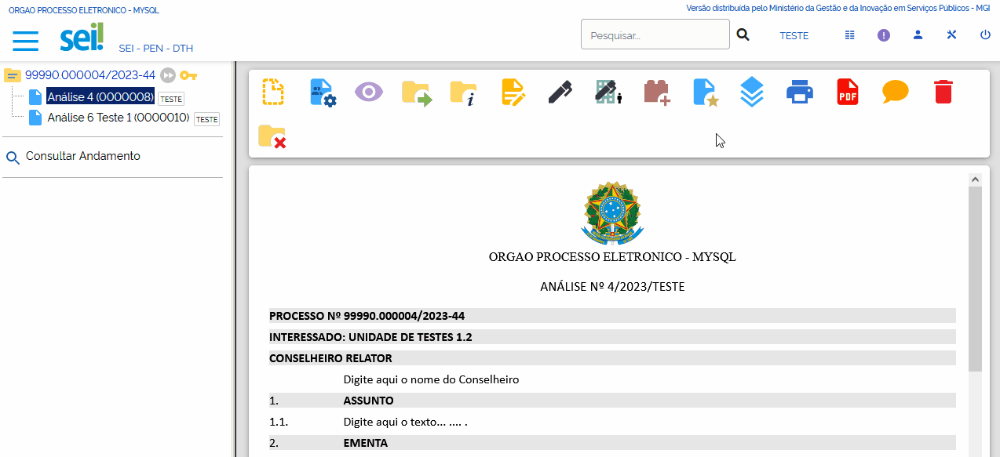

Na tela seguinte, o usuário deverá selecionar um “**Grupo de Favoritos**” ou criar um “**Grupo**”, clicando no ícone “**Novo Grupo de Favoritos**” |mais|. Em seguida, preencher o campo “**Descrição**” e salvar.

.. |mais| image:: _static/images/2-OBCP_Atribuir_icone_Exibir_todos_os_tipos.png
   :align: middle
   :width: 30

.. figure:: _static/images/6-OOD-favorito_tela_processo_formulario.gif

Será aberta a tela “**Favoritos do Documento**”. Nessa tela, o usuário poderá:

a) Adicionar o documento em outro “**Grupo de Favoritos**”, por meio do botão “**Adicionar**”, visto que um documento poderá ser incluído em mais de um Grupo de Favoritos.

.. figure:: _static/images/6-OOD-favorito_adicionar.gif

b) Excluir o documento Favorito por meio do ícone “**Excluir Favorito**” |excluir|, disponível na coluna Ações, ou por meio do botão Excluir.

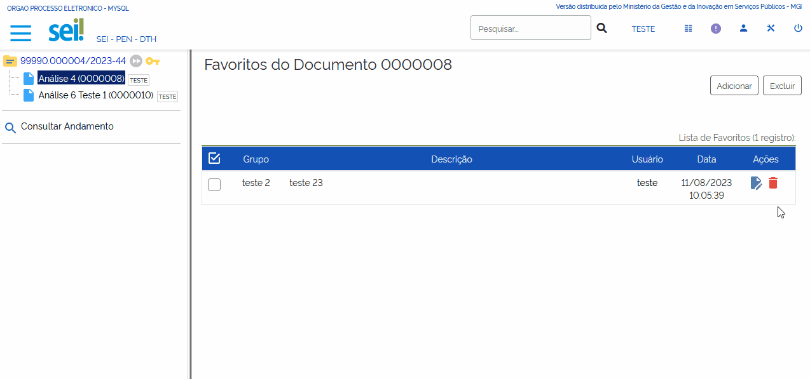

c) Alterar o documento Favorito por meio do ícone “**Alterar Favorito**” |editar|, disponível na coluna Ações.

.. figure:: _static/images/6-OOD-favorito_alterar.gif

Situações de Utilização de um Documento Salvo em Favoritos
----------------------------------------------------------

O Documento salvo em Favoritos (modelo de documento) poderá ser utilizado nas seguintes situações:

a) Ao criar um documento no processo, tela “**Gerar Documento**”: na seção “**Texto Inicial**”, seleção “**Documento Modelo**”, serão disponibilizadas duas opções: Campo para inclusão do número do protocolo do documento; e o botão Selecionar Favorito.

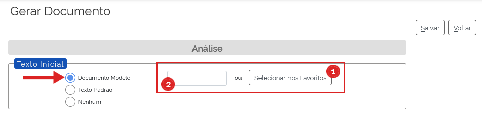

1) Ao clicar em “**Selecionar Favoritos**”, serão listados todos os documentos salvos em Favoritos. Na coluna ações, o usuário deverá clicar no ícone “**Selecionar Este Favorito**” |transpor|correspondente ao documento desejado; ou selecionar o documento e clicar no botão Transportar.

.. |transpor| image:: _static/images/6-OOD-icone_selecionar_este_favorito.png
   :align: middle
   :width: 25

Após a seleção, o campo será preenchido automaticamente com o número do protocolo.

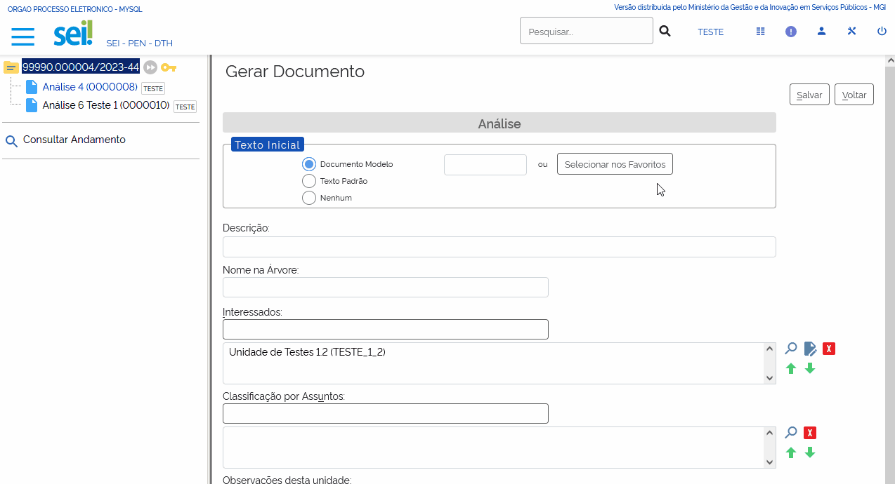

2) No campo em branco, será possível que o usuário inclua o número de protocolo do documento a ser utilizado, não necessariamente dos Favoritos.

b) Ao incluir um documento no processo, tela “**Incluir Documentos em Processos**”: na seção “**Texto Inicial**”, seleção “**Documento Modelo**”, serão disponibilizadas duas opções: Campo para inclusão do número do protocolo do documento; e o botão Selecionar Favorito. O comportamento para preenchimento dos campos será o mesmo apresentado no item acima.

Criando um Grupo de Favoritos
-----------------------------

A criação de um grupo de favoritos poderá ocorrer de duas formas: 

* ícone **Adicionar aos Favoritos** existente na barra de ícones do processo; ou 

* Na opção **Favoritos** do menu principal.

Tela do Processo – Ícone Adicionar aos Favoritos
~~~~~~~~~~~~~~~~~~~~~~~~~~~~~~~~~~~~~~~~~~~~~~~~~~

1) Para criar um Grupo de Favoritos, acesse o processo e, na Barra de Ícones, clique no ícone “**Adicionar aos Favoritos**” |adicionar_favoritos_tela_processo|.

.. |adicionar_favoritos_tela_processo| image:: _static/images/1-IO_icone__favoritos.png
   :align: middle
   :width: 30

2) Ao abrir a janela “**Novo Favorito**”, clicar no ícone “**Novo Grupo Favoritos**” |mais|, que fica ao lado da caixa **Grupo**. 

.. |mais| image:: _static/images/2-OBCP_Atribuir_icone_Exibir_todos_os_tipos.png
   :align: middle
   :width: 20

3) Na janela “**Novo Grupo de Favorito**”, preencher o campo “**Nome**” e, em seguida, clique em Salvar.

.. figure:: _static/images/6-OOD-favorito_barra_de_icones.gif

Menu Principal – Opção Favoritos
~~~~~~~~~~~~~~~~~~~~~~~~~~~~~~~~~

Também é possível criar um Grupo de Favoritos acessando a opção “**Favoritos**”, no Menu Principal. 

1) Na tela “**Favoritos**”, clique no botão “**Grupos**”.

2) Na tela “**Grupos de Favoritos**”, o usuário visualiza os Grupos existentes e, por meio do botão “**Novo**”, poderá criar um Grupo.

3) Informe o nome do grupo no campo “**Nome**” e clique em Salvar.

4) Para retornar a tela de “**Favoritos**” clique em Fechar.

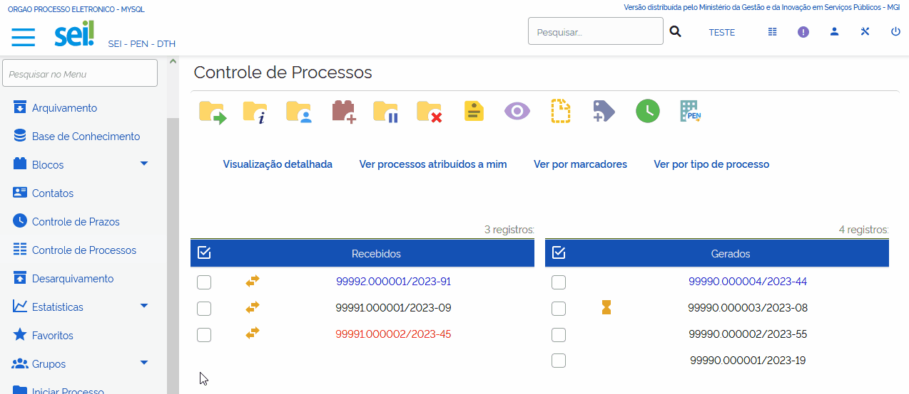

Na tela “**Favoritos**”, são exibidos todos os documentos e processos incluídos em “Favoritos”. A Lista de Favoritos apresenta as seguintes informações a respeito do modelo incluído em Favoritos: 

* Protocolo;
* Tipo;
* Usuário responsável;
* Data e hora da inclusão; 
* Descrição; e 
* Grupo.

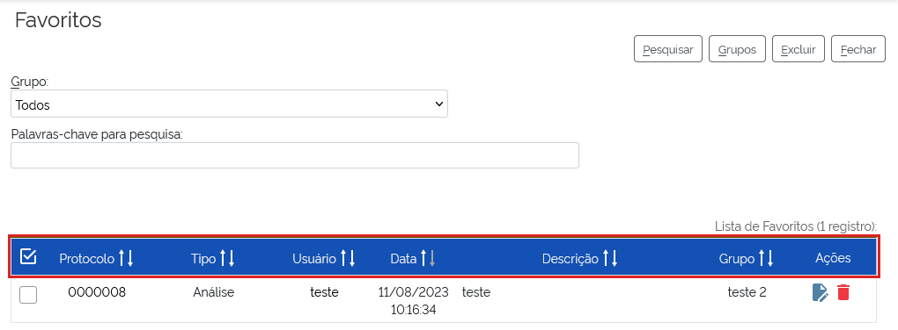

Nessa tela, é possível também:

1. selecionar Grupos de Favoritos específicos para visualização na tela; 
2. pesquisar Grupos por Palavras-chave;
3. na coluna Ações, encontram-se os ícones Alterar Favorito |editar| e Excluir Favorito  |excluir|, que permitem realizar essas ações no Protocolo correspondente;
4. acessar Grupos, para alterá-los ou excluí-los; e 
5. excluir “**Favoritos**”.

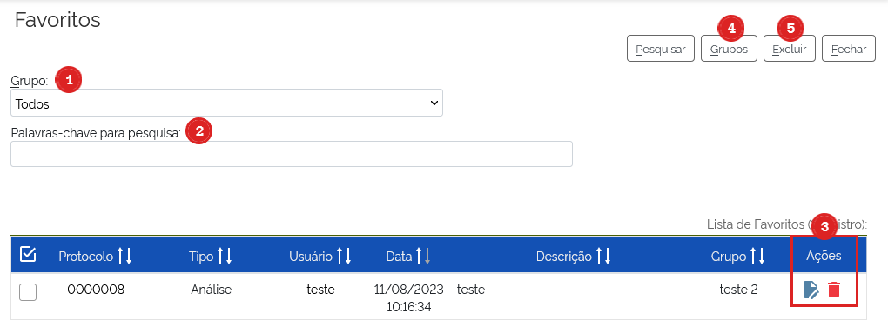

Textos Padrão
+++++++++++++++++++++

Recurso que viabiliza a criação de um fragmento de texto que pode ser utilizado na elaboração de documentos ou de e-mails gerados no sistema. O Texto Padrão é editável.

Para criar um texto padrão, acesse o **Menu Principal** e selecione a opção “**Textos Padrão**”.Na tela seguinte, clique no botão “**Novo**”.

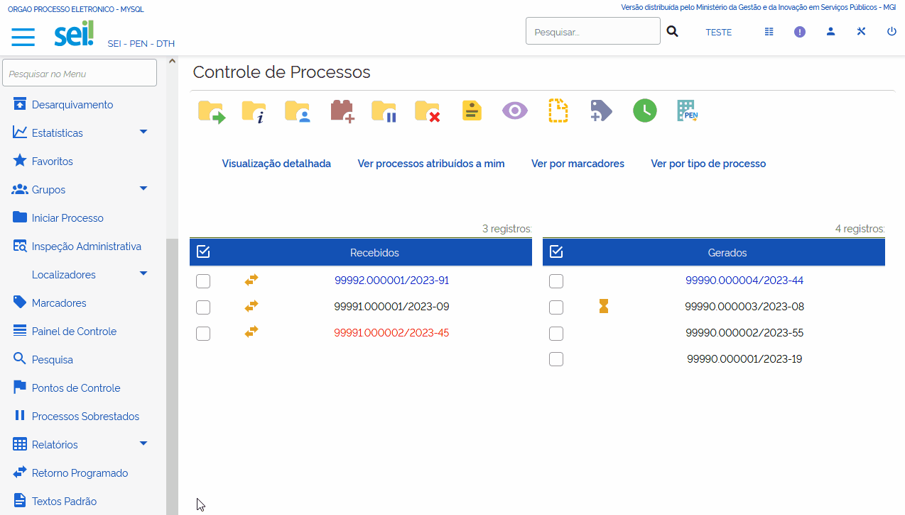

Na tela “**Novo Texto Padrão Interno**”, preencha os campos “**Nome**”, “**Descrição**” e “**Conteúdo**” e depois clique em Salvar.

.. figure:: _static/images/6-OOD-texto_padrao_formulario_inclusao.gif

.. admonition:: Nota

   Na criação do Texto Padrão, ao preencher o campo **Conteúdo**, o usuário poderá utilizar os recursos de formatação disponíveis no Editor de Textos. Além disso, será possível incluir variáveis que permitem a recuperação de dados no sistema. Para verificar as variáveis disponíveis, clique no ícone “**Ajuda**” |ajuda|, que fica ao lado do campo Conteúdo.

.. |ajuda| image:: _static/images/6-OOD-icone_ajuda.png
   :align: middle
   :width: 25

Na tela seguinte, será possível “Consultar” |consulta|, “Alterar” |editar| ou “Excluir” |excluir| um Texto Padrão, por meio das opções disponíveis na coluna Ações.

.. figure:: _static/images/6-OOD-texto_padrao_acoes.PNG

Situações de Utilização de um Texto Padrão
------------------------------------------

O Texto Padrão poderá ser utilizado nas seguintes situações:

a) Ao criar um documento no processo, tela “**Gerar Documento**”: na seção “**Texto Inicial**”, seleção “**Texto Padrão**”, será disponibilizada uma caixa de seleção com os textos padrão existentes para que o usuário selecione o que melhor se adequar a sua necessidade.

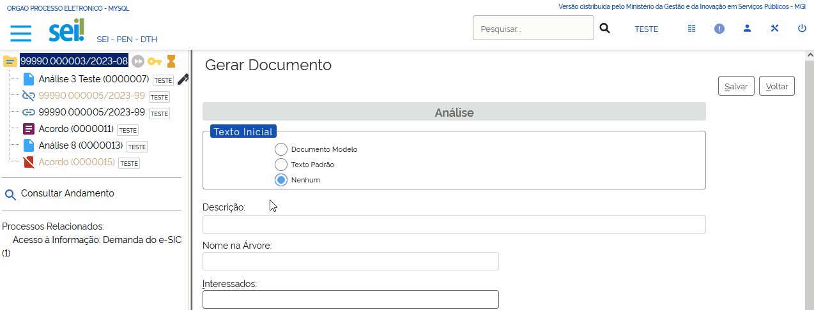

b) Ao incluir um documento no processo, tela “**Incluir Documentos em Processos**”: na seção “**Texto Inicial**”, seleção “**Texto Padrão**”, será disponibilizada uma caixa de seleção com os textos padrão existentes para que o usuário selecione o que melhor se adequar à sua necessidade.

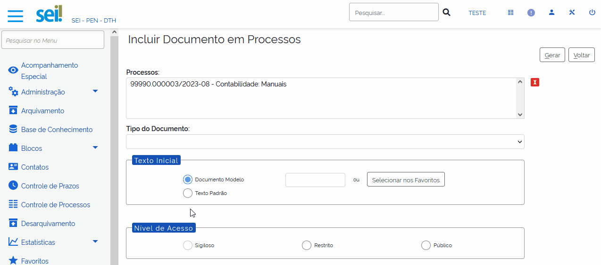

c) Na janela de edição do documento: ao clicar no botão “**Autotexto**” |autotexto|, disponível na Barra de Ferramentas, será aberta a janela “Autotexto”. Nela, será possível selecionar um Texto Padrão existente; e, em seguida, basta clicar no botão OK.

.. |autotexto| image:: _static/images/6-OOD-icone_autotexto.png
   :align: middle
   :width: 55

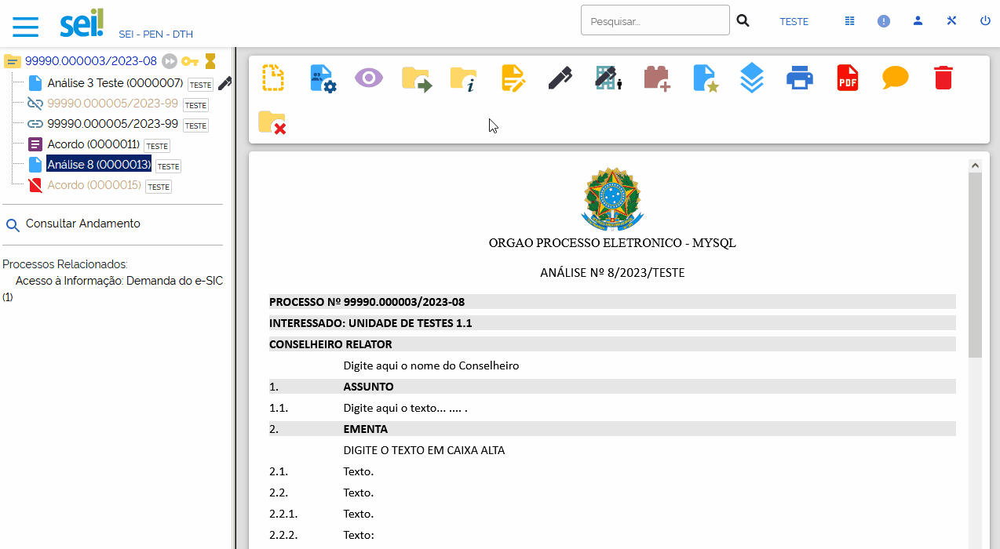

d) Na janela “**Enviar Correspondência Eletrônica**”: na caixa “**Mensagem**” é possível selecionar um Texto Padrão existente.

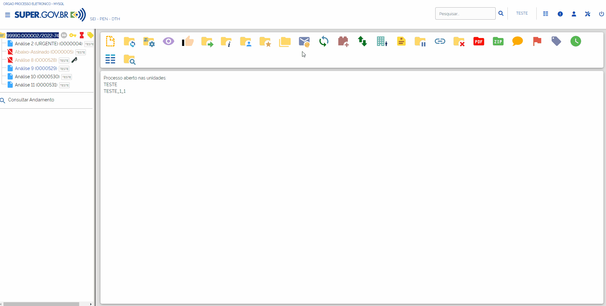

Mover Documentos Externos
+++++++++++++++++++++++++++++++

O SUPER.GOV.BR disponibiliza um modo de mover documentos externos de um processo para outro. Essa funcionalidade é útil, por exemplo, nos casos em que o protocolo recebe um documento externo em um novo processo, no entanto, já existe um processo aberto para tratar daquele assunto.
Para mover um documento externo para outro processo, selecione o documento e clique no ícone “**Mover Documento para outro Processo**”  .

.. |mover_documento| image:: _static/images/6-OOD-icone_mover_documento_para_outro_processo.png
   :align: middle
   :width: 25

Será aberta a tela “**Mover Documento**”, onde o usuário deverá inserir o número do processo de destino e clicar em “**Pesquisar**”. Automaticamente o campo “**Tipo**” será preenchido com o respectivo tipo de processo de destino, e será habilitado o campo “**Motivo**” para preenchimento. Complementados os campos necessários, basta clicar no botão “**Mover**”.

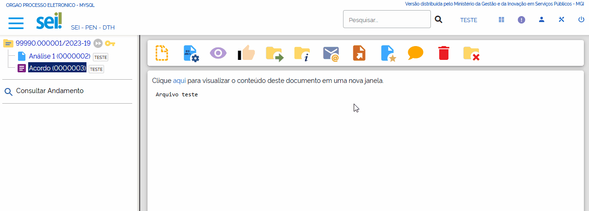

O processo de destino receberá o documento em sua árvore. O registro da transferência ficará disponível na consulta ao andamento do processo.

.. admonition:: Nota

   Os documentos gerados no sistema não são movidos, mas podem ser referenciados em outros documentos, de modo que seja inserido um link que permita a visualização do documento, não importa em que processo estiver. Para maiores informações, consultar o item “**Referenciar documentos ou processos**”.

Ordenar Árvore do Processo
++++++++++++++++++++++++++

O SUPER.GOV.BR permite a alteração da ordem dos documentos na árvore de um processo. Essa funcionalidade serve para corrigir inserções de documentos que, dispostos em sequência cronológica, acabam dificultando o entendimento das informações de um processo. 

Para alterar a ordem de documentos da árvore de um processo, acesse o processo e clique no ícone “**Ordenar Árvore do Processo**” |ordenar_arvore|.

A tela “**Ordenar Árvore do Processo**” será aberta. Nela, o usuário poderá reorganizar a ordem dos documentos na árvore selecionando o documento e utilizando os ícones “**Mover Acima Protocolo Selecionado**” |para_cima| ou “**Mover Abaixo Protocolo Selecionado**” |para_baixo|.

Feita a reorganização dos documentos, clique em “**Salvar**” para registrar a ação.

.. figure:: _static/images/6-OOD-ordenar_arvore_tela_processo.gif

Publicar/Agendar Publicação
++++++++++++++++++++++++++++

Antes de realizar a publicação/agendamento da publicação, o usuário deverá:

* realizar os ajustes de texto e formatação do documento conforme padrão estabelecido em normativos vigentes;
* proceder à revisão gramatical e ortográfica do ato de acordo com a norma padrão da língua portuguesa e uso do padrão culto da linguagem;
* providenciar a assinatura eletrônica da autoridade competente no ato a ser publicado.

Para publicar ou agendar a publicação de um documento no Boletim de Serviço Eletrônico, acesse a versão final do documento/ato a ser publicado e clique no ícone “**Agendar Publicação**” |agendar_pubicacao|.

.. figure:: _static/images/6-OOD-agendar_publicacao.gif

A tela “Agendar Publicação” será aberta. Nela, preencha os campos conforme descrito abaixo:

* **Documento**: campo preenchido automaticamente pelo sistema com o número do documento;
* **Tipo**: campo preenchido automaticamente com o tipo do documento informado durante a inclusão do documento no processo;
* **Assinantes**: campo preenchido automaticamente com o nome dos usuários que assinaram o documento;
* **Motivo**: campo preenchido automaticamente com a opção “**Publicação**”;
* **Veículo**: campo preenchido automaticamente com a opção “**Boletim de Serviço Eletrônico**”;
* **Disponibilização**: campo preenchido automaticamente com a data atual, para publicação imediata. Para agendamento, basta informar data futura;
* **Resumo**: campo obrigatório, deve ser preenchido com texto que deve conter os elementos para identificação do ato, como uma ementa, descrevendo a finalidade do documento;
* **Imprensa Nacional**: campo para preenchimento apenas se o ato, eventualmente, já tiver sido publicado no Diário Oficial da União.

Ao preencher os campos, clique em “**Salvar**”.

.. figure:: _static/images/6-OOD-agendar_publicacao_formulario.gif

* Se a data de disponibilização for a data atual, a indicação da publicação do documento será apresentada na árvore do processo, ao lado da identificação do documento, por meio do ícone |pubicacao|, e no canto superior direito do documento, na tarja de publicação.

.. |pubicacao| image:: _static/images/6-OOD-icone_identificacao_publicacao.png
   :align: middle
   :width: 25

.. admonition:: Nota

   O ícone ao lado da identificação do documento e a tarja de publicação só serão exibidos quando o documento for publicado, na data agendada.

.. figure:: _static/images/6-OOD-identificacao_publicacao_tela_processo.png

* Quando se tratar de agendamento de publicação, o agendamento poderá ser 
consultado, alterado ou cancelado por meio do ícone “**Visualizar Publicações/Agendamentos**” |pesquisar_pubicacao|, na tela do documento.

.. |pesquisar_pubicacao| image:: _static/images/6-OOD-icone_visualizar_publicacao.png
   :align: middle
   :width: 30

.. admonition:: Notas

   1. A gestão das publicações está restrita a usuários com perfil “Publicador”, em Unidades Publicadoras.

   2. As unidades não publicadoras gerarão apenas as minutas desses atos, e a versão final a ser publicada será gerada apenas pela Unidade Publicadora, onde será numerada, quando for o caso, e publicada.

Visualizando Publicações/Agendamentos
-------------------------------------

Para visualizar as publicações/agendamentos de publicações de um documento, selecione o documento publicado/agendado e clique no ícone “Visualizar Publicações/Agendamentos” |pesquisar_pubicacao|.

.. |pesquisar_pubicacao| image:: _static/images/6-OOD-icone_visualizar_publicacao.png
   :align: middle
   :width: 30

.. figure:: _static/images/6-OOD-visualizar_publicacao_tela_processo.gif

* **Documento Publicado**:  usuário terá um resumo das informações relativas à publicação, sendo possível a alteração dos dados relativos à seção “**Impressa Nacional**”, por meio do ícone “**Alterar dados de Publicação**” |alterar_pubicacao|.

.. |alterar_pubicacao| image:: _static/images/6-OOD-icone_alterar_agendamento.png
   :align: middle
   :width: 30
.. admonition:: Nota

   Não é possível excluir ou cancelar a publicação já realizada, apenas os agendamentos realizados, enquanto ainda não tiverem sido publicados.

.. figure:: _static/images/6-OOD-alterar_dados_publicacoes.gif

* **Documento com agendamento de publicação**: usuário terá um resumo das informações relativas à publicação, sendo possível consultar, alterar, por meio do ícone “**Alterar Agendamento**” |alterar_pubicacao|, ou cancelar, por meio do ícone “**Cancelar Agendamento**” |cancelar_pubicacao|, a publicação.

.. |alterar_pubicacao| image:: _static/images/6-OOD-icone_alterar_agendamento.png
   :align: middle
   :width: 35

.. figure:: _static/images/6-OOD-publicacoes_agendamentos.png

Gerando Publicação Relacionada
------------------------------

Para gerar uma publicação relacionada a um documento publicado, selecione o documento e clique no ícone “**Gerar Publicação Relacionada**” |gerar_pubicacao|. Na tela “**Gerar Publicação Relacionada**”, preencha os campos disponíveis e clique em “**Salvar**”.

.. |gerar_pubicacao| image:: _static/images/6-OOD-icone_gerar_publicacao.png
   :align: middle
   :width: 25

.. figure:: _static/images/6-OOD-gerar_publicacao.gif

Essa ação irá gerar uma cópia do documento publicado. Tal documento ficará disponível na árvore de documentos do processo.

.. figure:: _static/images/6-OOD-gerar_publicacao_indicacao_arvore.png

Autenticar Documentos Externos
++++++++++++++++++++++++++++++

Esse recurso permite ao usuário efetuar a autenticação de documentos digitalizados inseridos no sistema, com login e senha ou certificado digital.

.. admonition:: Notas

   1. A autenticação de documento externo só será possível se o documento incluído no processo for classificado no campo “Formato” como “Digitalizado nesta Unidade” e no campo “Tipo de Conferência” como “Cópia Autenticada Administrativamente”.

   2. Somente Unidades protocoladoras poderão autenticar documentos externos.

.. figure:: _static/images/6-OOD-autenticar_documento_tipo_documento.png

Para autenticar um documento externo, selecione-o na Árvore do Processo e depois clique no ícone “Autenticar Documento” |autenticar_documento|.

.. figure:: _static/images/6-OOD-autenticar_documento_tela_documento.png

Na janela “**Autenticação de Documento**”, o usuário deverá conferir os dados do órgão, do assinante e o cargo/função selecionado. Em seguida:

* inserir a senha do sistema e clicar em “**Assinar**”; ou
* utilizar o certificado digital, clicando no link **Certificado Digital**.

.. figure:: _static/images/6-OOD-autenticar_documento_formulario.png

O ícone “**Autenticado Por**” |autenticar_documento_amarelo| aparecerá ao lado do documento autenticado e, ao posicionar o cursor ou clicar sobre esse ícone, serão exibidos os dados referentes à autenticação: nome do usuário, cargo/função e unidade.

.. figure:: _static/images/6-OOD-autenticada_por_indicativo_visualizado.png

O usuário poderá visualizar a autenticação do documento clicando sobre o botão “**Visualizar Autenticações**” que fica no lado direito da tela, abaixo da Barra de Ícones.

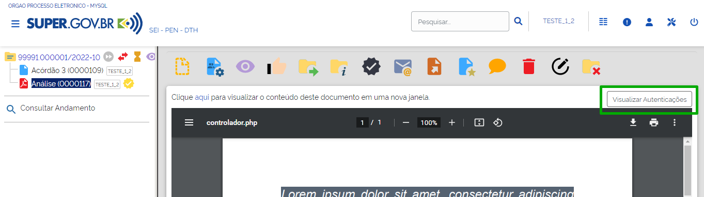

A autenticação do documento se comporta conforme imagem abaixo, exibindo fora do documento a tarja com os dados da autenticação. Para retornar à visualização do documento em tela, o usuário deverá clicar no botão “**Ocultar Autenticações**”.

.. figure:: _static/images/6-OOD-ocultar_autenticacao.png

.. admonition:: Nota

   O documento autenticado terá o ícone “**Autenticado Por**” na cor amarela |autenticar_documento_amarelo| até que já tenha sido visualizado ou tramitado, passando assim a cor preta |autenticar_documento|.

.. figure:: _static/images/6-OOD-autenticada_por_indicativo_visualizado.png

Gerar Circular
++++++++++++++

Esse recurso permite gerar documentos circulares individuais para cada destinatário, a partir de um documento-matriz e dos dados de contatos cadastrados no SUPER.GOV.BR.

Os documentos gerados poderão ser inseridos em Bloco de Assinatura e encaminhados para os e-mails associados aos contatos.

Para gerar um documento circular, acesse o processo e inclua o documento que servirá de base para a geração dos demais. Após a inserção do conteúdo, salve o documento e feche a janela do Editor de Textos.

Com o conteúdo do documento pronto, clicar no ícone “**Gerar Circular**” |gerar_circular|.

.. |gerar_circular| image:: _static/images/6-OOD-icone_gerar_circular.png
   :align: middle
   :width: 30

Na tela “**Gerar Circular**”, informe os destinatários e escolha um Bloco de Assinatura ou crie um Bloco, para a assinatura dos documentos.  Após o preenchimento dos campos, clique no botão “**Gerar**”.

O sistema direciona o usuário para a tela “**Documentos do Bloco de Assinatura**”, em que é possível consultar os dados do processo ou dos documentos ali inseridos, bem como assiná-los.

.. figure:: _static/images/6-OOD-gerar_circular_tela.gif

.. admonition:: Nota

   Para preenchimento do campo **Destinatários**, o usuário poderá digitar o nome do destinatário ou utilizar o ícone “**Selecionar Contatos para Destinatários**” |pesquisar|, que fica do lado direito da tela. Ao clicar nesse ícone, será aberta a janela “**Selecionar Contatos**”. Nela, é possível selecionar um ou vários contatos, bem como utilizar filtros para seleção dos contatos.

   |pesquisar_gif|

   A assinatura dos documentos inseridos no **Bloco de Assinatura** também poderá ser efetuada acessando o Menu Principal, opção Blocos e, depois, Assinatura. Ver mais no item "**Bloco de Assinatura**"

.. |pesquisar_gif| image:: _static/images/6-OOD-icone_pesquisar.gif
   :align: middle
   :width: 1000

Enviando o Documento Assinado, por E-mail, ao Destinatário
-----------------------------------------------------------

Para encaminhar os documentos assinados, por e-mail, aos respectivos destinatários, acesse o processo e selecione o documento-base que gerou a circular. Ele aparecerá na “**Árvore do Processo**” com o seguinte ícone à esquerda: |gerar_circular|. Após selecionar o documento-base, clique no ícone “**Gerar Circular**” |gerar_circular|, que se encontra na Barra de Ícones do documento.

Na tela “**Gerar Circular**”, selecione os destinatários para os quais deseja enviar o e-mail e, para o encaminhamento, clique no botão “Enviar E-mail”.

.. |gerar_circular| image:: _static/images/6-OOD-icone_gerar_circular.png
   :align: middle
   :width: 30

.. figure:: _static/images/6-OOD-tela_com_indicativo_gerar_circular.gif

Na tela “**Enviar Circular**”, insira o assunto, o conteúdo da mensagem e clique em “**Enviar**”.

O sistema emitirá mensagem de confirmação do envio e os e-mails enviados passarão a compor, automaticamente, a “**Árvore do Processo**”.

.. admonition:: Nota

   A gestão e a atualização dos dados dos destinatários no módulo “**Contatos**” são essenciais para o funcionamento adequado da funcionalidade “**Gerar Circular**”. Portanto, se algum dos destinatários não possuir e-mail cadastrado, apesar de o sistema gerar o documento circular, não será possível encaminhá-lo a esse destinatário.

