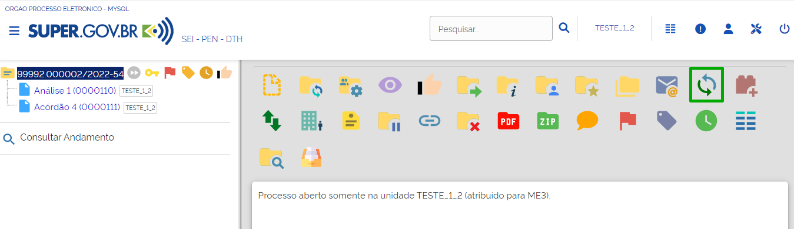
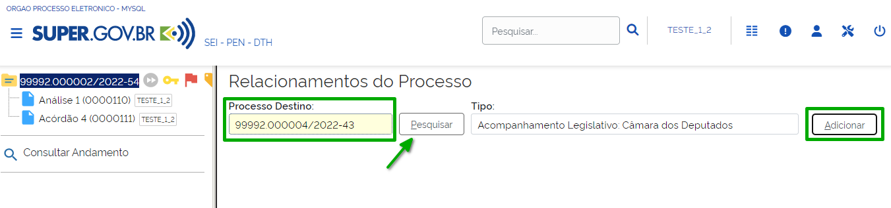
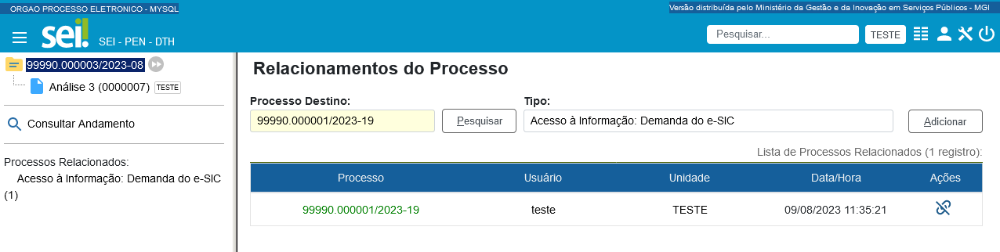
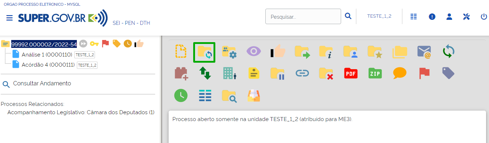
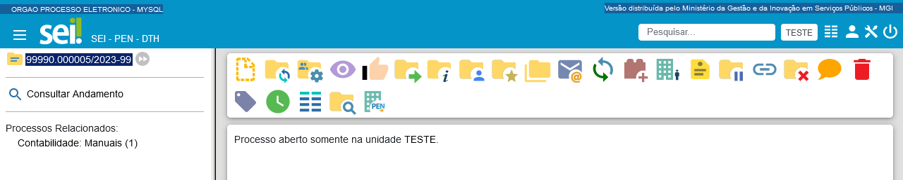
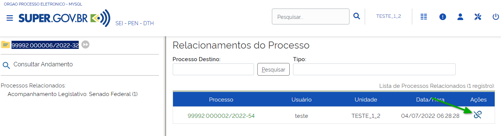
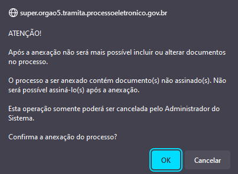
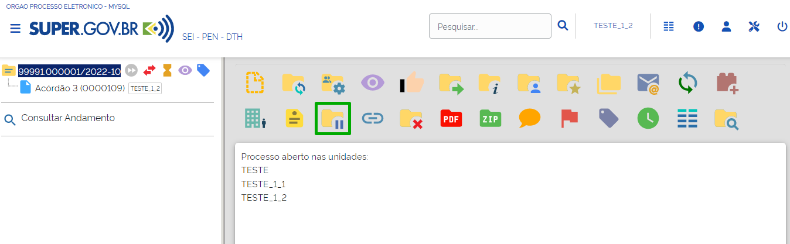
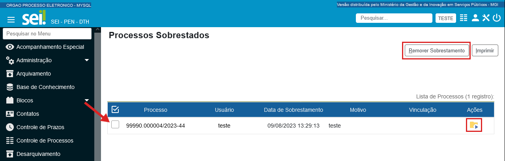
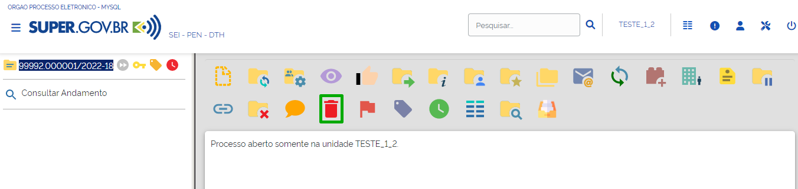

Outras Operações com Processos
==============================

Duplicar Processo
+++++++++++++++++

Recurso que viabiliza a duplicação dos dados do processo e dos documentos que o compõem.

Para duplicar um processo, o usuário deverá acessar o processo e clicar no ícone “**Duplicar Processo**” |duplicar|.

.. figure:: _static/images/4-OOCP-Duplicar_tela_processo.png

Em seguida:

* indicar o interessado no processo;
* selecionar os documentos que deseja duplicar; e 
* clicar em “**Duplicar**”.

.. admonition:: Nota

   Ao duplicar um processo, as relações entre processos existentes no processo original podem ser mantidas no novo processo. Para isso, marque a opção “Manter as associações com os processos relacionados”. 

.. figure:: _static/images/4-OOCP-Duplicar_formulario.png

O sistema duplica os documentos selecionados, à exceção de minutas e e-mails; gera um novo número de processo e novas numerações para os documentos; o processo gerado e os documentos que o compõem são criados sem as assinaturas, as ciências e o acompanhamento especial, se houver.

Relacionar Processos
+++++++++++++++++++++

Recurso que permite vincular um ou mais processos que possuem informações relacionadas.

Para relacionar processos, o usuário deverá acessar um dos processos que serão relacionados e clicar no ícone “**Relacionamentos do Processo**” |relacionar|.

.. |relacionar| image:: _static/images/1-IO_icone__relacionamentos_processo.png
   :align: middle
   :width: 30

Será aberta a tela “**Relacionamentos do Processo**”. Nela, o usuário deverá informar o número do **Processo Destino** e clicar em Pesquisar. O sistema confirmará a existência do processo no SUPER.GOV.BR e, automaticamente, preencherá o campo **Tipo**. Por fim, clique em “**Adicionar**”.

O sistema mostrará, na tela **Relacionamentos do Processo**, a lista de processos relacionados.

Na tela do processo, os processos relacionados aparecem abaixo da Árvore do Processo, logo após a opção **Consultar Andamento**. Clicando sobre o tipo de processo, é possível visualizar o número do(s) processo(s) relacionado(s). Para acessar um processo, clique sobre seu número.

.. figure:: _static/images/4-OOCP-relacionar_processos_consulta.png

Iniciando um Processo Relacionado
----------------------------------

O usuário poderá também iniciar um processo já relacionado a outro. Para isso, acesse o processo desejado e clique no ícone “**Iniciar Processo Relacionado**” |icone_relacionar|.

Na tela “**Iniciar Processo Relacionado**”, escolha o tipo de processo.

.. figure:: _static/images/4-OOCP-iniciar_processo_relacionado_escolher_processo.png

Em seguida, preencha os dados de cadastro do novo processo, da mesma forma orientada no item “**Iniciar Processo**”, e clique em “**Salvar**".

O sistema mostrará a tela do novo processo já relacionado ao processo selecionado inicialmente.

Cancelamento de Relacionamento de Processos
-------------------------------------------

Para cancelar o relacionamento de processos, acesse um dos processos e clique no ícone “**Relacionamentos do Processo**” |relacionar|. 

.. |relacionar| image:: _static/images/1-IO_icone__relacionamentos_processo.png
   :align: middle
   :width: 30

Na tela “Relacionamentos do Processo”, serão listados os processos relacionados. Selecione o processo desejado e clique no ícone “Remover Relacionamento**” |remover_relacao|, disponível na coluna **Ações**.

.. admonition:: Notas

   1. Processos relacionados não tramitam juntos e não há hierarquia entre eles.
   2. O vínculo entre processos relacionados pode ser desfeito, a qualquer tempo, por usuário da unidade que efetuou a operação.

Anexar Processos
++++++++++++++++

Recurso que viabiliza a anexação permanente de um processo a outro.

.. admonition:: Nota

   **Regras para anexação:**
   
   a. O processo deve estar aberto apenas na unidade que efetuará a ação.
   b. O processo a ser anexado não pode ter processos anexos a ele. 
   c. Os processos envolvidos na operação não podem ser sigilosos.
   d. O processo a ser anexado precisa conter documentos.
   e. Não é possível anexar um processo a dois processos diferentes.

Para anexar processo, acesse o processo principal e clicar no ícone "Anexar Processo" |anexar|.

.. figure:: _static/images/4-OOCP-tela_processo_anexar_processo.png

Na tela **Anexação de Processos**, preencha o campo **Processo** com o número do processo a ser anexado e clique em “**Pesquisar**”. O SUPER.GOV.BR preencherá o campo “**Tipo**” automaticamente. Em seguida, clicar em “**Anexar**”.

.. figure:: _static/images/4-OOCP-Tela_anexar_processos.png

Ao clicar em Anexar, o sistema emitirá uma mensagem informando que, após a anexação, o usuário não poderá mais incluir ou alterar documentos no processo anexado e que somente o administrador do sistema poderá cancelar a operação. Portanto, se estiver seguro da necessidade de anexação do processo, clique em **OK** para continuar.

A tela de **Anexação de Processos** listará o processo anexado, com o nome do usuário e da unidade que efetuou a anexação, bem como com a data e a hora da operação.

Além disso, no lado esquerdo da tela, na “**Árvore do Processo**”, o usuário visualiza o processo anexado.

.. figure:: _static/images/4-OOCP-anexar_processos_arvore_processos.png

Para visualizar o conteúdo do processo anexado, clique sobre seu número na “**Árvore do Processo**” e, em seguida, no link disponível na informação que aparecerá na tela.

O usuário será direcionado para a tela do processo anexado e poderá acessar o conteúdo de seus documentos e suas demais informações.

.. figure:: _static/images/4-OOCP-anexar_processos_acessar_processo_anexado.png

.. admonition:: Notas

   1 Ao efetuar essa operação, o processo anexado perde sua independência e passa a compor a Árvore do Processo principal, tornando-se um processo acessório.
   2 Não é possível adicionar documentos ao processo anexado ou assinar documentos que, porventura, não estejam assinados. Os relacionamentos do processo anexado são mantidos após a anexação. Caso o processo a ser anexado seja “**Restrito**”, esse nível de acesso será estendido ao processo principal.

Sobrestar Processo
++++++++++++++++++

Recurso utilizado para interromper o trâmite do processo em função da necessidade de aguardar alguma providência, antes do prosseguimento. Ressalta-se que, em geral, o sobrestamento ocorre por força de decisão judicial. 

Para sobrestar processo, clique no número do processo e selecione o ícone “**Sobrestar Processo**” |sobrestar|, disponível na Barra de Ícones.

Será aberta a tela **Sobrestamento**. Nela, escolha entre duas opções:

* Marque “**Somente Sobrestar**” quando a determinação de interrupção do trâmite do processo constar no próprio processo. Em seguida, preencha o campo **Motivo** e clique em Salvar.

.. figure:: _static/images/4-OOCP-sobrestar_formulario.png

* Marque “**Sobrestar vinculando a outro processo**” quando a determinação de interrupção do trâmite do processo constar em outro processo também existente no SUPER.GOV.BR. No campo **Processo para Vinculação**, informe o número do processo que tenha determinado o sobrestamento e clique em **Pesquisar**. 
  O campo **Tipo** será automaticamente preenchido. Em seguida, preencha o campo **Motivo** e clique em **Salvar**.

.. figure:: _static/images/4-OOCP-sobrestar_formulario_motivo.png

Consultando ou Removendo o sobrestamento
----------------------------------------

Para consultar ou remover um sobrestamento, selecione a opção **Processos Sobrestados**, disponível no **Menu Principal**.

.. figure:: _static/images/4-OOCP-sobrestar_tela_controle_processo.png

Na tela **Processos Sobrestados**, é possível visualizar todos os processos sobrestados na unidade.

É possível remover o sobrestamento selecionando o processo e clicando no botão "**Remover Sobrestamento**" ou no ícone “**Remover Sobrestamento**” |remover_sobrestar|, que se encontra na coluna Ações.

.. |remover_sobrestar| image:: _static/images/4-OOCP-icone_remover_sobrestamento.png
   :align: middle
   :width: 35

.. admonition:: Notas

   1. Para efetuar o sobrestamento, o processo deve estar aberto apenas na unidade que efetuará a operação.

   2. Os processos sobrestados não são exibidos na tela Controle de Processos.

Excluir Processos
+++++++++++++++++

No SUPER.GOV.BR é possível excluir processos, nos casos em que foram criados indevidamente.

.. admonition:: Nota

   **Regras para exclusão:**
 
   a. O processo deve ter andamento aberto somente na unidade geradora.
   b. O processo não pode conter documentos.

Na tela do processo, clique no ícone “Excluir” |excluir|, disponível na Barra de Ícones. Aparecerá, então, uma mensagem para confirmação da exclusão do processo.

.. |excluir| image:: _static/images/3-OBCP_icone_exclusao.png
   :align: middle
   :width: 25

.. admonition:: Notas

   1. A exclusão de processos deve ser efetuada pela unidade geradora somente em caso de processos abertos indevidamente.
   2. No caso de processo com documentos externos e/ou gerados no sistema que possam ser excluídos, o SUPER.GOV.BR permite que sejam efetuadas as exclusões de todos esses documentos e, depois, permite a exclusão do processo.

