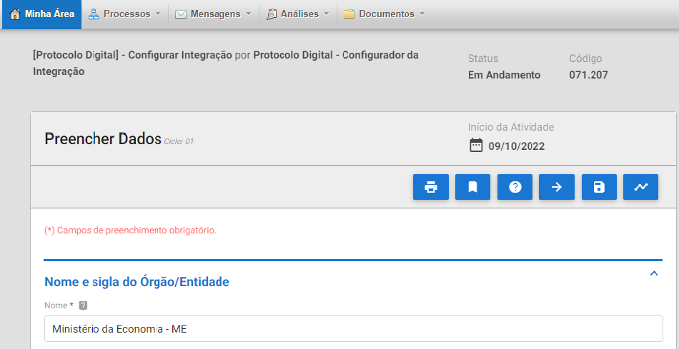
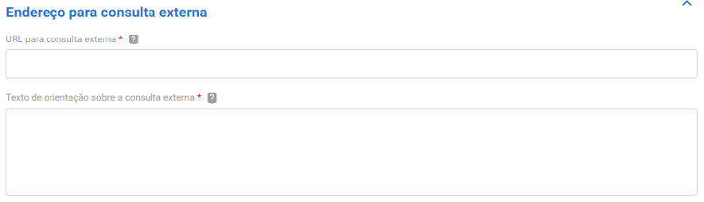
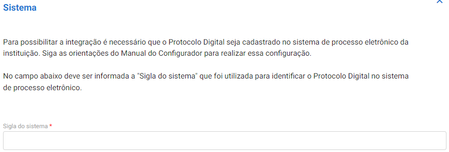

Configuração da Integração no PROTOCOLO.GOV.BR
==============================================

Para realizar as configurações necessárias no Protocolo.GOV.BR, acesse o endereço eletrônico do Sistema que será fornecido pelo Ministério da Economia durante a homologação e siga as etapas apresentadas a seguir. 

.. admonition:: Atenção

   Esta operação é executada por servidor/colaborador com o perfil “Configurador da Integração”. O detentor deste perfil é responsável por configurar, no Protocolo.GOV.BR, os parâmetros necessários à integração com o webservice do SPE. Os procedimentos para solicitar o perfil para os indicados pelo órgão/entidade são informados pela Seges após a capacitação.

Integração com o SPE
--------------------

Na página inicial do Protocolo.GOV.BR, clique no menu “**Processos**” e, em seguida, na opção “**Abrir**”. Selecione, então, a opção “**Protocolo Digital [Configurar Integração]**”. O sistema exibirá um formulário com o título “**Preencher Dados**”.

No campo “**Nome e sigla do Órgão/Entidade**”, informe o nome completo do órgão ou entidade, seguido da sigla, conforme exibido na Figura abaixo, a seguir.

Em seguida, informe o endereço do webservice do SPE no campo “**Endereço do Web Service**”. 

O padrão do webservice do SUPER.GOV.BR é “https://[servidor php]/sei/ws/SeiWS.php” onde o campo [servidor php] representa o domínio do SPE do órgão ou entidade. 

.. figure:: _static/images/figura_7.png 

No campo “Endereço para consulta externa”, informe o endereço do mecanismo de consulta (caso o SPE possua tal ferramenta instalada) por meio do qual os usuários poderão visualizar os processos gerados. Em seguida, cadastre uma orientação sobre como os usuários devem proceder para pesquisar os processos.

.. admonition:: Atenção

   Fica a critério do órgão/entidade decidir qual ferramenta de acompanhamento de processos irá disponibilizar. Alguns exemplos são o Módulo de Pesquisa Pública e o Protocolo Integrado.

No campo “**Sistema**”, informe a sigla do sistema conforme cadastrado no SPE. Para consultar os dados cadastrados, acesse o menu do SPE **Administração > Sistemas > Listar**.

No campo “**Serviço**”, informe a **Identificação** do serviço conforme cadastrado no SPE. Para consultar essa informação, acesse o menu do SPE **Administração > Sistemas > Listar**. Após localizar o sistema clique no ícone “Serviços” do menu de Ações e, em seguida, na opção “**Consultar Serviços**”.

.. figure:: _static/images/figura_10.png  

O campo “**Documentos**” indica a quantidade máxima de documentos permitida para integração do Protocolo.GOV.BR ao SPE e não é editável.

No campo “**Periodicidade de atualização dos dados do SPE**”, defina a periodicidade em que serão atualizados os dados de Unidades, Tipos de processos e Tipos de documentos cadastrados no SPE. Recomenda-se que a atualização ocorra 1 vez ao dia. 

Para finalizar, clique em “**Prosseguir para o Passo 2**” para gravar as informações.

.. figure:: _static/images/figura_11.png  

Por fim, na etapa de revisão, confira todas as informações e clique em “**Finalizar**” para concluir a integração.

Em caso de erro na integração, o sistema apresentará mensagem no início do Formulário. Revise os dados enviados e acione a equipe do Ministério da Economia, em caso de nova tentativa sem sucesso, para orientações.
