Configuração do Formulário de Solicitação
=========================================

Para realizar o cadastro dos tipos de solicitação do Protocolo.GOV.BR a serem disponibilizados aos usuários no Portal GOV.BR, acesse o endereço eletrônico fornecido pelo Ministério da Economia e siga as etapas a seguir. 

.. admonition:: Atenção

   Esta operação é executada por servidor/colaborador com o perfil “Configurador da Solicitação”. O detentor deste perfil é responsável por configurar, no Protocolo.GOV.BR, os parâmetros referentes às solicitações a serem preenchidas pelos usuários para que estes possam remeter documentos ao órgão ou entidade. Os procedimentos para solicitar o perfil para os servidores indicados pelo órgão/entidade são informados pela Seges após a capacitação.

Por se tratar de uma configuração mais extensa, que exige o preenchimento de um número maior de campos, recomenda-se ativar a opção “Mantenha-me conectado” ao fazer login. 

Dados da Solicitação
--------------------

Na página inicial do Protocolo.GOV.BR, clique no menu “**Processos**” e, em seguida, na opção “**Abrir**”. Selecione, então, a opção “**Protocolo Digital [Cadastrar Solicitação]**”. 

Na Seção **Dados da Solicitação**, informe o nome da solicitação. Esse nome ficará visível para os usuários que acessarem o Protocolo.GOV.BR (Por exemplo: “Protocolar documento junto ao Ministério da Economia”).

No campo “**Orientação sobre a solicitação**”, cadastre instruções para o usuário que irá protocolar o documento ou requerimento, como por exemplo, o que é a solicitação e quem pode solicitar.

No campo “**Link de instrução sobre a solicitação**”, é possível incluir um endereço de página na internet onde constem informações ou orientações a respeito da solicitação que está sendo cadastrada.

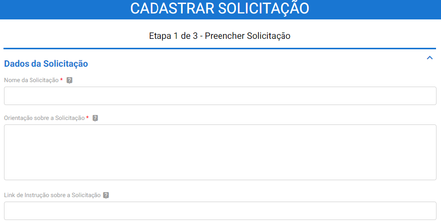
 
Etapa de Triagem
-----------------

Selecione a opção “**Sim**” caso deseje que a solicitação passe por **triagem** do setor de Protocolo do órgão/entidade no Protocolo.GOV.BR, antes de ser integrada ao SPE. Selecione a opção “**Não**” caso deseje que a solicitação seja enviada diretamente para o SPE do órgão ou entidade, sem a necessidade de análise por parte do setor de protocolo. 
 
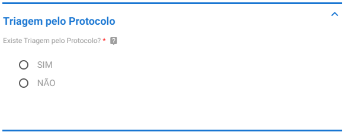

Solicitação Com Triagem
++++++++++++++++++++++++

Caso o campo “**Triagem pelo Protocolo**” seja marcado com a opção “**SIM**”, as solicitações enviadas por meio do Protocolo.GOV.BR serão direcionadas para o ambiente de triagem do Sistema, sendo necessária a análise pelo setor de Protocolo antes do envio ao SPE, cuja equipe deve ser credenciada com o respectivo perfil de acesso. 

Em seguida, é necessário informar se a solicitação poderá ser enviada ao SPE após a análise pelo setor de Protocolo. Marque a opção “SIM” caso deseje permitir o envio ao SPE após a etapa de análise e “**NÃO**” caso não deseje permitir o envio ao SPE.
 

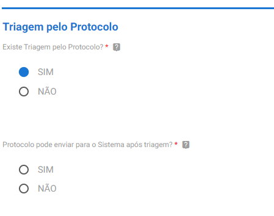

Caso seja marcada a opção “**SIM**”, tanto no campo “**Triagem pelo Protocolo**” quanto para a pergunta “**Protocolo pode enviar para o Sistema após triagem?**”, a equipe de triagem terá disponíveis as opções que permitem o envio da solicitação para o SPE após análise. Esse envio ocorre via integração automática do Protocolo.GOV.BR com o SPE e gera um processo com Número Único de Protocolo (NUP). O **NUP é enviado ao** solicitante por e-mail e será o número de referência para informações sobre o pedido enviado.

Caso seja marcada a opção “**NÃO**” para a pergunta “**Protocolo pode enviar para o Sistema após triagem?**", mesmo tendo Triagem “**SIM**”, a equipe responsável pela triagem terá somente as opções de análise que permitem o envio da resposta diretamente ao solicitante (sem integração com o SPE), que são "Devolver para ajuste ou complementação pelo solicitante" e "Enviar resposta personalizada para o solicitante"

Solicitação Sem Triagem
++++++++++++++++++++++++

Caso o campo “**Triagem pelo Protocolo**” seja marcado com a opção “**NÃO**”, as solicitações enviadas por meio do Protocolo.GOV.BR serão integradas automaticamente para o SPE do órgão/entidade, dispensando a triagem pelo setor de Protocolo no Sistema. 

Em seguida, será necessário responder à pergunta “**Permitir o uso do Módulo de Resposta do SUPER.GOV.BR?**”. 

* Marque a opção “**SIM**” caso deseje que a solicitação permaneça aberta no Protocolo.GOV.BR, aguardando o envio da resposta ao solicitante por meio do Módulo de Resposta do SUPER.GOV.BR instalado no SPE; ou 

* Marque a opção “**Não**”, caso deseje que a solicitação seja concluída e o Módulo de Resposta do SUPER.GOV.BR não seja ativado no SPE. Em ambos os casos os documentos recebidos são enviados para o SPE e o NUP gerado é informado ao solicitante por e-mail
 
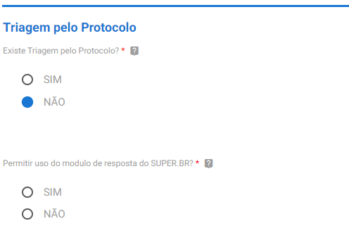

Parâmetros para integração com o SPE
------------------------------------

Após definição da configuração de triagem, o sistema habilitará a configuração dos “**Parâmetros para integração com o SPE**”.

Na etapa de cadastro dos parâmetros para integração com o SPE, primeiramente escolha a “Unidade/Setor” do SPE na qual o processo será criado. 

Em seguida, escolha o “**Tipo de Processo**” que será utilizado para registrar o processo no SPE.

Escolha, então, o “**Tipo de documento do Recibo**”. O recibo de protocolo será o primeiro documento do processo criado no SPE. Também é o comprovante baixado pelo solicitante quando conclui o envio do pedido.

Para finalizar, informe se na solicitação que está sendo cadastrada será permitido ao usuário informar o número de protocolo (NUP) de uma solicitação anterior. 

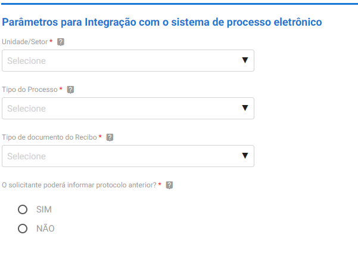
 

Documentação Necessária
------------------------

É necessário configurar pelo menos um documento obrigatório para ser anexado pelo solicitante no formulário de protocolização. Deve-se considerar que, para cada documento considerado obrigatório, o usuário do Protocolo Digital deverá incluir pelo menos um documento. Para configurar, siga as orientações abaixo.

No campo “**Nome do Documento**”, indique o nome do documento que deverá ser incluído pelo solicitante, como por exemplo: Comprovante de Residência. 

Em seguida, no campo “**Orientação sobre o Documento**”, descreva orientações que facilitem o entendimento do solicitante sobre o documento necessário. Caso as orientações já estejam publicadas na internet, é possível incluir o link no campo “**Link de Orientação sobre o Documento**”.

Para a pergunta “**Anexação Obrigatória?**”, informe se o documento é de anexação obrigatória ou não.

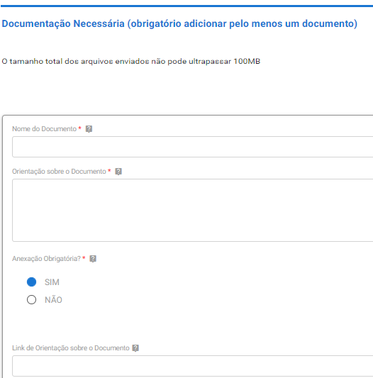
 
No campo “**Extensões de Arquivo Permitidas**”, especifique quais formatos de arquivos poderão ser anexados pelo usuário. As extensões permitidas devem ser separadas por vírgula e serem compatíveis com os formatos aceitos no SPE. 

No campo “**Tamanho Máximo do Anexo (MB)**”, informe o tamanho máximo de arquivo que o solicitante poderá anexar. O tamanho máximo ao qual o campo se refere é para cada arquivo e não para a solicitação. O limite máximo suportado pelo sistema é de 30 MB por anexo e de 100 MB por tipo de solicitação.

No campo “**Ordem Apresentação Documento**”, indique a sequência numérica (1, 2 e assim por diante) em que os documentos serão apresentados no formulário de solicitação. A sequência informada também será a ordem dos documentos na árvore do processo no SPE.

Para finalizar a operação, clique em “**Adicionar Dados na Tabela**”.

Adicione quantos tipos de documentos obrigatórios forem necessários para o tipo de solicitação cadastrada.

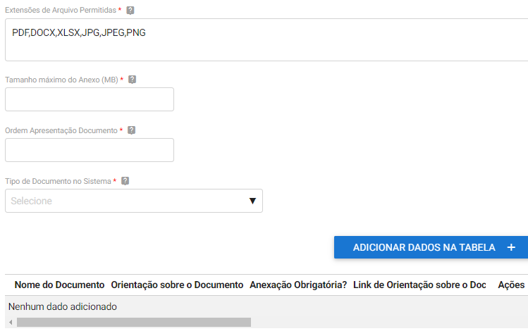
 

Informações Adicionais
----------------------

O sistema permite que seja exigida procuração para as solicitações formuladas por terceiros.

Caso deseje tornar obrigatória a anexação de uma procuração, marque a opção “**SIM**”. Em seguida, escolha o tipo de documento do SPE no qual será gerada a Procuração. 

Caso não deseje permitir a anexação de Procuração pelo usuário, marque a opção “**NÃO**”.

Na pergunta “**Solicitante pode incluir informação complementar?**”, caso opte por habilitar o campo para que solicitante possa incluir informações adicionais no formulário - visível para o atendente da triagem - marque a opção “**SIM**”. Caso seja marcado “**NÃO**” o campo não estará disponível no formulário do solicitante. 
 
.. admonition:: Atenção

   As informações complementares não constituem complemento à solicitação e, portanto, não são integradas ao processo no SPE sendo registradas apenas no Recibo da solicitação, que é baixado pelo solicitante e também compõe o processo gerado no SPE.

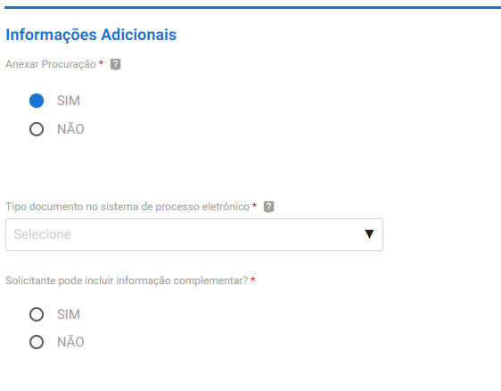
 

Documentos Complementares
-------------------------

É possível, ainda, configurar a inclusão opcional de documentos complementares pelo solicitante. Ou seja, caso o solicitante deseje incluir outros documentos, além dos obrigatórios. 

Para configurar, selecione a opção “**Sim**” no campo “**Documentos Complementares**” e escolha o tipo de documento do SPE no qual o documento complementar será incluído. Em seguida, defina as extensões permitidas e o tamanho máximo do arquivo. 

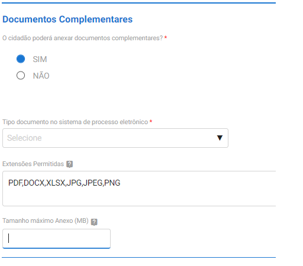
 

Quantidade de anexos por solicitação
------------------------------------

É possível configurar a quantidade máxima em cada tipo de solicitação, no limite de 20 anexos, sendo que o Recibo de Solicitação e a procuração, quando habilitada, são considerados na contagem.

Após indicar a quantidade de anexos definida, clique em “**Prosseguir para o Passo 2**”.
 
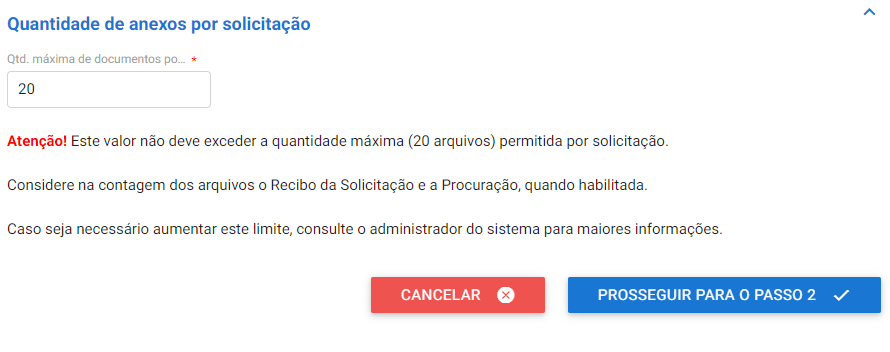

Finalização do cadastro do formulário
-------------------------------------

Após clicar em “**Prosseguir para o Passo 2**”, o sistema exibirá a tela contendo o Passo 2 de 3, “**Resumo da Solicitação**”. No final da página é possível clicar em “**Retornar para o passo 1**”, para corrigir os campos, ou “**Prosseguir para a etapa de finalização**”, para concluir.

Por último, na etapa 3 de 3, clique em “**Finalizar**” ao final da página. A configuração do formulário de protocolização estará concluída, conforme figura abaixo.

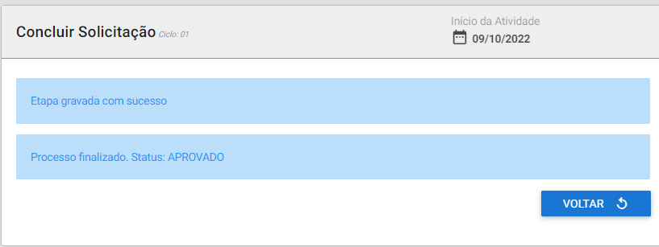
 