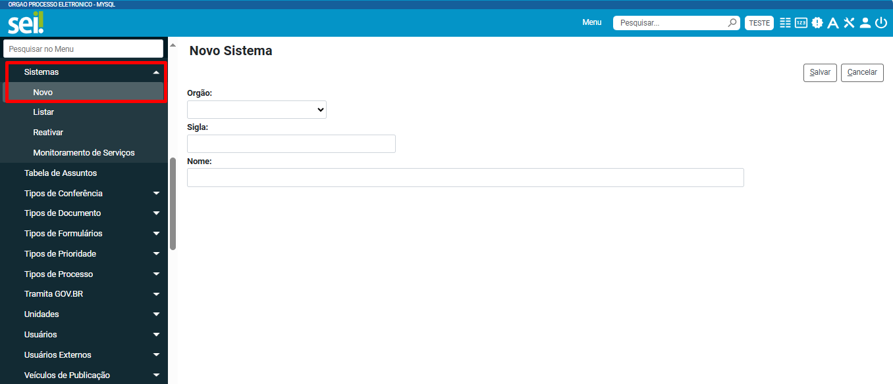
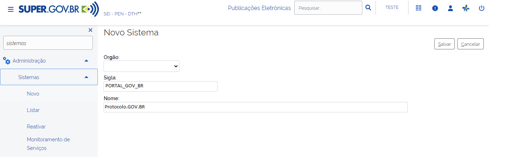
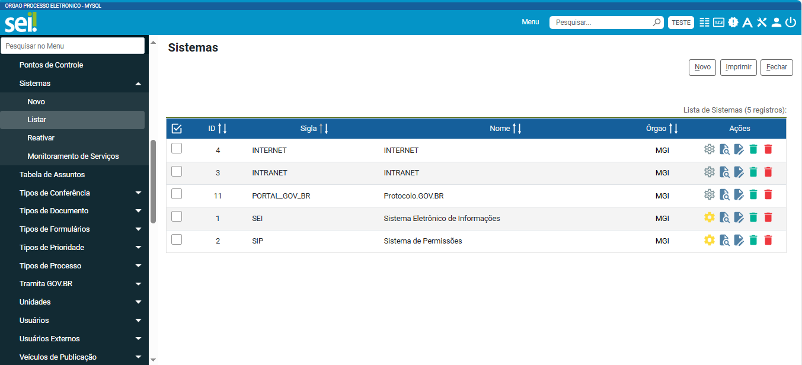
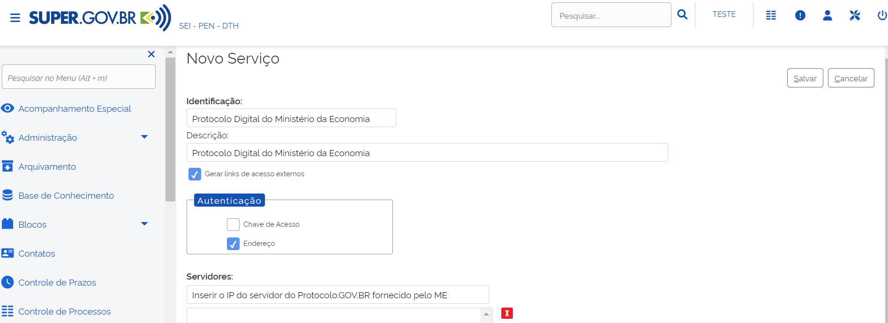
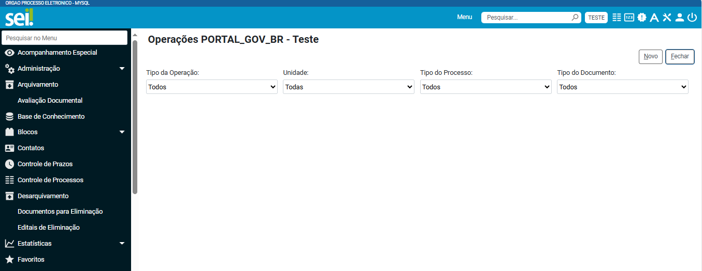

Configuração do Sistema de Processo Administrativo Eletrônico - SPE
===================================================================

A seguir, são apresentadas as etapas de configuração do sistema de processo administrativo eletrônico, doravante denominado SPE, necessárias para sua integração ao Protocolo.GOV.BR.

Cadastro do Sistema
-------------------

Para possibilitar a integração via webservice do Protocolo.GOV.BR com o SPE de seu órgão/entidade, é necessário que o **Administrador do Sistema** inclua o Protocolo.GOV.BR no cadastro de sistemas integrados do SPE, para que as devidas permissões sejam habilitadas. 

.. admonition:: Atenção

   É importante destacar que os procedimentos e exemplos aqui indicados tomam como referência o funcionamento do Sistema Único de Processo Eletrônico em Rede (SEI) versão 1.0 – Base SEI, cabendo aos órgãos e entidades que utilizam outros SPEs desenvolver e documentar a integração ao Protocolo.GOV.BR. 

Em seguida, selecione o **Órgão** (caso utilize instalação multiórgão do SPE), cadastre a **Sigla** e o **Nome** do Sistema, no padrão de texto da Figura 2, abaixo. Para finalizar e gravar as informações, clique em “**Salvar**”.
 

Cadastro do serviço
-------------------

Além do cadastro do Sistema, realizado no campo anterior, é necessário também cadastrar o Serviço para integrar o SPE ao Protocolo.GOV.BR.

No SPE, acesse o menu **Administração > Sistemas > Listar** para localizar o sistema cadastrado na etapa anterior: 
 

Em seguida, clique na opção |servicos| (“Serviços”) do menu de Ações, para visualizar os serviços disponíveis no webservice do SPE. Clique em “**Novo**”, preencha os campos conforme a Figura 4 e ative a opção “Gerar links de acesso externos”. Para finalizar e gravar as informações, clique em “**Salvar**”.

.. |servicos| image:: _static/images/icone_1.png
   :align: middle
   :width: 20

.. admonition:: Atenção

    O IP do servidor será fornecido após a criação do ambiente do Protocolo.GOV.BR do órgão/entidade.

Cadastro das operações
----------------------

No SPE, acesse o menu Administração > Sistemas > Listar. Em seguida, localize o sistema cadastrado no passo `Cadastro do Sistema <https://homolog.manuais.processoeletronico.gov.br/pt-br/homologacao/PROTOCOLO.GOV.BR/MANUAL_TECNICO_OPERACIONAL/CONFIGURACAO_DO_SISTEMA_DE_PROCESSO_ADMINISTRATIVO.html#cadastro-do-sistema>`_ e clique na opção |servicos| (“Serviços”) do menu de Ações, para visualizar os serviços utilizados por esse sistema.

Localize o serviço cadastrado no passo `Cadastro do Serviço <https://homolog.manuais.processoeletronico.gov.br/pt-br/homologacao/PROTOCOLO.GOV.BR/MANUAL_TECNICO_OPERACIONAL/CONFIGURACAO_DO_SISTEMA_DE_PROCESSO_ADMINISTRATIVO.html#cadastro-do-servico>`_ e clique na opção |operacoes| (“Operações”), do menu de Ações, para cadastrar as operações a serem utilizadas pelo Protocolo.GOV.BR. 

.. |operacoes| image:: _static/images/icone_2.png
   :align: middle
   :width: 20

São elas:

* Consultar Documento;
* Consultar Processo;
* Enviar Processo; 
* Gerar Processo; e 
* Incluir Documento.

Para cadastrar as operações, clique em “**Novo**” e preencha os campos conforme a Figura 5, a seguir. Em “Tipo de Operação”, deve ser selecionada a respectiva operação, conforme listado acima. Em “Unidade”, deve ser mantida a opção “Todas” e, em “Tipo de Processo”, a opção “Todos”. A cada nova operação incluída, é necessário clicar em “Salvar” para gravar as informações e repetir a ação.

.. admonition:: Atenção

   Ao se selecionar as operações “Consultar Documento” e “Incluir Documento”, o sistema exibirá um novo campo, denominado “Tipo de Documento” no qual também deve ser selecionada a opção “Todos”.

