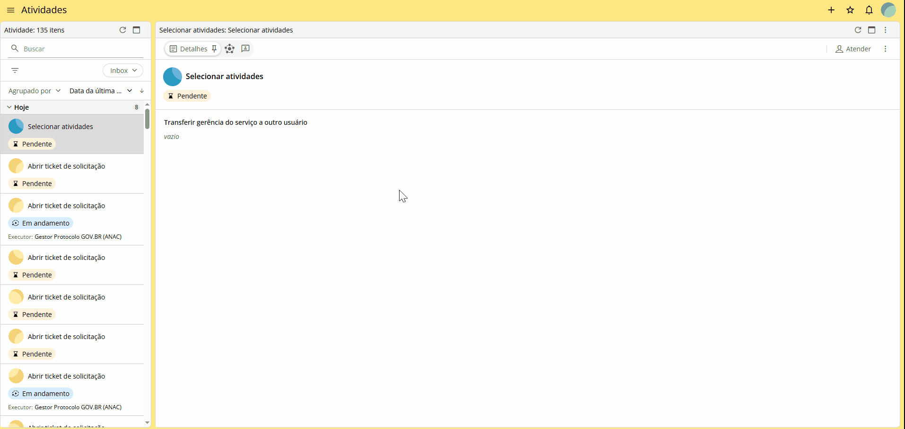

Abrir chamado
=============

Para comunicar erro, paralisação parcial ou total do Protocolo.GOV.BR, orienta-se a abertura de chamado, que poderá ser realizada de duas formas:

**- Na plataforma da Sydle:** 

Clique no ícone |IconeSydle_Menu|, em ”Abrir chamado”, no ícone |IconeSydle_Menu-de-criacao| e na opção ”Solicitar atendimento ao suporte”. 
Depois, clique no card ”Abrir ticket de solicitação“ e no botão |Icone_Atender|. 
Preencha os campos, anexe evidências do problema e clique em |Icone_Check|.

.. |Icone_Atender| image:: _static/images/Icone_Atender.png
   :align: middle
   :width: 30

**- Na plataforma do GOV.BR:**

Registre um chamado no Atendimento gov.br por meio do endereço https://www.gov.br/governodigital/pt-br/acessibilidade-e-usuario/atendimento-gov.br/duvidas-na-plataforma-de-automacao/gestor-do-servico/solicitar-suporte/registrar-um-chamado

.. figure:: _static/images/01_Abrir-Chamado02.gif
