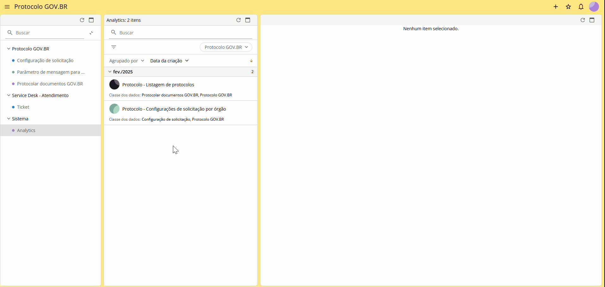
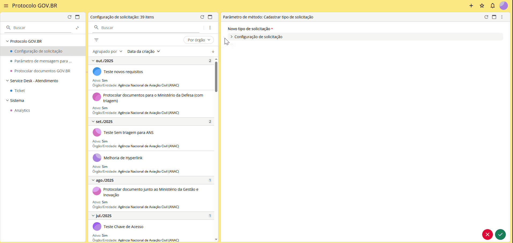

Manual Técnico Operacional do Protocolo GOV.BR para Sydle
=========================================================

Configuração de uma solicitação na Sydle
----------------------------------------  

  
Para realizar as configurações necessárias no Protocolo.GOV.BR, acesse o endereço eletrônico do Sistema Sydle que será fornecido pelo Ministério da Gestão e Inovação (MGI) e siga as etapas apresentadas a seguir.
Atenção.

Esta operação é executada por servidor/colaborador com o perfil “Configurador de Solicitação” no sistema Sydle. O detentor deste perfil é responsável por criar, editar, ativar e inativar as configurações de solicitações do órgão. O órgão deve informar os colaboradores que devem receber o perfil durante o processo de adesão.

Criando uma solicitação
-----------------------

Acesse o endereço https://gestao.servicos.gov.br/app/govBr/login e faça o login via gov.br.

Com o menu lateral Protocolo GOV.BR > Configuração de solicitação selecionado, clique no ícone   da segunda coluna e, em seguida, na opção Cadastrar tipo de solicitação.

 
Na coluna da direita, a tela “Parâmetro de método: Cadastrar tipo de solicitação” será aberta. Clique em “Configuração de solicitação” e preencha/selecione os campos:
  
**Nome:** Aqui, preencha o nome da solicitação, ou seja, como ela aparecerá para o solicitante quando do preenchimento do formulário, por exemplo: “Protocolar documento junto ao Ministério da Gestão e Inovação”;

**Ativo:** Define se a solicitação ficará visível (ativa) ou invisível (inativa) para o solicitante;

**Órgão/Entidade:** Selecione o seu órgão;

**Link de orientação:** Caso haja, inclua um endereço de página na internet onde constem informações ou orientações a respeito da solicitação que está sendo cadastrada.

**Orientação:** Aqui, cadastre instruções para o usuário que irá protocolar o documento ou requerimento, como por exemplo, o que é a solicitação e quem pode solicitar.

**Será realizada triagem pelo Protocolo?** Aqui, defina se será realizada a triagem pelo Protocolo clicando em “Sim” ou “Não”. Caso seja marcado com a opção “Sim”, as solicitações enviadas por meio do Protocolo.GOV.BR serão direcionadas para o ambiente de triagem do Sistema, sendo necessária a análise pelo setor de Protocolo antes do envio ao SPE, cuja equipe deve ser credenciada com o respectivo perfil de acesso.

Se você marcar “Sim”, será exibida a pergunta : “Será permitido envio da solicitação para o SPE?”. Clique em “Sim” ou “Não”;

Se você marcar “Não”, a solicitação será enviada diretamente para o SPE do órgão ou entidade, sem a necessidade de análise por parte do setor de protocolo. Será exibida a pergunta : “Será permitido comunicação via módulo de Resposta? Marque a opção “SIM” caso deseje que a solicitação permaneça aberta no Protocolo.GOV.BR, aguardando o envio da resposta ao solicitante por meio do Módulo de Resposta do SEI instalado no SPE; marque a opção “Não”, caso deseje que a solicitação seja concluída e o Módulo de Resposta do SEI não seja ativado no SPE. Em ambos os casos os documentos recebidos são enviados para o SPE e o NUP gerado é informado ao solicitante por e-mail

Essa combinação de marcações das respostas das perguntas, oferece cinco cenários:
  
- Triagem realizada pelo Protocolo + Permitido envio da solicitação para o SPE;
- Triagem realizada pelo Protocolo + Proibido envio da solicitação para o SPE;
- Triagem não realizada pelo Protocolo + Solicitação Aberta + Módulo Resposta Habilitado;
- Triagem não realizada pelo Protocolo + Solicitação Aberta + Módulo Resposta Não Habilitado;
- Triagem não realizada pelo Protocolo + Solicitação Fechada

Parâmetros para integração com o SPE:
+++++++++++++++++++++++++++++++++++++

**Web Service:** Selecione o web service cadastrado na etapa de criar webervice;

**Unidade:** Selecione a unidade para a qual o processo deverá ser enviado no SPE;

**Tipo de processo:** Selecione o tipo de processo que será criado quando do envio da solicitação ao SPE;

**Tipo de documento no recibo:** Selecione o tipo de documento que será criado para o recibo da solicitação; O recibo de protocolo será o primeiro documento do processo criado no SPE. Também é o comprovante recebido pelo solicitante quando a solicitação é enviada.

**O solicitante poderá informar protocolo anterior?** Clique em **“Sim”** ou **“Não”** para definir se o solicitante poderá informar o número de um processo já existente.

**Link de direcionamento para página de pesquisa de processos:** informe o por meio do qual o solicitante poderá realizar o acompanhamento dos processo gerado.

**Atenção!**

Fica a critério do órgão ou entidade decidir qual ferramenta de acompanhamento de processos irá disponibilizar. Alguns exemplos são o Módulo de Pesquisa Pública e o Protocolo Integrado.

GIF

Documentação obrigatória:
+++++++++++++++++++++++++

Clique no ícone  e inclua os documentos de anexação obrigatória pelo solicitante. Neste campo, você deve cadastrar ao menos um tipo de documento. Informe o link de orientação sobre o documento, se houver, selecione as extensões de arquivo permitidas e informe o tamanho máximo do documento (MB).

Documentação opcional:
++++++++++++++++++++++

Clique no ícone  e inclua os documentos de anexação opcional pelo solicitante. Informe o link de orientação sobre o documento, se houver, selecione as extensões de arquivo permitidas e informe o tamanho máximo do documento (MB).

Em seguida, defina se o solicitante poderá anexar documentos adicionais (de sua escolha) à solicitação. Ou seja, caso ele deseje incluir outros documentos, além dos cadastrados na solicitação.
GIF

Configuração de informações adicionais:
+++++++++++++++++++++++++++++++++++++++

Nesta etapa, é possível definir se o solicitante deverá anexar procuração caso esteja protocolando em nome de terceiros, bem como se o solicitante pode inserir informação adicional que acredite ser pertinente para análise de sua solicitação. Caso opte por habilitar o campo para que solicitante possa incluir informações adicionais no formulário - visível para o atendente da triagem - marque a opção “SIM”. Caso seja marcado “NÃO” o campo não estará disponível no formulário do solicitante.

GIF

Templates de notificações para o cidadão:
+++++++++++++++++++++++++++++++++++++++++

Esta é a última etapa a ser preenchida no cadastro de uma solicitação. Nela estão pré-configuradas mensagens de envio automático ao cidadão em cada etapa do processo: Abertura de solicitação, encerramento de solicitação pelo atendente, resulta e conclusão, solicitação de ajustes e upload para o SPE. As mensagens podem ser personalizadas de acordo com o que for definido pelo órgão.

Clique no ícone   para concluir o cadastro de sua solicitação. Uma mensagem de confirmação será exibida no canto superior direito da tela.

GIF

**Atenção:**

As solicitações cadastradas pelo órgão ficarão visíveis na coluna do meio na tela do colaborador com perfil de configurador de solicitação. Para gerar o link da solicitação, basta clicar nela e, depois, no ícone  .

GIF
