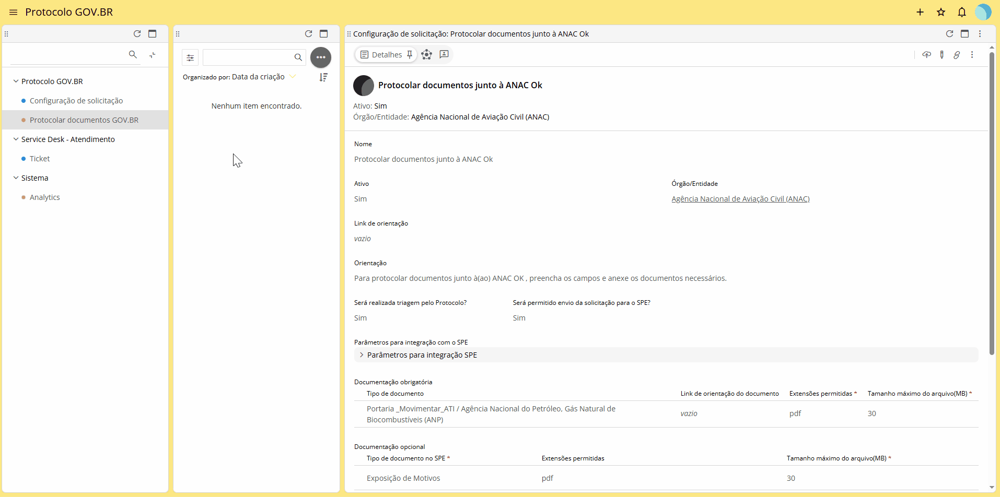
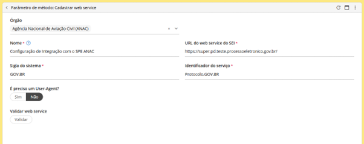
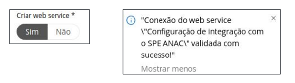

Configuração da Integração do PROTOCOLO.GOV.BR com o SPE
========================================================

Para realizar as configurações necessárias no Protocolo.GOV.BR, acesse o endereço eletrônico do Sistema Sydle que será fornecido pelo Ministério da Gestão e Inovação (MGI) e siga as etapas apresentadas a seguir.

  **Atenção!** 

  Esta operação é executada por servidor/colaborador com o perfil “Configurador de Integração” no sistema Sydle. O detentor deste perfil é responsável por configurar, no Protocolo.GOV.BR, os parâmetros necessários à integração com o webservice do SPE. O órgão deve informar os colaboradores que devem receber o perfil durante o processo de adesão. 

Integração com o SPE
--------------------

Acesse o endereço https://gestao.servicos.gov.br/app/govBr/login e faça o login via gov.br.
Com o menu lateral Protocolo GOV.BR selecionado, clique no ícone |Icone_Mais-Opcoes| da segunda coluna e, em seguida, na opção Cadastrar web service.

.. |Icone_Mais-Opcoes| image:: _static/images/Icone_Mais-Opcoes.png
   :align: middle
   :width: 30

Na coluna da direita, a tela “Parâmetro de método: Cadastrar web service” será aberta. Preencha os campos:

- **Órgão:** Nome do Órgão por extenso/(Sigla); 

- **Nome:** Nome do Órgão por extenso; 

- **URL:** Endereço do webervice do SPE do órgão. O padrão do webservice do SEI é: https://[endereçoseidoórgão]/sei/ws/SeiWS.php , onde o campo [endereçoseidoórgão] representa o domínio do SPE do órgão ou entidade; 

- **Sigla do sistema:** Sigla do sistema criado durante a configuração do SPE. Para consultar os dados cadastrados, acesse o menu do SPE Administração > Sistemas > Listar; 

- **Identificador do serviço:** Nome do serviço cadastrado no SPE ou chave de acesso do serviço. Para consultar o serviço, acesse o menu do SPE Administração > Sistemas > Listar. Após localizar o sistema clique no ícone “Serviços” do menu de Ações e, em seguida, na opção “Consultar Serviços”. Para gerar a chave de acesso, clique no ícone   da coluna ”ações” do serviço cadastrado. 

 
Clique em “Validar webservice” e aguarde a mensagem de validação. Em seguida, clique em “Criar web service”. A conexão será confirmada através de uma mensagem exibida pelo sistema.

