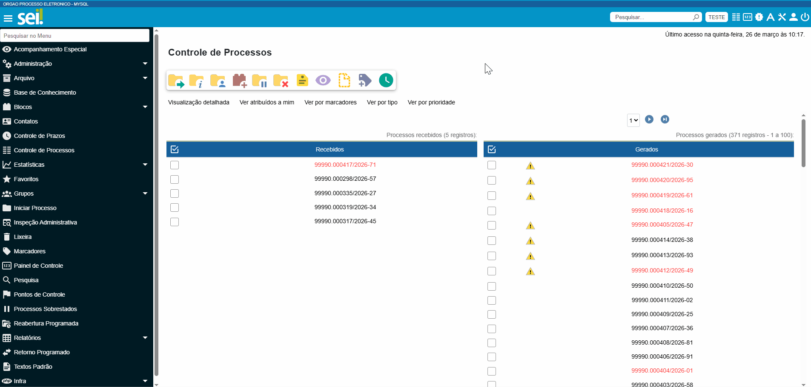
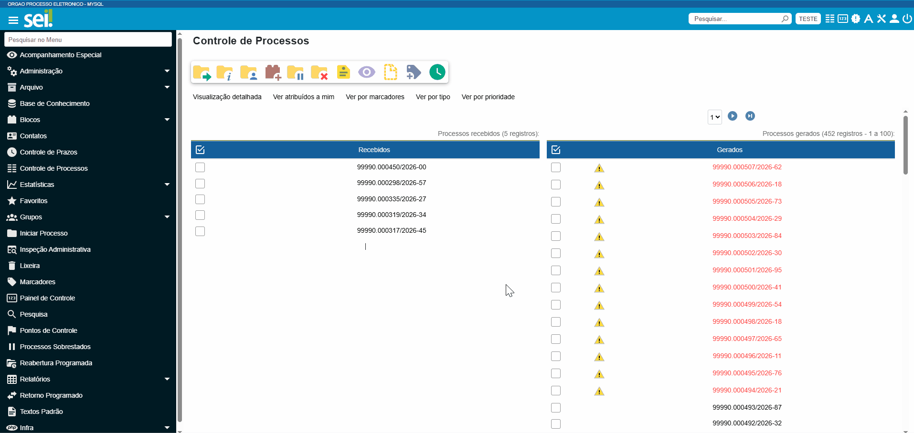
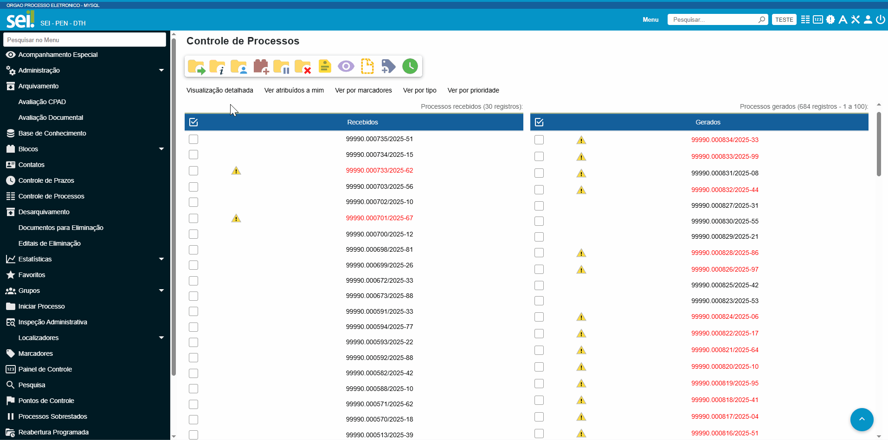

Configuração do Sistema de Processo Administrativo Eletrônico - SPE
-------------------------------------------------------------------

A seguir, são apresentadas as etapas de configuração do sistema de processo administrativo eletrônico, doravante denominado SPE, necessárias para sua integração ao Protocolo.GOV.BR.

Cadastro do Sistema
+++++++++++++++++++
  
Para possibilitar a integração via webservice do Protocolo.GOV.BR com o SPE de seu órgão/entidade, é necessário que o **Administrador do Sistema** inclua o Protocolo.GOV.BR no cadastro de sistemas do SPE, para que as devidas permissões sejam habilitadas.

  **Atenção!**  

  É importante destacar que os procedimentos e exemplos aqui indicados tomam como referência o funcionamento do Sistema Eletrônico de Informações (SEI), cabendo aos órgãos e entidades que utilizam outros SPEs desenvolver e documentar a integração ao Protocolo.GOV.BR.

Acesse o menu Administração > Sistemas > Novo

Selecione o Órgão, cadastre a Sigla e o Nome do Sistema, no padrão de texto do exemplo abaixo (Protocolo.GOV.BR). Para finalizar e gravar as informações, clique em “Salvar”.

Cadastro do serviço
+++++++++++++++++++

Após o cadastro do Sistema é necessário cadastrar o Serviço para integrar o SPE ao Protocolo.GOV.BR.
Acesse o menu Administração > Sistemas > Listar para localizar o sistema cadastrado na etapa anterior.
Clique no ícone   (“Serviços”) da coluna Ações. Clique em “Novo”, preencha os campos e clique em “Salvar”.

Cadastro das operações
++++++++++++++++++++++
  
Acesse o menu Administração > Sistemas > Listar. Em seguida, localize o sistema cadastrado no passo Cadastro do Sistema e clique na opção   (“Serviços”) da coluna ações para visualizar os serviços utilizados por esse sistema.
Localize o serviço cadastrado no passo Cadastro do Serviço e clique na opção  (“Operações”), da coluna de Ações, para cadastrar as operações a serem utilizadas pelo Protocolo.GOV.BR. São elas:

1.	Gerar Processo;

2.	Consultar Processo;

3.	Enviar Processo;

4.	Reabrir Processo;

5.	Concluir Processo;

6.	Incluir Documento;

7.	Adicionar Arquivo;

8.	Adicionar Conteúdo Arquivo;

9.	Consultar Documento;

10.	Listar Extensões de Arquivo Permitidas.

11.	Listar Unidades

Para cadastrar as operações, clique em “Novo” e preencha os campos conforme imagens a seguir. Em “Tipo de Operação”, deve ser selecionada a respectiva operação, conforme listado acima. Em “Unidade”, deve ser mantida a opção “Todas” e, em “Tipo de Processo”, a opção “Todos”. A cada nova operação incluída, é necessário clicar em “Salvar” para gravar as informações e repetir a ação.

.. important:: 

**Atenção!**

Ao se selecionar as operações “Consultar Documento” e “Incluir Documento”, o sistema exibirá um novo campo, denominado “Tipo de Documento” no qual também deve ser selecionada a opção “Todos”.

