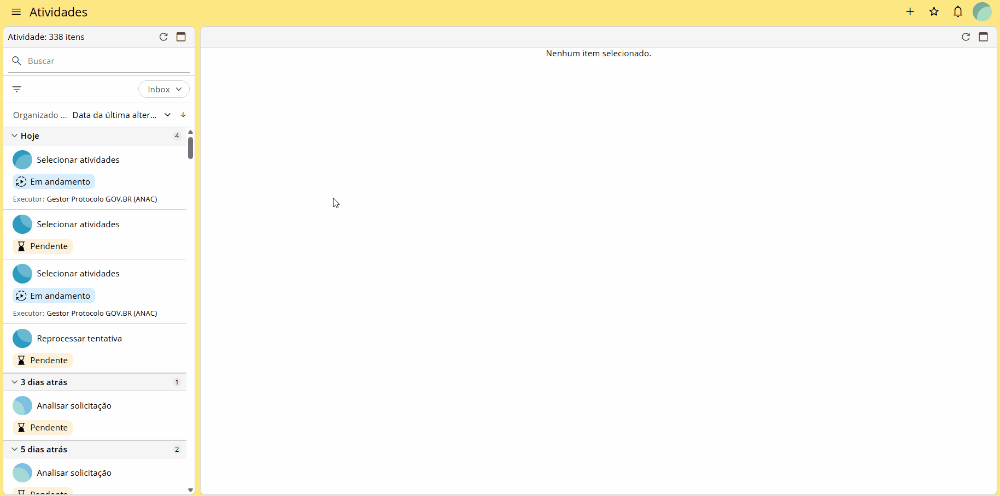
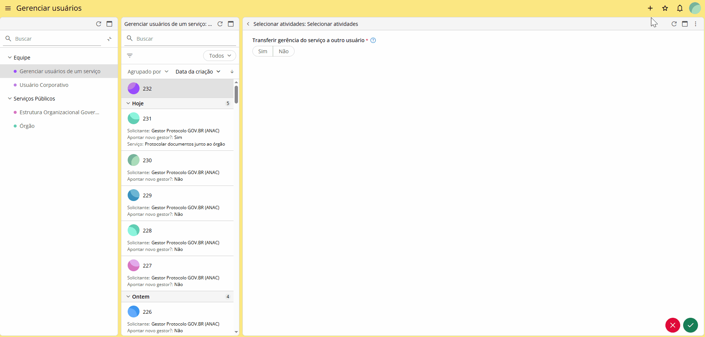
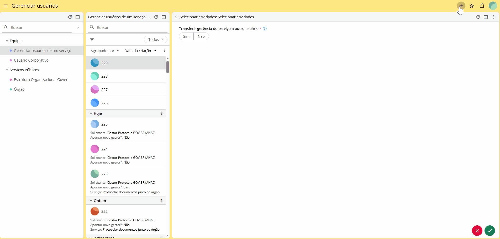
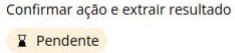
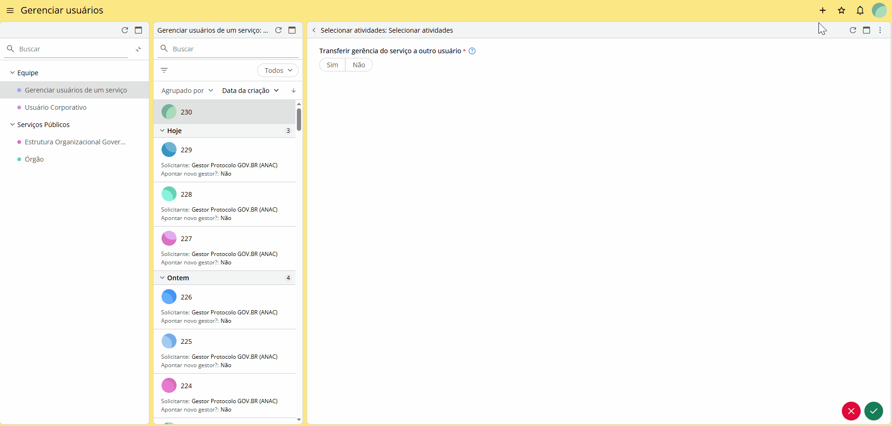
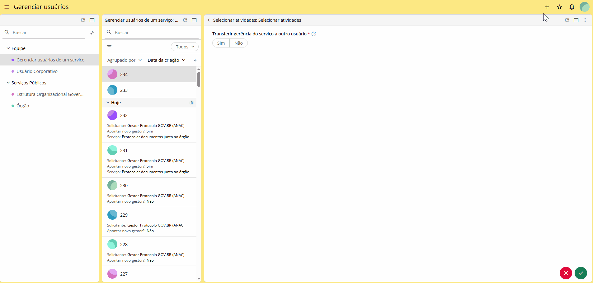
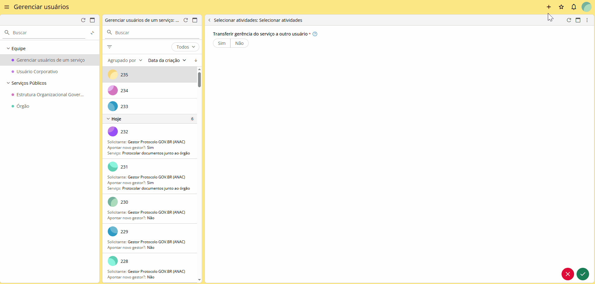

Gerenciamento de usuários
=========================
  
Esta funcionalidade permite que o usuário com perfil de **gestor** do Protocolo GOV.BR faça a gestão dos usuários de sua equipe. Nela, será possível adicionar, alterar informações, inativar e alterar usuários bem como apontar novo usuário para ser gestor da ferramenta.

Para acessar a funcionalidade, clique no ícone |IconeSydle_Menu| localizado no canto superior esquerdo da tela, depois em  |IconeSydle_Gerenciar-Usuarios|. Feito isso, clique no ícone |IconeSydle_Menu-de-criacao| no canto superior direito da tela, depois em |IconeSydle_Gerenciar-Usuarios-de-um-servico|  e, em seguida, no card” Selecionar atividades” e no ícone   |Icone_Atender|. Escolha a opção desejada.

**Transferir gerência do serviço à outro usuário:** Ao clicar em “Sim”, será possível transferir a permissão de gestor para outro usuário do órgão. Selecione os campos, preencha os dados e confirme a ação. 

Ao clicar em “Não”, será habilitado um campo select para as ações de: 

**Adicionar usuários:** Nesta opção, é possível realizar o cadastro de novos usuários. Será possível realizar o cadastro manualmente ou através da importação de planilha. Para cadastro manual, clique no campo “Novos usuários” e preencha os campos conforme orientações abaixo: 

**Nome:** Nome do novo usuário;

**CPF:** Número do CPF;

**E-mail:** E-mail institucional válido. Para o tipo de e-mail, selecionar “Atendimento”;

**Órgão alocado:** Selecionar o órgão ao qual o usuário pertence;

**Atribuições:** Selecionar as atribuições do usuário;

**Cargos em Gestão de OS:** Caso o usuário seja um agente do processo Gestão de OS, selecione nesta coluna a atribuição.

  **Atenção:**
    
  Para adicionar mais de um usuário, basta clicar no ícone |Icone_Adicionar_Usuario|.

.. |Icone_Adicionar_Usuario| image:: _static/images/Icone_Adicionar_Usuario.png
   :align: middle
   :width: 30

Após finalizar o preenchimento, um novo card com status |IconeSydle_Confirmacao_Pendente|  será criado ao lado do card com status  |IconeSydle_Confirmacao_Concluido|. 

Clique no botão |Icone_Atender| e confirme as ações, finalizando o processo.

**Alterar dados dos usuários:** Aqui, é possível alterar/atualizar as informações de um ou mais usuários.
Selecione o usuário e realize as alterações necessárias.

**Inativar usuários:** Opção para inativar o cadastro de um ou mais usuários ativos. Selecione o usuário que deseja inativar o perfil e finalize a ação.

**Ativar usuários:** Opção para ativar um ou mais usuários que estejam inativos. Selecione o usuário que deseja ativar o perfil e finalize a ação.

