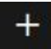
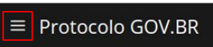
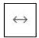

Glossário de ícones
===================

|Icone_menu-de-criacao| **Menu de criação:** Localizado no canto superior direito. Utilizado quando a intenção é criar um novo registro.

|Icone_Listagem-areas-de-trabalho| **Listagem de áreas de trabalho:** Localizado no canto superior esquerdo. Utilizado para trocar a área de trabalho atual.

|Icone_Atualizar-guia| **Atualizar guia:** Localizado no canto superior direito de cada guia. Utilizado para atualizar as informações da guia.

|Icone_Expandir-guia| **Expandir guia:** Localizado no canto superior direito. Utilizado para maximizar a guia escolhida, de forma que somente esta guia ficará visível.

|Icone_Mais-Opcoes| **Mais opções:** Localizado no canto superior direito da coluna do meio. Quando uma funcionalidade é feita especificamente para um serviço ela estará localizada aqui.

.. |Icone_Mais-Opcoes| image:: _static/images/Icone_Mais-Opcoes.png
   :align: middle
   :width: 30

|Icone_Atender| **Atender:** Localizado no canto superior direito da guia da direita. Utilizado para atender uma atividade que está pendente ou em atendimento.

|Icone_Transferir| **Transferir:** Localizado no canto superior direito da guia da direita. Utilizado para transferir a atividade selecionada para que outro atendente possa atendê-la.

|Icone_Devolver| **Devolver:** Localizado no canto superior direito da guia da direita dentro de uma atividade. Utilizado para retornar uma atividade que foi atendida para o estado de pendente.

|Icone_Ver-no-fluxo| **Ver no fluxo:** Localizado no canto superior direito da guia da direita. Utilizado para visualizar o fluxo inteiro do processo selecionado e o que foi executado nele até o momento atual.

|Icone_Ativar-Inativar-config-solicitacao| **Ativar/Inativar configuração de solicitação:** Localizado no canto superior direito da guia da direita. Utilizado para ativar ou inativar a configuração de solicitação selecionada. Disponível apenas para colaboradores com perfil  configurador de solicitação.

|Icone_Editar| **Editar:** Localizado no canto superior direito da guia da direita. Utilizado para editar as informações da configuração de solicitação selecionada. Disponível apenas para colaboradores com perfil de configurador de solicitação.

