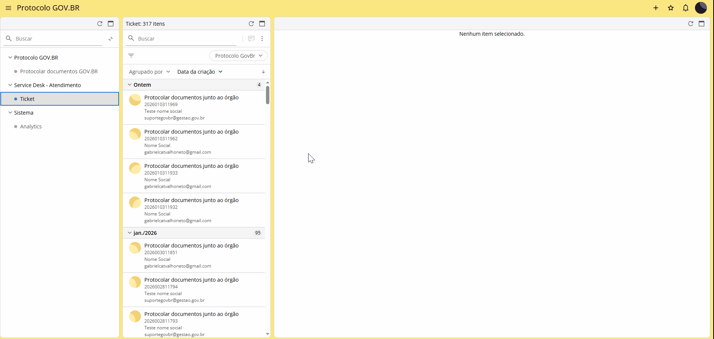
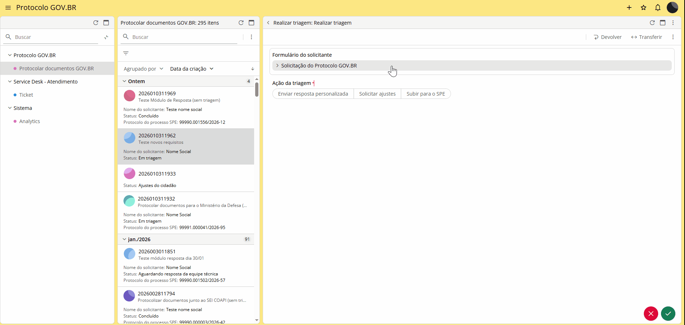
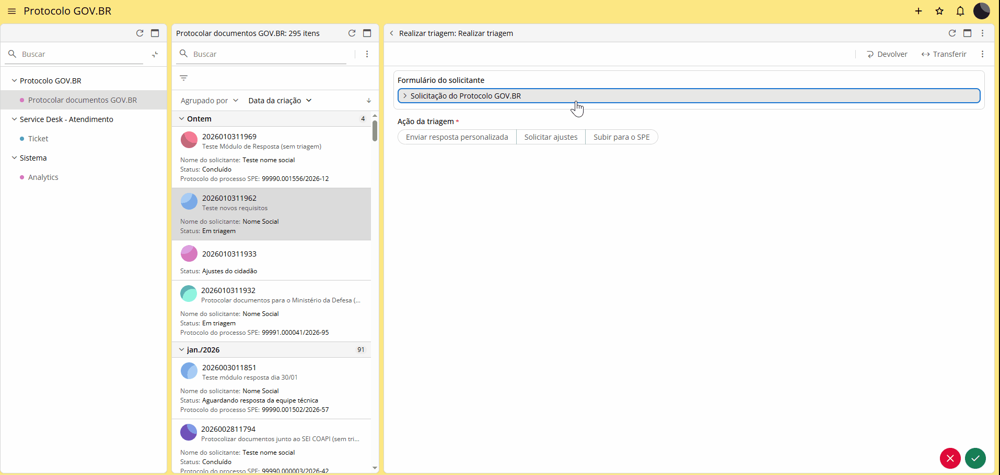
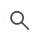
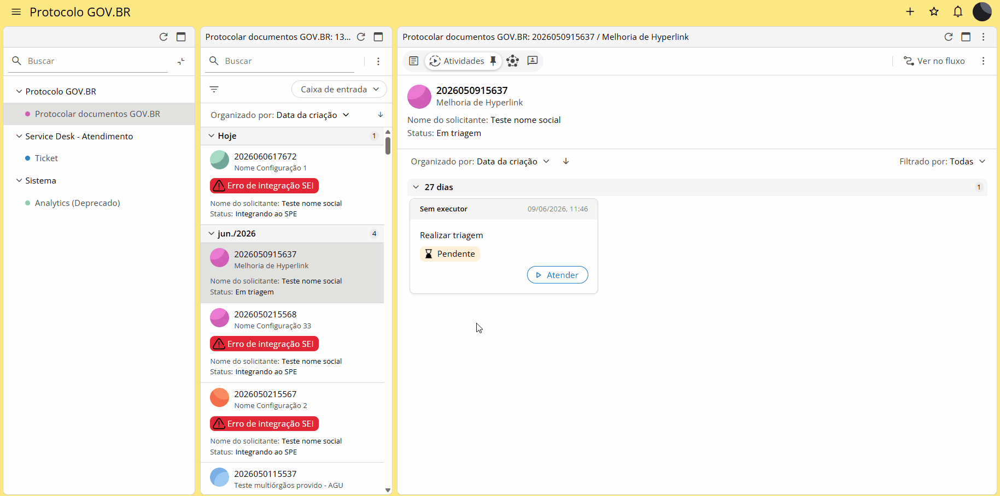
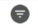
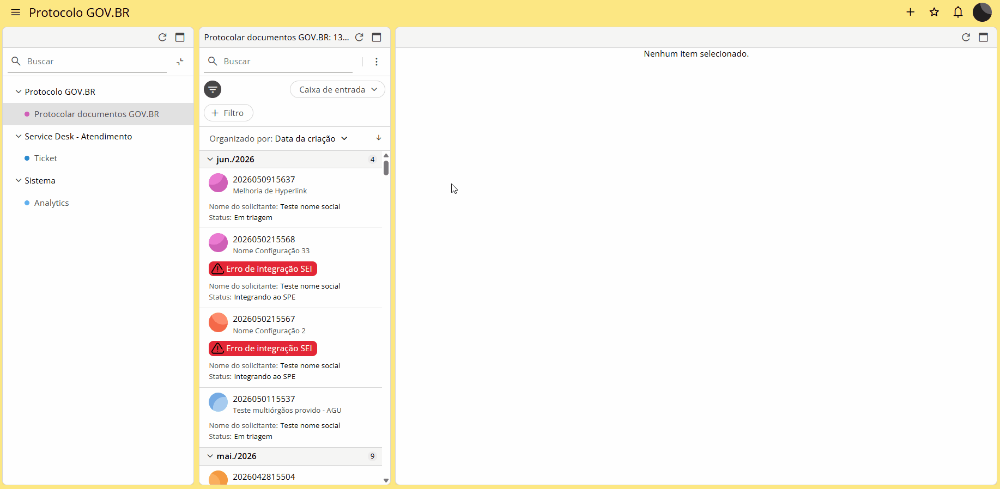
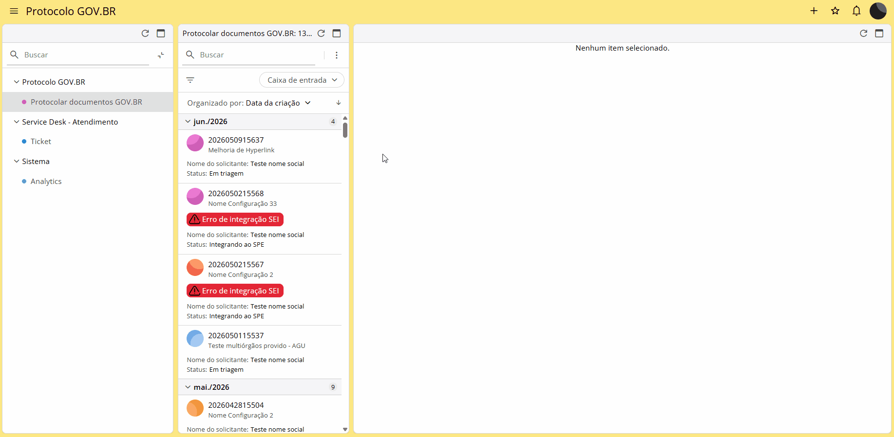

Triagem pela equipe de Protocolo
================================
  
Acesse o endereço https://gestao.servicos.gov.br/app/govBr/login e faça o login via gov.br.

Com o menu lateral esquerdo Protocolo GOV.BR > Protocolar documentos Gov.Br selecionado, será possível visualizar, na coluna do meio, o card com as solicitações recebidas.

Ao selecionar a solicitação desejada, a coluna da direita exibirá as informações da solicitação. As atividades são sinalizadas em cards da seguinte forma: 

- **Pendente**: Atividades pendentes de triagem;

- **Em andamento**: Atividades que foram iniciadas e não foram finalizadas;

- **Concluído**: Solicitação encerrada 

Para realizar a triagem, clique no botão de "Atender" |Icone_Atender|

.. |Icone_Atender| image:: _static/images/Icone_Atender.png
   :align: middle
   :width: 30

O formulário do solicitante será aberto. Nele é possível visualizar todas as informações da solicitação, como dados do solicitante e documentos anexados. Também serão exibidas as opções de ações a serem tomadas pelo atendente:

**Enviar resposta personalizada:** Quando o atendente decide finalizar a solicitação do requerente. O cidadão receberá um comunicado informando a ação. Nesta opção será possível anexar documento com o resultado da análise para o cidadão. Esta ação conclui a solicitação;

**Solicitar ajustes:** Quando o atendente solicita ajustes na solicitação aberta pelo requerente. Deve ser enviado ao solicitante um comunicado orientando o que deve ser alterado; A atividade ficará com o status de Pendente até a realização do ajuste solicitado pelo cidadão;  

**Subir para o SPE:** Essa opção envia a solicitação para o SPE. Aqui, o atendente tem a possibilidade de informar um NUP já existente para envio dos anexos da solicitação bem como de manter a solicitação aberta ou fechada. Se a solicitação for mantida aberta, será possível utilizar o módulo Resposta. 
Ao enviar a solicitação para o SPE é gerado um processo com Número Único de Protocolo (NUP). O NUP é enviado ao solicitante por e-mail e será o número de referência para informações sobre o processo criado.

**Ferramenta "Buscar"** |Icone_Triagem_pela_equipe_Buscar|

Na segunda coluna da tela do atendente, é possível realizar pesquisa a partir de informações básicas, como: número da solicitação, número do processo gerado no SPE, data, tipo de solicitação, nome do solicitante e nome do atendente.

Uso de filtros
^^^^^^^^^^^^^^

Esta funcionalidade está disponível na coluna do meio da tela do atendente. Para utilizá-la, clique no ícone |Icone_Filtro| e defina a melhor combinação.

**Tags de filtros**

Esta funcionalidade permite que o atendente filtre as solicitações que deseja visualizar através da seleção do status: 

**Todas:** Exibe todo o histórico de solicitações; 

**Caixa de Entrada:** Exibe as solicitações que pendentes de ação ou análise do atendente; 

**Em Aberto:** Exibe as solicitações ainda em andamento (não concluídas/não canceladas); 

**Aguardando Triagem:** Exibe as solicitações pendentes de triagem; 

**Aguardando resposta da equipe técnica:** Exibe as solicitações abertas que aguardam resposta da equipe técnica; 

**Em Ajustes:** Exibe as solicitações pendentes de ajustes por parte do solicitante; 

**Concluídas:** Exibe todas as solicitações finalizadas; 

**Canceladas pelo Cidadão:** Exibe as solicitações canceladas pelo cidadão. 

**Erro de Integração:** Lista as solicitações que apresentaram erro de integração com o SPE. 

**Atenção!**
  
O campo buscas salvas permite que o atendente visualize as seguintes opções:

- Solicitações aguardando triagem;

- Solicitações devolvidas para ajustes;

- Solicitações por período; e

- Solicitações triadas e enviadas para o SPE.

 
