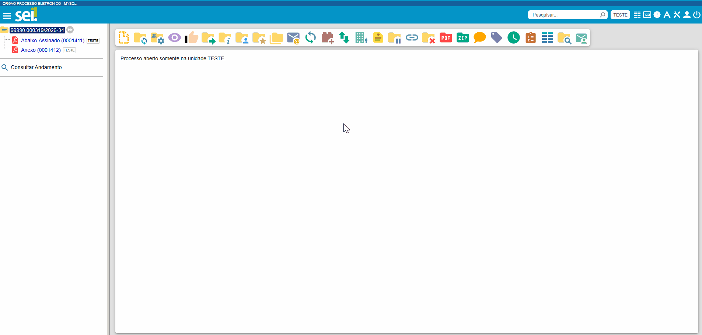
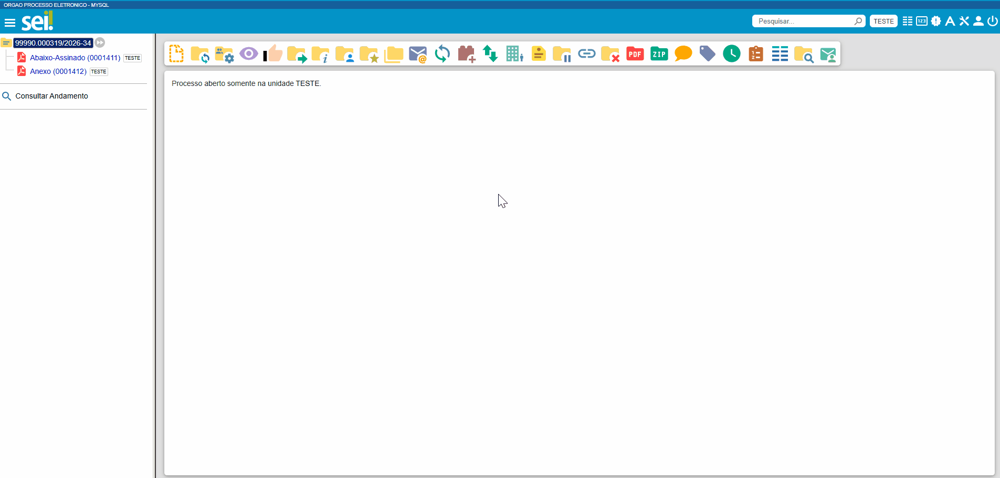

Utilizando o Módulo Resposta
============================

  
Com a utilização do Módulo Resposta, a equipe técnica (área responsável pela análise e providências da solicitação) poderá entrar em contato direto com o cidadão, sem necessidade de mediação da equipe de Protocolo, o que torna o processo mais célere. 

O módulo permite à equipe técnica: 

-	**Solicitar ajustes ou complementação à solicitação:** Deverá ser escrita uma mensagem na tela e selecionada a opção **“Solicitação de ajustes ou complementação”**. O solicitante será notificado via e-mail e a solicitação permanecerá aberta na Sydle. A seleção de anexo para envio ao cidadão é opcional;

-	**Informar o Resultado da análise da solicitação:** Deverá ser escrita uma mensagem na tela e selecionada a opção **“Resultado”**. O solicitante será notificado via e-mail e a solicitação será encerrada na Sydle. Neste caso, a seleção de ao menos um anexo para envio ao cidadão é obrigatória. 
 

..

  **Atenção:**

  -	Para acessar o resultado, o cidadão deverá obrigatoriamente, via Protocolo GOV.BR, aceitar o termo de ciência exibido. Este termo será automaticamente incluído no processo no SPE como comprovação do aceite do cidadão. 
