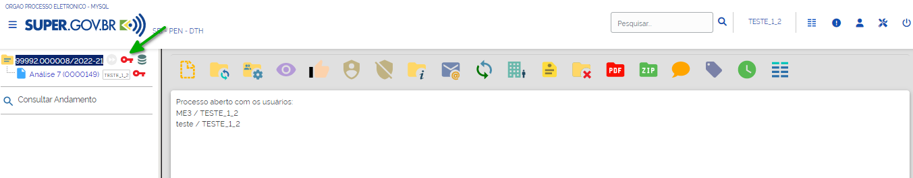
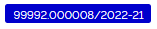
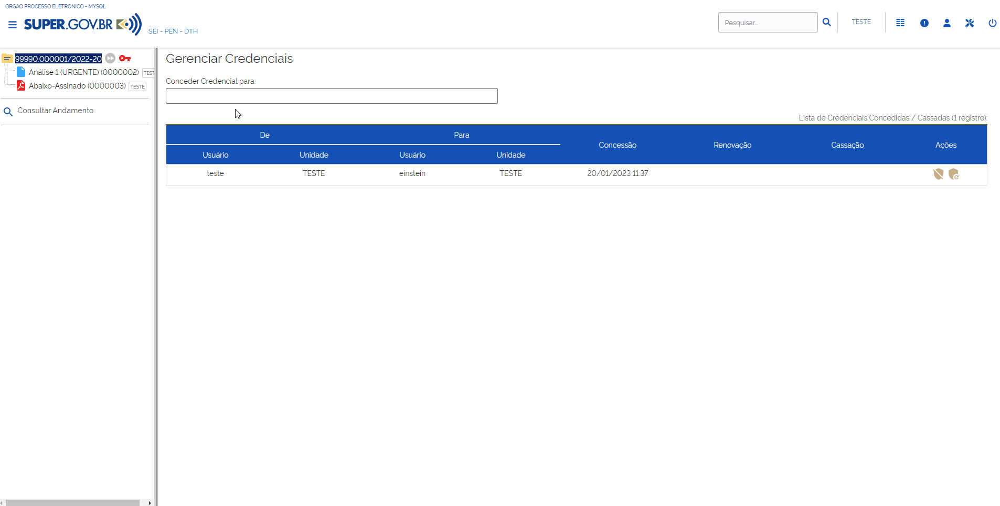
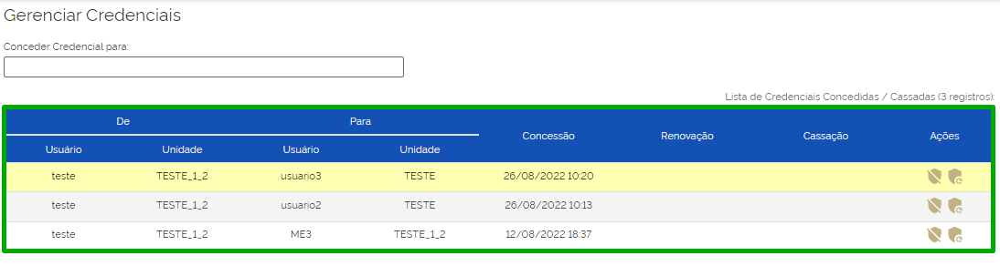
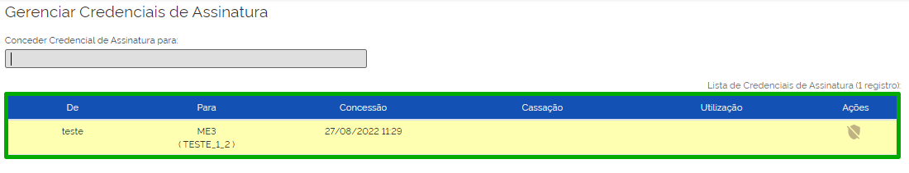
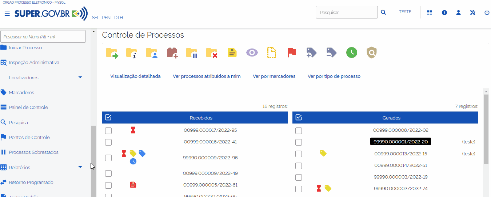

Restrição de Acesso
===================

Processos Restritos
+++++++++++++++++++

Os processos restritos são acessíveis somente aos usuários das unidades pelas quais tramitaram. 

Processos e documentos restritos são indicados por meio do ícone “**Acesso Restrito**” |acesso_restrito|, existente ao lado do processo ou documento. 

.. |acesso_restrito| image:: _static/images/8RA-icone_acesso_restrito.png
   :align: middle
   :width: 35

.. figure:: _static/images/8RA-tela_acesso_restrito.png

Processos e documentos restritos poderão ser localizados pela “**Pesquisa Rápida**” nas unidades em que o processo não tenha tramitado. Entretanto, essas unidades não terão acesso ao conteúdo dos documentos, conseguirão apenas visualizar a “**Árvore do Processo**” e utilizar a funcionalidade “**Consultar Andamento**”.

Processos sigilosos
+++++++++++++++++++

Diferentemente dos processos públicos e restritos, os Processos Sigilosos não têm trâmite unidade a unidade. O acesso a esses processos é disponibilizado a usuários específicos que devam atuar no processo, mediante concessão de Credencial de Acesso ou Credencial de Assinatura, conforme o caso.

Todas as vezes que o usuário for acessar o processo sigiloso, será solicitada a Identificação de Acesso, com necessidade de informação de senha.

Processos e documentos sigilosos são indicados por meio do ícone “Acesso Sigiloso” |acesso_sigiloso|, existente ao lado do processo ou documento.

Na tela Controle de Processos, os processos sigilosos são identificados por meio de tarja sobre seu número. Essa tarja pode.

* ser vermelha |numeracao_vermelha|, se o processo ainda não foi acessado;
* ser preta |numeracao_preta|, se o processo já foi acessado alguma vez; ou
* ser azul |numeracao_azul|, se o processo foi acessado na sessão atual.

.. |numeracao_vermelha| image:: _static/images/8RA-icone_numero_vermelho.png
   :align: middle
   :width: 100

.. |numeracao_preta| image:: _static/images/8RA-icone_numero_preto.png
   :align: middle
   :width: 150

.. admonition:: Nota

   Somente os usuários com Credencial de Acesso visualizam o processo sigiloso, caso este não esteja concluído, na tela Controle de Processos.

Acessando Processo Sigiloso
-----------------------------------

Ao selecionar um processo sigiloso para acesso, o sistema abrirá automaticamente a janela Identificação de Acesso. O usuário deverá preencher o campo “**Senha**” e, em seguida, clicar no “**Enter**” ou no botão “**Acessar**”.

.. figure:: _static/images/8RA-tela_identificação_de_acesso.gif

Concedendo, Cassando ou Renovando Credencial de Acesso
---------------------------------------------------------

O usuário que iniciar o processo sigiloso é o responsável por conceder a Credencial de Acesso ao(s) usuário(s) que tiver(em) que atuar no processo.

Para isso, o usuário que iniciou o processo deverá acessar o processo e, em seguida, clicar no ícone “**Gerenciar Credenciais de Acesso**” |gerenciar_credencial|.

.. figure:: _static/images/8RA-tela_gerenciar_credencial.gif

Na tela “**Gerenciar Credenciais**”, preencher o campo “**Conceder Credencial para**” com nome do usuário que deseja conceder o acesso ao processo. Por fim, clicar no botão “**Conceder**”.

Na tela “**Gerenciar Credenciais**”, será exibida a Lista de Credenciais Concedidas/Cassadas e as seguintes informações e ações relacionadas a estas:
 
* usuário que as concedeu e sua unidade; 
* usuário que as recebeu e sua unidade; 
* data e hora da concessão; e
* data e hora da renovação e cassação, se for o caso.
* Ações:
  * **Cassar Credencial de Acesso** |cassar_credencial| - é utilizada quando se deseja retirar a Credencial de Acesso de determinado usuário. A data e hora da cassação serão exibidas na coluna Cassação.
  * **Renovar Credencial de Acesso** |renovar_credencial|- é utilizada quando se deseja renovar a Credencial de Acesso de determinado usuário. A data e hora da renovação serão exibidas na coluna Renovação da Lista de Credenciais Concedidas/Cassadas.

.. admonition:: Notas

   1. O usuário que receber uma “**Credencial de Acesso**” poderá conceder “**Credencial de Acesso**” a outros usuários. Após realizar as ações necessárias no processo, terá possibilidade de:

     a) Renunciar à Credencial, caso não precise mais ter acesso ao processo. 

     b) Concluir o processo, caso necessite permanecer com o acesso para atuação posterior.

   2. Quando se utiliza a funcionalidade “**Renovar Credencial de Acesso**” |renovar_credencial| em um processo sigiloso que foi concluído, ele será automaticamente reaberto e aparecerá no topo da tela “Controle de Processos”.

   
   3. Não é possível renovar uma “**Credencial de Acesso**” que foi cassada. Nesse caso, será necessário conceder uma nova “**Credencial de Acesso**” ao usuário.

   4. O usuário não conseguirá renunciar à “**Credencial de Acesso**” caso seja o único com acesso ao processo. Nesse caso, o sistema exibirá uma mensagem com essa informação.

   5. O processo sigiloso pode ser concluído sem que o usuário renuncie à “**Credencial de Acesso**”. Nessa situação, o usuário conseguirá localizar processo sigiloso e acessá-lo pela “**Pesquisa**”. Se desejar, poderá reabrir o processo sigiloso.

Consultando os Processos com Credencial de Acesso na Unidade
--------------------------------------------------------------

Cada usuário poderá consultar, em determinada unidade, os processos nos quais tem “**Credencial de Acesso**” para atuar. Para isso, basta clicar no ícone “**Processos com Credencial de Acesso nesta Unidade**” |processos_credencial| , disponível na tela “Controle de Processos”.

.. figure:: _static/images/8RA-tela_processos_credencial.gif

Em seguida, preencher o campo “**Senha**” e clicar em “**Enter**” ou no botão “**Acessar**”, existentes na janela “**Identificação de Acesso**”.

.. figure:: _static/images/8RA-tela_identificação_de_acesso.gif

Será aberta a tela “**Processos com Credencial na Unidade**”. Nela, serão exibidos todos os processos sigilosos em que o usuário possui “**Credencial de Acesso**”. Eles serão listados por número, data de autuação, tipo e as observações da Unidade referentes a cada processo. Para acessar um processo, clique sobre seu número.

.. figure:: _static/images/8RA-tela_processos_credencial_na_unidade.png

Ainda na tela “**Processos com Credencial na Unidade**” será possível pesquisar por processos sigilosos da Unidade ou transferir a credencial de acesso.

* Botão “**Pesquisar**”: permite ao usuário a pesquisa de processos sigilosos da Unidade que o usuário tem acesso. Os seguintes campos poderão ser utilizados como filtros de pesquisa:

  * Número do Processo; 
  * Tipo do Processo;
  * Interessado; 
  * Observações desta Unidade; e 
  * Período de Autuação.

.. figure:: _static/images/8RA-tela_processos_credencial_na_unidade_pesquisa.gif

* Botão “**Transferir**”: permite ao usuário fazer a transferência de credencial na Unidade. Para realizar a transferência de credencial, selecionar o(s) processo(s) que deseja transferir e clicar em “**Transferir**”. Na tela Seguinte, indicar o nome do usuário destinatário e clicar em “**Salvar**”.

.. admonition:: Nota

   Essa ação não cancelará a Credencial de Acesso do usuário que fez a transferência.

.. figure:: _static/images/8RA-tela_processos_credencial_na_unidade_transferencia.gif

Concedendo ou Cassando Credencial de Assinatura
------------------------------------------------

A funcionalidade “**Credencial de Assinatura**” possibilita que outro usuário assine ou edite documento sigiloso.

Para conceder uma “**Credencial de Assinatura**”, o usuário deverá acessar o processo sigiloso, selecionar o documento que deverá ser assinado ou editado e clicar no ícone “**Gerenciar Credenciais de Assinatura**” |gerenciar_credencial_assinatura|.

.. figure:: _static/images/8RA-tela_gerenciar_credencial_assinatura.gif

Na tela seguinte, preencher o campo “**Conceder Credencial de Assinatura para**” com o nome do usuário que receberá a Credencial e clicar no botão “**Conceder**”.

.. figure:: _static/images/8RA-tela_gerenciar_credencial_assinatura_conceder.png

Ao conceder o acesso, será exibida a “**Lista de Credenciais de Assinatura**”. Nela, encontram-se as seguintes informações sobre as Credenciais de Assinatura concedidas, como: 

* usuário que as concedeu; 
* usuário que as recebeu e respectiva unidade; 
* data e hora da concessão; 
* data e hora da cassação e da utilização, se for o caso.

Também será possível nessa tela a cassar uma credencial por meio do ícone “**Cassar Credencial de Assinatura**” |cassar_credencial|.

O usuário que receber uma Credencial de Assinatura visualizará o ícone “**Documento com Credencial de Assinatura**” |cassar_credencial| ao lado do número do processo, na tela Controle de Processos, e ao lado do número do documento, na Árvore do Processo.

Para editar ou assinar um documento com “Credencial de Assinatura”, após acessar o processo, selecione o documento na Árvore do Processo e, em seguida, o usuário deverá clicar no ícone “**Editar Conteúdo**” |editar_conteudo| ou “**Assinar Documento**” |assinatura_preta|.

.. admonition:: Notas

   1. Ao receber uma credencial de assinatura em um documento sigiloso, o usuário passará a ter acesso ao conteúdo do processo.

   2. A credencial de assinatura concedida e, posteriormente, cassada continuará constando na “**Lista de Credenciais de Assinatura**”.

   3. A cassação da credencial de assinatura não retira a credencial de acesso ao processo adquirida pelo usuário quando recebeu a credencial para assinatura ou edição do documento sigiloso. Para retirar a credencial de acesso desse usuário, será necessário selecionar o processo, clicar no ícone “**Gerenciar Credenciais de Acesso**” |gerenciar_credencial|, disponível na Barra de Ícones do processo, e cassar a credencial de acesso do usuário, por meio do ícone “**Cassar Credencial de Acesso**” |cassar_credencial|.

   4. Não é possível cassar credencial de acesso concedida ao mesmo usuário em outra unidade. Nesse caso, será necessário que o usuário renuncie à Credencial de Acesso naquela unidade.

Gerenciamento dos Processos Sigilosos na Unidade
-------------------------------------------------

É possível gerenciar os processos sigilosos gerados e recebidos na unidade, ainda que não possuam Credencial de Acesso ativa no momento, por meio do relatório “**Acervo de Processos Sigilosos na Unidade**”, disponível no menu “**Relatórios**” do menu principal. 

.. admonition:: Nota

   Nem todos os usuários têm acesso a esse relatório. Para acessá-lo, é necessário solicitar ao “**Administrador do Sistema**” o perfil “**Acervo de Sigilosos da Unidade**”.

Na janela “**Identificação do Acesso**”, inserir a senha e clicar em “**Enter**” ou no botão “**Acessar**”.

.. figure:: _static/images/8RA-tela_gerenciar_sigilosos_relatorio_credenciais.png

Em seguida, será aberta a tela “**Acervo de Processos Sigilosos da Unidade**”. Nela, serão listados os processos sigilosos gerados e recebidos na unidade, com as seguintes informações: 

* Processo;
* Data de Autuação; 
* Tipo;
* Observações da unidade;
* Acompanhamento Especial (Data, Usuário, Grupo, Observações);
* Credenciais na unidade; e
* Ações

  * Ativar Credencial na Unidade |ativar_credencial|
  * Cancelar Credenciais Inativas na Unidade |cassar_credencial|

.. |ativar_credencial| image:: _static/images/8RA-icone_ativar_credenciais.png
   :align: middle
   :width: 30

Na coluna “**Credenciais na Unidade**” são identificadas as Credenciais ativas, as Credenciais inativas (sem permissão na unidade) e as Credenciais finalizadas (renúncia/cassação/anulação/cancelamento), conforme as cores da legenda apresentada na tela.

.. figure:: _static/images/8RA-tela_acervo_sigilosos.png

Além disso, será possível que o usuário gere uma planilha com os dados presentes na lista, a partir de processos selecionados, por meio de clique no botão “**Gerar Planilha**” ou realizar uma pesquisa dos processos sigilosos da unidade, com o auxílio dos campos de filtro presentes em tela, por meio de clique no botão “**Pesquisar**”.

.. figure:: _static/images/8RA-tela_acervo_sigilosos_opcoes.png

.. admonition:: Notas

   1. As ações relacionadas à credencial de acesso e à credencial de assinatura ficam registradas no “**Histórico**” do processo sigiloso, o qual poderá ser acessado por meio da funcionalidade “**Consultar Andamento**”.

   2. O botão “**Ativar Credencial**” e o botão “**Cancelar Credencial Inativa**” possibilitam, respectivamente, a ativação e o cancelamento de credencial de vários processos de uma só vez para um mesmo usuário na unidade.

