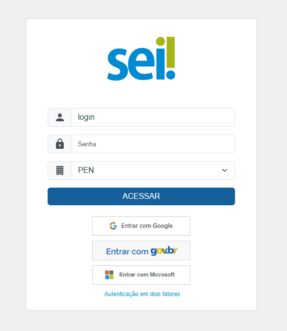
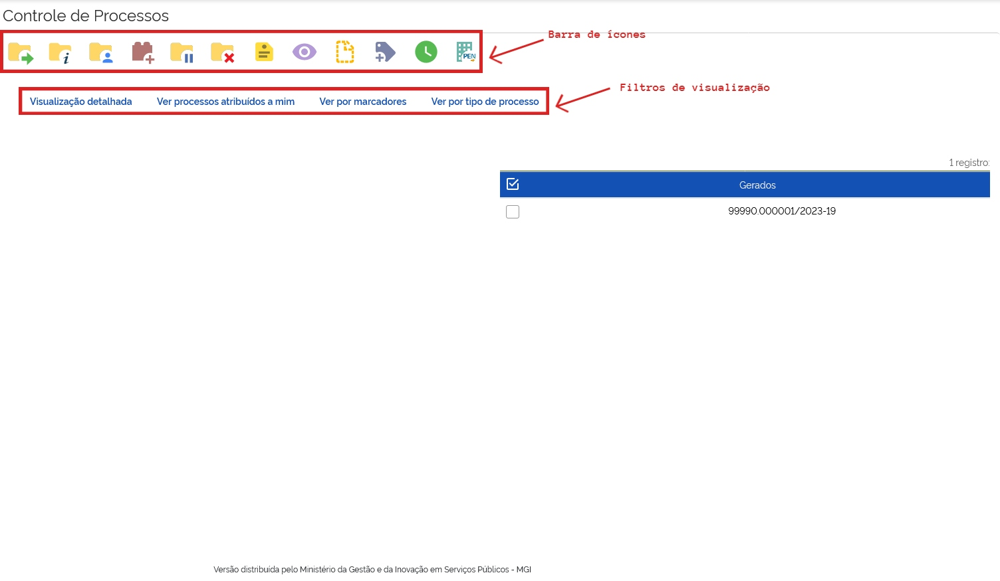
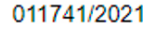
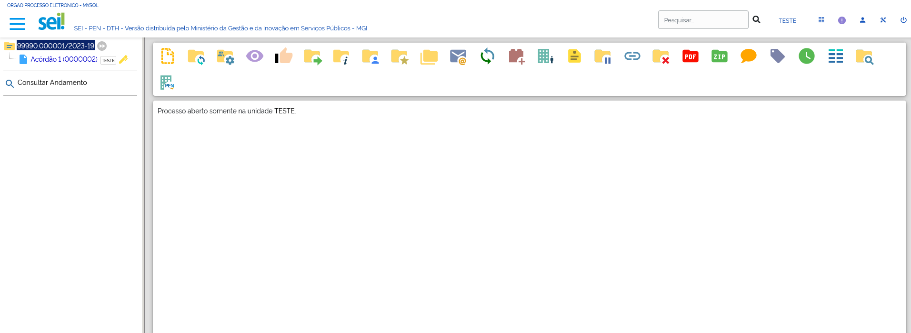
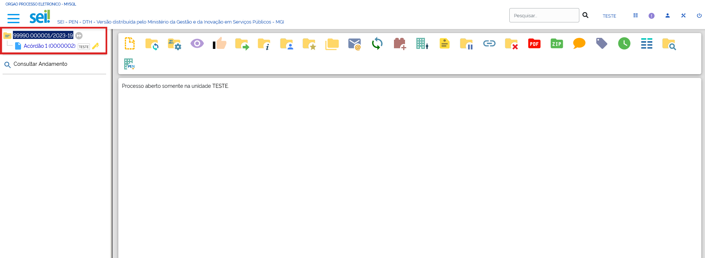
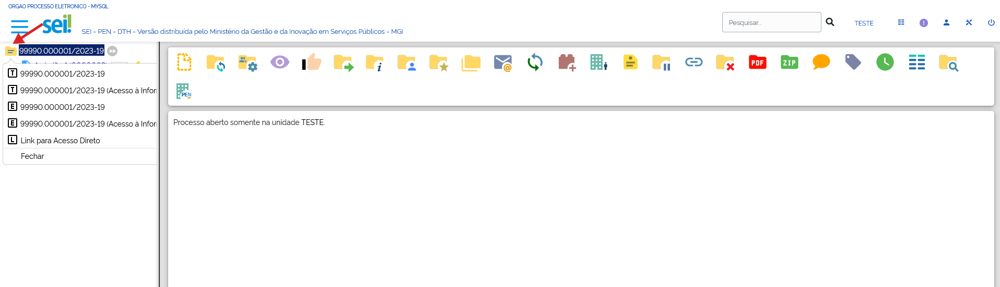
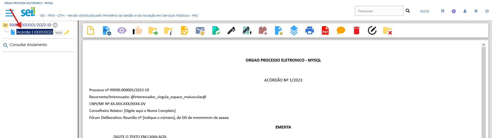

Iniciando Operações
====================

Acesso ao Sistema
+++++++++++++++++

Para acessar o SEI, o usuário deve utilizar um navegador de internet para acessar a URL fornecida pelo órgão ao qual está vinculado, informar seu login, senha e – no caso de instalações multiórgão – o órgão ao qual está vinculado.

Desde a versão 5.0 do SEI, o sistema oferece ao usuário, também,  a possibilidade de realizar o login utilizando diferentes possibilidades de autenticação única - ou Single-Sign-On (SSO) - caso devidamente habilitadas pela Administração do Sistema. São elas:  

* Acesso com Login Google;  
* Acesso com Login da Microsoft; e  
* Acesso com Login GOV.BR.

Autenticação em dois fatores
+++++++++++++++++++++++++++++

Desde sua versão 4.0, o SEI oferece a possibilidade de habilitar a Autenticação em dois fatores para o usuário. Para isso, é necessário acessar a tela de login do SEI, preencher o campo **Usuário**, inserir a **Senha** e clicar sobre a opção **Autenticação em dois fatores**. A funcionalidade reforça a segurança do processo de login, ao combinar o uso da senha do usuário com a exigência de se inserir um código gerado em seu smartphone, adicionando uma camada extra de proteção ao acesso.

.. admonition:: Nota
    
  A partir da versão 5.0 do SEI, é possível configurar, também, o Duplo Fator de Autenticação (2FA) para os casos de login via Google, Microsoft ou por meio da conta GOV.BR, em que o código de acesso será gerado na função nativa de 2FA desses provedores.

Abaixo, está descrito o caminho para configuração do 2FA a partir da autenticação do SEI com login e senha. Basta que o usuário, na tela inicial do SEI, insira seu login e senha e clique em "Autenticação em dois fatores", como na ilustração a seguir: 

.. figure:: _static/images/tela_A2F.gif

Na tela seguinte, será exibido um link com todas as informações para a habilitação do recurso. O usuário deverá ler as instruções e, em seguida, caso de acordo, clicar no botão **Prosseguir**.

Para continuar, é necessário ter, em seu dispositivo móvel, um aplicativo destinado a autenticação em duas etapas. O ***Google Authenticator*** e o ***Microsoft Authenticator*** são exemplos de apps que podem ser utilizados para esta finalidade. 

Após esse procedimento, abra o aplicativo e acesse a opção para leitura de **QR Code**.  

.. admonition:: Nota

   Recomenda-se informar um e-mail pessoal, que não esteja associado à sua Instituição. É imprescindível, para sua segurança, que a senha de acesso a esse e-mail seja diferente da senha de acesso ao SEI.

Faça a leitura da imagem, insira seu e-mail pessoal e clique em **Enviar**.

.. figure:: _static/images/tela_A2F_envio_email.gif
  

Ao clicar sobre o botão **ACESSAR**, o sistema emitirá uma mensagem informando o envio de um e-mail para habilitação do recurso, com validade de até 60 minutos para a conclusão da solicitação.  

Para ativar a Autenticação em dois fatores, o usuário deve acessar o e-mail e clicar sobre o *link* fornecido (ou copiar o endereço eletrônico informado na mensagem e colá-lo na barra de endereços de seu navegador). 

Para acessar o sistema, insira o usuário e a senha na tela inicial. Depois, clique em **ACESSAR**. 

A tela seguinte exigirá o código de acesso gerado pelo aplicativo. Portanto, consulte o código exibido no app e digite-o no campo apropriado do sistema. Em seguida, clique em **Validar**.  

Para dispositivos utilizados com frequência, o SEI disponibiliza a opção “Não usar o 2FA neste dispositivo e navegador”. Se essa opção for marcada, o código de acesso não será solicitado novamente no mesmo dispositivo e navegador. Porém, se for realizada a limpeza de cookies do navegador, o código de acesso voltará a ser solicitado. 

.. figure:: _static/images/1-IO_tela_inicial_2fa_flag_nao_usar_2fa.png
   :align: center

A desativação da Autenticação em dois fatores também poderá ser feita por meio dessa tela. Ao clicar sobre o botão **Desativar 2FA**, o sistema enviará um link para o e-mail cadastrado, para confirmar a operação. Acessando o e-mail e clicando no link, o recurso será desabilitado e o usuário voltará a efetuar o acesso somente com usuário e senha. 

.. admonition:: Saiba Mais
   
   Caso o usuário tenha utilizado a Autenticação em dois fatores e, por qualquer motivo, tenha efetuado a desabilitação do recurso ou perdido o prazo para sua ativação, será necessário, para efetuar uma nova tentativa, verificar se essa conta permanece registrada no aplicativo. Caso ainda esteja ativa, será preciso excluí-la antes de efetuar a leitura do novo QR Code.

Barra de Ferramentas
++++++++++++++++++++

No topo da página está localizada a barra de ferramentas do sistema.

.. figure:: _static/images/1-IO_barra_de_ferramentas.png

As funcionalidades disponíveis são:

.. list-table::
   :widths: 20 35
   :header-rows: 1

   - * Ícones Disponíveis
     * Descrição
   - * .. figure:: _static/images/1-IO_icone_exibir_ocultar.png
          :align: center 
     * **Exibir/ocultar:** permite ocultar e exibir o menu principal.
   - * .. figure:: _static/images/1-IO_icone_pesquisa.png
          :align: center     
     * **Pesquisa:** Campo de pesquisa rápida em processos ou documentos.
   - * .. figure:: _static/images/1-IO_icone_caixa_selecao_unidade.png
          :align: center 
     * **Caixa de seleção de unidade:** exibe qual unidade o usuário está acessando no momento e, ao se clicar nela, possibilita selecionar a unidade de atuação, com base em suas permissões de acesso.
   - * .. figure:: _static/images/1-IO_icone_controle_de_processos.png
          :align: center
     * **Controle de processos:** permite ao usuário, a partir de qualquer tela do sistema, retornar à tela Controle de Processos.
   - * .. figure:: _static/images/icone_em_numeros.png
          :align: center
     * **Painel de Controle:** exibe ao usuário um painel com informações a respeito dos processos na unidade. Tal funcionalidade foi disponibilizada na barra de ferramentas do SEI a partir da **versão 4.1**. 
   - * .. figure:: _static/images/icone_acessibilidade.png
          :align: center
     * **Acessibilidade:** Exibe as teclas de atalho associadas a funcionalidades de acessibilidade, que permitem a pessoas cegas ou com baixa visão alterar o foco do cursor ou executar comandos no SEI com leitores de tela. Tal funcionalidade foi incorporada ao SEI a partir da **versão 4.1**.
   - * .. figure:: _static/images/1-IO_icone_usuario.png
          :align: center
     * **Usuário:** identifica o usuário que está acessando o sistema. Ao clicar no ícone, é possível visualizar dados dos últimos acessos do usuário, como data e hora, navegador e o IP utilizado. 
   - * .. figure:: _static/images/1-IO_icone_configuracoes_do_sistema.png
          :align: center 
     * **Configurações do sistema:** permite que o usuário altere o esquema de cores do sistema. A partir da **versão 5.0**, é possível escolher a página inicial (Controle de Processos, Painel de Controle ou Blocos de Assinatura) e também optar por filtrar a visualização pelos botões acessados recentemente.
   - * .. figure:: _static/images/1-IO_icone_sair_do_sistema.png
          :align: center
     * **Sair do sistema:** permite ao usuário encerrar a sessão atual e sair com segurança do sistema.

Funções de Acessibilidade
^^^^^^^^^^^^^^^^^^^^^^^^

.. list-table::
   :widths: 15 35
   :header-rows: 1

   - * "Atalho"
     * Descrição
   - * ALT + F1
     * Exibe a tela de Acessibilidade - Teclas de Atalho.
   - * ALT + F2
     * Exibe a tela de Controle de Processos.
   - * ALT + F3 
     * Exibe a tela de Painel de Controle.
   - * ALT + F9
     * Exibe ou oculta o menu lateral.
   - * ALT + F10
     * Acessa a Pesquisa Rápida.
   - * ALT + F11
     * Troca de unidade.
   - * ALT + F12
     * Posiciona no link sair do sistema.
   - * ALT + M
     * Pesquisa no menu.
   - * ALT + T
     * Posiciona no título da tela.
   - * ALT + B
     * Posiciona no primeiro botão da barra de comandos.
   - * TAB
     * Permite a navegação entre componentes da tela.
   - * SHIFT + TAB
     * Permite a navegação inversa entre componentes da tela.
   - * ALT + Seta acima
     * Posiciona no componente de seleção da linha anterior (se o foco está em um componente em tabela).
   - * ALT + Seta abaixo
     * Posiciona no componente de seleção da próxima linha (se o foco está em um componente em tabela).
   - * ESC
     * Fecha janelas de seleção abertas internamente.
   - * ALT + R
     * Posiciona na tabela de processos recebidos.
   - * ALT + G
     * Posiciona na tabela de processos gerados.
   - * CTRL + ALT + R
     * Posiciona no item raiz da árvore que representa o número do processo.
   - * CTRL + ALT + S
     * Posiciona no item de protocolo selecionado atualmente na árvore. 
   - * CTRL + ALT + F
     * Posiciona na barra de funcionalidades associadas com o protocolo selecionado (usar TAB para navegar entre as funcionalidades disponíveis).
   - * CTRL + ALT + V
     * Posiciona na área de visualização de conteúdo associada com protocolo selecionado ou funcionalidade escolhida.
   - * CTRL + ALT + U
     * Posiciona no último item de protocolo da árvore.
   - * CTRL + ALT + S
     * Salva o documento em edição.
   - * CTRL + SHIFT + A
     * Assina um documento em edição.
   - * CTRL + SHIFT + L 
     * Insere um link para processo ou documento do SEI. 
   - * CTRL + SHIFT + X 
     * Insere o conteúdo de um texto padrão (AutoTexto).
   - * CTRL + B 
     * Torna o texto selecionado em Negrito.
   - * CTRL + I
     * Torna o texto selecionado em Itálico.
   - * CTRL + U 
     * Torna o texto selecionado em Sublinhado.
   - * CTRL + X 
     * Recorta o conteúdo selecionado em um documento.
   - * CTRL + C
     * Copia o conteúdo selecionado em um documento.
   - * CTRL + V 
     * Insere ("cola") o conteúdo existente na área de transferência para um documento em edição.
   - * CTRL + SHIFT + V
     * Insere ("cola") o conteúdo existente na área de transferência para um documento em edição, como texto sem formatação. 
   - * CTRL + Z
     * Desfaz a última operação em um documento em edição.
   - * CTRL + Y
     * Refaz a última operação em um documento em edição.
   - * ALT + 0
     * Exibe instruções de acessibilidade do editor de textos.

Menu Principal
+++++++++++++++

É a coluna localizada na lateral esquerda da tela, que disponibiliza funcionalidades de acordo com o perfil do usuário ou do tipo de unidade.

As funcionalidades estão apresentadas em ordem alfabética e contêm símbolos para facilitar a sua identificação e correspondência com os ícones existentes na tela de controle de processos e tela do processo.

.. figure:: _static/images/1-IO_tela_menu_principal.png

O perfil básico apresenta as seguintes opções:

.. list-table::
   :widths: 20 35
   :header-rows: 1

   - * **Item do Menu Principal**
     * Função 
   - * **Acompanhamento Especial**
     * Permite visualizar a relação dos processos da unidade que estão em acompanhamento especial e outras informações sobre cada acompanhamento, como o usuário responsável, a data de inclusão, o grupo em que ele está incluído e um campo para observação.
   - * **Base de Conhecimento**
     * Permite descrever as etapas de um processo e anexar documentos de referência relacionados ao Tipo de Processo vinculado àquela base de conhecimento.
   - * **Blocos de Assinatura**
     * Permite gerenciar os blocos de assinatura criados pela unidade ou disponibilizados a ela. Possibilita que mais de um usuário, de qualquer unidade, possa assinar documentos produzidos no sistema.
   - * **Blocos de Reunião** 
     * Permite gerenciar os blocos de reunião criados pela unidade ou disponibilizados a ela. Possibilita que uma unidade disponibilize processos para conhecimento de outras unidades, sem que estas tenham uma atuação formal sobre eles, para serem discutidos em reuniões ou decisão colegiada. Essa funcionalidade permite a visualização do conteúdo dos documentos mesmo que não estejam assinados.
   - * **Blocos Internos**
     * Permite visualizar os blocos internos criados pela unidade. Possibilita a organização de conjuntos de processos que possuam alguma ligação entre si. Esta forma de organização é visível apenas pela unidade que a criou. Além disso, diferentemente do Acompanhamento Especial – que pode ser utilizado para assinalar qualquer processo, independentemente de onde este esteja aberto – **a inclusão em bloco interno só pode ser feita em processos abertos na unidade.** 
   - * **Contatos**
     * Permite o cadastro e consulta dos contatos que serão exibidos como opções para o preenchimento dos campos Interessados, Remetente e Destinatários, na tela de cadastro do processo ou do documento, por exemplo.
   - * **Controle de Prazos**
     * Ferramenta utilizada para administração de prazos dentro da unidade. É uma funcionalidade de organização interna – ou seja, outras unidades não terão acesso ao Controle de Prazos da unidade.
   - * **Controle de Processos**
    * Direciona o usuário para a tela principal do SEI, onde são visualizados todos os processos que estão em sua unidade.
   - * **Estatísticas**
     * Permite visualizar as estatísticas da unidade e o desempenho de processos.
   - * **Favoritos**
     * Permite visualizar e gerenciar a relação de processos salvos como favoritos na unidade, possibilitando acesso rápido a eles.
   - * **Grupos de Contato**
     * Possibilita a criação de uma lista a partir da seleção de contatos cadastrados no sistema.
   - * **Grupos de E-mail**
     * Permite criar e gerenciar grupos de e-mail para o envio de mensagens eletrônicas dentro do sistema.
   - * **Grupos de Envio**
     * Permite criar e gerenciar grupos de unidades para o envio de processos dentro do sistema.
   - * **Iniciar Processo**
     * Permite iniciar um novo processo no SEI.
   - * **Lixeira** (a partir da Versão 5.0)
     * Permite disponibilizar temporariamente (a configuração padrão é 'por 45 dias') os conteúdos de documentos excluídos/cancelados (a configuração padrão é '45 dias'). O próprio usuário que executou a ação poderá fazer o download do conteúdo.
   - * **Marcadores**
     * Permite que a unidade crie e gerencie marcadores para os processos sob sua gestão. Estes têm formato de etiqueta e são utilizados para organização dos processos na unidade.
   - * **Painel de Controle**
     * Funcionalidade que exibe ao usuário um painel com informações a respeito dos processos na unidade. Disponível no SEI a partir da **versão 4.1**.
   - * **Pesquisa**
     * Possibilita a pesquisa avançada de informações, documentos ou processos.
   - * **Pontos de Controle**
     * Recurso que permite atribuir Pontos de Controle (fases de um processo de trabalho ou categorias) para acompanhamento de processos.
   - * **Processos Sobrestados**
     * Permite visualizar a relação de processos da unidade que se encontram sobrestados (suspensos temporariamente) e as informações relativas ao sobrestamento.
   - * **Retorno Programado**
     * Permite verificar a relação de retornos programados da unidade: processos aos quais foram atribuídos prazos para resposta em que a unidade figura como remetente ou destinatário.
   - * **Textos Padrão**
     * Permite cadastrar textos que sejam utilizados recorrentemente na unidade para produção de documentos e e-mails no sistema. 

Tela de Controle de Processos
+++++++++++++++++++++++++++++

Ao acessar o sistema, o usuário será direcionado para a tela Controle de Processos. Essa tela apresenta os processos abertos na unidade (recebidos e gerados) e disponibiliza diversas funcionalidades por meio da Barra de Ferramentas, do Menu Principal (ambos abordados em capítulos anteriores), e da Barra de Ícones. 

Além disso, a tela de controle de processos apresenta filtros que permitem diferentes formas de visualização dos processos da Unidade.

Nessa tela é possível realizar operações com processos em lote. Para isso, é necessário **clicar na caixa de seleção ao lado do número de cada processo** e selecionar o ícone da operação desejada, conforme a necessidade.

Abaixo, estão descritas as diversas funcionalidades da barra de ícones, que permite a execução de operações em lote. O passo a passo para o uso de cada uma dessas funcionalidades será apresentado mais à frente. 

.. list-table::
   :header-rows: 1
   :widths: 5 35

   - * Ícones
     * Descrição
   - * |enviar_processo|
     * **Enviar processo:** permite tramitar processo(s) para outra unidade. Conclui o processo na unidade remetente - a menos que, no momento do envio, o usuário assinale a opção “Manter o processo aberto na unidade atual”. Se concluído, o processo desaparecerá da tela “Controle de Processos”, mas poderá ser recuperado na Pesquisa ou Acompanhamento Especial (quando previamente incluído).
   - * |atualizar_andamento| 
     * **Atualizar andamento:** permite acrescentar manualmente uma informação no registro de andamento do(s) processo(s) selecionado(s). *Atenção*: Informações incluídas no andamento de um processo não podem ser removidas.
   - * |Atribuição_de_processos|
     * **Atribuição de processos:** permite associar um (ou mais) processo(s) a um usuário da unidade, atribuindo-lhe a responsabilidade pelas tratativas dos autos. Essa informação não fica disponível para outras unidades que, eventualmente, consultarem o processo, sendo uma ferramenta de organização interna da unidade, com a finalidade de distribuição de tarefas.
   - * |Incluir_em_bloco|
     * **Incluir em bloco:** uma das ferramentas de organização dos processos dentro do sistema. Processos podem ser incluídos em *Bloco Interno*, para fins de separação temática na unidade, ou *Bloco de Reunião*, que possibilita - quando disponibilizado - o compartilhamento de processos com outra unidade para mera visualização, inclusive das minutas (documentos não assinados).
   - * |Sobrestar_processo|
     * **Sobrestar processo:** expediente de interrupção dos trâmites administrativos, utilizado quando o processo precisa ser "pausado" para aguardar alguma providência antes de prosseguir, mantendo-se fora do Controle de Processos da unidade enquanto sobrestado, acessível apenas pela funcionalidade *Processos Sobrestados* do Menu Principal.
   - * |Concluir_processo_nesta_unidade|
     * **Concluir processo nesta unidade:** permite finalizar o processo na unidade em que o usuário que está acessando o sistema. O processo desaparecerá da tela “Controle de Processos”, mas poderá ser recuperado na Pesquisa ou Acompanhamento Especial (quando previamente incluído).
   - * |Anotações|
     * **Anotações:** permite incluir anotações no processo, que ficam visíveis em um ícone em formato de bilhete "post-it" ao lado do número do processo. Para visualizar o teor da anotação, basta passar o ponteiro do mouse sobre o ícone. A funcionalidade é utilizada para incluir informações adicionais que não precisem constar dos autos do processo. Visíveis apenas para os usuários com acesso à unidade, as informações não são acessíveis para outras unidades que, eventualmente, consultem o processo.
   - * |Acompanhamento_especial|
     * **Acompanhamento especial:** possibilita ao usuário salvar o(s) processo(s) a ser(em) acompanhado(s) posteriormente em uma lista, sem a necessidade de mantê-lo(s) aberto(s) em sua unidade. A lista é compartilhada por todos os usuários da unidade e pode ser organizada em grupos. Um processo pode ser incluído em mais de um grupo de acompanhamento especial.
   - * |Incluir_documento|
     * **Incluir documento:** permite incluir um novo documento (a partir de documento modelo ou texto padrão) nos processos selecionados, permitindo, ainda a inclusão dos documentos gerados em um bloco de assinatura.
   - * |Gerenciar_marcador|
     * **Adicionar ou Remover marcador:** permite que a unidade inclua ou retire marcadores dos processos selecionados. Os marcadores têm formato de etiqueta e são utilizados para organização dos processos na unidade.
   - * |Controle_de_Prazos|
     * **Controle de Prazos:** ferramenta utilizada para administração de prazos de cada processo dentro da unidade, se necessário. Por ser  uma funcionalidade de organização interna, usuários em outras unidades não terão acesso ao Controle de Prazos da unidade.

.. |enviar_processo| image:: _static/images/1-IO_icone_Enviar_Processo.png
   :align: middle
   :width: 50
   
.. |atualizar_andamento| image:: _static/images/1-IO_icone_Atualizar_Andamento.png
   :align: middle
   :width: 50

.. |Atribuição_de_processos| image:: _static/images/1-IO_icone_Atribuicao_processo.png
   :align: middle
   :width: 50

.. |Incluir_em_bloco| image:: _static/images/1-IO_icone_incluir_bloco.png
   :align: middle
   :width: 50

.. |Sobrestar_processo| image:: _static/images/1-IO_icone_sobrestar_processo.png
   :align: middle
   :width: 50

.. |Concluir_processo_nesta_unidade| image:: _static/images/1-IO_icone_concluir_processo.png
   :align: middle
   :width: 50

.. |Anotações| image:: _static/images/1-IO_icone_Anotacoes.png
   :align: middle
   :width: 50

.. |Acompanhamento_especial| image:: _static/images/1-IO_icone_Acompanhamento_especial.png
   :align: middle
   :width: 50

.. |Incluir_documento| image:: _static/images/1-IO_icone_incluir_documento.png
   :align: middle
   :width: 50

.. |Gerenciar_marcador| image:: _static/images/1-IO_icone_Gerenciar_Marcador.png
   :align: middle
   :width: 50

.. |Controle_de_Prazos| image:: _static/images/1-IO_icone__cotrole_de_prazos.png
   :align: middle
   :width: 50

Os Filtros disponíveis na tela Controle de Processos, que ficam logo abaixo da Barra de Ícones, possibilitam diferentes formas de visualizar os processos que estão na unidade. Veja a explicação de cada opção a seguir:

.. list-table::
   :header-rows: 1
   :widths: 15 35

   - * Ícones
     * Descrição
   - * *Visualização detalhada*
     * Possibilita uma visualização mais detalhada dos processos na tela. O usuário poderá configurar essa opção clicando no link “Visualização detalhada” e, em seguida, no link “Configurar nível de detalhe”.
   - * *Configurar nível de detalhe*
     * Esse link surge quando o usuário clica em “Visualização detalhada”. Ele permite a configuração do nível de detalhe a ser exibido em tela. O usuário poderá selecionar uma das seguintes opções a serem apresentadas na tela: Atribuição, Anotação, Tipo de processo, Especificação, Interessados, Observação, Controle de Prazo, Para Devolver, Aguardando Retorno, Última Movimentação na Unidade e Marcadores.
   - * *Ver processos atribuídos a mim*
     * Aplica filtro para que sejam mostrados, na tela Controle de Processos, apenas os processos atribuídos ao usuário que está acessando o sistema.
   - * *Ver por marcadores*
     * Exibe os Marcadores utilizados na unidade e a quantidade de processos em cada Marcador. Para acessar os processos, basta clicar no número correspondente à quantidade de cada Marcador, na coluna Processos.
   - * *Ver por tipo de processo*
     * Exibe os tipos de processos abertos na unidade e a quantidade de processos de cada tipo. Para acessar os processos, basta clicar no número correspondente à quantidade de cada tipo, na coluna Processos.

Para melhor compreender a organização das listas de processos gerados e recebidos na tela Controle de Processos, é recomendável conhecer a organização das cores e dos elementos em tela. De forma resumida, os processos ficam divididos entre aqueles que foram remetidos por outras unidades e aqueles que foram gerados na própria unidade. Além disso, é possível identificar o Tipo e especificação de cada processo ao se passar o ponteiro do mouse por cima do número do processo, além de outros detalhes. Veja a descrição de cada um deles a seguir:

.. list-table::
   :header-rows: 1
   :widths: 10 35

   - * Ícones/Simbologias
     * Descrição
   - * |Login_entre_parenteses|
     * **Login entre parênteses**: indica o usuário a quem o processo foi atribuído na unidade. Posicionar o ponteiro do mouse sobre o login exibirá a informação "Atribuído para [Nome completo do Usuário].
   - * |Processo_numero_preto|
     * **Processo com número em preto**: indica que este processo já foi acessado por algum usuário da unidade. Posicionar o ponteiro do mouse sobre o número exibirá o Tipo de Processo e sua especificação.
   - * |Processo_núumero_vermelho|
     * **Processo com número em vermelho**: indica que o processo ainda não foi acessado. Posicionar o ponteiro do mouse sobre o número exibirá o Tipo de Processo e sua especificação.
   - * |Processo_fundo_preto| 
     * **Processo com fundo preto**: Indica processo sigiloso já acessado por alguém da unidade. Só pode ser visto por usuários com credencial de acesso ao processo sigiloso. Posicionar o ponteiro do mouse sobre o número exibirá o Tipo de Processo.
   - * |Processo_fundo_vermelho|
     * **Processo com fundo vermelho**: indica processo sigiloso que ainda não foi acessado. Igualmente, só pode ser visto por usuários com credencial de acesso ao processo sigiloso. Posicionar o ponteiro do mouse sobre o número exibirá o Tipo de Processo.
   - * |Processo_fundo_azul|
     * **Processo com fundo azul**: indica que o processo sigiloso foi acessado e/ou que sofreu alguma ação realizada pelo usuário no login/sessão atual. Igualmente, só pode ser visto por usuários com credencial de acesso ao processo sigiloso. Posicionar o ponteiro do mouse sobre o número exibirá o Tipo de Processo.
   - * |retorno_laranja|
     * **Para devolver (no prazo)**: Indica que o processo recebido pela unidade tem prazo de Retorno Programado a vencer. Posicionar o ponteiro do mouse sobre o ícone exibirá o status do retorno programado ("Para devolver"), a unidade para o qual o Retorno está cadastrado, a data prevista para devolução e, entre parênteses, quantos dias faltam para o encerramento do prazo previsto.
   - * |retorno_vermelho|
     * **Para devolver (atrasado)**: Indica que o processo recebido pela unidade está com prazo de Retorno Programado expirado (atrasado). Posicionar o ponteiro do mouse sobre o ícone exibirá o status do retorno programado ("Para devolver"), a unidade para o qual o Retorno está cadastrado, a data prevista para devolução e, entre parênteses, quantos dias ela está atrasada.
   - * |retorno_azul|
     * **Devolução cumprida**: Indica que esse processo recebido pela unidade tinha prazo de Retorno Programado e foi devolvido. Posicionar o ponteiro do mouse sobre o ícone exibirá o status do retorno programado ("Devolução cumprida"), a unidade para o qual o Retorno estava cadastrado, a data prevista para devolução e, entre parênteses, a data em que o processo foi efetivamente devolvido.
   - * |ampulheta_laranja| 
     * **Aguardando Retorno (no prazo)**: Indica que o processo enviado pela unidade com Retorno Programado está aguardando retorno de outra unidade. Posicionar o ponteiro do mouse sobre o ícone exibirá o status do retorno programado ("Aguardando Retorno"), a unidade da qual se aguarda o Retorno, a data prevista para devolução e, entre parênteses, quantos dias faltam para o encerramento do prazo previsto.
   - * |ampulheta_azul| 
     * **Retorno Cumprido**: Indica que o processo enviado pela unidade com Retorno Programado teve o retorno cumprido. Posicionar o ponteiro do mouse sobre o ícone exibirá o status do retorno programado ("Retorno Cumprido"), a unidade da qual se aguardava o Retorno, a data prevista para devolução e, entre parênteses, a data em que o processo foi efetivamente devolvido.
   - * |ampulheta_vermelha|
     * **Aguardando Retorno (atrasado)**: Indica que o processo enviado pela unidade com Retorno Programado está com o prazo de devolução expirado (atrasado). Posicionar o ponteiro do mouse sobre o ícone exibirá o status do retorno programado ("Aguardando Retorno"), a unidade da qual se aguarda o Retorno, a data prevista para retorno e, entre parênteses, quantos dias ele está atrasado.
   - * |alerta|
     * **Alerta**: Indica que um documento foi incluído ou assinado no processo.
   - * |anotacoes| 
     * **Anotação**: Indica a existência de uma Anotação simples. Posicionar o ponteiro do mouse sobre o ícone exibirá o autor, a data e hora de criação e o texto da anotação.
   - * |anotocoes_vermelho|
     * **Anotação urgente**: Indica a existência de uma Anotação com prioridade. Posicionar o ponteiro do mouse sobre o ícone exibirá o autor, a data e hora de criação e o texto da anotação.
   - * |marcador|
     * **Marcador**: Indica que o processo possui um marcador. Posicionar o ponteiro do mouse sobre o ícone exibirá a descrição do marcador e o texto (opcional) informado pelo usuário que o inseriu.
   - * |ponto_controle|
     * **Ponto de Controle**: Indica que o processo possui um Ponto de Controle associado a ele. Posicionar o ponteiro do mouse sobre o ícone exibirá o nome do Ponto de Controle em questão.
   - * |controle_prazo_laranja|
     * **Controle de prazo (a vencer)**: Indica que o processo possui um Controle de Prazo a vencer. Posicionar o ponteiro do mouse sobre o ícone exibirá o usuário que definiu o prazo, sua data de vencimento e, entre parênteses, quanto tempo falta para esta data.
   - * |controle_prazo_azul| 
     * **Controle de prazo (concluído)**: Indica que o processo possui um Controle de Prazo concluído. Posicionar o ponteiro do mouse sobre o ícone exibirá o usuário que definiu o prazo, sua data de vencimento e, entre parênteses, a data em que este prazo foi cumprido.
   - * |controle_prazo_vermelho|
     * **Controle de prazo (vencido)**: Indica que o processo possui um Controle de Prazo vencido (atrasado). Posicionar o ponteiro do mouse sobre o ícone exibirá o usuário que definiu o prazo, sua data de vencimento e, entre parênteses, quanto tempo já se passou desta data.
   - * |Processo_prioritario|
     * **Processo prioritário**: Indica que o processo em questão deve receber tratamento prioritário, nos termos da legislação vigente. Posicionar o ponteiro do mouse sobre o ícone exibirá o tipo de prioridade associado ao processo. A prioridade é informada no ato de criação do processo administrativo. Disponível no SEI a partir da **versão 5.0**.

.. |Processo_fundo_preto| image:: _static/images/1-IO_icone_processo_fundo_preto.png
   :align: middle
   :width: 100

.. |Processo_fundo_azul| image:: _static/images/1-IO_icone_fundo_azul.png
   :align: middle
   :width: 100

.. |retorno_laranja| image:: _static/images/1-IO_icone_RP_a_vencer.png
   :align: middle
   :width: 40

.. |retorno_vermelho| image:: _static/images/1-IO_icone_RP_atrasado.png
   :align: middle
   :width: 40

.. |retorno_azul| image:: _static/images/1-IO_icone_RP_concluido.png
   :align: middle
   :width: 40

.. |ampulheta_laranja| image:: _static/images/1-IO_icone_RP_aguardando_retorno.png
   :align: middle
   :width: 40

.. |ampulheta_azul| image:: _static/images/1-IO_icone_retorno_cumprido.png
   :align: middle
   :width: 35

.. |ampulheta_vermelha| image:: _static/images/1-IO_icone_RP_devolucao_atrasada.png
   :align: middle
   :width: 40

.. |alerta| image:: _static/images/1-IO_icone_doc_inluido_ou_assinado.png
   :align: middle
   :width: 40

.. |anotacoes| image:: _static/images/1-IO_icone_Anotacoes.png
   :align: middle
   :width: 40

.. |anotocoes_vermelho| image:: _static/images/1-IO_icone_Anotacoes_com_prioridade.png
   :align: middle
   :width: 40

.. |marcador| image:: _static/images/1-IO_icone_Gerenciar_Marcador.png
   :align: middle
   :width: 40

.. |ponto_controle| image:: _static/images/1-IO_icone__possui_ponto_de_controle.png
   :align: middle
   :width: 40

.. |controle_prazo_laranja| image::  _static/images/1-IO_icone__controle_prazo_a_vencer.png
   :align: middle
   :width: 40

.. |controle_prazo_azul| image:: _static/images/1-IO_icone__controle_prazo_concluido.png
   :align: middle
   :width: 40

.. |controle_prazo_vermelho| image:: _static/images/1-IO_icone__controle_prazo_atrasado.png
   :align: middle
   :width: 40

.. |Processo_prioritario| image:: _static/images/1-IO_Processo_prioritario.png
   :align: middle
   :width: 40

Tela do Processo
++++++++++++++++

Ao clicar sobre o número de um processo na tela Controle de Processos, o usuário será direcionado a uma nova tela, onde poderá visualizar o conteúdo do processo em que clicou.

O lado esquerdo da tela mostra o número do processo e a relação de documentos organizados cronologicamente por data e hora de geração – é a chamada **“Árvore de documentos do Processo”**. Logo abaixo da árvore, é exibida a funcionalidade **“Consultar Andamento”** e, em seguida, são mostrados os **Processos Relacionados**, quando houver. 

À direita da tela são exibidos os ícones de operações possíveis para o processo e, logo abaixo, as unidades nas quais o processo está aberto.

Alguns desses ícones são os mesmos apresentados na tela Controle de Processos, já detalhados no tópico anterior. As demais funcionalidades são as seguintes: 

.. list-table::
   :header-rows: 1
   :widths: 5 35

   - * Ícone
     * Descrição
   - * |Iniciar_processo_relacionado| 
     * **Iniciar processo relacionado:** permite iniciar um novo processo relacionado ao processo em que o usuário está trabalhando no momento. Processos relacionados não têm qualquer dependência um do outro, mas podem ser facilmente acessados a partir da lista abaixo da árvore do Processo.
   - * |Consultar_Alterar_processo|
     * **Consultar/Alterar processo:** permite consultar ou alterar os dados cadastrais - ou metadados - do processo (descrição, interessados, destinatário, nível de acesso). **Não podem ser alterados** a data de autuação do processo e seu número, se gerado automaticamente pelo sistema.
   - * |Ciencia|
     * **Ciência:** permite o registro de ciência no processo, dispensando a necessidade de se produzir um documento para esse fim, sendo permitido ao usuário registrar ciência de um processo uma vez por dia. Também é possível fazê-lo em documentos específicos do processo. Ao receber a primeira ciência, um ícone equivalente passa a ser exibido ao lado do número do processo, permitindo a visualização das ciências já informadas em uma tabela, que vai recebendo novas linhas conforme outros usuários também manifestam ciência.
   - * |Favoritos|
     * **Favoritos:** permite salvar o processo selecionado como “favorito”, podendo-se incluí-lo em grupos de favoritos, a critério da unidade. Os processos favoritos podem ser acessados a partir da opção “Favoritos” no menu Principal.
   - * |Duplicar_processo|
     * **Duplicar processo:** permite gerar um novo processo por duplicação de documentos selecionados. **Importante:** não se trata de uma cópia do mesmo processo, mas de um **novo** processo com documentos idênticos. No processo gerado, qualquer assinatura existente nos documentos duplicados é removida e estes podem ser modificados a critério do usuário.
   - * |Enviar_correspondência_eletronica|
     * **Enviar correspondência eletrônica:** permite a elaboração de um e-mail a ser remetido a partir do processo, podendo incluir documentos que constem nos autos ou outros arquivos selecionados do computador do usuário. O e-mail enviado passa a figurar na árvore do processo, como qualquer outro documento.
   - * |Relacionamentos_do_processo|
     * **Relacionamentos do processo:** permite vincular um processo a outro, a partir da informação de seu número. Processos relacionados não têm qualquer dependência um do outro, mas podem ser facilmente acessados a partir da lista abaixo da árvore do Processo.
   - * |Ordenar_arvore_do_processo|
     * **Ordenar árvore do processo:** permite que o usuário altere a ordem dos documentos de um processo, em caso de estrita necessidade. **Importante:** A funcionalidade deve ser utilizada em situações excepcionais e justificadas, como para a correção de cadastros de documentos em ordem incorreta, para se reestabelecer a sequência cronológica original e o contexto do conjunto documental. Sugere-se, ainda, que quaisquer alterações sejam devidamente formalizadas e nunca realizadas de forma arbitrária.
   - * |Gerenciar_disponibilizacoes_de_acesso_externo|
     * **Gerenciar disponibilizações de acesso externo**: concede acesso ao conteúdo do processo a um usuário externo. Esta disponibilização pode ocorrer de duas maneiras: pode se tratar de uma "disponibilização de acesso externo", em que é gerado um link de visualização do processo que pode ser remetido a *qualquer* destinatário de e-mail (deve-se, portanto, ser utilizada com a devida cautela); ou de uma "disponibilização de acesso **a usuário** externo", que, neste caso, exige que este usuário externo esteja previamente cadastrado no SEI (com identidade validada e acesso liberado). Usuários externos são listados com seu endereço de e-mail ao lado do nome, sendo possível, também filtrar a listagem para que sejam exibidos apenas os usuários previamente cadastrados.
   - * |Anexar_processo| 
     * **Anexar processo:** permite unir, de forma definitiva, um processo a outro quando houver identidade de assunto e de interessado, assegurando a continuidade da ação administrativa. Para tanto, basta informar o número do processo a ser anexado na tela seguinte. Deve-se atentar que, uma vez anexado, não é possível alterar o teor de um processo. Logo, quaisquer *minutas* de documento que constem no processo precisam ser assinadas para que sejam visíveis após a anexação. A operação deve ser realizada com cautela, pois representa uma união arquivística irreversível (ainda que o sistema disponha de recurso técnico para desfazê-la, tal ação contraria as normas arquivísticas e só deve ocorrer em casos excepcionais e formalmente justificados). 
   - * |Gerar_arquivo_PDF_do_processo|
     * **Gerar arquivo PDF do processo:** permite gerar um arquivo no formato .PDF, com os documentos incluídos na sequência da árvore do processo. É permitido ao usuário escolher quais documentos deseja incluir no arquivo gerado.
   - * |Gerar_arquivo_ZIP_do_processo|
     * **Gerar arquivo ZIP do processo:** permite gerar um arquivo no formato .ZIP, com os documentos do processo em seu formato original, incluídos na sequência da árvore do processo. É permitido ao usuário escolher quais documentos deseja incluir no arquivo gerado. 
   - * |Comentarios| 
     * **Comentários:** permite a inclusão de comentários no processo. Estes comentários ficam visíveis para usuários de todas as unidades que tiverem acesso ao processo. É possível incluir comentários também em documentos - que podem ser visualizados a partir de tela similar, acessível por meio de ícone junto ao número do documento na árvore - ou junto aos comentários referentes ao processo, ao se clicar na opção "Ver Todos" na tela de exibição dos comentários do processo.
   - * |Controle_de_Processos|
     * **Controle de Processos:** permite que o usuário retorne à tela de controle de processos.
   - * |Pesquisar_no_Processo|
     * **Pesquisar no Processo:** Permite que o usuário realizar uma pesquisa com resultados limitados ao que consta nos documentos do processo sendo visualizado.

.. |Iniciar_processo_relacionado| image:: _static/images/1-IO_icone__iniciar_processo_relacionado.png
   :align: middle
   :width: 50

.. |Consultar_Alterar_processo| image:: _static/images/1-IO_icone__consultar_alterar_processo.png
   :align: middle
   :width: 50

.. |Ciencia| image::  _static/images/1-IO_icone__ciência.png
   :align: middle
   :width: 50

.. |Duplicar_processo| image:: _static/images/1-IO_icone__duplicar_processo.png
   :align: middle
   :width: 50

.. |Enviar_correspondência_eletronica| image:: _static/images/1-IO_icone__enviar_correspondencia_eletronica.png
   :align: middle
   :width: 50

.. |Relacionamentos_do_processo| image:: _static/images/1-IO_icone__relacionamentos_processo.png
   :align: middle
   :width: 50

.. |Gerenciar_disponibilizacoes_de_acesso_externo| image:: _static/images/1-IO_icone__gerenciar_dispon_acesso_externo.png
   :align: middle
   :width: 50

.. |Anexar_processo| image:: _static/images/1-IO_icone__anexar_processo.png
   :align: middle
   :width: 50

.. |Gerar_arquivo_PDF_do_processo| image:: _static/images/1-IO_icone__gerar_pdf.png
   :align: middle
   :width: 50

.. |Gerar_arquivo_ZIP_do_processo| image:: _static/images/1-IO_icone__gerar_ZIP.png
   :align: middle
   :width: 50

.. |Comentarios| image:: _static/images/1-IO_icone__comentarios.png
   :align: middle
   :width: 50

.. |Controle_de_Processos| image:: _static/images/1-IO_icone_controle_de_processo_tela_processos.png
   :align: middle
   :width: 50

Árvore de Documentos do Processo
-------------------

Como dito anteriormente, todos os documentos do processo são organizados por ordem de inclusão em uma lista vertical, denominada **“Árvore de Documentos do Processo”**.

Como forma de otimizar a visualização da árvore, o SEI organiza a visualização de processos que possuem muitos documentos em **pastas** em formato "sanfona" (clique para expandir, clique novamente para condensar), habitualmente configuradas para juntar documentos em grupos de 20 (vinte), valor que pode ser parametrizado pela administração local do sistema. 

Mas então o SEI criou subpastas no processo? **Não.** Trata-se apenas de uma ferramenta para agilizar o carregamento dos componentes digitais, sendo que, por padrão, são carregados primeiro os documentos mais recentes, onde normalmente constam as providências imediatas a serem adotadas no âmbito do processo, e os demais, conforme se expande a "pasta" em que se encontram. Esta organização não deve ser confundida com os “Volumes de Processo”, típicos de processos em suporte físico e que não existem no âmbito do processo administrativo eletrônico.

Outro ponto interessante a destacar aqui é que o SEI facilita copiar o número do processo (o mesmo vale para documentos). Para isso, basta clicar no ícone do processo, ao lado de seu número, como demonstrado na figura abaixo:

As opções para cópia do número do processo são:
* **🅃 número do processo**: copia o número do processo em texto plano, sem formatação.
* **🅃 número do processo (tipo de processo)**: copia o número e o tipo do processo em texto plano, sem formatação.
* **🄴 número do processo**: copia o número do processo formatado para utilização no Editor de textos do SEI, para referenciamento (acesso ao processo com um clique).
* **🄴 número do processo (tipo de processo)**: copia o número e o tipo do processo formatado para utilização no Editor de textos do SEI, para referenciamento (acesso ao processo com um clique).
* **🄻 Link para acesso direto**: Gera um link que permite acesso ao processo, para usuários já autenticados. Para usuários não autenticados, será preciso fazer login no SEI para acessar o processo.

Tela do Documento
+++++++++++++++++

Ao clicar sobre um documento na árvore do processo, ele recebe uma marcação em azul enfatizando o item selecionado.

À direita, são mostrados todos os ícones de operações possíveis para documentos e, logo abaixo, é apresentado o corpo do documento.

Alguns desses ícones são os mesmos apresentados na tela do processo, já detalhados no tópico anterior. As demais funcionalidades disponíveis são as seguintes:

.. list-table::
   :widths: 5 50
   :header-rows: 1
  

   - * Ícone
     * Descrição
   - * |Consultar_Alterar_documento|
     * **Consultar/Alterar documento:** permite consultar ou alterar os dados de cadastro do documento (descrição, interessados, destinatário, nível de acesso), com exceção da data de produção e do número do documento.
   - * |Adicionar_aos_favoritos| 
     * **Adicionar aos favoritos:** permite que o usuário defina o documento como modelo, aproveitando seu formato e conteúdo na produção de novos documentos. 
   - * |Imprimir_web| 
     * **Imprimir web**: permite imprimir um documento. Essa funcionalidade está disponível apenas para documentos produzidos no editor de texto do sistema.
   - * |Consultar_assinaturas| 
     * **Consultar assinaturas:** permite consultar as assinaturas de autenticação efetuadas no documento externo digitalizado e inserido no SEI.

.. |Adicionar_aos_favoritos| image:: _static/images/1-IO_icone__adionar_aos_favoritos.png
   :align: middle
   :width: 50

.. |Imprimir_web| image:: _static/images/1-IO_icone__imprimir_web.png
   :align: middle
   :width: 50

Da mesma forma que ocorre com o número do processo, o SEI tem funcionalidade que permite a geração de cópia do número do documento, para acessá-la clique no ícone ao lado do documento.

Será possível copiar o número do documento, o número do documento acompanhado do seu título ou o seu link de acesso.

.. figure:: _static/images/1-IO_tela_do_documento_numero_doc.png

