Operações básicas com documentos
================================

Incluir Documentos
++++++++++++++++++

Por meio desse recurso, o usuário poderá incluir documentos (internos ou externos) em processos.

Para incluir um documento no processo, acesse o processo e clique no ícone “**Incluir Documento**” |incluir_documento|.

.. |incluir_documento| image:: _static/images/1-IO_icone_incluir_documento.png
   :align: middle
   :width: 25

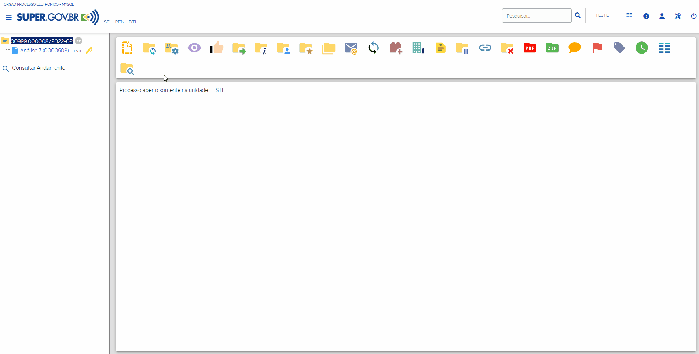

Em seguida, selecione o tipo do documento de forma similar à escolha do tipo do processo.

.. figure:: _static/images/5-OBD-inclusao_documento_tipo_documento.gif

.. admonition:: Nota

   Assim como no "Tipo de Processo" serão exibidos os tipos de documentos já utilizados pela unidade. Para acessar a lista com todos os documentos disponíveis clique no botão |mais|

.. |mais| image:: _static/images/2-OBCP_Atribuir_icone_Exibir_todos_os_tipos.png
   :align: middle
   :width: 25

Em seguida, preencha os campos de cadastramento do documento, os quais são semelhantes aos campos do processo.

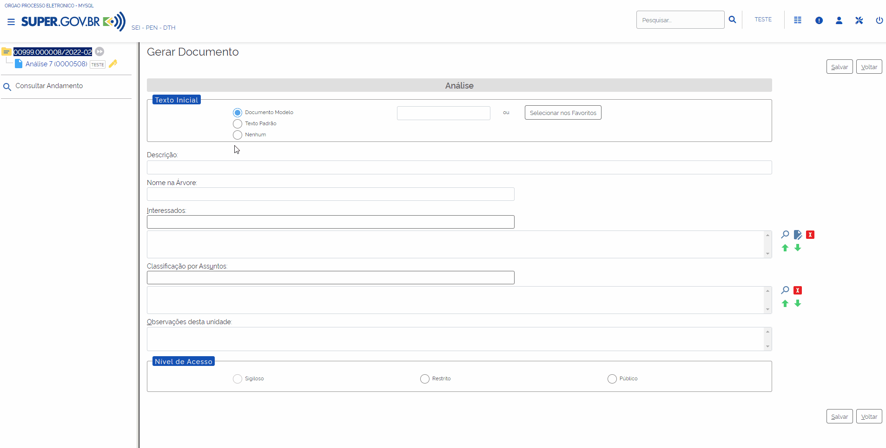

O campo **Texto Inicial** estará selecionado como sugestão a opção “**Nenhum**”. Se desejar, o usuário poderá selecionar um “**Documento Modelo**” ou um “**Texto Padrão**” para gerar o documento.

Caso seja selecionado “**Documento Modelo**”, o usuário deverá selecionar o modelo a ser utilizado. O documento utilizado como modelo deverá ser previamente indicado como Favorito para que esteja disponível para seleção do usuário.

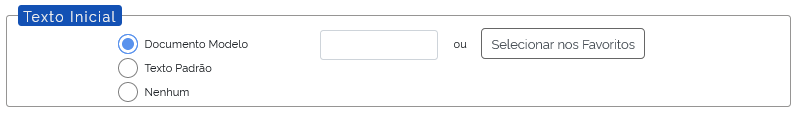

Caso seja selecionado “**Texto Padrão**”, o usuário deverá selecionar o “**Texto Padrão**”. O texto padrão deverá ser criado previamente para que esteja disponível para seleção do usuário.

.. figure:: _static/images/5-OBD-inclusao_documento_texto_padrao.png

Os demais campos são os seguintes:

* **Descrição**: Insira informações que detalhem o documento em questão.

* **Interessados**: Insira o nome do(s) interessado(s) no mérito do documento, podendo ser pessoa física ou jurídica.

* **Classificação por Assuntos**: Campo destinado à classificação arquivística do documento.

* **Observações desta unidade**: Insira informações adicionais que facilitem a identificação e a recuperação do Documento.

O campo “**Observações desta unidade**” do documento também poderá ser preenchido por cada unidade em que o processo tramitar. As observações inseridas por outras unidades aparecem, na tela “**Alterar Documento**”, separadamente, na “’**Lista de observações de outras unidades**”. Não há possibilidade de uma unidade alterar as observações inseridas por outras unidades.

* **Nível de Acesso**
  
  * *Público*: os documentos estarão disponíveis para visualização de todos os usuários do órgão.
  
  * *Restrito*: o processo e seus documentos estarão disponíveis para visualização de usuários das unidades pelas quais o processo tramitar. Ao selecionar essa opção o sistema exibirá campo para seleção da hipótese legal de restrição. A indicação da hipótese é obrigatória e deverá seguir a legislação em vigor..
  
  * *Sigiloso*: o processo e seus documentos estarão disponíveis apenas para usuários com permissão específica e previamente credenciados. Para marcar essa opção é necessário que o administrador do sistema indique previamente que esse tipo de documento pode ser marcado dessa maneira. 

Após o preenchimento adequado dos campos de cadastramento, o usuário deverá clicar em **Salvar**.

.. admonition:: Notas

   1. A qualidade dos dados cadastrados auxiliará, posteriormente, na pesquisa do documento.
   2. Ao marcar as opções "Restrito" ou "Sigiloso" no campo de Nível de Acesso do documento, todo o processo receberá a mesma classificação.

Após a confirmação da operação, o documento será inserido, automaticamente, na “**Árvore do Processo**” e ficará disponível para edição e para assinatura. 

À direita do nome e do número de protocolo de cada documento, aparece a sigla da unidade que o gerou. Ao posicionar o cursor sobre a sigla, é informado o nome da unidade.

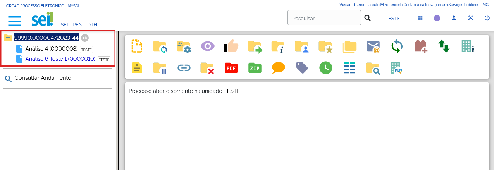

Inserindo um Documento Interno em um Grupo de Processos
--------------------------------------------------------

Na tela “**Controle de Processos**”, marque a caixa de seleção ao lado do número dos processos em que deseja incluir o documento e clique no ícone “**Incluir Documento**” |incluir_documento|, disponível na Barra de Ícones.

.. |incluir_documento| image:: _static/images/1-IO_icone_incluir_documento.png
   :align: middle
   :width: 25

.. figure:: _static/images/5-OBD-inclusao_documento_tela_processo.gif

Nesta forma de inclusão de documentos em processos, o usuário deverá:

* selecionar o “**Tipo do Documento**”;

* indicar, no campo “**Texto Inicial**”, o “**Documento Modelo**” ou o “**Texto Padrão**” que será utilizado; 

* indicar o “**Nível de Acesso**” do documento; e

* selecionar um “**Bloco de Assinatura**” ou criar um novo bloco por meio de clique no botão “**Novo**”.

Após o preenchimento dos campos, clicar em “**Gerar**”

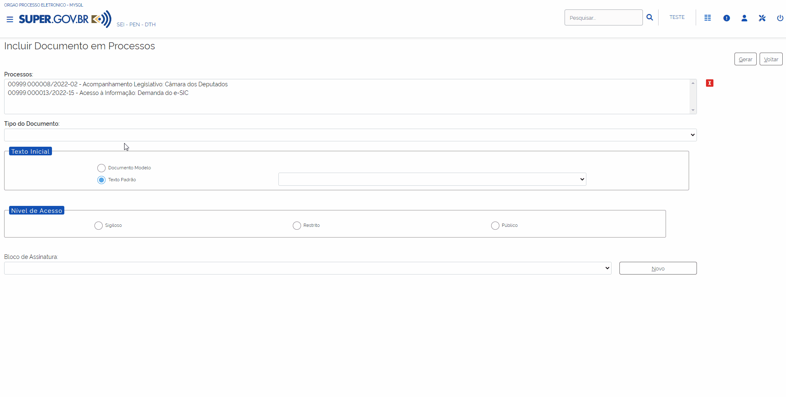

Caso o usuário tenha optado por inserir os documentos em um Bloco de Assinatura, será aberta a tela **Blocos de Assinatura**. Nela, o usuário poderá consultar, disponibilizar os documentos para assinatura de outras unidades e assinar os documentos gerados, bem como utilizar as demais funcionalidades disponíveis em tela.

Para mais detalhes, acesse o capítulo a respeito de Bloco de Assinatura.

Inserindo um Documento Externo
------------------------------

Para incluir um documento externo, o usuário deverá acessar o processo, clicar no ícone “**Incluir Documento**” |incluir_documento| e escolher o tipo de documento “**Externo**”. Esse tipo de documento sempre aparecerá no topo da lista de seleção.

.. |incluir_documento| image:: _static/images/1-IO_icone_incluir_documento.png
   :align: middle
   :width: 25

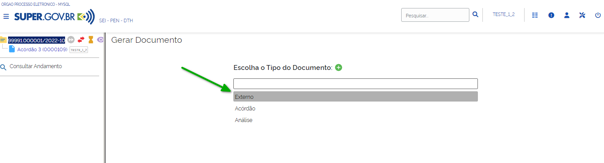

Os seguintes campos ficarão disponíveis para preenchimento:

* **Tipo do Documento**: campo de seleção para indicação do tipo do documento externo (ex.: Alvará, anexo, acordo etc.).

* **Data do Documento**: data expressa no documento que será anexado.

* **Número**: número identificador expresso no documento (ex.: Ofício nº 12).

.. admonition:: Nota

   Caso o sistema legado da unidade seja o SEI versão 3.1, os registros anteriores terão seu Número armazenado no campo **Nome na Árvore**.

* **Nome na Árvore**: identificação do documento conforme deve aparecer na árvore do processo. O documento será exibido com "Tipo do Documento" + "Número" + "Nome na Árvore".

* **Formato**:

  * **Nato-digital**: selecionar se o arquivo a ser registrado foi produzido em meio digital..
	
  * **Digitalizado nesta Unidade**: selecionar se os documentos foram obtidos a partir da digitalização de um documento em papel. Ao selecionar esta opção, o sistema disponibilizará mais dois campos para preenchimento: “**Tipo de Conferência**” e “**Para Arquivamento**”

    * **Para Arquivamento**: É necessário também informar se o documento original que foi digitalizado será encaminhado para arquivamento. Caso a caixa **Para arquivamento** seja marcada, posteriormente o documento em papel deverá ser encaminhado à Unidade responsável pelo arquivamento, seguindo as orientações do órgão para esse tipo de operação.

    * **Tipo de Conferência**: uma das opções abaixo deve ser selecionada.

      * **Cópia autenticada administrativamente**: é a opção escolhida quando o documento digitalizado for uma cópia autenticada administrativamente por servidor público. 

      * **Cópia autenticada por cartório**: é a opção escolhida quando o documento digitalizado for uma cópia autenticada em cartório.

      * **Cópia simples**: é a opção escolhida quando o documento digitalizado for uma cópia simples, sem qualquer forma de autenticação.

      * **Documento original**: é a opção escolhida quando o documento que se digitalizou for o original.

.. admonition:: Nota

   É importante destacar que o processo de digitalização deve seguir a legislação vigente. Em caso de dúvidas sobre a digitalização de documentos, entre em contato com a área de gestão documental do órgão.

* **Remetente**: identificação da pessoa física ou jurídica que encaminhou o documento para a unidade;

* **Interessados**: nome do(s) interessado(s) no mérito do documento, podendo ser pessoa física ou jurídica.

* **Classificação por assuntos**: refere-se à classificação arquivística do documento.

* **Observações desta unidade**: informações adicionais que facilitem a identificação e a recuperação do Documento.

* **Nível de Acesso**

  * *Público*: os documentos estarão disponíveis para visualização de todos os usuários do órgão.
  * *Restrito*: o processo e seus documentos estarão disponíveis para visualização de usuários das unidades pelas quais o processo tramitar. Ao selecionar essa opção o sistema exibirá campo para seleção da hipótese legal de restrição. A indicação da hipótese é obrigatória e deverá seguir a legislação em vigor estarão disponíveis para visualização de usuários das unidades pelas quais o processo tramitar.
  * *Sigiloso*: o processo e seus documentos estarão disponíveis apenas para usuários com permissão específica e previamente credenciados. Para marcar essa opção é necessário que o administrador do sistema indique previamente que esse tipo de documento pode ser marcado dessa maneira. 

* **Anexar Arquivo**: campo destinado à carga do arquivo a ser anexado. Para isso, o usuário deve clicar no botão “**Escolher Arquivo**” e selecionar o documento em seu computador. 

.. admonition:: Notas

   1. O campo permite o upload de arquivos, respeitado o tamanho máximo configurado pela administração do sistema para cada extensão de arquivo permitida.
   
   2. Ao realizar o upload de arquivo com extensão não habilitada no sistema, será exibida mensagem de alerta com a lista de extensões permitidas.

.. figure:: _static/images/5-OBD-inclusao_documento_externo_formulario.gif

Após o preenchimento dos campos o usuário deverá clicar em **Salvar**.

Editar Documentos
+++++++++++++++++

Recurso destinado à inclusão e alteração do conteúdo dos documentos.

.. admonition:: Notas

   1.Recomenda-se que o sistema SEI esteja atualizado em sua última versão, para se obter a melhor experiência na utilização da funcionalidade de Edição de Textos.

   2.Caso o usuário esteja utilizando versão do SEI anterior à versão 4.0.4.6, recomenda-se a utilização do navegador Mozilla Firefox. Pode-se utilizar o Google Chrome, desde que em sua versão mais recente.

Para editar um documento, clique no ícone “**Editar Conteúdo**” |editar_conteudo|, disponível na Barra de Ícones do documento.

.. |editar_conteudo| image:: _static/images/5-ODB-icone_editar_conteudo.png
   :align: middle
   :width: 25

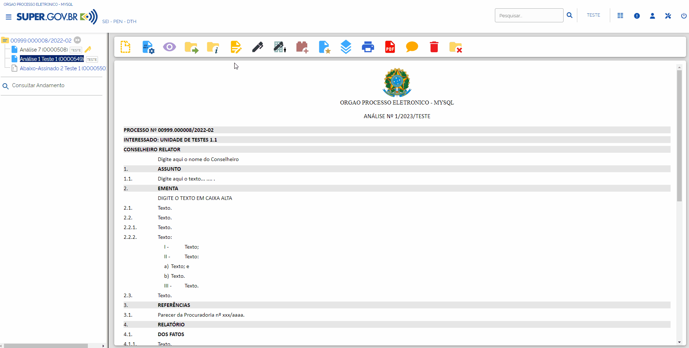

Uma janela para edição do documento será aberta. Após a edição, clique em **Salvar** para concluir a edição realizada.

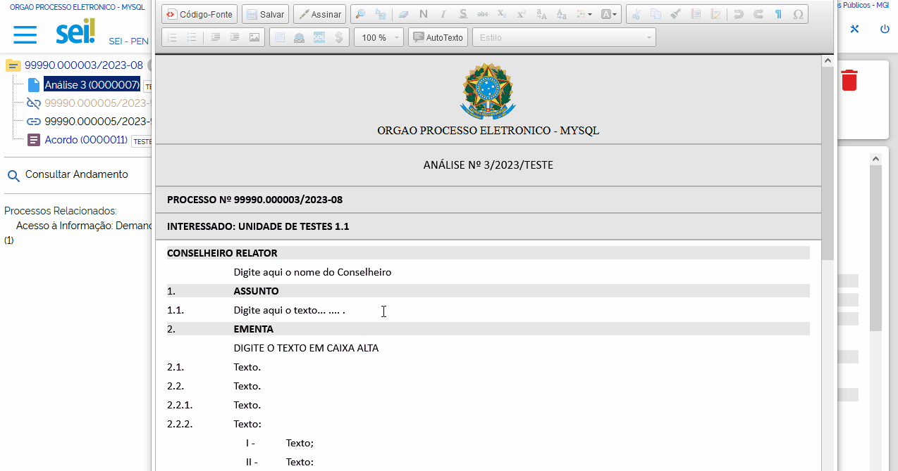

Durante a edição do conteúdo do documento, o usuário poderá utilizar os recursos de formatação disponíveis na Barra de Ferramentas do Editor de Textos. Será possível a inclusão de imagens, links e autotextos, bem como a utilização de estilos de formatação pré-definidos.

.. admonition:: Nota

   O recurso de AutoTexto, disponível no Editor de Textos, possibilita a utilização de um Texto Padrão no conteúdo do documento.

   É possível editar um documento já assinado eletronicamente desde que a caneta ao lado do seu número esteja na cor amarela |caneta_amarela|. Esse ícone indica que o documento foi assinado, mas não foi tramitado e/ou visualizado por usuários de outra unidade. Após a edição será necessário assinar novamente o documento.

.. |caneta_amarela| image:: _static/images/5-OBD-icone_caneta_amarela.png
   :align: middle
   :width: 25

Incluindo Imagens em Documentos
-------------------------------

Ainda na janela de edição do conteúdo do documento, posicione o cursor no local em que será inserida a imagem e clique no ícone **Imagem** |imagem| , disponível na Barra de Ferramentas do Editor de Textos.

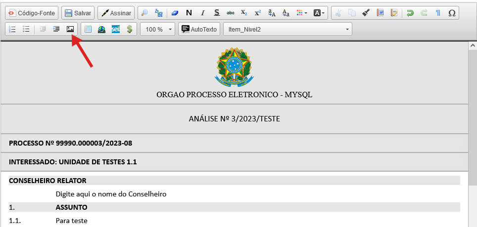

Em seguida, selecione a imagem desejada e clique em **Ok**.

.. figure:: _static/images/5-OBD-editar_documento_imagem_selecao.png

Referenciando Documentos ou Processos
-------------------------------------

Há duas opções para referenciar documentos ou processos no texto:

1) Copiar, na **Árvore do Processo**, o link com o dado a ser referenciado e colá-lo no Editor de Textos.

O usuário deverá clicar no ícone do lado esquerdo do número do processo ou do nome do documento que deseja referenciar.
Será aberto um campo em que o usuário poderá selecionar a forma como quer copiar o dado: 

* como Texto |texto|;
* como Link para o Editor |link|; ou 
* como Link para acesso direto |link_direto|.

.. |texto| image:: _static/images/5-OBD-icone_copiar_texto.png
   :align: middle
   :width: 25

.. |link| image:: _static/images/5-OBD-icone_copiar_link_editor.png
   :align: middle
   :width: 25

.. |link_direto| image:: _static/images/5-OBD-icone_copiar_link_direto.png
   :align: middle
   :width: 25

.. figure:: _static/images/5-OBD-arvore_de_processos_link_processo.png

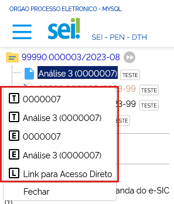

2) Utilizar o ícone “**Inserir um Link para processo ou documento do SEI**”, disponível na Barra de Ferramentas do Editor de Textos.

Ao clicar neste ícone, o sistema abrirá a tela para preenchimento do Protocolo.  O usuário deverá inserir o número do processo ou protocolo do documento a ser referenciado e clicar em **OK**.

.. figure:: _static/images/5-OBD-arvore_de_processos_propriedade_link.png

.. admonition:: Notas

   1. O link inserido no conteúdo do documento permite a recuperação imediata do processo ou documento referenciado.

   2. É possível referenciar processos, documentos do próprio processo ou documentos de outro processo.

   3. Ao copiar dados da Árvore do Processo como Texto e colá-los no Editor de Textos, evitam-se erros de digitação da informação no conteúdo do documento.

   4. A opção de copiar da Árvore do Processo como um Link para acesso direto possibilita o acesso direto ao endereço eletrônico do processo ou documento selecionado. Assim, é possível compartilhar esse link com outros usuários do sistema.

Novas funções da versão 5.0
---------------------------

O novo editor web apresenta um visual mais moderno e melhor usabilidade: novas funções que a versão 5.0 do SEI oferecem para o Usuário.

**01.	permite inclusão de comentários em trechos do texto com visibilidade global, somente unidade ou apenas para o usuário que adicionou.**
A possibilidade de inserir comentários é possível seguindo os seguintes passos: 

Selecionar o texto a ser comentado e clicar no ícone “Inserir Comentário” |icone5.0_Inserir_comentario|

.. |icone5.0_Inserir_comentario| image:: _static/images/5-OBD-icone5.0_Inserir_comentario.png
   :align: middle
   :width: 75

Inserir o comentário sobre o texto selecionado

Selecionar a visibilidade que o comentário pode permitir

.. figure:: _static/images/5-OBD-5.0_Comentario_opcoes.png

Clicar em adicionar.

.. admonition:: Nota:

O comentário foi inserido para a visibilidade selecionada. Junto com o comentário, tem-se os dados da inserção do comentário, bem como a visibilidade permitida, com as respectivas figuras:|Simbolo5.0_Vis_Todos| |Simbolo5.0_Vis_Unidade| |Simbolo5.0_Vis_Usuario|

.. |Simbolo5.0_Vis_Usuario| image:: _static/images/5-OBD-Simbolo5.0_Vis_Usuario.png
   :align: middle
   :width: 50

 
Note que também é possível alterar o conteúdo do comentário clicando em “Alterar” e editar o comentário. 

**02.	Visualização e inclusão de comentários em trechos do documento também por meio da árvore de processo.** 

Ao selecionar o documento na árvore de processos, também é possível a visualização dos comentários, não somente no Editor.

.. figure:: _static/images/5-OBD-5.0_Arvore_Visual_Coment.png

**03.	Melhorias em tabelas com opções para legenda, alinhamento, redimensionamento uniforme de colunas, ordenação de colunas e limpeza de formatação;** 

Ao inserir a tabela no documento, são apresentados botões para serem acionados conforme necessidade

.. figure:: _static/images/5-OBD-5.0_Tabela_Acoes.png

Os recursos novos são: 

|icone5.0_Tabela_Habilitar_Legenda| **Habilitar Legenda**: Possível inserir uma legenda acima ou abaixo da tabela, conforme acionamento das opções;

|icone5.0_Tabela_Alinhar| **Alinhar Tabela**: Permite alinhar a tabela para a esquerda, centralizada, à direita ou alinhada ao recuo do parágrafo, conforme acionamento das opções;

.. |icone5.0_Tabela_Alinhar| image:: _static/images/5-OBD-icone5.0_Tabela_Alinhar.png
   :align: middle
   :width: 75

|icone5.0_Tabela_coluna| **Coluna**: O recurso coluna habilita diversos comandos, a saber: 

- Permite selecionar a coluna cuja célula selecionada seja o “cabeçalho”; 
- Permite inserir uma coluna à esquerda da célula selecionada; 
- Permite inserir uma coluna à direita da célula selecionada; 
- Permite excluir a coluna da célula selecionada; 
- Permite selecionar a coluna da célula selecionada; 
- Permite redimensionar uniformemente a coluna da célula selecionada; 
- Permite ordenar ascendente a coluna da célula selecionada; 
- Permite ordenar descendente a coluna da célula selecionada. 

|icone5.0_Tabela_linha| **Linha**: O recurso Linha habilita diversos comandos, a saber: 

- Permite selecionar a linha cuja célula selecionada seja o “cabeçalho”; 
- Permite inserir uma linha acima da célula selecionada; 
- Permite inserir uma linha abaixo da célula selecionada; 
- Permite excluir a coluna da célula selecionada; 
- Permite selecionar a coluna da célula selecionada.

.. |icone5.0_Tabela_linha| image:: _static/images/5-OBD-icone5.0_Tabela_linha.png
   :align: middle
   :width: 75

|icone5.0_Tabela_Mesclar_celula| **Mesclar células**: O recurso Mesclar Células habilita diversos comandos dependendo da célula selecionada, a saber:

- Permite mesclar com a célula acima da célula selecionada; 
- Permite mesclar com a célula à direita da célula selecionada; 
- Permite mesclar com a célula abaixo da célula selecionada; 
- Permite mesclar com a célula à esquerda da célula selecionada; 
- Permite dividir verticalmente a célula selecionada; 
- Permite dividir horizontalmente a célula selecionada; 

.. |icone5.0_Tabela_Mesclar_celula| image:: _static/images/5-OBD-icone5.0_Tabela_Mesclar_celula.png
   :align: middle
   :width: 75

|icone5.0_Tabela_ProprTab| **Propriedades da Tabela**: O recurso Propriedades da tabela habilita formatações da tabela inteira: 

- Estilo: permite alterar o estilo da tabela; 
- Cor: permite alterar a cor da fonte da tabela; 
- Largura: permite alterar a largura da tabela; 
- Cor de fundo: permite alterar a cor do fundo da tabela; 
- Largura x Altura: permite alterar a proporção de largura x altura da tabela. 

.. |icone5.0_Tabela_ProprTab| image:: _static/images/5-OBD-icone5.0_Tabela_ProprTab.png
   :align: middle
   :width: 75

|icone5.0_Tabela_ProprCel| **Propriedades da Célula**: O recurso Propriedades da célula habilita formatações da célula selecionada: 

- Estilo: permite alterar o estilo da célula; 
- Cor: permite alterar a cor da fonte da célula; 
- Largura: permite alterar a largura da célula; 
- Cor de fundo: permite alterar a cor do fundo da célula; 
- Alinhamento do texto na Célula: permite alterar o alinhamento do texto da célula. 

.. |icone5.0_Tabela_ProprCel| image:: _static/images/5-OBD-icone5.0_Tabela_ProprCel.png
   :align: middle
   :width: 75

|icone5.0_Remover_formatacao| **Remover formatação**: O comando remove a formatação atual da tabela. 

.. |icone5.0_Remover_formatacao| image:: _static/images/5-OBD-icone5.0_Remover_formatacao.png
   :align: middle
   :width: 75

|icone5.0_Tabela_Remover| **Remover tabela**: O comando remove a tabela inteira. 

**04.	Conversão automática de números no texto selecionado para links de protocolos (ao clicar no botão de inclusão de link SEI);**
Ao inserir um número de protocolo, é possível convertê-lo em um link direto para o protocolo: basta selecionar o número do protocolo e clicar no botão “SEI” |icone5.0_Tabela_botaoSEI| ou utilizar a tecla de atalho Ctrl + Shift + I

**05. Mais opções de formatos em listas ordenadas e não ordenadas com possibilidade de combinar as opções desejadas;** 

Outra novidade é a utilização com mais opções nas listas ordenadas (ou listas numeradas) e não ordenadas (ou listas com marcadores), bem como a combinação entre elas. 

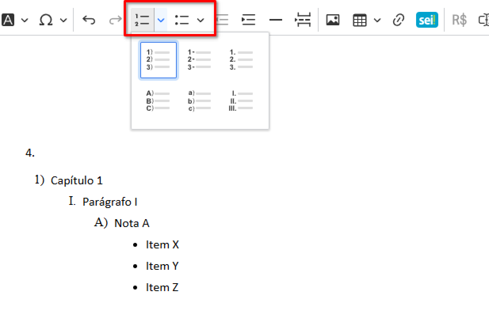

**06. Inclusão de referências no texto;**

A inclusão de referências é uma novidade importante na edição dos textos, pois permite maior embasamento 
Para utilizar esse recurso, após citar a fonte no texto, clique no botão |icone5.0_Inserir_referencia| .

Abrirá uma janela que permite selecionar a inserção de uma nova referência, quanto a referência de uma já citada. 

Selecionar uma dessas opções e clicar no botão “check”. Sendo uma nova referência, o campo Referências, ao final do documento será aberto para inserir os dados da referência citada. O número da referência estará sobrescrito na citação do texto, correspondente ao número da referência.

.. |icone5.0_Inserir_referencia| image:: _static/images/5-OBD-icone5.0_Botao_Inserir_referencia.png
   :align: middle
   :width: 75 

.. figure:: _static/images/5-OBD-5.0_Referencia_texto.png

**07.	Inserção de quebra de página**

Essa função é bastante comum nos editores de texto e foi disponibilizada nessa versão do SEI. 
Para acioná-la, clique no botão |icone5.0_Quebradepg|

.. |icone5.0_Quebradepg| image:: _static/images/5-OBD-icone5.0_Quebradepg.png
   :align: middle
   :width: 75

**08. Linha Horizontal;**

Outro recurso que também é bastante comum nos editores de texto e que foi disponibilizada nessa versão do SEI. 

Para acioná-la, clique no botão |icone5.0_Linha_horiz|

.. |icone5.0_Linha_horiz| image:: _static/images/5-OBD-icone5.0_Linha_horiz.png
   :align: middle
   :width: 75

Versões do Documento
++++++++++++++++++++

Recurso que efetua o controle de versões do documento e permite sua consulta e recuperação. Uma nova versão do documento será gerada sempre que o documento for salvo.

Para consultar e recuperar versões de um documento, acesse o processo, selecione o documento e clique no ícone “**Versões do documento**” |versoes_documento|.

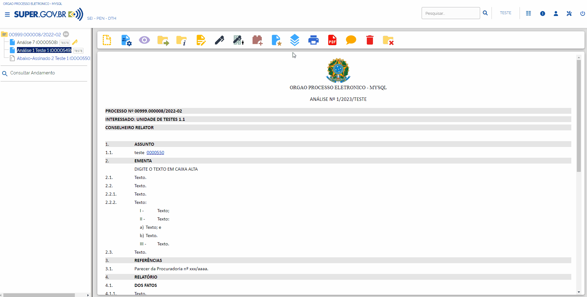

Na tela seguinte, haverá um quadro contendo:

* as versões do documento; 
* a data e hora de cada versão; 
* o usuário; e 
* a unidade responsável por cada versão. 

Para visualizar uma das versões do documento, clique no ícone “**Visualizar Versão**” |visualizar_versao|, na coluna Ações. Para recuperar determinada versão, clique no ícone “**Recuperar Versão**” |recuperar_versao|.

.. figure:: _static/images/5-OBD-tela_versoes_documento.png

Comparando duas versões de um documento
---------------------------------------

É possível comparar duas versões do documento e identificar as alterações efetuadas.

Para isso, na tela **Versões do Documento**, o usuário deverá selecionar duas versões e clicar no botão “**Comparar Versões**”.

.. figure:: _static/images/5-OBD-versoes_documentos_comparacao.gif

Na janela aberta, os itens excluídos ficarão marcados com a cor vermelha e os itens incluídos, com a cor azul.

.. figure:: _static/images/5-OBD-versoes_documentos_comparacao_documento.gif

Consultar/Alterar Documentos
++++++++++++++++++++++++++++

Recurso destinado a consulta ou alteração dos dados de cadastro do documento.

Para consultar ou alterar documentos, acesse o processo, selecione o documento e clique no ícone “**Consultar/Alterar Documento**” |consultar_documento|, disponível na Barra de Ícones do documento.

.. |consultar_documento| image:: _static/images/5-OBD-icone_consultar_alterar_documento.png
   :align: middle
   :width: 30

.. figure:: _static/images/5-OBD-alterar_documento_tela_processo.gif

Será aberta a tela **Alterar Documento**. O usuário poderá realizar as alterações necessárias e, em seguida, clicar no botão Salvar.

.. figure:: _static/images/5-OBD-alterar_documento_formulario.gif

.. admonition:: Notas

   1. Para alteração dos dados de cadastramento do processo, o usuário deverá acessar o processo e clicar no ícone Consultar/Alterar Processo |consultar_processo|, disponível na Barra de Ícones do processo.

   2. Qualquer unidade em que o processo tenha tramitado poderá inserir informações no campo Observações desta unidade. O preenchimento desse campo auxilia na Pesquisa do processo ou do documento realizada pela unidade que o preencheu.

.. |consultar_processo| image:: _static/images/5-OBD-icone_consultar_alterar_processo.png
   :align: middle
   :width: 25

Assinar Documento Interno
+++++++++++++++++++++++++

Recurso destinado a assinatura de documentos gerados no SEI.

Para o usuário assinar um documento interno, deverá selecionar o documento desejado e clicar no ícone **Assinar Documento** |assinatura_preta|.

.. |assinatura_preta| image:: _static/images/9-B-icone_assinatura_preta.png
   :align: middle
   :width: 30

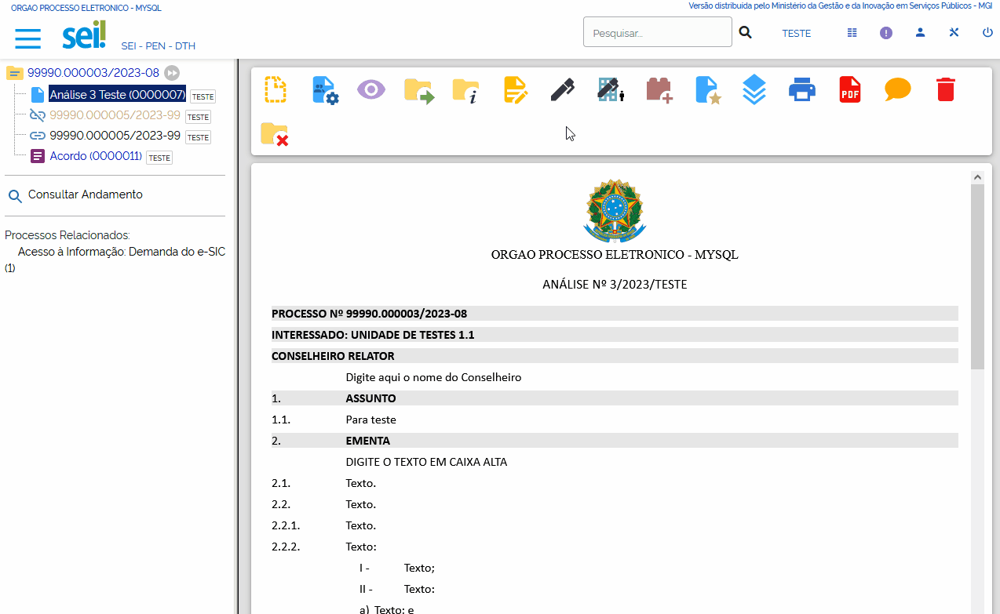

.. admonition:: Nota

   Também será possível assinar um documento no próprio **Editor de Textos**, por meio do botão |botao_assinatura_preta| , disponível na Barra de Ferramentas.

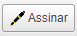

Na janela de assinatura do documento, o usuário deverá conferir as informações existentes nos campos **Órgão do Assinante** e **Assinante**; e preencher o campo **Cargo/Função**. A forma de assinatura poderá ser:

- Pela autenticação por senha – neste caso, o usuário deverá inserir a senha de login SEI no campo **Senha** e em seguida clicar em **Assinar**; ou

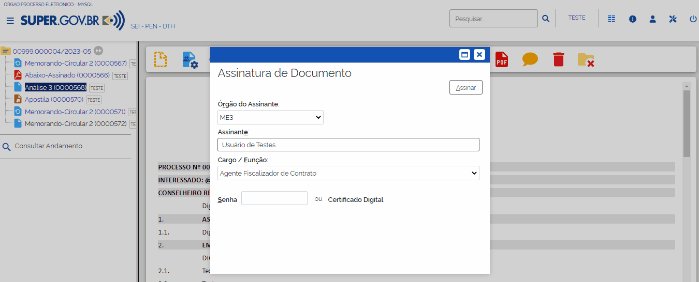

- Pelo certificado digital: neste caso, o usuário deverá clicar no botão **Certificado Digital**.

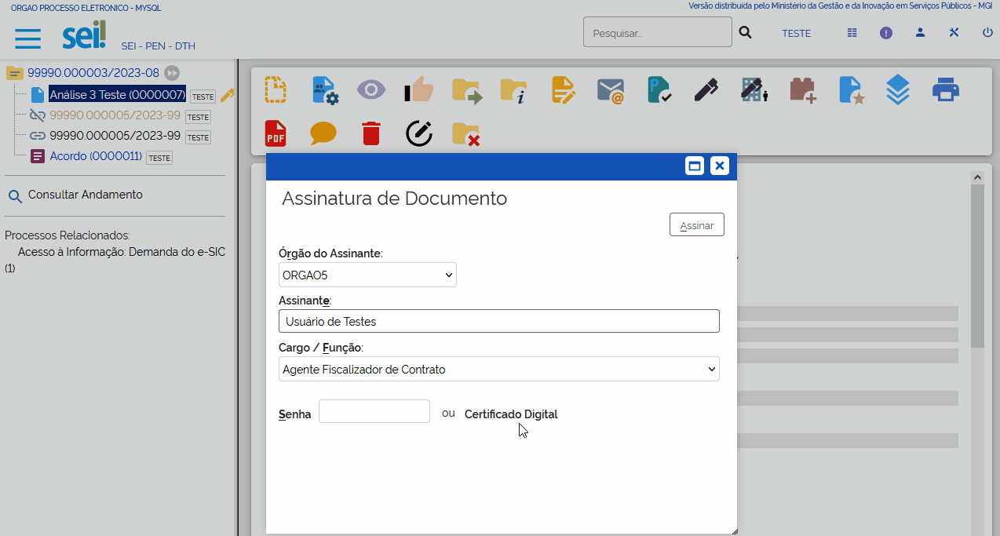

.. admonition:: Nota

   Para a realização da assinatura por certificado digital o usuário deverá ter o Java versão 8 ou superior, e o “Assinador de Documentos com Certificado Digital” instalados em seu computador.

   - Para Windows: download da versão 1.1.0 do programa de instalação
   - Para Linux ou MacOS: download do arquivo JAR. Para executar com o Java Runtime faça um duplo clique sobre o arquivo ou utilize a linha de comando:
   
    java -jar assinador_sei_1.1.0.jar
   
    **OBS:** esta opção também pode ser utilizada no Windows caso ocorra algum problema com o programa de instalação.

Na tela seguinte clicar no botão **Disponibilizar dados para o assinador**.

.. figure:: _static/images/5-OBD-assinatura_documento_disponibilizar_dados_assinador.png

O usuário será direcionado ao programa **Assinador de Documentos com Certificado Digital**, nele, solicitar o processamento via clique no botão **Processar dados de assinatura...**. Após a exibição dos documentos proceder com a assinatura por meio do botão **Assinar Documentos**.

.. admonition:: Notas

   1. O botão “Ajuda” trará informações mais detalhadas do programa “Assinador de Documentos com Certificado Digital”.
   2. O programa assinador poderá ser mantido aberto para realização de outras assinaturas, se necessário.

Após a assinatura, o documento será visualizado da seguinte forma:

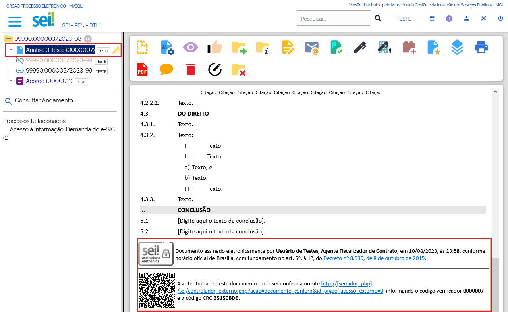

O rodapé do documento conterá as informações relacionadas a sua assinatura eletrônica e trará link para conferência da sua autenticidade.

Além disso, ao assinar um documento, o ícone **caneta amarela** |assinatura_amarela| ficará disponível ao lado do número do documento, indicando que ele foi assinado, mas ainda não foi acessado por usuários de outra unidade. Nesse caso, ainda é permitida sua edição.

Quando o documento assinado for acessado por usuários de outra unidade, o ícone ao lado do documento passará para **caneta preta** |assinatura_preta|. Nesse caso, sua edição não é permitida.

.. |assinatura_preta| image:: _static/images/9-B-icone_assinatura_preta.png
   :align: middle
   :width: 30

.. |assinatura_amarela| image:: _static/images/5-OBD-icone_caneta_amarela.png
   :align: middle
   :width: 30

.. admonition:: Notas

   1. O documento pode conter quantas assinaturas forem necessárias. Porém, se o documento necessitar da assinatura de usuários de unidades diferentes, será preciso disponibilizá-lo em um Bloco de Assinatura. Para mais informações, acessar o Item **Bloco de Assinaturas**.

   2. É possível obter informações sobre as assinaturas posicionando o cursor ou clicando sobre o ícone da caneta ao lado do número do documento.

Excluir Documento Interno ou Externo
++++++++++++++++++++++++++++++++++++

Em casos específicos, é possível a exclusão de documentos do processo.

Para excluir um documento, acesse o processo, selecione o documento que deseja excluir e clique no ícone “Excluir” |Excluir_documento|, disponível na Barra de Ícones.

.. |Excluir_documento| image:: _static/images/5-OBD-icone_excluir.png
   :align: middle
   :width: 15

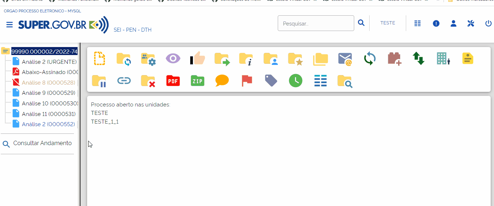

Ao clicar no ícone, será necessário confirmar a operação para exclusão do documento.

.. figure:: _static/images/5-OBD-excluir_documento_ok.png

.. admonition:: Notas

   1. O ícone “**Excluir**” |Excluir_documento| ficará visível na Barra de Ícones do documento somente quando o procedimento de exclusão for permitido.

   2. Documentos que poderão ser excluídos do processo:
   
   a) Documento gerado e não assinado.
   b) Documento gerado, assinado e com a caneta amarela |caneta_amarela| (ainda não tramitado ou visualizado por outra pessoa/unidade).
   c) Documento externo que ainda não tramitou, não foi visualizado por outra unidade e não foi concluído e reaberto.

   3. O documento excluído não ficará disponível na Árvore do Processo. 

   4. O ícone “**Excluir**” |Excluir_documento| ficará visível também na Barra de Ícones do processo quando o procedimento de exclusão do processo for permitido.

   5. A partir da **versão 5.0**, o SEI conta com um novo recurso: a Lixeira. A Lixeira disponibiliza temporariamente os conteúdos de documentos excluídos/cancelados. O próprio usuário que executou a ação poderá fazer o download do conteúdo.

.. |Excluir_documento| image:: _static/images/5-OBD-icone_excluir.png
   :align: middle
   :width: 15

.. |caneta_amarela| image:: _static/images/5-OBD-icone_caneta_amarela.png
   :align: middle
   :width: 25

Cancelar Documento
++++++++++++++++++

Recurso destinado ao cancelamento de documentos que já tenham sido visualizados ou tramitados, ou seja, que não possuem os requisitos para o procedimento de exclusão.

Para cancelar um documento, acesse o processo, selecione o documento e clique no ícone “**Cancelar Documento**” |cancelar_documento|. Para realizar o cancelamento, será necessária a inclusão do motivo do cancelamento. Após o preenchimento, clique em Salvar.

.. |cancelar_documento| image:: _static/images/5-OBD-icone_cancelar_documento.png
   :align: middle
   :width: 25

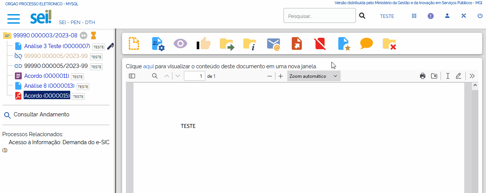

Após esse procedimento, o documento permanecerá na Árvore do Processo, com seu nome esmaecido e com o ícone de cancelamento à sua esquerda, porém não será possível acessar seu conteúdo. Ao posicionar o cursor sobre seu nome, será possível visualizar o motivo do cancelamento.

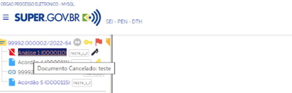

.. admonition:: Notas

   1. O cancelamento de documentos só é permitido aos usuários da unidade em que o documento foi gerado ou inserido.

   2. O ícone “Cancelar Documento” |cancelar_documento| não será exibido na Barra de Ícones, se ainda for possível excluir ou alterar o conteúdo do documento.

   3. Só será permitido o cancelamento de um documento que não caiba mais edição ou exclusão, ou seja, documentos que tiveram sua tramitação ou ciclo de assinaturas completo.
