Operações Básicas com processos
===============================

Iniciar Processo
++++++++++++++++

Para iniciar um processo no SEI, o usuário deve clicar em “**Iniciar Processo**” no menu principal.

.. figure:: _static/images/2-OBCP_Tela_Controle_Iniciar_Processo.gif

Será exibida uma tela com os tipos de processos já utilizados na unidade.

Para exibir todos os tipos de processos existentes no órgão, selecione o ícone “**Exibir todos os tipos**”  |exibir_todos|, ao lado do título “**Escolha o Tipo do Processo**”.

.. figure:: _static/images/2-OBCP_escolha_tipo_processo.gif

Com a lista de tipos de processos expandida, preencha um termo, no campo de pesquisa para localizar o tipo desejado; e, em seguida, clique na opção escolhida.

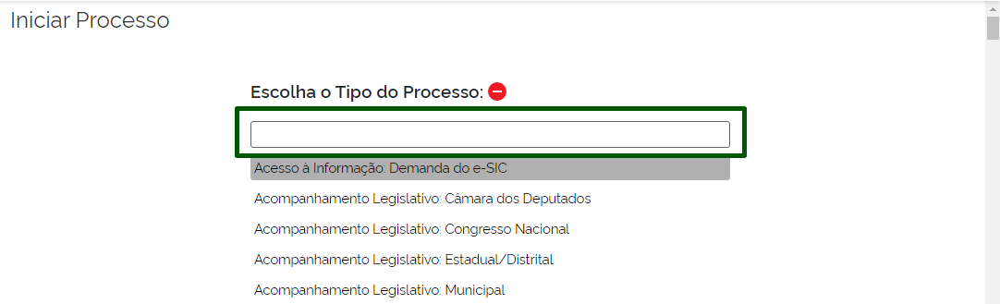

Se desejar voltar à tela anterior, selecione o ícone “**Exibir apenas os tipos já utilizados pela unidade**” |exibir_utilizados|.

.. |exibir_utilizados| image:: _static/images/2-OBCP_Atribuir_icone_Exibir_apenas_utilizados.png
   :align: middle
   :width: 25

Ao clicar sobre o tipo do processo desejado, na tela “**Iniciar Processo**”, aparecerão os campos para cadastramento dos metadados do processo.

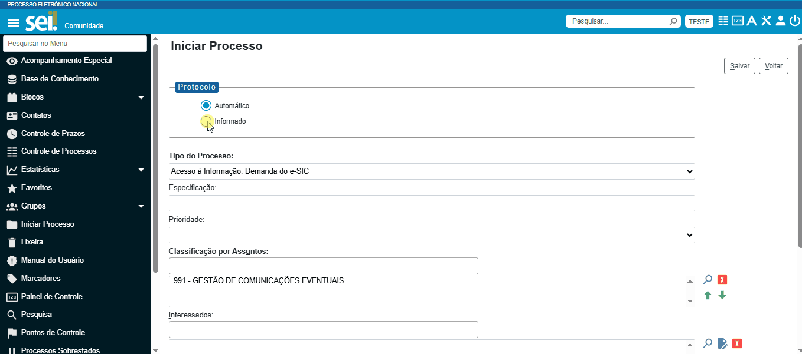

O campo “**Tipo do Processo**” aparece preenchido com o tipo selecionado, e o campo “**Classificação por Assuntos**” é preenchido automaticamente, de acordo com o Tipo do Processo selecionado. O usuário poderá clicar duas vezes sobre o Código/Descrição registrado no campo, para obter mais informações a respeito daquela classificação. 

Cumpre informar que o campo “**Classificação por Assuntos**” não deve ser alterado sem a orientação da área de gestão documental do órgão.

.. admonition:: Nota

   A inclusão de um tipo de processo inexistente no sistema deverá ser solicitada à unidade responsável pela gestão documental do órgão.

Os demais campos são os seguintes:

* **Especificação:** Insira informações que detalhem o processo em questão. Essas informações serão exibidas, juntamente com o tipo do processo, ao posicionar o cursor sobre o número do protocolo, na tela Controle de Processos.

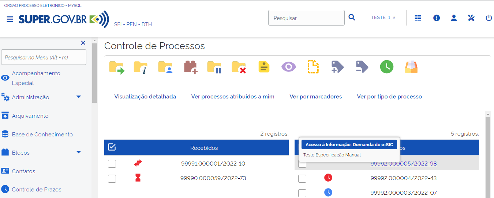

* **Interessados:** Insira o nome do(s) interessado(s) no mérito do processo, podendo ser pessoa física ou jurídica.

* **Observações desta unidade:** Insira informações adicionais que facilitem a identificação e a recuperação do processo. 

O campo “**Observações desta unidade**” poderá ser preenchido por cada unidade em que o processo tramitar. As observações inseridas por outras unidades aparecerão, na tela **Alterar Processo**, separadamente, na **Lista de observações de outras unidades**. Não há possibilidade de uma unidade alterar as observações inseridas por outras unidades.

* **Nível de Acesso:** Campo utilizado para indicar **quem pode ter acesso ao conteúdo do processo**. No sistema, os níveis de acesso se dividem em três, sendo obrigatória a marcação de uma das opções:
     
   - *Público*: processos e seus documentos assinados disponíveis para visualização de todos os usuários do órgão.

   - *Restrito*: processos e seus documentos disponíveis para visualização de usuários das unidades pelas quais o processo tramitar. Ao selecionar essa opção o sistema exibirá campo para seleção da hipótese legal de restrição. A indicação da hipótese é obrigatória e deverá seguir a legislação em vigor.
   
   - *Sigiloso*: processos e seus documentos disponíveis apenas para usuários com permissão específica e previamente credenciados. Para marcar essa opção é necessário que o administrador do sistema indique previamente que esse Tipo de Processo pode ser marcado dessa maneira.

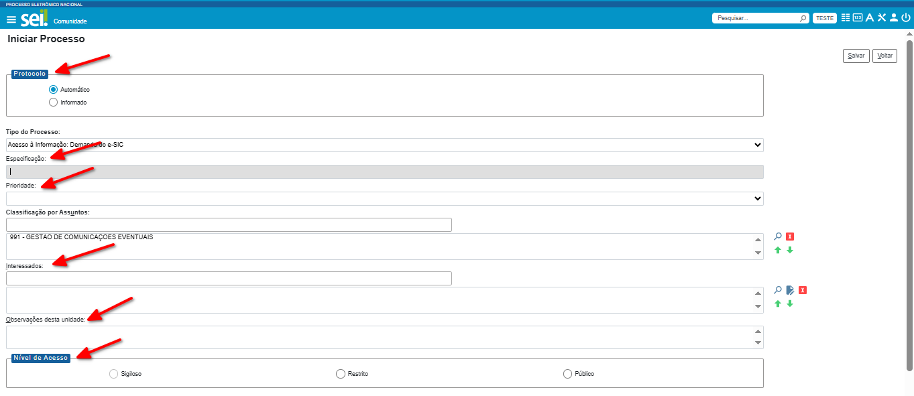

.. admonition:: Notas

   1. É uma boa prática a adoção de padrões de preenchimento dos campos “Especificação”, “Interessados” e “Observações desta unidade”, uma vez que esses campos auxiliam na identificação e na recuperação dos processos.
   
   2. Conforme as orientações mais recentes do Gabinete de Segurança Institucional da Presidência da República, não é permitido tramitar documentos classificados – Reservados, Secretos ou Ultrassecretos – nos termos do Art. 23 da Lei nº 12.527, de 10 de agosto de 2011, a Lei de Acesso à Informação (LAI) pelo SEI. 

Após o preenchimento dos campos de cadastramento dos metadados do processo, clique no botão Salvar. Assim, será criado um NUP e será aberta a tela do processo para que possam ser incluídos documentos.

Receber Processos na Unidade
+++++++++++++++++++++++++++++

A tela Controle de Processos (tela inicial do sistema) organiza todos os documentos abertos na unidade em dois grupos: a coluna da esquerda apresenta os processos recebidos, e a da direita, os processos gerados na unidade.

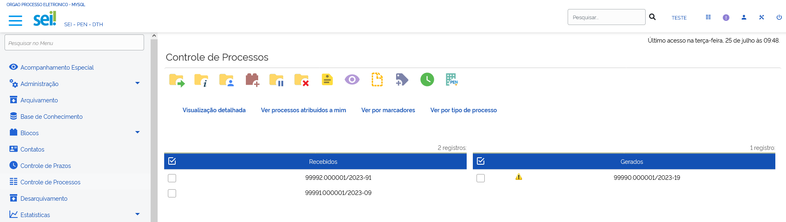

Para confirmar o recebimento de um processo, basta clicar sobre o seu número, que aparece em vermelho. O SEI registra no andamento do processo a hora, a unidade e o usuário que efetuou o recebimento.

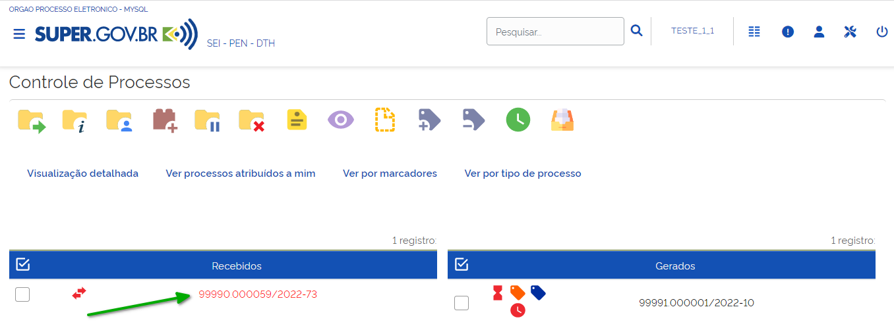

.. admonition:: Notas

   1. Quando um processo está em vermelho significa que ainda não foi recebido na unidade. O processo nessa cor aparecerá, exclusivamente, na coluna Recebidos.
   
   2. Quando um processo ou documento está em azul, significa que ele já foi acessado pelo usuário naquela sessão do sistema. Ao efetuar o logoff no SEI e entrar novamente no sistema, os processos e documentos não estarão mais marcados com essa cor.

Atribuir processos a um usuário
+++++++++++++++++++++++++++++++++

Recurso que possibilita a distribuição de processos entre os usuários da unidade.

Para atribuir um processo a um usuário, na tela **Controle de Processos**, clique na caixa de seleção ao lado do número do(s) processo(s) a ser(em) atribuído(s) e, em seguida, no ícone **Atribuição de Processos** |atribuir|.

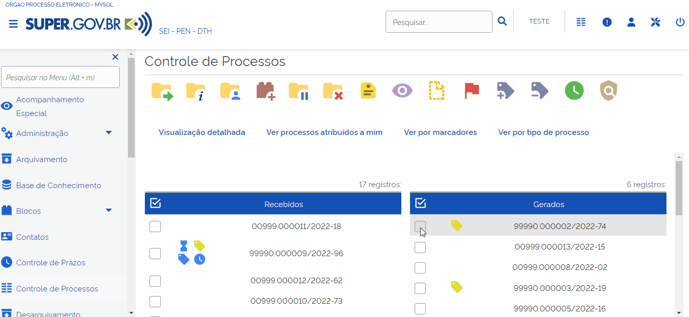

Selecione um nome de usuário, por meio da caixa “**Atribuir para**”, e clique em Salvar.

.. figure:: _static/images/2-OBCP_Tela_Controle_Atribuir_Processo_indicacao_usuario.png

Os processos atribuídos aparecem com a identificação do usuário em destaque ao lado de seu número.

.. figure:: _static/images/2-OBCP_Tela_Controle_Atribuir_Processo_identificacao_usu.png

Como visualizar somente os processos atribuídos ao usuário logado
-----------------------------------------------------------------

Para visualizar, na tela Controle de Processos, apenas os processos atribuídos ao usuário que está acessando o sistema, clique no filtro “**Ver processos atribuídos a mim**”.

.. figure:: _static/images/2-OBCP_Tela_Controle_filtro_processos_atribuidos_a_mim.png

E, para retornar à visualização de todos os processos da unidade, clique no ícone “**Remover filtro de processos atribuídos a mim**”.

Também é possível visualizar todos os processos atribuídos a um outro usuário da unidade. Para isso, basta clicar no nome do usuário desejado, exibido ao lado do processo.

.. figure:: _static/images/2-OBCP_Tela_Controle_filtro_processos_atribuidos_a_mim_aplicado.png

Como consultar ou redistribuir os processos atribuídos a um usuário específico
-------------------------------------------------------------------------------

Na tela Controle de Processos, clique no link com o nome do usuário à direita do processo.

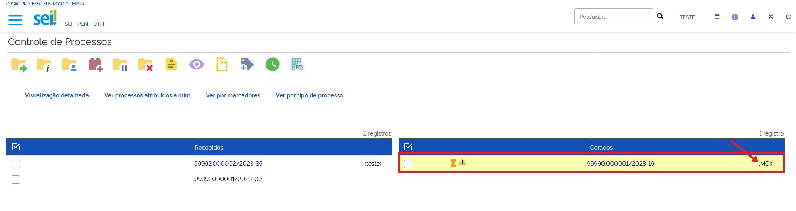

O usuário será direcionado para a tela **Atribuições de Processos**. Nessa tela serão visualizados todos os processos atribuídos ao usuário e será possível atribuí-los a outro usuário. Para isso, basta marcar a caixa de seleção à esquerda do número do processo; selecionar um nome de usuário disponível na caixa Atribuir para; e clicar no botão Salvar.

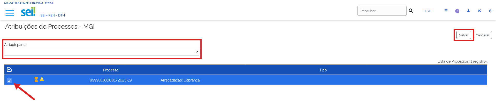

.. admonition:: Notas

   1. A Atribuição de Processo a um usuário não impede que outros usuários da unidade atuem no processo, caso haja necessidade.
   
   2. Para remover a Atribuição de Processo, siga as mesmas orientações sobre Atribuir Processo a um usuário, entretanto deixe a caixa “**Atribuir para**” em branco.

Enviar processos para outra unidade
++++++++++++++++++++++++++++++++++++

Recurso utilizado para tramitar processos para outra unidade. Na tela **Controle de Processos**, marque a caixa de seleção ao lado do número do processo e clique no ícone “**Enviar Processo**” |Enviar| , ou acesse o processo e clique no mesmo ícone, na Barra de Ícones superior.

.. |Enviar| image:: _static/images/1-IO_icone_Enviar_Processo.png
   :align: middle
   :width: 35

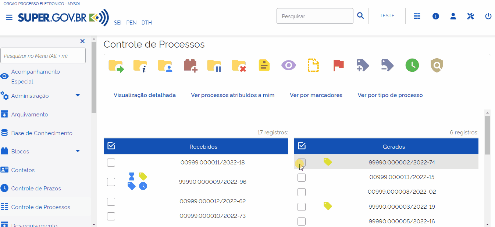

Na tela Enviar Processo, informe, na caixa “Unidades”, as unidades de destino. O processo poderá ser enviado para uma ou para várias unidades concomitantemente.

.. admonition:: Nota

   Ao lado do campo “Unidades”, encontra-se o link "Mostrar unidades por onde tramitou”. Por meio desse link, o usuário poderá selecionar uma das unidades em que o processo tramitou para preencher o campo Unidades.

Além da unidade de destino, o usuário poderá informar:

* Se deseja manter o processo aberto, ao selecionar a opção “**Manter processo aberto na unidade atual**”;
* Se deseja remover as anotações incluídas na unidade, ao selecionar a opção “**Remover anotação**”. Ao contrário do que parece, uma anotação nunca é tramitada com o processo, sendo um registro exclusivo da unidade que a criou. Então, quando a opção “**Remover anotação**” é selecionada, ela impede que o processo, quando tramitado de volta para a unidade, exiba a mesma anotação ao retornar.
* Se deseja enviar um email de notificação à unidade destinatária, ao selecionar a opção “**Enviar e-mail de notificação**”;
* Se deseja definir uma data de Retorno Programado, ao selecionar:

    * Data certa: para estabelecimento de uma data específica para retorno; ou
    * Prazo em dias: para indicação do prazo em dias para retorno da questão. O usuário poderá indicar, ainda, se este prazo será contado em dias úteis ou corridos.

Após o preenchimento dos campos, basta clicar no botão **Enviar**.

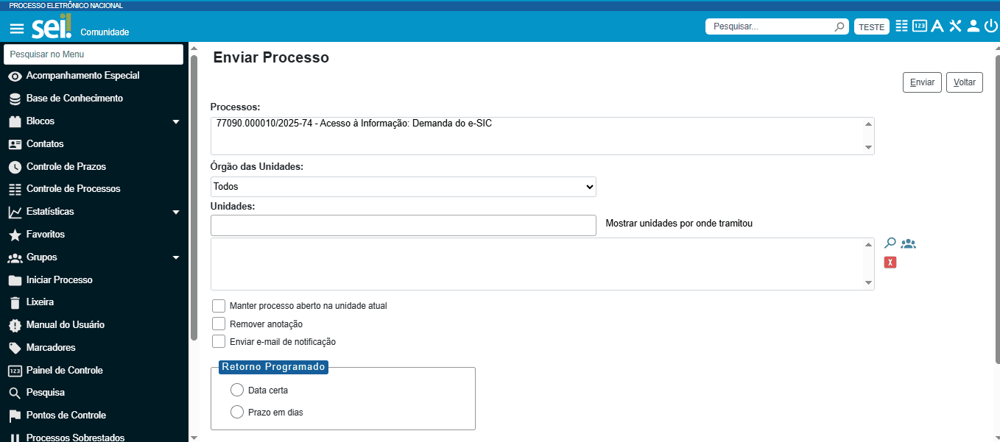

.. admonition:: Notas

   1. O envio de um processo a várias unidades simultaneamente é recomendado nos casos em que as atividades a serem realizadas por cada unidade sejam independentes entre si. O objetivo dessa funcionalidade é reduzir o tempo gasto para conclusão do processo, porém o encadeamento de ações que dependem uma da outra deve ser respeitado. 

   2. Na tela do processo, ao lado de seu número, encontra-se o ícone “**Filtrar Linha Direta**” |Linha_direta| . Esse recurso permite exibir, na Árvore do Processo, apenas os documentos gerados por unidades que tiveram comunicação direta com a unidade em que o usuário está acessando o sistema, ou seja, unidades que enviaram o processo para a unidade atual ou receberam o processo da unidade atual. Portanto, ao utilizar esse recurso, não serão exibidos todos os documentos do processo.

.. |Linha_direta| image:: _static/images/2-OBCP_icone_filtrar_linha_direta.png
   :align: middle
   :width: 25

Concluir Processos
+++++++++++++++++++

Recurso utilizado para concluir o processo quando não há mais nenhuma ação a ser executada pela unidade ou quando o processo alcançou seu objetivo.
Para concluir o processo, o usuário deverá acessar o processo ou qualquer documento constante em sua Árvore e clicar no ícone “**Concluir Processo**” |concluir|, disponível na Barra de Ícones do processo e do documento.

.. |concluir| image:: _static/images/1-IO_icone_concluir_processo.png
   :align: middle
   :width: 35
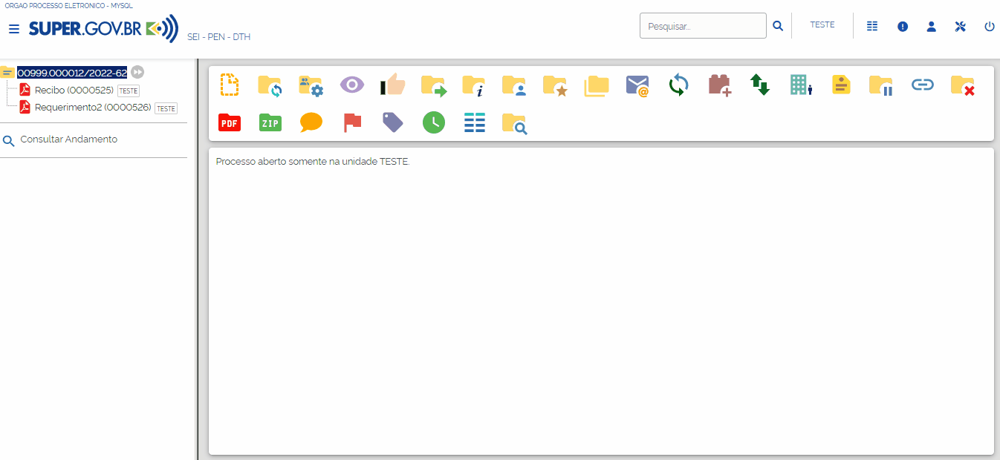

Ao realizar esta ação, o processo não constará da tela de Controle de Processos, podendo ser acessado de outras maneiras, como pela opção de pesquisa ou pelas Estatísticas da Unidade.

Concluir um Grupo de Processos
-------------------------------

Na tela Controle de Processos, assinale a caixa de seleção dos processos desejados e clique no ícone “**Concluir Processo**” |concluir|. Todos os processos serão concluídos automaticamente.

.. |concluir| image:: _static/images/1-IO_icone_concluir_processo.png
   :align: middle
   :width: 35

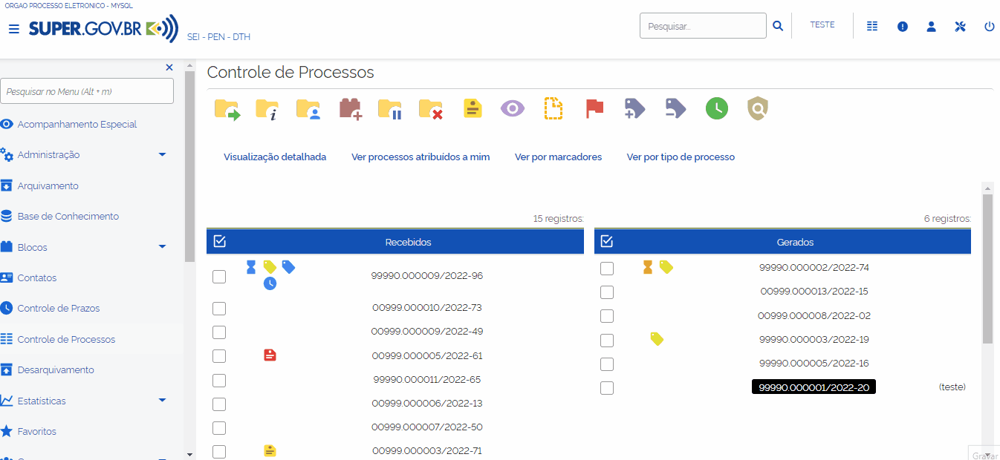

.. admonition:: Notas

   1. A conclusão do processo em uma unidade não acarreta sua conclusão nas outras unidades em que esteja aberto.
   
   2. Ao enviar um processo a outra unidade, a conclusão é realizada automaticamente pelo sistema, desde que, na tela “**Enviar Processo**”, não seja marcada a opção “**Manter processo aberto na unidade atual**”.

   3. Para fins de estatística, o tempo em que o processo permanecer aberto, mesmo sem atividade da unidade, será computado como se ele estivesse em andamento.

Reabrir processos
+++++++++++++++++

Recurso utilizado para reabrir os processos concluídos que, em algum momento, tramitaram na unidade.

Para reabrir um processo, o usuário deverá localizar o processo, por exemplo, por meio da funcionalidade “**Pesquisa**” ou outra forma de localizá-lo, acessá-lo e clicar no ícone “**Reabrir Processo**” |reabrir|, disponível na Barra de Ícones.

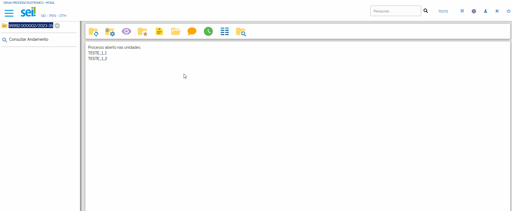

.. admonition:: Notas

   1. O processo poderá ser reaberto, a qualquer momento, nas unidades em que tramitou. Não será necessário solicitar novo trâmite.
   
   2. O processo reaberto será automaticamente atribuído ao usuário que o reabriu.

   3. Para apenas consultar um processo que já tramitou pela unidade não é necessário reabri-lo. Essa ação deve ser executada apenas quando for necessário tomar novas providências no referido processo.     