Operações de manutenção e acompanhamento de processos
=====================================================

Retorno programado
++++++++++++++++++++++++++

Ao enviar um processo a outra unidade, o usuário poderá definir um prazo para retorno do processo. Para isso, na tela “**Enviar Processo**”, ele deverá marcar uma das opções apresentadas no campo “**Retorno Programado**” e preencher a data ou o prazo, conforme o caso.

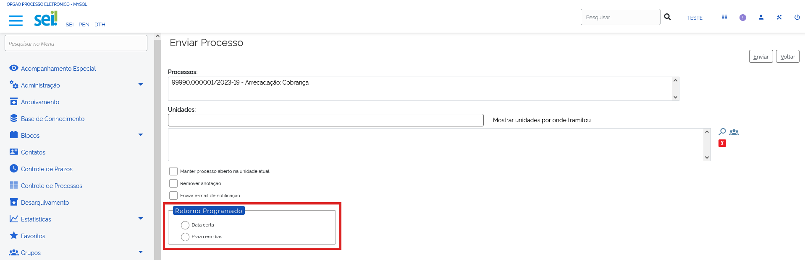

Os processos recebidos na unidade com uma data de retorno programada apresentarão, ao seu lado, um dos ícones seguintes: 

|devolucao_cumprida| (ícone azul) – **Devolução Cumprida**. Assim, ao posicionar o cursor sobre esse ícone, serão mostradas a data do retorno programado, a data da devolução e a unidade que devolveu o processo.;

.. |devolucao_cumprida| image:: _static/images/1-IO_icone_RP_concluido.png
   :align: middle
   :width: 30

|para_devolver| (ícone laranja) - **Para Devolver**, dentro do prazo. Assim, ao posicionar o cursor sobre esse ícone, serão mostradas a data e a quantidade de dias para devolução do processo e a unidade que definiu a data de retorno; e

.. |para_devolver| image:: _static/images/1-IO_icone_RP_a_vencer.png
   :align: middle
   :width: 30

|para_devolver_expirado| (ícone vermelho) - **Para Devolver**, expirado (atrasado). Assim, ao posicionar o cursor sobre esse ícone, serão mostradas a data e a quantidade de dias de atraso na devolução do processo e a unidade que definiu a data de retorno.

.. |para_devolver_expirado| image:: _static/images/1-IO_icone_RP_atrasado.png
   :align: middle
   :width: 35

Esses ícones aparecerão tanto na tela do processo, ao lado do seu número, quanto na tela Controle de Processos.

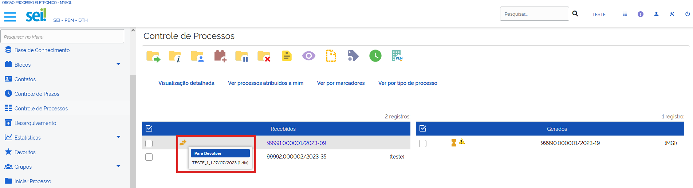

Processos enviados pela unidade com Retorno Programado
-------------------------------------------------------

Os processos enviados pela unidade com uma data de retorno programada apresentarão, ao seu lado, um dos ícones seguintes: 

|retorno_cumprido| (ícone azul) - **Retorno Cumprido**. Indica que o processo foi enviado pela unidade com prazo de retorno programado e foi retornado antes do prazo. Assim, ao posicionar o cursor sobre esse ícone, serão mostradas a data programada para o retorno, a data em que o processo foi retornado e a unidade que retornou o processo.

.. |retorno_cumprido| image:: _static/images/1-IO_icone_retorno_cumprido.png
   :align: middle
   :width: 25

|aguardando_retorno| (ícone laranja) - **Aguardando Retorno**, dentro do prazo. Indica que o processo foi enviado pela unidade com prazo de retorno programado e encontra-se dentro do prazo de devolução. Assim, ao posicionar o cursor sobre esse ícone, serão mostradas a data e a quantidade de dias para retorno do processo e a unidade para a qual o processo foi enviado.

.. |aguardando_retorno| image:: _static/images/1-IO_icone_RP_aguardando_retorno.png
   :align: middle
   :width: 25

|aguardando_retorno_atrasado| (ícone vermelho) - **Aguardando Retorno**, expirado (atrasado). Indica que o processo foi enviado pela unidade com prazo de retorno programado e o prazo para retorno já se expirou (está atrasado). Assim, ao posicionar o cursor sobre esse ícone, serão mostradas a data programada para o retorno, a quantidade de dias de atraso na devolução do processo e a unidade para a qual o processo foi enviado.

.. |aguardando_retorno_atrasado| image:: _static/images/1-IO_icone_RP_devolucao_atrasada.png
   :align: middle
   :width: 25

.. admonition:: Nota
   
   No caso da existência de vários prazos de retorno definidos para o mesmo processo, ao posicionar o cursor sobre o ícone correspondente a ele, serão apresentadas todas as informações a respeito dos prazos determinados (em andamento, atrasados e cumpridos). Este comportamento ocorre tanto na unidade que recebe o processo quanto na unidade que envia o processo.

Controle dos Retornos Programados da unidade
--------------------------------------------

Para verificar a relação dos processos com Retornos Programados na unidade, acesse a opção “**Retorno Programado**”, disponível no **Menu Principal**.

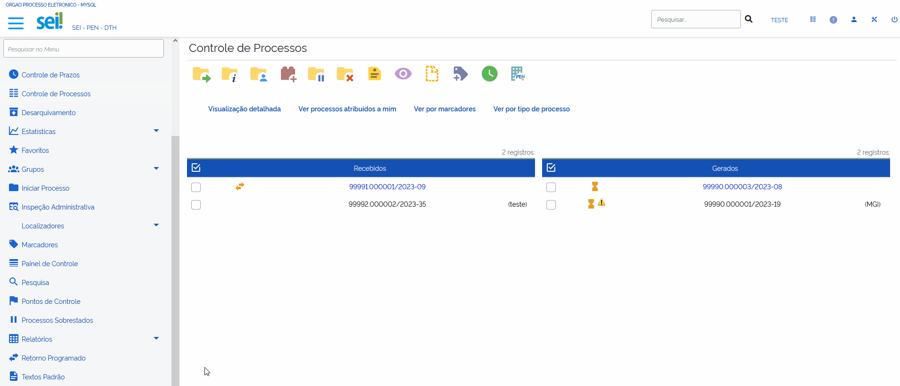

Na tela “**Retorno Programado**”, o usuário visualiza os Processos aguardando retorno de outras unidades e os Processos para devolução, com todas as informações correspondentes.

Além disso, há um calendário para que o usuário possa selecionar o mês ou dia desejado para visualização dos retornos programados.

Os dias com marcação de retorno estarão sinalizados no calendário em amarelo (as datas a vencer ou os prazos cumpridos até a data estabelecida) ou em vermelho (prazos expirados).

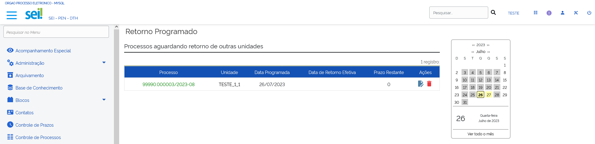

Na tela “**Retorno Programado**”, por meio da coluna Ações, a unidade que definiu o retorno poderá Alterar Retorno |alterar| ou Excluir Retorno |excluir|, caso a unidade demandada não tenha retornado o processo na data definida.

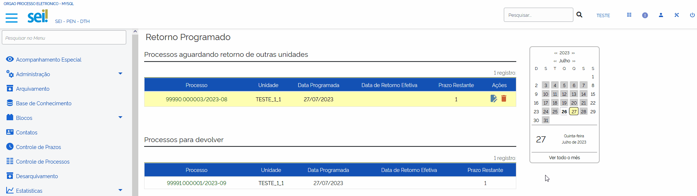

.. admonition:: Notas

   1. O Retorno Programado apenas determina prazos. Essa funcionalidade não retira o acesso ao processo caso a demanda não seja atendida no prazo e não retorna o processo automaticamente à unidade demandante ao final do prazo. 

   2. A unidade destinatária de um processo com Retorno Programado pode enviá-lo para outras unidades (controle de prazos em cascata), desde que o mantenha aberto na própria unidade; ou pode devolvê-lo para a unidade que demandou o retorno.

   3. Para cessar a contagem do prazo, é necessário enviar o processo à unidade que demandou o retorno. A simples conclusão do processo não encerra a contagem do prazo.

   4. O prazo alterado pelo demandante na opção Alterar Retorno |alterar| permite apenas a prorrogação dos prazos, não sendo possível a redução do prazo inicial.
   

.. figure:: _static/images/3-OBCP_tela_retorno_programado_mensagem.gif

Controle de prazos
++++++++++++++++++

Diferentemente do **Retorno Programado**, essa ferramenta é utilizada para administração de prazos dentro da unidade. É uma funcionalidade de organização interna. Dessa forma, outras unidades não terão acesso ao Controle de Prazos da unidade.

Para criar um controle de prazo, acesse o processo e clique no ícone “**Controle de Prazos**” |Controle_prazo|, disponível na **Barra de Ícones**.

.. |Controle_prazo| image:: _static/images/1-IO_icone__cotrole_de_prazos.png
   :align: middle
   :width: 25

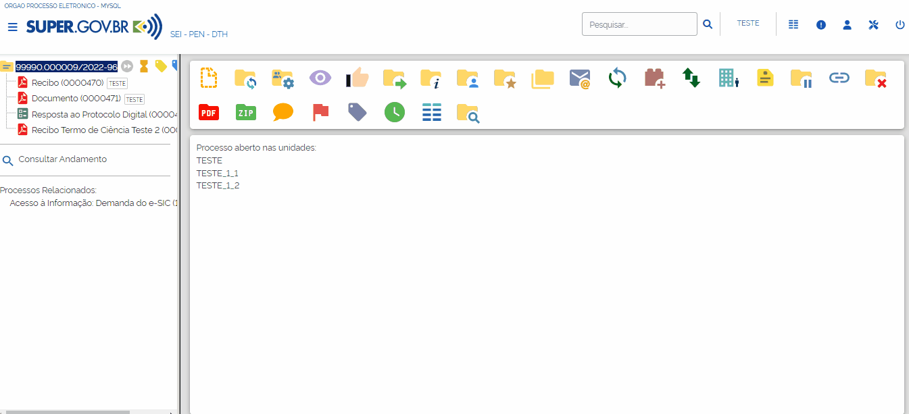

A tela “Definir Controle de Prazo” será aberta. Nela, serão exibidas as seguintes opções:

* **Data certa**: o usuário poderá digitar uma data, no campo disponível, ou clicar no ícone **Selecionar Prazo** e marcar uma data no calendário, a fim de definir o Controle de Prazo no processo.

* **Prazo em dias**: o usuário deverá digitar, no campo disponível, a quantidade de dias até o fim do prazo desejado. Se preferir, o prazo poderá ser contado em dias úteis. Para isso, será necessário marcar a caixa de seleção **Úteis**.

* **Concluir**: o usuário selecionará esta opção para indicar que o prazo do processo está concluído.

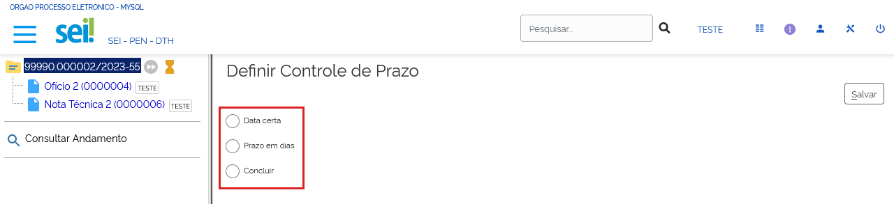

Após selecionar a opção desejada, clique em salvar.

Também será possível incluir **Controle de Prazos** na tela **Controle de processos**, inclusive em lote. Para isso, será necessário marcar a caixa de seleção ao lado do número do(s) processo(s) que receberá(ão) o Controle de Prazo e, em seguida, clicar no ícone **Controle de Prazos** |Controle_prazo|.

.. |Controle_prazo| image:: _static/images/1-IO_icone__cotrole_de_prazos.png
   :align: middle
   :width: 25

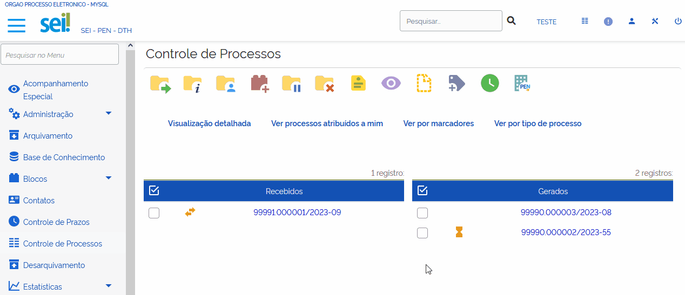

Este procedimento poderá ser feito a qualquer momento para alteração de prazo ou conclusão do prazo do processo.

Identificação de processos com Controle de Prazo
------------------------------------------------

Os processos nos quais foi incluído um Controle de Prazo serão identificados pelo ícone **Controle de Prazo** |Controle_prazo| ao lado de seu número, na tela Controle de Prazos e na tela do processo.

.. |Controle_prazo| image:: _static/images/1-IO_icone__cotrole_de_prazos.png
   :align: middle
   :width: 25

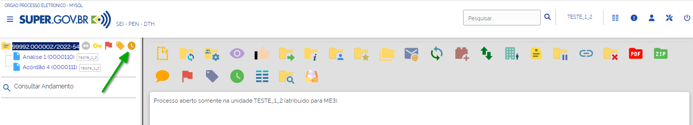

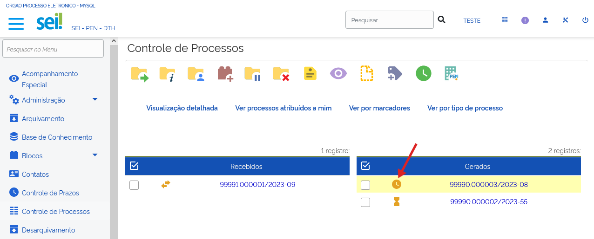

O ícone aparecerá na cor laranja, vermelha ou azul, a depender da situação do prazo, conforme descrito abaixo:

|controle_em_andamento| (laranja) Controle de Prazo Em andamento: indica que o processo possui prazo a vencer.

.. |controle_em_andamento| image:: _static/images/1-IO_icone__controle_prazo_a_vencer.png
   :align: middle
   :width: 25

|controle_atrasado| (vermelho) Controle de Prazo Atrasado: indica que o processo possui 
prazo vencido.

|controle_concluido| (azul) Controle de Prazo Concluído: indica que o processo possui prazo concluído.

.. |controle_concluido| image:: _static/images/1-IO_icone__controle_prazo_concluido.png
   :align: middle
   :width: 25

Ao posicionar o cursor sobre esses ícones, tanto na tela do Processo quanto na tela **Controle de Processos**, aparecerão as seguintes informações sobre o Controle de Prazo no processo:

* login do usuário que incluiu ou alterou o **Controle de Prazo**; 
* a data definida; 
* a quantidade de dias que faltam para o cumprimento do prazo (no ícone laranja), ou a quantidade de dias de atraso (no ícone vermelho), ou a data da conclusão do prazo (no ícone azul).

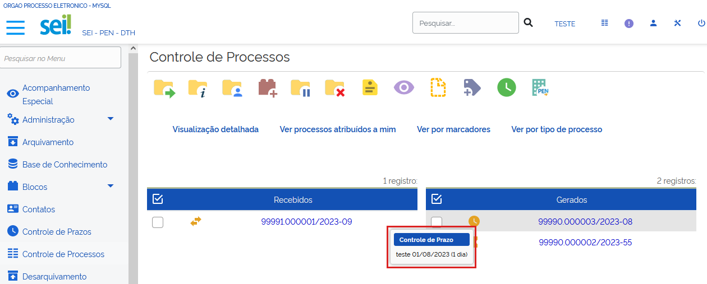

Controlar processos com Controle de Prazos
------------------------------------------

Para visualizar todos os processos com Controle de Prazos na unidade, clique no Menu Principal, opção **Controle de Prazos**. 

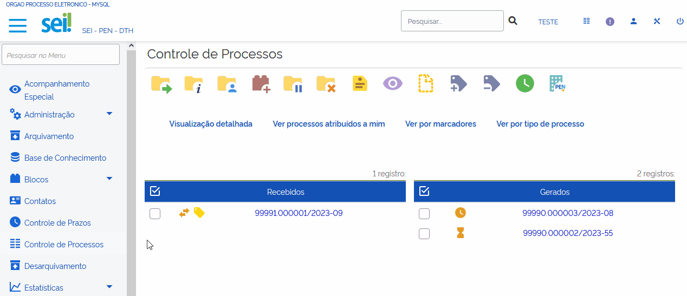

Será aberta a tela de Controle de Prazos, onde consta a Lista de Controle de Prazos, contendo as seguintes informações:

* número do processo;
* usuário responsável pela inclusão ou alteração do Controle de Prazo;
* data programada;
* prazo restante; e 
* data da conclusão.

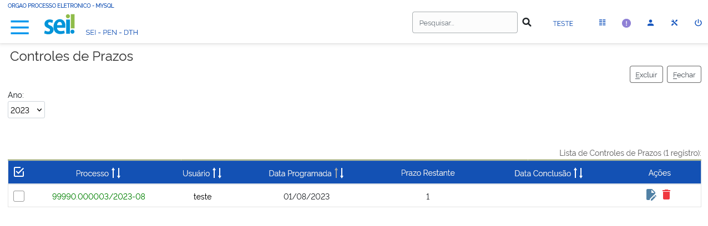

Portanto, essa Lista possibilita ao usuário ter uma visão geral dos Controles de Prazos definidos nos processos da unidade, permitindo visualizar os prazos concluídos, os prazos restantes daqueles que ainda não foram concluídos e os dias de atraso dos prazos que não foram cumpridos.

Para acessar um dos processos da lista, basta clicar sobre seu número.

O usuário poderá ainda alterar o Controle de Prazo, por meio do ícone **Alterar Controle de Prazos** |alterar|; ou excluir o Controle de Prazo, por meio do botão **Excluir**, após selecionar o processo, ou do ícone **Excluir Controle de Prazos** |excluir|. Os ícones estarão disponíveis na coluna Ações.

Na tela **Controles de Prazos**, a visualização dos processos na Lista será por ano. Portanto, o usuário terá a opção de selecionar o ano dos processos que deseja visualizar na Lista.

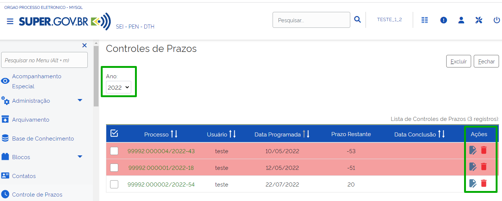

.. admonition:: Nota

   Também será possível controlar os processos com **Controle de Prazos**, por meio do **Painel de Controle**, desde que ele esteja configurado para mostrar os Controles de Prazo.

Marcadores
++++++++++

Esse recurso tem por objetivo organizar os processos da unidade, por meio da atribuição de etiquetas, com cores e nomes próprios.

Os **Marcadores** são criados, gerenciados e adicionados aos processos pela própria unidade, que tem autonomia para definir a cor e a descrição de cada Marcador. Trata-se de uma ferramenta de organização interna.

O SEI conta com 32 opções de marcadores para processos. 

Como criar um Marcador
----------------------

Para criar um marcador, selecione a opção **Marcadores** no menu lateral e, na tela seguinte, clique no botão Novo.

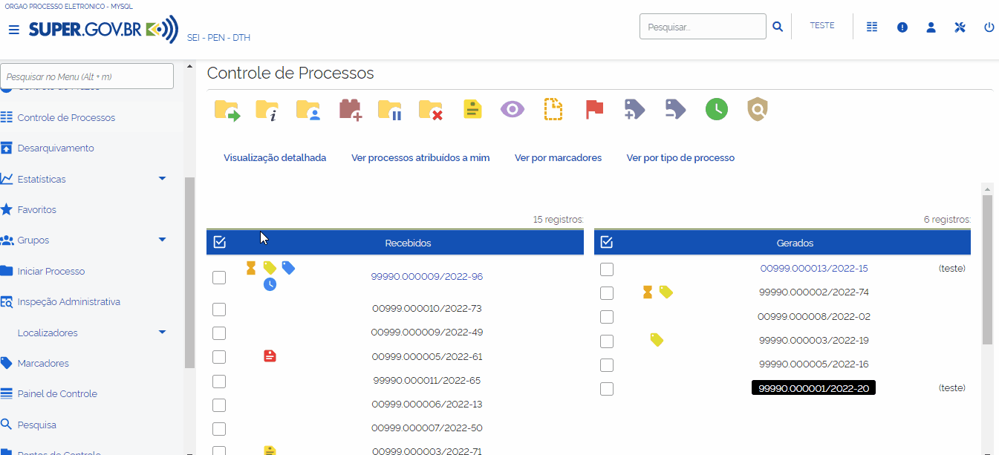

Na tela Novo Marcador, o usuário deverá selecionar uma cor, na caixa Ícone, inserir um nome para o Marcador que será criado, no campo Nome e, em seguida, clicar no botão Salvar.

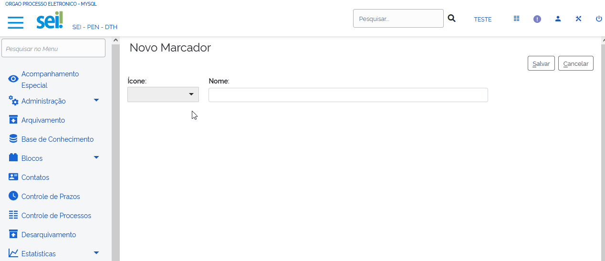

.. admonition:: Notas

    1. O sistema disponibiliza 32 opções de cores para a criação de Marcadores, entretanto não há impedimento de se usar a mesma cor para designar mais de um nome.

    2. A criação de um Marcador também poderá ser feita quando o usuário for atribuir um Marcador ao processo, na tela Adicionar Marcador, conforme será visto no próximo tópico.

Como Atribuir Marcador a Processos
------------------------------------

A atribuição de Marcadores a processos pode ser feita de duas maneiras: 

* **Na tela Controle de Processos**, marque a caixa de seleção do(s) processo(s) e, em seguida, clique no ícone “**Adicionar Marcador**” |adionar_marcador|, na Barra de Ícones.

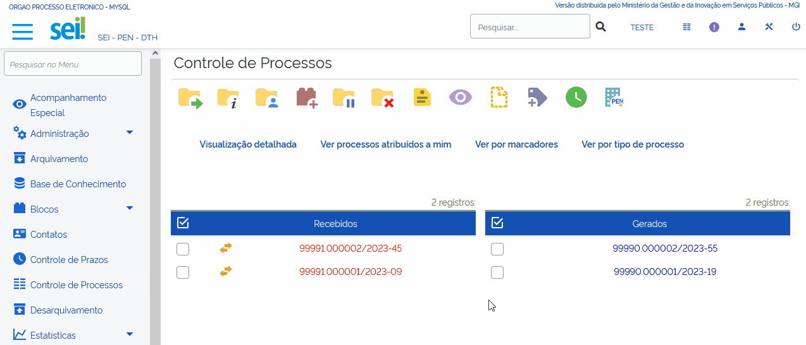

* **Na tela do processo**, clique no ícone **Gerenciar Marcador** |gerenciar_marcador|, disponível na Barra de Ícones.

.. |gerenciar_marcador| image:: _static/images/1-IO_icone_Gerenciar_Marcador.png
   :align: middle
   :width: 35

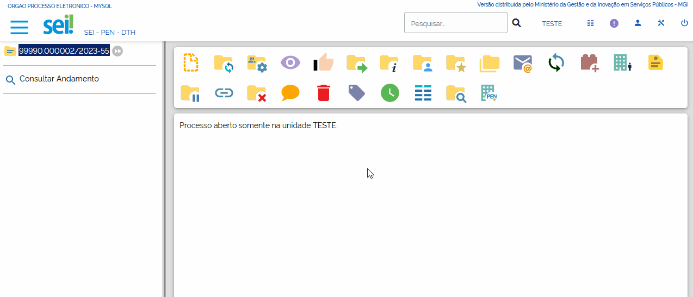

Após realizar uma das opções descritas acima, será aberta a tela adicionar Marcador. Nessa tela, o usuário poderá selecionar um **Marcador** já existente, na caixa Marcador; ou criar um Marcador clicando no ícone **Novo Marcador** |novo_marcador|.

.. |novo_marcador| image:: _static/images/2-OBCP_Atribuir_icone_Exibir_todos_os_tipos.png
   :align: middle
   :width: 20

Será possível incluir informações adicionais no campo **Texto**.

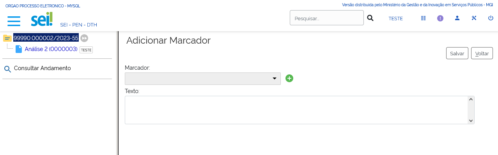

Após a realização das seleções e preenchimentos, o usuário deverá clicar em “**Salvar**”.

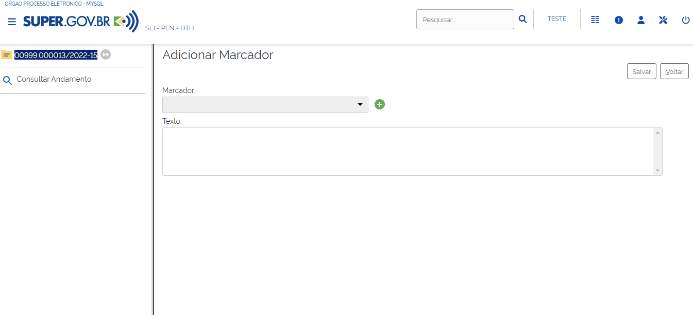

O Marcador atribuído ao(s) processo(s) será visualizado, ao lado de seu número, na tela **Controle de Processos** e na **tela do Processo**.

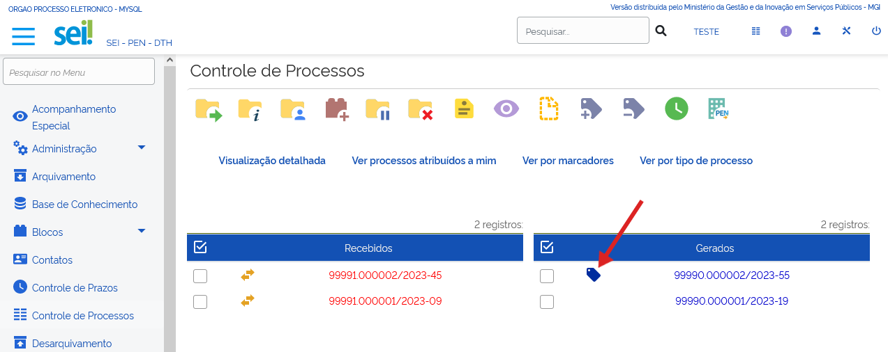

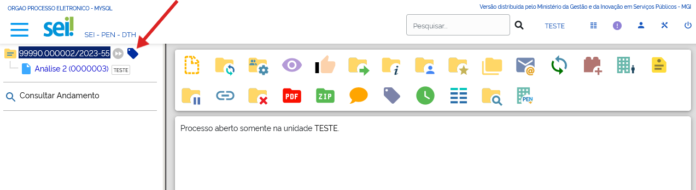

.. admonition:: Nota

   Ao posicionar o cursor sobre o *Marcador*, será exibido o nome do marcador.

Ao clicar sobre o ícone do Marcador, tanto na tela Controle de Processos quanto na tela do Processo, será aberta a tela Marcadores do Processo. Nela, visualizam-se todos os Marcadores do processo, as informações adicionais de cada marcador, existente no campo “Texto” e, por meio dos ícones disponíveis na coluna Ações, é possível: 

Alterar Texto do Marcador |alterar_texto_marcador|; e 
Remover Marcador do Processo |remover_marcador|.

 
Além disso, por meio do botão histórico será possível consultar o histórico do marcador selecionado.

.. admonition:: Nota

   É possível atribuir mais de um Marcador ao mesmo processo. Nesse caso, como visto anteriormente, também será possível atribuir Marcador acessando a tela Marcadores do Processo. Para isso, clique sobre o Marcador ao lado do número do processo, na tela do processo ou na tela Controle de Processos.

Como remover Marcador de processo
----------------------------------

Há duas opções para remover um Marcador do processo: 

* **Na tela Controle de Processos**, selecione o(s) processo(s) e clique no ícone “Remover Marcador” |remover_etiqueta_marcador|, na Barra de Ícones. Será aberta a tela **Remoção de Marcador**, selecione, na caixa Marcador, aquele que será removido e, depois, clique em **Remover**.

.. |remover_etiqueta_marcador| image:: _static/images/3-OBCP_icone_remover_marcador.png
   :align: middle
   :width: 25

* **Na tela Controle de Processos** ou na **Tela do Processo**, clique sobre o ícone do Marcador ao lado do número do processo. Será aberta a tela Marcadores do Processo, nela, o usuário poderá remover o Marcador por meio do ícone **Remover Marcador do Processo** |remover_marcador|, disponível na coluna **Ações**; ou por meio do botão **Remover**, após selecionar o Marcador.

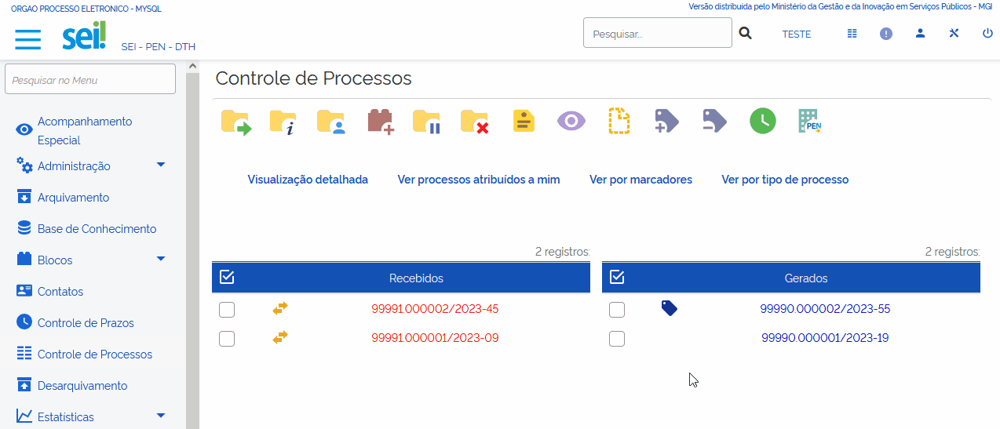

Histórico de Marcadores do processo
------------------------------------

Na tela do Processo ou na tela Controle de Processos, clique no ícone do Marcador ao lado do número do processo para acessar a tela Marcadores do Processo. Em seguida, clique no botão **Histórico**.

Na tela Histórico de Marcadores de Processo, será exibido o Histórico de Marcadores que apresenta as seguintes informações a respeito do Marcador, como:
 
- Data/Hora da inclusão; 
- Usuário responsável pela inclusão; 
- Operação (inclusão, alteração ou remoção); 
- Marcador (ícone e nome); 
- Texto (informações adicionais).

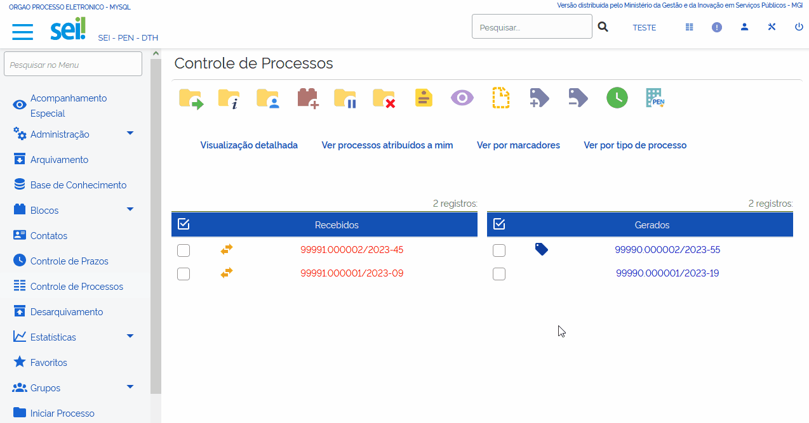

.. admonition:: Notas

   1. Os Marcadores removidos do processo continuam constando no seu Histórico.

   2. As linhas brancas, no Histórico, indicam os Marcadores ativos.

   3. Para visualizar o Histórico de Marcadores de um processo cujos Marcadores foram todos removidos, acesse o processo e clique no ícone Gerenciar Marcador, disponível na Barra de Ícones. Em seguida, na tela Adicionar Marcador, clique no botão Voltar, para acessar a tela Marcadores do Processo. Nela, clique no botão Histórico.

Controle de Processos por Marcadores
-------------------------------------

Na tela **Controle de Processos**, clique no Filtro “**Ver por marcadores**”. A tela “**Controle de Processos**” exibirá a lista de Marcadores e a quantidade de processos por Marcador.

Para visualizar os processos correspondentes a determinado Marcador, clique no número referente a ele, na coluna Processos. Então, a tela **Controle de Processos** exibirá apenas os processos com o Marcador selecionado.

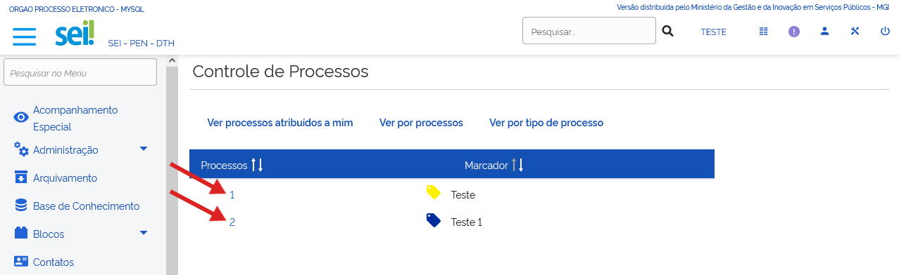

Para retornar à tela anterior e visualizar novamente a lista de Marcadores e a quantidade de processos por Marcador, clique no ícone “**Remover filtro pelo marcador**”  |remover_filtro|, conforme demonstrado na imagem abaixo.

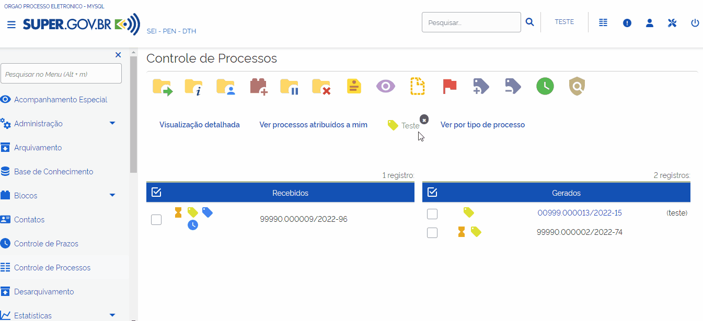

A visualização da tela Controle de Processos por Marcadores apresenta ainda os seguintes Filtros:

* **Ver processos atribuídos a mim**: serão exibidos todos os processos com Marcadores atribuídos ao usuário que está acessando o sistema.
* **Ver por processos**: serão exibidos novamente, na tela **Controle de Processos**, todos os processos abertos na unidade (com e sem Marcadores).
* **Ver por tipo de processo**: será exibida, na tela Controle de Processos, a quantidade de processos abertos na unidade por Tipo (com e sem Marcadores). 

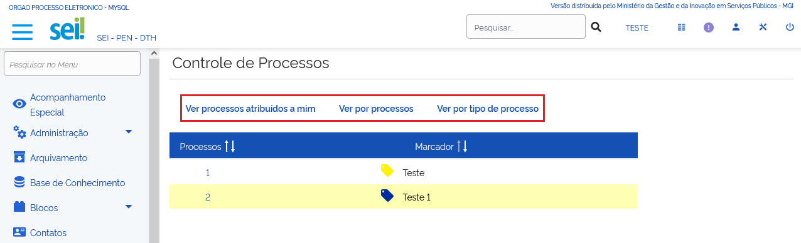

.. admonition:: Notas

   1. A opção “**Ver por marcadores**” exibe os processos com Marcadores que se encontram abertos na unidade. Processos com Marcadores que foram enviados a outra unidade, sem a opção “**Manter processo aberto na unidade atual**”, ou “**processos concluídos**” não aparecerão na referida opção.

   2. Caso o filtro “**Processos atribuídos a mim**” seja aplicado na tela “**Controle de Processos**” por Marcadores, ao clicar nos filtros “**Ver por processos**” e “**Ver por tipo de processo**”, serão exibidos apenas os processos abertos na unidade atribuídos ao usuário que está acessando o sistema. Isso acontece porque, ao aplicar um filtro na tela **Controle de Processos**, só serão visualizados nessa tela os processos abertos na unidade, conforme o(s) filtro(s) aplicado(s).

Gerenciamento de Marcadores
----------------------------

No Menu Principal, selecione a opção Marcadores. Será exibida a Lista de Marcadores da unidade.

.. figure:: _static/images/3-OBCP_marcadores_menu_principal.gif

Na tela Marcadores, por meio dos ícones disponíveis na coluna Ações, é possível:

* **Alterar Marcador** |alterar_marcador|: alterar a cor e/ou o nome do **Marcador**.
* **Desativar Marcador** |desativar_marcador|: desativar **Marcador** em desuso. 
* **Excluir Marcador** |excluir_marcador|: excluir **Marcador** não utilizado. 
* **Reativar Marcador** |reativar_marcador|: reativar **Marcador** para ser utilizado novamente.

.. |desativar_marcador| image:: _static/images/3-OBCP_icone_desativar_marcador.png
   :align: middle
   :width: 20

.. |reativar_marcador| image:: _static/images/3-OBCP_icone_reativar_marcador.png
   :align: middle
   :width: 25

As ações de excluir e desativar **Marcador**, poderão ser realizadas também por meio dos botões **Excluir** e **Desativar**, respectivamente, após a seleção do Marcador.

.. admonition:: Notas

   1. Os Marcadores são visualizados e gerenciados somente no âmbito da unidade que os criou.

   2. É possível inativar um Marcador que esteja em uso. No entanto, o sistema não permite excluir um Marcador que já foi utilizado, mesmo que ele não esteja sendo utilizado no momento.

Inserir anotações
++++++++++++++++++++++++++

Recurso destinado à inclusão de anotações, simples ou com indicação de prioridade, nos processos. 

Para incluir uma anotação, na tela de “**Controle de Processos**”, clique na caixa de seleção ao lado do número do processo ou processos que receberão as anotações e, em seguida, clique no ícone “**Anotações**” |anotacoes|.

.. |anotacoes| image:: _static/images/1-IO_icone_Anotacoes.png
   :align: middle
   :width: 25

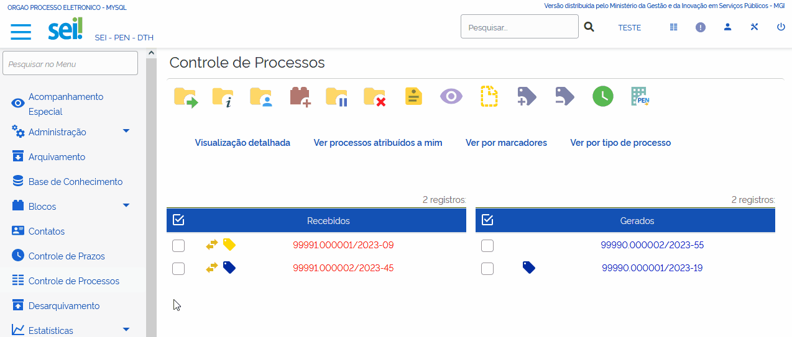

Insira o texto pretendido no campo “**Descrição**”, caso seja necessário, marque o campo “**Prioridade**” e clique em “**Salvar**”.

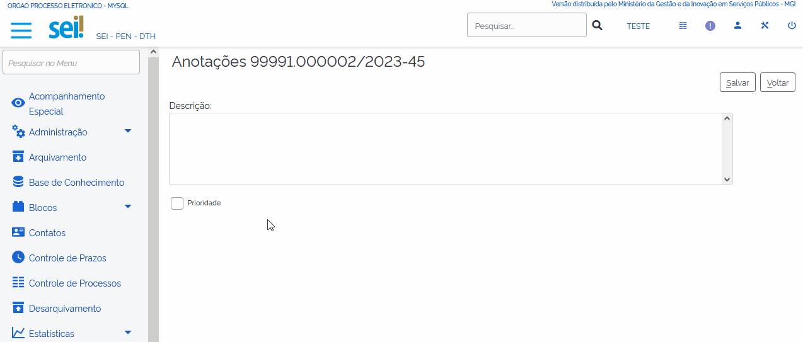

.. admonition:: Nota

   Ao selecionar o campo **Prioridade**, o ícone **Anotações** aparecerá na cor vermelha |anotacoes_vermelho|. Também é possível inserir anotações acessando o processo e clicando no ícone **Anotações** |anotacoes|, que se encontra na **Barra de Ícones**.

.. |anotacoes| image:: _static/images/1-IO_icone_Anotacoes.png
   :align: middle
   :width: 25

.. |anotacoes_vermelho| image:: _static/images/1-IO_icone_Anotacoes_com_prioridade.png
   :align: middle
   :width: 25

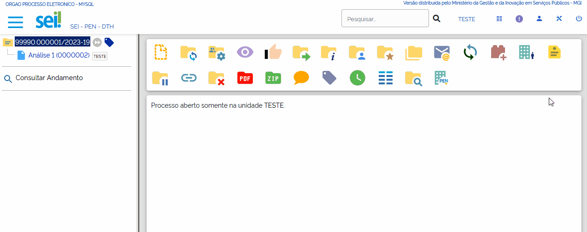

Visualização e alteração de Anotações inseridas no processo
----------------

Para visualizar as anotações inseridas no processo, na tela “**Controle de Processos**”, posicione o cursor sobre o ícone “**Anotações**” |anotacoes|, que fica do lado esquerdo do número do processo. E, para realizar alteração nas anotações, clique no mesmo ícone.

.. |anotacoes| image:: _static/images/1-IO_icone_Anotacoes.png
   :align: middle
   :width: 25

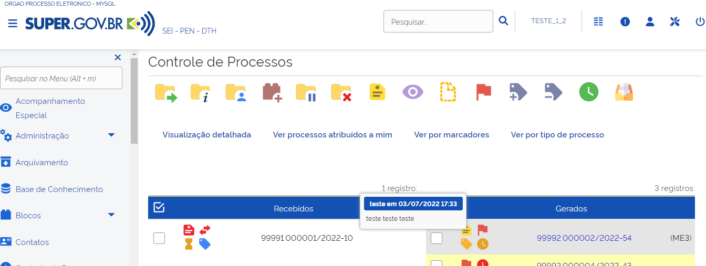

Para excluir anotações do processo, clique no ícone “**Anotações**” |anotacoes| e, na tela Anotações, deixe o campo **Descrição** em branco. Depois, clique em Salvar.

.. |anotacoes| image:: _static/images/1-IO_icone_Anotacoes.png
   :align: middle
   :width: 25

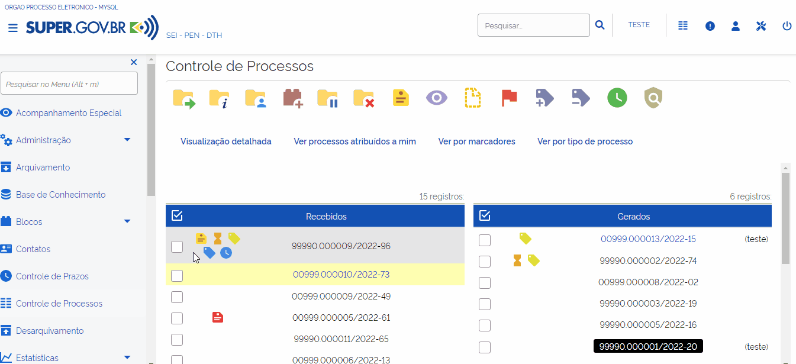

.. admonition:: Nota

   As Anotações serão visualizadas somente no âmbito da unidade que as inseriu.

Ciência de processo
++++++++++++++++++++

Recurso que viabiliza a indicação de conhecimento de determinado documento ou processo, sem a necessidade de criar um documento para esse fim.

Para dar ciência em um processo, acesse o processo, selecione seu número e clique no ícone “**Ciência**” |ciencia|, disponível na Barra de Ícones do processo.

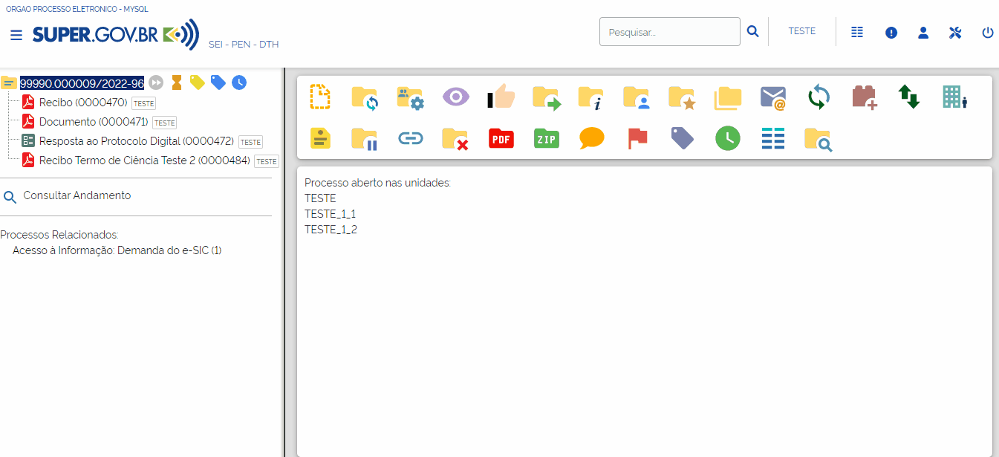

Após dar ciência, o ícone “**Visualizar Ciências**” ficará disponível ao lado do número do processo e será aberta a tela Ciências exibindo a Lista de Ciências no processo.

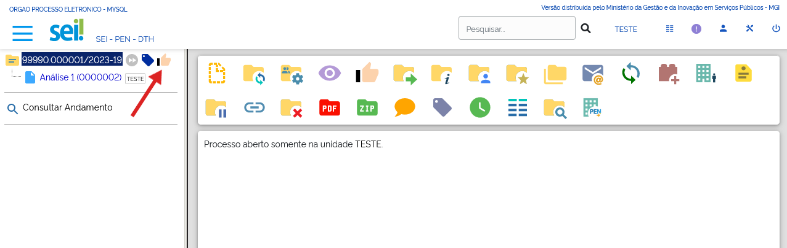

Consulta de usuários que registraram Ciência
---------------------------------------------

Clique no ícone “**Visualizar Ciências no Documento**” |ciencia|, ao lado do processo, para visualizar o usuário que registrou ciência.

.. admonition:: Nota

   A Ciência registrada no processo não poderá ser cancelada ou anulada.

Comentários
+++++++++++++

Recurso destinado à inclusão de comentários em processos e/ou documentos. Os Comentários não fazem parte da instrução processual, no entanto, poderão ser visualizados pelas demais unidades que tiverem acesso ao processo.

Para incluir um comentário, acesse o processo, selecione seu número e clique no ícone “**Comentários**” |comentario|, disponível na Barra de Ícones. Na tela “**Novo Comentário**”, preencha o campo “**Descrição**” com o comentário que deseja e, em seguida, clique em Salvar.

.. |comentario| image:: _static/images/1-IO_icone__comentarios.png
   :align: middle
   :width: 25

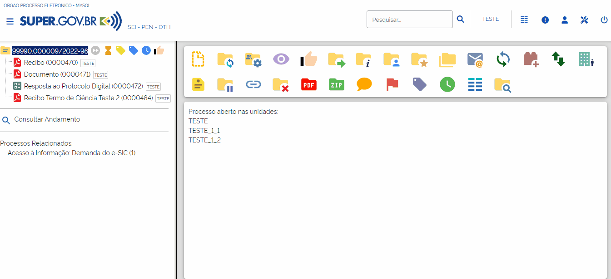

Ao incluir Comentário no processo, o ícone “**Visualizar Comentários**” ficará disponível ao lado de seu número.

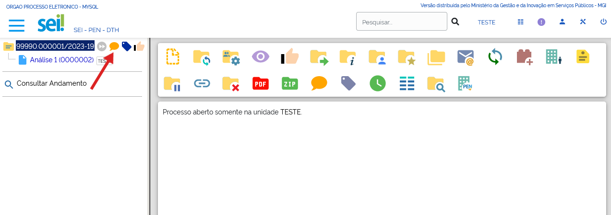

.. admonition:: Notas

   1. O mesmo procedimento aplicado para criação de comentários em um processo também poderá ser aplicado em documentos.

   2. Os Comentários poderão ser incluídos por usuários da unidade que iniciou o processo ou por usuários de outras unidades.

   3. É possível a inclusão de vários Comentários tanto no processo quanto no documento. Para inclusão de um novo Comentário, o usuário deverá clicar no botão Novo que se encontra na tela “**Comentários**” do processo e do documento.

Visualizando Comentários
-------------------------

Para visualizar todos os comentários incluídos no processo e em seus documentos ou para visualizar somente os comentários incluídos no processo, clique no ícone “**Visualizar Comentários**” |comentario|, ao lado do número do processo, ou selecione o processo e clique no mesmo ícone na Barra de Ícones.

.. |comentario| image:: _static/images/1-IO_icone__comentarios.png
   :align: middle
   :width: 25

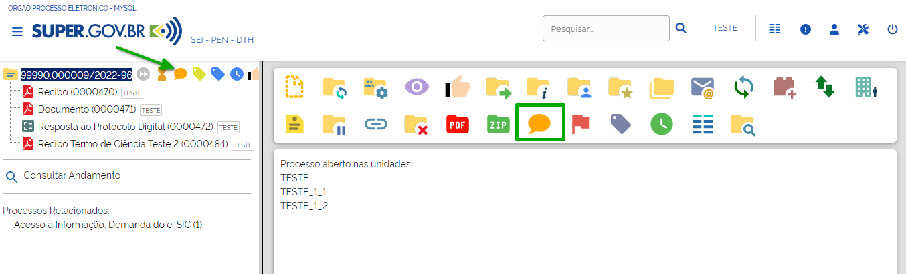

Na tela Comentários, para visualizar apenas os comentários do processo, clique no link “**Ver somente do processo**”. E, para ver todos os comentários novamente (do processo e dos documentos), clique no link “**Ver todos**”.

Nessa tela serão exibidos os comentários incluídos no documento ou no processo, respectivamente. Esses comentários serão exibidos na “**Lista de Comentários**”, que apresentará as seguintes informações sobre o Comentário: data e hora de inclusão; protocolo em que o comentário foi inserido, com o respectivo tipo (no caso de exibição de todos os comentários do processo); unidade na qual foi efetuada a inclusão; e o usuário responsável pela inclusão.

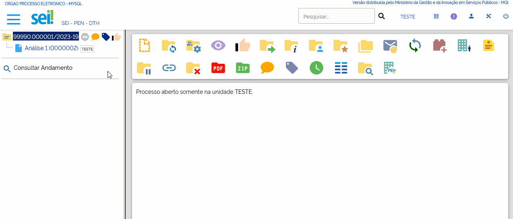

.. admonition:: Nota

   O Comentário registrado em documento interno não assinado só será visualizado no âmbito da unidade que o inseriu. Após a assinatura do respectivo documento, o Comentário poderá ser consultado por outras unidades.

É importante destacar que a visualização de Comentários está diretamente relacionada ao nível de acesso do processo/documento. Conforme demonstrado abaixo:

.. list-table::
   :widths: 20 20 35 
   :header-rows: 1

   - * Localização
     * Nível Acesso
     * Visualização
   - * Processo
     * Público
     * Disponível
   - * Processo
     * Restrito
     * Somente para unidades em que tramitou  
   - * Processo
     * Sigiloso
     * Somente com credencial de acesso  
   - * Documento Externo
     * Público
     * Disponível
   - * Documento Externo
     * Restrito
     * Somente para unidades em que tramitou
   - * Documento Externo
     * Sigiloso
     * Somente com credencial de acesso
   - * Documento interno
     * Público
     * Disponível
   - * Documento interno
     * Restrito
     * Somente para unidades em que tramitou
   - * Documento interno
     * Sigiloso
     * Somente com credencial de acesso

Alterando Comentários
---------------------

Ainda na tela “**Comentários**”, na coluna “**Ações**”, será possível editar o Comentário. Para isso, clique no ícone “**Alterar Comentário**” |alterar_marcador|.

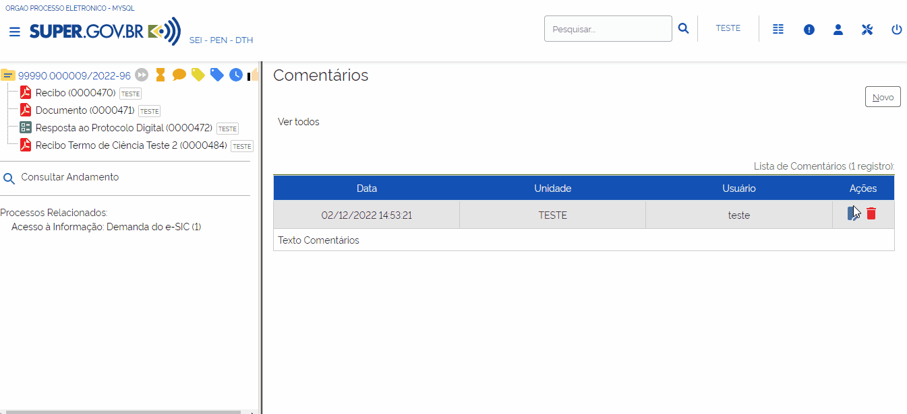

Após a realização das alterações desejadas no campo “**Descrição**”, clique em Salvar.

Excluindo Comentários
---------------------

Ainda na tela “**Comentários**”, na coluna “**Ações**”, será possível editar o Comentário. Para isso, clique no ícone “**Excluir Comentário**” |excluir_comentario| .

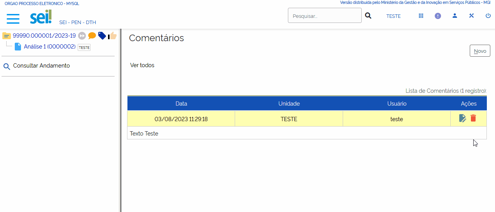

Para a exclusão, será solicitada a confirmação.

Após a exclusão, o ícone “**Visualizar Comentários**” desaparecerá do lado do número do documento ou processo, caso não haja outros comentários no documento ou processo.

.. admonition:: Notas

   1. Os Comentários só poderão ser alterados ou excluídos pela unidade que os inseriu.
   
   2. Quando ocorre a exclusão de todos os Comentários, além do ícone “**Visualizar Comentários**” não estar mais disponível ao lado do documento ou processo, não haverá armazenamento do histórico dos “**Comentários**” excluídos, nem mesmo na opção “**Consultar Andamento**” do processo.

Gerar PDF ou ZIP do processo
+++++++++++++++++++++++++++++

Gerar Arquivo PDF
------------------

Recurso que permite gerar um arquivo no formato PDF com os documentos do processo.

Geração de arquivo PDF do processo
~~~~~~~~~~~~~~~~~~~~~~~~~~~~~~~~~~

Acesse o processo e clique no ícone “**Gerar Arquivo PDF do Processo**” |PDF|, na Barra de Ícones.

.. |PDF| image:: _static/images/1-IO_icone__gerar_pdf.png
   :align: middle
   :width: 30

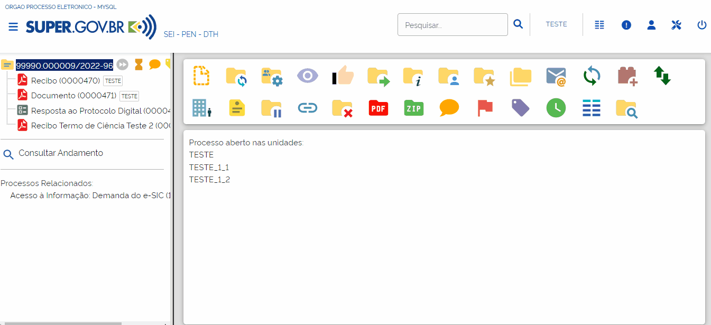

Selecione os documentos que deseja incluir no arquivo PDF e clique em **Gerar**. O arquivo PDF com os documentos selecionados será baixado automaticamente ou após a confirmação do usuário, conforme as especificações do navegador

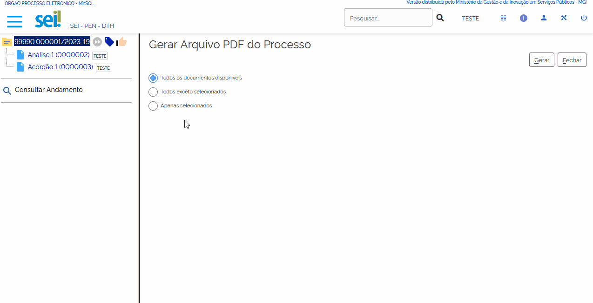

Geração de arquivo PDF em um documento
~~~~~~~~~~~~~~~~~~~~~~~~~~~~~~~~~~~~~~

Acesse o documento e clique no ícone “**Gerar Arquivo PDF do Documento**” |PDF|, na Barra de Ícones. O arquivo PDF do documento selecionado será baixado automaticamente ou após a confirmação do usuário, conforme as especificações do navegador.

.. |PDF| image:: _static/images/1-IO_icone__gerar_pdf.png
   :align: middle
   :width: 30

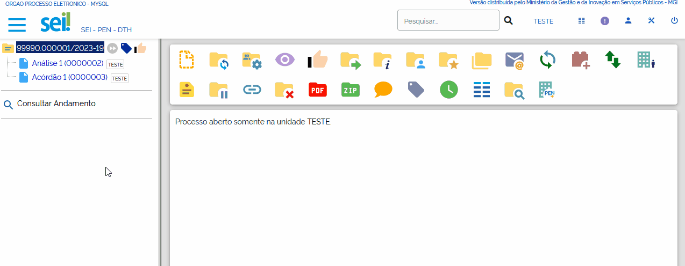

.. admonition:: Notas

   1. Os formatos de imagem, som, arquivos compactados, documentos cancelados e minutas de documentos de outras unidades não serão convertidos em PDF. 

   2. Para a geração do arquivo PDF do processo ou do documento, é necessário que o bloqueador de pop-ups esteja desabilitado ou que o acesso ao endereço seja permitido.

Gerar Arquivo ZIP
------------------

Acesse o processo e clique no ícone “**Gerar Arquivo ZIP do Processo**” |ZIP|, na Barra de Ícones.

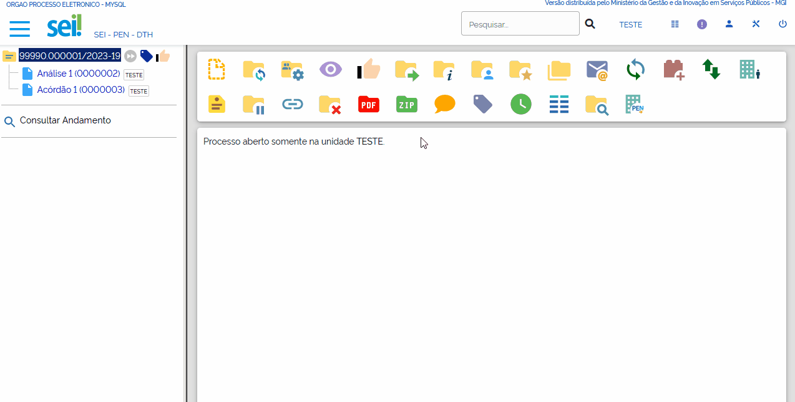

Selecione os documentos que deseja incluir no arquivo PDF e clique em Gerar.

Consulta ao andamento do processo
++++++++++++++++++++++++++++++++++

Na tela do processo, clique na opção |Lupa| **Consultar Andamento**, que fica logo abaixo da Árvore do Processo. Serão exibidos todos os andamentos do processo de forma resumida. 

.. |Lupa| image:: _static/images/1-IO_icone__lupa.png
   :align: middle
   :width: 25

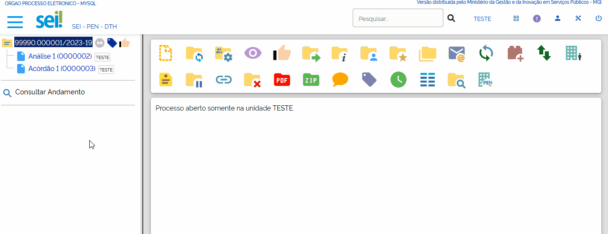

Histórico do Processo
----------------------

Para acessar o Histórico completo do processo, clique no Filtro “**Ver histórico completo**”.

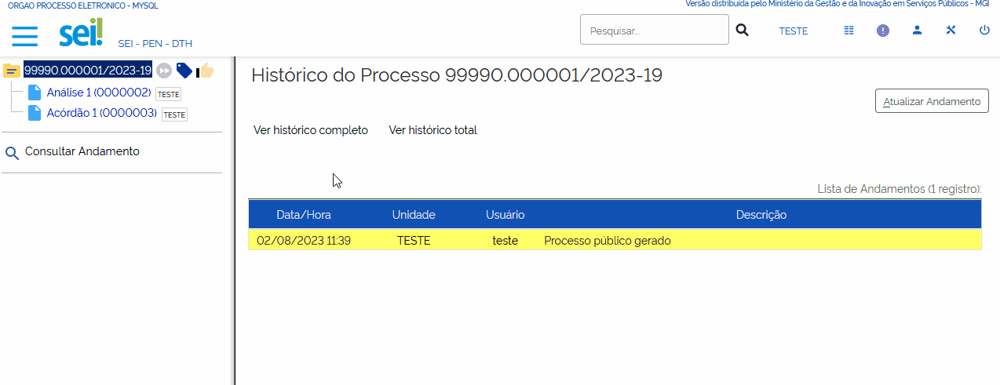

.. admonition:: Notas

   1. Ao lado do nome “Lista de Andamentos” há informação do número de registros contidos na Lista. Portanto, no Histórico Resumido, essa informação refere-se à quantidade de registros exibidos na Lista Resumida e, no Histórico Completo, a informação refere-se à quantidade total de registros no processo. 

   2. Quando os registros da Lista (Resumida ou Completa) forem superiores a uma página, haverá informação do número de registros na Lista, bem como do número de registros na página exibida no momento.

Atualização de Andamento do Processo
------------------------------------

O recurso Atualizar Andamento permite acrescentar informações ao Histórico do processo.

É possível utilizar esse recurso por meio de uma das opções abaixo:

* **Na tela do processo**, clique no número do processo e, depois, no ícone “**Atualizar Andamento**”  |atualizar_andamento|, disponível na Barra de Ícones

.. |atualizar_andamento| image:: _static/images/1-IO_icone_Atualizar_Andamento.png
   :align: middle
   :width: 30

* Na tela do processo, selecione a opção **Consultar Andamento**, que fica logo abaixo da Árvore do Processo. Depois, na tela Histórico do Processo, clique no botão Atualizar Andamento.

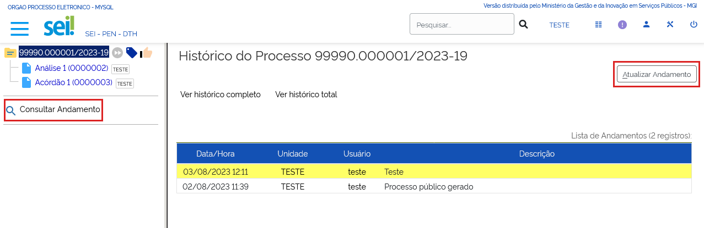

* **Na tela Controle de Processos**, marque a caixa de seleção ao lado do número o processo e clique no ícone **Atualizar Andamento** |atualizar_andamento|, na Barra de Ícones.

.. |atualizar_andamento| image:: _static/images/1-IO_icone_Atualizar_Andamento.png
   :align: middle
   :width: 30

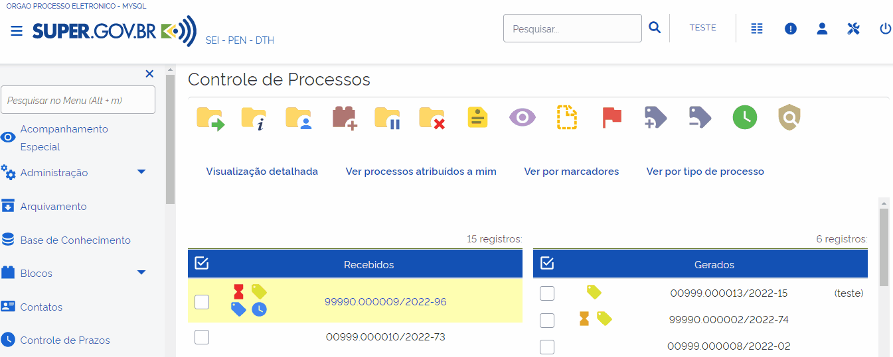

Ao utilizar uma das opções acima, o SEI abrirá a tela **Atualizar Andamento**. Nela, as informações que serão acrescentadas ao Histórico do processo deverão ser digitadas no campo **Descrição**, que é de livre preenchimento. Após preenchê-lo, clique em Salvar.

.. admonition:: Notas

   1. A atualização manual no Histórico do processo é indicada para registros meramente descritivos ou explicativos. Informações essenciais à instrução processual deverão ser inseridas como um novo documento.

   2. O registro inserido no Histórico do processo aparecerá na Lista de Andamentos e não poderá ser editado nem excluído. Em caso de erro, o usuário poderá inserir outro registro retificando a informação.

Enviar Correspondência Eletrônica
+++++++++++++++++++++++++++++++++

O SEI permite o envio de e-mails diretamente do processo. Nesse caso, a mensagem de correio eletrônico passa a compor automaticamente a árvore de documentos do processo. Para enviar um email, clique no número do processo e selecione o ícone |email|.

.. |email| image:: _static/images/1-IO_icone__enviar_correspondencia_eletronica.png
   :align: middle
   :width: 30

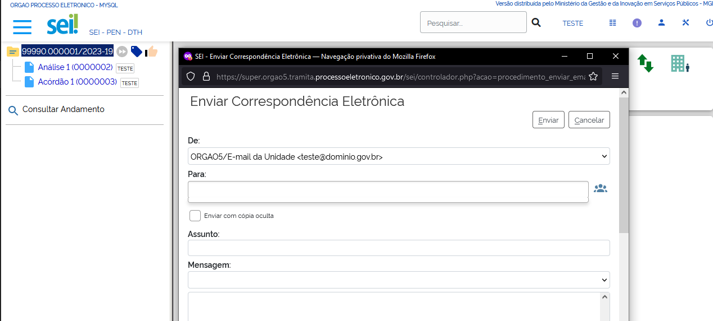

O sistema abrirá uma tela que permite enviar e-mails, anexando arquivos externos ou selecionando documentos do processo para serem enviados. Além disso, o sistema também permite inserir mensagens de texto padronizadas e constituir grupos de e-mail.

Para o envio de mensagens, o campo “**De**” será preenchido com o e-mail cadastrado como e-mail da unidade. Caso este campo esteja em branco não será possível realizar o envio, sendo necessária a solicitação de cadastro do e-mail da unidade à equipe de gestão documental do órgão. 

O campo “**Para**” é de livre preenchimento e deve receber um endereço válido de e-mail. O campo “**Mensagem**” pode permanecer em branco, permitindo livre digitação. Também poderá ser feita seleção de um dos itens da barra de rolagem do campo “**Mensagem**”, permitindo a escolha de um texto padrão. 
Ao clicar em enviar, a mensagem será enviada aos destinatários e o e-mail, então, passará a compor a árvore do processo.

