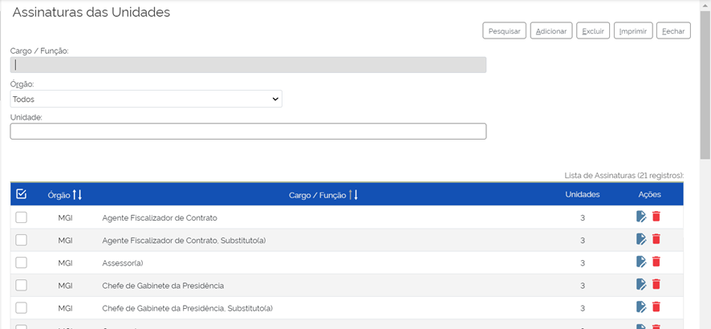
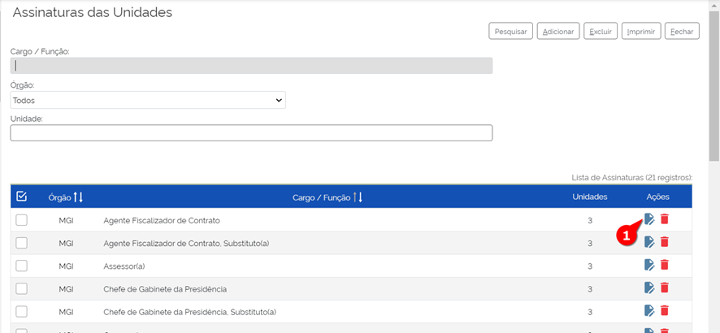
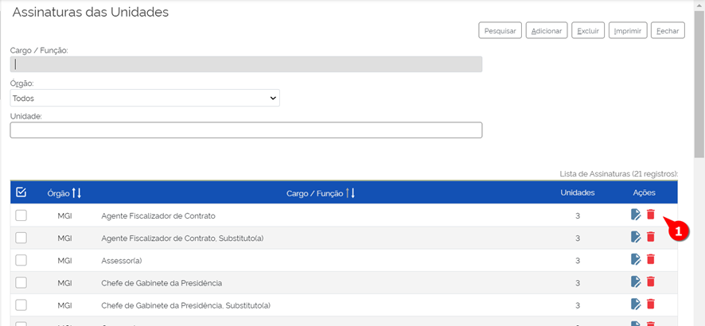

Assinatura das Unidades
========================

A funcionalidade “Assinaturas das Unidades” permite configurar os cargos que ficarão disponíveis para seleção do usuário no momento da assinatura de algum documento. Ressalta-se que essa configuração é realizada para cada unidade do órgão ou da entidade.

Para acessá-la o administrador deve acompanhar o caminho descrito a seguir dessa vez no SEI.

.. figure:: _static/images/04-01_Assin-Unid_Menu_Assinatura_Unid.png

1. Acessar o Menu principal no SEI;
2. Selecionar “Administração”;
3. Selecionar “Assinaturas das Unidades”.

A tela de “Assinaturas das Unidades” é aberta e nessa tela são mostrados todos os cargos dentro dos órgãos. Os campos “Cargo / Função” “Órgão” e “Unidade” são utilizados para restringir as assinaturas exibidas. Por exemplo é possível descobrir assinaturas de Unidade teste digitando “Teste” no campo “Unidade” a fim de restringir o resultado da pesquisa.

Dessa tela de “Assinaturas das Unidades” é possível realizar as seguintes ações (além da pesquisa informada acima): 

- Adicionar Assinatura;
- Alterar Assinatura;
- Excluir Assinatura,

Adicionar Assinatura
--------------------

Na tela de “Assinaturas das Unidades” seguir com esses passos: 

1. No canto superior direito clicar em Adicionar;

.. figure:: _static/images/04-01_Assin-Unid_Tela_Assinatura_Unid-Adic.png

A tela de “Nova assinatura de Unidade” será aberta:

.. figure:: _static/images/04-01_Assin-Unid_Tela_Nova-Assinatura-Unid.png

2. Preencher os campos “Cargo/Função” e “Órgão”;

.. admonition:: Nota

   O campo “Cargo/Função” é de livre preenchimento e não tem nenhuma relação com os cargos preenchidos em “Contatos”.

3. Após a seleção do Órgão o campo de Unidades é habilitado para preenchimento e seleção;

4. Clicar em Salvar.

Pronto, a assinatura da Unidade foi adicionada.

Alterar Assinatura
------------------

A Alteração da Assinatura permite alterar o nome do cargo ou função adicionar e excluir unidades anteriormente adicionadas.

Na tela de Assinatura de Unidades:

1. Clicar em “Alterar Assinatura” na coluna de Ações respectivo ao Cargo/Função respectivo para alterar a assinatura;

2. Na tela “Alterar Assinatura de Unidade” realizar as alterações necessárias;

3. Clicar em Salvar.

Pronto, a assinatura da Unidade foi alterada.

Excluir Assinatura
------------------

Na tela de Assinatura de Unidades:

1. Clicar em “Excluir Assinatura” na coluna de Ações respectivo ao Cargo/Função respectivo para excluir a assinatura;

2. Um aviso de confirmação será emitido;

3. Clicar em Ok.

Pronto, a sua assinatura foi excluída.

Assinatura Digital
------------------

Com a habilitação da assinatura nos passos anteriores, os documentos criados e editados estão disponíveis para serem assinados por usuários da unidade responsável pela sua geração no SEI. 

A assinatura é realizada por meio da funcionalidade “Assinar Documento” |assinar_documento|, localizada no menu superior do processo.

.. figure:: _static/images/04-01_Assin-Unid_Diversos_AssinarDoc.png

.. admonition:: Notas

   A funcionalidade da Assinatura Digital está disponível apenas para documentos internos. Documentos externos não são habilitados para assinatura.

   Os cargos e funções configurados em “Assinaturas das Unidades” são recuperados no campo “Cargo/Função”. 

   Lembre-se que os cargos e funções disponíveis estão relacionados à unidade e não ao usuário logado no sistema. O usuário necessita de muita atenção no momento da assinatura para não assinar o documento com um cargo ou uma função errados. 

Em seguida o usuário deve informar a senha de acesso ou utilizar um certificado digital para efetuar a assinatura.

A tela para Assinatura com os respectivos campos é essa:

.. figure:: _static/images/04-01_Assin-Unid_Diversos_Assinatura_Digital.png

