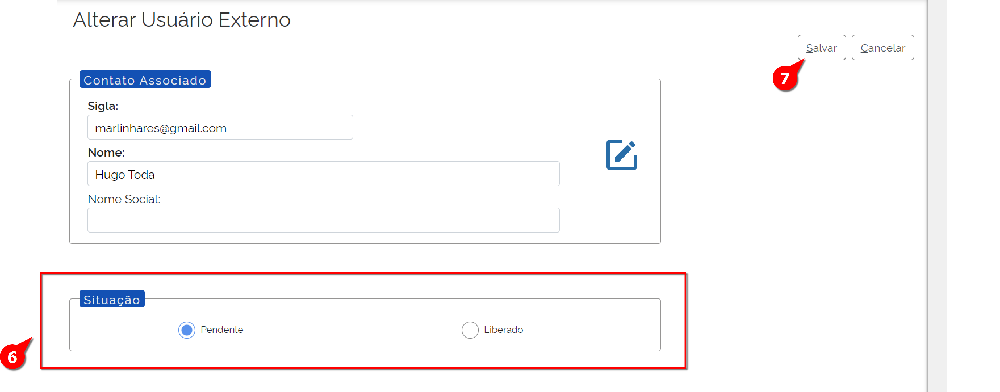
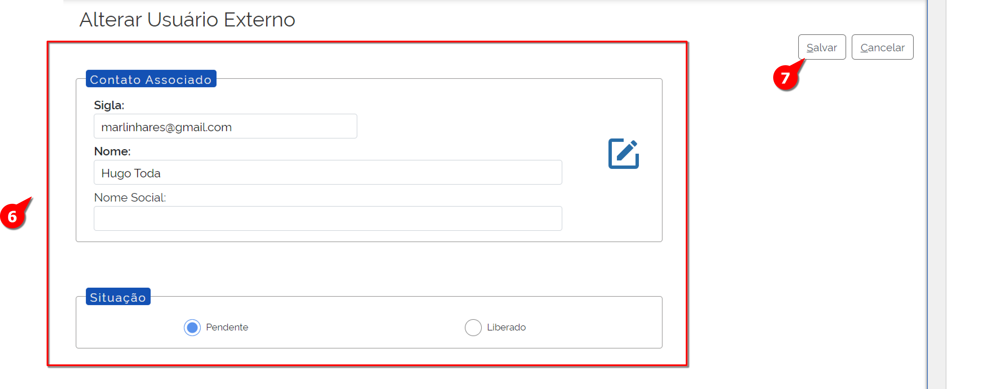

Usuários Externos
=================

No SEI, basicamente temos dois tipos de Usuários: 

- Usuários Internos: servidores do Órgão com perfis e unidades liberados para acesso;
- Usuários Externos:  usuários clientes do Órgão. Normalmente são fornecedores que precisam assinar contratos eletronicamente ou advogados de partes interessadas nos processos que tramitam no Órgão.

.. admonition:: Nota

   Os processos que os usuários externos podem acessar têm natureza restrita e, por isso, é necessário realizar um cadastro prévio por meio do campo “Usuário Externo” no site do órgão. Além disso, o órgão deve alinhar internamente como será o processo de liberação de acesso.

Assim, cada órgão delimita os pré-requisitos para a liberação do cadastro realizado pelo usuário.

Liberação de Acesso
--------------------

O candidato a Usuário Externo primeiramente envia o formulário de cadastro para o Órgão que realiza a conferência dos pré-requisitos.

Após a conferência dos pré-requisitos, o usuário com perfil “Administrador” deve acompanhar o caminho descrito a seguir:

.. figure:: _static/images/04-03_Usuario-Externo_Menu_Adm01.png

.. figure:: _static/images/04-03_Usuario-Externo_Menu_Listar.png

01. No Menu Principal, acessar a opção “Administração”;

02. Acessar a opção “Usuários Externos”;

03. Selecionar em “Listar”;

O Usuário Administrador estará na tela de listagem dos Usuários Externos.

04. Inserir um dos dados disponíveis e clicar no botão “Pesquisar”;

Note que o Usuário Externo irá aparecer, com a informação “S” na coluna “Pendente”:

.. figure:: _static/images/04-03_Usuario-Externo_Lista_Pendente.png

05. Na coluna “Ações” clique em “Alterar Usuário Externo”;

A tela “Alterar Usuário Externo” irá aparecer.

06. No quadro “Situação” altere a opção “Pendente” para “Liberado”;

07. Clique em Salvar.

Pronto. O Usuário Externo já pode acessar o ambiente de usuário externo. 

.. admonition:: Nota

   Usuários com perfil “Básico” possuem permissão para liberar processos restritos a usuários externos previamente. Dessa forma, é necessário selecionar os servidores que terão essa função com bastante cuidado.

Alteração Cadastral do Usuário Externo
---------------------------------------

A alteração cadastral do Usuário Externo também está disponível para o Administrador.

Para Alterar os dados de um Usuário Externo, deve-se seguir os seguintes passos: 

01. No Menu Principal, acessar a opção “Administração”;
 
.. figure:: _static/images/04-03_Usuario-Externo_Menu_Adm01.png

.. figure:: _static/images/04-03_Usuario-Externo_Menu_Listar.png

02. Acessar a opção “Usuários Externos”;

03. Selecionar em “Listar”;

A lista de Usuários Externos será exibida.

.. figure:: _static/images/04-03_Usuario-Externo_Lista_Alterar.png
 
04. Na coluna “Ações” clique em “Alterar Usuário Externo”;
 
A tela “Alterar Usuário Externo” será exibida:

05. Alterar os campos necessários;

06. Clicar em Salvar.

Pronto. Os dados do Usuário Externo foram alterados. 

Bloqueio de Acesso - Desativar
-------------------------------

Caso haja a necessidade de se bloquear um usuário externo, existem duas opções disponíveis: desativar e excluir. Os seguintes passos são para desativar.

É preciso informar que a ação de “Desativar” é um recurso reversível, ao contrário do “Excluir”. Essa reversão acontece usando a ação “Reativar”, que será detalhada em seguida.

Para Desativar um Usuário Externo, deve-se seguir os seguintes passos: 

01. No Menu Principal, acessar a opção “Administração”;
 
.. figure:: _static/images/04-03_Usuario-Externo_Menu_Adm01.png

.. figure:: _static/images/04-03_Usuario-Externo_Menu_Listar.png

02. Acessar a opção “Usuários Externos”;

03. Selecionar em “Listar”;
 
A lista de Usuários Externos será exibida.
 
.. figure:: _static/images/04-03_Usuario-Externo_Lista_Desativar.png

04. Localizar o Usuário Externo e clicar em “Desativar”;

05. Confirmar a ação de desativação do Usuário Externo.

Pronto, o Usuário Externo foi desativado.

Bloqueio de Acesso - Reativar
------------------------------

Após a Desativação de um Usuário Externo, é possível reverter a situação, com o comando  “Reativar”.

Para reativar um Usuário Externo desativado, deve-se seguir os seguintes passos: 

01. No Menu Principal, acessar a opção “Administração”;
 
.. figure:: _static/images/04-03_Usuario-Externo_Menu_Adm01.png

.. figure:: _static/images/04-03_Usuario-Externo_Menu_Reativar.png

02. Acessar a opção “Usuários Externos”;

03. Clicar em “Reativar”;

A lista de Usuários Externos desativados será exibida.

04. Localizar o Usuário Externo Desativado a ser reativado e clicar em “Reativar”;

 
.. figure:: _static/images/04-03_Usuario-Externo_Tela_Reativar.png

05. Confirmar a ação de reativação do Usuário Externo.

Pronto, o Usuário Externo foi reativado.

Bloqueio de Acesso - Excluir
-----------------------------

Ressalta-se que não poderão ser excluídos os usuários externos que já tiveram processos liberados no sistema. Nesse caso, só é permitido desativar o usuário e, dessa forma, ele não poderá mais acessar o ambiente de usuário externo. Isso deverá ocorrer caso, por exemplo, um advogado perca a procuração de determinada empresa para acompanhar seus processos. Se esse advogado mudar de escritório, deve realizar um novo cadastro no sistema. Isso porque se apenas for alterado o e-mail do usuário, ele continuará acessando os processos que tinha acesso antes.

Para excluir um Usuário Externo, deve-se seguir os seguintes passos: 

01. No Menu Principal, acessar a opção “Administração”;

.. figure:: _static/images/04-03_Usuario-Externo_Menu_Adm01.png

.. figure:: _static/images/04-03_Usuario-Externo_Menu_Listar.png

02. Acessar a opção “Usuários Externos”;

03. Selecionar em “Listar”;
 
A lista de Usuários Externos será exibida.
 
.. figure:: _static/images/04-03_Usuario-Externo_Lista_Excluir.png

04. Localizar o Usuário Externo e clicar em “Excluir”;

05. Confirmar a ação de exclusão do Usuário Externo.

Pronto, o Usuário Externo foi excluído.
