Contatos
=========

Essa etapa do Manual do SEI para Administradores permite mostrar como é feita a “Gestão de Contatos”.

A Gestão de contratos contempla 6 formas de classificação dos contatos, classificados como: Tipos, Cargos, Títulos, Tratamentos, Categorias e Vocativo. 

Dentre elas, as cinco primeiras é possível cadastrar, listar e reativar alguma dessas formas caso tenha sido desativada. Essas 3 ações são listadas como opções no menu principal, respectivamente em cada uma das classificações.

A classificação de Vocativo está inserida em "Cargos". 

É necessário informar que há uma correlação entre essas formas de classificação, de forma a atingir uma gestão de Contatos funcional.

A relação de dependência entre elas segue é ilustrada da seguinte forma: 

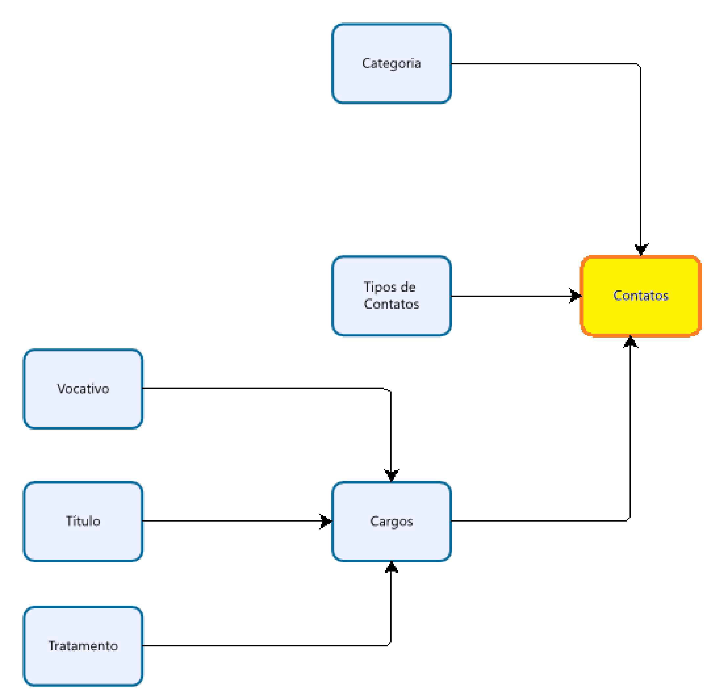

Na figura é mostrado que para cadastrar um Contato (em destaque), são necessários cadastros de três tipos de classificação: Categoria, Tipos de Contatos e Cargos. Essa última, necessita o cadastro de Vocativo, Título e Tratamento.

Será mostrado como é feito em cada um desses casos e em último o Cadastro de Contatos, bem como a sua gestão.
Caso julgar necessário por todos os pré-requisitos mencionados estiverem já cadastrados, vá diretamente para o tópico de Contatos (inserir link). 

Tipos de Contatos
-----------------

Cadastrar Novo Tipo de Contato 
+++++++++++++++++++++++++++++++

Inicialmente, o Usuário-Administrador realiza o cadastro dos tipos de contatos, podendo ser pessoa física ou jurídica, e informa quais unidades podem alterar ou consultar os contatos relacionados. Nesse sentido, o administrador deve seguir o caminho descrito a seguir no SEI: 

Nesse sentido, o administrador deve seguir o caminho descrito a seguir no SEI: 

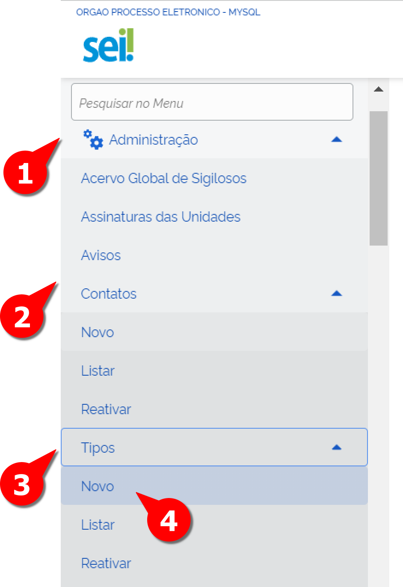

01.Acessar o Administração no Menu Principal

02. Acessar Contatos

03. Selecionar Tipos

04. Clicar em Novo

A tela "Novo Tipo de Contato" será aberta e será necessário seguir os seguintes passos: 

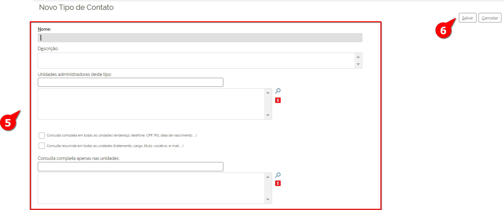

05. Preencher e selecionar os seguintes campos: 

- Nome: Preencher o Nome do Tipo de Contato

- Descrição: Preencher a Descrição do Tipo de Contato

- Unidades Administradoras desse tipo: Selecionar as Unidades que irão administrar esse Tipo de Contato

- "Consulta completa em todas as unidades (endereço, telefone, CPF, RG, data de nascimento, ...)": Selecionar Flag 

- "Consulta resumida em todas as unidades (tratamento, cargo, título, vocativo, e-mail, ...)": Selecionar Flag 

- Consulta completa apenas nas unidades: Selecionar as Unidades que permitirá a consulta completa do tipo de Contato

06. Clicar em "Salvar"

Pronto! o Tipo de Contato foi criado. 

A gestão do tipo de contato, após a sua criação, permite realizar os seguintes comandos: alterar, desativar, reativar e excluir os tipos de contato.

Alterar Tipo de Contato
+++++++++++++++++++++++

A alteraçao dos tipos de contato é possível por meio dos seguintes passos: 

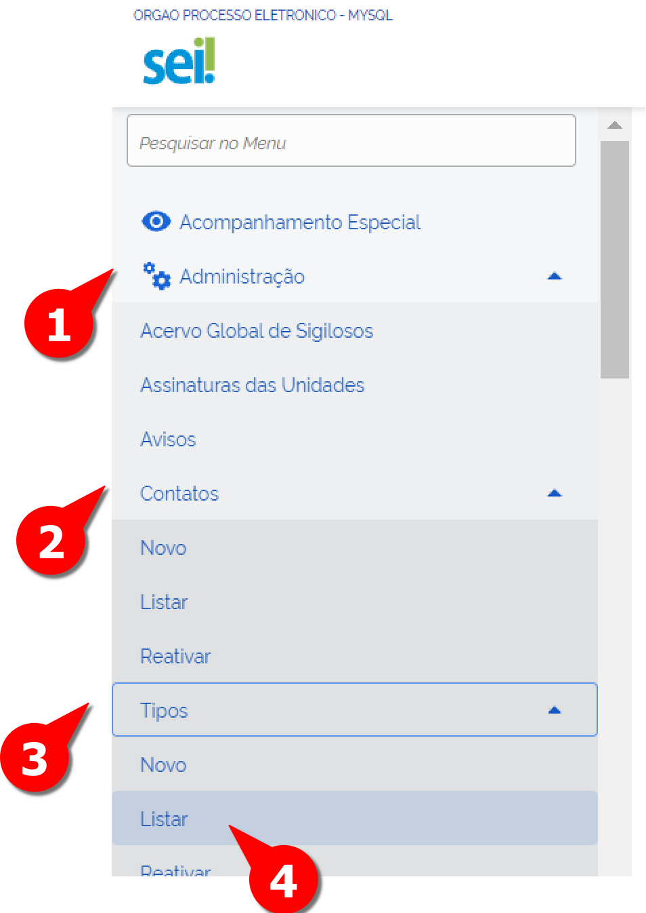

01.Acessar Administração no Menu Principal

02. Acessar Contatos

03. Selecionar Tipos

04. Clicar em Listar

A lista de  "Tipos de Contato" será aberta e será necessário seguir com os seguintes passos: 

05. Localizar o tipo de contato a ser alterado e clicar em "Alterar Tipo de Contato"

A tela "Alterar Tipos de Contato" será aberta: 

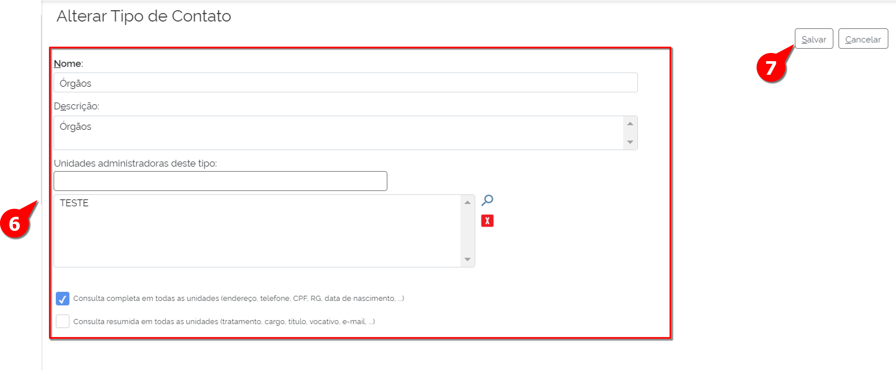

06. Alterar os campos necessários

07. Clicar em Salvar.

Pronto! o Tipo de Contato foi alterado. 

Desativar Tipo de Contato
+++++++++++++++++++++++++

É possível desativar um tipo de contato por meio dos seguintes passos: 

01.Acessar Administração no Menu Principal

02. Acessar Contatos

03. Selecionar Tipos

04. Clicar em Listar

A lista de  "Tipos de Contato" será aberta:

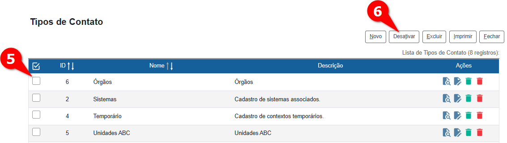

05. Localizar o tipo de contato a ser desativado e clicar em "Desativar Tipo de Contato"

06. Confirmar a desativação

Pronto! o Tipo de Contato foi desativado. 

Caso necessitar reativar o tipo de contato desativado.

Reativar Tipo de Contato
++++++++++++++++++++++++

É possível reativar um tipo de contato desativado por meio dos seguintes passos: 

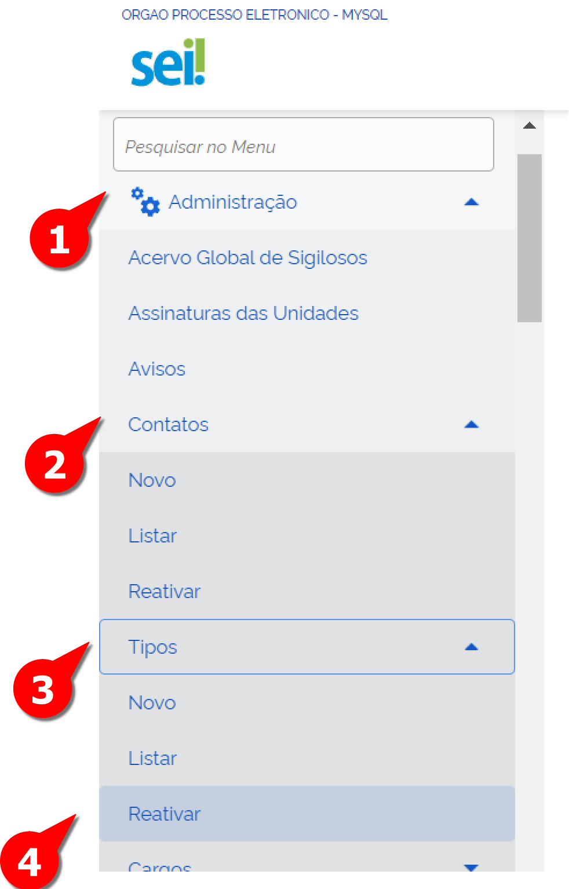

01.Acessar Administração no Menu Principal

02. Acessar Contatos

03. Selecionar Tipos

04. Clicar em Reativar

A lista de  "Reativar Tipo de Contato" será aberta:

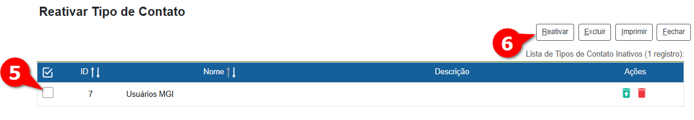

05. Localizar o tipo de contato a ser reativado e clicar em "Reativar Tipo de Contato"

06. Confirmar a reativação

Pronto! o Tipo de Contato foi reativado. 

Excluir Tipo de Contato
+++++++++++++++++++++++

Ao contário da ação Desativar, esse comando é uma ação irreversível. 

É possível excluir um tipo de contato por meio dos seguintes passos: 

01.Acessar Administração no Menu Principal

02. Acessar Contatos

03. Selecionar Tipos

04. Clicar em Listar

A lista de  "Tipos de Contato" será aberta:

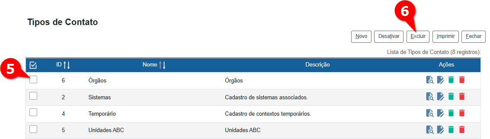

05. Localizar o tipo de contato a ser desativado e clicar em "Excluir Tipo de Contato"

06. Confirmar a exclusão

Pronto! o Tipo de Contato foi excluído. Essa ação é irreversível. 

CATEGORIA
---------

Cadastrar Nova Categoria de Contato 
+++++++++++++++++++++++++++++++++++

Para  Usuário-Administrador realizar o cadastro das categorias de contatos, ele deve seguir o caminho descrito a seguir no SEI:

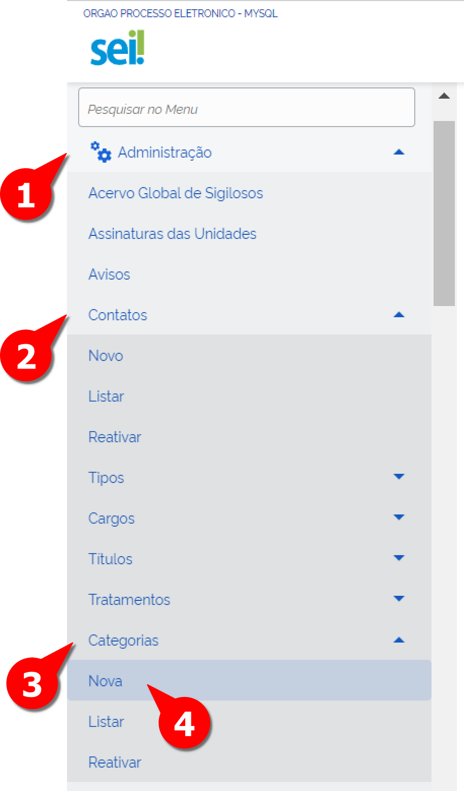

01.Acessar o Administração no Menu Principal

02. Acessar Contatos

03. Selecionar Categorias

04. Clicar em Nova

A tela "Nova Categoria" será aberta: 

.. figure:: _static/images/04-02_Contatos-Tela_Categorias-Nova.png

05. Preencher o campo "Nome"

06. Clicar em "Salvar"

Pronto! A nova categoria foi criada. 

A gestão da categoria do contato, após a sua criação, permite realizar os seguintes comandos: alterar, desativar, reativar e excluir as categorias de contato. Todos esses comandos serão abordadas a seguir.

Alterar Categoria de Contato
++++++++++++++++++++++++++++

A alteraçao da categoria de contato é possível por meio dos seguintes passos: 

.. figure:: _static/images/04-02_Contatos-Menu_Categorias-Listar.png

01.Acessar Administração no Menu Principal

02. Acessar Contatos

03. Selecionar Categorias

04. Clicar em Listar

A lista "Categorias" será aberta e será necessário seguir com os seguintes passos:

.. figure:: _static/images/04-02_Contatos-Lista_Categorias-Alterar.png

05. Localizar a categoria de contato a ser alterada e clicar em "Alterar Categoria"

A tela "Alterar Categoria" será aberta: 

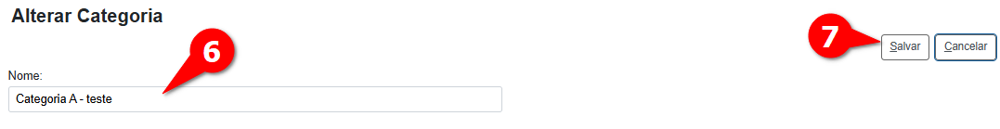

06. Alterar os campos necessários

07. Clicar em Salvar.

Pronto! O nome da Categoria de Contato foi alterada. 

Desativar Categoria de Contato
++++++++++++++++++++++++++++++

É possível desativar uma categoria de contato por meio dos seguintes passos: 

.. figure:: _static/images/04-02_Contatos-Menu_Categorias-Listar.png

01.Acessar Administração no Menu Principal

02. Acessar Contatos

03. Selecionar Categorias

04. Clicar em Listar

A lista "Categorias" será aberta:

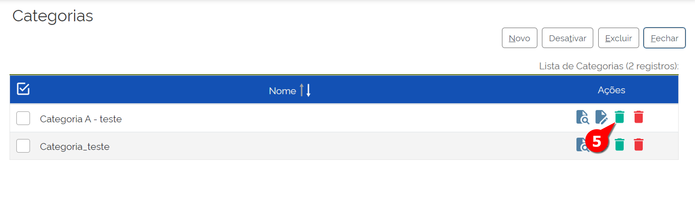

05. Localizar a categoria de contato a ser desativado e clicar em "Desativar Categoria"

06. Confirmar a desativação

Pronto! A Categoria de Contato foi desativado. Caso necessitar reativá-la, seguir o tópico seguinte.

Reativar Categoria de Contato
+++++++++++++++++++++++++++++

É possível reativar uma categoria de contato desativada anteriormente por meio dos seguintes passos:

.. figure:: _static/images/04-02_Contatos-Menu_Categorias-Reativar.png

01.Acessar Administração no Menu Principal

02. Acessar Contatos

03. Selecionar Categorias

04. Clicar em Reativar

A lista "Reativar Categorias" será aberta:

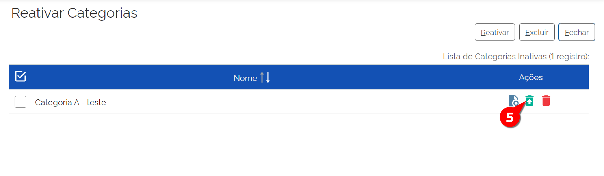

05. Localizar a categoria a ser reativada e clicar em "Reativar Categoria"

06. Confirmar a reativação

Pronto! A Categoria foi reativada. 

Excluir Categoria de Contato
++++++++++++++++++++++++++++

Ao contário da ação Desativar, esse comando é uma ação irreversível. 

É possível excluir uma categoria de contato por meio dos seguintes passos: 

.. figure:: _static/images/04-02_Contatos-Menu_Categorias-Listar.png

01.Acessar Administração no Menu Principal

02. Acessar Contatos

03. Selecionar Categoria

04. Clicar em Listar

A lista "Categorias" será aberta:

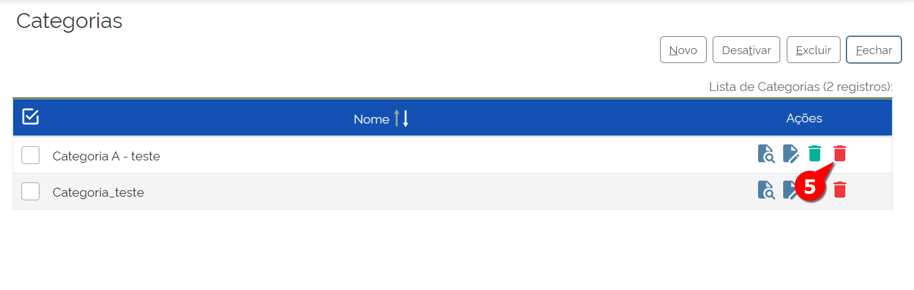

05. Localizar a categoria de contato a ser desativado e clicar em "Excluir Categoria"

06. Confirmar a exclusão

Pronto! A Categoria de Contato foi excluído. Essa ação é irreversível. 

CARGOS
------

O cadastro dos Cargos dentro dos Contatos solicita o cadastro (e a gestão) antecipado de três requisitos: Vocativo, Título e Tratamento.

O cadastro desses requisitos são 

Vocativo
++++++++

O cadastro do vocativo é um pouco mais simples que os demais e não possui telas exclusivas, sendo adicionada na tela de Novo Cargo.

Adicionar Novo Vocativo 
~~~~~~~~~~~~~~~~~~~~~~~~

Para Adicionar um Novo vocativo do Contato, deve-se seguir os seguintes passos: 

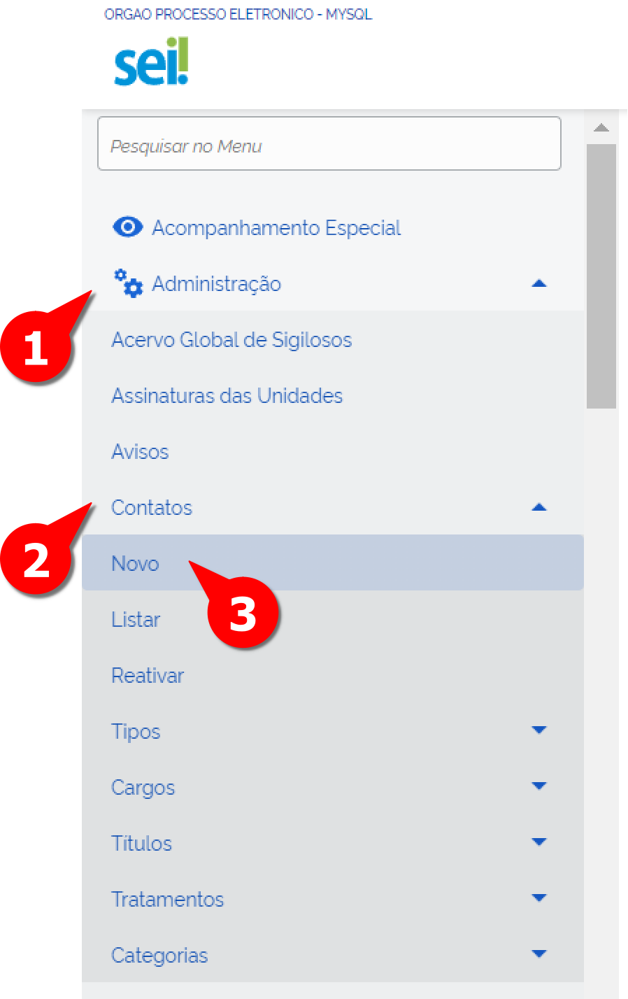

01.Acessar o Administração no Menu Principal

02. Acessar Contatos

03. Selecionar Cargo

04. Clicar em Nova

A tela "Novo Cargo" será exibida. Seguir os passos da animação a seguir: 

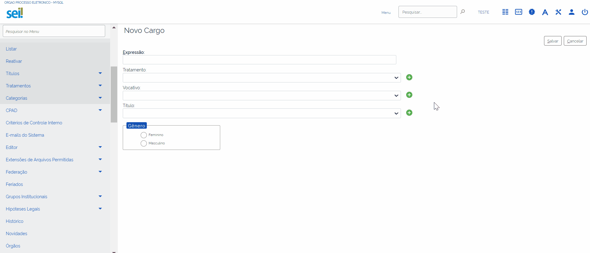

05. Clicar em '+' ao lado do campo Vocativo; 

06. Inserir o nome do novo Vocativo; 

07. Clicar em Salvar.

Pronto. O Novo Vocativo foi criado.

Título
++++++

O SEI permite o cadastro e gestão de títulos para os Cargos dos Contatos. 

Assim como outros itens, o SEI permite o cadastro e gestão de títulos para os Cargos dos Contatos. Isto é, cadastro do Título, Alteração, Desativação e Reativação e Exclusão.

Iremos ver como realizar esses comandos a seguir. 

Adicionar Novo Título para os Cargos dos Contatos
~~~~~~~~~~~~~~~~~~~~~~~~~~~~~~~~~~~~~~~~~~~~~~~~~~

Para  Usuário-Administrador realizar o cadastro dos títulos dos Cargos dos Contatos, ele deve seguir o caminho descrito a seguir no SEI:

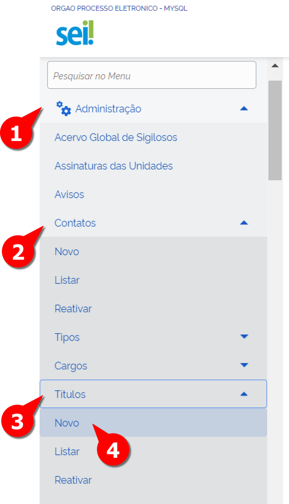

01.Acessar o Administração no Menu Principal

02. Acessar Contatos

03. Selecionar Títulos

04. Clicar em Novo

A tela "Novo Título" será aberta: 

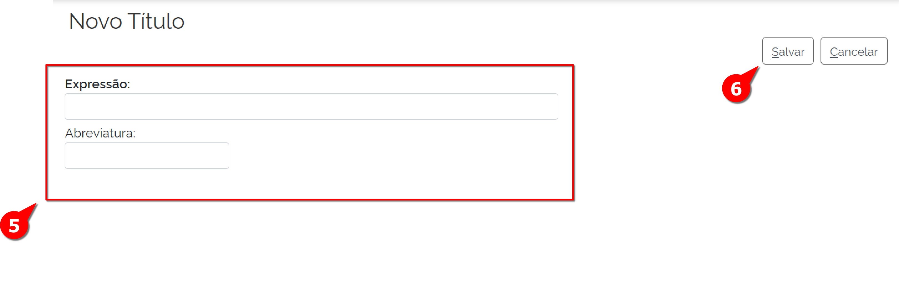

05. Preencher os campos "Expressão" e "Abreviatura";

06. Clicar em "Salvar"

Pronto! O Novo Título foi criado. 

A gestão do Título do Cargo do contato, após a sua criação, permite realizar os seguintes comandos: alterar, desativar, reativar e excluir as categorias de contato. 

Todos esses comandos serão abordadas a seguir.

Alterar Título do Contato
~~~~~~~~~~~~~~~~~~~~~~~~~

A alteraçao do título do contato é possível por meio dos seguintes passos:

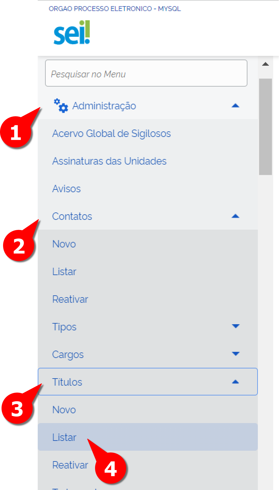

01.Acessar Administração no Menu Principal

02. Acessar Contatos

03. Selecionar Títulos

04. Clicar em Listar

A lista "Títulos" será aberta e será necessário seguir com os seguintes passos:

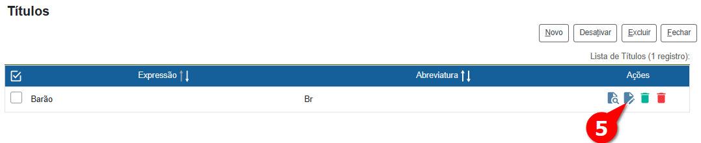

05. Localizar o tíutlo do cargo a ser alterado e clicar em "Alterar Título"

A tela "Alterar Título" será aberta: 

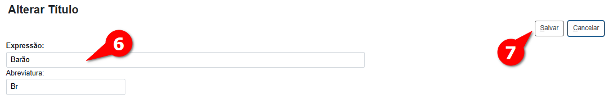

06. Alterar os campos necessários

07. Clicar em Salvar.

Pronto! O Título do Cargo de Contato foi alterado. 

Desativar Título do Contato
~~~~~~~~~~~~~~~~~~~~~~~~~~~~

A desativação do título do cargo é possível por meio dos seguintes passos:

01.Acessar Administração no Menu Principal

02. Acessar Contatos

03. Selecionar Títulos

04. Clicar em Listar

A lista "Títulos" será aberta e será necessário seguir com os seguintes passos:

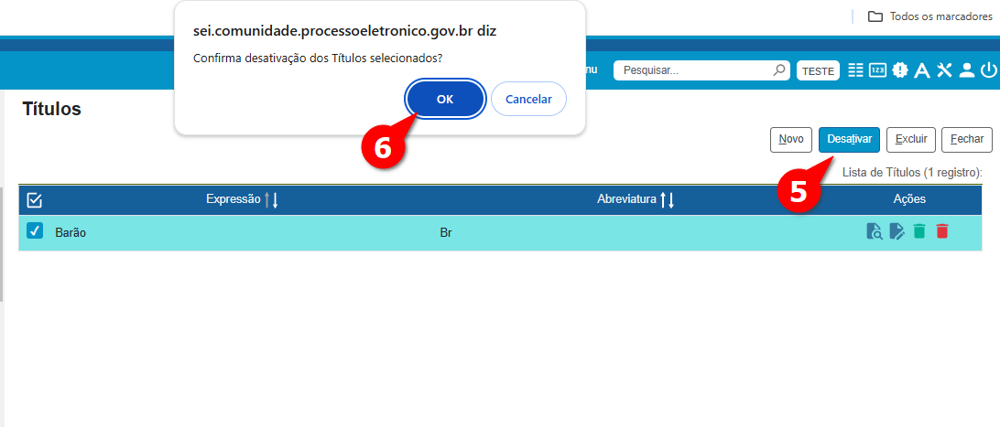

05. Localizar o título do cargo a ser desativado e clicar em "Desativar Título"

06. Confirmar comando

Pronto! O Título do Cargo de Contato foi desativado. Para reativar o Título, deve-se acompanhar o passo a seguir.

Reativar Título do Contato
~~~~~~~~~~~~~~~~~~~~~~~~~~

A reativação do título do cargo desativado é possível por meio dos seguintes passos:

01.Acessar Administração no Menu Principal

02. Acessar Contatos

03. Selecionar Títulos

04. Clicar em Reativar

A lista "Reativar Títulos" será aberta e será necessário seguir com os seguintes passos:

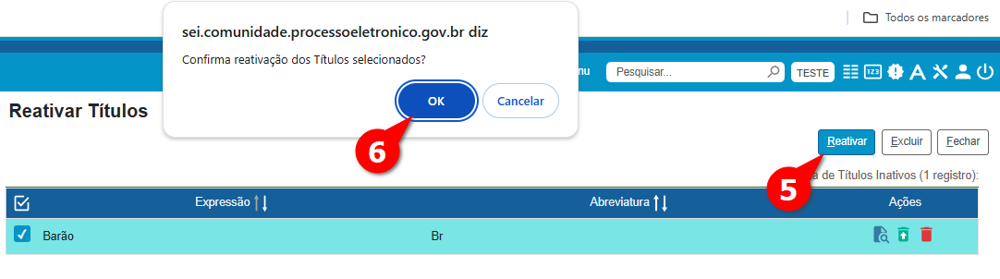

05. Localizar o título do cargo a ser reativado e clicar em "Reaativar Título"

06. Confirmar comando

Pronto! O Título do Cargo de Contato foi reativado.

Excluir Título do Contato
~~~~~~~~~~~~~~~~~~~~~~~~~

A exclusão do título do cargo, ao contrário da desativação, é uma ação irreversível.

Para realizar tal ação deve seguir os seguintes passos:

01.Acessar Administração no Menu Principal

02. Acessar Contatos

03. Selecionar Títulos

04. Clicar em Listar

A lista "Títulos" será aberta e será necessário seguir com os seguintes passos:

05. Localizar o título do cargo a ser excluído e clicar em "Excluir Título"

06. Confirmar comando

Pronto! O Título do Cargo de Contato foi excluído.

Tratamento
++++++++++

Assim como outros itens, o SEI permite o cadastro e gestão de tratamentos para os Cargos dos Contatos. Isto é, cadastro do tratamento, alteração, desativação e reativação e exclusão.

Iremos ver como realizar esses comandos a seguir.

Adicionar Novo Tratamento para Cargos
~~~~~~~~~~~~~~~~~~~~~~~~~~~~~~~~~~~~~

Para o Usuário-Administrador realizar o cadastro dos Tratamentos dos Cargos dos Contatos, ele deve seguir o caminho descrito a seguir no SEI:

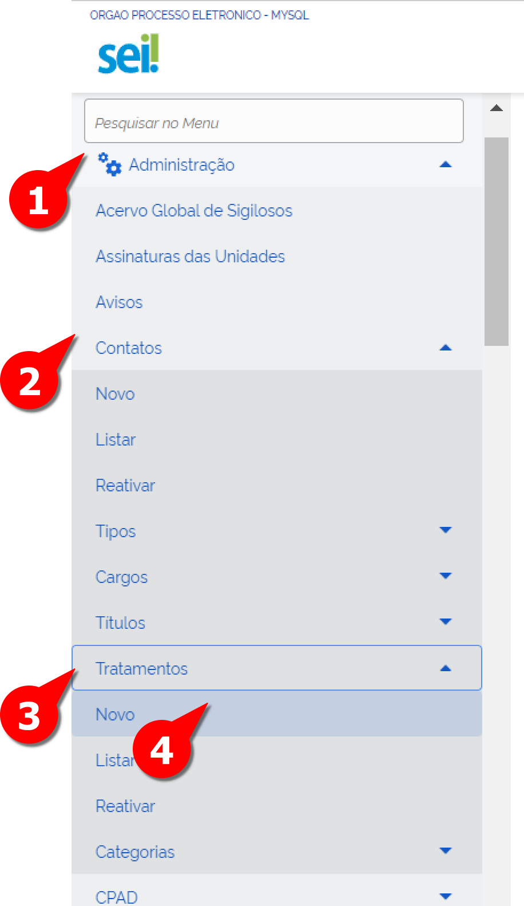

01.Acessar o Administração no Menu Principal

02. Acessar Contatos

03. Selecionar Tratamentos

04. Clicar em Novo

A tela "Novo tratamento" será aberta: 

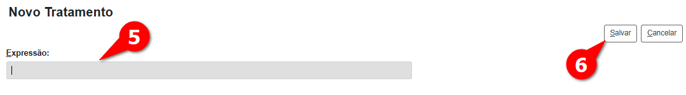

05. Preencher os campos "Expressão" e "Abreviatura";

06. Clicar em "Salvar"

Pronto! O Novo tratamento foi criado. 

A gestão do tratamento do Cargo do contato, após a sua criação, permite realizar os seguintes comandos: alterar, desativar, reativar e excluir. Todos esses comandos serão abordadas a seguir.

Alterar Tratamento para Cargos
~~~~~~~~~~~~~~~~~~~~~~~~~~~~~~

A alteraçao do tratamento para os cargos do contato é possível por meio dos seguintes passos:

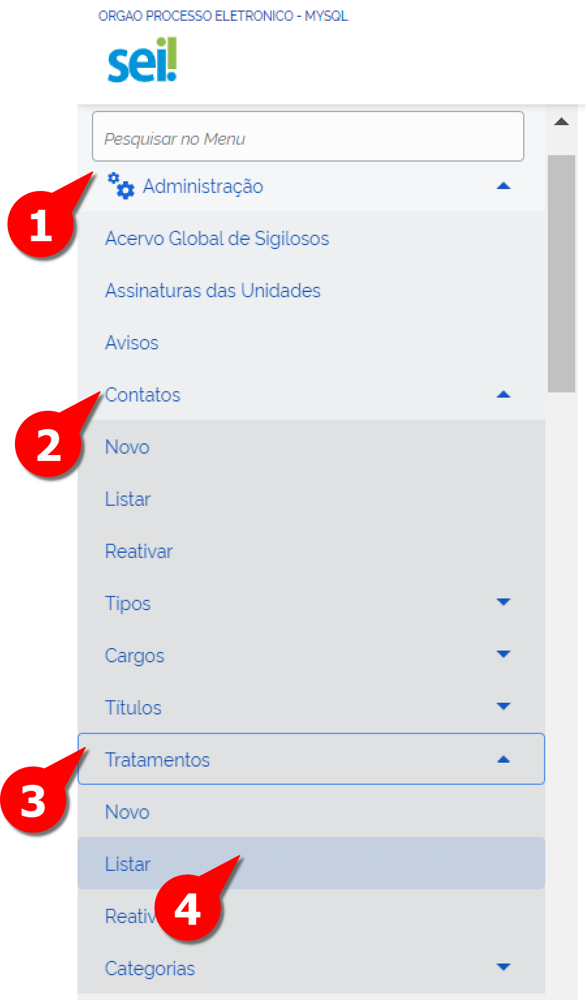

01.Acessar Administração no Menu Principal

02. Acessar Contatos

03. Selecionar tratamentos

04. Clicar em Listar

A lista "Tratamentos" será aberta e será necessário seguir com os seguintes passos:

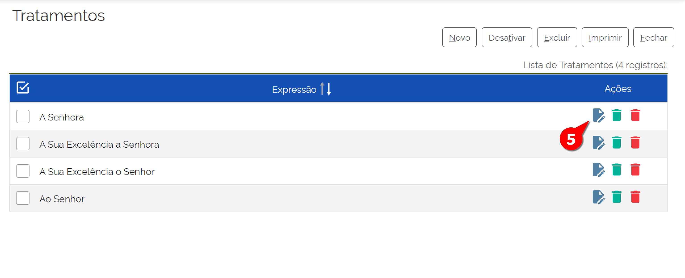

05. Localizar o tíutlo do cargo a ser alterado e clicar em "Alterar tratamento"

A tela "Alterar tratamento" será aberta: 

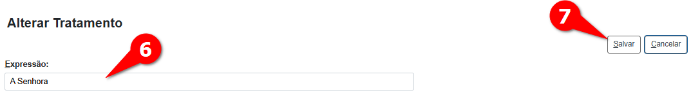

06. Alterar os campos necessários

07. Clicar em Salvar.

Pronto! O tratamento para os cargos dos Contatos foi alterado. 

Desativar Tratamento para Cargos
~~~~~~~~~~~~~~~~~~~~~~~~~~~~~~~~

A desativação do tratamento para cargo é possível por meio dos seguintes passos:

01.Acessar Administração no Menu Principal

02. Acessar Contatos

03. Selecionar tratamentos

04. Clicar em Listar

A lista "Tratamentos" será aberta e será necessário seguir com os seguintes passos:

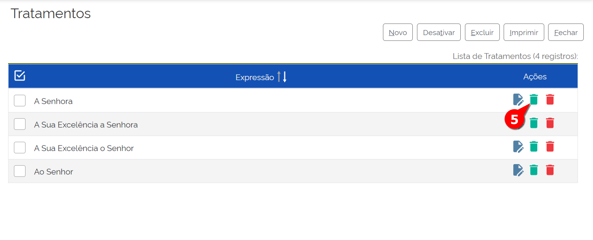

05. Localizar o tratamento para cargo a ser desativado e clicar em "Desativar tratamento"

06. Confirmar comando

Pronto! O tratamento para Cargo de Contato foi desativado. Para reativar o tratamento, deve-se acompanhar o passo a seguir.

Reativar Tratamento para Cargo
~~~~~~~~~~~~~~~~~~~~~~~~~~~~~~

A reativação do tratamento para cargo já desativado é possível por meio dos seguintes passos:

01.Acessar Administração no Menu Principal

02. Acessar Contatos

03. Selecionar tratamentos

04. Clicar em Reativar

A lista "Reativar tratamentos" será aberta e será necessário seguir com os seguintes passos:

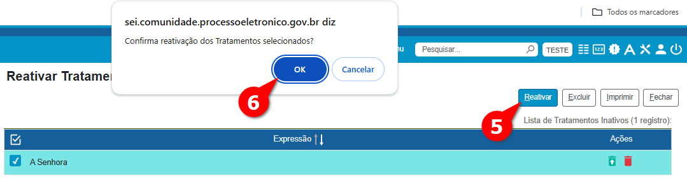

05. Localizar o tratamento do cargo a ser reativado e clicar em "Reativar tratamento"

06. Confirmar comando

Pronto! O Tratamento para Cargo de Contato foi reativado.

Excluir Tratamento para Contato
~~~~~~~~~~~~~~~~~~~~~~~~~~~~~~~

A exclusão do tratamento para cargo, ao contrário da desativação, é uma ação irreversível.

Para realizar tal ação deve seguir os seguintes passos:

01.Acessar Administração no Menu Principal

02. Acessar Contatos

03. Selecionar tratamentos

04. Clicar em Listar

A lista "Tratamentos" será aberta e será necessário seguir com os seguintes passos:

05. Localizar o tratamento do cargo a ser excluído e clicar em "Excluir tratamento"

06. Confirmar comando

Pronto! O tratamento do Cargo de Contato foi excluído.

Contatos
--------

Com os pré-requisitos necessários para os Contatos mencionados anteriormente, o usuário Administrador pode cadastrar os Contatos.

Adionar Contato
+++++++++++++++

Para o Usuário-Administrador realizar o cadastro dos Contatos, ele deve seguir o caminho descrito a seguir no SEI:

01.Acessar o Administração no Menu Principal

02. Acessar Contatos

03. Clicar em Novo

A tela "Novo Contato" será aberta: 

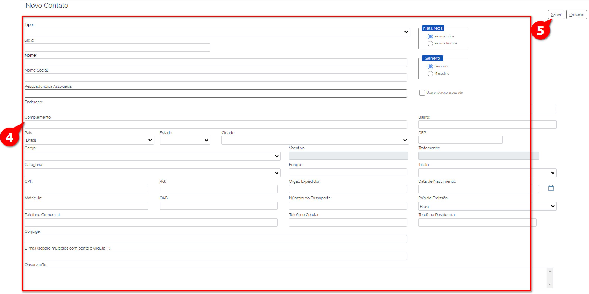

04. Preencher e selecionar todos os campos pertinentes. 

Note que alguns desses campos serão habilitados para posterior preenchimento ou seleção conforme escolha;

05. Clicar em "Salvar"

Pronto! O Novo contato foi criado e está disponível na lista de contatos. 

Alterar Contato
+++++++++++++++

A alteraçao do contato já cadastrado é possível por meio dos seguintes passos:

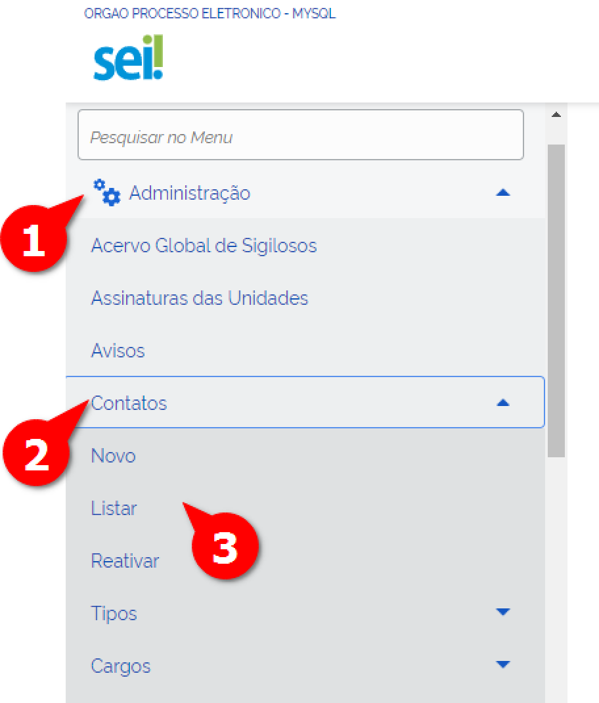

01.Acessar Administração no Menu Principal

02. Acessar Contatos

03. Clicar em Listar

A lista "Contatos" será aberta e será necessário seguir com os seguintes passos:

.. figure:: _static/images/04-02_Contatos-Lista_Contatos-Alterar.png

04. Localizar o tíutlo do cargo a ser alterado e clicar em "Alterar contato"

A tela "Alterar contato" será aberta: 

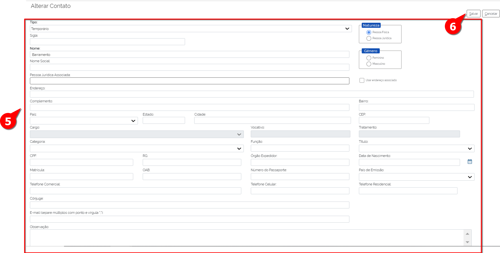

05. Alterar os campos necessários

06. Clicar em Salvar.

Pronto! O tratamento para os cargos dos Contatos foi alterado. 

Desativar Contato
+++++++++++++++++

A desativação do tratamento para cargo é possível por meio dos seguintes passos:

01.Acessar Administração no Menu Principal

02. Acessar Contatos

03. Clicar em Listar

A lista "Contatos" será aberta e será necessário seguir com os seguintes passos:

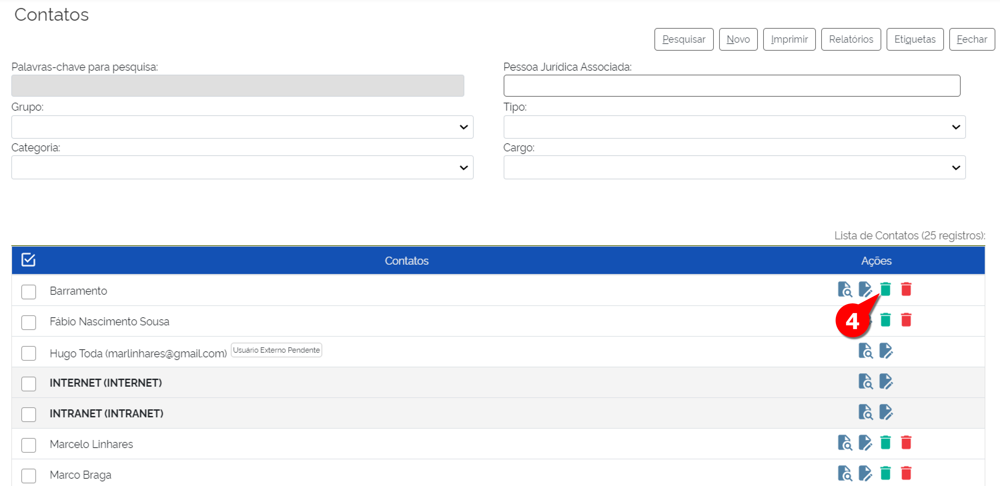

05. Localizar contato a ser desativado e clicar em "Desativar contato"

06. Confirmar comando

Pronto! O Contato foi desativado. Para reativar o Contato, deve-se acompanhar o passo a seguir.

Reativar Contato
++++++++++++++++

A reativação do contato já desativado é possível por meio dos seguintes passos:

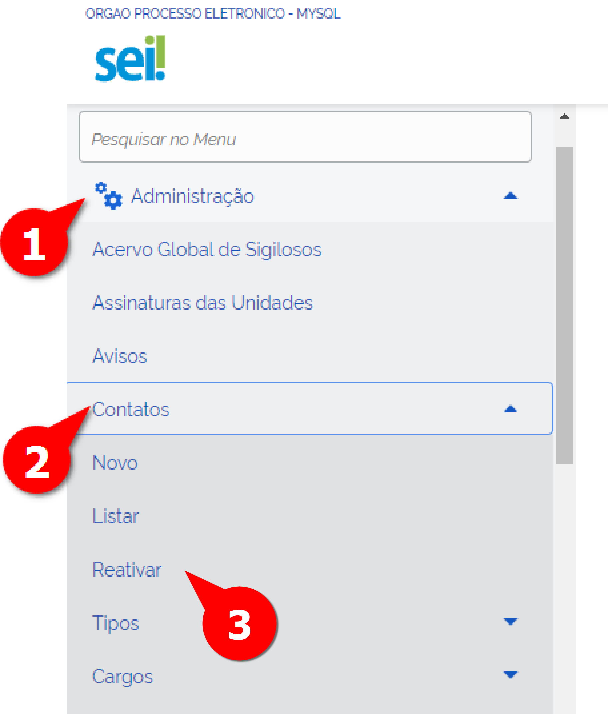

01.Acessar Administração no Menu Principal

02. Acessar Contatos

03. Clicar em Reativar

A lista "Reativar Contatos" será aberta e será necessário seguir com os seguintes passos:

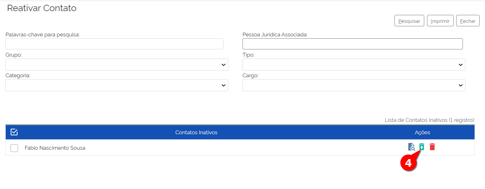

04. Localizar o contato a ser reativado e clicar em "Reativar contato"

05. Confirmar comando

Pronto! O Contato foi reativado.

Excluir Contato
+++++++++++++++

A exclusão do contato, ao contrário da desativação, é uma ação irreversível.

Para realizar tal ação deve seguir os seguintes passos:

01.Acessar Administração no Menu Principal

02. Acessar Contatos

03. Clicar em Listar

A lista "Contatos" será aberta e será necessário seguir com os seguintes passos:

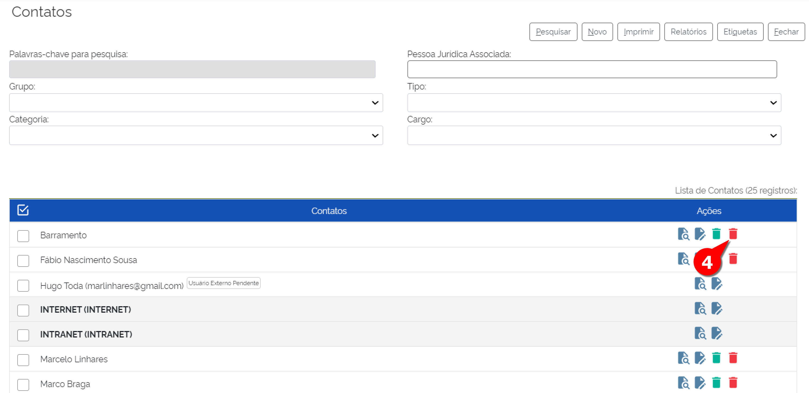

05. Localizar o contato a ser excluído e clicar em "Excluir contato"

06. Confirmar comando

Pronto! O Contato foi excluído.
