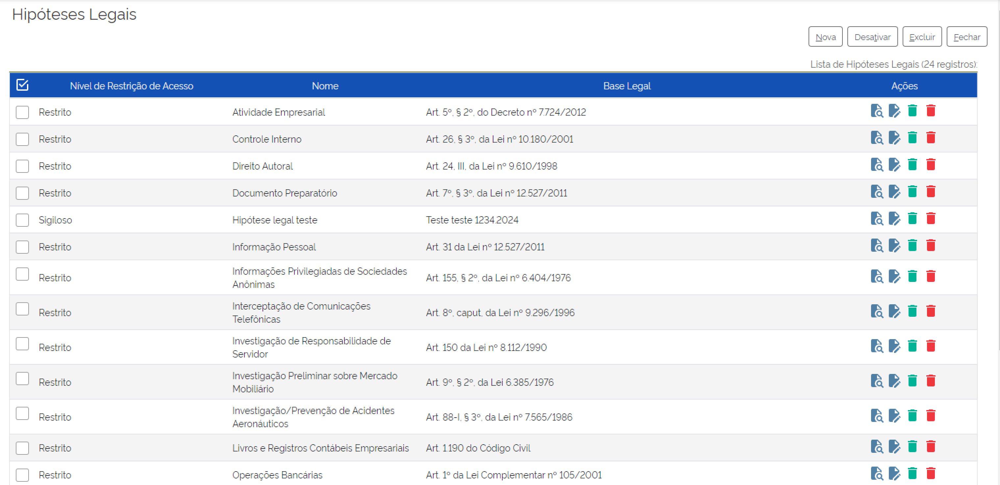
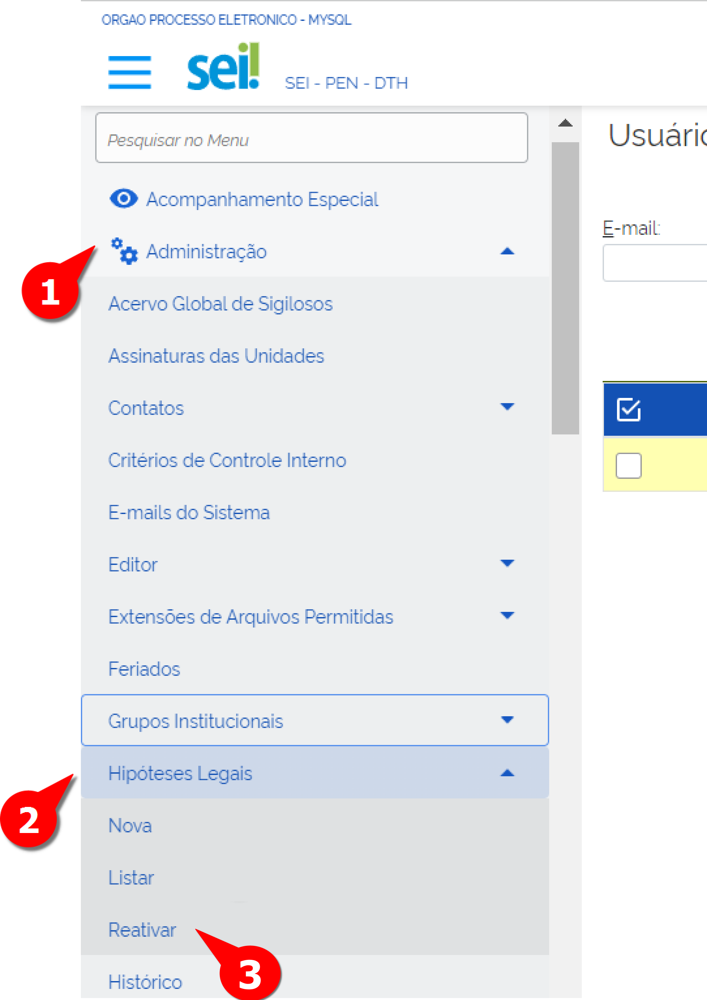
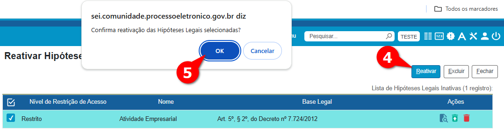
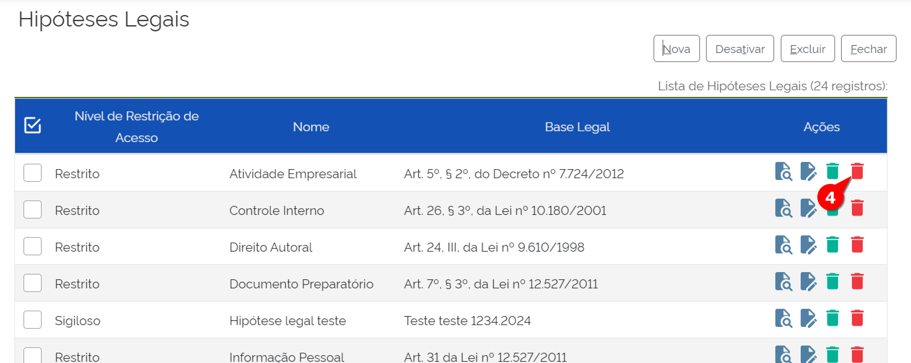

Hipóteses Legais
================

A hipótese legal no SEI é aquela que justifica um processo administrativo ou documento que faça parte de um processo ser restrito ou sigiloso com base em uma Lei de cunho federal, estadual ou municipal. Não é possível cadastrar um tipo de processo ou documento como restrito ou sigiloso sem que se especifique o embasamento jurídico dela.

A hipótese legal não pode ser fundamentada apenas em uma normativa criada pelo próprio órgão; sempre deve obedecer às leis governamentais vigentes, sendo atualmente as leis principais relativas ao acesso, restrição e sigilo da informação produzida pelos órgãos públicos.

No SEI, ao abrir um novo processo (ou criar um documento), o usuário deverá indicar o seu nível de acesso: Sigiloso, Restrito e Público. Para cada nível de acesso é necessário justificar a base legal para seu uso, pois todos têm direito de receber dos órgãos públicos informações de seu interesse particular ou de interesse coletivo ou geral, de acordo com o artigo 5º, inciso XXXIII da Constituição Federal.

.. admonition:: Saiba Mais

   A Lei de Acesso à Informação (LAI), regulamentada pelo Decreto nº 7.724/2012, entrou em vigor em 16 de maio de 2012 e criou mecanismos que possibilitam a qualquer pessoa física ou jurídica, sem necessidade de apresentar motivo, o recebimento de informações públicas dos órgãos e entidades. A lei vale para os três poderes da União, estados, Distrito Federal e municípios, inclusive aos Tribunais de Conta e Ministério Público.

Listar Hipóteses Legais
------------------------

Para o Administrador, é possível listar as hipóteses criadas e criar nova hipótese. Após listar as hipóteses, a coluna “Ações” permite os seguintes comandos: 
Visualizar a configuração da hipótese, alterar a configuração da hipótese, desativar a hipótese e excluir a hipótese. Para acessar a lista, deve-se seguir os seguintes passos:

1. Acessar “Administração” no Menu Principal.

2. Acessar “Hipóteses Legais”.

3. Clicar em “Listar”.

.. figure:: _static/images/04-04_Hipoteses-Legais_Menu_Listar.png

A lista de Hipóteses Legais será exibida.

Nessa lista, percebe-se que cada uma das Hipóteses legais possui comandos de gestão (alterar, desativar e excluir) que serão detalhados a seguir, além de outros dois comandos (criar e reativar) que estão no menu.

Criar Nova Hipótese Legal
-------------------------

Além de listar (e também executar as Ações), é possível criar novas hipóteses criadas. Para isso, deve-se seguir os seguintes passos:

.. figure:: _static/images/04-04_Hipoteses-Legais_Menu_Nova.png

1. Acessar “Administração” no Menu Principal.

2. Acessar “Hipóteses Legais”.

3. Clicar em “Nova”.

A tela de “Nova Hipótese Legal” é aberta.

.. figure:: _static/images/04-04_Hipoteses-Legais_Menu_Nova.png

4. Selecionar o nível de Restrição do Acesso.

5. Preencher os campos “Nome”, “Base Legal” e “Descrição”.

6. Clicar em Salvar.

.. figure:: _static/images/04-04_Hipoteses-Legais_Tela_Nova-Hipotese.png

Pronto, a nova Hipótese Legal foi criada e está disponibilizada para uso dos Usuários.

ALTERAR HIPÓTESE LEGAL
----------------------
Caso se veja necessário realizar alterações dos dados de uma Hipótese Legal já criada, deve-se seguir os seguintes passos: 

.. figure:: _static/images/04-04_Hipoteses-Legais_Menu_Listar.png

01. Acessar “Administração” no Menu Principal.

02. Acessar “Hipóteses Legais”.

03. Clicar em “Listar”.

A lista de Hipóteses Legais deve ser exibida.

.. figure:: _static/images/04-04_Hipoteses-Legais_Lista_Alterar.png

04.Localizar a Hipótese Legal a ser alterada e clicar em "Alterar"

A tela "Alterar Hipóteses Legais" deve ser exibida.

05. Alterar os campos necessários

06. Clicar em "Salvar"

Pronto, a nova Hipótese Legal foi alterada.

DESATIVAR HIPÓTESE LEGAL
------------------------

Caso se veja necessário desativar a Hipótese Legal, deve-se seguir os seguintes passos: 

1. Acessar “Administração” no Menu Principal.

2. Acessar “Hipóteses Legais”.

3. Clicar em “Listar”.

.. figure:: _static/images/04-04_Hipoteses-Legais_Menu_Listar.png

A lista de Hipóteses Legais deve ser exibida.

.. figure:: _static/images/04-04_Hipoteses-Legais_Lista_Desativar.png

4. Localizar a Hipótese Legal a ser alterada e clicar em "Desativar"
5. Confirmar a ação.

Pronto, a nova Hipótese Legal foi desativada.

Esse comando pode ser revertido por meio do comando "Reativar Hipótese Legal", que será detalhada a seguir.

REATIVAR HIPÓTESE LEGAL
-----------------------

Após desativar uma Hipótese legal,é possível reverter essa ação, utilizando a ação "Reativar Hipótese Legal".

Caso se veja necessário reativar a Hipótese Legal já desativada, deve-se seguir os seguintes passos: 

1. Acessar “Administração” no Menu Principal.

2. Acessar “Hipóteses Legais”.

3. Clicar em “Reativar”.

A lista de Hipóteses Legais desativadas deve ser exibida.

4. Localizar a Hipótese Legal desativada a ser reativada e clicar em "Reativar"

5. Confirmar a ação.

Pronto, a nova Hipótese Legal foi reativada.

EXCLUIR HIPÓTESE LEGAL
----------------------

A exclusão de uma Hipótese Legal é uma ação irreversível, ao contrário da desativação. 

Caso se veja necessário exluir a Hipótese Legal, deve-se seguir os seguintes passos: 

.. figure:: _static/images/04-04_Hipoteses-Legais_Menu_Listar.png

1. Acessar “Administração” no Menu Principal.

2. Acessar “Hipóteses Legais”.

3. Clicar em “Listar”.

A lista de Hipóteses Legais deve ser exibida.

4. Localizar a Hipótese Legal  e clicar em "Excluir"

5. Confirmar a ação.

Pronto, a nova Hipótese Legal foi excluída.