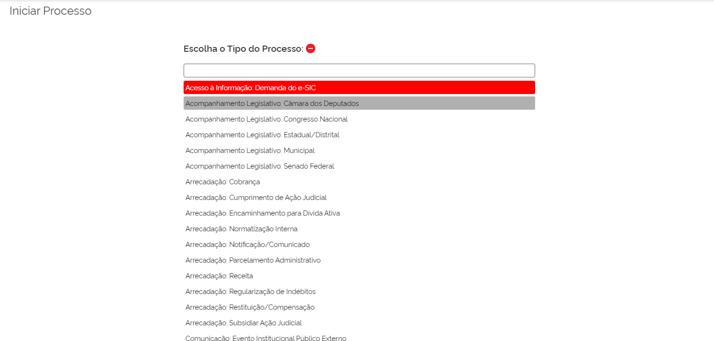
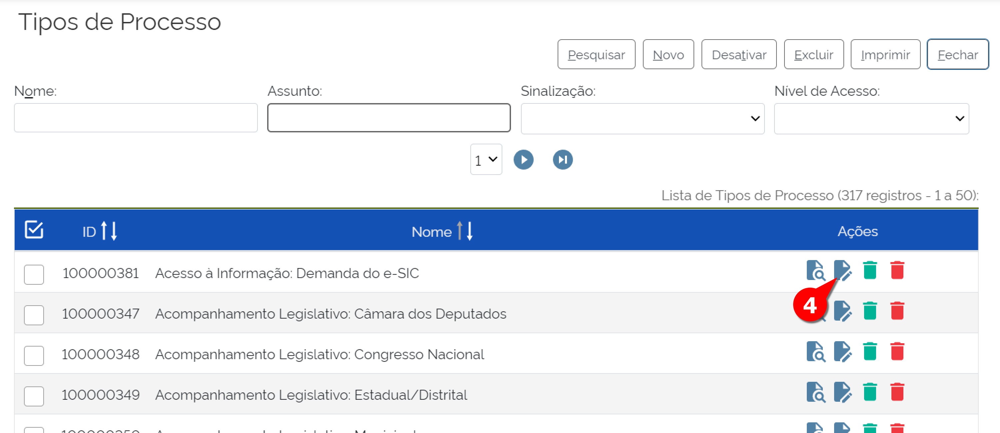
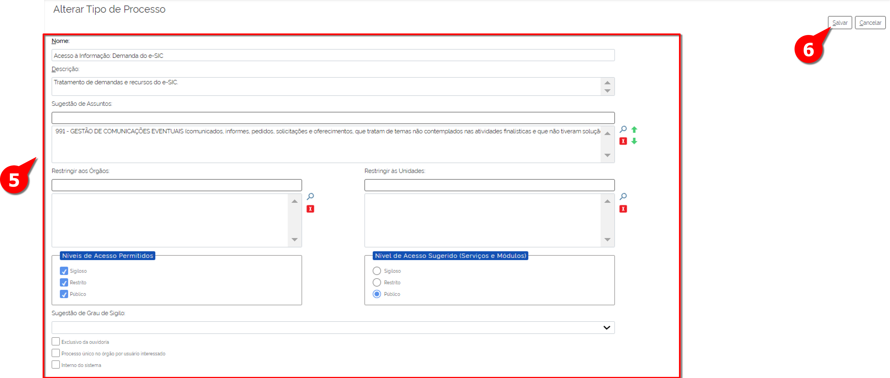
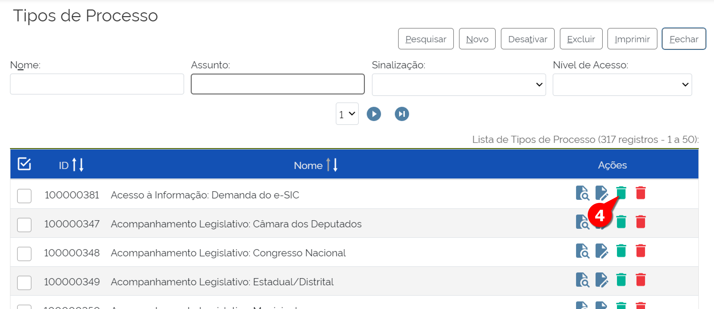
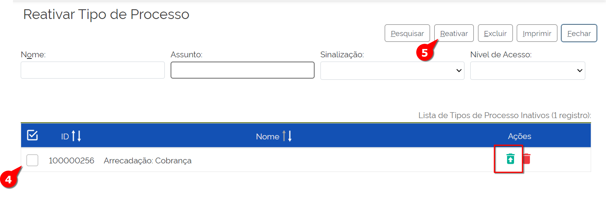

Tipo de Processo
================

Assim que um Usuário inicia um novo processo no SEI, uma das informações primordiais é o Tipo de Processo. O Tipo de Processo é a categoria atribuída a processos, a fim de agrupar aqueles que tratam mesmo assunto e que apresentam classificação de assuntos, temporalidade para guarda específicas e níveis de acesso pré-definidos.

Assim sendo, o cadastro do tipo de processo possui configurações próprias:

* A ele poderão ser associados um ou mais assuntos, com base no Código de classificação de documentos.

* Restrição da apresentação do tipo de processo a determinados órgãos ou unidades.

* Definição de nível de acesso e respectiva Hipótese Legal.

Um grupo de trabalho elaborou a Base de Referência do Poder Executivo, que pode ser carregada no momento da instalação do SEI. Na referida base, cada tipo de processo está associado automaticamente a uma classificação baseada no Código de classificação de documentos, conforme demonstrado na tela “Iniciar Processo”.

 

Independente do uso da Base de Referência do Poder Executivo, o administrador do SEI poderá realizar ações nos tipos de processo, bem como criar novos tipos de processo.

Criar Novo Tipo de Processo
---------------------------

Para criar novo tipo de processo, é necessário que o Administrador siga os seguintes passos no SEI: 

.. figure:: _static/images/04-05_Tipos-Processos_Menu-Tipo-Processo.png

.. figure:: _static/images/04-05_Tipos-Processos_Menu-Tipo-Processo-Novo.png

01. No Menu Principal, acessar “Administração”;

02. Acessar “Tipos de Processo”;

03. Clicar em “Novo”;

A tela de Novo Tipo de Processo será aberta:

.. figure:: _static/images/04-05_Tipo_Processo_Tela_Novo.png

04. Preencher o campo “Nome”, que dará o nome do tipo de processo. É preciso atenção para dois pontos:

    * Fazer um levantamento de todos principais processos do órgão ou entidade a fim de se estabelecer um padrão para a descrição de cada tipo de processo, buscando minimizar a ocorrência de tipos de processos com a mesma função sendo descritos de forma diferente, o que causa dúvidas e perda de informações estatísticas estratégicas. O uso desses descritores também é de grande ajuda para o usuário final, no momento da escolha do tipo de processo. Por exemplo: Gestão de Contrato: Acompanhamento da Execução, Gestão de Contrato: Alteração Contratual, Gestão de Contrato: Apuração de Responsabilidade, Gestão de Contrato: Aplicação de Sanção.

    * Não se nomeia o processo com palavras no plural. Fique atento! Na Base de Referência do Poder Executivo, consta o Plano de classificação, temporalidade e destinação de documentos de arquivo relativos às atividades-meio da Administração Pública, conforme Resolução nº 14/2001 e Resolução nº 21/2004 do CONARQ.

05. Preencher o campo “Descrição”, que são informações que caracterizem do que se trata o tipo de processo;

06. Selecionar as opções para “Sugestão de Assuntos”. Clicar na lupa e selecionar a opção de classificação conforme Código de classificação de documentos do órgão ou entidade que se relaciona com o tipo de processo em questão. Pode ser selecionado mais de um assunto;

07. Restringir aos Órgãos: clicar na lupa e selecionar o órgão que terá acesso a esse tipo de processo. Esse campo somente será preenchido em caso de restrição do tipo de processo a um determinado órgão, na instalação multi-órgãos, ou de ser necessária a restrição à determinada unidade administrativa;

08. Restringir às Unidades: clicar na lupa e selecionar o nome da unidade administrativa para a qual o processo será apresentado na lista de tipos de processo no menu “Iniciar Processo”. É recomendável usar apenas nos casos de processos que podem ser abertos por um setor específico, como o “Assentamento Funcional”, que é gerado somente pelas áreas de recursos humanos;

09. Níveis de Acesso Permitidos: campo obrigatório. Clicar em uma ou mais opções: sigiloso, restrito ou público;

10. Níveis de Acesso Sugerido: campo obrigatório. Clicar em uma ou mais opções: sigiloso, restrito ou público;

Após a realização do levantamento dos tipos de processo, é importante que seja realizado um estudo e uma definição dos níveis de acesso permitidos e sugeridos para cada tipo de processo, conforme a política de segurança da informação de cada órgão ou entidade. Caso não seja possível realizar tal tarefa, deve-se selecionar todas as opções.

11. Sugestão de Hipótese Legal: clicar na seta e selecionar a sugestão de Hipótese Legal, somente nos casos em que as opções restrito ou sigiloso forem selecionadas no “Nível de Acesso Sugerido”;

12. Exclusivo da ouvidoria: selecionar essa opção quando os tipos de processos somente poderão ser iniciados pelas unidades administrativas com perfil de ouvidoria do órgão ou entidade;

13. Processo único no órgão por usuário interessado: selecionar essa opção quando não puder ser gerado mais de um mesmo tipo de processo com o mesmo interessado;

14. Interno do sistema: selecionar essa opção quando o tipo de processo não for aparecer para o usuário.

15. Salvar o Tipo Processo.

Pronto! O Tipo de Processo foi criado e está disponível para o Usuário. 

Listar Tipo de Processo
-----------------------

A listagem do tipo de processo permite editar os Tipos de Processos, por meio das seguintes ações: consultar, realizar alterações nos tipos de processo, desativar e excluir. 

Para listar os tipos de processos disponíveis no Órgão, o Administrador do SEI deve fazer os seguintes passos: 

01. No Menu Principal, acessar “Administração”;

02. Acessar “Tipos de Processo”;

03. Clicar em “Listar”.

.. figure:: _static/images/04-05_Tipos-Processos_Menu-Tipo-Processo.png

.. figure:: _static/images/04-05_Tipos-Processos_Menu-Tipo-Processo-Listar.png

Serão listados os Tipos de Processos cadastrados até o momento no SEI. Na coluna “Ações”, para cada Tipo de Processo é possível executar as seguintes ações, clicando no respectivo ícone: 

* **Consultar**  

Consulta o tipo de processo com as características que lhe foram fornecidas

* **Alterar** 

Altera as características de um Tipo de Processo já criado. Para alterar o Tipo de Processo, deve-se seguir com os seguintes passos: 

4. Clicar em "Alterar Tipo de Processo"

A tela "Alterar Tipo de Processo" será exibida. 

5. Realizar as alterações necessárias
6. Clicar em "Salvar"

Pronto, o Tipo de Processo foi alterado.

* **Desativar** 

Desativa o Tipo de Processo. Essa ação pode ser revertida com o comando “Reativar”, que será abordado a seguir.

Para desativar um tipo de processo, deve-se seguir os seguintes passos: 

4. Clicar em "Desativar Tipo de Processo"

5. Confirmar comando.

Pronto, o Tipo de Processo selecionado foi desativado. 
Para reativar esse tipo de processo, um tópico específico mais adiante será abordado.

* **Excluir**

Exclui o Tipo de Processo. Essa ação **NÃO** consegue ser revertida.

Para excluir um tipo de processo, deve-se seguir os seguintes passos: 

4. Clicar em "Excluir Tipo de Processo"

5. Confirmar comando.

Pronto, o Tipo de Processo selecionado foi excluído. Vale reforçar que esse comando não permite reversão. 

Reativar Tipo de Processo
-------------------------

Ao desativar o tipo de processo, ele pode ser revertido com o comando “Reativar”, seguindo os seguintes passos:

01. No Menu Principal, acessar “Administração”;

02. Acessar “Tipos de Processo”;

03. Clicar em “Reativar”;

.. figure:: _static/images/04-05_Tipos-Processos_Menu-Tipo-Processo.png

.. figure:: _static/images/04-05_Tipos-Processos_Menu-Tipo-Processo-Listar.png

A tela de Reativar Tipo de Processo será aberta.

04. Selecionar os Tipos de Processos a serem reativados;

05. Clicar no botão “Reativar”;

Ou então é possível realizar em um comando: 

06. Clicar no botão “Reativar”   respectivo ao Tipo de Processo na coluna “Ações”.

Pronto, o Tipo de Processo foi reativado. Lembrando que o processo para ser reativado, ele precisa ter sido Desativado: caso ele tenha sido excluído, o processo não pode ser revertido.