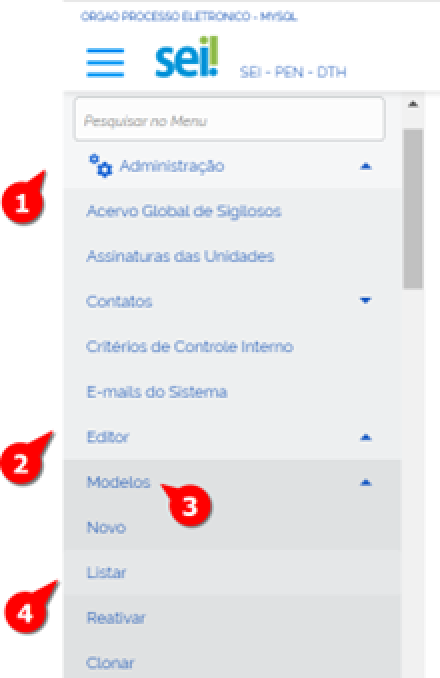
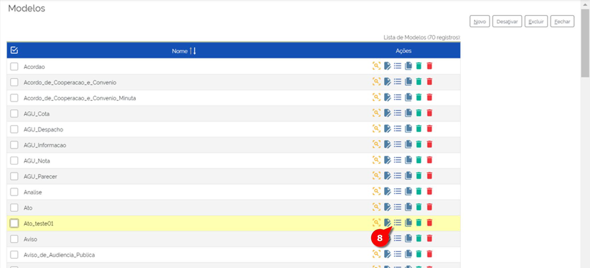
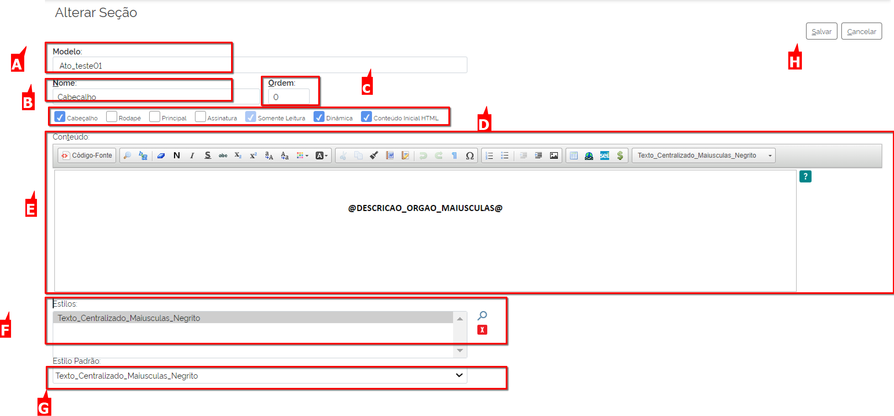
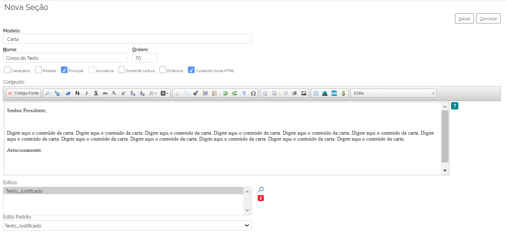
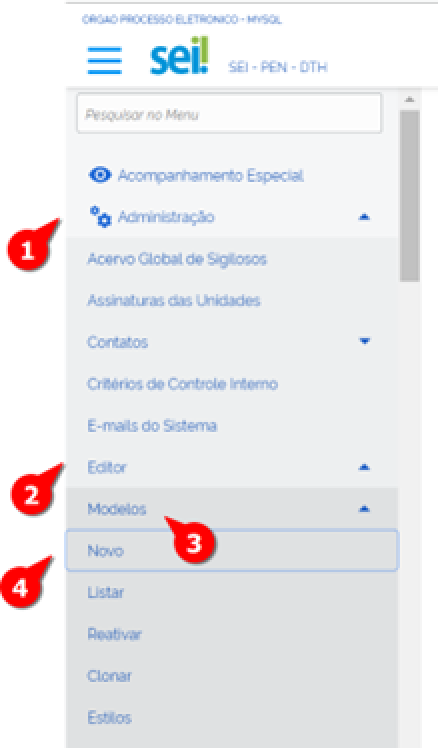
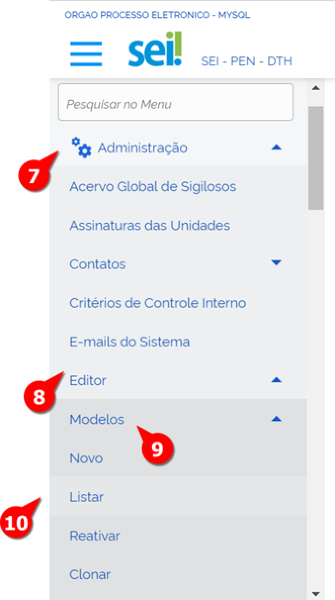
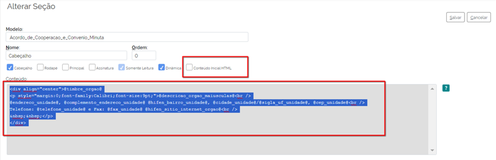

Editor
======

A Função “Editor” do Menu Administração é responsável por customizar os documentos conforme o padrão adotado pelo Órgão ou Entidade e padrões definidos de layout. Esse recurso permite configurar os formatos, os estilos e as tarjas de assinaturas.

Nessa funcionalidade, o administrador trabalhará muito com programação HTML para criar e alterar os documentos customizados, por isso, ter conhecimento em linguagem de programação facilitará muito a formatação dos documentos, mas não é um pré-requisito imprescindível.

O Editor permite a alteração nas 4 seguintes modos de customização: Modelos, Estilos, Tarjas e Formatos de Imagens Permitidos. Iremos ver cada uma em seu detalhe. 

Funcionalidade Modelos
-----------------------

A funcionalidade Modelos aborda os Modelos de documentos a serem utilizados no SEI. Em modelos é possível configurar as seguintes ações: Criar novo modelo, Listar modelos (e nessa listagem na coluna “Ações”, é possível a visualização, a alteração, a seleção de seções do modelo, a desativação e a exclusão do modelo, além de também criar um novo modelo e clonar), a Reativação de Modelo e a Clonagem dos Modelos existentes. 

.. admonition:: Nota

   É preciso reforçar que a apresentação do Editor não será feita na ordem de aparição do Menu Principal. Recomenda-se que o uso de clonagem de um modelo tem uma praticidade maior do que a criação de um Novo Modelo desde o início, já que não herda nenhuma das seções já estabelecidas em seus Modelos. 

Funcinalidade Listar Modelos
-----------------------------

Essa funcionalidade permite ao usuário acessar a lista de documentos carregados na implantação do SEI. Esses documentos poderão ser visualizados, alterados, desativados ou excluídos conforme a necessidade do órgão. Para acessar os modelos, o usuário deverá:

01. No Menu Principal, acessar Administração;

02. Acessar "Editor";

03. Acessar "Modelos";

04. Selecionar "Listar".

A tela de Modelos irá aparecer com os respectivos comandos na coluna “Ações”:

* **Visualizar Modelo**: Visualiza como o modelo é apresentado para o Usuário Básico quando este for utilizá-lo. 

* **Alterar Modelo**: Altera o nome do Modelo

* **Seções do Modelo**: Mostra todas as seções que cada modelo é composto e refere-se às partes do documento, dividida em: “Cabeçalho”, “Título do Documento”, “Corpo do Texto”, “Assinatura”, “Rodapé”, entre outros. Outras seções podem ser criadas, conforme a necessidade do órgão ou entidade.Nessa tela também é possível aplicar as seguintes Ações para cada respectiva seção daquele modelo: Consultar Seção, alterar Seção, Desativar Seção e Excluir Seção.

* **Clonar Modelo**: Realiza a clonagem de um modelo (será retomada uma seção com mais detalhes a seguir)

* **Desativar Modelo**: Desativa o modelo. Possibilidade de Reativação do modelo desativado.
 
* **Excluir Modelo**: Exclui o modelo. Uma vez acionada, essa ação não é reversível: o modelo torna o seu uso permanentemente impossibilitado. 

Funcionalidade Reativar Modelos
-------------------------------

Essa funcionalidade permite ao usuário reativar os modelos desativados conforme a necessidade do órgão. Para acessar os modelos, o usuário deverá:

01. No Menu Principal, acessar Administração;

02. Acessar "Editor";

03. Acessar "Modelos";

04. Selecionar "Reativar";

.. figure:: _static/images/04-06_Editor_Menu_Modelos_Reativar.png
 
A tela “Reativar Modelos” será exibida.

.. figure:: _static/images/04-06_Editor_Lista_Modelos_Reativar.png

05. Localizar o Modelo desativado e clicar em “Reativar Modelo”.

Pronto o modelo foi reativado.

Funcionalidade Clonar Modelos
-----------------------------

Como foi dito anteriormente, para criar um documento com base em outro é possível reaproveitar padrões e editá-los por meio do ícone “Clonar”, que permite replicar um modelo já existente cuja formatação pode ser aproveitada em um novo modelo de documento. Inclusive, recomenda-se usar a opção de clonar sempre que o órgão precisar criar um documento, a fim de minimizar o trabalho. 

Para acessar essa opção de clonagem, o usuário deverá:

.. figure:: _static/images/04-06_Editor_Menu_Modelos_Clonar.png

01. No Menu Principal, acessar Administração;

02. Acessar "Editor";

03. Acessar "Modelos";

04. Selecionar "Clonar";

A tela “Clonar Modelo” será exibida:

.. figure:: _static/images/04-06_Editor_Tela_Clonar-Modelo.png
 
05. Selecionar o Modelo Origem que será clonado dentre a lista apresentada;

06. Preencher o campo com o Nome Destino do Modelo;
 
07. Clicar em Clonar;

Pronto, o Modelo foi clonado e estará à disposição para Ações.

08. Em seguida, o administrador deve clicar no ícone “Seções do Modelo” do documento clonado e realizar as devidas alterações;

A tela “Alterar Seção” é exibida e o Administrador deve continuar com os seguintes passos:

.. figure:: _static/images/04-06_Editor_Lista_Modelos_Secoes_Alterar.png

09. Localizar a seção a ser modificada e clicar no ícone ”Alterar Seção”. 

As seções apresentam a tela de Alterar Seção que são comuns para todas elas. 

**A: Modelo**: Nome do modelo, não é um campo editável.

**B: Nome**: Nome da Seção que será sujeita a alterações, campo editável para alteração.

**C: Ordem**: Campo para indicar qual é a ordem da seção.

**D: Checkboxes Cabeçalho, Rodapé, Principal, Assinatura, Somente leitura, Dinâmica, Conteúdo inicial HTML**: seleções conforme o tipo de Seção.

**E: Conteúdo**: Campos para inserir as informações do documento com comandos comuns a um editor de texto. O uso do ‘@’ entre as variáveis possibilita alterações automáticas conforme a Unidade Administrativa.

Ao clicar no ícone “Ajuda”, as variáveis disponíveis na lista são informações permitidas no cadastro de usuários ou unidades administrativas. Essas variáveis são úteis para automatizar o preenchimento de campos personalizados, tais como: unidade administrativa (nome, sigla, endereço), usuário (nome, cargo, matrícula), data (dia, mês e ano), dados do processo (número, tipo). É importante que o administrador conheça o padrão de organização dos documentos no órgão, por exemplo: sigla do órgão raiz, numeração única no órgão ou unidade administrativa, formato da data.

**F: Estilos**: Estilos pré-determinados, cujas fontes são permitidas para esse documento.

**G: Estilo Padrão**: Estilo pré-determinado que será o padrão para essa Seção.
 
10. Após realizar todas as alterações necessárias, clicar em Salvar.

Para cada seção, há peculiaridades que precisam ser atendidas, de forma a deixar a seção adequada para cumprir a sua função no modelo. 

Seguem as principais seções e seus detalhes: 

Modelo Clonado> Seção> Cabeçalho
~~~~~~~~~~~~~~~~~~~~~~~~~~~~~~~~

Geralmente, o cabeçalho tem a ordem 0, pois é a primeira seção de um documento, mas o órgão poderá alterá-la, caso necessite.

Quando a seção “Cabeçalho” é criada, deve-se selecionar a checkbox “Dinâmica”, que sinaliza a ocorrência de alterações automáticas das variáveis selecionadas no ícone ”Ajuda”. 

Normalmente, o cabeçalho não pode sofrer alteração do usuário, por isso seleciona-se também a checkbox “Somente Leitura”.

Modelo Clonado> Seção > Título do Documento
~~~~~~~~~~~~~~~~~~~~~~~~~~~~~~~~~~~~~~~~~~~~

A seção “Título do Documento” tem configurações muito parecidas com a seção “Cabeçalho”. O título do documento deve ser inserido no campo “Conteúdo”.

Ao clicar no botão “Código-Fonte” ou em “Conteúdo Inicial HTML”, você navega entre a opção de editar o texto ou visualizar a programação em HTML. Faça o teste!

Ao acessar o conteúdo HTML, o administrador pode incluir comandos que a barra de ferramenta do editor não disponibiliza, como travar um campo no corpo do documento. 
Como exemplo, na imagem a seguir, os campos que estão com fundo cinza estão travados para alteração pelo usuário. 

Modelo Clonado> Seção > Corpo do texto
~~~~~~~~~~~~~~~~~~~~~~~~~~~~~~~~~~~~~~

Na seção “Corpo do Texto”, deve-se inserir um texto padrão ou tabelas para preenchimento de formulário. Dependendo do documento ou formulário, pode ser o campo de maior complexidade de criação pelo administrador.

Quando se tratar de um campo de livre escrita pelo usuário, deve-se deixá-lo em branco, mas com o “Estilo Padrão” definido. Estilo é um conjunto de formatações atribuído a um nome, que pode incluir o tipo de fonte, seu tamanho, se em negrito ou itálico, alinhamento, entre outros.

Quando se tratar de um campo de livre escrita, mas que precisa seguir algumas tabulações e fonte, deve-se escrever um texto fictício e formatar cada fonte usando o “Estilo”. O texto propriamente dito é inserido no campo “Conteúdo”. Acompanhe o exemplo a seguir. 

Caso haja a necessidade de usar uma tabela, recomenda-se que a cada nova linha seja inserida uma nova tabela, pois o ajuste das colunas é flexível em tabelas distintas.

Modelo Clonado> Seção > Assinatura
~~~~~~~~~~~~~~~~~~~~~~~~~~~~~~~~~~

Esta seção informa que o documento deve, obrigatoriamente, ser assinado. Ela não é editável pelo usuário e não aceita formatação ou texto na criação do modelo pelo administrador. Os campos ficam em branco e a única opção que deve ser selecionada é “Assinatura”, na parte das checkboxes.

Modelo Clonado> Seção > Rodapé
~~~~~~~~~~~~~~~~~~~~~~~~~~~~~~~

Nesta seção constam os números do processo e do documento, extraídos das variáveis selecionadas no ícone “Ajuda”. Mas, conforme a necessidade do órgão ou entidade, essas variáveis podem ser alteradas.

Funcionalidade Novo 
--------------------

A funcionalidade “Novo” permite ao usuário criar efetivamente um documento. Para isso, o usuário deverá:

01. No Menu Principal, acessar Administração;

02. Acessar “Editor”;

03. Acessar “Modelos”;

04. Selecionar “Novo”;

A tela “Novo Modelo será aberta. 

.. figure:: _static/images/04-06_Editor_Tela_NovoModelo.png

05. Preencher o campo denominado “Nome” como nome do documento;

06. Clicar em “Salvar”;
 
O novo modelo foi criado, mas é preciso inserir as Seções no novo modelo criado:

07. No Menu Principal, acessar “Administração”;

08. Acessar “Editor”; 

09. Acessar “Modelos”; 

10. Clicar em “Listar”; 
 
A tela de Listagem de Modelos deve aparecer.

.. figure:: _static/images/04-06_Editor_Lista_Modelos_Secoes-novo-cont.png

11. Localizar o documento criado na lista;

12. clicar no ícone “Seções do Modelo”;

A tela “Seções” é exibida, mas está sem Seção alguma. Deve-se criar também, novas seções para esse novo modelo.

13. Clicar na opção “Nova”.

Atente-se! Cada nova seção criada permite ao administrador maior controle sobre o que será editado ou não pelo usuário. 

O administrador cria as seções que montam a estrutura do modelo. Algumas seções podem receber informações dinâmicas ou somente leitura. Outras são pré-definidas pelo SEI, como cabeçalho, principal, rodapé e assinatura. O administrador pode também organizar a ordem das seções, numerando-as conforme o tipo de layout do documento. 

.. admonition:: Nota

   Sugere-se padronizar a identidade visual dos documentos do órgão ou entidade para evitar que o formato seja personalizado conforme demandas de setores. Afinal, estamos tratando de um editor de documentos oficiais.

Assim como foram apresentadas dicas das principais Seções quando um modelo é clonado, seguem dicas complementares para a criação de um modelo para as suas seções principais. 

Modelo Novo> Seção> Cabeçalho
~~~~~~~~~~~~~~~~~~~~~~~~~~~~~~

Quando o administrador seleciona a checkbox “Cabeçalho”, o sistema entende que é a parte inicial do modelo do documento. 

Todos os documentos precisam possuir, no cabeçalho, a logomarca e o nome completo do órgão ou entidade. Além disso, nos documentos que tiverem seu destino externo devem constar o endereço completo, telefone e sitio na internet. Geralmente, no cabeçalho, utiliza-se o timbre do órgão e as siglas do órgão e da unidade administrativa.

Campos a serem preenchidos:

* **Nome**: Cabeçalho.

* **Ordem**: 0.

* **Checkbox**: selecionar “Cabeçalho”, “Somente Leitura” e “Dinâmica” (caso venha usar as 
variáveis).

* **Estilos**: clicar na lupa e selecionar as opções desejadas de estilo. Ao clicar na lupa, uma nova janela se abre com uma lista de estilos que podem ser usados para formatar o texto. Clicar na seta verde “Transportar este item e Fechar” do estilo desejado. Depois disso, o estilo irá aparecer na lista de estilos do editor de texto.

* **Estilo Padrão**: selecionar o estilo que será o padrão.

* **Conteúdo**: digitar as informações variáveis ou fixas para o cabeçalho. Neste momento, são utilizadas as variáveis disponíveis no ícone “Ajuda”. As variáveis são identificadas pelo caractere “@” (arroba) no início e no final da palavra da seguinte forma: @timbre_orgao@ e @sigla_orgao_origem@.

Lembre-se de salvar a operação!

.. admonition:: Dica

   Para agilizar a criação de modelos de documentos, pode-se clonar um existente ou copiar parte do script HTML de documentos já criados, instalados na implantação do SEI pela Base de Referência do Poder Executivo, e colar no campo de conteúdo HTML do novo modelo. Vamos dar um exemplo: 

   |secao3|

   |secao4|

.. |secao3| image:: _static/images/04-06_Editor_Tela_Alterar-Secao03.png
   :align: middle
   :width: 800

Modelo Novo> Seção> Título do Documento
~~~~~~~~~~~~~~~~~~~~~~~~~~~~~~~~~~~~~~~~

O Título do Documento é uma seção não obrigatória, fica a critério do administrador criar as duas seções ou apenas uma, mesclando os dados do título com o do cabeçalho.

Campos a serem preenchidos:

* **Nome**: Título do Documento.

* **Ordem**: 10.

* **Checkbox**: selecionar “Somente Leitura” e “Dinâmica” (caso venha usar as variáveis).

* **Estilos**: clicar na lupa e selecionar as opções desejadas de estilo. Ao clicar na lupa, uma nova janela se abre com uma lista de estilos que podem ser usados para formatar o texto. Clicar na seta verde “Transportar este item e Fechar” do estilo desejado. Depois disso, o estilo irá aparecer na lista de estilos do editor de texto.

* **Estilo Padrão**: selecionar o estilo que será o padrão.

* **Conteúdo**: digitar um nome ou usar as variáveis.

Lembre-se de salvar a operação!

Recomenda-se colocar o título do documento dentro de uma célula de tabela, em negrito, centralizado e com fundo cinza.

Modelo Novo> Seção> Corpo do Texto
~~~~~~~~~~~~~~~~~~~~~~~~~~~~~~~~~~

Normalmente, nesta seção, é selecionada a checkbox “Principal”, pois trata-se do conteúdo principal do documento.

Dependendo do tipo de documento, pode-se definir o estilo e deixar o conteúdo em branco, colocar um texto padrão para livre alteração pelo usuário, ou uma tabela com os campos a serem preenchidos. Campos a serem preenchidos:

* **Nome**: Corpo do Texto.

• **Ordem**: 20.

• **Checkbox**: selecionar “Principal” e “Dinâmico” (caso venha usar as variáveis).

• **Estilos**: clicar na lupa e selecionar as opções desejadas de estilo. Ao clicar na lupa, uma nova janela se abre com uma lista de estilos que podem ser usados para formatar o texto. Clicar na seta verde “Transportar este item e Fechar” do estilo desejado. Depois disso, o estilo irá aparecer na lista de estilos do editor de texto.

• **Estilo Padrão**: selecionar o estilo que será o padrão.

• **Conteúdo**: digitar um nome ou usar as variáveis.

Lembre-se de salvar a operação!

Caso o órgão possua modelos de documentos prontos, utilizados em papel, pode-se copiá-los e colá-los no campo “Conteúdo” para agilizar a criação. Para colar o conteúdo, é necessário clicar no campo “Conteúdo” com o botão direito do mouse e colar como “Texto sem Formatação”. 

Modelo Novo> Seção> Assinatura
~~~~~~~~~~~~~~~~~~~~~~~~~~~~~~

Quando o administrador seleciona a checkbox “Assinatura”, o sistema entende que o documento, obrigatoriamente, deve ser assinado. Não permite formatação ou texto na criação do modelo, tampouco edição pelo usuário. Campos a serem preenchidos: 

* **Nome**: Assinatura.

* **Ordem**: 30.

* **Checkbox**: selecionar “Assinatura”.

* **Estilos**: não selecionar nada.

* **Estilo Padrão**: não selecionar nada.

* **Conteúdo**: não colocar nada.

Lembre-se de salvar a operação!

Esta seção dever ser sempre criada, pois, caso não seja, o documento não poderá ser assinado, gerando um erro por falta desta seção.

Nenhuma formatação específica se faz obrigatória nesta seção. Caso haja a necessidade de escrever algo, deve ser feito na seção “Corpo do Texto”.

Modelo Novo> Seção> Rodapé
~~~~~~~~~~~~~~~~~~~~~~~~~~

Campos a serem preenchidos:

* **Nome**: Rodapé.

* **Ordem**: 40.

* **Checkbox**: selecionar “Rodapé”.

* **Estilos**: não selecionar nada.

* **Estilo Padrão**: não selecionar nada.

* **Conteúdo**: esta seção é igual em todos modelos, portanto o que se deve fazer é copiar o código do rodapé de outro modelo acessando o ambiente de programação HTML. É possível também que um determinado documento seja visualizado somente por uma unidade organizacional ou determinado órgão, quando se tratar de multi-órgão.

