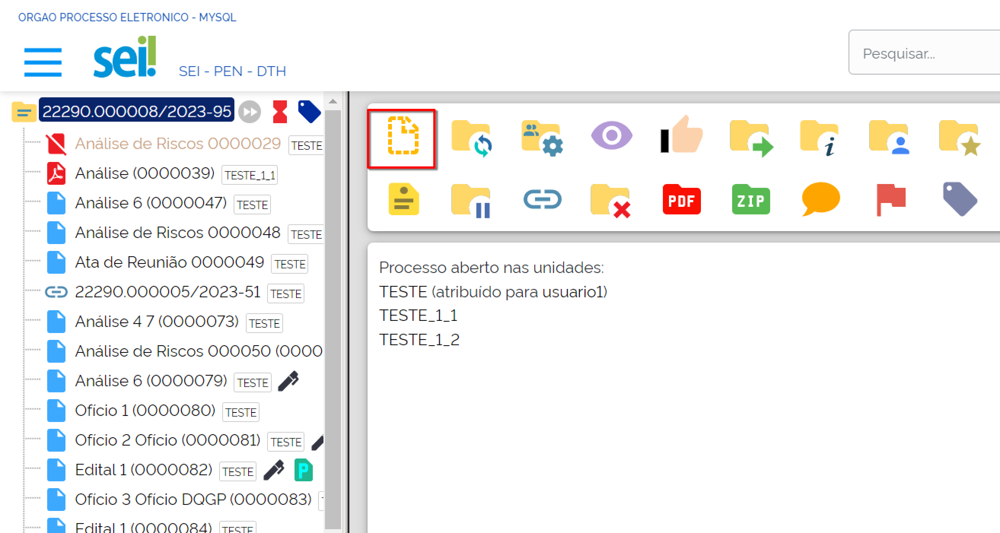
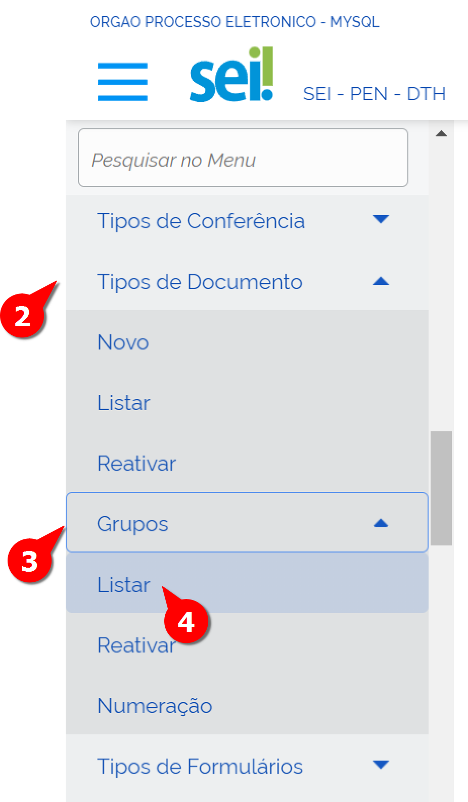
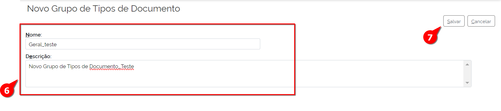
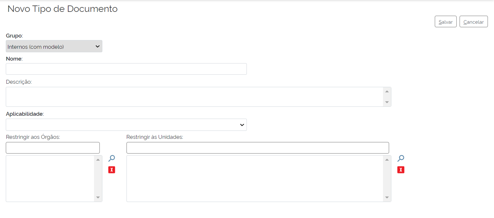
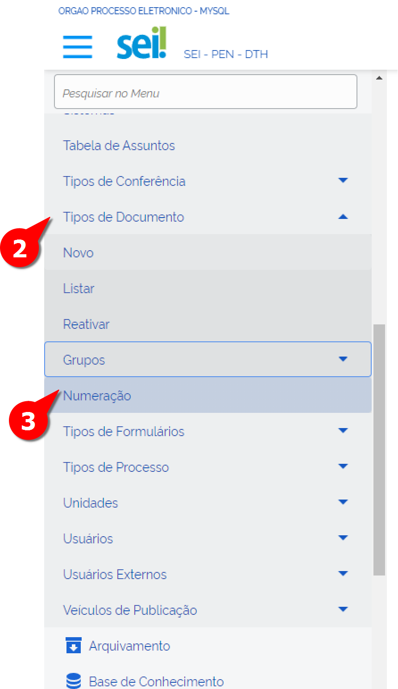
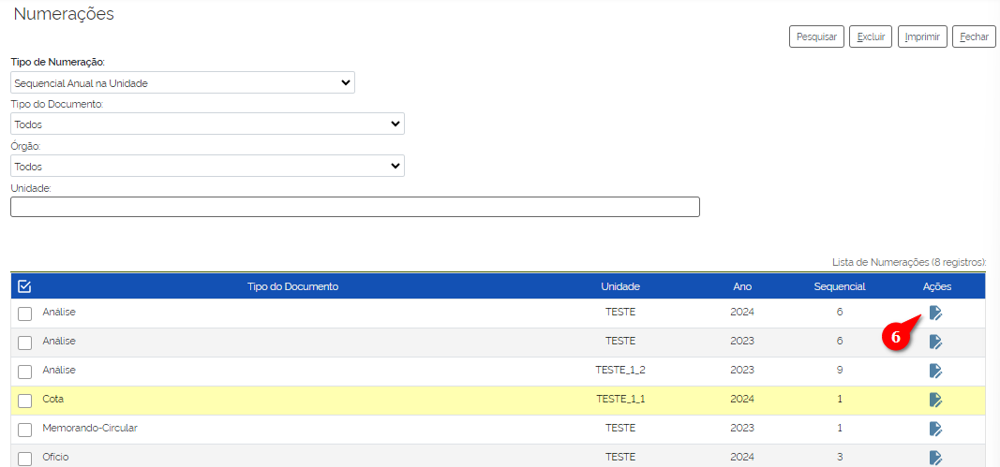

Tipos de Documento
===================

Os tipos de Documentos são documentos produzidos ou recebidos pelo órgão ou entidade e deverão ser registrados no SEI. Os documentos podem ser produzidos dentro do editor de Texto do SEI (como foi vista a sua configuração no tópico passado) ou fora dele. Exemplos de tipos de documento são: Memorando, Despacho, Relatório e Carta.

O Usuário básico terá acesso a esses tipos de documento no SEI por meio do ícone “Incluir Documento”: 
 

FUNCIONALIDADE LISTAR DOCUMENTOS
++++++++++++++++++++++++++++++++

É possível listar os tipos de documento já criados e fazer a gestão deles. Para isso, o usuário deverá:

01. No Menu Principal, acessar Administração;

02. Acessar “Tipos de Documentos”;

03. Acessar “Listar”;

A tela de “Tipos de Documentos será exibida”, cuja lista total aparece em ordem alfabética. 

Do lado direito de cada “Tipo de Documento”, há quatro ícones que representam as seguintes recursos de gestão: visualizar, alterar, desativar e excluir individualmente. 

No menu superior disponível acima da lista, há também funcionalidades para o administrador criar um Tipo, um Grupo, além de desativar e excluir em massa, caso seja selecionado mais de um item. Ainda há a possibilidade de filtrar por grupos e por modelos. 

GRUPOS DE TIPOS DE DOCUMENTO
+++++++++++++++++++++++++++++

Antes de iniciarmos a criação dos tipos de documento, faz-se necessário criar os grupos desses documentos. 

Essa operação visa organizar os tipos de documentos e categorizá-los de forma a facilitar a gestão. Ressalta-se que os agrupamentos poderão ser criados de acordo com a necessidade de cada órgão.

.. admonition:: Nota

   Sugere-se a criação de pelo menos três grupos: externos, internos e geral. O grupo interno será destinado aos tipos documentais que somente poderão ser gerados no editor de texto do SEI. O externo, aos que somente poderão ser inseridos no SEI como documento externo. E o geral, aos que podem tanto ser produzidos no editor de texto quanto inseridos como documento externo.

Para criar um grupo, deve-se seguir os seguintes passos:

.. figure:: _static/images/04-07_Tipos-Documentos_Menu01.png

01. No Menu Principal, acessar Administração;

02. Acessar “Tipos de Documentos”;

03. Acessar “Grupos”;

04. Acessar “Listar";

A tela Grupos de Tipos de Documentos será aberta.

.. figure:: _static/images/04-07_Tipos-Documentos_Lista_Grupo-Tipos-Novo.png

05. Clicar no botão “Novo”

A tela “Novo Grupo de Tipos de Documento” será aberta.

 
06. Preencher o Nome do Novo Grupo e a sua Descrição (preferencialmente os tipos de documentos que esse Grupo irá abranger) nos reséctivos campos; 

07. Clicar em “Salvar”

Pronto, o novo Grupo de Tipo de Documento foi criado. 

NOVO TIPO DE DOCUMENTO
++++++++++++++++++++++

Após criado o Grupo de Tipo de Documento, deve-se criar um Tipo de Documento, deve-se seguir os seguintes passos: 

.. figure:: _static/images/04-07_Tipos-Documentos_Menu01.png

.. figure:: _static/images/04-07_Tipos-Documentos_Menu_Novo-Tipo.png

01. No Menu Principal, acessar Administração;

02. Acessar “Tipos de Documentos”;

03. Clicar em “Novo”;

A tela de “Novo Tipo de Documento” será exibida.

04. Preencher/Selecionar os campos da tela: 

* **Grupo**: Selecionar grupo do Tipo de Documento

* **Nome**: inserir o nome do tipo documental. Será apresentado ao usuário no momento da inclusão do documento no SEI.
Lembre-se que não se nomeia o documento com palavras no plural. É importante não confundir documento com processo. Fique atento, pois esse é um  erro comum nos órgãos e entidades

* **Descrição**: descrever do que se trata o tipo de documento.

* **Aplicabilidade**: selecionar a opção correspondente entre as disponíveis:
	
    - Documentos internos e externos: o tipo documental é apresentado tanto na relação de documentos a serem produzidos no editor de texto quanto no tipo “Externo”.
    - Documentos internos: o tipo documental é apresentado somente na relação de documentos a serem produzidos no editor de texto. 
    - Documentos externos: o tipo documental é apresentado somente na relação de documentos “Externo”.
    - Formulário: o tipo documental é apresentado somente para documentos do tipo “Formulário do Sistema”

* **Modelo**: escolher o modelo que foi previamente gerado e formatado no editor do SEI, conforme ensinado em outro módulo.

* **Tipo de Numeração**: selecionar a opção de numeração de acordo com o tipo de documento em questão. Trata-se da geração automática de numeração sequencial pelo SEI. O sistema oferece várias opções que podem ser selecionadas conforme a necessidade de cada órgão.

     - Sem numeração: documentos que não precisam de número sequencial.
     - Sequencial na Unidade: documentos controlados pela unidade administrativa que precisam de numeração sequencial. Essa numeração nunca é zerada. Exemplo: Termo de Referência.
     - Sequencial no Órgão: documentos controlados pelo órgão ou entidade que precisam de numeração sequencial. Essa numeração nunca é zerada. Exemplo: Parecer Jurídico.
     - Sequencial Anual na Unidade: documentos controlados pela unidade administrativa que precisam de numeração sequencial. Essa numeração é zerada sempre que começa o ano. Exemplo: Carta e Memorando.
     - Sequencial Anual do Órgão: documentos controlados pelo órgão ou entidade que precisam de numeração sequencial. Essa numeração é zerada sempre que começa o ano. Exemplo: Portaria.

* **Sugestão de Assuntos**: selecionar o tipo de assunto de acordo com a lista do Código de classificação de documentos, conforme ensinado em outro módulo.

* **Restringir aos Órgãos**: clicar na lupa e selecionar o órgão ou entidade que terá acesso a este tipo de documento. Este campo somente será preenchido em caso de restrição do  tipo de documento a um determinado órgão, na instalação multi-órgãos, ou de ser necessária a restrição à determinada unidade administrativa.

* **Restringir às Unidades**: clicar na lupa e selecionar o nome da unidade administrativa para a qual o documento será apresentado na lista de tipos de processo no menu “Iniciar Processo”.

Você pode restringir quando precisar que determinado departamento faça testes para um novo documento.

* **Veículo de Publicação**: clicar na lupa e selecionar a opção desejada. Deve ser utilizado somente para documentos do tipo interno. Os documentos selecionados podem ser publicados por veículos de publicação.Você sabia que no menu “Administração”, há o item “Veículos de Publicação”? O SEI permite configurar os veículos de publicação que podem interagir com o sistema para agendamento, cancelamento e confirmação. Um exemplo é o Boletim Eletrônico.

* **Permitir Publicação Apenas Para Documentos Assinados**: selecionar esta opção em caso de documento que será visualizado apenas se tiver sido assinado.

* **Permite Interessados**: selecionar esta opção caso seja importante que o usuário preencha o campo “Interessados”. Esta ação, ao ser selecionada, facilita a pesquisa.

* **Permite Destinatários**: selecionar esta opção caso seja importante que o usuário preencha o campo “Destinatários”. Esta ação, ao ser selecionada, facilita a pesquisa.

* **Interno do Sistema**: selecionar esta opção somente se o Tipo de Processo não for aparecer para usuários. Por exemplo: um formulário a ser usado pela equipe de WebService

NUMERAÇÃO DE DOCUMENTO
++++++++++++++++++++++

É possível verificar em qual numeração está cada documento. Além disso, é permitido listar quais documentos foram configurados para cada tipo de numeração. 

É possível também ajustar a Numeração Sequencial atribuído ao tipo de Documento.

Para realizar esta operação, o usuário deverá:

.. figure:: _static/images/04-07_Tipos-Documentos_Menu01.png

01. No Menu Principal, acessar Administração;

02. Acessar “Tipos de Documentos”;

03. Acessar “Numeração”;

A tela de “Numerações” será exibida para preenchimento dos campos para pesquisa. 

.. figure:: _static/images/04-07_Tipos-Documentos_Tela_Numeracao.png

04. Preencher os campos disponíveis. 

Os campos básicos são:

**Tipo de Numeração**: escolher entre Sequencial na Unidade, Sequencial no Órgão, Sequencial Anual na Unidade, Sequencial Anual no Órgão.

**Tipo do Documento**: Escolher o tipo de Documento, conforme: 

  **Órgão**: Qual Órgão o Documento está submetido

Outros campos são exibidos para preenchimento dependendo das seleções anteriores. 

05. Clicar em “Pesquisar”;

Uma lista dos tipos de Documentos será exibida: 
 

06. Clicar em asdfasdfasdfa na coluna “Ações”;

A tela “Ajustar Numeração será exibida” e nela deve seguir esses passos:

.. figure:: _static/images/04-07_Tipos-Documentos_Tela_Ajustar-Numeracao.png
 
07. Preencher o sequencial novo para o tipo de documento;

08. Clicar em Salvar.

Pronto, o sequencial do tipo de documento foi alterado. 
