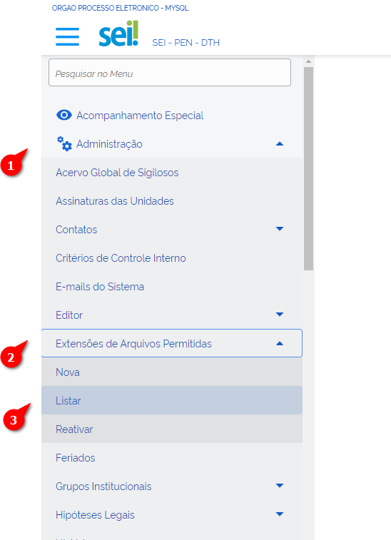
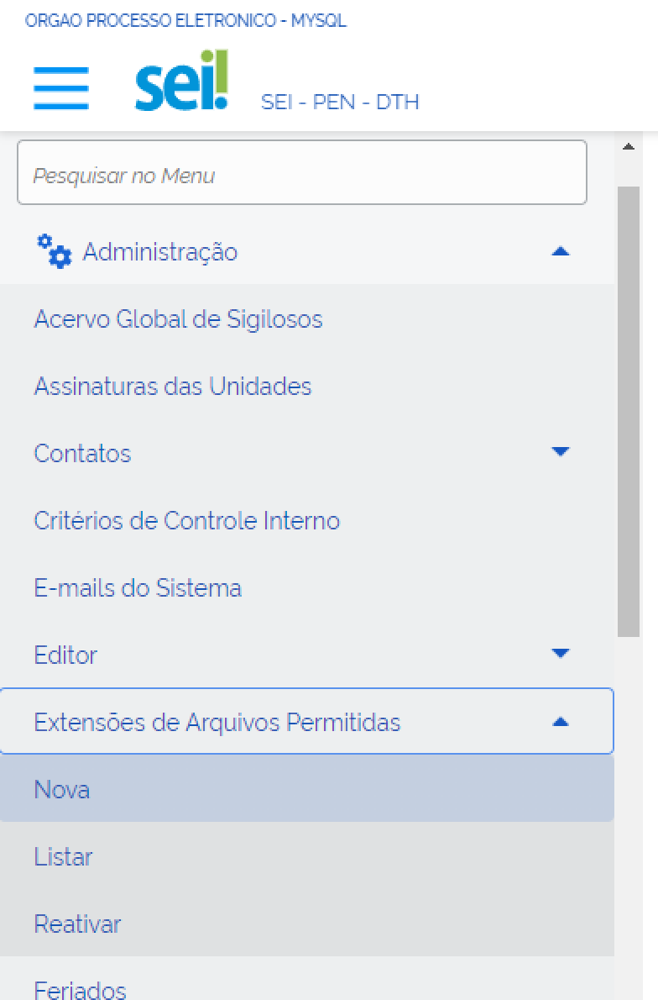
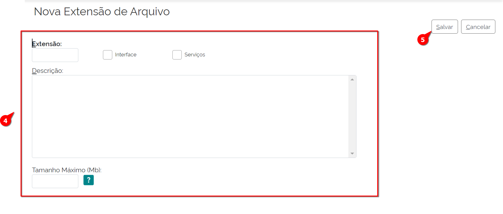
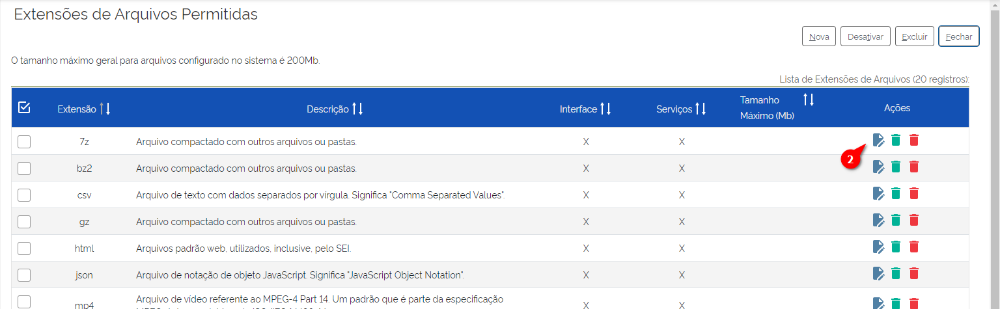
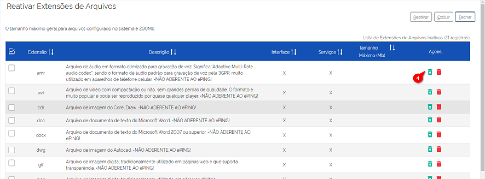

Extensões de Arquivos Permitidos
=================================

O SEI possui dois tipos de documentos o interno e o externo: 

- O documento interno é criado no próprio SEI, ou seja, é aquele que foi construído no editor nativo a partir dos modelos de documentos estabelecidos pelo administrador, lembrando que a extensão desse tipo de documento é sempre html. 

- O documento externo é incluído no SEI por meio de upload de um arquivo na máquina do usuário, podendo ser de diferentes extensões. Contudo, o domínio de extensões pode ser configurado pelo administrador por meio da funcionalidade “Extensões de Arquivos Permitidas”. 

Dessa forma, há uma lista de tipos de documentos externos que podem ser incluídos no SEI como arquivos Permitidos. Para acessá-la, é necessário acompanhar o caminho descrito a seguir.

01. No Menu Principal, acessar Administração.

02. Acessar “Extensões de Arquivos Permitidas”.

03. Acessar “Listar”.

A tela de “Extensões de Arquivos Permitidas” irá exibir uma lista com todos tipos de extensões de arquivos permitidos no SEI, bem como informações (Interface, Serviços e Tamanho máximo) e Ações (Alterar, Desativar e Excuir as Extensões de Arquivos).

Inclusão de Nova Extensão de Arquivos
-------------------------------------

É possível configurar as extensões de arquivos permitidas por meio do cadastramento de uma nova extensão. Para acessá-la, é necessário acompanhar o caminho descrito a seguir.

01. No Menu Principal, acessar Administração.

02. Acessar “Extensões de Arquivos Permitidas”.

03. Clicar em “Nova”.

A tela de “Nova Extensão de Arquivo” é aberta.

04. Preencher os seguintes campos:

- Extensão: deve ser preenchido exatamente com o nome da extensão na qual se deseja permitir o upload do arquivo para o sistema

.. admonition:: Nota

   Fique atento! O sistema não considera, por exemplo, PDF e pdf como a mesma extensão de arquivo. Assim, ele diferencia letras maiúsculas e minúsculas, ou seja, é “case sensitive”.

* **Checkbox Interface**: (Seleção opcional)
* **Checkbox Serviços**: (Seleção opcional)
* **Descrição**: Descrição da extensão de arquivo.
* **Tamanho Máximo (Mb)**: se o campo não for preenchido, o tamanho limite para upload de um arquivo dessa extensão é o mesmo estabelecido no parâmetro  SEI_TAM_MB_DOC_EXTERNO”. 

05. Clicar em Salvar.

Pronto, uma nova Extensão de arquivos foi adicionada.

Alteração de Extensão de Arquivos
---------------------------------

O SEI permite que uma extensão anteriormente cadastrada seja alterada. 

Após acessar a tela de “Extensões de Arquivos Permitidas”, o administrador deverá:

 
01. Localizar a coluna Ações; 

02. Clicar na opção “Alterar Extensão do Arquivo”;

A tela de “Alterar Extensão de Arquivo” será exibida.

03. Os campos “Extensão”, “Descrição” e “Tamanho Máximo”, bem como os checkbox Interface e Serviços estarão habilitados para alteração pertinente;

04. Clicar em “Salvar”.

Pronto, a Extensão de arquivos foi alterada.

Exclusão de Extensão de Arquivos
--------------------------------

É possível excluir determinado tipo de extensão de arquivos. É necessário reforçar que essa ação é irreversível, ao contrário da ação “Desativar”, abordada logo a seguinte.

Após acessar a tela de “Extensões de Arquivos Permitidas”, o administrador deverá:

.. figure:: _static/images/04-08_Extesoes-Arquivos-Permitidos_Lista_Excluir.png

01. Localizar a coluna Ações;

02. Clicar na opção “Excluir Extensão do Arquivo”;

03. Confirmar a exclusão da Extensão de Arquivo.

Pronto, a Extensão de arquivos foi excluída.

Desativação de Extensão de Arquivos
-----------------------------------

É possível desativar determinado tipo de extensão de arquivos. É necessário reforçar que essa ação é reversível, ao contrário da ação “Excluir”, abordada na seção anterior. Para reverter a desativação, será abordada em seguida.

Após acessar a tela de “Extensões de Arquivos Permitidas”, o administrador deverá: 

01. Localizar a coluna Ações;

02. Clicar na opção “Desativar Extensão do Arquivo”;

03. Confirmar a desativação da extensão do Arquivo.

Pronto, a Extensão de arquivos foi desativada.

Reativação de Extensão de Arquivos
----------------------------------

É possível reativar determinado tipo de extensão de arquivos após a sua desativação. 

Para isso, o Administrador deverá: 

.. figure:: _static/images/04-08_Extesoes-Arquivos-Permitidos_Menu_Reativar.png

01. No Menu Principal, acessar Administração;

02. Acessar “Extensões de Arquivos Permitidas”;

03. Acessar “Reativar”;
 
A tela de Reativar Extensões de Arquivos será aberta.
 

04. Clicar no Ícone “Reativar Extensão de Arquivo”;

05. Confirmar ação.

Pronto, a Extensão de arquivos foi reativada.
