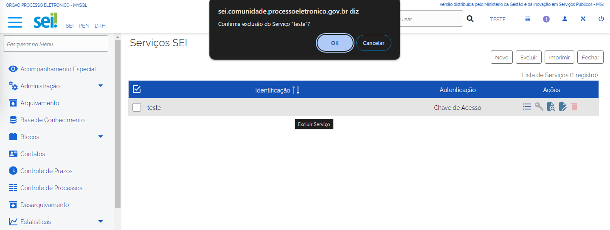

Sistemas
========

Introdução aos Sistemas
-----------------------

No SEI há a possibilidade de configurar os sistemas externos que podem acessar os serviços disponibilizados. 

Antes disso, é necessário cadastrar o sistema e realizar a associação com os respectivos serviços, sendo possível indicar o tipo de processo de documento e as unidades permitidas. 

Os serviços são descritos em formato XML em um padrão denominado Web Services Description Language (Linguagem de Descrição de Serviços Web). Além de descrever os serviços, esse padrão especifica como acessá-los e quais operações ou métodos estão disponíveis.

.. admonition:: Notas

   O acesso ao Web Services Description Language (WSDL) é realizado por meio do seguinte endereço: "http://[servidor_php]/sei/controlador_ws.php?servico=sei". 
	
   A variável `[servidor php]` é o endereço web do SEI.
	
   Os serviços do SEI estão documentados no seguinte endereço: https://softwarepublico.gov.br/social/articles/0004/7172/SEI-WebServices-v3.0.pdf . 
	
   Ressalta-se que essa documentação é bastante técnica e destinada a profissionais de Tecnologia da Informação. 

Para acessar a funcionalidade “Sistemas” o administrador deve selecionar no menu principal o item “Administração” e depois “Sistemas”. Em seguida aparece quatro ações possíveis: “Novo”, “Listar”, “Reativar” e “Monitoramento de Serviços”. 

Vamos aprofundar nosso conhecimento nessas ações!

Incluir Novo Sistema
--------------------

Para inserir um novo sistema o administrador deve acompanhar o caminho descrito a seguir:

1. Acesse o SEI e entre no menu principal;

2. Selecione a opção “Administração”;

3. Clique no item “Sistemas”;

4. Selecione “Novo”;

5. Preencha os campos: “Órgão”, “Sigla” e “Nome”;

6. Clique em “Salvar”.

A tela “Novo Sistema” é composta pelos seguintes campos, todos de preenchimento obrigatório:

* **Órgão**: recupera todos os órgãos cadastrados no SIP.
* **Sigla**: deve-se colocar a sigla do novo sistema.
* **Nome**: deve-se preencher com o nome completo do sistema.

A imagem a seguir apresenta a disposição dos campos na tela do sistema.
 
.. figure:: _static/images/04-11_Incluir-Novo-Sistema_Tela_Novo-Sistema.png

Listar Sistemas
---------------

Para listar os sistemas cadastrados, o administrador deve acompanhar o caminho descrito a seguir:

1. Acesse o SEI e entre no menu principal;

2. Selecione a opção “Administração”;

3. Clique no item “Sistemas”;

4. Selecione “Listar”.

.. figure:: _static/images/04-11_Listar-Sistemas_Tela_Acessar-Listar-Sistema.png

.. figure:: _static/images/04-11_Listar-Sistemas_Tela_Acessar-Listar-Sistema2.png

Após clicar em “Listar” abrirá uma nova tela denominada “Sistemas”. Na coluna “Ações” há cinco ações possíveis: “Serviços”, “Consultar Sistema”, “Alterar Sistema”, “Desativar Sistema” e “Excluir Sistema”. A tela dessa funcionalidade é apresentada da seguinte maneira.

.. figure:: _static/images/04-11_Listar-Sistemas_Tela_Listar-Sistemas.png

Agora vamos navegar em cada uma das ações possíveis da funcionalidade “Listar Sistemas” para conhecê-las:

Serviços
~~~~~~~~

Para se ter acesso aos serviços, o usuário deve clicar no ícone referente à opção “Serviços” na coluna “Ações”. Em seguida, uma nova tela é apresentada e, clicando no botão “Novo”, pode-se cadastrar novos serviços. Essa tela é composta pelos seguintes campos:

**Campos a serem preenchidos**: 

* **Identificação**: o campo é informado na chamada do WebService e é de preenchimento obrigatório.

* **Descrição**: deve-se colocar uma descrição do serviço utilizado pelo sistema, ou seja, a especificação do objetivo do serviço. Não é de preenchimento obrigatório.

* **Autenticação**: pode ser feita através de uma chave de acesso ou por endereço. No segundo caso tem-se:

* **Servidores**: deve-se preencher com os endereços IP que poderão acessar o serviço e é de preenchimento obrigatório. O SEI valida se o serviço está sendo chamado por um dos endereços informados nesse campo retornando “Acesso Negado” se não encontrar. Além disso, é lançado um registro na tabela “infra_log” informando qual servidor tentou acessar o serviço. Dependendo da configuração da rede pode ser necessário informar o nome e o IP do servidor na lista.
  
É permitido o uso de até um caractere curinga no nome do servidor, por exemplo, “10.100.50.*”. Se apenas o “*” for cadastrado, então qualquer máquina estará liberada para acesso.
  	
* **Gerar links de acesso externos**: ao marcar essa checkbox, um link para acesso ao processo ou documento será retornado ao selecionar um serviço do SEI. Sistemas desenvolvidos utilizando a InfraPHP, como é o caso do SEI e do SIP, possuem um mecanismo de autenticação automática, ou seja, ao clicar no link, o SEI será aberto automaticamente para visualização do processo ou documento. Em sistemas que não utilizam a InfraPHP ou o usuário não tenha permissão no SEI, o processo ou documento será visualizado da mesma forma que a funcionalidade de “Acesso Externo”.

Lembre-se de salvar a operação clicando no botão “Salvar” localizado no canto superior direito da tela.

A imagem a seguir apresenta a disposição dos campos na tela do sistema.

.. figure:: _static/images/04-11_Serviços_Tela_Novo-Serviço.png

Na tela dos serviços há as seguintes ações:

Operações
~~~~~~~~~~

Para acessá-la, o administrador deve acompanhar o caminho descrito a seguir:

1. Na página de Listar Sistemas, selecione a opção “Serviços”;

2. E depois clique no ícone “Operações”.

.. figure:: _static/images/04-11_Serviços-Operações_Tela_Acessar-Serviço.png
	
.. figure:: _static/images/04-11_Serviços-Operações_Tela_Acessar-Operações.png

A disposição dos campos na tela que aparece após clicar na ação “Operações” é apresentada da seguinte maneira.
	
.. figure:: _static/images/04-11_Serviços-Operações_Tela_Operações.png
	
O cadastro de novas operações é realizado por meio do botão “Novo”, localizado no canto superior direito da tela e é composto pelos seguintes campos:
	
* **Tipo da Operação**: essas operações estão relacionadas às ações no processo ou documento, tais como: “Cancelar Documento”, “Adicionar Arquivo”, “Concluir Processo”. 

* **Unidades**: unidades do órgão no qual o SEI é vinculado. 

* **Tipo do Processo**: tipos de processos cadastrados.  

* **Tipo do Documento**: tipos de documentos cadastrados.
	
.. figure:: _static/images/04-11_Serviços-Operações_Tela_Nova-Operação.png
	
Ressalta-se que a quantidade de campos exibida está relacionada ao “Tipo da Operação” selecionado e que apenas o campo “Tipo da Operação” é de preenchimento obrigatório.

Consultar Serviço
~~~~~~~~~~~~~~~~~~

Para acessar essa funcionalidade, o administrador deve acompanhar o caminho descrito a seguir.

1. Na página de Listar Sistemas, selecione a opção “Serviços”;

2. E depois, clique no ícone “Consultar Serviço”.
	
.. figure:: _static/images/04-11_Serviços-Operações_Tela_Acessar-Serviço.png

.. figure:: _static/images/04-11_Serviços-Consultar-Serviço_Tela_Acessar-Consultar-Serviço.png
	
A imagem a seguir apresenta a disposição dos campos na tela “Consultar Serviço”.
	
.. figure:: _static/images/04-11_Serviços-Consultar-Serviço_Tela_Consultar-Serviço.png
	
Alterar Serviço 
~~~~~~~~~~~~~~~~

Caso seja preciso alterar um serviço, é necessário clicar na ação “Alterar Serviço”. Ressalta-se que todos os campos podem ser alterados. A imagem a seguir apresenta a disposição dos campos na tela “Alterar Serviço”.
	
.. figure:: _static/images/04-11_Serviços-Alterar-Serviço_Tela_Alterar-Serviço.png

Excluir Serviço 
~~~~~~~~~~~~~~~~

Para excluir um serviço, deve-se clicar no ícone “Excluir Serviço”. Além disso, pode-se excluir mais de um serviço ao mesmo tempo por meio do botão “Excluir”, localizado no canto direito superior da tela. Ao clicar em uma das opções disponíveis, aparece uma mensagem de confirmação. 

A imagem a seguir mostra a mensagem de confirmação da exclusão.

Alterar e Consultar Sistemas
----------------------------

.. admonition:: Dica

   Para acessar as funcionalidades “Alterar Sistema” ou “Consultar Sistema”, é necessário clicar no ícone pretendido, localizado na coluna “Ações” à direita da tabela.
	
Os campos que aparecem na tela de inclusão também são apresentados nas telas “Alterar Sistema” e “Consultar Sistema”. A diferença é que na tela “Alterar Sistemas” os campos estão liberados para alteração, enquanto na tela “Consultar Sistemas” as informações estão disponíveis apenas para visualização.

Desativar Sistema
----------------- 

Para desativar um sistema, é necessário clicar na ação “Desativar Sistema”. 

Em seguida, aparece uma mensagem de confirmação da desativação. Caso o usuário clique no botão “OK”, o sistema não é mais apresentado na tela do sistema. 

.. admonition:: Dica

   Apenas um sistema é desativado por vez.

A imagem a seguir mostra a mensagem de confirmação da desativação.

.. figure:: _static/images/04-11_Desativar-Sistema_Tela_Desativar-Sistema.png

Excluir Sistema 
---------------

Para excluir um sistema, é necessário clicar na ação “Excluir Sistema”. 

Em seguida, aparece uma mensagem de confirmação da exclusão. Caso o usuário clique no botão “OK”, o sistema é deletado do banco de dados.

.. admonition:: Dica

   O SEI não permite a exclusão de mais de um sistema simultaneamente. 

A imagem a seguir mostra a mensagem de confirmação da exclusão.

.. figure:: _static/images/04-11_Excluir-Sistema_Tela_Excluir-Sistemas.png

Vamos reforçar nosso aprendizado sobre a funcionalidade ensinada com o vídeo a seguir: 

Clique `[aqui] <https://cdn.evg.gov.br/cursos/304_EVG/videos/modulo05video05.mp4>`_ para ver o vídeo.

Reativar Sistema 
----------------

A funcionalidade “Reativar” permite ao usuário consultar sistemas que foram desativados. Ao abrir a tela “Reativar Sistemas”, o administrador tem acesso a mais duas ações: “Reativar” e “Excluir”. 

Para acessar essa funcionalidade, o administrador deve acompanhar o caminho descrito a seguir.

1. Acesse o SEI e entre no menu principal;

2. Selecione a opção “Administração”;

3. Clique no item “Sistemas”;

4. Selecione “Reativar”.

.. figure:: _static/images/04-11_Listar-Sistemas_Tela_Acessar-Listar-Sistema.png

.. figure:: _static/images/04-11_Reativar-Sistema_TelaSEI_Reativar-Sistema.png
	
.. admonition:: Nota

   O SEI permite que mais de um sistema seja reativado simultaneamente por meio do botão “Reativar”, localizado no canto superior direito da tela. 

A imagem a seguir apresenta a disposição dos campos na tela “Reativar Sistema”.

.. figure:: _static/images/04-11_Reativar-Sistema_Tela_Reativar-Sistema.png
