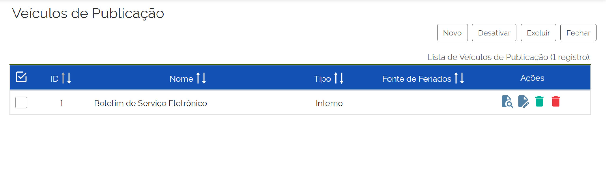
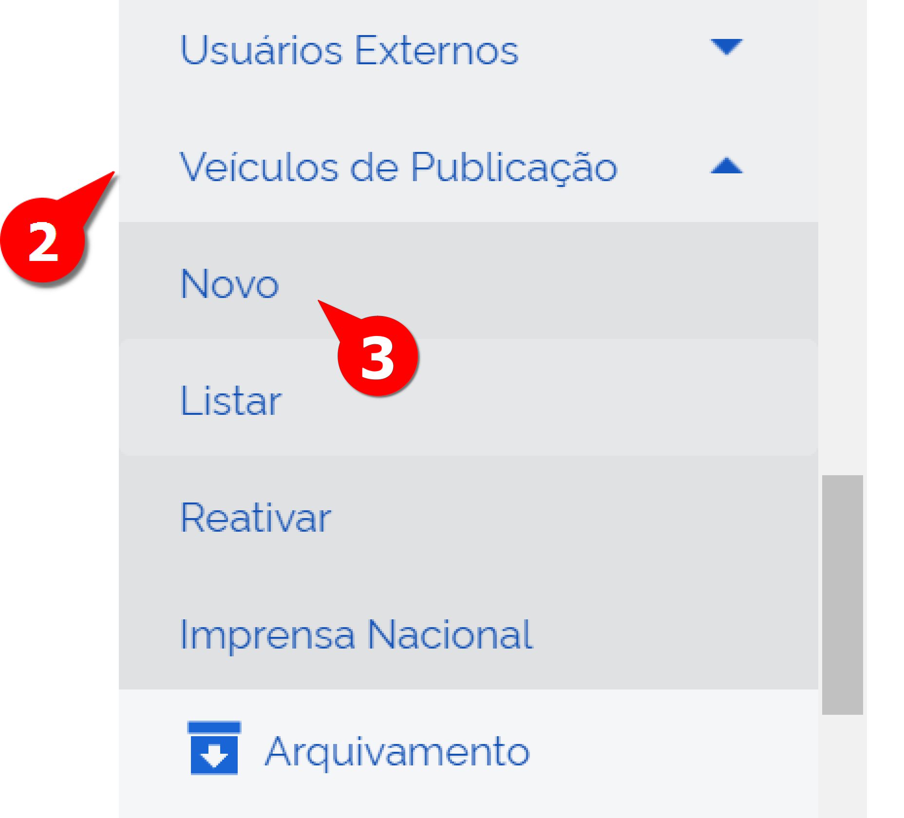
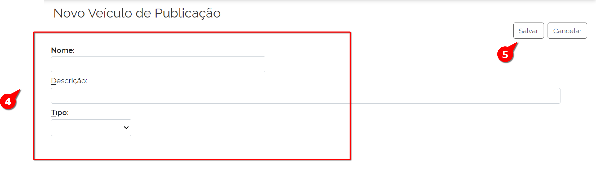
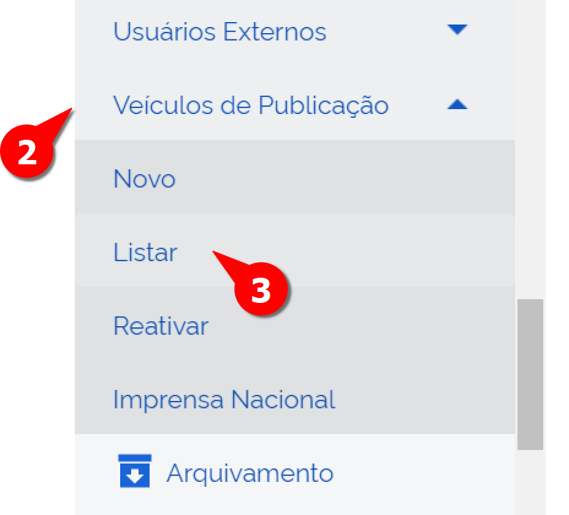
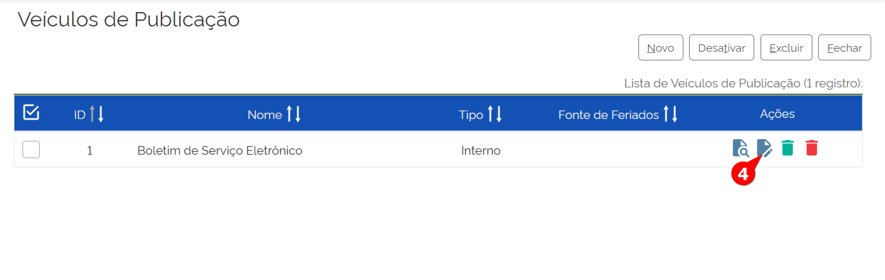
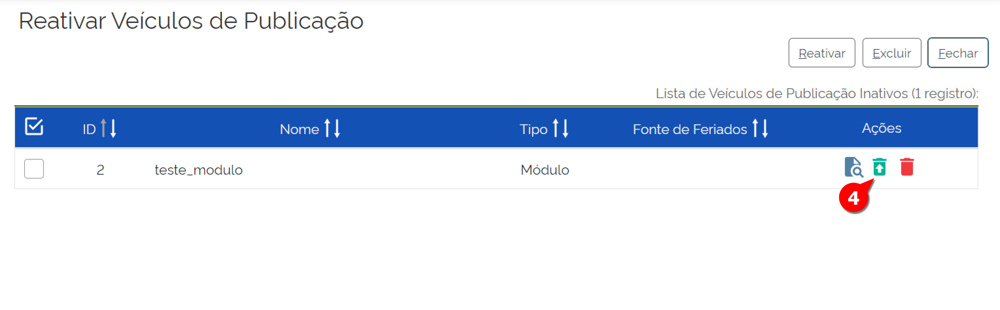

Veículos de Publicação
=======================

O SEI permite configurar os veículos de publicação que podem interagir com o sistema para agendamento, cancelamento e confirmação.

Essa funcionalidade, denominada “Veículos de Publicação”, permite o cadastro, a consulta, a alteração, a desativação, a reativação e a exclusão dos veículos de publicação cadastrados.

Para acessá-la, o administrador deve acompanhar o caminho descrito a seguir.

.. figure:: _static/images/04-11_Veiculos-de-Publicacao_Menu_Listar.png

01. No Menu Principal, acessar “Administração”;

02. Acessar “Veículos de Publicação”;

03. Clicar em “Listar”.

Pronto, a tela de “Veículos de Publicação” foi exibida, bem como a lista dos Veículos de Publicação cadastrados no SEI.

Cadastrar Novo Ponto de Controle
--------------------------------

Para acessar e inserir um novo item em “Veículos de Publicação”, o administrador deve acompanhar o caminho descrito a seguir.

01. No Menu Principal, acessar “Administração”;

02. Acessar “Veículos de Publicação”;

03. Clicar em “Novo”.

.. figure:: _static/images/04-11_Veiculos-de-Publicacao_Menu01.png

A tela “Novo Veículo de Publicação” será exibida.

04. Preencher os seguintes campos (todos de preenchimento obrigatório):

* **Nome**: Nome do Veículo de Publicação. Deve ser significativo, pois aparecerá em diversos pontos do sistema, tais como: carimbo de publicação do documento, ícone na árvore do processo, andamento do processo e lista de resultados da pesquisa de publicação

* **Descrição**: Descrição e detalhamento do Veículo de Publicação

* **Tipo**: Interno, Externo ou Módulo

    Os tipos de Veículos de Publicação:

    * Tipo Interno: As publicações são realizadas pelo próprio SEI. No momento de publicação, se a data de publicação for igual à atual, o documento é publicado no mesmo instante. Contudo, esse documento é exibido na pesquisa após alguns minutos.

    É permitido o cadastro de apenas um veículo de publicação interno. 

    O SEI possibilita que o administrador cadastre manualmente os feriados por meio da funcionalidade “Administração”, clicando em “Feriados”. O veículo de publicação interno utiliza os feriados cadastrados no sistema como fonte

    * Módulo: Permite exibir as publicações enviadas para este veículo na pesquisa de publicações interna;

    * Tipo Externo: O processo de agendamento, cancelamento e confirmação é realizado pelos WebServices. 

    Os veículos externos são autorizados cadastrando o endereço do servidor que fará acesso no arquivo sei/ConfiguracaoSEI.php pela chave HostWebService/Publicacao. 

Se o tipo externo for selecionado: há habilitação de novos campos: 

* “Webservice”. 

* Checkboxes: 

1) Exibir as publicações enviadas para este veículo na pesquisa de publicações interna: possibilita que todos os documentos publicados fiquem disponíveis para busca na pesquisa interna. 

2) Utilizar os feriados cadastrados neste veículo como padrão para o sistema: é utilizada para buscar os feriados por meio de chamada do WebService informado no campo “Web Service” (campo exibido apenas para veículos de publicação externos). 

3) Permite edição extraordinária: foi incluída a partir da versão 3.1 do SEI.

05. Clicar em Salvar.

Pronto, um novo Veículo de Publicação foi cadastrado no SEI

Alterar Novo Ponto de Controle
------------------------------

Para alterar item em “Veículos de Publicação”, o administrador deve acompanhar o caminho descrito a seguir.

01. No Menu Principal, acessar “Administração”;

02. Acessar “Veículos de Publicação”;

03. Clicar em “Listar”.

.. figure:: _static/images/04-11_Veiculos-de-Publicacao_Menu01.png

A tela “Veículo de Publicação” será exibida.

04. Localizar o Veículo de Publicação a ser alterado e clicar em “Alterar Veículo de Publicação”;

A tela de Alterar Veículo de Publicação será exibida

05. Alterar os campos que julgar pertinente

06. Salvar.

Pronto, o Veículo de Publicação foi alterado no SEI.

Excluir Veículo de Publicação
-----------------------------

Para excluir item em “Veículos de Publicação”, deve-se saber que essa ação é irreversível, ao contrário da ação “Desativar”, que será vista logo em seguida. Tendo isso em mente, o administrador deve acompanhar o caminho descrito a seguir.

01. No Menu Principal, acessar “Administração”;

02. Acessar “Veículos de Publicação”;

03. Clicar em “Listar”.

.. figure:: _static/images/04-11_Veiculos-de-Publicacao_Menu01.png

A tela “Veículo de Publicação” será exibida.

.. figure:: _static/images/04-11_Veiculos-de-Publicacao_Lista_Excluir.png

04. Localizar o Veículo de Publicação a ser alterado e clicar em “Excluir Veículo de Publicação”;

05. Confirmar Ação.

Pronto, o Veículo de Publicação foi excluído no SEI.

Desativar Veículo de Publicação
-------------------------------

Para desativar um item em “Veículos de Publicação”, diferentemente da ação excluir, essa ação é irreversível por meio da ação Reativar, que será vista logo em seguida. Tendo isso em mente, o administrador deve acompanhar o caminho descrito a seguir.

01. No Menu Principal, acessar “Administração”;

02. Acessar “Veículos de Publicação”;

03. Clicar em “Listar”;

.. figure:: _static/images/04-11_Veiculos-de-Publicacao_Menu01.png

A tela “Veículo de Publicação” será exibida.

.. figure:: _static/images/04-11_Veiculos-de-Publicacao_Lista_Desativar.png

04. Localizar o Veículo de Publicação a ser alterado e clicar em “Desativar Veículo de Publicação”;

05. Confirmar Ação.

Pronto, o Veículo de Publicação foi desativado no SEI. Essa ação pode ser revertida com o comando "Reativar".

Reativar Veículo de Publicação
------------------------------

Após um Veículo de Publicação ser desativado, é possível reativá-lo. 

Tendo isso em mente, o administrador deve acompanhar o caminho descrito a seguir.

01. No Menu Principal, acessar “Administração”;

02. Acessar “Veículos de Publicação”;

03. Clicar em “Reativar”.

.. figure:: _static/images/04-11_Veiculos-de-Publicacao_Menu01.png

.. figure:: _static/images/04-11_Veiculos-de-Publicacao_Menu02_Reativar.png

A tela “Reativar Veículo de Publicação” será exibida.

04. Localizar o Veículo de Publicação a ser alterado e clicar em “Reativar Veículo de Publicação”;

05. Confirmar Ação.

Pronto, o Veículo de Publicação foi desativado no SEI. 

Funncionalidade Imprensa Nacional 
---------------------------------

(EM CONSTRUÇÃO)
