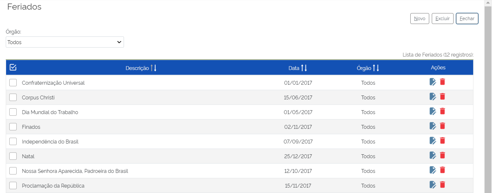

Feriados
========

Quando tratamos de processos administrativos, o controle e o respeito aos prazos são fundamentais. Nesse contexto, no SEI, há a possibilidade de inclusão de feriados, a fim de se monitorar os dias úteis do ano. É importante lembrar que a lista de feriados deve ser atualizada anualmente pelo administrador do SEI no órgão.
Para configurar os feriados no SEI, é necessário acompanhar o caminho descrito a seguir.

01. No Menu Principal, acessar “Administração”;

02. Clicar em  “Feriados”.

.. figure:: _static/images/04-12_Feriados_Menu.png

A tela “Feriados” será exibida e os principais comandos estão nessa tela: Cadastrar novo feriado, Alterar Feriado, Excluir Feriado.

Funcionalidade Cadastrar Novo Feriado
-------------------------------------

Na tela “Feriados”. 

.. figure:: _static/images/04-12_Feriados_Lista_Novo.png

01. Clicar botão Novo;

A tela “Novo Feriado” é exibida.

.. figure:: _static/images/04-12_Feriados_Tela_Novo.png

02. Preencher os seguintes campos:

* **Órgão**: Selecionar os órgãos que o feriado será submetido
* **Descrição**: Campo de detalhamento do feriado
* **Data do Feriado**: selecionar o feriado

03. Clicar em Salvar.

Pronto, o Feriado foi cadastrado. 

Funcinalidade Alterar Feriado
-----------------------------

Na tela “Feriados”. 

.. figure:: _static/images/04-12_Feriados_Lista_Alterar.png

01. Localizar o feriado a ser alterado e clicar em "Alterar Feriado";

A tela “Novo Feriado” é exibida.
 
02. Alterar os campos pertinentes;

03. Clicar em Salvar.

Pronto, o Feriado foi alterado. 

Funcionalidade Excluir Feriado
------------------------------

Na tela “Feriados”:

.. figure:: _static/images/04-12_Feriados_Lista_Excluir.png

01. Localizar o feriado a ser alterado e clicar em "Excluir Feriado";

02. Confirmar a ação.

Pronto, o Feriado foi excluído.

