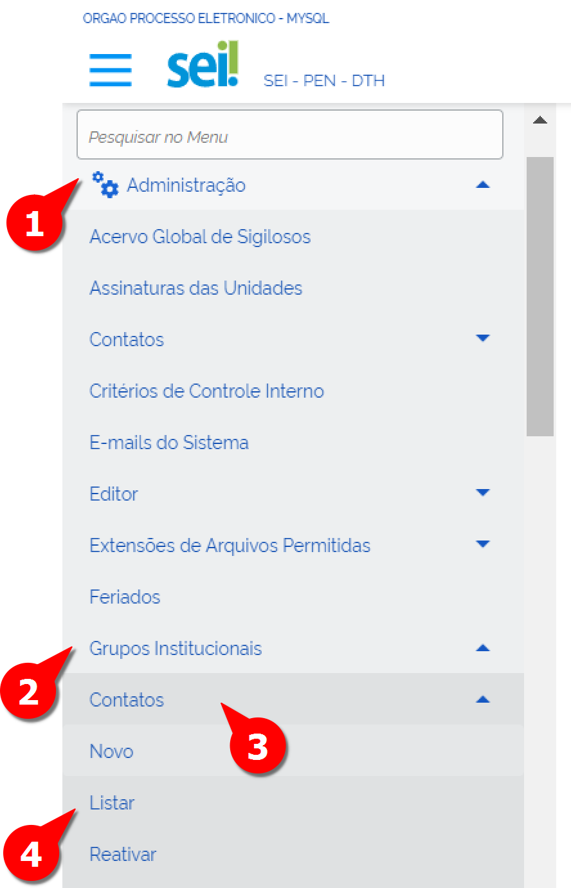
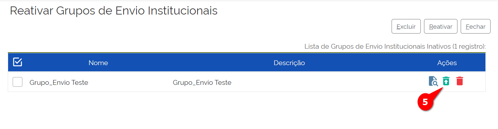
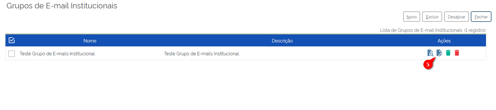
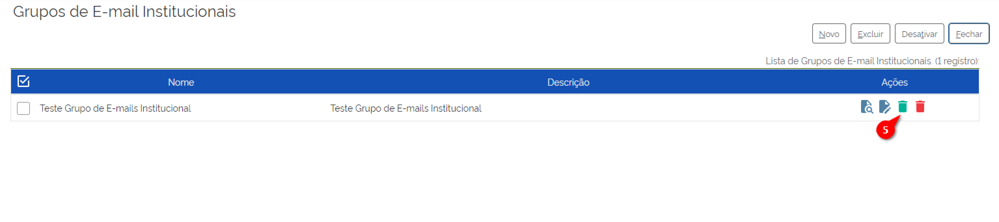
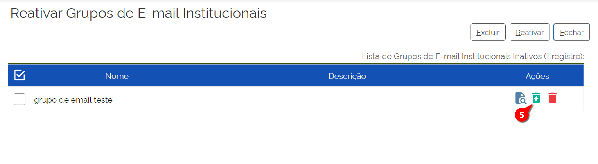
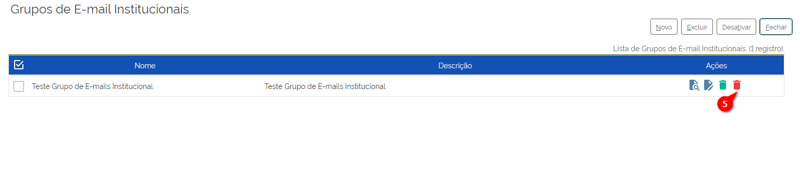
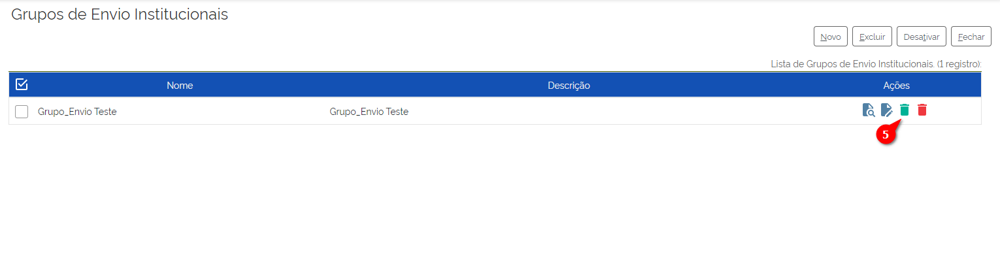
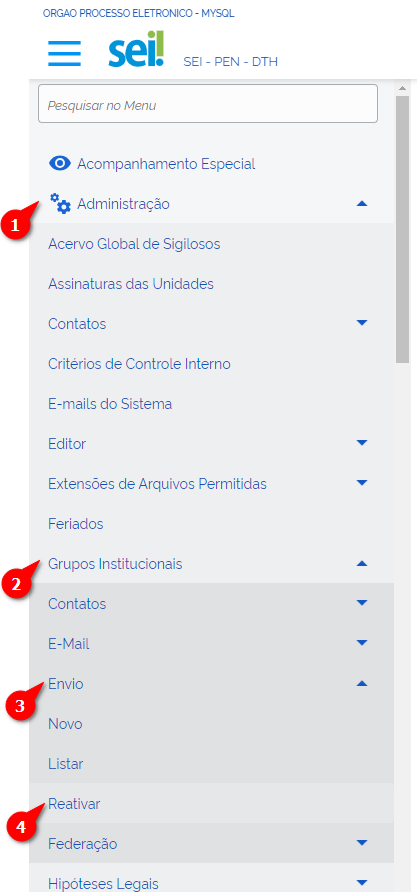
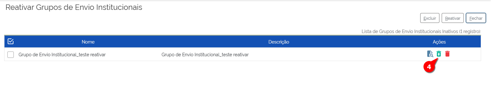

Grupos Institucionais
=====================

Em algumas situações, é necessário enviar mensagens para mais de um destinatário, sejam servidores, unidades ou pessoas externas ao órgão. Para que essa tarefa não se torne um fardo sempre que precisar ser executada, pode-se criar grupos institucionais, em que é possível agrupar diferentes tipos de destinatários.

Os tipos de grupos institucionais são:

* **Contatos**: São agrupados os contatos conforme a conveniência do órgão. Por exemplo: os contatos podem ser de gestores e o grupo, nesse caso, será composto pelos gestores daquele órgão.

* **E-mails**: São agrupados os e-mails conforme a conveniência do órgão. Por exemplo: pode ser usado para agrupar os e-mails de fornecedores daquela instituição.

* **Envio**: São agrupadas as unidades administrativas da instituição. Por exemplo: é muito útil para enviar comunicados circulares a todas as unidades do órgão ou a um grupo específico de unidades.

* **Federação** (não habilitados na versão 4.0): Todos esses tipos de grupos institucionais possuem os mesmos comandos: Cadastrar um novo Grupo Institucional, alterar, excluir, desativar e reativar. Todas essas ações serão abordadas a seguir, cada uma no seu grupo institucional.

Grupos de Contatos Institucionais
---------------------------------

Cadastrar novo Grupo de Contato Institucional
+++++++++++++++++++++++++++++++++++++++++++++

Para cadastrar novo Grupo de Contato Institucional, o Administrador deve seguir os seguintes passos:

.. figure:: _static/images/04-13_Grupos-Contatos-Institucionais_Menu_Novo.png

01. No Menu Principal, acessar “Administração”;

02. Acessar “Grupos Institucionais”;

03. Acessar “Contatos”;

04. Clicar em “Novo”.

A tela “Novo Grupo de Contatos Institucional” será exibida:

.. figure:: _static/images/04-13_Grupos-Contatos-Institucionais_Tela_Novo.png

05. Preencher os campos:

* **Nome**: Nome do Grupo de Contatos Institucional.
* **Descrição**: Detalhamento do Grupo de Contatos Institucional.
* **Contatos**: Selecionar os contatos que participarão do grupo.

06. Clicar em Salvar.

Pronto! O Grupo de Contatos foi cadastrado.

Alterar o Grupo de Contato Institucional
++++++++++++++++++++++++++++++++++++++++

Para alterar o Grupo de Contato Institucional, o Administrador deve seguir os seguintes passos:

01. No Menu Principal, acessar “Administração”;

02. Acessar “Grupos Institucionais”;

03. Acessar “Contatos”;

04. Clicar em “Listar”.

A tela “Grupo de Contatos Institucional” será exibida:

.. figure:: _static/images/04-13_Grupos-Contatos-Institucionais_Lista_Alterar.png

05. Localizar o Grupo a ser alterado e clicar no botão de Alterar Grupo de Contatos;

06. Alterar os campos que julgar necessário;

07. Clicar em Salvar.

Pronto! O Grupo de Contatos foi alterado.

Desativar o Grupo de Contato Institucional
++++++++++++++++++++++++++++++++++++++++++

Para desativar o Grupo de Contato Institucional, o Administrador deve seguir os seguintes passos:

01. No Menu Principal, acessar “Administração”;

02. Acessar “Grupos Institucionais”;

03. Acessar “Contatos”;

04. Clicar em “Listar”.

A tela “Grupo de Contatos Institucional” será exibida:

.. figure:: _static/images/04-13_Grupos-Contatos-Institucionais_Lista_Desativar.png

05. Localizar o Grupo a ser alterado e clicar no botão de Desativar Grupo de Contatos;

06. Confirmar a ação.

Pronto! O Grupo de Contatos foi desativado.

Reativar o Grupo de Contato Institucional
+++++++++++++++++++++++++++++++++++++++++

Após desativar o grupo de contato Institucional, é possível reativá-lo. Para reativar o Grupo de Contato Institucional, o Administrador deve seguir os seguintes passos:

.. figure:: _static/images/04-13_Grupos-Contatos-Institucionais_Menu_Reativar.png

01. No Menu Principal, acessar “Administração”;

02. Acessar “Grupos Institucionais”;

03. Acessar “Contatos”;

04. Clicar em “Reativar”.

A tela “Reativar Grupo de Contatos Institucional” será exibida:

05. Localizar o Grupo a ser alterado e clicar no botão de Reativar Grupo de Contatos;

06. Confirmar a ação.

Pronto! O Grupo de Contatos foi reativado.

Excluir o Grupo de Contato Institucional
++++++++++++++++++++++++++++++++++++++++

A exclusão do grupo de contato instutucional é uma ação irreversível. Tendo isso em mente, para excluir o Grupo de Contato Institucional, o Administrador deve seguir os seguintes passos:

01. No Menu Principal, acessar “Administração”;

02. Acessar “Grupos Institucionais”;

03. Acessar “Contatos”;

04. Clicar em “Listar”.

A tela “Grupo de Contatos Institucional” será exibida:

.. figure:: _static/images/04-13_Grupos-Contatos-Institucionais_Lista_Excluir.png

05. Localizar o Grupo a ser alterado e clicar no botão de Excluir Grupo de Contatos;

06. Confirmar a ação.

Pronto! O Grupo de Contatos foi excluído.

Grupos de E-mails Institucionais
--------------------------------

Cadastrar novo Grupo de E-mails Institucional
+++++++++++++++++++++++++++++++++++++++++++++

Para cadastrar novo Grupo de E-mails Institucional, o Administrador deve seguir os seguintes passos:

.. figure:: _static/images/04-13_Grupos-Email-Institucionais_Menu_Novo.png

01. No Menu Principal, acessar “Administração”;

02. Acessar “Grupos Institucionais”;

03. Acessar “E-mails”;

04. Clicar em “Novo”.

A tela “Novo Grupo de E-mails Institucional” será exibida:

.. figure:: _static/images/04-13_Grupos-Email-Institucionais_Tela_Novo.png

05. Preencher os campos:

* **Nome**: Nome do Grupo de E-mail Institucional
* **Descrição**: Detalhamento do Grupo de E-mail Institucional
* **Contatos**: Selecionar os E-mails que participarão do grupo

06. Clicar em Salvar

Pronto! O Grupo de E-mail foi cadastrado.

Alterar o Grupo de E-mail Institucional
+++++++++++++++++++++++++++++++++++++++

Para alterar o Grupo de E-mail Institucional, o Administrador deve seguir os seguintes passos:

.. figure:: _static/images/04-13_Grupos-Email-Institucionais_Menu_Listar.png

01. No Menu Principal, acessar “Administração”;

02. Acessar “Grupos Institucionais”;

03. Acessar “E-mail”;

04. Clicar em “Listar”.

A tela “Grupo de E-mail Institucional” será exibida:

05. Localizar o Grupo a ser alterado e clicar no botão de Alterar Grupo de E-mail;

06. Alterar os campos que julgar necessário

07. Clicar em Salvar.

Pronto! O Grupo de E-mail foi alterado.

Desativar o Grupo de E-mail Institucional
++++++++++++++++++++++++++++++++++++++++++

Para desativar o Grupo de E-mail Institucional, o Administrador deve seguir os seguintes passos:

.. figure:: _static/images/04-13_Grupos-Email-Institucionais_Menu_Listar.png

01. No Menu Principal, acessar “Administração”;

02. Acessar “Grupos Institucionais”;

03. Acessar “E-mail”;

04. Clicar em “Listar”.

A tela “Grupo de E-mail Institucional” será exibida:

05. Localizar o Grupo a ser alterado e clicar no botão de Desativar Grupo de E-mail;

06. Confirmar a ação

Pronto! O Grupo de E-mail foi desativado.

Reativar o Grupo de E-mail Institucional
++++++++++++++++++++++++++++++++++++++++

Após desativar o grupo de E-mail Institucional, é possível reativá-lo. Para reativar o Grupo de E-mail Institucional, o Administrador deve seguir os seguintes passos:

.. figure:: _static/images/04-13_Grupos-Email-Institucionais_Menu_Reativar.png

01. No Menu Principal, acessar “Administração”;

02. Acessar “Grupos Institucionais”;

03. Acessar “E-mail”;

04. Clicar em “Reativar”.

A tela “Reativar Grupo de E-mail Institucional” será exibida:

05. Localizar o Grupo a ser alterado e clicar no botão de Reativar Grupo de E-mail;

06. Confirmar a ação

Pronto! O Grupo de E-mail foi reativado.

Excluir o Grupo de E-mail Institucional
+++++++++++++++++++++++++++++++++++++++

A exclusão do grupo de E-mail instutucional é uma ação irreversível. Tendo isso em mente, para excluir o Grupo de E-mail Institucional, o Administrador deve seguir os seguintes passos:

.. figure:: _static/images/04-13_Grupos-Email-Institucionais_Menu_Listar.png

01. No Menu Principal, acessar “Administração”;

02. Acessar “Grupos Institucionais”;

03. Acessar “E-mail”;

04. Clicar em “Listar”.

A tela “Grupo de E-mail Institucional” será exibida:

05. Localizar o Grupo a ser alterado e clicar no botão de Excluir Grupo de E-mail;

06. Confirmar a ação.

Pronto! O Grupo de E-mail foi excluído.

Grupos de Envio Institucionais
------------------------------

Cadastrar novo Grupo de Envio Institucional
+++++++++++++++++++++++++++++++++++++++++++

Para cadastrar novo Grupo de Envio Institucional, o Administrador deve seguir os seguintes passos:

.. figure:: _static/images/04-13_Grupos-Envio-Institucionais_Menu_Novo.png

01. No Menu Principal, acessar “Administração”;

02. Acessar “Grupos Institucionais”;

03. Acessar “Envio”;

04. Clicar em “Novo”.

A tela “Novo Grupo de Envio Institucional” será exibida:

.. figure:: _static/images/04-13_Grupos-Envio-Institucionais_Tela_Novo.png

05. Preencher os campos:

* **Nome**: Nome do Grupo de Envio Institucional.

* **Descrição do Grupo**: Detalhamento do Grupo de Envio Institucional.

* **Unidade**: Selecionar as Unidades que participarão do grupo.

06. Clicar em Salvar

Pronto! O Grupo de Envio foi cadastrado.

Alterar o Grupo de Envio Institucional
++++++++++++++++++++++++++++++++++++++

Para alterar o Grupo de Envio Institucional, o Administrador deve seguir os seguintes passos:

.. figure:: _static/images/04-13_Grupos-Envio-Institucionais_Menu_Listar.png

01. No Menu Principal, acessar “Administração”;

02. Acessar “Grupos Institucionais”;

03. Acessar “Envio”;

04. Clicar em “Listar”.

A tela “Grupo de Envio Institucional” será exibida:

.. figure:: _static/images/04-13_Grupos-Envio-Institucionais_Lista_Alterar.png

05. Localizar o Grupo a ser alterado e clicar no botão de Alterar Grupo de Envio;

06. Alterar os campos que julgar necessário;

07. Clicar em Salvar.

Pronto! O Grupo de Envio foi alterado.

Desativar o Grupo de Envio Institucional
++++++++++++++++++++++++++++++++++++++++

Para desativar o Grupo de Envio Institucional, o Administrador deve seguir os seguintes passos:

.. figure:: _static/images/04-13_Grupos-Envio-Institucionais_Menu_Listar.png

01. No Menu Principal, acessar “Administração”;

02. Acessar “Grupos Institucionais”;

03. Acessar “Envio”;

04. Clicar em “Listar”.

A tela “Grupo de Envio Institucional” será exibida:

05. Localizar o Grupo a ser alterado e clicar no botão de Desativar Grupo de Envio;

06. Confirmar a ação.

Pronto! O Grupo de Envio foi desativado.

Reativar o Grupo de Envio Institucional
+++++++++++++++++++++++++++++++++++++++

Após desativar o grupo de Envio Institucional, é possível reativá-lo. Para reativar o Grupo de Envio Institucional, o Administrador deve seguir os seguintes passos:

01. No Menu Principal, acessar “Administração”;

02. Acessar “Grupos Institucionais”;

03. Acessar “Envio”;

04. Clicar em “Reativar”.

A tela “Reativar Grupo de Envio Institucional” será exibida:

05. Localizar o Grupo a ser alterado e clicar no botão de Reativar Grupo de Envio;

06. Confirmar a ação.

Pronto! O Grupo de Envio foi reativado.

Excluir o Grupo de Envio Institucional
++++++++++++++++++++++++++++++++++++++

A exclusão do grupo de Envio instutucional é uma ação irreversível. Tendo isso em mente, para excluir o Grupo de Envio Institucional, o Administrador deve seguir os seguintes passos:

.. figure:: _static/images/04-13_Grupos-Envio-Institucionais_Menu_Listar.png

01. No Menu Principal, acessar “Administração”;

02. Acessar “Grupos Institucionais”;

03. Acessar “Envio”;

04. Clicar em “Listar”.

A tela “Grupo de Envio Institucional” será exibida:

.. figure:: _static/images/04-13_Grupos-Envio-Institucionais_Lista_Excluir.png

05. Localizar o Grupo a ser alterado e clicar no botão de Excluir Grupo de Envio;

06. Confirmar a ação.

Pronto! O Grupo de Envio foi excluído.