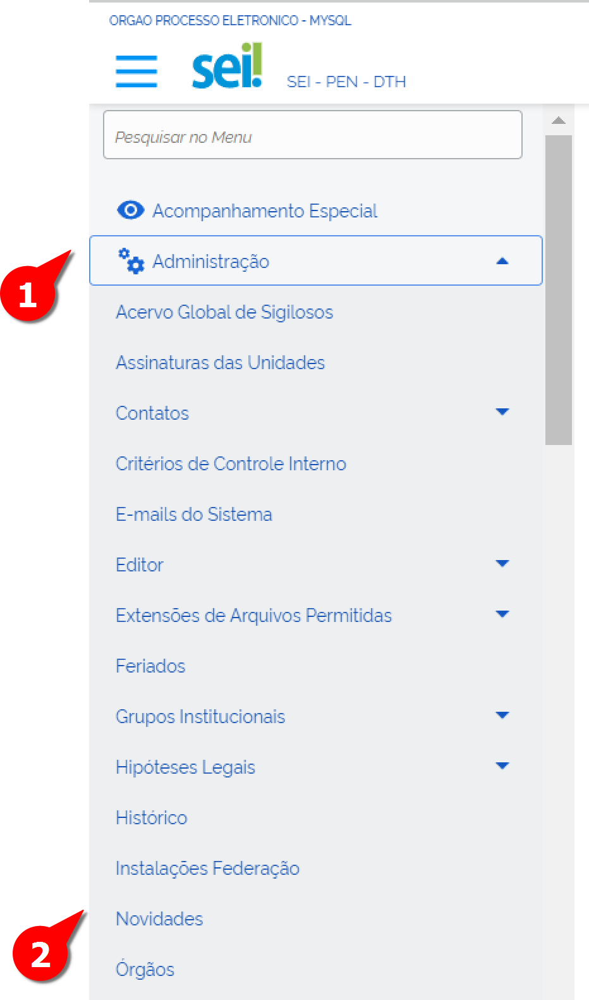
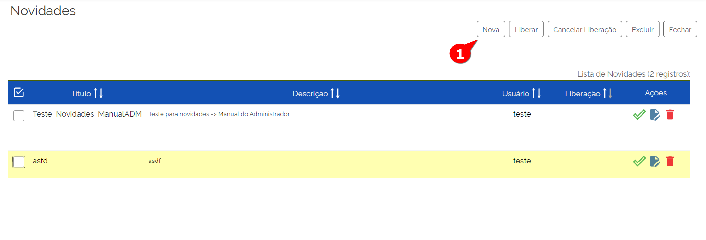
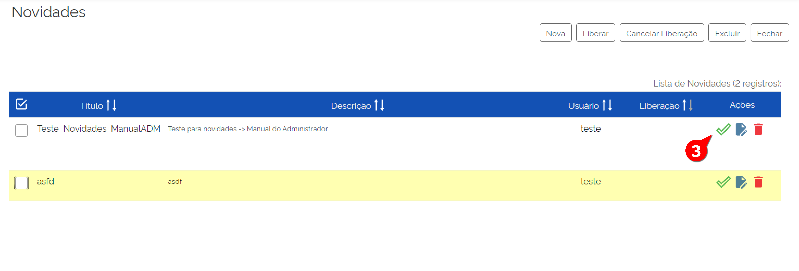
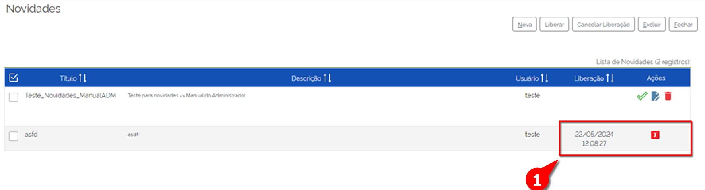
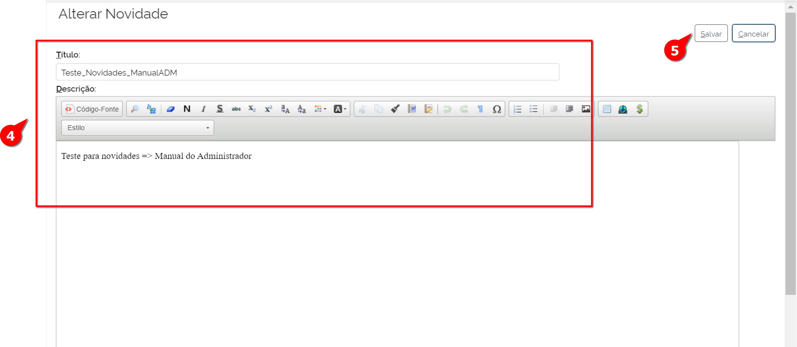
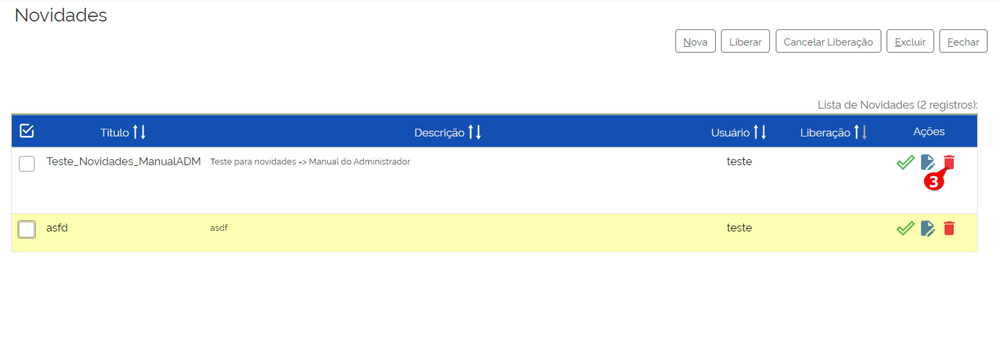

Novidades
=========

No SEI, há uma funcionalidade chamada “Novidades”, que serve para compartilhar informes com todos os usuários do sistema. É muito útil para informes que não necessitam de uma maior formalidade, como informar a respeito de uma manutenção que deixará o sistema fora do ar durante determinado período ou uma campanha de sensibilização dos servidores. 

Cadastrar Novidade 
------------------

Para cadastrar as novidades, o usuário com perfil “Administrador” deverá acompanhar o caminho descrito a seguir.

01. No Menu Principal, acessar “Administração”;

02. Acessar “Novidades”;

A tela Novidades será exibida com uma lista de Novidades já cadastradas: 

03. Clicar em Nova;

A tela de Nova Novidade será exibida: 

.. figure:: _static/images/04-14_Novidades_Tela_Novo.png

04. Preencher os seguintes campos:

* **Título:** Título da Novidade, deve ser preenchido com informações sobre o nome daquela novidade. Essa informação é utilizada para o gerenciamento das novidades cadastradas no sistema.

* **Campo de Texto:** Detalhamento da Novidade a ser cadastrada. campo destinado à construção da mensagem. É disponibilizado um editor de texto semelhante ao editor de documentos do sistema, sendo possível inserir imagens, tabelas ou formatar o texto da maneira mais conveniente.

05. Clicar em “Salvar”.

Pronto, a Novidade foi cadastrada. Note que há uma funcionalidade diferente com ícone |iconeSEI_Liberar|  cujo nome é Liberar Novidade. Será detalhada essa função mais adiante.

|iconeSEI_Liberar|
image:: _static/images/IconeSEI_Liberar.png
   :align: middle
   :width: 25

Liberar Novidade
----------------

Após cadastrada a novidade, esse comando é habilitado e basicamente ele disponibiliza a novidade para os Usuários do SEI. Caso não seja liberada, a novidade não ficará disponível para os usuários. Uma vez liberada, é apresentada a ação “Cancelar Disponibilização da Novidade”, que permite o cancelamento daquela novidade (será detalhado no tópico adiante).

.. admonition:: Nota

   Mesmo havendo a possibilidade de criar diversas novidades, apenas uma é liberada por vez.

Para liberar a novidade, o  Administrador deverá acompanhar o caminho descrito a seguir.

01. No Menu Principal, acessar “Administração”;

02. Clicar em “Novidades”;

A tela Novidades será exibida com uma lista de Novidades já cadastradas: 

03. Localizar a Novidade a ser liberada e clicar em “Liberar Novidade”;

04. Confirmar a ação.

Pronto, a Novidade foi liberada para os Usuários. 

Note que após liberação da novidade, dois campos foram alterados: a coluna “Liberação” (com a data de liberação da novidade) e na coluna Ações (Dessa vez com o ícone do comando Cancelar Liberação da Novidade, que será visto a seguir).

.. figure:: _static/images/04-14_Novidades_Lista_Cancelar-Liberaçao00.png

Cancelar Liberação da Novidade
------------------------------

Há situações que a novidade necessite ter a sua liberação cancelada. Para esses casos, na tela “Novidades”: 

01. Localizar a Novidade liberada a ser cancelada e clicar em “Cancelar Liberação da Novidade”;  

02. Confirmar a ação.

Pronto, a liberação da Novidade foi cancelada para os Usuários

Alterar Novidade
-----------------

Após cadastrada a novidade, esse comando é disponibilizado e basicamente ele permite que a novidade seja alterada para os Usuários do SEI antes da sua liberação. 
Para alterar a novidade, o Administrador deverá acompanhar o caminho descrito a seguir.

01. No Menu Principal, acessar “Administração”;

02. Acessar “Novidades”;

A tela Novidades será exibida com uma lista de Novidades já cadastradas: 

.. figure:: _static/images/04-14_Novidades_Lista_Alterar-Novidade.png

03. Localizar a Novidade a ser alterada e clicar em “Alterar Novidade”;

A tela “Alterar Novidade” é exibida.

04. Realizar as alterações nos campos necessários;

05. Clicar em Salvar.

Pronto, a Novidade foi alterada.

Excluir Novidade
-----------------

Após cadastrada a novidade, esse comando é disponibilizado e basicamente ele permite que a novidade seja excluída para os Usuários do SEI. 

Para excluir a novidade, o Administrador deverá acompanhar o caminho descrito a seguir.

01. No Menu Principal, acessar “Administração”;

02. Acessar “Novidades”;

A tela Novidades será exibida com uma lista de Novidades já cadastradas: 

03. Localizar a Novidade a ser liberada e clicar em “Excluir Novidade”;

04. Confirmar Ação.

Pronto, a Novidade foi excluída.
