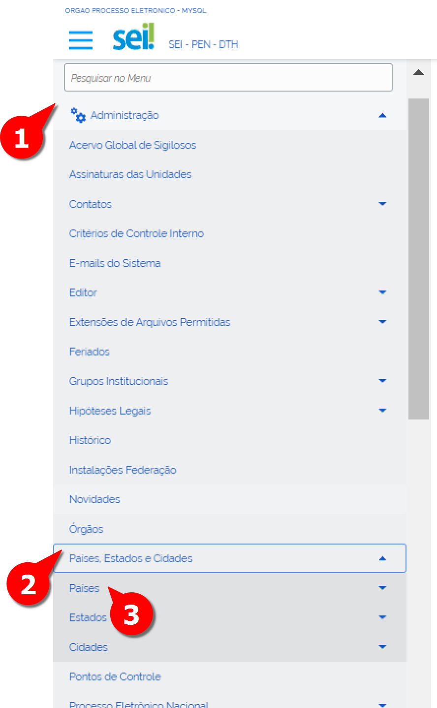
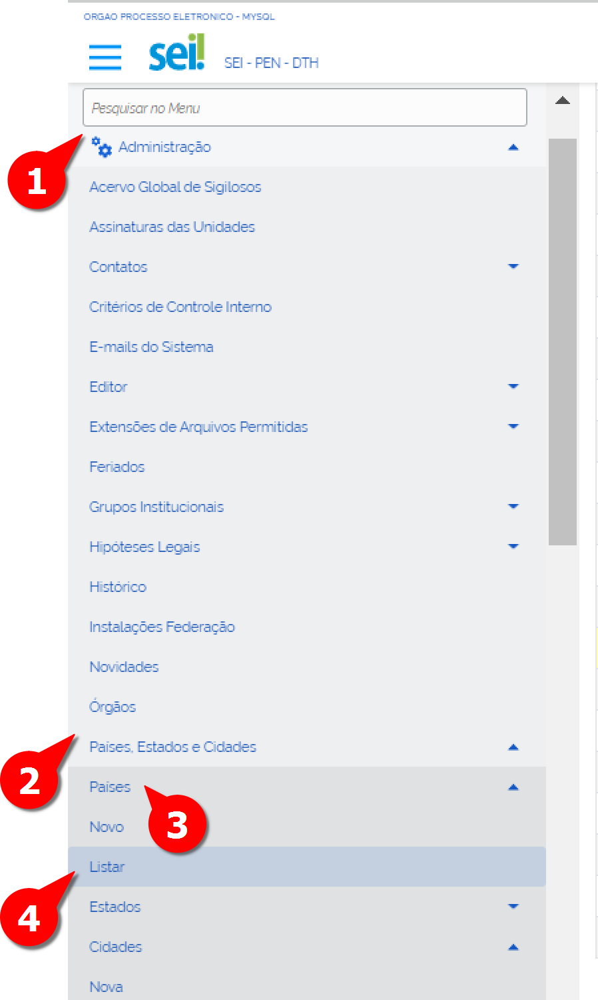
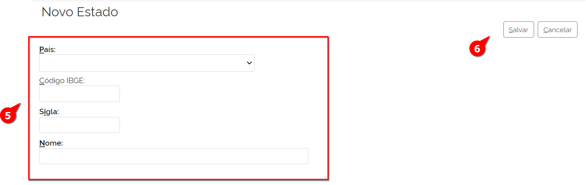
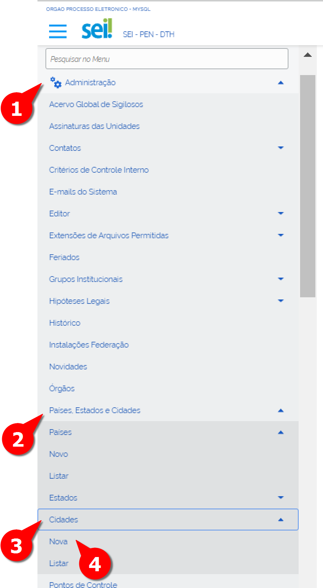
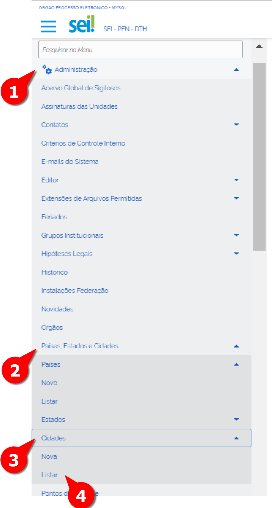

Países, Estados e Cidades
==========================

No SEI, há a possibilidade de cadastrar países, estados e cidades. Não se trata de uma lista rígida, podendo ser alterada para refletir o cenário geopolítico do momento ou a criação e fusão de municípios.

Esse cadastro é útil em várias situações do sistema, como no cadastro de usuários externos ou na inclusão de um novo contato.

Países
-------

Cadastrar Novo País
+++++++++++++++++++

Para cadastrar novo país:

01. No Menu Principal, acessar “Administração”;

02. Acessar “Países, Estados e Cidades”;

03. Clicar em “País”;

A tela “Novo País” é exibida

04-15_Pais-Estado-Cidade_Tela-Pais-Novo

04. Preencher o nome do novo País;

05. Clicar em Salvar.

Pronto, o novo País foi cadastrado

Alterar País
++++++++++++

Para alterar o nome do país, deve-se seguir os seguintes passos: 

01. No Menu Principal, acessar “Administração”;

02. Acessar “Países, Estados e Cidades”;

03. Acessar “País”;

04. Clicar em “Listar”;

A tela com a lista “Países” é exibida:

04-15_Paises-Estados-Cidades_Tela_Lista-Paises.png

05. Localizar o País e clicar em Alterar País;

A tela “Alterar País” será exibida: 

06. Alterar o nome do País;

07. Clicar em Salvar.

Pronto, o nome do País foi alterado.

Excluir País
++++++++++++

Para excluir País, deve-se seguir os seguintes passos: 

01. No Menu Principal, acessar “Administração”;

02. Acessar “Países, Estados e Cidades”;

03. Acessar “País”;

04. Clicar em “Listar”;

A tela com a lista “Países” é exibida:

.. figure:: _static/images/04-15_Paises-Estados-Cidades_Lista-Paises-Excluir.png

05. Localizar o País e clicar em Excluir País;

06. Confirmar ação.

Pronto, o País foi excluído. 

Estado
-------

Cadastrar novo Estado
+++++++++++++++++++++

Para cadastrar novo Estado deve-se seguir os seguintes passos:

01. No Menu Principal, acessar “Administração”;

02. Acessar “Países, Estados e Cidades”;

03. Acessar “Estado”;

04. Clicar em “Novo”;

.. figure:: _static/images/04-15_Pais-Estado-Cidade_Menu_Estado-Novo.png

A tela “Novo Estado” é exibida: 

05. Preencher os seguintes campos:

* **País**: campo para selecionar o país ao qual pertence o estado.

* **Código IBGE**: campo para informar o código de controle do IBGE para o estado. Só é habilitado quando o país selecionado for Brasil.

* **Sigla**: campo para indicação da sigla do estado

* **Nome**: campo para informar o nome do estado.

06. Clicar em Salvar.

Pronto, um novo Estado foi cadastrado

Alterar Estado
++++++++++++++

Para alterar um Estado:

01. No Menu Principal, acessar “Administração”;

02. Acessar “Países, Estados e Cidades”;

03. Acessar “Estado”

04. Clicar em “Listar”

.. figure:: _static/images/04-15_Pais-Estado-Cidade_Menu_Estado-Listar.png

A tela com a Lista “Estados” é exibida:

.. figure:: _static/images/04-15_Pais-Estado-Cidade_Lista_Estado-Alterar.png

05. Selecionar o País do respectivo estado a ser alterado;

06. Localizar o Estado e clicar em Alterar Estado;

A tela “Alterar Estado” será exibida:

.. figure:: _static/images/04-15_Pais-Estado-Cidade_Tela_Estado-Alterar.png

07. Alterar os dados pertinentes;

08. Clicar em Salvar.

Pronto, os dados do Estado foram alterados. 

Excluir Estado
++++++++++++++

Para excluir um Estado:

01. No Menu Principal, acessar “Administração”;

02. Acessar “Países, Estados e Cidades”;

03. Acessar “Estado”

04. Clicar em “Listar”

.. figure:: _static/images/04-15_Pais-Estado-Cidade_Menu_Estado-Listar.png

A tela com a Lista “Estados” é exibida:

.. figure:: _static/images/04-15_Pais-Estado-Cidade_Lista_Estado-Excluir.png

01. No Menu Principal, acessar “Administração”;

02. Acessar “Países, Estados e Cidades”;

03. Acessar “Cidade”;

04. Clicar em “Nova”;

A tela “Nova Cidade” é exibida

05. Preencher os seguintes campos:

* **País**: campo para selecionar o país ao qual pertence a cidade.
* **Estado**: campo para selecionar o estado ao qual pertence a cidade.
* **Código IBGE**: campo para informar o código de controle do IBGE para a cidade. Só é habilitado quando o país selecionado for Brasil.	
* **Nome**: campo para informar o nome da cidade.
* **Capital**: checkbox que deve ser selecionada caso a cidade seja capital de estado.
* **Latitude**: campo para informar a posição geográfica da cidade.
* **Longitude**: campo para informar a posição geográfica da cidade.

05. Selecionar o País do respectivo estado a ser excluído;

06. Localizar o Estado e clicar em Excluir Estado;

07. Confirmar ação.

Pronto, o Estado foi excluído

Cidade
------

Cadastrar nova Cidade
+++++++++++++++++++++

Para cadastrar nova Cidade deve-se seguir os seguintes passos:

01. No Menu Principal, acessar “Administração”;

02. Acessar “Países, Estados e Cidades”;

03. Acessar “Cidade”;

04. Clicar em “Nova”;

A tela “Nova Cidade” é exibida

05. Preencher os seguintes campos:

* **País**: campo para selecionar o país ao qual pertence a cidade.
* **Estado**: campo para selecionar o estado ao qual pertence a cidade.
* **Código IBGE**: campo para informar o código de controle do IBGE para a cidade. Só é habilitado quando o país selecionado for Brasil.	
* **Nome**: campo para informar o nome da cidade.
* **Capital**: checkbox que deve ser selecionada caso a cidade seja capital de estado.
* **Latitude**: campo para informar a posição geográfica da cidade.
* **Longitude**: campo para informar a posição geográfica da cidade

06. Clicar em Salvar.

Pronto, uma nova Cidade foi cadastrada

Alterar Cidade
++++++++++++++

Para alterar uma Cidade:

01. No Menu Principal, acessar “Administração”;

02. Acessar “Países, Estados e Cidades”;

03. Acessar “Cidade”;

04. Clicar em “Listar”;

A tela com a lista “Cidades” será exibida:

.. figure:: _static/images/04-15_Pais-Estado-Cidade_Lista_Cidade-Alterar.png

05. Selecionar o País;

06. Selecionar o Estado; 

07. Localizar a cidade a ser alterada e clicar em Alterar Cidade;

A tela de “Alterar Cidade” será exibida

08. Alterar os campos pertinentes;

09. Clicar em Salvar.

Pronto, os dados da Cidade foram alterados. 

Excluir Cidade
++++++++++++++

Para excluir uma Cidade:

01. No Menu Principal, acessar “Administração”;

02. Acessar “Países, Estados e Cidades”;

03. Acessar “Cidade”;

04. Clicar em “Listar”;

A tela com a lista “Cidades” será exibida:

.. figure:: _static/images/04-15_Pais-Estado-Cidade_Lista_Cidade-Excluir.png

05. Selecionar o País;

06. Selecionar o Estado; 

07. Localizar a cidade a ser alterada e clicar em "Excluir Cidade";

08. Confirmar ação.

Pronto, a Cidade foi excluída. 
