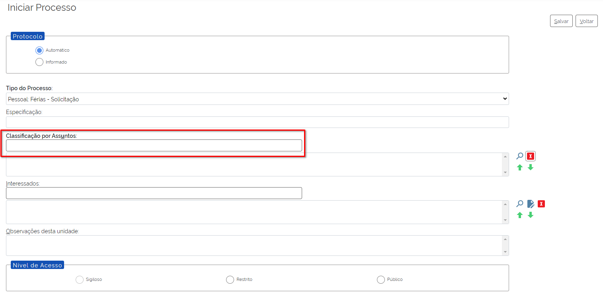
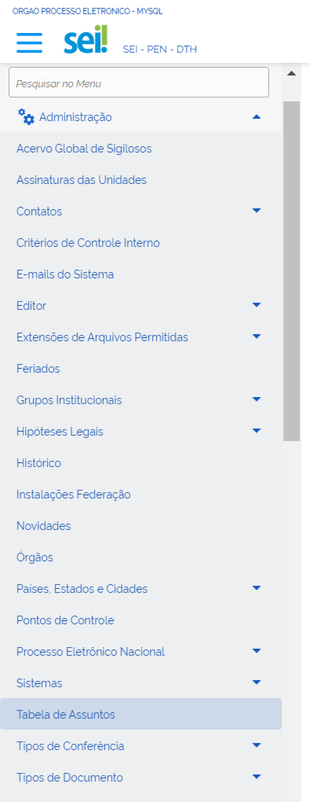
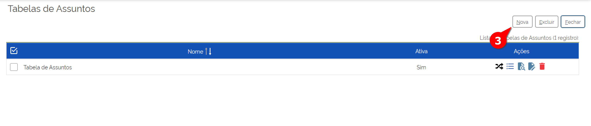
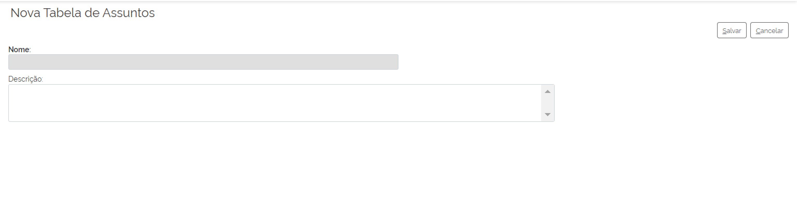
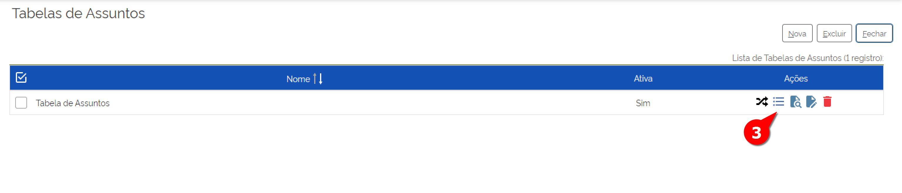

Tabela de Assuntos
===================

É notável que as instituições têm investido cada vez mais em ações que oportunizam o acesso à informação e aos arquivos públicos. Nesse cenário, o tratamento da informação é requisito fundamental para a disponibilização desses arquivos públicos enquanto instrumento de garantia dos direitos do cidadão. Por sua vez, o acesso às informações viabiliza o funcionamento eficiente da Administração Pública e atende às exigências da Lei nº 12.527/2011, Lei de Acesso à Informação (LAI).

No SEI, parte dessas exigências são atendidas por meio da funcionalidade “Tabela de Assuntos”, que serve de base para a parametrização dos tipos de processos. Assim, todo processo aberto no SEI tem assuntos associados, a fim de viabilizar uma melhor classificação. Acompanhe a disposição do campo “Classificação por Assuntos” na figura a seguir, que apresenta uma tela do SEI.

.. admonition:: Nota

   A lista de assuntos, que poderá ser previamente carregada pela equipe de TI, está disponível no site Software Público, Base de Referência do Executivo. Entrando no site softwarepublico.gov.br, haverá um link para acessar documentos do SEI. Do lado direito inferior da tela, é necessário clicar em “Base Dados Executivo” no menu DOWNLOAD. No final da nova tela aberta, haverá um link para fazer o download da base de dados.

Tabela de Assuntos Versus Tabela de Temporalidade 
--------------------------------------------------

A tabela de temporalidade é um instrumento arquivístico resultante de avaliação, que tem por objetivos definir os prazos de guarda e destinação de documentos, com vista a garantir o acesso à informação a quantos dela necessitem. Sua estrutura básica deve necessariamente contemplar os conjuntos documentais produzidos e recebidos por uma instituição no exercício de suas atividades, os prazos de guarda nas fases corrente e intermediária, a destinação final (eliminação ou guarda permanente), além de um campo para observações necessárias à sua compreensão e aplicação.

Os prazos de guarda e destinação final devem estar presentes na tabela de temporalidade do órgão ou entidade. São definidos com base na estimativa de uso, se os documentos devem ser mantidos no arquivo corrente ou no arquivo intermediário e qual a destinação final.

O SEI permite que o usuário cadastre a temporalidade do documento, de acordo com os objetivos imediatos, a frequência de uso ou em função do seu valor, conforme características detalhadas a seguir:

* **Arquivo corrente:** Conjunto de documentos que, pelo seu valor primário, é objeto de consultas frequentes pela entidade que o produziu, a quem compete a sua administração.
* **Arquivo intermediário:** Conjunto de documentos originários de arquivos correntes, com uso pouco frequente nos órgãos produtores e que aguarda a eliminação ou o recolhimento para guarda permanente. É também chamado de pré-arquivo. 
* **Arquivo permanente:** Conjunto de documentos preservados em caráter definitivo em razão de seu valor histórico, probatório e informativo. É também chamado de arquivo histórico.

A tela de Tabela de Assuntos é a tela principal desse tema, que irá permitir realizar as ações referentes às Tabelas de Assuntos (Cadastramento de nova tabela, Alteração, Exclusão, Ativação, Mapeamento, Acesso aos Assuntos), bem como ações referentes aos Assuntos propriamente ditos. Ambos os casos serão abordados a seguir. 

Para acessar a tela de Tabela de Assuntos (que, além de mostrar a Tabela de Assuntos, exibirá as funcionalidades relacionadas a ela), é necessário seguir os seguintes passos:

01. No Menu Principal, acessar “Administração”;

02. Clicar em “Tabela de Assuntos”.

 
A tela de Tabela de Assuntos será exibida: 

.. figure:: _static/images/04-17_Tabela-Assuntos_Lista.png

Cadastrar Nova Tabela de Assuntos
---------------------------------

Para cadastrar uma nova Tabela de Assuntos, o Administrador do SEI deve seguir com os seguintes passos: 

01. No Menu Principal, acessar “Administração”

02. Clicar em “Tabela de Assuntos”;

 
A tela de Tabela de Assuntos será exibida: 

03. Clicar em “Nova”;

A tela de Nova Tabela de Assuntos será exibida: 

04. Preencher os seguintes campos:

- **Nome:** Nome da Tabela de Assuntos
- **Descrição:** Detalhamento da nova tabela de Assuntos

05. Clicar em Salvar.

Pronto, a nova Tabela foi cadastrada.

Ativar Nova Tabela de Assuntos
------------------------------

**(Em construção)**

Alterar Tabela de Assuntos
---------------------------

Caso o Administrador precisar alterar a Tabela de Assuntos, ele deve seguir os seguintes passos:

01. No Menu Principal, acessar “Administração”;

02. Clicar em “Tabela de Assuntos”;

 
A tela de Tabela de Assuntos será exibida: 

.. figure:: _static/images/04-17_Tabela-Assuntos_Lista_Alterar.png

03. Localizar a Tabela de Assuntos que deseja alterar e clicar em “Alterar”;

A tela de Alterar Tabela de Assuntos será exibida: 

.. figure:: _static/images/04-17_Tabela-Assuntos_Tela_Alterar-Tabela-de-Assuntos.png

04. Alterar os campos pertinentes;

05. Clicar em Salvar.

Pronto, a Tabela de Assuntos foi alterada.

Excluir Tabela de Assuntos
--------------------------

Caso o Administrador precisar excluir a Tabela de Assuntos, ele deve seguir os seguintes passos:

.. admonition:: Nota
 
   Ao contrário de outras funcionalidades a Tabela de Assuntos não apresenta o recurso “Desativar”, apresentando somente o recurso Excluir. E assim como nas outras funcionalidades, a exclusão da Tabela de Assuntos é uma ação irreversível.  

01. No Menu Principal, acessar “Administração”;

02. Clicar em “Tabela de Assuntos”;

 
A tela de Tabela de Assuntos será exibida: 

.. figure:: _static/images/04-17_Tabela-Assuntos_Lista_Excluir.png

03. Localizar a Tabela de Assuntos que deseja alterar e clicar em “Excluir”;

04. Confirmar ação.

Pronto, a Tabela de Assuntos foi excluída.

Cadastrar Novo Assunto
-----------------------

Para cadastrar novos assuntos dentro de uma tabela já cadastrada, o Administrador do SEI deve realizar os seguintes passos:

01. No Menu Principal, acessar “Administração”;

02. Clicar em “Tabela de Assuntos”;

 
A tela de Tabela de Assuntos será exibida: 

03. Localizar a Tabela de Assuntos em que deseja cadastrar um novo assunto e clicar em “Assuntos da Tabela”;

A tela de Assuntos será exibida com os Assuntos pertencentes àquela tabela. 

.. figure:: _static/images/04-17_Tabela-Assuntos_Lista_Assuntos-da-Tabela-Novo.png

04. Clicar em “Novo”;

A tela de “Novo Assunto” será exibida:

.. figure:: _static/images/04-17_Tabela-Assuntos_Lista_Assuntos-da-Tabela-Novo.png

05. Preencher os seguintes campos: 

* **Tabela**

Este campo já vem preenchido automaticamente;

* **Código**

Informar o código (Modelo adotado pela Resolução nº 14, de 24 de outubro de 2001) correspondente ao assunto a ser registrado.

* **Descrição**

Informar o nome do assunto, por exemplo, classe, subclasse, grupo e subgrupo. Deve-se lembrar que não se nomeia o assunto com palavras no plural.

* **Item apenas estrutural**

Selecionar esta opção quando se tratar de código meramente agrupador, ou seja, caso não haja temporalidade e destinação final a ele associados.

* **Prazos de Guarda (anos) Corrente**

Prazo de guarda corrente é o tempo que o documento fica sob a guarda do seu produtor, ou seja, informar o prazo constante na tabela de temporalidade relacionado à guarda na fase corrente do assunto em questão. 

* **Prazos de Guarda (anos) Intermitente**

Prazo de guarda intermitente é o tempo que o documento fica sob a guarda do arquivo intermediário esperando sua destinação final, que poderá ser a guarda permanente ou eliminação, ou seja, é necessário informar o prazo constante na tabela de temporalidade relacionado à guarda na fase intermediária do assunto em questão.

* **Destinação Final**

Selecionar a destinação constante na tabela de temporalidade relacionada ao assunto em questão.

Neste campo é registrada a destinação estabelecida que pode ser a eliminação, quando o documento não apresenta valor secundário (probatório ou informativo), ou a guarda permanente, quando as informações contidas no documento são consideradas importantes para fins de prova, informação e pesquisa.

06. Clicar em Salvar.

Alterar Assunto
---------------

Para alterar assuntos dentro de uma tabela já cadastrada, o Administrador do SEI deve realizar os seguintes passos:

01. No Menu Principal, acessar “Administração”;

02. Clicar em “Tabela de Assuntos”;

 
A tela de Tabela de Assuntos será exibida: 

03. Localizar a Tabela de Assuntos em que deseja alterar um Assunto e clicar em “Assuntos da Tabela”;

A tela de Assuntos será exibida com os Assuntos pertencentes àquela tabela. 

.. figure:: _static/images/04-17_Tabela-Assuntos_Lista_Assuntos-da-Tabela-Alterar.png

04. Clicar em “Alterar”;

A tela de “Alterar Assunto” será exibida:

.. figure:: _static/images/04-17_Tabela-Assuntos_Tela_Alterar-Tabela-de-Assuntos.png

05. Alterar os campos pertinentes; 

06. Clicar em Salvar.

Pronto, o Assunto foi alterado

Desativar Assunto
-----------------

É possível que o o Administrador necessite desativar assuntos dentro de uma tabela já cadastrada. 

Assim como em outros tópicos, o comando "Desativar" também é reversível, ao contrário do comando "Excluir". A reversão do comando "Desativar" é o comando "Reativar", que será visto logo em seguida.

Dito isso, para seguir com a desativação do Assunto, ele deve realizar os seguintes passos:

01. No Menu Principal, acessar “Administração”;

02. Clicar em “Tabela de Assuntos”;

 
A tela de Tabela de Assuntos será exibida: 

03. Localizar a Tabela de Assuntos em que deseja desativar um assunto e clicar em “Assuntos da Tabela”;

A tela de Assuntos será exibida com os Assuntos pertencentes àquela tabela. 

.. figure:: _static/images/04-17_Tabela-Assuntos_Lista_Assuntos-da-Tabela-Desativar.png

04. Clicar em “Desativar”;

05. Confirmar operação.

Pronto, o Assunto foi desativado daquela Tabela de Assuntos.

Reativar Assunto
----------------

Para reatiavr assuntos desativado, o Administrador do SEI deve realizar os seguintes passos:

01. No Menu Principal, acessar “Administração”;

02. Clicar em “Tabela de Assuntos”;

 
A tela de Tabela de Assuntos será exibida: 

03. Localizar a Tabela de Assuntos em que deseja reativar um assunto e clicar em “Assuntos da Tabela”;

A tela de Assuntos será exibida com os Assuntos pertencentes àquela tabela. 

.. figure:: _static/images/04-17_Tabela-Assuntos_Lista_Assuntos-da-Tabela-Reativar.png

04. Nesse caso, é necessário ativar a seleção "Incluir desativados"; 

Note que os Assuntos desativados estão marcados em vermelho

05. Localizar o assunto a ser reativado e Clicar em “Reativar”;

07. Confirmar operação.

Pronto, o Assunto daquela Tabela de Assuntos foi reativado novamente .

Excluir Assunto
---------------

É possível que o o Administrador necessite excluir assuntos dentro de uma tabela já cadastrada. 

Assim como em outros tópicos, o comando Excluir nesse caso também é irreversível, ao contrário do comando "Desativar"

Dito isso, para seguir com a exclusão do Assunto, ele deve realizar os seguintes passos:

01. No Menu Principal, acessar “Administração”;

02. Clicar em “Tabela de Assuntos”;

 
A tela de Tabela de Assuntos será exibida: 

03. Localizar a Tabela de Assuntos em que deseja excluir um  assunto e clicar em “Assuntos da Tabela”;

A tela de Assuntos será exibida com os Assuntos pertencentes àquela tabela. 

.. figure:: _static/images/04-17_Tabela-Assuntos_Lista_Assuntos-da-Tabela-Excluir.png

04. Clicar em “Excluir”;

05. Confirmar operação.

Pronto, o Assunto foi excluído daquela Tabela de Assuntos.
