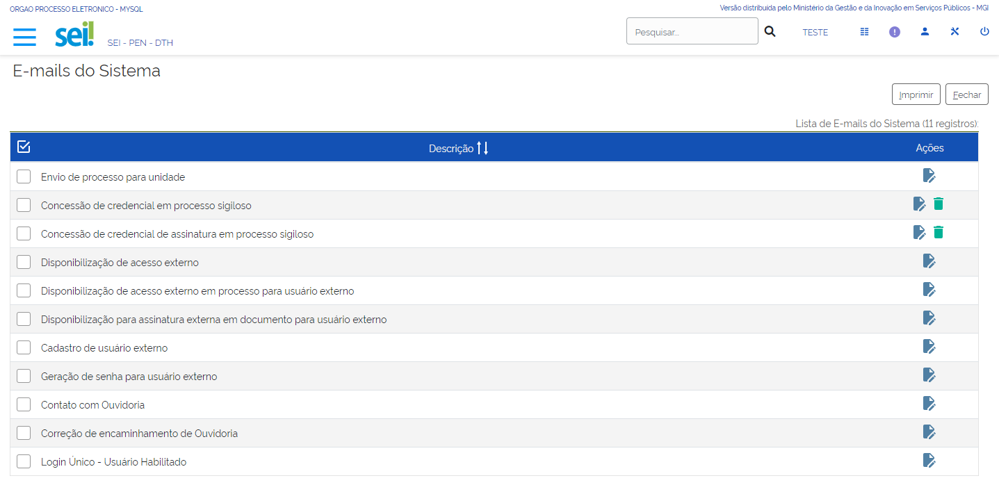
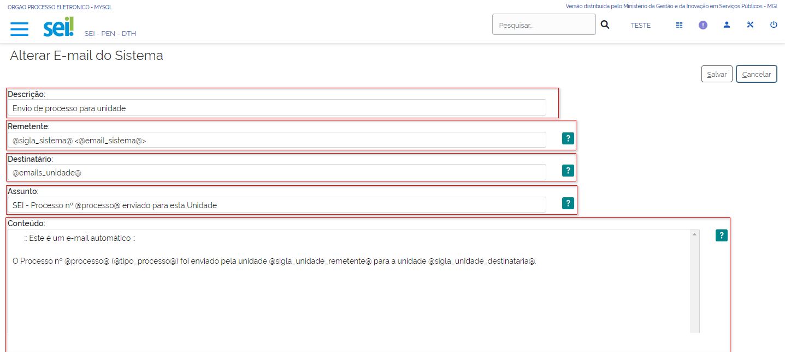

E-mails do Sistema
==================

Introdução a E-mails do Sistema
-------------------------------

O SEI pode enviar e-mails para os usuários em diversas situações por exemplo ao cadastrar um usuário externo ou para conceder uma credencial em processo sigiloso. 

.. figure:: _static/images/04-18_Introducao-a-Emails-do-Sistema_Lista_Inicio-Emails.png

Essas mensagens são geradas automaticamente porém é necessário configurar previamente o seu conteúdo. 

Para isso o usuário com perfil “Administrador” deverá acompanhar o caminho descrito a seguir:

1. Acesse o SEI e entre no menu principal;
2. Selecione a opção “Administração”;
3. Clique no item “E-mails do Sistema”.

.. figure:: _static/images/04-18_Introducao-a_Emails-do-Sistema_TelaSEI_Acessar-Email-do-Sitema.png

Em seguida abrirá uma nova tela denominada “E-mails do Sistema” listando os tipos de e-mails automáticos disponíveis no SEI. 

A imagem a seguir apresenta a disposição dos campos na tela “E-mails do Sistema”.

Funcionalidade "E-mails do Sistema"
-----------------------------------

À direita da tabela há uma coluna denominada “Ações” na qual existem dois ícones. São eles:

1. **Alterar E-mail do Sistema**: Pode-se editar o conteúdo do e-mail.
2. **Desativar E-mail do Sistema**: Desativa o e-mail. Apenas alguns e-mails apresentarão esta opção. Ressalta-se que uma vez desativado o e-mail continua sendo exibido porém o ícone de desativação agora é apresentado como “Reativar E-mail do Sistema”.

.. admonition:: Impotatante

   Não é possível incluir novos e-mails automáticos do sistema. Também não existe a opção de excluir definitivamente um e-mail.

Operacionalização: Alterar E-mails do Sistema
----------------------------------------------

Ao clicar na ação “Alterar E-mail do Sistema” abrirá uma nova tela com um formulário para edição dos dados do e-mail selecionado. 

**Campos a serem preenchidos**:

- **Descrição**: Neste campo aparece o nome do e-mail que é mostrado na lista de e-mails. Visível apenas para os usuários com perfil “Administrador”.
- **Remetente**: Deve ser informada a caixa de e-mail responsável pelo envio do correio eletrônico.
- **Destinatário**: Deve ser informada a caixa de e-mail das unidades ou pessoas que receberão o correio eletrônico.
- **Assunto**: Refere-se ao tema do e-mail ou seja deve conter uma breve descrição que estará visível na caixa de entrada do destinatário.
- **Conteúdo**: Este campo deve conter a mensagem automática que será enviada ao usuário.

_**Lembre-se de salvar a operação!**_

A imagem a seguir apresenta a disposição dos campos que compõem o formulário.

Operacionalização: Alterar E-mails do Sistema Versus Variáveis Disponíveis para Conteúdo
-----------------------------------------------------------------------------------------

Ressalta-se que o texto dos e-mails deve ser elaborado utilizando as variáveis do sistema. Elas são listadas ao se clicar no ícone “Ajuda” à direita de cada campo. A imagem a seguir apresenta as variáveis disponíveis para o campo “Conteúdo”.

.. figure:: _static/images/04-18_Operacionalizacao-Alterar-Emails-do-Sistema-Versus-Variaveis-Disponiveis-para-Conteudo_Lista_Variaveis-Conteudo-Email.png

Vamos reforçar nosso aprendizado sobre a funcionalidade ensinada com o vídeo a seguir:

.. _Clique aqui: https://cdn.evg.gov.br/cursos/304_EVG/videos/modulo06video01.mp4 para ver o vídeo.