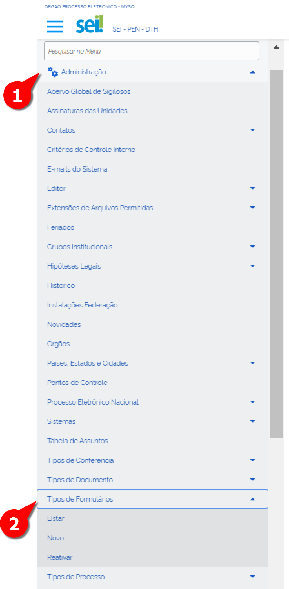
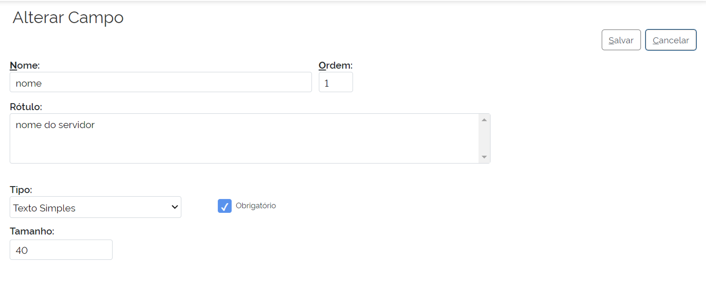
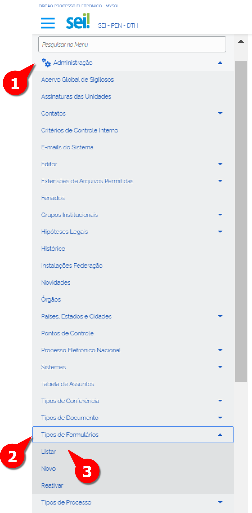
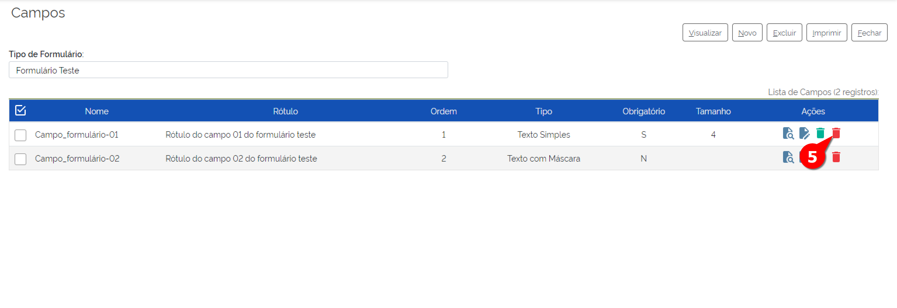
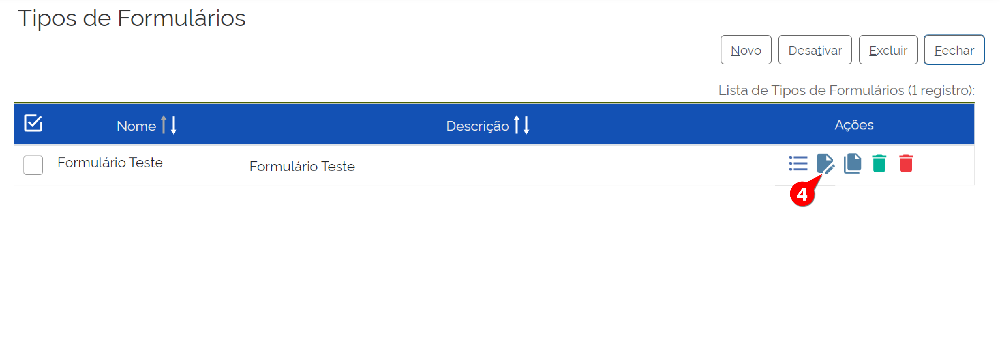

Tipos de Formulários
=====================

Essa funcionalidade permite a criação de formulários com checkbox, combo box, campos com máscara, definição de limites de textos, com preenchimento obrigatório ou não. Não permite formatação do layout do formulário, limitando, assim, a criação de documentos com visual atraente e apresentável. 

Sendo um capítulo extenso, é recomendável verificar os comandos e a relação com as funcionalidades que ele irá abordar: 

- Cadastrar Novo Tipo de Formulário
	- Cadastrar Novo Campo de formulário
	- Alterar Campo do Formulário
	- Desativar Campo do Formulário
	- Reativar Campo do Formulário
	- Excluir Campo do Formulário

- Alterar Tipo de Formulário
- Clonar Tipo de Formulário
- Desativar Tipo de Formulário
- Reativar Tipo de Formulário
- Excluir Tipo de Formulário

Cadastrar Novo Formulário
-------------------------

Para criar um novo formulário, o Administrador deve seguir os próximos passos: 

01. No Menu Principal, acessar “Administração”;
02. Acessar “Tipos de Formulários”;
03. Clicar em “Novo”;

A tela “Novo Tipo de Formulário” será exibida

.. figure:: _static/images/04-18_Tipos-Formularios_Tela-Tipo_de_Formulario_Novo.png

04. Preencher os campos: 

- **Nome:** Nome do Formulário
- **Descrição:** Descrição do Formulário

05. Clicar em Salvar.

O Formulário foi criado e disponibilizado na lista de Tipos de Formulário. 

O Formulário, para se fazer útil necessita de cadastro de novos campos para serem preenchidos pelo Usuário. O cadastro, alteração, exclusão dos novos campos seguem os próximos passos. 

Cadastrar Novo Campo do Tipo de Formulário
++++++++++++++++++++++++++++++++++++++++++

Os novos campos do Tipo de Formulário podem ser cadastrados na tela de “Tipos de Formulários” e a criação desses campos seguem da seguinte forma. 

01. No Menu Principal, acessar “Administração”;  

02. Acessar “Tipos de Formulários”;

03. Clicar em “Listar”;

.. figure:: _static/images/04-18_Tipos-Formularios_Menu-Listar.png

A tela com lista de Tipos de Formulários será exibida.

.. figure:: _static/images/04-18_Tipos-Formulários_Lista_Tipos_Campos.png

04. Localizar o Tipo de Formulário e clicar em “Campos do Tipo de Formulário”;

A tela “Campos” será exibida

.. figure:: _static/images/04-18_Tipos-Formularios_ListaCampos_Novo.png

05. Clicar em “Novo”;

A tela de “Novo Campo” será aberta

.. figure:: _static/images/04-18_Tipos-Formulários_Tela_Novo-Campo.png

06. Preencher os seguintes campos: 

• **Nome**: digitar o nome com letras minúsculas, sem caracteres especiais e sem espaço. Utilizar underline para separar as palavras. Exemplo: nome_usuario.

• **Ordem**: digitar a ordem que aparecerá no formulário. Por padrão, ao primeiro dá-se o valor 0 e aos próximos o número sequente.

• **Rótulo**: digitar o nome do campo que o usuário irá preencher.

• **Obrigatório**: selecionar esta opção caso o campo seja de preenchimento obrigatório.

• **Tipo**: trata-se do tipo de campo que o usuário irá preencher. Cada escolha que se fizer dentre as opções listadas, abre novos campos característicos que também precisam ser preenchidos/selecionados. O detalhamento de cada um dos campos do Tipo de Campo será abordado mais adiante em um tópico separado): 
	
     * Data
     * Dinheiro
     * Lista
     * Número Inteiro
     * Número com Decimais
     * Texto Grande
     * Texto Simples
     * Texto com Máscara
     * Opções
     * Sinalizador
     * Informação

07. Clicar em Salvar.

Pronto, o Novo Campo foi adicionado ao Tipo de Formulário.

.. admonition:: Notas

   Os Tipos de Campo são diferentes classes para atender de forma customizada como um Usuário irá preencher o Tipo de Formulário. 

• **Data**

O sistema solicita que se especifique a validação do campo. Deve-se escolher entre:

Nenhuma	Futuro
+-----------------------+-------------+
|Data atual ou futuro 	|Passado      |
|Data atual ou passado	|Intervalo    |
+-----------------------+-------------+

• **Dinheiro**

O sistema solicita um valor mínimo e um máximo. Se não houver, basta deixar em branco.

• **Lista**

Trata-se de relacionar as opções que estarão disponíveis para o usuário escolher em uma combo box

• **Número Inteiro**

Trata-se de um campo numérico em que se determina o número de caracteres e se há um valor mínimo e um máximo. Se não houver, basta deixar em branco.

• **Número com Decimais**

Trata-se de campo numérico com casas decimais em que se determina o número de caracteres e a quantidade de casas decimais, além dos valores mínimo e máximo. Se não houver, basta deixar em branco.

• **Texto Grande**

Trata-se de campo textual com limite de caracteres e de linhas a ser preenchido pelo usuário.

• **Texto Simples**

Trata-se de campo textual com limite de caracteres a ser preenchido pelo usuário.

• **Texto com Máscara**

Trata-se de campo com formatação padrão, como CEP, CPF, CNPJ. Ao clicar no ícone “Ajuda”, o sistema mostrará qual caractere deve ser usado.

• **Opções**

Trata-se de relacionar as opções que estarão disponíveis para o usuário escolher em uma checkbox. Deve-se escolher somente uma das opções listadas. A forma de preenchimento das variáveis é igual à “Lista”.

• **Sinalizador**

Trata-se de disponibilizar ao usuário opções a serem selecionadas por checkboxes.

• **Informação**

Trata-se de um texto que fará parte do formulário. Pode ser usada para colocar o título do documento ou uma instrução de preenchimento, por exemplo. É interessante combinar o uso do tipo “Sinalizador” com o “Informação”. Este para fazer a pergunta e aquele para listar as opções de resposta.

Alterar Campo do Tipo de Formulário
+++++++++++++++++++++++++++++++++++

Os campos do Tipo de Formulário podem ser alterados na tela de “Tipos de Formulários” e seguem da seguinte forma. 

01. No Menu Principal, acessar “Administração”;

02. Acessar “Tipos de Formulários”;

03. Clicar em “Listar”;

.. figure:: _static/images/04-18_Tipos-Formularios_Menu-Listar.png

A tela com lista de Tipos de Formulários será exibida.

.. figure:: _static/images/04-18_Tipos-Formulários_Lista_Tipos_Campos.png

04. Localizar o Tipo de Formulário cujo campo será alterado e clicar em “Campos do Tipo de Formulário”;

A tela “Campos” será exibida.

.. figure:: _static/images/04-18_Tipos-Formularios_ListaCampos_Alterar.png

05. Localizar o campo a ser alterado e clicar em “Alterar Campo”;

A tela "Alterar Campo" será exibida

06. Alterar os campos pertinentes;

07. Clicar em Salvar.

Pronto, o Campo do Tipo de formulário foi alterado.

Desativar Campos do Tipo de Formulário
++++++++++++++++++++++++++++++++++++++

A desativação de um Campo do Tipo de Formulário é uma ação reversível (utilizando o comando “Reativar”), ao contrário da função “Excluir”.

Para desativar um Campo do Tipo de Formulário, deve-se seguir os seguintes passos:

01. No Menu Principal, acessar “Administração”;  

02. Acessar “Tipos de Formulários”;

03. Clicar em “Listar”;

.. figure:: _static/images/04-18_Tipos-Formularios_Menu-Listar.png

A tela com lista de Tipos de Formulários será exibida.

.. figure:: _static/images/04-18_Tipos-Formulários_Lista_Tipos_Campos.png

04. Localizar o Tipo de Formulário cujo campo será alterado e clicar em “Campos do Tipo de Formulário”;

A tela “Campos” será exibida.

.. figure:: _static/images/04-18_Tipos-Formularios_ListaCampos_Desativar.png

05. Localizar o campo a ser desativado e clicar em “Desativar Campo”;

06. Confirmar ação.

Pronto, o Campo do Tipo de Formulário foi desativado. Essa ação pode ser revertida utilizando o comando “Reativar Campo do Formulário”, que será visto a seguir. 

Reativar Campo do Tipo de Formulário
++++++++++++++++++++++++++++++++++++

A reativação de um Campo do Tipo de Formulário é a ação que reverte o comando “Desativar” Campo do Formulário.

Para reativar um Campo do Tipo de Formulário, deve-se seguir os seguintes passos:

01. No Menu Principal, acessar “Administração”;  

02. Acessar “Tipos de Formulários”;

03. Clicar em “Listar”;

.. figure:: _static/images/04-18_Tipos-Formularios_Menu-Listar.png

A tela com lista de Tipos de Formulários será exibida.

.. figure:: _static/images/04-18_Tipos-Formulários_Lista_Tipos_Campos.png

04. Localizar o Tipo de Formulário cujo campo será reativado e clicar em “Campos do Tipo de Formulário”;

A tela “Campos” será exibida.

.. figure:: _static/images/04-18_Tipos-Formularios_ListaCampos_Reativar.png

05. Localizar o campo a ser reativado e clicar em “Reativar Campo”;

06. Confirmar ação.

Pronto, o Campo do Tipo de Formulário foi reativado.

Excluir Campo do Tipo de Formulário
+++++++++++++++++++++++++++++++++++

A exclusão de um Campo do Formulário é uma ação irreversível que deleta permanentemente o campo do formulário.

Para excluir um Campo do Formulário, deve-se seguir os seguintes passos:

01. No Menu Principal, acessar “Administração”;  

02. Acessar “Tipos de Formulários”;

03. Clicar em “Listar”;

A tela com lista de Tipos de Formulários será exibida.

.. figure:: _static/images/04-18_Tipos-Formulários_Lista_Tipos_Campos.png

04. Localizar o Tipo de Formulário cujo campo será excluído e clicar em “Campos do Tipo de Formulário”;

A tela “Campos” será exibida.

05. Localizar o campo a ser excljue clicar em “Excluir Campo”;

06. Confirmar ação.

Pronto, o Campo do Tipo de Formulário foi excluído.

Alterar Tipo de Formulário
--------------------------

Com o Formulário criado (e as ações referente aos campos descritas anteriormente), as ações com os Tipos de Formulários são retomadas a partir daqui. 

Para alterar o Tipo de Formulário, é preciso seguir os seguintes passos: 

01. No Menu Principal, acessar “Administração”;  

02. Acessar “Tipos de Formulários”;

03. Clicar em “Listar”;

.. figure:: _static/images/04-18_Tipos-Formularios_Menu-Listar.png

A tela com lista de Tipos de Formulários será exibida.

04. Clicar em “Alterar Tipo de Formulário”;

A tela “Alterar Tipo de Formulário será aberta”.

.. figure:: _static/images/04-18_Tipos-Formularios_Tela-Tipo_de_Formulário_Alterar.png

05. Alterar os campos pertinentes;

06. Clicar em Salvar.

Pronto, o Tipo de Formulário foi alterado.

Clonar Tipo de Formulário
-------------------------

Uma das funcionalidades mais práticas do SEI é a possibilidade de clonar trabalhos já elaborados anteriormente. Para o Tipo de Formulário também é apresentada essa funcionalidade. 

Para clonar o Tipo de Formulário, é preciso seguir os seguintes passos: 

01. No Menu Principal, acessar “Administração”;  

02. Acessar “Tipos de Formulários”;

03. Clicar em “Listar”;

.. figure:: _static/images/04-18_Tipos-Formularios_Menu-Listar.png

A tela com lista de Tipos de Formulários será exibida.

.. figure:: _static/images/04-18_Tipos-Formulários_ListaTipos-Clonar.png

04. Clicar em “Clonar Tipo de Formulário”;

A tela “Clonar Tipo de Formulário” será aberta. 

.. figure:: _static/images/04-18_Tipos-Formulários_Tela-Clonar_Tipo-de_Formulario.png

05. Selecionar o Tipo de Formulário Origem;

06. Preencher o Campo Nome Destino;

07. Clicar em Salvar.

Pronto, o Tipo de Formulário foi clonado.

Desativar Tipo de Formulário
----------------------------

A função “Desativar” também para o Tipo de Formulário é um recurso reversível. A reversibilidade dessa função é a Reativar Tipo de Formulário, que será visto a seguir.

Para desativar o Tipo de Formulário, é preciso seguir os seguintes passos: 

01. No Menu Principal, acessar “Administração”;  

02. Acessar “Tipos de Formulários”;

03. Clicar em “Listar”.

.. figure:: _static/images/04-18_Tipos-Formularios_Menu-Listar.png

A tela com lista de Tipos de Formulários será exibida.

.. figure:: _static/images/04-18_Tipos-Formulários_ListaTipos_Desativar.png

04. Clicar em “Desativar Tipo de Formulário”;

05. Confirmar ação.

Pronto, o Tipo de Formulário foi desativado.

Reativar Tipo de Formulário
---------------------------

A função “Reativar” também para o Tipo de Formulário é o recurso reversível da função “Desativar. 

Para reativar o Tipo de Formulário, é preciso seguir os seguintes passos: 

01. No Menu Principal, acessar “Administração”;  

02. Acessar “Tipos de Formulários”;

03. Clicar em “Listar”;

.. figure:: _static/images/04-18_Tipos-Formularios_Menu-Listar.png

A tela com lista de Tipos de Formulários será exibida.

.. figure:: _static/images/04-18_Tipos-Formularios_ListaTipos-Reativar.png

04. Clicar em “Reativar Tipo de Formulário”;

05. Confirmar ação.

Pronto, o Tipo de Formulário foi desativado.

Excluir Tipo de Formulário
--------------------------

A função “Excluir”, ao contrário da função “Desativar”, é irreversível.

Para reativar o Tipo de Formulário, é preciso seguir os seguintes passos: 

01. No Menu Principal, acessar “Administração”;  

02. Acessar “Tipos de Formulários”;

03. Clicar em “Listar”;

.. figure:: _static/images/04-18_Tipos-Formularios_Menu-Listar.png

A tela com lista de Tipos de Formulários será exibida.

.. figure:: _static/images/04-18_Tipos-Formularios_ListaTipos_Excluir.png
 
04. Clicar em “Excluir Tipo de Formulário”;

05. Confirmar ação.

Pronto, o Tipo de Formulário foi excluído.
