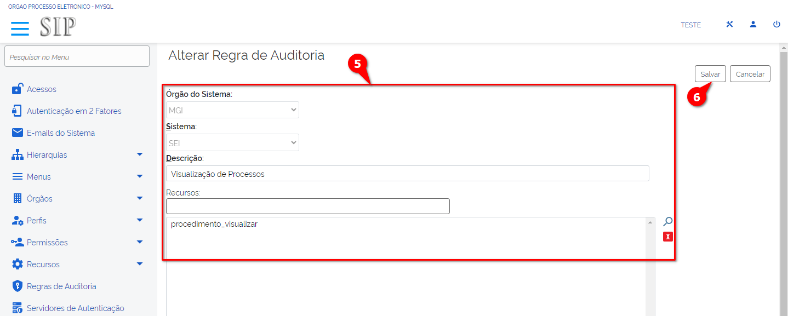

Regras de Auditoria
===================

Introdução às Regras de Auditoria
---------------------------------

Antes de entender o funcionamento da auditoria do SEI e do SIP é necessário saber que a pesquisa é feita por meio dos critérios de auditoria.

Atente-se pois a funcionalidade “Regras de Auditoria” é acessada pelo Sistema de Permissão (SIP). Nesse contexto o usuário deverá acessar o SIP e clicar na opção “Regras de Auditoria” localizada no menu principal. Feito isso você terá acesso à tela ”Regras de Auditoria”.

.. figure:: _static/images/04-21_Introducao-as-Regras-de-Auditoria_Tela_Regras-de-Auditoria.png

Regras de Auditoria
-------------------

As regras de auditoria são utilizadas para gerar relatórios das ações realizadas no SEI por determinado usuário de uma unidade em determinada data e hora bem como o seu IP de acesso navegador servidor recurso requisição e operação. 

Elas estão cadastradas no SIP para o SEI contemplando as seguintes categorias:

- Geral.
- Acessos e Usuários Externos.
- Visualização de Processos.
- Visualização de Documentos.

Além das categorias de regras o sistema apresenta uma coluna denominada “Ações” na qual o usuário pode consultar alterar desativar e excluir uma regra.

.. admonition:: Nota

   Ressalta-se que todas as regras criadas no SIP serão aproveitadas na geração de relatórios.

Manutenção na Funcionalidade “Regras de Auditoria”
--------------------------------------------------

No SIP o usuário com perfil “Administrador” pode realizar algumas ações tais como: cadastro de nova regra de auditoria, alteração de uma regra de auditoria existente, exclusão de uma regra de auditoria, consulta das regras de auditoria e inativação de uma regra de auditoria. 

Tais ações serão detalhadas a seguir. Para acessar essa funcionalidade o administrador deverá acompanhar o caminho descrito a seguir:

1. Acesse o SIP e clique no menu principal;
2. Agora selecione a opção “Regras de Auditoria”;
3. Identifique qual Regra você deseja;
4. E clique no ícone referente à ação desejada.

.. figure:: _static/images/04-21_Manutencao-na-Funcionalidade-Regras-de-Auditoria_TelaSIP_Acessar-Regras-de-Auditoria.png

Cadastro de Nova Regra de Auditoria no SIP
------------------------------------------

O cadastro de uma nova regra de auditoria deve ser realizado por meio do botão “Nova” localizado no canto superior direito da tela. Esse cadastro é composto das seguintes informações:

**Campos a serem preenchidos:**

- **Órgão do Sistema**: permite escolher qualquer órgão cadastrado.
- **Sistema**: permite escolher qualquer sistema cadastrado. 
- **Descrição**: campo destinado a uma síntese explicativa sobre o objetivo da regra ou seja deve ser feito um texto objetivo da regra.
- **Recursos**: no âmbito do SEI o recurso está relacionado a alguma funcionalidade. Por exemplo a funcionalidade assinar é gerenciada pelo recurso “document_assinar”. 

A imagem a seguir apresenta a disposição dos campos disponíveis na tela “Nova Regra de Auditoria”.

.. figure:: _static/images/04-21_Cadastro-de-Nova-Regra-de-Auditoria-no-SIP_Tela_Nova-Regra-de-Auditoria.png

Alteração de Regra de Auditoria no SIP
--------------------------------------

Para alterar uma regra de auditoria o usuário com perfil “Administrador” deverá acompanhar o caminho descrito a seguir:

1. Acesse o SIP e clique no menu principal;
2. Agora selecione a opção “Regras de Auditoria”;
3. Identifique qual Regra você deseja;
4. E clique no ícone “Alterar Regra de Auditoria”;
5. Preencha os campos solicitados;
6. E clique em “Salvar”.

.. figure:: _static/images/04-21_Alteracao-de-Regra-de-Auditoria-no-SIP_Tela_Acessar-Alterar-Regra-de-Auditoria.png

Dessa forma após seguir os passos supracitados pode-se alterar uma regra anteriormente cadastrada.

A imagem a seguir apresenta a disposição dos campos disponíveis na tela “Alterar Regra de Auditoria”.

.. figure:: _static/images/04-21_Alteraçao-de-Regra-de-Auditoria-no-SIP_Tela_Alterar-Regras-de-Auditoria.png

.. admonition:: Nota

   O conteúdo de qualquer campo pode ser alterado.

Exclusão de Regra de Auditoria
------------------------------

A ação de exclusão de uma ou mais regras de auditoria é realizada de duas maneiras: 

1. A primeira maneira é localizar a regra que se deseja excluir e clicar em “Excluir Regra de Auditoria” localizado na coluna “Ações” à direita da tabela. 
2. A segunda maneira é selecionar as checkboxes das regras que serão excluídas e em seguida clicar no botão “Excluir” localizado no menu superior à direita da tela. 

Depois disso aparece uma mensagem de confirmação da exclusão conforme imagem a seguir:

.. figure:: _static/images/04-21_Exclusao-de-Regra-de-Auditoria_Tela_Excluir-Regras-de-Auditoria.png

Consultar Regras de Auditoria
-----------------------------

Para consultar uma regra o usuário com perfil “Administrador” deverá acompanhar o caminho descrito a seguir:

1. Acesse o SIP e clique no menu principal;
2. Agora selecione a opção “Regras de Auditoria”;
3. Identifique qual Regra você deseja;
4. E clique no ícone “Consultar Regra de Auditoria”.

.. figure:: _static/images/04-21_Consultar-Regras-de-Auditoria_Tela_Acessar-Consultar-Regras-de-Auditoria.png

**CONSULTA**

A ação “Consulta” permite apenas consultar as informações das regras cadastradas por meio do SIP. São elas: órgão do sistema, sistema, descrição e recursos. 

Reforçamos que nesta ação as informações não podem ser alteradas apenas visualizadas. 

A imagem a seguir apresenta a disposição dos campos disponíveis na tela “Consultar Regra de Auditoria”.

.. figure:: _static/images/04-21_Consultar-Regras-de-Auditoria_Tela_Consultar-Regras-de-Auditoria.png