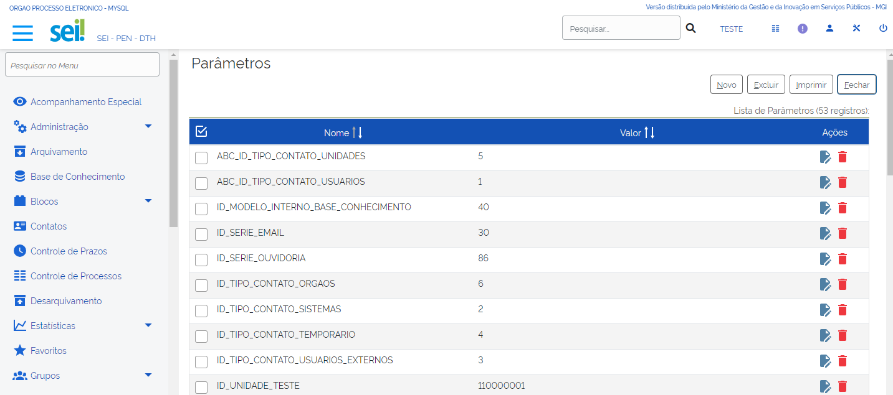
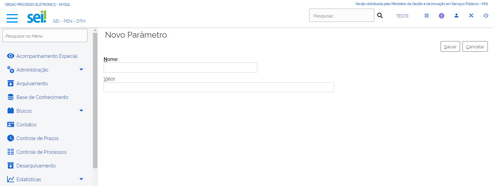

Parâmetros
==========

Introdução aos Parâmetros
-------------------------

Os parâmetros são variáveis que permitem a realização de configurações no sistema.

.. figure:: _static/images/04-25_Introdução-aos-Parâmetros_Dica_Parametros-do-SEI.png

Para acessar essa funcionalidade o usuário com os perfis “Administrador” e “Informática” do SEI deve acompanhar o caminho descrito a seguir:

1. Acesse o SEI e entre no menu principal;
2. Selecione a opção “Infra”;
3. Clique no item “Parâmetros”.

.. figure:: _static/images/04-25_Introdução-aos-Parâmetros_TelaSEI_Acessar-Parametros.png

.. admonition:: Destaque

   É importante ressaltar que apenas usuários com o perfil “Informática” têm acesso ao item “Infra”. Portanto, o usuário apenas com o perfil “Administrador” não tem acesso a essa funcionalidade.

Tabela de Parâmetros
--------------------

A seguir você irá conhecer uma lista de parâmetros nativos do SEI e suas respectivas descrições.

.. admonition:: Destaque

   Atente-se! Pois o conteúdo apresentado a seguir é a base da funcionalidade “Parâmetros” e poderá servir de apoio para a inclusão dos novos parâmetros.

.. list-table::
   :widths: 20 35
   :header-rows: 1

   - * NOME
     * DESCRIÇÃO
   - * ID_MODELO_BASE_CONHECIMENTO
     * Modelo de documento utilizado pelo eDoc para geração de Bases de Conhecimento.
   - * ID_MODELO_INTERNO_BASE_CONHECIMENTO
     * Modelo de documento utilizado pelo editor web para geração de Bases de Conhecimento.
   - * ID_SERIE_EMAIL
     * ID do tipo de documento e-mail (valor serie.id_serie correspondente).
   - * ID_UNIDADE_TESTE
     * Identificador da unidade de teste do sistema (unidade.id_unidade). Essa unidade deve existir pois é utilizada temporariamente em algumas chamadas de WebServices.
   - * SEI_EMAIL_ADMINISTRADOR
     * Endereço para envio de e-mails informando erro em agendamentos de tarefas do sistema (mais de um e-mail pode ser informado utilizando vírgula como separador).
   - * SEI_EMAIL_SISTEMA
     * Endereço de e-mail utilizado para mensagens enviadas pelo sistema.
   - * SEI_HABILITAR_ASSINATURA_DOCUMENTO_EXTERNO
     * 0 - desabilitado 1 - habilitado somente para unidades de protocolo
   - * SEI_HABILITAR_GRAU_SIGILO
     * 0 - desabilitado 1 - opcional 2 - obrigatório
   - * SEI_HABILITAR_HIPOTESE_LEGAL
     * 0 - desabilitado 1 - opcional 2 - obrigatório
   - * SEI_HABILITAR_MOVER_DOCUMENTO
     * 0 - desabilitado 1 - habilitado somente para unidades de protocolo 2 - habilitado para todos os usuários
   - * SEI_HABILITAR_NUMERO_PROCESSO_INFORMADO
     * Ao gerar um processo exibe um campo para digitação do número e da data de autuação do processo: 0 - desabilitado 1 - habilitado somente para unidades de protocolo 2 - habilitado para todos os usuários
   - * SEI_HABILITAR_VALIDACAO_CPF_CERTIFICADO_DIGITAL
     * 0 - desabilitado 1 - habilitado (o CPF do certificado deverá ser igual ao do usuário assinante)
   - * SEI_HABILITAR_VALIDACAO_EXTENSAO_ARQUIVOS
     * Valor do campo “sistema.id_sistema” referente ao sistema SEI na base de dados do SIP.
   - * SEI_MASCARA_NUMERO_PROCESSO_INFORMADO
     * -
   - * SEI_MSG_AVISO_CADASTRO_USUARIO_EXTERNO
     * Exibe um aviso para os usuários externos antes de efetuarem o cadastro no sistema. Se este campo estiver vazio nenhuma mensagem será apresentada e o usuário será direcionado diretamente para o formulário de cadastro.
   - * SEI_NUM_FATOR_DOWNLOAD_AUTOMATICO
     * Opcional. Permite limitar o download automático de arquivos externos de acordo com a velocidade de transferência de dados do usuário. Se a velocidade do usuário for 150kb/s e o fator for configurado com 5 então para arquivos maior que a definida 750kb (150 x 5) será exibido um link para o usuário ao invés de iniciar automaticamente o download. As velocidades de transferência dos usuários podem ser consultadas pelo menu “Infra” e clicando em “Velocidades de Transferência de Dados”. Obs.: a velocidade somente será atualizada quando o usuário visualizar um documento externo maior que 256kb.
   - * SEI_NUM_MAX_DOCS_PASTA
     * Informa o número de documentos para agrupamento em pastas na árvore de processo (deixar vazio para não realizar agrupamento).
   - * SEI_SUFIXO_EMAIL
     * Sufixo adicionado em e-mails enviados pelo sistema corresponde ao valor da variável “sufixo_email”.
   - * SEI_TAM_MB_ANEXO_EMAIL
     * 10 (valor em Mb) deve refletir o valor configurado no servidor de e-mail da instituição.
   - * SEI_TAM_MB_DOC_EXTERNO
     * Parâmetro responsável pela definição do tamanho máximo do upload de arquivos para documentos externos. 200 (valor em Mb) é necessário também configurar no php.ini as variáveis “post_max_size” 256M e “upload_max_filesize” 200M.
   - * SEI_VERSAO
     * Indica a versão instalada do sistema.
   - * SEI_WS_NUM_MAX_DOCS
     * Indica o número máximo de documentos que podem ser gerados simultaneamente em um processo (através da API de WebServices do SEI).
                                                                                                                                                                                                               |

Manutenção de Parâmetros
------------------------

O usuário com os perfis “Administrador” e “Informática” pode realizar as seguintes ações de manutenção na funcionalidade “Parâmetros”: inclusão, alteração e exclusão de parâmetro. 

A tela dessa funcionalidade é apresentada da seguinte maneira:

Inclusão de Novo Parâmetro
--------------------------

É possível cadastrar novos parâmetros e com a inclusão de módulos no sistema geralmente novos parâmetros são adicionados à lista. Por exemplo: o parâmetro “VERSAO_MODULO_PEN” contém a versão do módulo do barramento de serviços do PEN. 

A tela de cadastro de um parâmetro é composta pelos campos “Nome” e “Valor”. Ressalta-se que apenas o campo “Nome” é de preenchimento obrigatório. 

A imagem a seguir apresenta a disposição dos campos descritos.

Vamos reforçar nosso aprendizado sobre a funcionalidade ensinada com o vídeo a seguir

Clique `[aqui] <https://cdn.evg.gov.br/cursos/304_EVG/videos/modulo07video04.mp4>`_ para ver o vídeo.

Alteração de Parâmetro
----------------------

No SEI é possível alterar parâmetros cadastrados anteriormente, porém apenas o conteúdo informado no campo “Nome” pode ser alterado. 

A imagem a seguir apresenta a tela “Alterar Parâmetro”.

.. figure:: _static/images/04-25_Alteracao-de-Parametro_Tela_Alterar-Parametro.png

Exclusão de Parâmetro
----------------------

A ação “Excluir Parâmetro” pode ser realizada de duas maneiras:

1. A primeira maneira é localizar o parâmetro que se deseja excluir e clicar em “Excluir Parâmetro” localizado na coluna “Ações” à direita da tabela.

2. A segunda maneira é selecionar as checkboxes dos parâmetros que serão excluídos e em seguida clicar no botão “Excluir” localizado no menu superior à direita da tela.

Depois disso, aparece uma mensagem de confirmação da exclusão conforme imagem a seguir:

.. figure:: _static/images/04-25_Exclusao-de-Parametro_Tela_Excluir-Parametro.png