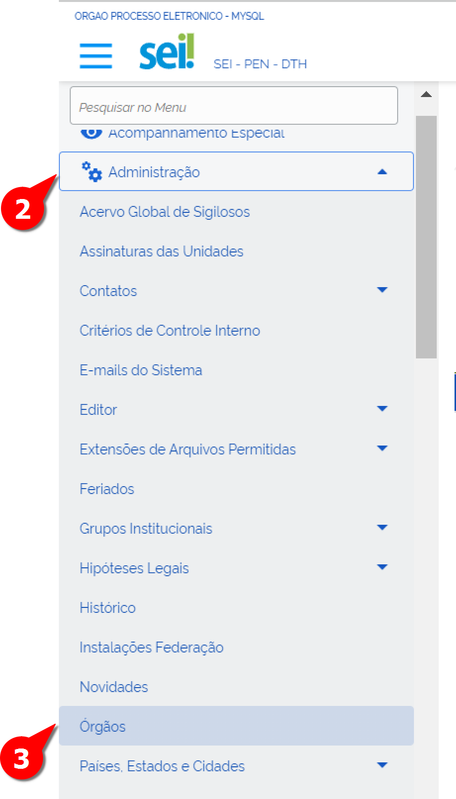

Criação e Configuração de Órgãos
================================

Iremos mostrar a seguir que o SEI pode ser configurado para ser utilizado por um único órgão ou para ser compartilhado por um conjunto de órgãos por meio de uma instalação multiórgãos.

No caso da utilização do sistema por uma única instituição a indicação do nome e sigla do órgão é feita durante o processo de instalação da ferramenta.

Mas caso a opção seja por uma instalação multiórgãos cada novo órgão deve ser cadastrado no SIP e configurado no SEI.

Por questões didáticas imagine o seguinte exemplo onde temos a estrutura imaginária de um órgão fictício que aderiu ao SEI recentemente e precisa configurar a sua estrutura organizacional o ministério XPTO com as suas três secretarias A B e C que por sua vez apresentam respectivamente os seus departamentos A1 A2 B1 B2 C1 e C2. 

Novo Órgão no SIP
-----------------

A criação de órgãos no SIP deve ser utilizada para os casos de utilização do SEI por mais de uma instituição no formato multiórgãos. Nesses casos os demais órgãos que utilizarão a ferramenta serão criados no SIP.

Para criar um novo órgão no SIP o usuário com perfil "Administrador" deverá seguir os seguintes passos:

01. Acessar o sistema com os dados fornecidos pela equipe do PEN;

.. figure:: _static/images/02-01_Criacao-Orgaos_Tela_SIP.png

02. Acessar o Menu Principal;

03. Selecionar a opção“Órgãos”;

04. Clicar na opção “Novo”;

.. figure:: _static/images/02-01_Criacao-Orgaos_MenuSIP_Novo-Orgao.png

Ao selecionar a opção “Novo” será aberta uma tela com os campos Sigla Descrição Ordem e Autenticar Usuários neste Órgão. 

05. Preencher os campos baseado no organograma do Ministério ASDF

- **Sigla**

Deverá ser preenchido com a sigla oficial do órgão. No nosso exemplo utilizaremos a sigla "XPTO".

- **Descrição**

Deverá ser preenchido com o nome completo do órgão. No nosso exemplo utilizaremos o nome "Ministério fictício XPTO".

- **Ordem**

Trata-se de um campo que permite alterar a posição do órgão na lista da tela de login do SEI. Órgãos compartilhando o mesmo valor para esse campo (por exemplo “0”) serão ordenados alfabeticamente pela sigla.

- **Autenticar Usuários neste Órgão**
 
Ao selecionar esta opção aparecerá outro campo para a indicação dos servidores de autenticação associados caso existam.

- **Clicar em Salvar** 

Ao finalizar o preenchimento é necessário clicar no botão “Salvar”. Com isso o órgão será criado e será exibida a lista de todos os órgãos pertencentes àquela estrutura. A imagem a seguir apresenta a tela que aparece após salvar a operação.

.. figure:: _static/images/02-01_Criacao-Orgaos_ListaSIP_Novo-Orgao.png

Configuração de Órgãos
----------------------

A configuração de um novo Órgão é uma etapa importante e deve ser realizada no SEI após a criação do novo Órgão no SIP. Assim deve-se seguir os seguintes passos

01. Acessar o SEI;

.. figure:: _static/images/02-01_Criacao-Orgaos_TelaInicial-SEI.png

.. admonition:: Nota

   Como ainda não foram cadastrados usuários para o órgão foram utilizados o usuário “teste” e a senha “teste” no órgão raiz (ID 0) para acessar o menu que permite a configuração do órgão recém-criado.

02. Acessar Administração;

03. Clicar na opção Órgãos;

Ao acessar o menu "Órgãos" será exibida a relação de órgãos cadastrados no ambiente como a figura abaixo:  

.. figure:: _static/images/02-01_Criacao-Orgaos_Lista-Orgaos.png

Além de acessar os órgãos cadastrados é possível executar três ações: 

- Consultar órgão |consultar_orgao|: permite consultar os dados cadastrados naquele órgão.

- Alterar órgão |alterar_orgao|: permite cadastrar os dados daquele órgão (será detalhado a seguir) 

.. |alterar_orgao| image:: _static/images/iconeSEI_Alterar.png
   :align: middle
   :width: 30

- Histórico do Órgão |historico_orgao|: permite acessar o histórico daquele órgão

.. |historico_orgao| image:: _static/images/iconeSEI_Histórico.png
   :align: middle
   :width: 30

Ação Alterar Órgão
++++++++++++++++++

Ao clicar no ícone “Alterar Órgão” você terá acesso a uma nova tela que apresentará o formulário para cadastramento das informações base da instituição.

Códigos
~~~~~~~

Seção dividida em dois campos numéricos: 
  
- SIP - campo preenchido automaticamente. Refere-se ao número de controle interno de relacionamento do SIP com o SEI. Não é recomendado sua alteração. 
- SEI - deve ser preenchido com um número de controle do órgão. Pode ser um código interno da instituição Siorg ou mesmo um código de Unidade Protocolizadora (UP).

.. figure:: _static/images/02-01_Criacao-Orgaos_Tela_Alterar-Órgão.png

Contato Associado
~~~~~~~~~~~~~~~~~

A funcionalidade dos contatos permite que pessoas físicas e jurídicas sejam cadastradas no sistema. Ressalta-se que essa seção é dividida em três partes: 
  
- Sigla – deverá ser preenchido com a sigla associada ao órgão que está sendo cadastrado. 
- Nome - deverá ser preenchido com o nome completo do órgão que está sendo cadastrado.
- Alterar dados do contato associado - essa opção abre uma tela para cadastro de dados do contato associado. É o local onde são indicados entre outras coisas endereço e-mail e telefones do órgão. Acompanhe na imagem a seguir a disposição desses campos na tela.

.. figure:: _static/images/02-01_Criacao-Orgaos_Tela_Alterar-Contato.png

Formato da Numeração
~~~~~~~~~~~~~~~~~~~~

Campo destinado à configuração do formato do número do processo. Por exemplo no Poder Executivo Federal o padrão numérico adotado é o Número Único de Protocolo (NUP) e sua composição é:

.. figure:: _static/images/02-01_Criacao-Orgaos_Diversos_Numeracao-NUP.png

.. admonition:: Fonte

    https://www.gov.br/gestao/pt-br/assuntos/processo-eletronico-nacional/conteudo/numero-unico-de-protocolo-nup

Para compor esse padrão numérico é necessário utilizar as variáveis oferecidas pelo SEI. Ao clicar no ícone “Ajuda” ao lado direito do campo será exibida uma lista com todas as variáveis possíveis para composição do número conforme exemplo a seguir:

.. figure:: _static/images/02-01_Criacao-Orgaos_Diversos_variáveis.png

Note que no SEI as variáveis se caracterizam por estarem entre @. Para montar a estrutura do NUP serão utilizadas variáveis específicas para cada parte do número:

- Código da UP: @cod_unidade_sei_05d@
- Observe que no código UP supracitado existe a informação “05d” que indica a quantidade de dígitos no campo nesse caso corresponde à 5 dígitos.
- Sequencial numérico: @seq_anual_cod_unidade_sei_06d@
- Ano do documento: @ano_4d@
- Dígito verificador: @dv_mod11_executivo_federal_2d@
- A máscara do número (sinais como “/” “.” “-“) devem ser inseridas manualmente no momento de compor a numeração.

Ao final o campo ficará preenchido da seguinte forma:
  
  @cod_unidade_sei_05d@.@seq_anual_cod_unidade_sei_06d@/@ano_4d@-@
  dv_mod11_executivo_federal_2d@

Checkboxes
~~~~~~~~~~

As unidades deste órgão podem receber processos: ao selecionar esta opção suas unidades estarão disponíveis para receber processos. Desmarcar esta opção se aplica aos casos em que não é interessante que as unidades recebam processo por exemplo no caso da extinção de um órgão.

As unidades deste órgão podem publicar documentos: ao selecionar esta opção suas unidades poderão publicar os documentos selecionados nos veículos de publicação disponíveis no SEI.

Corretor Ortográfico
~~~~~~~~~~~~~~~~~~~~

Nesta seção é possível selecionar um dos tipos de corretor ortográfico que será utilizado no editor de textos do SEI conforme as opções a seguir:
  
- Nenhum: nenhum corretor ortográfico será utilizado no editor de textos do SEI.
  
- Nativo do Navegador: o editor de textos do SEI utilizará o próprio corretor ortográfico do navegador. Sendo assim haverá variação dependendo do navegador
  utilizado por exemplo Mozilla Firefox Google Chrome Internet Explorer.
  
- Licenciado: opção indicada para as instituições que optarem por adquirir uma solução de corretor ortográfico exclusiva. Ao selecionar esta opção será exibido um campo para informar o endereço do servidor do corretor ortográfico adquirido pelo órgão.

Timbre
~~~~~~

Esta opção permite realizar a seleção da imagem que servirá como timbre do órgão. O timbre será exibido no topo dos documentos criados na instituição. A imagem pode representar a logo da instituição ou algum outro símbolo sempre respeitando os padrões estabelecidos de redação oficial.

.. admonition:: Notas

   1. Ressalta-se que o formato de arquivo recomendado para a imagem é o “.png”. Como exemplo utilizaremos o Brasão da República.
   2. Lembre-se de salvar a operação clicando no botão “Salvar” localizado na parte superior direita da tela!
