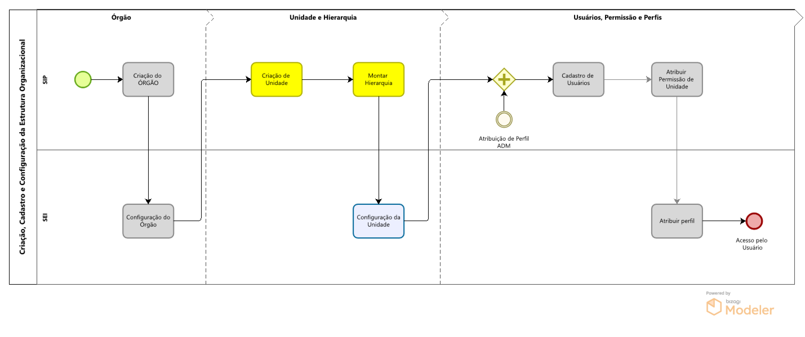
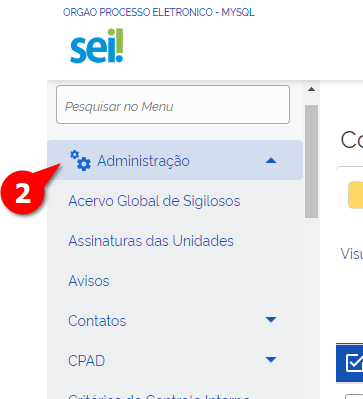
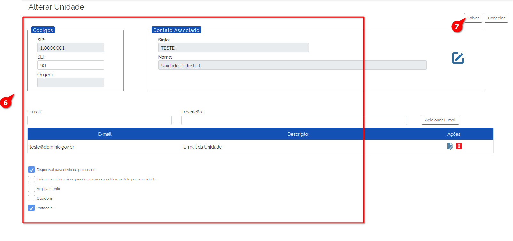

Configuração de Unidades
=========================

Conforme conversado na Introdução da Configuração da Estrutura Organizacional, a Configuração de Unidades faz parte da segunda etapa necessária para a montagem da Estrutura Organizacional, bem como a a criação de Unidades e a montagem da Hierarquia.

Após a criação do órgão no SIP e a Configuração no SEI, é necessário criar as unidades administrativas que farão parte da estrutura da instituição. Seguindo a mesma lógica utilizada na criação do órgão no modelo multiórgãos, as unidades também são criadas no SIP e configuradas no SEI. 

Para facilitar esse entendimento e exemplificar o conteúdo tratado aqui, continuaremos utilizando o organograma do Ministério XPTO.

Assim, sendo temos a seguinte abordagem nesse capítulo: 

Note para dois aspectos na figura: assim como na figura do processo geral, essa também apesar de ter sido gerado em um software próprio para desenho de processos, a figura acima não segue as boas práticas do BPMN e tem somente caráter ilustrativo e didático.

A segunda questão é que a parte em destaque, as duas caixas em amarelo e azul) são as que serão abordadas aqui nesse capítulo. Seguindo o padrão do primeiro desenho, caixas em amarelo são executadas no SIP e as azuis no SEI.

Configuração de Unidades no SEI
-------------------------------

Após a criação das unidades no SIP, é necessário configurá-las no SEI para que possam ser utilizadas. Para isso, deve-se seguir os passos abaixo:

1. Acessar o SEI com os dados fornecidos.

2. No Menu Principal, selecionar a opção “Administração”.

3. Acessar “Unidades”.

4. Clicar em "Listar"

.. figure:: _static/images/03-021_Configuração-Unidade_Menu_Adm_Unidade02.png

A tela com a Lista de Unidades será exibida.

.. figure:: _static/images/03-02_Criacao-Unidade_Lista_Unidades.png

5. Selecionar a unidade recém-criada para configuração.

6. Na tela de configuração de unidades, preencher os seguintes campos:

- **Código**: Número de controle da unidade. No Poder Executivo Federal, recomenda-se que seja preenchido com o código de Unidade Protocolizadora (UP).
- **Sigla**: Sigla da unidade, por exemplo, “SEC-A”.
- **Nome**: Nome completo da unidade, por exemplo, “Secretaria A”.
- **Contato**: Dados de contato da unidade, como endereço, telefone e e-mail.
- **Checkboxes**:
    - **Disponível para envio de processos**: Habilita a unidade para envio de processos.
    - **Enviar e-mail de aviso quando um processo for remetido para a unidade**: O sistema enviará um e-mail de aviso para a unidade.
    - **Unidade de arquivamento**: Define a unidade como unidade de arquivamento.
    - **Unidade de ouvidoria**: Define a unidade como unidade de ouvidoria.
    - **Unidade de protocolo**: Define a unidade como unidade de protocolo.

7. Após o preenchimento, clicar em “Salvar” para finalizar a configuração da unidade.

Pronto, a Configuração da Unidade no SEI foi realizada. 

Caso a criação da Hierarquia for estabelecida, é possível tratar a terceira parte desse módulo, que aborda a criação dos Usuários, Perfis e Permissões.